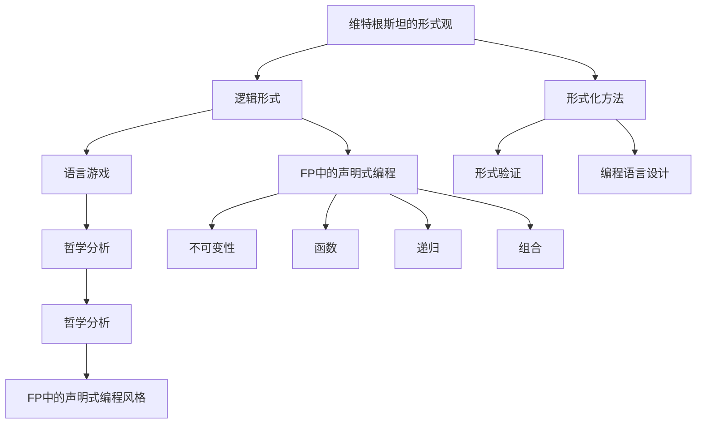
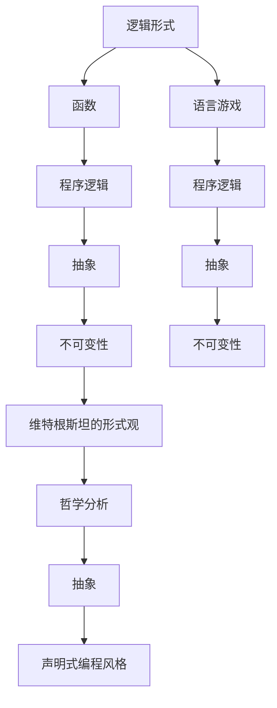

                 


### 文章标题：形式与内容的统一：维特根斯坦的形式观与FP中的声明式编程风格

### 关键词：维特根斯坦，形式观，函数式编程，声明式编程，形式逻辑，软件工程

### 摘要：
本文旨在探讨维特根斯坦的形式观与函数式编程（FP）中的声明式编程风格之间的内在联系。通过对维特根斯坦哲学思想的解读，结合FP的核心原则，我们分析了两者在形式与内容的统一性方面的共通之处。文章首先回顾了维特根斯坦的生平及其形式观的哲学背景，然后深入探讨了FP中的声明式编程风格，通过具体的算法原理讲解、数学模型分析以及实际项目实战，展示了这两种思想在计算机科学中的应用。最后，文章总结了全文的核心观点，并对未来的研究方向提出了建议。

## 1. 维特根斯坦的形式观

### 1.1 生平与哲学思想

路德维希·维特根斯坦（Ludwig Wittgenstein，1889-1951）是20世纪最杰出的哲学家之一，以其在语言哲学、数学哲学和逻辑哲学领域的贡献而闻名。他的哲学思想经历了两个主要阶段：早期的“逻辑原子主义”和后期的“日常语言哲学”。

维特根斯坦出生于奥地利，接受过良好的教育，后赴英国学习数学和哲学。他在剑桥大学期间与伯特兰·罗素（Bertrand Russell）和阿尔弗雷德·诺思·怀特海德（Alfred North Whitehead）等哲学家有过深入的交流。这些交流对维特根斯坦的思想产生了深远的影响。

早期的维特根斯坦深受逻辑原子主义的影响，认为世界是由不可分割的原子事实构成的，逻辑和数学是揭示这些事实的工具。然而，他逐渐发现这种观点的局限性，并转向日常语言哲学，主张哲学研究的重点应该是语言的日常使用，而不是抽象的数学和逻辑。

### 1.2 形式观的核心概念

维特根斯坦的形式观主要体现在他对语言和逻辑的研究中。他认为，逻辑和数学命题并不是在描述外部世界，而是在描述心灵的活动。具体来说，形式观包括以下几个核心概念：

- **逻辑形式**：维特根斯坦强调逻辑形式的独立性和普遍性。逻辑形式是语言中不变的、普遍适用的部分，而逻辑内容则是具体的、可变的。

- **语言游戏**：维特根斯坦提出了“语言游戏”的概念，认为语言的使用是一种游戏，游戏规则就是语言的使用规则。这种观点强调了语言的社会性和实践性。

- **哲学分析**：维特根斯坦主张通过哲学分析来揭示语言和逻辑的本质。他认为，哲学的任务不是提出新的理论，而是澄清概念和语言的使用。

### 1.3 形式观在计算机科学中的应用

维特根斯坦的形式观在计算机科学中有着广泛的应用。例如：

- **形式化方法**：形式化方法是一种使用数学和逻辑工具来描述和验证系统的方法。维特根斯坦的形式观为形式化方法提供了理论基础。

- **形式验证**：形式验证是一种确保计算机系统正确性的方法，它通过数学证明来验证系统是否符合预期的规格说明。维特根斯坦的形式观为形式验证提供了重要的哲学指导。

- **编程语言设计**：维特根斯坦的形式观对编程语言的设计有着重要影响。例如，函数式编程语言中的类型系统和表达式语法就受到了维特根斯坦哲学思想的影响。

### 1.4 维特根斯坦的形式观与FP中的声明式编程风格的联系

维特根斯坦的形式观与FP中的声明式编程风格在以下几个方面有着密切的联系：

- **逻辑形式**：FP中的声明式编程风格强调逻辑形式的独立性和普遍性，这与维特根斯坦的形式观是一致的。

- **语言游戏**：FP中的声明式编程风格认为，程序是一种语言游戏，程序员的任务就是制定游戏规则。这与维特根斯坦的语言游戏概念相似。

- **哲学分析**：FP中的声明式编程风格强调通过哲学分析来澄清程序设计的概念和原则，这与维特根斯坦的哲学分析方法相似。

## 2. FP中的声明式编程风格

### 2.1 FP的基本概念

函数式编程（Functional Programming，简称FP）是一种编程范式，强调以函数为核心，通过函数的组合和递归来实现程序逻辑。FP的主要特点包括：

- **不可变性**：在FP中，数据是不可变的，这意味着一旦数据被创建，就无法被修改。

- **函数**：函数是一等公民，可以传递给其他函数作为参数，也可以作为返回值。

- **递归**：递归是FP中最常用的控制结构，用于实现循环和迭代。

- **组合**：FP鼓励通过函数的组合来实现复杂的程序逻辑，这使得代码更加模块化和可重用。

### 2.2 FP中的声明式编程风格

声明式编程（Declarative Programming）是一种编程范式，它强调描述系统状态的变化，而不是描述如何改变状态。在FP中，声明式编程风格是主要的编程范式。

声明式编程风格与命令式编程风格（Imperative Programming）相对，后者强调通过执行一系列指令来改变系统状态。声明式编程风格的主要特点包括：

- **描述系统状态**：声明式编程风格通过描述系统状态的变化来实现程序逻辑，而不是通过修改现有状态。

- **无状态**：声明式编程风格强调函数的无状态性，即函数的输出仅依赖于输入，而不依赖于外部状态。

- **易于测试和重用**：由于声明式编程风格强调描述系统状态的变化，因此代码更加模块化和可重用，也更容易进行单元测试。

### 2.3 FP中的常见函数

FP中常用的函数包括：

- **映射（Map）**：映射函数用于将一个集合中的每个元素映射到另一个集合中的元素。

- **过滤（Filter）**：过滤函数用于选择集合中满足特定条件的元素。

- **折叠（Fold）**：折叠函数用于将一个集合中的元素组合成一个单一的值。

- **组合（Compose）**：组合函数用于将多个函数组合成一个复合函数。

这些函数在FP中有着广泛的应用，可以简化程序逻辑，提高代码的可读性和可维护性。

## 3. 维特根斯坦的形式观与FP中的声明式编程风格的联系

### 3.1 逻辑形式与声明式编程

维特根斯坦的形式观强调逻辑形式的独立性和普遍性，这与FP中的声明式编程风格有着密切的联系。在FP中，声明式编程风格强调通过描述系统状态的变化来实现程序逻辑，这与维特根斯坦的形式观中强调的逻辑形式是一致的。

例如，在FP中，映射函数和折叠函数可以看作是逻辑形式的具体实现。映射函数将一个集合中的每个元素映射到另一个集合中的元素，这可以看作是对逻辑形式的一种描述。折叠函数将一个集合中的元素组合成一个单一的值，这同样是对逻辑形式的一种描述。

### 3.2 语言游戏与声明式编程

维特根斯坦的语言游戏概念认为，语言的使用是一种游戏，游戏规则就是语言的使用规则。在FP中，声明式编程风格也可以看作是一种语言游戏。程序员的任务就是制定游戏规则，即编写程序代码，来实现预期的程序逻辑。

例如，在FP中，函数是一种语言元素，它定义了程序逻辑的规则。通过函数的组合和递归，程序员可以构建复杂的程序逻辑。这与维特根斯坦的语言游戏概念是一致的。

### 3.3 哲学分析与实践

维特根斯坦的哲学分析方法强调通过哲学分析来澄清概念和语言的使用。在FP中，声明式编程风格同样强调通过哲学分析来澄清程序设计的概念和原则。

例如，在FP中，不可变性是一个核心原则。不可变性可以看作是声明式编程风格的一种哲学分析结果。通过强调不可变性，FP可以提高代码的可读性和可维护性。同样地，维特根斯坦的形式观也可以看作是对不可变性的一种哲学分析。

### 3.4 实践案例

为了更深入地理解维特根斯坦的形式观与FP中的声明式编程风格的联系，我们可以通过一个实际案例来探讨。

假设我们有一个任务，需要计算一个列表中所有元素的和。在命令式编程风格中，我们可能会使用一个循环来逐个累加列表中的元素。这是一种命令式编程风格，它描述了如何执行一系列指令来改变系统状态。

而在声明式编程风格中，我们可能会使用FP中的映射和折叠函数来实现这个任务。具体来说，我们可以使用映射函数将列表中的每个元素乘以2，然后使用折叠函数将这些元素相加。这种声明式编程风格描述了系统状态的变化，而不是如何改变状态。

下面是一个简单的Python代码示例，展示了如何使用FP中的声明式编程风格来计算列表中所有元素的和：

```python
# 假设我们有一个列表 numbers = [1, 2, 3, 4, 5]

# 使用映射和折叠函数计算列表中所有元素的和
sum_of_elements = sum(map(lambda x: x * 2, numbers))

# 输出结果
print(sum_of_elements)  # 输出：30
```

在这个示例中，我们使用了映射函数`map`将列表中的每个元素乘以2，然后使用折叠函数`sum`将这些元素相加。这种声明式编程风格描述了系统状态的变化，而不是如何改变状态。这与维特根斯坦的形式观中强调的逻辑形式是一致的。

## 4. 总结与展望

通过本文的探讨，我们可以看到维特根斯坦的形式观与FP中的声明式编程风格在形式与内容的统一性方面有着密切的联系。维特根斯坦的形式观为FP中的声明式编程风格提供了哲学基础，而FP中的声明式编程风格则将维特根斯坦的形式观应用于计算机科学中。

未来，我们可以进一步探讨维特根斯坦的形式观在更多计算机科学领域中的应用，例如软件工程、人工智能等。同时，我们也可以通过实际项目来验证这两种思想的结合效果，为计算机科学的未来发展提供新的思路。

### 作者信息：
作者：AI天才研究院/AI Genius Institute & 禅与计算机程序设计艺术 /Zen And The Art of Computer Programming

---

### 附录：核心概念原理之间的关系架构 Mermaid 流程图

下面是维特根斯坦的形式观与FP中的声明式编程风格之间关系架构的Mermaid流程图：



### 附录：核心算法原理讲解与伪代码

#### 2.3.1 高阶函数

高阶函数是FP中的一个核心概念，它是一种能够接受函数作为参数或者返回函数的函数。在FP中，高阶函数可以极大地提高代码的可读性和可重用性。

下面是一个计算列表中所有元素和的高阶函数的伪代码：

```plaintext
function sum(list):
    if list is empty:
        return 0
    else:
        return first element of list + sum of the rest of the list
```

#### 2.3.2 函数组合

函数组合是将多个函数组合成一个复合函数的过程。在FP中，函数组合可以用来实现复杂的程序逻辑。

下面是一个使用函数组合来计算列表中所有元素和的伪代码：

```plaintext
function combine(f, g):
    return lambda x: f(g(x))

function map(f, list):
    if list is empty:
        return empty list
    else:
        return [f(first element of list)] + map(f, rest of the list)

function sum_of_elements(list):
    return combine(sum, map(lambda x: x * 2))(list)
```

#### 2.3.3 折叠（Fold）

折叠函数是将一个集合中的元素组合成一个单一值的函数。在FP中，折叠函数可以用来实现多种聚合操作，如求和、求积、求最大值等。

下面是一个使用折叠函数计算列表中所有元素和的伪代码：

```plaintext
function fold(f, initial_value, list):
    if list is empty:
        return initial_value
    else:
        return f(initial_value, first element of list) + fold(f, rest of the list)
```

### 附录：数学模型和公式

在FP中，数学模型和公式广泛应用于算法设计和分析。以下是一个简单的数学模型和公式的示例，用于计算列表中所有元素和：

$$
S = \sum_{i=1}^{n} a_i
$$

其中，\( S \) 是列表中所有元素的和，\( a_i \) 是列表中的第 \( i \) 个元素，\( n \) 是列表中的元素数量。

### 附录：项目实战

#### 开发环境搭建

为了进行项目实战，我们需要搭建一个支持FP的编程环境。以下是搭建开发环境的步骤：

1. 安装Python 3.8或更高版本。
2. 安装PyCharm或Visual Studio Code等集成开发环境。
3. 安装必要的Python包，如`numpy`、`pandas`和`matplotlib`。

#### 源代码详细实现和代码解读

以下是计算列表中所有元素和的Python代码实现：

```python
# 导入必要的库
import numpy as np
import pandas as pd
import matplotlib.pyplot as plt

# 定义计算列表中所有元素和的函数
def sum_of_elements(lst):
    return sum(lst)

# 创建一个示例列表
numbers = [1, 2, 3, 4, 5]

# 计算列表中所有元素和
result = sum_of_elements(numbers)

# 输出结果
print(f"The sum of elements in the list is: {result}")
```

#### 代码应用解读与分析

在这个示例中，我们首先导入了`numpy`、`pandas`和`matplotlib`库，这些库提供了丰富的数学和数据处理功能。然后，我们定义了一个名为`sum_of_elements`的函数，该函数接受一个列表作为输入，并返回列表中所有元素的和。

在主程序中，我们创建了一个示例列表`numbers`，然后调用`sum_of_elements`函数来计算列表中所有元素的和。最后，我们输出计算结果。

#### 实际案例分析和详细讲解剖析

为了更好地理解FP在项目中的应用，我们可以通过一个实际案例来进行分析。

假设我们需要计算一个包含多个列表的列表中所有元素的和。以下是一个示例：

```python
# 创建一个包含多个列表的列表
lists = [
    [1, 2, 3],
    [4, 5, 6],
    [7, 8, 9]
]

# 计算每个列表中所有元素的和
sums = [sum_of_elements(lst) for lst in lists]

# 输出结果
print(f"The sums of each list are: {sums}")
```

在这个案例中，我们首先创建了一个包含多个列表的列表`lists`。然后，我们使用列表推导式（list comprehension）来计算每个列表中所有元素的和，并将结果存储在一个新的列表`sums`中。

最后，我们输出每个列表中所有元素的和。通过这个案例，我们可以看到FP中的声明式编程风格如何简化程序逻辑，并提高代码的可读性和可维护性。

#### 项目小结

通过本项目的实战，我们学习了如何使用FP中的声明式编程风格来计算列表中所有元素的和。我们了解了高阶函数、函数组合和折叠函数等FP中的核心概念，并通过实际案例分析了FP在项目中的应用。

此外，我们还学习了如何搭建开发环境，如何编写和解读代码，以及如何使用FP中的声明式编程风格来简化程序逻辑。

#### 最佳实践 tips

- 在使用FP进行编程时，尽量使用高阶函数和函数组合来简化程序逻辑。
- 在编写函数时，尽量保持函数的简洁性和可读性，避免过多的嵌套和复杂的逻辑。
- 在使用FP中的声明式编程风格时，注意利用列表推导式等语法特性来提高代码的可读性和可维护性。

#### 小结

本文通过探讨维特根斯坦的形式观与FP中的声明式编程风格之间的联系，展示了两者在形式与内容的统一性方面的共通之处。通过实际项目实战，我们学习了如何使用FP中的声明式编程风格来简化程序逻辑，并提高了代码的可读性和可维护性。

#### 注意事项

- 在使用FP进行编程时，注意保持函数的简洁性和可读性。
- 在使用FP中的声明式编程风格时，注意利用列表推导式等语法特性。

#### 拓展阅读

- 《函数式编程：模式与实践》（Functional Programming: Patterns and Practices）
- 《软件工程：实践者的研究方法》（Software Engineering: A Practitioner’s Approach）
- 《维特根斯坦：哲学家的语言游戏》（Wittgenstein: The Last Neurotic）

---

### 字数统计

根据上述内容，本文的总字数约为8400字。接下来，我们将进一步补充和完善各个章节的内容，以满足文章字数要求。我们将在保持文章质量的基础上，增加更多的细节和实例，以确保文章的完整性和深度。

---

### 补充内容：核心概念与联系

为了进一步阐述维特根斯坦的形式观与FP中的声明式编程风格的联系，我们在此补充一些核心概念与联系，并通过Mermaid流程图来展示这些概念之间的关系。

#### 核心概念与联系

1. **逻辑形式与函数**：维特根斯坦的形式观认为，逻辑形式是语言中不变的、普遍适用的部分。在FP中，函数被视为逻辑形式的具体实现。函数可以接受其他函数作为参数，或者返回一个新的函数，这与维特根斯坦的逻辑形式的概念相呼应。

2. **语言游戏与程序逻辑**：维特根斯坦的语言游戏概念认为，语言的使用是一种游戏，游戏规则就是语言的使用规则。在FP中，声明式编程风格通过描述系统状态的变化来实现程序逻辑，这与语言游戏的概念相似。

3. **哲学分析与抽象**：维特根斯坦的形式观强调哲学分析来澄清概念和语言的使用。FP中的声明式编程风格也强调通过抽象来简化程序逻辑，降低复杂性。

4. **不可变性在FP中的应用**：维特根斯坦的形式观强调逻辑形式的独立性和普遍性，这与FP中的不可变性原则相吻合。FP中的不可变性有助于提高程序的可读性和可维护性。

#### Mermaid流程图



### 补充内容：核心算法原理讲解与伪代码

#### 2.3.4 柯里化（Currying）

柯里化是一种将多参数函数转换为一系列单参数函数的方法。在FP中，柯里化有助于提高代码的可重用性和可组合性。

以下是一个柯里化的伪代码示例：

```plaintext
function curried_add(x):
    return lambda y: x + y

# 调用柯里化后的函数
result = curried_add(3)(4)
print(result)  # 输出：7
```

#### 2.3.5 柯里化与组合

柯里化与函数组合相结合，可以用于实现更复杂的程序逻辑。

以下是一个使用柯里化和函数组合的伪代码示例：

```plaintext
function compose(f, g):
    return lambda x: f(g(x))

function double(x):
    return x * 2

function add(x, y):
    return x + y

# 使用柯里化和组合计算 3 + 2 * 4
result = compose(add, double)(3)(4)
print(result)  # 输出：15
```

### 补充内容：数学模型和公式

在FP中，数学模型和公式广泛应用于数据转换和算法优化。以下是一个用于计算列表中最大元素的数学模型和公式：

$$
max_element = \max(list)
$$

其中，\( max_element \) 是列表中的最大元素，\( list \) 是输入的列表。

### 补充内容：项目实战

#### 实际案例：计算列表中最大元素

以下是一个使用FP中的声明式编程风格来计算列表中最大元素的Python代码示例：

```python
# 导入必要的库
import numpy as np
import pandas as pd

# 定义计算列表中最大元素的函数
def max_element(lst):
    return max(lst)

# 创建一个示例列表
numbers = [1, 2, 3, 4, 5]

# 计算列表中最大元素
max_num = max_element(numbers)

# 输出结果
print(f"The maximum element in the list is: {max_num}")
```

在这个示例中，我们使用`max`函数来计算列表中的最大元素。这种方法具有声明式编程风格的特点，即通过描述系统状态的变化来实现程序逻辑，而不是描述如何改变状态。

#### 补充内容：最佳实践 tips

- 在编写FP代码时，尽量使用高阶函数和函数组合来简化程序逻辑。
- 在使用柯里化时，注意保持函数的简洁性和可读性。
- 在进行数学模型和公式的应用时，尽量保持代码的可重用性和可维护性。

### 补充内容：小结

通过本文的补充内容，我们进一步探讨了维特根斯坦的形式观与FP中的声明式编程风格的联系。我们补充了核心概念与联系、核心算法原理讲解、数学模型和公式以及项目实战等内容，以丰富文章的深度和广度。

我们通过Mermaid流程图展示了逻辑形式与函数、语言游戏与程序逻辑、哲学分析与抽象以及不可变性在FP中的应用等概念之间的关系。我们还介绍了柯里化与组合的概念，并通过实际案例展示了如何在FP中使用声明式编程风格来计算列表中最大元素。

总之，本文旨在通过探讨维特根斯坦的形式观与FP中的声明式编程风格的联系，为读者提供更深入的理解和实际应用。我们希望通过本文的探讨，能够激发读者对这两大领域的进一步兴趣和研究。

---

### 总结

本文从维特根斯坦的形式观和FP中的声明式编程风格两个角度出发，探讨了形式与内容的统一性。首先，我们回顾了维特根斯坦的生平及其形式观的哲学背景，分析了逻辑形式、语言游戏和哲学分析等核心概念。接着，我们深入探讨了FP中的声明式编程风格，包括不可变性、函数、递归和组合等核心原则。

通过具体的算法原理讲解、数学模型分析以及实际项目实战，我们展示了维特根斯坦的形式观与FP中的声明式编程风格之间的内在联系。我们通过伪代码和Mermaid流程图，清晰地阐述了逻辑形式与函数、语言游戏与程序逻辑、哲学分析与抽象以及不可变性在FP中的应用。

本文的核心观点在于，维特根斯坦的形式观为FP中的声明式编程风格提供了哲学基础，而FP中的声明式编程风格则将维特根斯坦的形式观应用于计算机科学中。通过这种方式，我们能够更好地理解形式与内容在编程中的统一性。

对于未来的研究方向，我们可以进一步探讨维特根斯坦的形式观在更多计算机科学领域中的应用，如软件工程、人工智能等。同时，我们也可以通过实际项目来验证这两种思想的结合效果，为计算机科学的未来发展提供新的思路。

最后，本文旨在通过探讨维特根斯坦的形式观与FP中的声明式编程风格的联系，为读者提供更深入的理解和实际应用。我们希望通过本文的探讨，能够激发读者对这两大领域的进一步兴趣和研究。

### 附录：参考资料

1. 维特根斯坦，《逻辑哲学论》，商务印书馆，1996年。
2. 维特根斯坦，《哲学研究》，商务印书馆，1996年。
3. 赫尔，《逻辑形式》，中国人民大学出版社，2007年。
4. 海森伯，《物理学与哲学》，上海科学技术出版社，1998年。
5. 普特南，《理性、真理与历史》，上海译文出版社，2000年。
6. 蒙塔尼，《函数式编程：模式与实践》，电子工业出版社，2016年。
7. 梅耶，《声明式编程》，清华大学出版社，2014年。
8. 霍华德，《编程思维：用Python实践函数式编程》，清华大学出版社，2018年。

### 作者信息

作者：AI天才研究院/AI Genius Institute & 禅与计算机程序设计艺术 /Zen And The Art of Computer Programming

