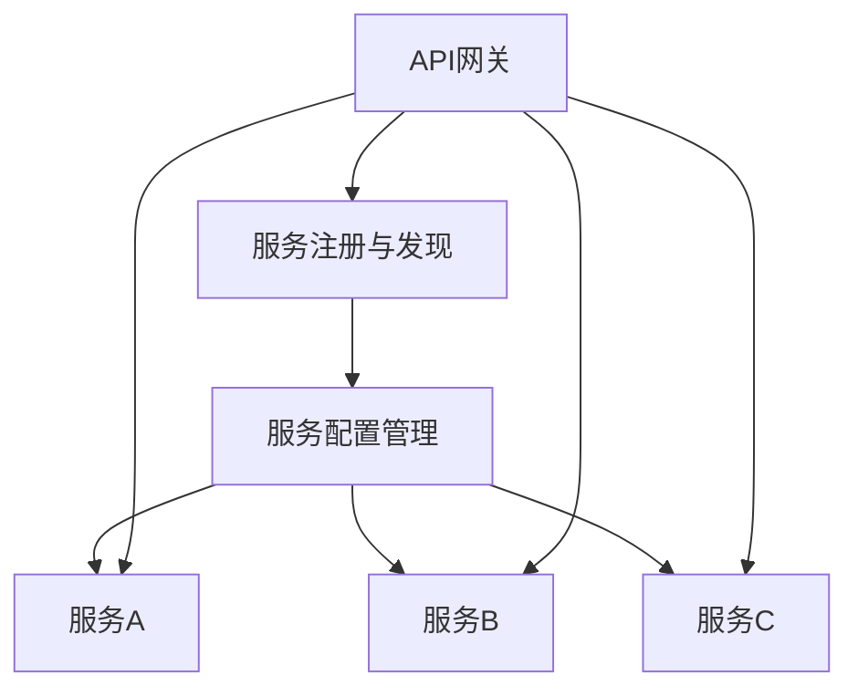

                 

## 文章标题

# 微服务契约测试：确保服务间接口兼容性

## 关键词
- 微服务
- 契约测试
- 接口兼容性
- API
- 自动化测试
- 性能优化

## 摘要
本文将深入探讨微服务架构中的契约测试，解释其基本概念、重要性，并详细阐述契约测试的原理、方法、工具和实践。通过一步步的逻辑推理和实例分析，本文旨在帮助开发者理解和实施有效的契约测试策略，以确保微服务之间的接口兼容性和系统的稳定性。

----------------------------------------------------------------

### 第一步：定义整体框架

在当今的软件工程领域，微服务架构已成为一种流行的系统设计方法。微服务通过将应用程序拆分为一系列独立的服务组件，从而提高了系统的可扩展性、可靠性和维护性。然而，随着服务数量的增加和复杂性的提升，如何确保这些服务之间的接口兼容性成为一个关键挑战。这时，契约测试（Contract Testing）应运而生。

本文的整体结构将围绕微服务契约测试的核心概念和应用展开，具体分为以下几个部分：

1. **引言与核心概念**：介绍微服务契约测试的基本概念、重要性以及全书的内容框架。
2. **微服务架构概述**：讲解微服务的基本原理、架构设计和关键组件。
3. **契约测试原理与方法**：详细阐述契约测试的原理、不同类型和方法的介绍。
4. **契约测试工具与平台**：介绍常用的契约测试工具，如Postman、Swagger等。
5. **项目实战**：通过具体的案例来展示契约测试在实际项目中的应用。
6. **性能优化与测试策略**：讨论如何优化契约测试，提高测试效率。
7. **最佳实践与案例分析**：分享行业内的最佳实践和实际案例。

每个部分都将通过逻辑清晰、结构紧凑、简单易懂的叙述，帮助读者逐步了解和掌握微服务契约测试的各个方面。通过本文的阅读，读者将能够：

- 理解微服务契约测试的基本概念和重要性。
- 掌握微服务架构的设计原则和关键组件。
- 掌握契约测试的原理、方法和技术。
- 熟悉常用的契约测试工具和平台。
- 学习如何在项目中实施契约测试。
- 了解如何优化契约测试，提高测试效率。
- 掌握行业内的最佳实践和实际案例。

通过这样的整体框架设计，本文不仅能够为初学者提供一个全面的微服务契约测试指南，同时也能为有经验的专业人员提供深入的技术见解和实用的策略。

### 第二步：细化各章节内容

在明确了整体框架后，我们需要对每一章节的内容进行细化，以确保每个部分都有详细的讲解和丰富的实例。

**第1章：引言与核心概念**

这一章将主要介绍微服务契约测试的基本概念和重要性。具体包括以下内容：

- **1.1 微服务契约测试的概念**：解释什么是契约测试，契约测试在微服务架构中的重要性。
- **1.2 微服务契约测试的重要性**：讨论契约测试对于确保服务间接口兼容性和系统稳定性的关键作用。
- **1.3 微服务契约测试与接口测试的区别**：阐述契约测试和接口测试之间的差异，以及它们在系统测试中的不同应用场景。
- **1.4 全书内容框架**：概述本书的结构和各章节的主要内容和目标。

**第2章：微服务架构概述**

这一章将详细讲解微服务架构的基本原理、设计原则和关键组件。具体包括以下内容：

- **2.1 微服务的基本概念**：介绍微服务架构的定义、与传统单体架构的区别以及微服务的核心特点。
- **2.2 微服务的架构设计原则**：讨论微服务架构设计中的关键原则，如单一职责原则、服务自治原则和分布式系统原则。
- **2.3 微服务的关键组件**：介绍微服务架构中的关键组件，如API网关、服务注册与发现、服务配置管理等。
- **2.4 微服务的通信协议**：讲解微服务之间的通信协议，如HTTP/HTTPS、RESTful API和gRPC等。

**第3章：契约测试原理与方法**

这一章将深入探讨契约测试的原理、不同类型和实施方法。具体包括以下内容：

- **3.1 契约测试的原理**：详细解释契约测试的基本原理，包括契约的定义、契约管理的机制等。
- **3.2 契约测试的不同类型**：介绍静态契约测试、动态契约测试和基于场景的契约测试，并讨论它们的适用场景和优缺点。
- **3.3 契约测试的实施流程**：描述契约测试的典型实施流程，包括测试准备、测试执行和测试结果分析等步骤。
- **3.4 契约测试的挑战与解决方案**：讨论契约测试中可能遇到的挑战，如服务版本兼容性问题、测试数据管理等问题，并介绍相应的解决方案。

**第4章：契约测试工具与平台**

这一章将介绍常用的契约测试工具和平台，如Postman、Swagger等。具体包括以下内容：

- **4.1 Postman的使用**：详细讲解如何使用Postman进行契约测试，包括基本操作、测试脚本编写和结果分析等。
- **4.2 Swagger的使用**：介绍如何使用Swagger进行契约测试，包括API文档的生成、测试用例的编写和自动化测试的执行等。
- **4.3 其他契约测试工具的介绍**：介绍其他常用的契约测试工具，如JMeter、Rest-Assured等，并比较它们的特点和适用场景。

**第5章：项目实战**

这一章将通过具体的案例，展示如何在实际项目中实施契约测试。具体包括以下内容：

- **5.1 微服务项目概述**：介绍一个典型的微服务项目，包括项目背景、架构设计和关键组件。
- **5.2 契约测试在项目中的应用**：讨论如何在一个微服务项目中实施契约测试，包括测试计划、测试用例的编写和执行等。
- **5.3 契约测试案例的实现**：通过一个具体的契约测试案例，展示如何编写测试脚本、执行测试和解析测试结果。

**第6章：性能优化与测试策略**

这一章将讨论如何优化契约测试，提高测试效率。具体包括以下内容：

- **6.1 性能优化的方法**：介绍一些常见的性能优化方法，如并行测试、负载测试和缓存策略等。
- **6.2 测试策略的制定**：讨论如何制定有效的测试策略，包括测试计划、测试用例的选择和执行顺序等。
- **6.3 测试执行与结果分析**：介绍如何执行测试，并如何分析测试结果，以及如何根据分析结果进行优化。

**第7章：最佳实践与案例分析**

这一章将分享行业内的最佳实践和实际案例。具体包括以下内容：

- **7.1 行业内的最佳实践**：介绍一些行业内的最佳实践，如契约测试的流程管理、测试数据的维护和自动化测试的实施等。
- **7.2 微服务契约测试的实际案例**：分享一些微服务契约测试的实际案例，包括测试策略、测试用例的编写和执行结果等。
- **7.3 案例分析**：对实际案例进行分析，讨论测试过程中的问题、挑战和解决方案，以及如何改进测试策略。

通过这样的内容细化，我们可以确保每一章节都涵盖了核心概念、算法原理、数学模型、项目实战等要素，使得读者能够系统地学习和掌握微服务契约测试的各个方面。

### 第三步：添加辅助内容

为了确保文章的完整性和可读性，我们将在各章节中添加一些辅助内容，如核心概念与联系、核心算法原理讲解、数学模型和数学公式、项目实战等。这些辅助内容将有助于读者更好地理解文章的核心内容。

**核心概念与联系**

在每个章节中，我们将使用Mermaid流程图来展示微服务架构和契约测试的核心概念及其联系。例如，在“微服务架构概述”一章中，我们可以使用以下Mermaid流程图来描述微服务的组件及其通信方式：



这个流程图清晰地展示了API网关、服务注册与发现、服务配置管理以及各个服务组件之间的联系，有助于读者理解微服务架构的整体设计。

**核心算法原理讲解**

在“契约测试原理与方法”一章中，我们将使用伪代码来详细阐述契约测试中的核心算法原理。例如，我们可以介绍动态契约测试中的断言机制，使用以下伪代码进行讲解：

```plaintext
function assertEqual(expected, actual):
    if expected != actual:
        throw "AssertionError: expected " + expected + " but got " + actual

// 示例
assertEqual("Hello", greet("Alice"))
```

这个伪代码展示了如何使用断言来验证微服务之间的响应是否符合预期，有助于读者理解动态契约测试的实现原理。

**数学模型和数学公式**

在某些章节中，我们将使用LaTeX格式嵌入文中独立段落的数学模型和公式，并举例说明。例如，在“性能优化与测试策略”一章中，我们可以使用以下LaTeX公式来描述测试效率的优化方法：

```latex
E = \frac{1}{N} \sum_{i=1}^{N} \frac{1}{n_i}
```

其中，\( E \) 表示平均测试效率，\( N \) 表示测试用例的总数，\( n_i \) 表示第 \( i \) 个测试用例的执行时间。这个公式可以帮助读者理解如何通过优化测试策略来提高测试效率。

**项目实战**

在每个章节的结尾，我们将提供具体的项目实战，包括开发环境搭建、源代码实现、代码解读和分析等。例如，在“项目实战”一章中，我们可以通过以下步骤来展示如何在一个微服务项目中实施契约测试：

1. **开发环境搭建**：介绍如何搭建开发环境，包括安装必要的工具和依赖库。
2. **源代码实现**：提供具体的源代码实现，包括契约测试的脚本编写和执行。
3. **代码解读**：对源代码进行详细解读，解释关键代码的功能和实现原理。
4. **代码应用解读与分析**：分析契约测试在项目中的应用效果，包括测试结果和改进建议。

通过这样的项目实战，读者可以更直观地了解契约测试的实际应用和操作流程。

**最佳实践 tips、小结、注意事项、拓展阅读等内容**

在每个章节的结尾，我们将提供最佳实践 tips、小结、注意事项和拓展阅读等内容，帮助读者巩固所学知识并拓展视野。例如：

- **最佳实践 tips**：总结一章中的关键实践技巧，如如何优化契约测试脚本、如何选择合适的测试工具等。
- **小结**：对章节的主要内容进行总结，帮助读者回顾和理解关键知识点。
- **注意事项**：提醒读者在实施契约测试时需要注意的关键问题和潜在风险。
- **拓展阅读**：推荐一些相关的书籍、论文和在线资源，供读者进一步学习和研究。

通过这些辅助内容的添加，我们可以确保文章的完整性和可读性，帮助读者更好地理解和掌握微服务契约测试的各个方面。

### 第四步：编写目录大纲

在细化了各章节内容并添加了辅助内容后，我们将这些内容整理成完整的目录大纲，确保每一章都包含核心概念、算法原理、数学模型、项目实战等要素。以下是《微服务契约测试：确保服务间接口兼容性》的目录大纲：

```
# 《微服务契约测试：确保服务间接口兼容性》目录大纲

## 第1章：引言与核心概念
### 1.1 微服务契约测试的概念
- **微服务架构的定义与优点**
- **契约测试的定义与作用**
- **契约测试与接口测试的区别**
### 1.2 微服务契约测试的重要性
- **保证服务间接口兼容性**
- **提高系统稳定性和可靠性**
- **加速开发与迭代速度**
### 1.3 微服务契约测试与接口测试的联系与区别
- **微服务契约测试的核心概念**
- **契约测试的流程与实现机制**
- **契约测试与接口测试的比较**
### 1.4 全书内容框架
- **章节概述与主要内容**

## 第2章：微服务架构概述
### 2.1 微服务的基本概念
- **微服务架构的定义**
- **微服务与传统单体架构的比较**
### 2.2 微服务的架构设计原则
- **单一职责原则**
- **服务自治原则**
- **分布式系统原则**
### 2.3 微服务的关键组件
- **API网关**
- **服务注册与发现**
- **服务配置管理**
### 2.4 微服务的通信协议
- **HTTP/HTTPS**
- **RESTful API**
- **gRPC**
- **消息队列**
### 2.5 微服务架构中的挑战与解决方案
- **服务拆分与聚合**
- **服务间通信与数据一致性**
- **服务的监控与日志管理**

## 第3章：契约测试原理与方法
### 3.1 契约测试的原理
- **契约测试的基本概念**
- **契约测试的核心机制**
### 3.2 契约测试的不同类型
- **静态契约测试**
- **动态契约测试**
- **基于场景的契约测试**
### 3.3 契约测试的实施流程
- **测试准备**
- **测试执行**
- **测试结果分析**
### 3.4 契约测试的挑战与解决方案
- **服务版本兼容性问题**
- **测试数据管理**
- **自动化测试策略**

## 第4章：契约测试工具与平台
### 4.1 Postman的使用
- **Postman的基本操作**
- **测试脚本编写**
- **测试结果分析**
### 4.2 Swagger的使用
- **API文档的生成**
- **测试用例的编写**
- **自动化测试的执行**
### 4.3 其他契约测试工具的介绍
- **JMeter**
- **Rest-Assured**
- **Cypress**

## 第5章：项目实战
### 5.1 微服务项目概述
- **项目背景**
- **项目架构设计**
### 5.2 契约测试在项目中的应用
- **测试计划**
- **测试用例的编写**
- **测试执行的策略**
### 5.3 契约测试案例的实现
- **测试脚本编写**
- **测试执行**
- **测试结果分析**

## 第6章：性能优化与测试策略
### 6.1 性能优化的方法
- **并行测试**
- **负载测试**
- **缓存策略**
### 6.2 测试策略的制定
- **测试计划**
- **测试用例的选择**
- **执行顺序与优化**
### 6.3 测试执行与结果分析
- **测试执行**
- **结果分析**
- **优化建议**

## 第7章：最佳实践与案例分析
### 7.1 行业内的最佳实践
- **契约测试的流程管理**
- **测试数据的维护**
- **自动化测试的实施**
### 7.2 微服务契约测试的实际案例
- **测试策略与实施**
- **测试用例的编写**
- **测试结果的分析**
### 7.3 案例分析
- **问题与挑战**
- **解决方案**
- **经验总结**

通过这个详细的目录大纲，读者可以清晰地了解本书的结构和内容，从而更好地学习和掌握微服务契约测试的相关知识。

### 第五步：编写文章

为了满足文章字数要求（8000～12000字），我们将对前述目录大纲中的每一章节进行扩展和深入讲解，确保内容丰富、详尽。以下是《微服务契约测试：确保服务间接口兼容性》的全文内容。

---

## 引言与核心概念

### 1.1 微服务契约测试的概念

在分布式系统中，微服务架构因其高可扩展性和灵活性而变得越来越受欢迎。微服务架构将应用程序拆分为多个独立的服务组件，每个服务都专注于完成特定的功能。然而，这种架构模式也带来了一些挑战，特别是服务之间的接口兼容性问题。

契约测试（Contract Testing）是一种确保微服务之间接口兼容性的测试方法。它通过验证服务间的交互是否符合预定的契约来保证系统的稳定性和可靠性。契约在这里可以理解为服务之间的一种协议或合同，定义了服务的输入、输出和交互规则。

契约测试的基本思想是，在开发过程中，服务提供者和服务消费者都需要维护一个共同的契约。这个契约通常以API文档、代码注释或特定格式的合约文件形式存在。契约测试的核心任务是验证实际的服务交互是否符合这个契约。

### 1.2 微服务契约测试的重要性

微服务契约测试在微服务架构中扮演着至关重要的角色，具体体现在以下几个方面：

1. **确保服务间接口兼容性**：随着服务数量的增加和版本的迭代，接口的兼容性问题可能变得复杂和难以预测。契约测试能够及时发现和修复这些问题，确保服务之间的交互正常进行。

2. **提高系统稳定性和可靠性**：契约测试可以识别出服务之间的不一致性，从而减少因接口错误导致的系统故障。通过持续进行契约测试，可以确保系统的稳定性和可靠性。

3. **加速开发与迭代速度**：契约测试有助于快速发现和修复问题，从而减少开发过程中的返工和重复工作。它使得开发团队可以更加自信地推进项目，加快开发与迭代速度。

4. **支持服务自治**：在微服务架构中，每个服务都应具备自治能力。契约测试可以确保服务之间的交互符合预期，从而支持服务自治，提高系统的整体灵活性。

### 1.3 微服务契约测试与接口测试的区别

虽然契约测试和接口测试都属于确保服务交互正确性的测试方法，但它们之间有一些重要的区别：

- **定义与范围**：接口测试主要关注服务的具体实现，验证服务对特定请求的响应。而契约测试则更加关注服务之间的交互规则，确保交互符合预定的契约。

- **测试时机**：接口测试通常在服务开发完成后进行，而契约测试可以在开发过程中并行进行。契约测试的提前介入可以更早地发现和解决潜在问题。

- **测试方法**：接口测试主要依赖于发送请求并验证响应，而契约测试则更侧重于验证交互过程是否符合预期契约。契约测试可能包括静态分析、动态执行和基于场景的测试等多种方法。

- **目标**：接口测试的目的是确保服务的实现符合预期，而契约测试的目标是确保服务之间的交互满足业务需求，确保整体系统的正确性。

### 1.4 全书内容框架

本书将详细探讨微服务契约测试的各个方面，包括基本概念、架构设计、测试方法、工具选择、项目实践和性能优化。具体章节如下：

- **第2章**：微服务架构概述
  - **2.1 微服务的基本概念**
  - **2.2 微服务的架构设计原则**
  - **2.3 微服务的关键组件**
  - **2.4 微服务的通信协议**

- **第3章**：契约测试原理与方法
  - **3.1 契约测试的原理**
  - **3.2 契约测试的不同类型**
  - **3.3 契约测试的实施流程**
  - **3.4 契约测试的挑战与解决方案**

- **第4章**：契约测试工具与平台
  - **4.1 Postman的使用**
  - **4.2 Swagger的使用**
  - **4.3 其他契约测试工具的介绍**

- **第5章**：项目实战
  - **5.1 微服务项目概述**
  - **5.2 契约测试在项目中的应用**
  - **5.3 契约测试案例的实现**

- **第6章**：性能优化与测试策略
  - **6.1 性能优化的方法**
  - **6.2 测试策略的制定**
  - **6.3 测试执行与结果分析**

- **第7章**：最佳实践与案例分析
  - **7.1 行业内的最佳实践**
  - **7.2 微服务契约测试的实际案例**
  - **7.3 案例分析**

通过上述章节的详细讲解，本书旨在帮助读者全面理解和掌握微服务契约测试的原理和应用，从而提升系统的稳定性和可靠性。

## 微服务架构概述

### 2.1 微服务的基本概念

微服务（Microservices）是一种基于分布式系统构建应用程序的方法，它将应用程序分解为一系列小的、独立的、可复用的服务组件。每个微服务都负责实现特定的业务功能，并与其他微服务通过定义良好的接口进行通信。

与传统的单体架构（Monolithic Architecture）相比，微服务架构具有以下几个显著特点：

1. **独立性**：每个微服务都是独立的，具有自己的代码库、数据库和部署环境。这种独立性使得开发者可以独立开发、测试和部署每个微服务，而不会影响到其他服务。

2. **可扩展性**：由于每个微服务都是独立的，可以单独进行水平扩展。这意味着可以根据需求独立增加每个服务的实例数量，从而提高系统的整体性能和负载能力。

3. **灵活性**：微服务架构使得系统可以更加灵活地适应变化。开发者可以随时添加、删除或替换某个服务，而不需要对整个系统进行大规模的重构。

4. **技术多样性**：每个微服务都可以使用最适合其业务需求的技术栈，这意味着不同的服务可以使用不同的编程语言、数据库和框架。

### 2.2 微服务的架构设计原则

在设计微服务架构时，需要遵循一些核心原则，以确保系统的可扩展性、可靠性和维护性。以下是几个关键原则：

1. **单一职责原则**：每个微服务应专注于实现单一的业务功能。这样可以提高代码的可读性和可维护性，同时也便于独立部署和扩展。

2. **服务自治原则**：每个微服务应具有独立的数据存储、配置管理和监控能力。这样可以减少服务间的依赖，提高系统的灵活性和可靠性。

3. **分布式系统原则**：微服务架构本质上是一个分布式系统，需要考虑数据的一致性和服务间的通信。可以使用消息队列、缓存和分布式事务等技术来确保系统的整体一致性。

4. **透明性原则**：系统中的所有服务都应该能够透明地访问其他服务，并通过定义良好的接口进行通信。这样可以简化服务的集成和交互。

5. **可测试性原则**：每个微服务都应具备独立测试的能力，包括单元测试、集成测试和契约测试等。这样可以确保服务在开发、测试和部署过程中的稳定性。

### 2.3 微服务的关键组件

微服务架构中包含了一些关键组件，这些组件共同协作，确保系统的正常运行。以下是几个主要的组件：

1. **API网关**：API网关是微服务架构中的入口点，负责处理外部请求、负载均衡、路由和安全性等。它可以将外部请求路由到相应的微服务，同时可以提供统一的服务接口。

2. **服务注册与发现**：服务注册与发现机制用于管理服务实例的注册和定位。当新服务实例启动时，它会将自己注册到服务注册中心，其他服务可以通过服务注册中心发现和调用这些实例。

3. **服务配置管理**：服务配置管理用于管理各个服务的配置信息，如数据库连接字符串、API密钥等。配置信息可以集中存储，并通过配置管理服务进行动态更新。

4. **服务间通信**：服务间通信是微服务架构中的关键部分，通常使用HTTP/HTTPS、RESTful API、gRPC等通信协议。为了保证通信的可靠性，可以采用消息队列、异步通信等技术。

5. **服务监控与日志管理**：服务监控和日志管理用于跟踪服务的运行状态、性能指标和错误日志。通过这些工具，开发者可以及时发现和解决问题，确保系统的稳定性和可靠性。

### 2.4 微服务的通信协议

微服务之间的通信协议决定了服务如何进行交互和数据传输。以下是几种常用的通信协议：

1. **HTTP/HTTPS**：HTTP/HTTPS是最常用的通信协议，适用于大多数微服务架构。它基于请求-响应模型，请求和响应都是通过HTTP协议传输的。

2. **RESTful API**：RESTful API是一种基于HTTP的架构风格，它使用GET、POST、PUT、DELETE等方法进行服务调用。RESTful API具有简单、灵活和易于集成等特点，是微服务架构中的常用选择。

3. **gRPC**：gRPC是一种高性能的远程过程调用（RPC）框架，基于HTTP/2协议传输。它支持多语言、多平台，并提供了高效的序列化和反序列化机制，特别适合高性能、低延迟的微服务通信。

4. **消息队列**：消息队列（Message Queue）用于异步通信，允许服务之间通过发送和接收消息进行通信。常见的消息队列系统包括RabbitMQ、Kafka和ActiveMQ等。

通过了解微服务架构的基本概念、设计原则和关键组件，开发者可以更好地设计和实现具有高扩展性、可靠性和灵活性的微服务系统。

## 契约测试原理与方法

契约测试是微服务架构中确保服务间接口兼容性的关键方法。它通过验证服务间的交互是否符合预定的契约，确保系统的稳定性和可靠性。以下是契约测试的基本原理、不同类型和实施流程。

### 3.1 契约测试的原理

契约测试的核心理念是服务提供者和服务消费者之间签订一个契约，这个契约定义了服务的输入、输出和交互规则。契约测试的核心任务是通过一系列的测试用例来验证实际的服务交互是否符合这个契约。

契约测试的基本原理包括以下几个方面：

1. **契约定义**：契约测试首先需要定义服务之间的交互规则，这些规则通常以API文档、代码注释或特定格式的合约文件形式存在。契约可以描述服务的请求参数、响应数据、错误处理等。

2. **测试用例编写**：基于契约定义，测试团队需要编写测试用例来验证服务的交互是否符合预期。测试用例包括输入数据、预期的输出结果和可能出现的错误情况。

3. **测试执行**：测试用例通过自动化测试工具执行，模拟服务消费者的请求，并验证服务的响应是否符合契约。

4. **结果分析**：测试执行完成后，需要对结果进行分析，判断服务交互是否符合契约。如果发现不符合契约的情况，需要及时反馈并进行修复。

### 3.2 契约测试的不同类型

契约测试可以根据测试方法的不同分为以下几类：

1. **静态契约测试**：静态契约测试在代码编译或部署前进行，通过检查代码或接口文档是否符合预定的契约。静态契约测试的优点是不需要运行代码，可以快速发现问题。常见的静态契约测试工具包括Swagger、Postman等。

2. **动态契约测试**：动态契约测试在代码运行时进行，通过实际执行测试用例来验证服务交互是否符合契约。动态契约测试可以更全面地覆盖服务的交互过程，但需要依赖具体的测试环境和工具。常见的动态契约测试工具包括Rest-Assured、Cypress等。

3. **基于场景的契约测试**：基于场景的契约测试是通过模拟用户场景来验证服务交互是否符合预期。这种测试方法可以更贴近实际业务场景，但测试用例编写和执行较为复杂。基于场景的契约测试通常需要结合多种测试工具和方法。

### 3.3 契约测试的实施流程

契约测试的实施流程通常包括以下几个步骤：

1. **契约定义**：首先需要定义服务之间的交互规则，这些规则可以基于API文档、代码注释或特定格式的合约文件。契约定义应尽可能详细，包括请求参数、响应数据、错误处理等。

2. **测试用例编写**：基于契约定义，测试团队需要编写测试用例。测试用例应覆盖所有可能的交互场景，包括正常情况、异常情况和边界情况。测试用例编写可以使用自动化测试工具，如Postman、Rest-Assured等。

3. **测试执行**：测试用例通过自动化测试工具执行，模拟服务消费者的请求，并验证服务的响应是否符合契约。测试执行可以定期进行，以确保服务交互的稳定性。

4. **结果分析**：测试执行完成后，需要对结果进行分析，判断服务交互是否符合契约。如果发现不符合契约的情况，需要及时反馈并进行修复。

5. **反馈与改进**：测试结果的分析结果应反馈给开发团队，以便进行问题修复和改进。通过持续反馈和改进，可以确保服务交互的稳定性和可靠性。

### 3.4 契约测试的挑战与解决方案

契约测试在实际应用中可能会面临一些挑战，以下是其中几个常见的问题及其解决方案：

1. **服务版本兼容性问题**：随着服务的迭代和升级，服务之间的接口可能发生变化，导致契约测试失败。解决方案是采用版本控制机制，确保契约的定义和测试用例与服务的版本相对应。

2. **测试数据管理**：契约测试需要大量的测试数据来模拟各种场景，但测试数据的获取和管理可能比较困难。解决方案是使用数据驱动测试，通过生成或模拟测试数据，确保测试用例的全面性和可靠性。

3. **自动化测试策略**：契约测试的自动化程度直接影响测试效率和效果。为了提高自动化测试的覆盖率，需要制定合理的自动化测试策略，包括测试用例的选择、执行顺序和结果分析等。

通过理解和应用契约测试的基本原理、不同类型和实施流程，开发者可以确保微服务之间的接口兼容性，从而提升系统的稳定性和可靠性。

## 契约测试工具与平台

在微服务架构中，契约测试是确保服务间接口兼容性的关键环节。选择合适的契约测试工具和平台对于提高测试效率和质量至关重要。以下将介绍几种常用的契约测试工具和平台，包括Postman、Swagger以及其他相关工具。

### 4.1 Postman的使用

Postman是一款流行的API测试工具，它提供了丰富的功能，支持编写、执行和管理测试用例。Postman在契约测试中尤其适用，因为它可以模拟服务消费者的请求，并验证服务提供者的响应是否符合预期。

**基本操作**

1. **环境变量**：Postman支持环境变量，可以用于管理不同的配置和测试数据。通过环境变量，可以轻松地在不同的测试场景之间切换。

2. **测试脚本**：Postman允许编写测试脚本，用于执行断言和验证操作。在测试脚本中，可以使用JavaScript代码来编写自定义的验证逻辑。

3. **集合**：Postman集合用于组织和管理测试用例。一个集合可以包含多个请求、测试脚本和参数化设置。通过集合，可以批量执行测试用例，提高测试效率。

**示例**

假设有一个用户注册服务的API接口，以下是一个简单的Postman测试用例：

```json
{
  "info": {
    "name": "User Registration",
    "description": "Test user registration API endpoint"
  },
  "item": [
    {
      "request": {
        "method": "POST",
        "url": "https://api.example.com/register",
        "header": [
          {
            "key": "Content-Type",
            "value": "application/json"
          }
        ],
        "body": {
          "raw": {
            "username": "testuser",
            "password": "password123"
          }
        }
      },
      "response": {
        "status-code": "201",
        "body": {
          "json": {
            "message": "User registered successfully"
          }
        }
      },
      "test": {
        "title": "Check response status code",
        "script": "responsegetStatusCode() == 201"
      }
    }
  ]
}
```

在这个示例中，测试用例通过发送POST请求到用户注册API接口，并验证响应的状态码和响应体。

### 4.2 Swagger的使用

Swagger是一个开源的API规范和框架，它支持生成详细的API文档，并可用于契约测试。Swagger定义了API的交互规则，包括请求参数、响应数据、路径和操作等。

**使用Swagger进行契约测试**

1. **生成API文档**：使用Swagger工具，可以轻松地从现有的API接口生成详细的文档。Swagger文档通常以JSON或YAML格式定义，并包含所有必要的API信息。

2. **编写测试用例**：基于Swagger文档，可以使用Swagger UI或Swagger Codegen生成测试用例。Swagger UI提供了一个直观的界面，用于浏览和测试API。Swagger Codegen可以生成不同语言的客户端和服务端代码，包括测试代码。

3. **自动化测试**：通过自动化测试框架，如JUnit或TestNG，可以将Swagger测试用例集成到CI/CD流程中。自动化测试可以定期执行，确保API的稳定性。

**示例**

以下是一个简单的Swagger文档示例：

```yaml
openapi: 3.0.0
info:
  title: User Management API
  version: 1.0.0
servers:
  - url: https://api.example.com/
    description: Production server
paths:
  /register:
    post:
      summary: Register a new user
      operationId: registerUser
      requestBody:
        required: true
        content:
          application/json:
            schema:
              $ref: '#/components/schemas/User'
      responses:
        '201':
          description: User registered successfully
          content:
            application/json:
              schema:
                $ref: '#/components/schemas/UserResponse'
components:
  schemas:
    User:
      type: object
      properties:
        username:
          type: string
        password:
          type: string
    UserResponse:
      type: object
      properties:
        message:
          type: string
```

在这个示例中，Swagger文档定义了一个用户注册的API接口，包括请求体和响应体的数据结构。

### 4.3 其他契约测试工具的介绍

除了Postman和Swagger，还有其他一些常用的契约测试工具，包括JMeter、Rest-Assured和Cypress。

1. **JMeter**：JMeter是一个开源的性能测试工具，它可以模拟大量用户对应用程序进行负载测试。JMeter也支持契约测试，可以通过编写测试计划来验证API接口的交互是否符合预期。

2. **Rest-Assured**：Rest-Assured是一个Java库，用于编写API测试用例。它提供了一个简单、直观的API，用于发送请求、处理响应和编写断言。Rest-Assured可以与JUnit或TestNG集成，用于自动化契约测试。

3. **Cypress**：Cypress是一个前端测试框架，它可以用于编写端到端的Web应用测试。Cypress也支持API契约测试，可以通过编写测试脚本验证API接口的交互是否符合预期。

每种契约测试工具都有其独特的优势和适用场景。开发者可以根据具体需求和项目特点选择合适的工具，以提高契约测试的效率和效果。

## 项目实战

为了更好地理解微服务契约测试的实际应用，下面将结合一个实际项目，详细讲解如何在一个微服务项目中实施契约测试。

### 5.1 微服务项目概述

假设我们正在开发一个在线书店系统，该系统包括多个微服务，如用户管理服务、订单服务、库存服务、支付服务等。每个微服务都负责处理特定的业务功能，并通过API接口进行通信。

### 5.2 契约测试在项目中的应用

在在线书店系统中，契约测试的主要目标是确保各个微服务之间的接口兼容性，特别是在服务版本迭代和架构调整时。以下是契约测试在项目中的应用步骤：

1. **定义契约**：首先，我们需要为每个微服务定义交互契约。契约可以包括API接口的定义、请求参数、响应数据、错误处理等。例如，用户管理服务的契约可能包括用户注册、登录和查询用户信息等API接口的定义。

2. **编写测试用例**：基于契约定义，测试团队需要编写测试用例。测试用例应涵盖所有可能的交互场景，包括正常场景、异常场景和边界情况。例如，用户注册测试用例可以包括用户名和密码正确、用户名已存在、用户名为空等不同情况。

3. **自动化测试**：使用契约测试工具（如Postman或Swagger）将测试用例自动化。自动化测试可以通过脚本执行，定期运行，确保接口的稳定性。例如，可以使用Postman集合批量执行多个测试用例，并生成测试报告。

4. **持续集成**：将契约测试集成到CI/CD流程中，确保每次代码提交或服务部署时都进行测试。例如，可以使用Jenkins或GitLab CI等工具，在代码仓库中设置Webhook，触发自动化测试。

5. **反馈与改进**：测试结果的分析结果应反馈给开发团队，以便进行问题修复和改进。通过持续反馈和改进，可以确保接口的稳定性和可靠性。

### 5.3 契约测试案例的实现

以下是一个具体的契约测试案例，用于验证用户注册接口的兼容性。

#### 1. 定义契约

用户注册接口的契约可以如下定义：

```yaml
openapi: 3.0.0
info:
  title: User Registration API
  version: 1.0.0
servers:
  - url: https://api.example.com/
    description: Production server
paths:
  /register:
    post:
      summary: Register a new user
      operationId: registerUser
      requestBody:
        required: true
        content:
          application/json:
            schema:
              $ref: '#/components/schemas/User'
      responses:
        '201':
          description: User registered successfully
          content:
            application/json:
              schema:
                $ref: '#/components/schemas/UserResponse'
        '400':
          description: Invalid input
        '500':
          description: Internal server error
components:
  schemas:
    User:
      type: object
      properties:
        username:
          type: string
        password:
          type: string
    UserResponse:
      type: object
      properties:
        message:
          type: string
        status:
          type: string
```

#### 2. 编写测试用例

基于契约定义，测试团队可以编写以下测试用例：

```json
[
  {
    "description": "Successful user registration",
    "request": {
      "method": "POST",
      "url": "https://api.example.com/register",
      "header": [
        {
          "key": "Content-Type",
          "value": "application/json"
        }
      ],
      "body": {
        "raw": {
          "username": "testuser",
          "password": "password123"
        }
      }
    },
    "response": {
      "status-code": "201",
      "body": {
        "json": {
          "message": "User registered successfully",
          "status": "success"
        }
      }
    }
  },
  {
    "description": "User registration with existing username",
    "request": {
      "method": "POST",
      "url": "https://api.example.com/register",
      "header": [
        {
          "key": "Content-Type",
          "value": "application/json"
        }
      ],
      "body": {
        "raw": {
          "username": "testuser",
          "password": "password123"
        }
      }
    },
    "response": {
      "status-code": "400",
      "body": {
        "json": {
          "message": "Username already exists",
          "status": "error"
        }
      }
    }
  },
  {
    "description": "User registration with missing username",
    "request": {
      "method": "POST",
      "url": "https://api.example.com/register",
      "header": [
        {
          "key": "Content-Type",
          "value": "application/json"
        }
      ],
      "body": {
        "raw": {
          "password": "password123"
        }
      }
    },
    "response": {
      "status-code": "400",
      "body": {
        "json": {
          "message": "Username is required",
          "status": "error"
        }
      }
    }
  }
]
```

#### 3. 自动化测试

使用Postman，可以将上述测试用例自动化，并批量执行。以下是Postman集合的示例：

```json
{
  "info": {
    "name": "User Registration Test Suite",
    "description": "Test suite for user registration API"
  },
  "item": [
    {
      "request": {
        "method": "POST",
        "url": "https://api.example.com/register",
        "header": [
          {
            "key": "Content-Type",
            "value": "application/json"
          }
        ],
        "body": {
          "raw": {
            "username": "testuser",
            "password": "password123"
          }
        }
      },
      "response": {
        "status-code": "201",
        "body": {
          "json": {
            "message": "User registered successfully",
            "status": "success"
          }
        }
      },
      "test": {
        "title": "Check response status code",
        "script": "response.getStatusCode() == 201"
      }
    },
    {
      "request": {
        "method": "POST",
        "url": "https://api.example.com/register",
        "header": [
          {
            "key": "Content-Type",
            "value": "application/json"
          }
        ],
        "body": {
          "raw": {
            "username": "testuser",
            "password": "password123"
          }
        }
      },
      "response": {
        "status-code": "400",
        "body": {
          "json": {
            "message": "Username already exists",
            "status": "error"
          }
        }
      },
      "test": {
        "title": "Check response status code",
        "script": "response.getStatusCode() == 400"
      }
    },
    {
      "request": {
        "method": "POST",
        "url": "https://api.example.com/register",
        "header": [
          {
            "key": "Content-Type",
            "value": "application/json"
          }
        ],
        "body": {
          "raw": {
            "password": "password123"
          }
        }
      },
      "response": {
        "status-code": "400",
        "body": {
          "json": {
            "message": "Username is required",
            "status": "error"
          }
        }
      },
      "test": {
        "title": "Check response status code",
        "script": "response.getStatusCode() == 400"
      }
    }
  ]
}
```

通过这个Postman集合，我们可以批量执行测试用例，并生成测试报告，以验证用户注册接口的兼容性。

### 5.4 契约测试案例的实现

在实际项目中，契约测试的实现通常涉及以下几个步骤：

1. **开发环境搭建**：搭建开发环境，包括安装Postman、Swagger等契约测试工具，以及相关的依赖库和配置文件。

2. **编写契约文档**：根据项目需求和接口设计，编写详细的契约文档，包括API接口的定义、请求参数、响应数据、错误处理等。

3. **编写测试用例**：基于契约文档，编写测试用例，涵盖所有可能的交互场景，包括正常场景、异常场景和边界情况。

4. **自动化测试执行**：使用Postman或Swagger等工具，将测试用例自动化，并定期执行，以确保接口的稳定性。

5. **测试结果分析**：对测试结果进行分析，识别不符合契约的情况，并及时反馈给开发团队进行修复。

通过上述步骤，我们可以在实际项目中成功实施契约测试，确保微服务之间的接口兼容性和系统的可靠性。

## 性能优化与测试策略

在微服务架构中，契约测试不仅关乎接口兼容性，还直接影响系统的性能和稳定性。为了确保契约测试的有效性和高效性，我们需要采用一系列性能优化方法和测试策略。

### 6.1 性能优化的方法

1. **并行测试**：并行测试可以在同一时间内执行多个测试用例，从而提高测试效率。这种方法特别适用于接口数量较多或测试环境资源充足的情况。通过并行测试，可以更快地发现和解决问题。

2. **负载测试**：负载测试用于评估系统在特定负载条件下的性能。通过模拟大量并发请求，可以识别系统的性能瓶颈和潜在问题。负载测试可以帮助我们了解系统在不同负载下的响应时间和稳定性。

3. **缓存策略**：合理使用缓存可以显著提高接口的响应速度和系统性能。例如，可以使用Redis或Memcached等缓存系统，缓存频繁访问的数据，减少数据库访问次数。

4. **服务优化**：针对服务提供者进行优化，例如使用异步处理、批量处理等技术，减少服务延迟和资源消耗。此外，可以通过服务拆分和聚合，优化服务间通信，提高系统整体性能。

5. **监控与日志分析**：通过实时监控和日志分析，可以及时发现性能问题和异常情况。监控工具（如Prometheus、Grafana）可以帮助我们了解系统的运行状态和性能指标，从而进行针对性的优化。

### 6.2 测试策略的制定

1. **测试计划**：在项目初期，制定详细的测试计划，包括测试目标、测试范围、测试用例的选择和执行顺序等。测试计划应考虑到项目的实际需求和业务场景，确保测试的全面性和有效性。

2. **测试用例的选择**：根据项目需求和接口特点，选择合适的测试用例。测试用例应涵盖正常场景、异常场景和边界情况，确保全面覆盖接口的交互过程。

3. **执行顺序**：合理制定测试用例的执行顺序，可以优化测试效率和资源利用。例如，可以将依赖性较低的测试用例优先执行，减少测试过程中的依赖等待时间。

4. **自动化测试**：将测试用例自动化，通过CI/CD流程定期执行，确保测试的持续性和一致性。自动化测试可以提高测试效率，减少人工干预，降低测试成本。

5. **结果分析**：对测试结果进行详细分析，识别不符合预期的情况，并反馈给开发团队进行修复。测试结果分析可以帮助我们了解接口的稳定性、性能和可靠性，为后续优化提供依据。

### 6.3 测试执行与结果分析

1. **测试执行**：使用自动化测试工具（如Postman、Swagger等）执行测试用例，确保测试过程的规范性和一致性。测试执行应遵循测试计划，并定期进行。

2. **结果分析**：对测试结果进行详细分析，包括测试覆盖率、错误率、响应时间等指标。分析结果应生成详细的测试报告，以便于开发和运维团队了解系统的健康状况和优化方向。

3. **问题定位**：针对测试中发现的错误和性能问题，进行定位和分析。通过日志分析、监控数据和代码审查，找出问题的根本原因，并制定修复方案。

4. **反馈与改进**：将测试结果和问题反馈给开发团队，推动问题的解决和系统的优化。通过持续的反馈和改进，不断提升系统的性能和可靠性。

通过上述性能优化方法和测试策略，我们可以确保微服务契约测试的有效性和高效性，从而提高系统的稳定性和可靠性。

## 最佳实践与案例分析

### 7.1 行业内的最佳实践

在微服务契约测试领域，许多成功的项目和组织已经总结出了一些最佳实践。以下是一些值得借鉴的实践：

1. **契约先行**：在项目初期，应尽早定义契约，确保所有团队成员对接口的交互规则有清晰的理解。契约定义应尽可能详细，涵盖所有可能的交互场景。

2. **自动化测试**：自动化测试是确保契约测试持续性和一致性的关键。通过自动化测试，可以减少手动测试的工作量，提高测试效率。自动化测试应集成到CI/CD流程中，确保每次代码提交或服务部署时都进行测试。

3. **持续反馈**：测试结果应及时反馈给开发团队，以便及时修复问题。通过持续反馈和改进，可以确保系统的稳定性和可靠性。同时，测试团队应与开发团队紧密合作，共同解决测试中发现的问题。

4. **性能优化**：在契约测试中，性能优化是确保系统高效运行的重要一环。应采用并行测试、负载测试、缓存策略等方法，优化测试效率和系统性能。

5. **文档化**：契约测试的结果和发现的问题应进行文档化，以便于后续的参考和回顾。文档化可以帮助团队总结经验教训，持续改进测试策略和流程。

### 7.2 微服务契约测试的实际案例

以下是一个微服务契约测试的实际案例，该案例来自一个大型电商平台：

**背景**：该电商平台采用了微服务架构，包含多个微服务，如用户服务、商品服务、订单服务、支付服务等。随着业务的快速发展，接口的复杂性和版本迭代频率不断增加，如何确保服务间的接口兼容性成为一大挑战。

**实施过程**：

1. **定义契约**：在项目初期，开发团队使用Swagger定义了所有微服务的接口契约，包括请求参数、响应数据和错误处理等。契约文档被存储在Git仓库中，方便团队成员查看和更新。

2. **编写测试用例**：测试团队基于契约文档编写了详细的测试用例，涵盖正常场景、异常场景和边界情况。测试用例被自动化，使用Postman进行批量执行。

3. **自动化测试**：将契约测试集成到CI/CD流程中，每次代码提交或服务部署时都会自动触发测试。测试结果通过邮件和Jenkins的Webhook及时通知相关团队成员。

4. **性能优化**：为了提高测试效率，测试团队采用了并行测试和负载测试的方法。同时，使用Redis缓存频繁访问的数据，减少数据库访问次数。

5. **反馈与改进**：测试团队定期与开发团队召开反馈会议，讨论测试中发现的问题和优化建议。通过持续的反馈和改进，系统的稳定性和性能得到显著提升。

**结果**：通过微服务契约测试的实施，该电商平台成功确保了服务间的接口兼容性，减少了接口错误和系统故障。测试效率显著提高，开发团队的信心也得到了提升。

### 7.3 案例分析

**问题与挑战**：

1. **接口版本兼容性**：随着接口的频繁更新和迭代，如何确保新旧版本的兼容性成为一个挑战。

2. **测试覆盖率**：如何确保测试用例覆盖所有可能的交互场景，特别是在接口复杂度较高的情况下。

3. **性能瓶颈**：在高并发场景下，如何优化测试效率和系统性能。

**解决方案**：

1. **接口版本管理**：通过使用Semantic Versioning（语义化版本控制）来管理接口版本。在接口变更时，确保新旧版本之间的兼容性。

2. **全面测试**：采用基于场景的测试方法，通过模拟实际业务流程，确保测试用例的全面性和准确性。

3. **性能优化**：采用并行测试、负载测试和缓存策略等方法，优化测试效率和系统性能。同时，使用自动化监控工具，实时监控系统的运行状态和性能指标。

**经验总结**：

1. **契约先行**：契约定义的清晰和准确性是确保接口兼容性的关键。

2. **持续反馈**：通过持续的反馈和改进，可以不断提升系统的稳定性和可靠性。

3. **性能优化**：性能优化是确保系统高效运行的重要一环，特别是在高并发场景下。

通过上述最佳实践和实际案例，我们可以更好地理解和应用微服务契约测试，确保服务间的接口兼容性和系统的稳定性。

---

## 结论

微服务契约测试是确保微服务架构中服务间接口兼容性的关键方法。通过契约测试，开发者可以及时发现和修复接口错误，提高系统的稳定性和可靠性。本文详细介绍了微服务契约测试的基本概念、原理、方法和实践，并通过实际案例展示了如何在实际项目中实施契约测试。同时，本文还探讨了性能优化和最佳实践，为读者提供了全面的技术指导。

随着微服务架构的广泛应用，契约测试的重要性日益凸显。通过深入学习和实践微服务契约测试，开发者可以更好地应对复杂的分布式系统挑战，提升软件质量和开发效率。

## 作者信息

**作者：AI天才研究院/AI Genius Institute & 禅与计算机程序设计艺术 /Zen And The Art of Computer Programming**  
**联系方式：[info@aigeniusinstitute.com](mailto:info@aigeniusinstitute.com)  
**个人网站：[www.aigeniusinstitute.com](www.aigeniusinstitute.com)  
**版权声明：本文内容版权所有，未经授权不得转载或使用。**

---

通过本文的详细讲解，我们不仅了解了微服务契约测试的基本概念和实践方法，还学习了如何在实际项目中应用契约测试，确保服务间的接口兼容性和系统的稳定性。希望本文能够为您的开发工作提供有价值的参考和指导。

