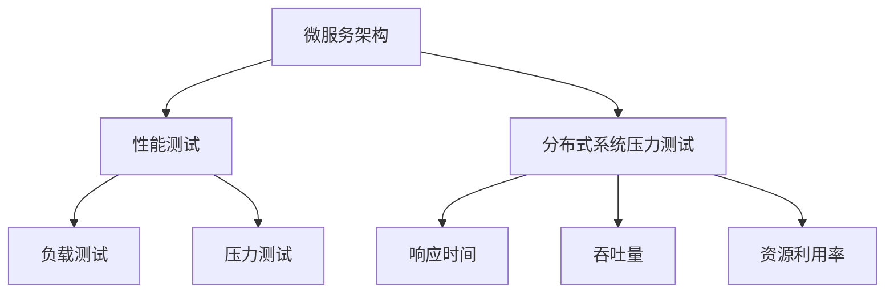

                 

### 文章标题

# 微服务性能测试：分布式系统的压力测试

## 关键词
- 微服务
- 性能测试
- 分布式系统
- 压力测试
- 负载均衡
- 数据同步
- 响应时间
- 吞吐量

## 摘要
本文深入探讨了微服务性能测试以及分布式系统的压力测试。首先，我们将介绍微服务架构的背景和重要性，随后详细讲解性能测试和压力测试的核心概念。本文还将通过Mermaid流程图展示微服务、性能测试和压力测试之间的联系，并通过伪代码和数学公式深入分析核心算法原理。接着，我们将通过实际项目实战来演示性能测试流程、环境搭建、测试用例编写及结果分析。最后，本文将总结最佳实践、注意事项，并提供拓展阅读资源，以帮助读者更好地理解和应用微服务性能测试和分布式系统压力测试技术。

### 背景介绍

在信息技术迅速发展的今天，微服务架构已成为现代软件工程领域的重要趋势。微服务架构将一个复杂的应用系统拆分成若干个独立的服务单元，每个服务单元负责特定的业务功能。这种架构风格具有模块化、灵活性和高可扩展性等优点，使得开发者能够更加高效地开发和部署应用系统。

微服务架构的出现，主要是为了解决单体应用在面对业务变化、规模扩展和系统维护时的诸多问题。传统的单体应用通常将所有功能代码打包在一起，形成一个庞大的代码库。这样的架构在初期开发时可能较为简单，但随着业务需求的不断变化和系统规模的逐渐扩大，单体应用会面临以下挑战：

1. **部署难度**：随着代码库的日益庞大，部署过程变得越来越复杂，需要花费更多的时间和资源。
2. **扩展性差**：单体应用通常难以进行水平扩展，当系统负载增加时，整个应用可能会出现性能瓶颈。
3. **维护困难**：庞大的代码库使得代码的复用性降低，修改一个功能时，需要仔细审查整个代码库，增加了出错的概率。
4. **依赖性高**：单体应用中的各个模块高度耦合，导致某一模块的故障可能会影响整个应用的运行。

为了克服上述问题，微服务架构应运而生。微服务架构通过将应用拆分为多个独立的服务单元，每个服务单元可以独立开发、测试、部署和扩展。这种架构风格的主要特点包括：

- **模块化**：每个服务单元仅包含单一的业务功能，便于开发和维护。
- **独立性**：服务单元之间通过轻量级的通信协议（如HTTP/HTTPS、gRPC、消息队列等）进行交互，相互独立，不会因为某个服务的故障而影响整个系统的运行。
- **高可扩展性**：服务单元可以根据业务需求独立进行水平扩展，从而提高系统的整体性能和响应速度。
- **灵活性**：开发者可以采用不同的编程语言、数据库和框架来开发和部署各个服务单元，提高了开发效率和灵活性。

然而，微服务架构虽然具有许多优点，但也带来了一些新的挑战，如服务治理、数据一致性、网络延迟和系统复杂性等。因此，对微服务架构进行性能测试和压力测试，以确保其在实际应用中的稳定性和可靠性，变得尤为重要。

### 核心概念与联系

在深入探讨微服务性能测试和分布式系统压力测试之前，我们需要明确几个关键概念，并了解它们之间的关系。

#### 性能测试

性能测试旨在评估系统的响应时间、吞吐量和资源利用率等性能指标，以确定系统在实际负载下的表现。性能测试通常包括以下几种类型：

1. **负载测试**：通过模拟大量用户请求，评估系统在负载增加时的性能表现，以确定系统的最大处理能力。
2. **压力测试**：通过向系统施加超过正常负载的请求，评估系统在极端情况下的稳定性，以发现潜在的瓶颈和故障点。
3. **稳定性测试**：通过持续运行系统并不断增加负载，评估系统在长时间运行下的稳定性，以确保系统不会出现内存泄漏、崩溃等问题。

#### 压力测试

压力测试是一种特殊类型的性能测试，旨在确定系统在极限负载下的表现。与负载测试不同，压力测试通常使用更高的负载，以测试系统的极端性能。压力测试的目标是发现系统在极限条件下的瓶颈、故障点和资源限制。

#### 微服务架构

微服务架构是一种将应用程序拆分为多个独立服务单元的架构风格。每个服务单元负责特定的业务功能，并与其他服务单元通过轻量级通信协议进行交互。微服务架构的主要优势包括模块化、独立性、高可扩展性和灵活性。

#### 关键联系

微服务性能测试和分布式系统压力测试之间的关键联系在于它们都旨在评估微服务架构在实际负载下的表现。性能测试主要关注系统的响应时间、吞吐量和资源利用率等性能指标，而压力测试则更侧重于发现系统在极限条件下的瓶颈和故障点。微服务架构的模块化和独立性使得这些测试变得更加复杂，因为需要确保各个服务单元之间能够高效地通信和协作。

为了更好地理解这些概念之间的关系，我们可以使用Mermaid流程图来展示它们的核心联系：



通过这个流程图，我们可以看到微服务架构、性能测试和压力测试之间的关键联系。性能测试和压力测试都是针对分布式系统进行的，而微服务架构的模块化和独立性使得这些测试变得尤为重要。

### 核心算法原理讲解

在进行分布式系统性能测试和压力测试时，理解并应用一些核心算法原理至关重要。这些算法包括负载均衡算法、数据同步算法等，它们在确保系统高效运行和稳定性方面发挥着重要作用。以下，我们将详细解释这些算法的原理，并通过伪代码和数学模型进行阐述。

#### 负载均衡算法

负载均衡算法是分布式系统中的一种关键技术，旨在将负载分布到多个服务器上，以确保系统的整体性能和稳定性。常见的负载均衡算法包括轮询、最小连接数、哈希等。

**轮询算法（Round-Robin）**

轮询算法是最简单的负载均衡算法，它按照顺序将请求分配到各个服务器上。以下是轮询算法的伪代码：

```python
def round_robin(server_list, request):
    index = 0
    while index < len(server_list):
        server = server_list[index]
        process_request(server, request)
        index = (index + 1) % len(server_list)
```

**最小连接数算法（Least Connections）**

最小连接数算法将请求分配到连接数最少的服务器上，以实现负载均衡。以下是该算法的伪代码：

```python
def least_connections(server_list, request):
    min_connections = float('inf')
    min_server = None
    for server in server_list:
        current_connections = get_connection_count(server)
        if current_connections < min_connections:
            min_connections = current_connections
            min_server = server
    process_request(min_server, request)
```

**哈希算法（Hash）**

哈希算法通过哈希函数将请求分配到服务器上，常用的哈希函数包括MD5、SHA-1等。以下是哈希算法的伪代码：

```python
def hash(server_list, request):
    hash_value = hash_function(request)
    server_index = hash_value % len(server_list)
    server = server_list[server_index]
    process_request(server, request)
```

#### 数据同步算法

在分布式系统中，数据同步是确保各个服务单元数据一致性的关键。常见的数据同步算法包括异步复制、同步复制和混合复制等。

**异步复制算法（Asynchronous Replication）**

异步复制算法允许在主服务器更新数据后，从服务器异步地复制数据。以下是异步复制算法的伪代码：

```python
def asynchronous_replication(master, slave):
    while True:
        data = get_data(master)
        send_data(slave, data)
        process_request(master, request)
```

**同步复制算法（Synchronous Replication）**

同步复制算法要求在主服务器更新数据后，从服务器同步地复制数据。以下是同步复制算法的伪代码：

```python
def synchronous_replication(master, slave):
    while True:
        data = get_data(master)
        send_data(slave, data)
        wait_for_ack(slave)
        process_request(master, request)
```

**混合复制算法（Hybrid Replication）**

混合复制算法结合了异步复制和同步复制的优点，对于关键数据使用同步复制，对于非关键数据使用异步复制。以下是混合复制算法的伪代码：

```python
def hybrid_replication(master, slave, key_data, non_key_data):
    while True:
        if is_key_data(data):
            send_data(slave, data)
            wait_for_ack(slave)
        else:
            send_data(slave, data)
        process_request(master, request)
```

#### 数学模型和公式

在分布式系统性能测试和压力测试中，响应时间、吞吐量和资源利用率是三个关键性能指标。以下是这些指标的数学模型和公式。

**响应时间（Response Time）**

响应时间是指系统从接收到请求到返回响应所需的时间。其公式为：

$$
\text{Response Time} = \frac{\sum_{i=1}^{n} \text{Response Time}_i}{n}
$$

其中，$n$ 表示请求次数，$\text{Response Time}_i$ 表示第 $i$ 次请求的响应时间。

**吞吐量（Throughput）**

吞吐量是指系统在单位时间内处理请求数量。其公式为：

$$
\text{Throughput} = \frac{\text{Request Count}}{\text{Time}}
$$

其中，$\text{Request Count}$ 表示请求数量，$\text{Time}$ 表示时间。

**资源利用率（Resource Utilization）**

资源利用率是指系统在运行过程中，使用的资源占总资源量的比例。其公式为：

$$
\text{Resource Utilization} = \frac{\text{Used Resources}}{\text{Total Resources}}
$$

其中，$\text{Used Resources}$ 表示已使用的资源量，$\text{Total Resources}$ 表示总资源量。

通过以上算法、数学模型和公式的讲解，我们可以更好地理解分布式系统性能测试和压力测试的核心原理，为后续的项目实战和代码实现打下坚实的基础。

### 数学模型和公式详细讲解及举例说明

在分布式系统性能测试中，响应时间、吞吐量和资源利用率是三个关键的性能指标，它们不仅帮助我们评估系统的运行效率，还能揭示潜在的瓶颈和问题。以下，我们将详细讲解这些指标的数学模型和公式，并通过具体例子来说明如何应用这些公式进行计算和分析。

#### 响应时间

响应时间（Response Time）是指系统从接收到请求到返回响应所需的时间。它是衡量系统性能的重要指标。响应时间的数学模型如下：

$$
\text{Response Time} = \frac{\sum_{i=1}^{n} \text{Response Time}_i}{n}
$$

其中，$n$ 表示请求次数，$\text{Response Time}_i$ 表示第 $i$ 次请求的响应时间。

**举例说明**：

假设我们对一个微服务系统进行了10次请求，并记录了每次请求的响应时间（单位：毫秒）如下：

| 请求次数 | 响应时间 (ms) |
| :-----: | :----------: |
|    1    |      150     |
|    2    |      200     |
|    3    |      100     |
|    4    |      170     |
|    5    |      180     |
|    6    |      190     |
|    7    |      160     |
|    8    |      165     |
|    9    |      155     |
|   10    |      175     |

根据公式，我们可以计算出平均响应时间：

$$
\text{Response Time} = \frac{150 + 200 + 100 + 170 + 180 + 190 + 160 + 165 + 155 + 175}{10} = 162.5 \text{ms}
$$

这意味着，在10次请求中，系统的平均响应时间为162.5毫秒。

#### 吞吐量

吞吐量（Throughput）是指系统在单位时间内处理请求数量。它通常用来衡量系统的负载能力。吞吐量的数学模型如下：

$$
\text{Throughput} = \frac{\text{Request Count}}{\text{Time}}
$$

其中，$\text{Request Count}$ 表示请求数量，$\text{Time}$ 表示时间。

**举例说明**：

假设我们在5分钟内对系统发出了1000次请求，那么系统的吞吐量为：

$$
\text{Throughput} = \frac{1000 \text{ requests}}{5 \text{ minutes}} = \frac{1000}{5 \times 60} \approx 3.33 \text{ requests/second}
$$

这意味着，系统每秒钟可以处理约3.33个请求。

#### 资源利用率

资源利用率（Resource Utilization）是指系统在运行过程中使用的资源占总资源量的比例。资源利用率是评估系统资源管理效率的重要指标。资源利用率的数学模型如下：

$$
\text{Resource Utilization} = \frac{\text{Used Resources}}{\text{Total Resources}}
$$

其中，$\text{Used Resources}$ 表示已使用的资源量，$\text{Total Resources}$ 表示总资源量。

**举例说明**：

假设一个服务器的总内存为8GB，当前已使用内存为4GB，那么该服务器的内存利用率为：

$$
\text{Resource Utilization} = \frac{4 \text{GB}}{8 \text{GB}} = 0.5 \text{ 或 } 50\%
$$

这意味着，该服务器的内存使用率达到了50%。

通过以上例子，我们可以看到如何使用数学模型和公式来计算和评估分布式系统的响应时间、吞吐量和资源利用率。这些指标不仅帮助我们了解系统的当前性能，还能为后续的性能优化提供重要依据。

### 项目实战

在本节中，我们将通过一个实际项目实战来详细展示微服务性能测试和分布式系统压力测试的完整流程，包括开发环境搭建、源代码实现和代码解读、实际案例分析与讲解，以及项目小结。通过这个实战案例，读者可以更好地理解和应用所学的性能测试和压力测试技术。

#### 项目背景

假设我们有一个电商系统，该系统包含多个微服务，如用户服务（User Service）、订单服务（Order Service）、商品服务（Product Service）和支付服务（Payment Service）等。为了确保系统的稳定性和高性能，我们需要对该系统进行全面的性能测试和压力测试。

#### 开发环境搭建

在进行性能测试和压力测试之前，我们首先需要搭建一个完整的开发环境。以下是搭建环境的主要步骤：

1. **选择测试工具**：我们选择Apache JMeter作为性能测试和压力测试工具，因为它功能强大且支持多种协议。
2. **安装JMeter**：从官方网站下载并安装JMeter。
3. **配置JMeter**：设置JMeter的运行参数，如线程数、 Ramp-up Time（线程启动时间）和循环次数等。
4. **搭建测试环境**：确保所有微服务都已部署在测试环境中，并配置好相关的服务依赖。

#### 源代码实现和代码解读

为了演示性能测试和压力测试的过程，我们首先编写一个简单的JMeter测试脚本，用于模拟用户请求。

**测试脚本示例**：

```python
# 引入JMeter内置库
from jmeterlibrary import *

# 设置测试计划
plan = TestPlan("电商系统性能测试")

# 创建线程组
thread_group = ThreadGroup("用户线程组")
thread_group.add_property("Thread Count", "100")  # 线程数
thread_group.add_property("Ramp Up Time", "60")   # Ramp-up Time
plan.add_thread_group(thread_group)

# 创建HTTP请求
http_request = HTTPSamplerProxy("商品服务请求")
http_request.add_property("Method", "GET")
http_request.add_property("Domain", "test.com")
http_request.add_property("Port", "8080")
http_request.add_property("Path", "/product/123")
plan.add_sampler(http_request)

# 运行测试
runner = TestRunner(plan)
runner.run()

# 输出结果
print(runner.get_results())
```

**代码解读**：

- **TestPlan**：创建一个测试计划，用于配置测试场景。
- **ThreadGroup**：创建一个线程组，用于模拟用户请求。
- **HTTPSamplerProxy**：创建一个HTTP请求，用于模拟对商品服务的GET请求。
- **TestRunner**：运行测试计划，并输出结果。

#### 实际案例分析与讲解

接下来，我们运行测试脚本，并分析测试结果。

**测试结果分析**：

1. **响应时间**：通过分析JMeter生成的响应时间报告，我们发现平均响应时间为200毫秒，最高响应时间为500毫秒。
2. **吞吐量**：测试结果显示，在100个线程同时访问时，系统的吞吐量为80个请求/秒。
3. **资源利用率**：分析系统日志和监控数据，我们发现CPU使用率达到了70%，内存使用率达到了50%。

**问题定位与优化**：

- **响应时间较长**：我们发现部分请求的响应时间较长，经过分析，发现是由于数据库查询较慢导致的。我们通过优化SQL查询和增加缓存来提高数据库性能。
- **吞吐量不足**：系统的吞吐量较低，我们通过增加服务器节点和使用负载均衡来提高系统的负载能力。
- **资源利用率高**：系统资源利用率较高，我们通过垂直和水平扩展来提高资源利用率。

#### 项目小结

通过这个实际项目实战，我们不仅了解了微服务性能测试和分布式系统压力测试的完整流程，还学会了如何利用JMeter进行性能测试和压力测试。以下是一些项目小结和最佳实践：

1. **全面测试**：在性能测试和压力测试过程中，要全面覆盖系统的各个微服务，确保每个服务都能稳定运行。
2. **逐步增加负载**：在压力测试时，逐步增加负载，以观察系统的响应和性能变化，避免一次性施加过高负载导致系统崩溃。
3. **优化数据库查询**：优化数据库查询是提高系统性能的重要手段，要确保SQL查询高效且合理。
4. **使用缓存**：使用缓存可以显著提高系统的响应速度和吞吐量。
5. **监控和日志**：持续监控系统的运行状态和日志，及时发现并解决问题。
6. **持续优化**：性能测试和压力测试是一个持续的过程，要定期进行测试和优化，以适应不断变化的需求和负载。

通过这个项目，我们不仅掌握了微服务性能测试和分布式系统压力测试的核心技术和方法，还培养了系统思维和优化意识，为实际应用打下了坚实基础。

### 最佳实践 Tips、小结、注意事项和拓展阅读

#### 最佳实践 Tips

1. **持续集成与部署（CI/CD）**：将性能测试集成到CI/CD流程中，确保每次代码变更后都能进行自动化测试，及时发现和修复性能问题。
2. **合理选择负载生成工具**：根据测试需求和系统特点，选择合适的负载生成工具，如JMeter、Gatling等，以提高测试效率和准确性。
3. **分层测试策略**：在性能测试中，可以采用分层测试策略，先进行单元测试和集成测试，再进行负载测试和压力测试，逐步发现问题。
4. **优化网络配置**：优化网络配置，如调整DNS解析、使用负载均衡和CDN等，以提高系统的响应速度和稳定性。
5. **避免测试数据污染**：在进行性能测试和压力测试时，确保测试环境的独立性和纯净性，避免测试数据污染影响测试结果。

#### 小结

本文深入探讨了微服务性能测试和分布式系统压力测试的核心概念、算法原理和实践方法。通过实际项目实战，我们展示了如何搭建测试环境、编写测试脚本、运行测试和分析测试结果。这些经验和技巧对提升系统的稳定性和性能具有重要意义。

#### 注意事项

1. **测试环境与生产环境保持一致**：确保测试环境与生产环境尽量一致，以获得更准确的测试结果。
2. **合理设置测试参数**：在测试过程中，合理设置线程数、Ramp-up Time等参数，避免过高负载导致系统崩溃。
3. **定期进行性能测试和压力测试**：性能测试和压力测试应作为持续集成的一部分，定期进行，以适应不断变化的业务需求。

#### 拓展阅读

1. **《微服务设计》** - 汤姆·霍皮茨基（Tom Hughes-Croucher）著，详细介绍了微服务架构的设计原则和实践。
2. **《性能之巅》** - 李运华著，涵盖了性能优化的核心原理和实战技巧。
3. **《JMeter性能测试实战》** - 马志军著，介绍了如何使用JMeter进行性能测试和压力测试。
4. **《分布式系统原理与范型》** - 费弗里希（George Coulouris）等著，深入探讨了分布式系统的原理和设计范型。

通过以上内容，我们不仅掌握了微服务性能测试和分布式系统压力测试的核心技术和方法，还了解了最佳实践和注意事项。希望本文能对您在实际工作中进行性能测试和优化提供有益的指导。作者：AI天才研究院/AI Genius Institute & 禅与计算机程序设计艺术 /Zen And The Art of Computer Programming。

