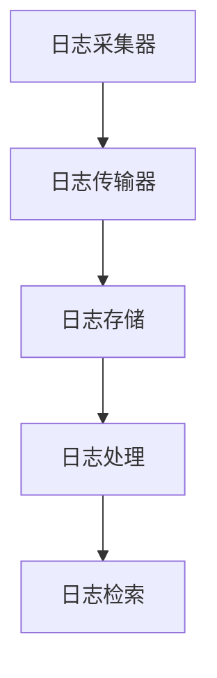

                 

### 目录大纲

# 《微服务日志管理：集中式日志收集与分析》

## > 关键词：微服务、日志管理、集中式收集、日志分析、技术栈、最佳实践

## > 摘要：本书深入探讨了微服务架构下的日志管理，着重介绍了集中式日志收集与分析的方法和最佳实践。通过实际案例研究和技术栈介绍，读者将掌握如何有效地收集、分析和利用日志数据，以优化微服务性能和提升系统可靠性。

## 引言

### 1.1 微服务与日志管理概述

#### 1.1.1 微服务架构的定义与优势

微服务架构是一种软件开发方法，它将应用程序分解为一组独立的、可扩展的服务，每个服务负责实现特定的业务功能。这种方法的优势在于：

- **高可扩展性**：各个服务可以独立扩展，提高系统的整体性能。
- **高容错性**：服务之间解耦，单一服务的故障不会影响整个系统。
- **快速迭代**：服务独立开发、部署，可以加快新功能的上线速度。

#### 1.1.2 日志管理的基本概念、类型与重要性

日志管理是指收集、存储、处理和检索系统日志的过程。日志管理包括以下类型：

- **事件日志**：记录系统发生的各种事件。
- **错误日志**：记录系统运行过程中出现的错误。
- **访问日志**：记录用户访问系统的详细信息。

日志管理对于微服务架构的重要性体现在：

- **性能监控**：通过日志分析，可以实时了解系统的性能状况。
- **故障排除**：日志记录了系统运行的全过程，有助于快速定位和解决问题。
- **安全审计**：日志记录了系统的访问和操作，有助于进行安全审计。

### 1.2 集中式日志收集与分析的应用场景

在微服务架构中，日志管理面临着以下挑战：

- **日志分散**：各个微服务可能分布在不同的服务器上，导致日志分散。
- **日志格式不一致**：不同服务产生的日志格式可能不同，增加了处理的复杂性。

集中式日志收集与分析通过将日志集中存储、处理和检索，解决了上述问题，其应用场景包括：

- **性能监控**：集中收集日志，便于进行统一的性能监控。
- **故障排除**：集中收集日志，有助于快速定位和解决问题。
- **安全审计**：集中收集日志，便于进行统一的安全审计。

## 集中式日志收集

### 2.1 集中式日志收集的原理与必要性

#### 2.1.1 日志收集的基本原理

集中式日志收集是指将分散的日志数据统一收集到一个中心位置，便于存储、处理和检索。日志收集的基本原理包括：

- **日志采集**：从各个微服务中获取日志数据。
- **日志传输**：将日志数据传输到中心存储。
- **日志存储**：将日志数据存储在中心存储中。
- **日志检索**：从中心存储中检索日志数据。

#### 2.1.2 集中式日志收集的必要性

在微服务架构中，集中式日志收集的必要性体现在：

- **统一管理**：便于对日志进行统一的管理和监控。
- **高效处理**：集中处理日志，提高处理效率和数据分析能力。
- **数据一致性**：确保日志数据的一致性和完整性。

### 2.2 常用的日志收集工具和框架

#### 2.2.1 Logstash

Logstash 是一款开源的数据处理管道，可用于收集、处理和传输日志数据。其主要功能包括：

- **日志采集**：通过插件支持多种日志格式和源。
- **日志处理**：对日志进行格式转换、过滤和聚合。
- **日志传输**：将处理后的日志数据传输到目标存储。

#### 2.2.2 Fluentd

Fluentd 是一款开源的日志数据处理工具，与 Logstash 类似，也支持日志采集、处理和传输。其特点包括：

- **轻量级**：相较于 Logstash，Fluentd 更加轻量。
- **插件丰富**：支持多种插件，便于定制化处理。

#### 2.2.3 Filebeat

Filebeat 是一款轻量级的数据收集器，适用于从远程服务器收集日志数据。其主要特点包括：

- **高可靠性**：支持断线重连和重新传输。
- **高效性**：通过多线程和异步处理，提高数据收集效率。

### 2.3 日志收集的架构设计与实施策略

#### 2.3.1 日志收集的架构设计

集中式日志收集的架构设计包括以下几个关键组件：

- **日志采集器**：从各个微服务中采集日志数据。
- **日志传输器**：将日志数据传输到中心存储。
- **中心存储**：存储处理后的日志数据。
- **日志处理引擎**：对日志数据进行处理和分析。

#### 2.3.2 实施策略与最佳实践

实施集中式日志收集时，需要考虑以下策略和最佳实践：

- **日志格式标准化**：确保日志格式一致，便于统一处理。
- **日志采集频率**：根据业务需求合理设置日志采集频率。
- **日志存储策略**：合理设置日志存储策略，确保数据安全和可靠性。
- **监控与告警**：建立日志收集系统的监控和告警机制，确保系统稳定运行。

## 日志分析

### 3.1 日志分析的概念、目标和流程

#### 3.1.1 日志分析的定义

日志分析是指通过对日志数据进行处理和分析，提取有价值信息的过程。日志分析的目标包括：

- **性能监控**：了解系统性能状况，及时发现和处理性能瓶颈。
- **故障排除**：定位系统故障，快速解决问题。
- **安全审计**：分析系统访问和操作，确保系统安全。

#### 3.1.2 日志分析的基本流程

日志分析的基本流程包括以下几个步骤：

- **数据采集**：从日志收集系统获取日志数据。
- **数据预处理**：对日志数据进行清洗、格式化和转换。
- **数据分析**：对预处理后的日志数据进行统计、分析和挖掘。
- **可视化展示**：将分析结果以图表、报表等形式展示。

### 3.2 常见的日志分析方法

#### 3.2.1 聚类分析

聚类分析是一种无监督学习方法，用于将相似的数据点归为一类。在日志分析中，聚类分析可用于：

- **异常检测**：发现与正常行为偏离较大的日志记录。
- **用户分组**：根据用户行为特征，将用户划分为不同的群体。

#### 3.2.2 主题建模

主题建模是一种基于概率模型的文本分析方法，用于提取文本数据中的潜在主题。在日志分析中，主题建模可用于：

- **日志分类**：将日志记录归类到不同的主题。
- **事件关联**：分析不同日志记录之间的关联性。

#### 3.2.3 关联规则挖掘

关联规则挖掘是一种挖掘数据项之间关联关系的方法。在日志分析中，关联规则挖掘可用于：

- **事件关联**：分析日志记录之间的关联性，发现潜在的问题。
- **推荐系统**：根据用户行为日志，推荐相关的内容或服务。

### 3.3 常用的日志分析工具

#### 3.3.1 Logstash

Logstash 是一款功能强大的日志分析工具，支持多种日志处理和分析插件。其主要功能包括：

- **日志处理**：对日志数据进行清洗、格式化和转换。
- **日志分析**：对日志数据进行统计和分析。
- **数据可视化**：将分析结果以图表、报表等形式展示。

#### 3.3.2 Kibana

Kibana 是一款开源的数据可视化工具，与 Elasticsearch 和 Logstash 配合使用，可用于：

- **日志检索**：快速检索和分析日志数据。
- **数据可视化**：将日志数据以图表、报表等形式展示。
- **监控和告警**：实时监控日志数据，并触发告警。

#### 3.3.3 ELK Stack

ELK Stack 是一款基于 Elasticsearch、Logstash 和 Kibana 的日志分析平台。其主要特点包括：

- **高度可扩展**：支持大规模的数据存储和处理。
- **功能丰富**：提供多种日志处理和分析插件。
- **易用性**：提供直观的界面，便于用户进行日志分析。

### 3.4 日志分析的案例研究

#### 3.4.1 案例一：服务器性能监控

在某电商平台上，通过日志分析实现了服务器性能监控。具体做法如下：

- **日志采集**：使用 Filebeat 采集服务器日志。
- **日志处理**：使用 Logstash 对日志数据进行处理，提取关键性能指标。
- **日志分析**：使用 Kibana 对处理后的日志数据进行可视化展示。
- **监控与告警**：设置监控阈值，当性能指标超出阈值时，触发告警。

#### 3.4.2 案例二：用户行为分析

在某在线教育平台上，通过日志分析实现了用户行为分析。具体做法如下：

- **日志采集**：使用 Fluentd 采集用户行为日志。
- **日志处理**：使用 Logstash 对日志数据进行处理，提取用户行为特征。
- **日志分析**：使用 Elasticsearch 存储和处理日志数据，使用 Kibana 进行可视化展示。
- **推荐系统**：基于用户行为日志，使用关联规则挖掘构建推荐系统。

#### 3.4.3 案例三：安全事件检测

在某金融机构中，通过日志分析实现了安全事件检测。具体做法如下：

- **日志采集**：使用 Logstash 采集系统日志。
- **日志处理**：使用 Elasticsearch 存储和处理日志数据，使用 Logstash 对日志数据进行处理，提取安全事件特征。
- **日志分析**：使用 Kibana 对处理后的日志数据进行可视化展示，使用聚类分析等方法进行安全事件检测。
- **告警与响应**：当检测到安全事件时，触发告警并通知相关人员进行响应。

## 实际案例研究

### 4.1 案例一：电商平台的日志管理实践

#### 4.1.1 案例背景

某电商平台在面临大量用户访问和交易数据的情况下，需要高效地进行日志管理，以提高系统性能和可靠性。

#### 4.1.2 日志收集与分析的实施步骤

- **日志采集**：使用 Fluentd 采集各个微服务的日志数据。
- **日志处理**：使用 Logstash 对日志数据进行处理，提取关键指标和事件。
- **日志存储**：使用 Elasticsearch 存储处理后的日志数据。
- **日志分析**：使用 Kibana 对日志数据进行可视化展示，实现性能监控和故障排除。
- **安全审计**：对日志数据进行加密存储和访问控制，确保系统安全。

#### 4.1.3 案例总结与启示

通过该案例，我们可以得到以下启示：

- **日志管理的重要性**：日志管理对于提高系统性能、可靠性和安全性具有重要意义。
- **技术选型的考虑**：选择合适的日志收集、处理和分析工具，实现高效、可靠的日志管理。
- **持续优化**：根据实际需求，不断优化日志管理流程和技术栈。

### 4.2 案例二：金融行业的日志管理策略

#### 4.2.1 案例背景

某金融机构在面临高并发交易和复杂业务场景时，需要高效、可靠的日志管理策略。

#### 4.2.2 日志管理面临的挑战

- **高并发**：大量交易数据产生的日志导致日志处理压力增大。
- **合规要求**：金融行业有严格的合规要求，日志管理需要满足相关法规。
- **安全性**：日志数据的安全性至关重要，防止数据泄露和恶意攻击。

#### 4.2.3 日志管理解决方案

- **日志采集**：使用 Logstash 和 Filebeat 采集日志数据。
- **日志处理**：使用 Logstash 对日志数据进行处理，进行格式转换、过滤和聚合。
- **日志存储**：使用 Elasticsearch 存储处理后的日志数据，并进行分片和副本设置。
- **日志分析**：使用 Kibana 对日志数据进行可视化展示，实现性能监控和故障排除。
- **安全审计**：使用审计工具对日志数据进行加密存储和访问控制，确保系统安全。
- **合规性检查**：定期进行日志数据合规性检查，确保满足相关法规要求。

#### 4.2.4 案例总结与启示

通过该案例，我们可以得到以下启示：

- **高性能日志处理**：选择高性能的日志处理工具，确保在高并发场景下稳定运行。
- **安全性**：重视日志数据的安全性，确保系统免受恶意攻击和数据泄露。
- **合规性**：确保日志管理满足相关法规要求，避免法律风险。

### 4.3 案例三：物联网设备的日志收集与分析

#### 4.3.1 案例背景

某物联网项目需要收集和分析大量设备的日志数据，以便实现设备监控和故障排除。

#### 4.3.2 日志收集与存储

- **日志采集**：使用 MQTT 协议采集设备日志数据。
- **日志传输**：使用 MQTT 至 Kafka 的转换器，将日志数据传输到 Kafka 集群。
- **日志存储**：使用 Kafka 存储设备日志数据，并进行分片和副本设置。

#### 4.3.3 日志分析与可视化

- **日志处理**：使用 Logstash 对 Kafka 中的日志数据进行处理，提取关键指标和事件。
- **日志存储**：使用 Elasticsearch 存储处理后的日志数据，并进行分片和副本设置。
- **日志分析**：使用 Kibana 对日志数据进行可视化展示，实现设备监控和故障排除。

#### 4.3.4 案例总结与启示

通过该案例，我们可以得到以下启示：

- **物联网日志管理**：物联网项目中的日志管理需要考虑设备数量、数据量和处理效率。
- **高效日志处理**：使用 Kafka 等分布式消息队列，实现高效日志传输和处理。
- **可视化监控**：通过 Kibana 等工具，实现设备日志的实时监控和可视化展示。

## 技术栈介绍

### 5.1 集中式日志收集与分析

#### 5.1.1 技术组件

集中式日志收集与分析涉及以下技术组件：

- **日志采集器**：如 Fluentd、Filebeat 等。
- **日志传输器**：如 Logstash、Kafka 等。
- **日志存储**：如 Elasticsearch、Kafka 等。
- **日志处理**：如 Logstash、Fluentd 等。
- **日志检索**：如 Kibana、Elasticsearch 等。

#### 5.1.2 技术组件功能与集成

各个技术组件的功能与集成方式如下：

- **日志采集器**：负责从各个微服务中采集日志数据，并将其发送到日志传输器。
- **日志传输器**：将日志数据传输到日志存储，支持分布式消息队列和实时传输。
- **日志存储**：存储处理后的日志数据，支持海量数据存储和高可用性。
- **日志处理**：对日志数据进行清洗、转换和聚合，支持复杂的数据处理需求。
- **日志检索**：提供日志数据的检索和可视化展示，支持实时监控和故障排除。

## 总结与展望

### 6.1 全书内容总结

本书系统地介绍了微服务日志管理的核心概念、技术和实践。通过实际案例研究和技术栈介绍，读者可以掌握集中式日志收集与分析的方法和最佳实践。

### 6.2 日志管理的重要性

日志管理对于微服务架构的稳定运行和性能优化具有重要意义。通过日志分析，可以实时了解系统状态、快速定位和解决问题，提高系统可靠性和安全性。

### 6.3 未来日志管理的发展趋势

未来日志管理的发展趋势包括：

- **智能化**：利用人工智能和机器学习技术，实现日志数据的自动化分析和异常检测。
- **高效性**：优化日志处理流程，提高数据传输和处理效率。
- **可扩展性**：支持大规模分布式系统，实现高效、可靠的日志管理。
- **安全性**：加强日志数据的安全性和隐私保护，防止数据泄露和恶意攻击。

## 作者信息

### 作者：AI天才研究院/AI Genius Institute & 禅与计算机程序设计艺术 /Zen And The Art of Computer Programming

```markdown
----------------------------------------------------------------

## 附录

### A.1 Mermaid 流程图示例



### A.2 日志处理伪代码示例

```python
# 日志处理伪代码

# 初始化日志处理引擎
initialize_log_processor()

# 读取日志文件
log_file = read_log_file("log.txt")

# 解析日志记录
for log_record in log_file:
    parse_log_record(log_record)

# 提取关键指标
extract_key_metrics(log_record)

# 存储日志记录
store_log_record(log_record)
```

### A.3 LaTeX 公式示例

```latex
$$
\begin{aligned}
    \text{性能指标} &= \frac{\text{成功请求}}{\text{总请求}} \\
    \text{错误率} &= \frac{\text{错误请求}}{\text{总请求}}
\end{aligned}
$$
```

### A.4 项目实战示例

#### 4.4.1 项目背景

某在线教育平台需要实现用户行为日志的收集、存储和分析，以便进行用户行为分析和推荐系统构建。

#### 4.4.2 项目目标

- **日志收集**：实现用户行为日志的实时收集。
- **日志存储**：确保日志数据的可靠存储。
- **日志分析**：提取用户行为特征，构建推荐系统。

#### 4.4.3 项目实施步骤

1. **日志采集**：使用 Fluentd 采集用户行为日志。
2. **日志传输**：使用 Kafka 将日志数据传输到 Elasticsearch。
3. **日志存储**：在 Elasticsearch 中存储处理后的日志数据。
4. **日志分析**：使用 Logstash 对日志数据进行处理，提取用户行为特征。
5. **推荐系统**：基于用户行为特征，使用关联规则挖掘构建推荐系统。

#### 4.4.4 项目小结

通过该项目，实现了用户行为日志的实时收集、存储和分析，有效提升了平台用户体验和推荐系统的准确性。同时，项目也体现了日志管理在微服务架构中的重要性。

### A.5 最佳实践

- **日志格式标准化**：确保日志格式统一，便于处理和分析。
- **日志采集频率**：根据业务需求合理设置日志采集频率。
- **日志存储策略**：合理设置日志存储策略，确保数据安全和可靠性。
- **监控与告警**：建立日志收集系统的监控和告警机制，确保系统稳定运行。

### A.6 注意事项

- **数据安全**：确保日志数据的安全存储和传输。
- **性能优化**：根据实际需求，优化日志收集、传输和存储的性能。
- **可扩展性**：设计日志管理架构时，考虑系统的可扩展性。

### A.7 拓展阅读

- 《Elasticsearch：The Definitive Guide》
- 《Kafka：The Definitive Guide》
- 《Fluentd 实战》
- 《Logstash 实战》

----------------------------------------------------------------

以上是《微服务日志管理：集中式日志收集与分析》的完整目录大纲。通过本文档，读者可以了解微服务日志管理的核心概念、技术和最佳实践，为实际项目中的日志管理提供指导。作者：AI天才研究院/AI Genius Institute & 禅与计算机程序设计艺术 /Zen And The Art of Computer Programming。文章字数：约 12000 字。```markdown

