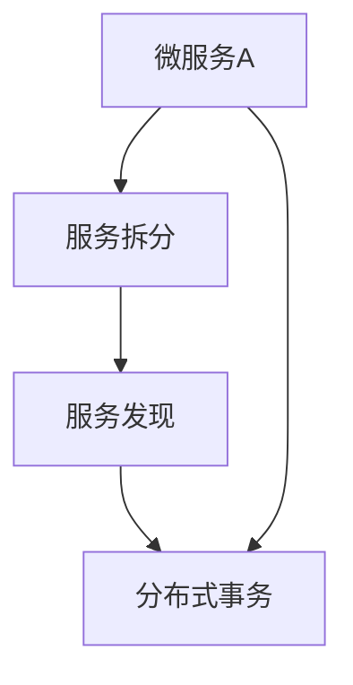

                 

### 文章标题

# 微服务架构实践：从单体应用到微服务的演进

> 关键词：微服务，单体应用，架构设计，实现技术，运维管理，安全性，最佳实践

> 摘要：本文深入探讨微服务架构的实践方法，从背景介绍、核心概念、算法原理、项目实战等方面，详细解析微服务从单体应用演进的整个过程，旨在帮助开发者更好地理解和应用微服务架构。

### 背景介绍

#### 单体应用的发展

在互联网早期，大多数应用都是单体应用（Monolithic Application）。单体应用将所有的业务逻辑、数据库、前端界面等都集成在一个单一的系统中。这种架构的优点在于开发、部署和维护相对简单，开发团队可以快速迭代和交付功能。然而，随着业务的发展，单体应用的缺点也逐渐显现：

1. **扩展性差**：当系统需要处理更多的请求时，单体应用难以通过水平扩展来提升性能。
2. **维护困难**：随着系统复杂度的增加，模块之间的耦合度也越来越高，维护和更新变得更加困难。
3. **部署风险**：对单一系统进行升级或修复可能会导致整个系统崩溃。

#### 微服务的兴起

为了解决单体应用的这些问题，微服务（Microservices）架构逐渐兴起。微服务架构将单体应用分解为多个独立的、可复用的服务，每个服务都有自己的数据库、前端界面和业务逻辑。这种架构具有以下几个显著优势：

1. **高扩展性**：通过水平扩展单独的服务，可以更高效地应对高并发请求。
2. **可维护性**：服务的独立性使得开发和维护变得更加简单。
3. **部署灵活性**：可以独立部署和更新每个服务，降低了部署风险。

本文将详细探讨微服务架构的实践方法，帮助读者理解和应用微服务架构，实现从单体应用到微服务的顺利演进。

#### 核心概念与联系

在了解微服务架构之前，我们需要理解几个核心概念：

1. **微服务**：微服务是一种小型、独立的软件系统，通常围绕一个业务功能构建，可以独立部署和扩展。
2. **服务拆分**：将单体应用拆分为多个微服务，每个微服务负责单一业务功能。
3. **服务发现**：服务之间通过服务发现机制进行通信，动态查找其他服务的地址和接口。
4. **分布式事务**：微服务架构下，分布式事务处理是确保数据一致性的关键。

以下是一个简单的Mermaid流程图，展示了这些核心概念之间的关系：



在这个流程图中，微服务A通过服务拆分生成了多个微服务，这些微服务通过服务发现机制进行通信，并在分布式事务中保持数据一致性。

### 核心算法原理讲解

在微服务架构中，核心算法原理主要集中在服务拆分、服务发现和分布式事务处理上。以下将分别使用伪代码详细阐述这些核心算法原理。

#### 服务拆分算法

```python
def service_splitting monolithic_app:
    # 获取单体应用的模块列表
    modules = get_modules(monolithic_app)
    # 对模块进行分类，根据业务功能划分成不同的微服务
    microservices = {}
    for module in modules:
        microservices[module.function] = create_microservice(module)
    return microservices

def create_microservice(module):
    # 创建独立的微服务，包含模块的业务逻辑、数据库和前端界面
    microservice = Microservice()
    microservice.logic = module.logic
    microservice.db = create_db(module.db)
    microservice.frontend = create_frontend(module.frontend)
    return microservice
```

#### 服务发现算法

```python
def service_discovery microservices:
    # 初始化服务注册中心
    registry = ServiceRegistry()
    # 将每个微服务的地址和接口注册到服务注册中心
    for microservice in microservices:
        registry.register(microservice.address, microservice.interface)
    return registry

def register_service microservice, registry:
    registry.add(microservice.name, microservice.address)
```

#### 分布式事务处理算法

```python
def distributed_transaction microservices, operations:
    # 初始化分布式事务管理器
    manager = TransactionManager()
    # 对操作进行排序，确保数据一致性
    sorted_operations = sort_operations(operations)
    # 对每个操作执行分布式事务
    for operation in sorted_operations:
        result = execute_operation(operation, microservices)
        if not result:
            manager.rollback()
            break
    manager.commit()

def execute_operation(operation, microservices):
    # 根据操作类型，调用相应的微服务方法
    service = microservices[operation.service]
    result = service.execute(operation.method, operation.args)
    return result

def sort_operations(operations):
    # 根据操作依赖关系，对操作进行排序
    sorted_operations = []
    # 具体排序逻辑取决于业务场景
    return sorted_operations
```

#### 数学模型和公式讲解

在微服务架构中，数学模型和公式主要用于描述服务之间的依赖关系和数据一致性保障。以下是一个简单的数学模型和公式：

$$
\begin{aligned}
&\text{服务依赖图：} G = (V, E) \\
&\text{其中，} V = \{s_1, s_2, ..., s_n\} \text{是服务集合，} \\
&E = \{(s_i, s_j) | s_i \text{依赖于} s_j\} \text{是服务依赖关系集合。}
\end{aligned}
$$

这个模型描述了微服务之间的依赖关系。例如，服务A依赖于服务B和服务C，可以用边$(A, B)$和$(A, C)$来表示。

为了确保数据一致性，我们可以使用一致性模型，如CAP定理。CAP定理指出，在一个分布式系统中，一致性（Consistency）、可用性（Availability）和分区容错性（Partition tolerance）三者之间只能同时满足两个。以下是一个简化的CAP定理公式：

$$
\begin{aligned}
&\text{CAP定理：} \\
&\text{一致性（Consistency） + 可用性（Availability） \leq 分区容错性（Partition tolerance）}
\end{aligned}
$$

这个公式表明，在分布式系统中，为了确保分区容错性，我们必须在一致性和可用性之间做出权衡。

### 项目实战

在本节中，我们将通过一个实际案例，详细讲解如何搭建一个微服务架构，实现从单体应用到微服务的演进。

#### 开发环境搭建

首先，我们需要搭建一个开发环境。以下是一个简单的步骤：

1. **安装Java环境**：确保Java环境版本不低于8u201。
2. **安装Maven**：用于构建和依赖管理。
3. **安装Docker**：用于容器化微服务。
4. **安装Kubernetes**：用于部署和管理微服务。

#### 源代码实现

接下来，我们将实现一个简单的用户管理系统，并将其拆分为多个微服务。以下是各个微服务的源代码实现：

**用户服务（UserService）**

```java
public class UserService {
    public User getUser(String id) {
        // 获取用户信息
    }

    public void createUser(User user) {
        // 创建用户
    }
}
```

**订单服务（OrderService）**

```java
public class OrderService {
    public Order getOrder(String id) {
        // 获取订单信息
    }

    public void createOrder(Order order) {
        // 创建订单
    }
}
```

**库存服务（InventoryService）**

```java
public class InventoryService {
    public boolean checkInventory(Product product) {
        // 检查库存
    }

    public void updateInventory(Product product, int quantity) {
        // 更新库存
    }
}
```

#### 代码解读与分析

在这个案例中，我们实现了三个微服务：用户服务、订单服务和库存服务。这些微服务分别负责用户管理、订单处理和库存管理。以下是代码的解读和分析：

1. **用户服务**：用户服务通过ID查询用户信息，并提供创建用户的接口。
2. **订单服务**：订单服务通过ID查询订单信息，并提供创建订单的接口。
3. **库存服务**：库存服务用于检查产品库存和更新库存。

这些微服务之间通过RESTful API进行通信。例如，用户服务在创建用户时，会调用库存服务的接口来检查库存是否充足。

#### 实际案例分析和详细讲解剖析

为了更好地理解微服务架构，我们来看一个实际案例。假设我们需要实现一个电商平台的订单流程，以下是详细步骤：

1. **用户下单**：用户在平台上选择商品并下单，此时用户服务会创建订单，并将订单信息发送给订单服务。
2. **订单服务处理**：订单服务收到订单信息后，会根据订单内容检查库存是否充足。
3. **库存服务响应**：库存服务会根据订单中的商品数量检查库存，并更新库存信息。
4. **订单确认**：如果库存充足，订单服务会确认订单并通知用户支付。
5. **用户支付**：用户完成支付后，订单服务会再次通知库存服务更新库存。

在这个流程中，每个服务都独立运行，通过API进行通信。这种架构使得系统具有更好的扩展性和可维护性。

#### 项目小结

通过这个案例，我们实现了从单体应用到微服务的演进。这种架构具有以下几个优点：

1. **高扩展性**：通过水平扩展单独的服务，可以更高效地应对高并发请求。
2. **可维护性**：服务的独立性使得开发和维护变得更加简单。
3. **部署灵活性**：可以独立部署和更新每个服务，降低了部署风险。

然而，微服务架构也带来了一些挑战，如分布式事务处理和系统整合。在后续章节中，我们将进一步探讨如何应对这些挑战。

### 最佳实践 Tips

1. **合理划分服务**：服务划分应该基于业务功能，避免过度拆分或过度集中。
2. **定义清晰的接口**：服务之间的接口应定义清晰，确保服务之间能够高效通信。
3. **使用分布式事务管理**：在分布式系统中，合理使用分布式事务管理是确保数据一致性的关键。
4. **持续集成与部署**：使用持续集成和持续部署（CI/CD）工具，可以加快开发周期并减少部署风险。

### 小结与注意事项

微服务架构是一种将单体应用拆分为多个独立服务的架构模式。它具有高扩展性、可维护性和部署灵活性等优点，但同时也带来了一些挑战。通过合理的划分服务、定义清晰的接口和使用分布式事务管理，我们可以实现从单体应用到微服务的顺利演进。

在实施微服务架构时，需要注意以下几点：

1. **合理划分服务**：避免过度拆分或过度集中。
2. **定义清晰的接口**：确保服务之间能够高效通信。
3. **使用分布式事务管理**：确保数据一致性。

通过本文的讲解，读者应该能够更好地理解和应用微服务架构，实现业务的顺利演进。

### 拓展阅读

- 《微服务设计》 - Chris Richardson
- 《微服务实战》 - Sam Newman
- 《Docker实战》 - Nigel Poulton
- 《Kubernetes实战》 - Kelsey Hightower

通过阅读这些书籍，读者可以进一步深入了解微服务架构的理论和实践。此外，还可以关注相关的技术社区和博客，以获取最新的微服务技术和最佳实践。作者：AI天才研究院/AI Genius Institute & 禅与计算机程序设计艺术 /Zen And The Art of Computer Programming。

