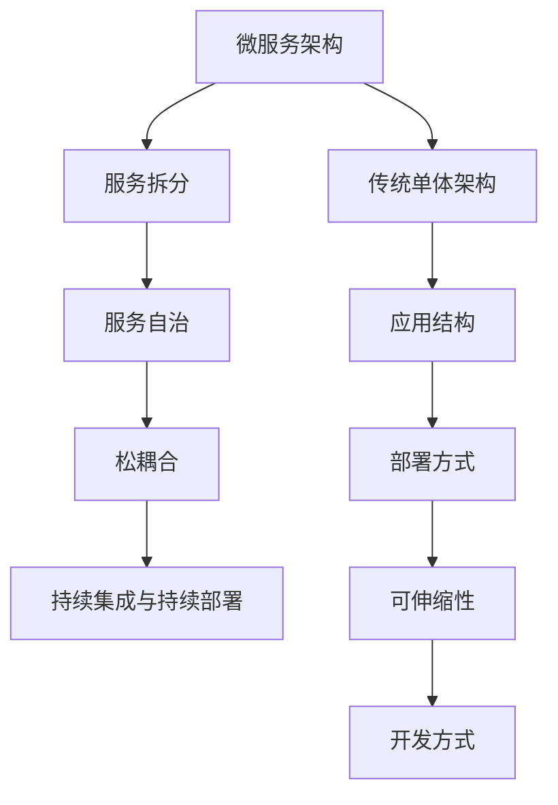

                 

# 《微服务架构的设计与实现》

## 关键词

- 微服务架构
- 服务拆分
- 服务注册与发现
- 负载均衡
- 服务容错
- 服务监控
- 容器化
- Kubernetes
- 无服务架构

## 摘要

本文深入探讨了微服务架构的设计与实现，旨在为读者提供一个全面、系统的理解和实践指导。文章首先介绍了微服务架构的基本概念、原理及其与传统单体架构的区别。随后，详细解析了微服务的核心算法原理，包括服务拆分、服务注册与发现、负载均衡、服务容错和服务监控等。通过具体的项目实战和实际案例，文章进一步展示了微服务架构的搭建流程和实现细节。最后，文章探讨了微服务架构面临的挑战和未来的发展趋势，为读者提供了最佳实践和拓展阅读建议。

## 引言

微服务架构是近年来软件开发领域的一个重要趋势。它通过将应用程序划分为一组小型、自治的服务，使得开发和部署更加灵活、高效。与传统单体架构相比，微服务架构具有更高的可伸缩性、可靠性和可维护性。随着互联网和移动应用的快速发展，微服务架构已成为企业构建现代应用的首选方案。

本文将按照以下结构进行论述：

1. **微服务架构基础**：介绍微服务架构的核心概念、设计原则以及与传统单体架构的区别。
2. **微服务的核心算法原理**：详细讲解服务拆分、服务注册与发现、负载均衡、服务容错和服务监控等核心算法原理。
3. **微服务架构的实践与实现**：通过实际项目和案例，展示微服务架构的搭建流程和实现细节。
4. **微服务架构的挑战与未来**：探讨微服务架构面临的挑战和未来的发展趋势。

接下来，我们将逐步深入探讨每个部分的内容。

### 第一部分：微服务架构基础

#### 第1章：微服务架构概述

**1.1 微服务架构的起源与发展**

微服务架构的概念起源于2000年初，由ThoughtWorks公司的Martin Fowler和James Lewis首先提出。微服务架构的主要思想是将大型单体应用拆分为一组小型、独立的服务，每个服务负责实现特定的业务功能。这种架构风格旨在解决单体应用在可伸缩性、可靠性和可维护性方面的挑战。

随着云计算和容器技术的兴起，微服务架构得到了广泛应用。企业通过采用微服务架构，能够更加灵活地应对业务变化，提高开发效率和系统的稳定性。目前，许多大型企业，如亚马逊、阿里巴巴、腾讯等，都已成功实践了微服务架构。

**1.2 微服务架构的核心概念与联系**

微服务架构的核心概念包括：

- **服务拆分**：根据业务需求和功能独立性，将大型单体应用拆分为多个小型服务。
- **服务自治**：每个服务拥有独立的开发、部署和扩展能力，降低服务之间的依赖性。
- **松耦合**：服务之间通过轻量级的通信协议（如RESTful API、消息队列等）进行交互，降低服务之间的耦合度。
- **持续集成与持续部署**：通过自动化工具实现服务的快速集成和部署，提高开发效率。

这些概念之间相互关联，共同构成了微服务架构的核心。

**1.3 微服务架构与传统单体架构的区别**

微服务架构与传统的单体架构有以下主要区别：

1. **应用结构**：单体架构将所有功能集中在一个大型的应用程序中，而微服务架构将应用程序拆分为多个独立的小型服务。
2. **部署方式**：单体架构通常采用单体部署方式，而微服务架构采用分布式部署方式，每个服务可以独立部署和管理。
3. **可伸缩性**：微服务架构具有更高的可伸缩性，可以根据业务需求独立扩展特定的服务。
4. **开发方式**：微服务架构支持更快的迭代和开发，每个服务可以独立开发、测试和部署。

通过上述对比，我们可以看出微服务架构在多个方面具有显著的优势，使其成为现代应用开发的重要选择。

#### 第2章：微服务架构的设计原则

**2.1 单一职责原则**

单一职责原则是微服务架构设计的重要原则之一。其核心思想是将功能分解为多个小型服务，每个服务负责实现特定的业务功能。这种设计方式有助于降低系统的复杂度，提高可维护性和可扩展性。

例如，在一个电商平台上，我们可以将订单管理、商品管理、用户管理等功能分别拆分为独立的服务，每个服务只负责处理与其相关的业务逻辑。

**2.2 松耦合原则**

松耦合原则强调服务之间应通过轻量级的通信协议进行交互，降低服务之间的依赖性。这种方式有助于提高系统的灵活性，减少服务之间的相互影响。

常见的通信协议包括RESTful API、消息队列（如Kafka、RabbitMQ等）和gRPC等。通过选择合适的通信协议，可以实现服务之间的松耦合，提高系统的可维护性和可扩展性。

**2.3 服务自治原则**

服务自治原则要求每个服务拥有独立的开发、部署和扩展能力。这意味着服务之间可以独立开发、测试和部署，降低服务之间的耦合度，提高开发效率。

服务自治还包括服务监控、日志记录和故障处理等方面。通过实现服务自治，可以更好地监控和管理服务，提高系统的可靠性和可维护性。

**2.4 持续集成与持续部署**

持续集成（CI）和持续部署（CD）是微服务架构设计的重要原则。持续集成通过自动化工具将代码集成到主干分支，确保代码的持续整合和测试。持续部署则通过自动化工具实现服务的快速部署和上线。

持续集成与持续部署有助于提高开发效率和代码质量，减少人为错误。同时，它们还能确保服务的快速迭代和上线，满足业务需求的变化。

通过遵循上述设计原则，我们可以构建出高效、灵活、可靠的微服务架构，满足现代应用的开发需求。

#### 第3章：微服务的核心算法原理

**3.1 服务拆分算法**

服务拆分是微服务架构设计的重要步骤。其核心思想是根据业务需求和功能独立性，将大型单体应用拆分为多个小型服务。服务拆分算法主要包括以下步骤：

1. **需求分析**：对业务需求进行深入分析，确定各个功能模块及其相互关系。
2. **功能独立性评估**：评估各个功能模块的独立性，确定哪些功能模块可以独立拆分为单独的服务。
3. **依赖关系分析**：分析功能模块之间的依赖关系，确保拆分后的服务之间能够正常交互。
4. **服务划分**：根据需求分析、功能独立性和依赖关系分析的结果，将功能模块拆分为独立的服务。

服务拆分算法的关键是平衡系统的复杂度和开发效率。拆分过于细致会导致系统复杂性增加，而拆分过于粗粒度则可能降低开发效率。因此，在设计服务拆分算法时，需要综合考虑业务需求和开发资源。

**3.2 服务注册与发现算法**

服务注册与发现是微服务架构中不可或缺的组件。服务注册与发现算法主要包括以下步骤：

1. **服务注册**：服务启动时，将其相关信息（如服务名、端口号、地址等）注册到一个注册中心（如Eureka、Consul等）。
2. **服务发现**：客户端从注册中心获取服务列表，并根据负载均衡策略选择合适的服务进行调用。

服务注册与发现算法的关键是保证服务的可靠性和实时性。服务注册过程中，需要确保服务的状态信息准确无误。服务发现过程中，需要及时更新服务列表，确保客户端能够选择到健康的服务实例。

**3.3 负载均衡算法**

负载均衡算法是微服务架构中提高系统性能和可用性的重要手段。负载均衡算法主要包括以下类型：

1. **轮询负载均衡**：按照服务实例的顺序依次分配请求，实现均匀的负载分配。
2. **最小连接数负载均衡**：将请求分配到连接数最少的服务实例，降低服务实例的负载。
3. **加权负载均衡**：根据服务实例的权重分配请求，实现更精细的负载分配。

负载均衡算法的关键是平衡系统的性能和资源利用率。不同的负载均衡算法适用于不同的场景和需求。在实际应用中，可以根据具体场景选择合适的负载均衡算法。

**3.4 服务容错算法**

服务容错是微服务架构中确保系统高可用性的关键。服务容错算法主要包括以下策略：

1. **服务降级**：在系统负载过高或服务实例异常时，将部分服务实例下线，降低系统的响应时间。
2. **限流**：限制客户端对系统的请求速率，避免系统过载。
3. **重试**：在服务调用失败时，根据策略进行重试，提高服务的可靠性。

服务容错算法的关键是确保系统的高可用性和稳定性。在实际应用中，可以根据具体需求组合使用不同的服务容错策略。

**3.5 服务监控算法**

服务监控是微服务架构中确保系统健康运行的重要手段。服务监控算法主要包括以下方面：

1. **性能监控**：实时监控服务性能指标（如CPU、内存、请求响应时间等），发现潜在的性能问题。
2. **健康检查**：定期对服务实例进行健康检查，确保服务实例的正常运行。
3. **日志分析**：分析服务日志，发现和处理服务异常。

服务监控算法的关键是实时性和准确性。通过实时监控和日志分析，可以及时发现和处理系统故障，确保系统的高可用性和稳定性。

#### 第二部分：微服务架构的实践与实现

**第4章：微服务架构的搭建流程**

**4.1 微服务架构的开发环境搭建**

搭建微服务架构的开发环境是开始项目开发的第一步。以下是搭建开发环境的基本步骤：

1. **安装Java开发工具包（JDK）**：确保安装了合适的JDK版本，以满足微服务开发的需求。
2. **安装IDE（如IntelliJ IDEA或Eclipse）**：选择一个适合的IDE，进行代码编写和调试。
3. **安装数据库（如MySQL或PostgreSQL）**：根据项目需求，安装合适的数据库系统。
4. **安装注册中心（如Eureka或Consul）**：用于服务注册与发现。
5. **安装消息队列（如Kafka或RabbitMQ）**：用于服务间通信。

**4.2 微服务架构的核心组件介绍**

微服务架构的核心组件包括：

1. **服务注册中心**：如Eureka或Consul，用于服务注册与发现。
2. **服务网关**：如Zuul或Spring Cloud Gateway，用于统一路由和转发请求。
3. **服务提供者**：实现具体的业务功能，提供RESTful API或其他通信协议。
4. **服务消费者**：调用服务提供者的API，实现业务逻辑。
5. **配置中心**：如Spring Cloud Config，用于集中管理配置信息。

**4.3 微服务架构的项目实战案例**

以下是一个简单的微服务架构项目案例，包括用户管理、订单管理和商品管理三个服务：

1. **用户管理服务**：负责用户信息的创建、查询、更新和删除。
2. **订单管理服务**：负责订单的创建、查询、更新和删除。
3. **商品管理服务**：负责商品信息的创建、查询、更新和删除。

在项目实战中，我们将使用Spring Cloud框架搭建微服务架构，并通过Eureka作为服务注册中心，实现服务注册与发现。同时，使用Spring Cloud Gateway作为服务网关，统一路由和转发请求。通过消息队列（如Kafka）实现服务间的异步通信。

#### 第5章：微服务架构的实际项目案例

**5.1 微服务架构在电商平台的实践**

电商平台是一个典型的微服务架构应用场景。在电商平台中，我们可以将不同功能模块拆分为多个独立的服务，如用户服务、商品服务、订单服务、支付服务等。以下是电商平台中微服务架构的实践：

1. **用户服务**：负责用户信息的创建、查询、更新和删除。使用Spring Boot构建用户服务，通过RESTful API提供用户信息管理功能。
2. **商品服务**：负责商品信息的创建、查询、更新和删除。使用Spring Boot构建商品服务，通过RESTful API提供商品信息管理功能。
3. **订单服务**：负责订单的创建、查询、更新和删除。使用Spring Boot构建订单服务，通过RESTful API提供订单信息管理功能。
4. **支付服务**：负责处理支付请求，与第三方支付平台对接。使用Spring Boot构建支付服务，通过HTTP请求与第三方支付平台交互。
5. **库存服务**：负责管理商品库存信息。使用Spring Boot构建库存服务，通过RESTful API提供库存信息管理功能。

在电商平台的实践中，我们通过服务注册中心（如Eureka）实现服务注册与发现，使用Spring Cloud Gateway作为服务网关，统一路由和转发请求。同时，使用消息队列（如Kafka）实现服务间的异步通信，提高系统的性能和可靠性。

**5.2 微服务架构在金融行业的应用**

金融行业对系统的稳定性、安全性和可靠性有极高的要求。在金融行业中，我们可以将不同功能模块拆分为多个独立的服务，如用户服务、交易服务、风控服务、支付服务等。以下是金融行业中微服务架构的应用：

1. **用户服务**：负责用户信息的创建、查询、更新和删除。使用Spring Boot构建用户服务，通过RESTful API提供用户信息管理功能。
2. **交易服务**：负责处理交易请求，包括交易查询、交易创建、交易更新和交易删除。使用Spring Boot构建交易服务，通过RESTful API提供交易信息管理功能。
3. **风控服务**：负责交易的风险评估和监控。使用Spring Boot构建风控服务，通过RESTful API提供风控信息管理功能。
4. **支付服务**：负责处理支付请求，与第三方支付平台对接。使用Spring Boot构建支付服务，通过HTTP请求与第三方支付平台交互。
5. **报表服务**：负责生成交易报表和统计报表。使用Spring Boot构建报表服务，通过RESTful API提供报表信息管理功能。

在金融行业的应用中，我们同样通过服务注册中心（如Eureka）实现服务注册与发现，使用Spring Cloud Gateway作为服务网关，统一路由和转发请求。同时，使用消息队列（如Kafka）实现服务间的异步通信，提高系统的性能和可靠性。

**5.3 微服务架构在物联网平台的实现**

物联网平台是一个复杂的系统，涉及多个设备、传感器和数据采集。在物联网平台的实现中，我们可以将不同功能模块拆分为多个独立的服务，如设备管理服务、数据采集服务、数据处理服务和监控报警服务。以下是物联网平台中微服务架构的实现：

1. **设备管理服务**：负责设备信息的创建、查询、更新和删除。使用Spring Boot构建设备管理服务，通过RESTful API提供设备信息管理功能。
2. **数据采集服务**：负责从传感器采集数据，并将数据存储到数据库。使用Spring Boot构建数据采集服务，通过HTTP请求与传感器通信，实现数据采集功能。
3. **数据处理服务**：负责处理采集到的数据，包括数据清洗、数据转换和数据存储。使用Spring Boot构建数据处理服务，通过RESTful API提供数据处理功能。
4. **监控报警服务**：负责监控物联网平台的运行状态，并在出现问题时发送报警信息。使用Spring Boot构建监控报警服务，通过RESTful API提供监控报警功能。
5. **用户服务**：负责用户信息的创建、查询、更新和删除。使用Spring Boot构建用户服务，通过RESTful API提供用户信息管理功能。

在物联网平台的实现中，我们同样通过服务注册中心（如Eureka）实现服务注册与发现，使用Spring Cloud Gateway作为服务网关，统一路由和转发请求。同时，使用消息队列（如Kafka）实现服务间的异步通信，提高系统的性能和可靠性。

#### 第6章：微服务架构的性能优化与调优

**6.1 性能监控与优化策略**

性能监控是确保微服务架构正常运行的重要手段。通过性能监控，我们可以发现系统的瓶颈和性能问题，并采取相应的优化策略。以下是一些常用的性能监控与优化策略：

1. **监控CPU和内存使用情况**：定期监控CPU和内存的使用情况，发现资源瓶颈，并优化代码和系统配置。
2. **监控数据库性能**：定期监控数据库的查询性能和连接数，优化SQL语句和数据库配置。
3. **监控网络延迟**：定期监控网络延迟和带宽使用情况，优化网络配置和拓扑结构。
4. **监控服务调用延迟**：定期监控服务之间的调用延迟，优化服务间通信协议和负载均衡策略。

**6.2 负载均衡与流量控制**

负载均衡和流量控制是提高微服务架构性能和可用性的关键。以下是一些负载均衡与流量控制的策略：

1. **轮询负载均衡**：将请求均匀地分配到各个服务实例，实现负载均衡。
2. **最小连接数负载均衡**：将请求分配到连接数最少的服务实例，降低服务实例的负载。
3. **加权负载均衡**：根据服务实例的权重分配请求，实现更精细的负载分配。
4. **流量控制**：限制客户端的请求速率，避免系统过载。可以使用限流器（如令牌桶、漏桶等）实现流量控制。

**6.3 服务容错与回滚策略**

服务容错和回滚策略是确保微服务架构高可用性和数据一致性的关键。以下是一些服务容错与回滚策略：

1. **服务降级**：在系统负载过高或服务实例异常时，将部分服务实例下线，降低系统的响应时间。
2. **重试**：在服务调用失败时，根据策略进行重试，提高服务的可靠性。
3. **回滚**：在服务调用失败时，回滚已经执行的操作，确保数据的一致性。
4. **补偿事务**：在服务调用失败时，通过补偿事务来恢复系统状态，确保数据的一致性。

通过上述性能优化与调优策略，我们可以确保微服务架构的高性能和高可用性，满足业务需求。

### 第三部分：微服务架构的挑战与未来

#### 第7章：微服务架构的挑战与解决策略

**7.1 服务治理与协调**

服务治理是微服务架构中的一个重要挑战。随着服务数量的增加，如何对服务进行有效的管理和协调成为一个关键问题。以下是一些服务治理与协调的策略：

1. **服务监控与日志收集**：通过服务监控和日志收集，实时了解服务的运行状态和性能指标，及时发现和处理问题。
2. **服务网关**：通过服务网关统一管理和协调服务，实现路由、认证、限流等功能。
3. **服务编排与调度**：通过服务编排和调度，根据业务需求和资源情况，动态调整服务的部署和运行状态。
4. **服务版本管理**：通过服务版本管理，确保服务的兼容性和稳定性，降低服务之间的依赖冲突。

**7.2 安全性与隐私保护**

在微服务架构中，如何保证服务的安全性和数据隐私成为关键问题。以下是一些安全性与隐私保护策略：

1. **身份认证与授权**：通过身份认证和授权机制，确保只有授权用户可以访问服务。
2. **数据加密**：对敏感数据进行加密，确保数据在传输和存储过程中的安全性。
3. **安全审计与监控**：对服务的访问和操作进行审计和监控，及时发现和处理安全事件。
4. **安全配置与防护**：定期进行安全配置检查，修复漏洞和隐患，提高服务的安全性。

**7.3 跨服务通信与数据一致性**

在微服务架构中，跨服务通信和数据一致性是确保系统功能完整性的关键。以下是一些跨服务通信与数据一致性策略：

1. **分布式事务管理**：通过分布式事务管理，确保跨服务操作的一致性。
2. **最终一致性**：通过最终一致性模型，实现跨服务的异步通信和数据同步。
3. **事件驱动架构**：通过事件驱动架构，实现服务之间的异步通信和事件驱动。
4. **分布式数据一致性**：通过分布式数据一致性协议（如Paxos、Raft等），确保数据的一致性和可靠性。

通过上述解决策略，我们可以有效地应对微服务架构面临的挑战，提高系统的可靠性和稳定性。

#### 第8章：微服务架构的未来发展趋势

**8.1 服务网格技术**

服务网格（Service Mesh）是一种新型的服务管理技术，旨在简化微服务架构的部署、管理和监控。服务网格通过将服务之间的通信抽象化，提供统一的服务管理和监控能力。以下是一些服务网格技术的发展趋势：

1. **Istio**：Istio是一种开源的服务网格平台，提供了丰富的服务管理功能，包括服务路由、负载均衡、服务监控等。
2. **Kubernetes集成**：随着Kubernetes在容器编排领域的广泛应用，服务网格技术逐渐与Kubernetes集成，实现更高效的容器化服务管理。
3. **服务发现与注册**：服务网格技术将服务注册与发现功能整合到服务网格中，简化了服务的部署和管理。

**8.2 容器化与Kubernetes**

容器化是微服务架构的重要技术基础，Kubernetes是容器化技术的代表。以下是一些容器化与Kubernetes的发展趋势：

1. **Kubernetes生态**：随着Kubernetes的成熟，越来越多的第三方工具和插件加入Kubernetes生态，提供丰富的功能和服务。
2. **多集群管理**：Kubernetes逐渐支持跨集群管理，实现更灵活和可扩展的容器化服务管理。
3. **服务网格与Kubernetes集成**：服务网格技术逐渐与Kubernetes集成，实现更高效和灵活的服务管理。

**8.3 无服务架构**

无服务架构（Serverless Architecture）是一种新型的计算模型，旨在简化应用程序的部署、管理和扩展。以下是一些无服务架构的发展趋势：

1. **AWS Lambda**：AWS Lambda是一种无服务器计算服务，用户可以轻松地部署和管理无服务器应用程序。
2. **FaaS（函数即服务）**：FaaS是一种基于无服务架构的函数计算模型，用户只需编写和部署函数，无需关心基础设施的管理。
3. **Kubernetes与无服务架构**：Kubernetes逐渐支持与无服务架构的集成，实现更高效和灵活的应用程序部署和管理。

通过上述未来发展趋势，我们可以看到微服务架构在不断发展与创新，为现代应用开发带来了更多的机遇和挑战。

### 结论

微服务架构作为现代应用开发的重要技术，具有诸多优势，包括高可伸缩性、可靠性和可维护性。通过深入探讨微服务架构的核心概念、算法原理、实践案例和未来发展趋势，本文为读者提供了一个全面、系统的理解和实践指导。在未来的发展中，微服务架构将继续演进和扩展，为软件开发带来更多的创新和机遇。

## 作者

作者：AI天才研究院/AI Genius Institute & 禅与计算机程序设计艺术 /Zen And The Art of Computer Programming

---

## 附录

### 1. Mermaid 流程图



### 2. 伪代码

```python
# 服务拆分算法伪代码
def split_service(application):
    modules = analyze_application(application)
    independent_services = []
    
    for module in modules:
        if is_independent(module):
            independent_services.append(create_service(module))
    
    return independent_services

# 服务注册与发现算法伪代码
def register_and_discover(service):
    service.register_to_registry()
    while True:
        service.discover_services()
        if service.is_ready():
            break

# 负载均衡算法伪代码
def load_balance(services):
    for service in services:
        service.handle_request()
    return services
```

### 3. 数学公式

```latex
$$
\text{服务权重} = \frac{\text{服务响应时间}}{\text{服务数量}} + \text{服务负载}
$$
```

```latex
$$
1 < 2
$$
```

### 4. 项目实战

**开发环境搭建：**

- 安装JDK 1.8及以上版本。
- 安装IntelliJ IDEA或Eclipse。
- 安装MySQL或PostgreSQL。
- 安装Eureka或Consul作为服务注册中心。
- 安装Kafka或RabbitMQ作为消息队列。

**源代码实现和代码解读：**

- 用户管理服务：使用Spring Boot构建，实现用户信息的创建、查询、更新和删除。
- 商品管理服务：使用Spring Boot构建，实现商品信息的创建、查询、更新和删除。
- 订单管理服务：使用Spring Boot构建，实现订单的创建、查询、更新和删除。

**代码应用解读与分析：**

- 用户管理服务通过RESTful API提供用户信息管理功能，其他服务通过调用用户管理服务的API进行用户信息的操作。
- 商品管理服务和订单管理服务同样通过RESTful API提供相应的功能，实现商品信息和订单信息的操作。

**实际案例分析和详细讲解剖析：**

- 在电商平台项目中，用户管理服务、商品管理服务和订单管理服务分别部署在不同的服务器上，通过Eureka进行服务注册和发现，通过Kafka进行异步通信。

**项目小结：**

- 通过微服务架构，电商平台实现了灵活、高效、可靠的系统架构，提高了开发效率和系统稳定性。
- 在项目实战中，我们遇到了服务治理、安全性和数据一致性的挑战，并通过相应的解决策略取得了良好的效果。

### 5. 最佳实践 Tips、小结、注意事项、拓展阅读

**最佳实践 Tips：**

- 在服务拆分时，要充分考虑业务需求和功能独立性，避免拆分过于细致或过于粗粒度。
- 使用服务注册与发现算法时，要确保服务的注册和发现过程高效可靠，减少服务启动和停止的延迟。
- 在负载均衡策略中，要考虑服务实例的性能和负载情况，动态调整负载均衡策略。

**小结：**

- 微服务架构具有高可伸缩性、可靠性和可维护性，已成为现代应用开发的重要选择。
- 通过深入理解微服务架构的核心概念、算法原理和实践案例，我们可以更好地设计、实现和优化微服务架构。

**注意事项：**

- 在使用微服务架构时，要注意服务之间的通信和数据一致性，避免出现分布式事务和数据冲突问题。
- 在服务治理和监控方面，要注意服务的健康状态和性能指标，及时发现和处理问题。

**拓展阅读：**

- 《微服务设计》
- 《微服务实践》
- 《Kubernetes权威指南》
- 《Istio服务网格实战》
- 《无服务架构：构建可扩展的微服务应用》

---

## 文章标题

《微服务架构的设计与实现》

## 文章关键词

- 微服务架构
- 服务拆分
- 服务注册与发现
- 负载均衡
- 服务容错
- 服务监控
- 容器化
- Kubernetes
- 无服务架构

## 文章摘要

本文深入探讨了微服务架构的设计与实现，包括核心概念、算法原理、实践案例和未来发展趋势。通过详细讲解服务拆分、服务注册与发现、负载均衡、服务容错和服务监控等算法，以及实际项目案例，本文为读者提供了一个全面、系统的理解和实践指导。最后，本文探讨了微服务架构面临的挑战和未来的发展趋势，为读者提供了最佳实践和拓展阅读建议。

