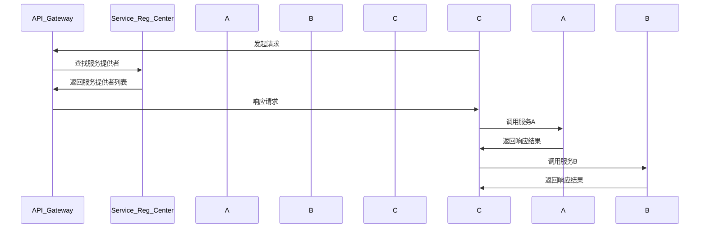

                 

### 1. 设定书籍的宏观结构

《微服务架构设计与实践》作为一本专注于微服务架构领域的技术书籍，其宏观结构需要全面而系统地覆盖微服务架构的各个方面。为了确保内容的系统性和逻辑性，本书的宏观结构可以分为以下几个主要部分：

#### 引言与概述
这部分将介绍微服务架构的背景、演变过程及其与传统架构的区别，帮助读者理解微服务架构的基本概念和核心价值。

#### 微服务架构的核心概念
这部分将深入探讨微服务的定义、特征、组成部分以及微服务架构的Mermaid流程图，使读者对微服务架构有更深入的理解。

#### 微服务设计原则
这部分将讨论微服务的边界划分、通信机制以及数据一致性与分布式事务，帮助读者掌握微服务设计的基本原则。

#### 微服务开发实践
这部分将介绍微服务的开发工具链、部署与容器化、监控与日志管理，以及如何在实际项目中实现微服务架构。

#### 微服务治理与优化
这部分将探讨如何对微服务进行治理和优化，包括服务发现与负载均衡、熔断与限流、服务监控与报警等方面。

#### 微服务架构案例分析
这部分将通过成功案例分享，分析微服务架构在不同行业和场景中的应用，提供实践经验与启示。

#### 微服务架构的未来趋势
这部分将探讨微服务架构的未来发展趋势，包括新兴技术与微服务架构的融合以及未来的发展方向。

### 2. 设计核心章节

根据上述结构，本书的核心章节设计如下：

#### 引言与概述
- **第1章 微服务架构的背景与演变**
  - **1.1 微服务架构的定义与历史**
  - **1.2 微服务架构与传统架构的区别**

- **第2章 微服务架构的优势与挑战**
  - **2.1 微服务架构的优势**
  - **2.2 微服务架构的挑战**

#### 微服务架构的核心概念
- **第3章 微服务定义与特征**
  - **3.1 微服务的定义**
  - **3.2 微服务的特征**
  - **3.3 微服务的边界划分**

- **第4章 微服务架构的组成部分**
  - **4.1 服务消费者与提供者**
  - **4.2 注册中心与配置中心**
  - **4.3 API网关**

#### 微服务设计原则
- **第5章 微服务边界划分**
  - **5.1 服务划分的方法与技巧**
  - **5.2 服务粒度与自治程度**
  - **5.3 微服务与业务域模型**

- **第6章 微服务通信机制**
  - **6.1 RESTful API设计**
  - **6.2 RPC与消息队列**
  - **6.3 服务间通信的安全与可靠性**

- **第7章 数据一致性与分布式事务**
  - **7.1 数据一致性的挑战**
  - **7.2 分布式事务解决方案**
  - **7.3 分布式锁与一致性哈希**

#### 微服务开发实践
- **第8章 微服务开发工具链**
  - **8.1 开发工具选择**
  - **8.2 服务化框架与中间件**
  - **8.3 持续集成与持续部署（CI/CD）**

- **第9章 微服务部署与容器化**
  - **9.1 容器化概述**
  - **9.2 Docker与Kubernetes应用**
  - **9.3 微服务容器的最佳实践**

- **第10章 微服务监控与日志管理**
  - **10.1 监控指标与日志收集**
  - **10.2 数据可视化与报警系统**
  - **10.3 分布式追踪与问题定位**

#### 微服务治理与优化
- **第11章 服务发现与负载均衡**
  - **11.1 服务发现机制**
  - **11.2 负载均衡策略**
  - **11.3 高可用性与弹性伸缩**

- **第12章 熔断与限流**
  - **12.1 熔断器的原理与实现**
  - **12.2 限流算法与使用场景**
  - **12.3 实际案例与优化方案**

- **第13章 服务监控与报警**
  - **13.1 监控数据的处理与存储**
  - **13.2 报警机制与响应流程**
  - **13.3 监控与运维自动化**

#### 微服务架构案例分析
- **第14章 成功案例分享**
  - **14.1 微服务架构在电商领域的应用**
  - **14.2 金融行业微服务实践**
  - **14.3 其他行业案例解析**

- **第15章 挑战与解决**
  - **15.1 微服务架构的常见问题**
  - **15.2 架构演进与重构**
  - **15.3 架构优化与挑战**

#### 微服务架构的未来趋势
- **第16章 新兴技术与微服务架构的融合**
  - **16.1 容器编排与编排工具**
  - **16.2 服务网格与服务网格技术**
  - **16.3 微服务架构的发展方向**

- **第17章 微服务架构的未来趋势**
  - **17.1 AI与微服务架构的融合**
  - **17.2 边缘计算与微服务架构**
  - **17.3 云原生技术与微服务架构**

### 3. 细化目录内容

在每个章节下面，细化目录内容，确保每个章节都有详细的子章节。例如，第3章“微服务定义与特征”可以进一步细化为：

- **3.1 微服务的定义**
  - **3.1.1 微服务的基本概念**
  - **3.1.2 微服务与传统架构的对比**

- **3.2 微服务的特征**
  - **3.2.1 微服务的自主性**
  - **3.2.2 微服务的可扩展性**
  - **3.2.3 微服务的灵活性**

- **3.3 微服务的边界划分**
  - **3.3.1 服务边界划分的原则**
  - **3.3.2 服务边界的实际划分案例**

### 4. 嵌入关键内容

在每个子章节下面，嵌入核心概念、算法原理、数学模型和案例分析的伪代码、公式和代码。例如，在第6章“微服务通信机制”的子章节“6.1 RESTful API设计”中，可以包含以下内容：

- **6.1.1 RESTful API设计原则**
  - **6.1.1.1 REST架构风格**
  - **6.1.1.2 HTTP动词的使用**

- **6.1.2 RESTful API设计案例**
  - **6.1.2.1 用户注册API设计**
  - **6.1.2.2 用户登录API设计**

在案例中，可以嵌入伪代码来展示API的实现：

```python
# 用户注册API伪代码
@app.route('/register', methods=['POST'])
def register():
    username = request.json.get('username')
    password = request.json.get('password')
    # 数据验证与处理
    if validate_user_data(username, password):
        # 存储用户数据到数据库
        save_user_to_db(username, password)
        return jsonify({'status': 'success', 'message': 'User registered successfully'})
    else:
        return jsonify({'status': 'error', 'message': 'Invalid user data'})

# 用户登录API伪代码
@app.route('/login', methods=['POST'])
def login():
    username = request.json.get('username')
    password = request.json.get('password')
    # 验证用户登录信息
    if validate_login_credentials(username, password):
        # 登录成功，返回token
        token = generate_login_token(username)
        return jsonify({'status': 'success', 'token': token})
    else:
        return jsonify({'status': 'error', 'message': 'Invalid login credentials'})
```

### 5. 确保完整性

在完成目录大纲的初步设计后，需要检查目录结构是否完整，确保每个核心章节都有足够的细节和内容。此外，还需要确保所有子章节的内容都能合理地支持主章节的主题，并且整个书籍的内容逻辑连贯、无遗漏。

### 6. 确保简洁性

在保证完整性的同时，需要避免过多冗余内容，保持目录的简洁性。可以通过精简子章节的标题、合并部分内容或者删除不必要的细节来实现目录的简洁。

### 7. 审查与修改

最后，对整个目录大纲进行审查和修改，确保没有遗漏或错误。可以邀请同行或专家进行评审，提出修改意见，进一步优化目录结构。

通过以上步骤，我们可以设计出一套完整、逻辑清晰、内容丰富的《微服务架构设计与实践》目录大纲，为后续的撰写工作奠定坚实的基础。接下来，我们将根据这个大纲，逐一细化每个章节的内容，确保书籍的整体质量和可读性。

## 文章标题

### 《微服务架构设计与实践》

> 关键词：微服务架构，设计原则，开发实践，治理与优化，案例分析，未来趋势

> 摘要：本文旨在为读者提供一份系统、全面的微服务架构设计与实践指南。文章从微服务架构的背景与演变入手，深入探讨了微服务架构的核心概念、设计原则、开发实践、治理与优化，并通过实际案例进行了详细分析。最后，文章展望了微服务架构的未来趋势，为读者在微服务架构领域的进一步探索提供了参考。

### 引言

#### 微服务架构的背景与演变

微服务架构（Microservices Architecture）是近年来在软件工程领域备受关注的一种设计风格。它提倡将大型、复杂的单体应用拆分为一组独立、松耦合的小型服务，使得每个服务都专注于完成特定的功能，并通过网络进行通信。这种设计风格使得系统的可维护性、可扩展性和容错性得到了显著提升。

微服务架构的兴起可以追溯到2000年初，随着互联网和云计算技术的快速发展，大型单体应用越来越难以满足业务需求的变化。传统的单体应用通常具有以下缺点：

- **维护困难**：随着应用规模的不断扩大，代码的复杂度也不断增加，维护和扩展变得困难。
- **扩展性差**：单体应用往往难以进行水平扩展，导致系统性能瓶颈和资源浪费。
- **部署困难**：单体应用作为一个整体进行部署，任何一个模块的故障都可能影响整个系统的稳定性。

为了解决这些问题，开发者开始探索将应用拆分为多个独立的小服务，每个服务可以独立开发、测试和部署。这种设计思想逐渐演变为微服务架构。

#### 微服务架构与传统架构的区别

微服务架构与传统架构（如单体架构和组件架构）有显著的不同，主要体现在以下几个方面：

- **服务边界**：微服务架构将应用程序划分为多个独立的微服务，每个微服务具有清晰的职责和边界。相比之下，传统架构通常采用组件或者模块的方式进行组织，服务边界相对模糊。

- **通信机制**：微服务架构中的服务之间通常采用轻量级的通信协议，如HTTP/HTTPS、消息队列等，以实现松耦合。传统架构则可能使用更为复杂的通信协议，如CORBA、SOAP等。

- **部署与运维**：微服务架构中的每个服务可以独立部署和运维，使得系统的可扩展性和容错性得到提升。而传统架构通常需要整体部署和运维，系统的灵活性和可扩展性受限。

#### 微服务架构的优势与挑战

微服务架构具有许多优势，但也伴随着一些挑战。

**优势：**

- **高可扩展性**：微服务架构支持水平扩展，可以根据业务需求独立扩展特定服务，提高系统的性能和响应速度。
- **高容错性**：微服务架构中的每个服务都是独立的，一个服务的故障不会影响其他服务，从而提高了系统的容错性。
- **可维护性**：微服务架构使得代码的模块化程度更高，每个服务都可以独立开发、测试和部署，降低了代码的复杂度，提高了可维护性。
- **灵活性与敏捷性**：微服务架构允许团队独立开发、部署和扩展服务，提高了开发团队的灵活性和敏捷性。

**挑战：**

- **分布式系统复杂性**：微服务架构引入了分布式系统的复杂性，包括服务发现、负载均衡、数据一致性等问题。
- **服务数量与服务治理**：随着服务数量的增加，服务治理（如服务监控、日志收集、配置管理等）变得复杂。
- **系统性能开销**：微服务架构中的服务通信开销可能较高，影响系统的性能。
- **技术债务**：过度追求微服务架构可能导致技术债务的增加，使得系统逐渐变得复杂和难以维护。

#### 总结

微服务架构作为一种现代软件设计风格，为解决传统单体架构的诸多问题提供了新的思路。尽管微服务架构面临一些挑战，但其在高扩展性、高容错性和可维护性等方面的优势，使其成为许多企业和开发团队的首选。本文将在此基础上，进一步探讨微服务架构的核心概念、设计原则、开发实践、治理与优化，并通过实际案例进行分析，帮助读者深入了解微服务架构的各个方面。

### 微服务架构的核心概念

#### 微服务的定义与特征

**定义**

微服务（Microservice）是相对于单体应用（Monolithic Application）而言的一种设计架构，它将应用程序分解为多个小型、独立的服务。每个微服务负责完成一个特定的业务功能，可以独立部署、运行和扩展。微服务的目标是实现系统的可扩展性、可维护性和高可用性。

**特征**

1. **独立性**：每个微服务都是独立的，具有独立的代码库、测试和部署流程。这意味着开发团队可以独立开发和部署服务，无需担心其他服务的依赖关系。
   
2. **自治性**：每个微服务都有自己的数据存储、配置和业务逻辑，可以实现自治。自治性使得服务之间可以独立运行和扩展，降低了系统耦合度。

3. **轻量级**：微服务通常采用轻量级的通信协议，如HTTP/HTTPS、gRPC或消息队列，以减少服务间的通信开销。轻量级通信协议提高了系统的性能和响应速度。

4. **松耦合**：微服务架构中的服务之间通过API进行通信，服务之间的依赖关系较弱。这使得系统具有更高的灵活性和可维护性。

5. **可扩展性**：微服务架构支持水平扩展，可以根据业务需求独立扩展特定服务，提高了系统的性能和响应速度。

6. **分布式**：微服务架构中的服务通常部署在分布式环境中，可以在不同的服务器或容器上运行。分布式部署提高了系统的容错性和可扩展性。

7. **高可用性**：微服务架构通过服务实例的冗余和故障转移机制，提高了系统的可用性。当某个服务实例出现故障时，其他实例可以接管其工作，确保系统的高可用性。

#### 微服务架构的组成部分

微服务架构由多个核心组件组成，这些组件协同工作，实现服务的独立开发、部署和运行。以下是微服务架构的主要组成部分：

1. **服务提供者**：服务提供者是微服务架构中的核心组件，负责提供具体的业务功能。服务提供者通过API接口对外提供服务，并维护自身的状态和数据。

2. **服务消费者**：服务消费者是调用服务提供者服务的一方，它通过HTTP请求或消息队列等方式与服务提供者进行通信。服务消费者通常是一个客户端应用程序或另一个微服务。

3. **API网关**：API网关是微服务架构中的入口点，负责处理外部请求并将其转发给相应的服务提供者。API网关还提供安全性、路由、负载均衡等功能。

4. **服务注册中心**：服务注册中心是服务提供者和消费者之间的中介，负责维护服务提供者的注册信息和状态。服务消费者通过服务注册中心发现可用服务，并建立与服务提供者的连接。

5. **配置中心**：配置中心是用于管理微服务配置信息的组件，服务提供者可以从配置中心获取所需的配置信息。配置中心支持动态配置，可以实时更新服务配置，提高了系统的灵活性。

6. **服务监控**：服务监控组件用于收集和监控微服务的运行状态、性能指标和日志信息。服务监控可以帮助开发者和运维人员快速发现和解决问题。

7. **服务发现**：服务发现组件用于自动发现和注册服务提供者，并维护服务实例的状态。服务发现机制可以确保服务消费者始终连接到可用服务提供者。

8. **负载均衡**：负载均衡组件用于分发请求到多个服务提供者实例，确保系统的负载均衡和高可用性。常见的负载均衡算法包括轮询、最少连接和响应时间等。

#### 微服务架构的Mermaid流程图

为了更好地理解微服务架构的组成部分和交互关系，我们可以使用Mermaid流程图来表示。



在这个流程图中，API网关作为入口点，负责处理外部请求并将其转发给服务提供者。服务注册中心用于维护服务提供者的注册信息，服务消费者通过服务注册中心发现可用服务。当服务消费者发起请求时，API网关将其转发给相应的服务提供者，服务提供者处理后返回响应结果。整个流程展示了微服务架构的核心组件和交互关系。

通过以上对微服务架构的核心概念、定义、特征和组成部分的详细探讨，读者可以更深入地理解微服务架构的工作原理和设计思想。在接下来的章节中，我们将进一步探讨微服务的设计原则、开发实践、治理与优化，并通过实际案例进行分析，帮助读者全面掌握微服务架构的各个方面。

### 微服务设计原则

微服务架构的设计原则是确保系统高扩展性、高可用性和高可维护性的关键。以下是一些核心设计原则，这些原则指导我们在设计微服务时如何有效地划分服务边界、选择通信机制以及处理数据一致性和分布式事务。

#### 服务边界划分

**原则一：自治性**

微服务的自治性是设计原则的核心。每个微服务应具有独立的功能、数据存储和业务逻辑，以实现完全自治。自治性确保了服务之间互不干扰，从而简化了系统的开发和运维。具体来说，我们可以通过以下方法来实现服务自治：

- **功能自治**：确保每个微服务专注于完成特定的功能，避免功能重叠。例如，订单管理服务专注于处理订单相关的业务逻辑，而用户服务则专注于用户信息的管理。
- **数据自治**：每个微服务应使用独立的数据存储，如关系型数据库、NoSQL数据库或文件系统。独立的数据存储确保了数据的一致性和独立性。
- **业务逻辑自治**：业务逻辑应内置于微服务中，避免跨服务调用，从而减少服务间的依赖关系。

**原则二：服务粒度**

服务粒度是指微服务的大小和复杂度。合理的服务粒度可以降低系统的复杂性，提高开发效率和系统的灵活性。以下是一些划分服务粒度的原则：

- **功能独立**：每个服务应实现一个独立的功能，避免将多个功能耦合在一个服务中。这有助于简化服务开发和维护。
- **职责单一**：每个服务应具有明确的职责，避免职责过重。职责单一可以提高代码的可读性和可维护性。
- **规模适中**：服务的大小应适中，避免过小或过大。过小的服务可能导致服务数量过多，管理复杂；过大的服务则可能难以维护和扩展。

**原则三：交互方式**

服务之间的交互方式对系统的性能和稳定性有很大影响。以下是一些常用的服务交互方式：

- **RESTful API**：RESTful API 是微服务间通信的常用方式。通过HTTP/HTTPS协议，服务之间可以以无状态、松耦合的方式进行通信。RESTful API 具有简洁、易于理解的特点，适用于大多数场景。
- **gRPC**：gRPC 是一种高性能的远程过程调用（RPC）框架，支持多种语言和平台。gRPC 使用 Protocol Buffers 作为接口描述语言，具有较低的通信开销和较高的性能。
- **消息队列**：消息队列可以解耦服务间的依赖关系，实现异步通信。常见的消息队列有Kafka、RabbitMQ等。消息队列适用于处理大量数据和长延迟的场景。

**原则四：服务发现**

服务发现是微服务架构中不可或缺的一环。服务发现机制负责动态发现和注册服务实例，确保服务消费者能够连接到可用的服务提供者。以下是一些服务发现的原则：

- **动态性**：服务发现应支持动态更新，当服务实例启动或停止时，服务注册中心能实时更新服务实例列表。
- **高可用性**：服务注册中心应具有高可用性，避免单点故障。可以使用多个注册中心或备份机制来实现高可用性。
- **负载均衡**：服务发现机制应支持负载均衡，根据服务实例的负载情况，智能选择合适的实例进行调用。

#### 通信机制

**原则一：轻量级**

通信机制的选择对系统的性能有重要影响。轻量级的通信机制可以减少网络开销，提高系统的响应速度。以下是一些轻量级的通信机制：

- **HTTP/HTTPS**：HTTP/HTTPS 是最常用的通信协议，支持 RESTful API 和 gRPC。HTTP/HTTPS 具有广泛的支持和较好的性能，适用于大多数场景。
- **gRPC**：gRPC 是一种高性能的 RPC 框架，使用 Protocol Buffers 作为接口描述语言，具有较低的通信开销和较高的性能。
- **消息队列**：消息队列适用于异步通信和大规模数据处理，常见的消息队列有 Kafka、RabbitMQ 等。

**原则二：可靠性和安全性**

通信机制还应具备可靠性和安全性：

- **可靠性**：通信机制应确保请求能够被正确送达，避免数据丢失或重复。可以使用幂等操作、重试机制和回滚操作等手段来实现可靠性。
- **安全性**：通信机制应确保数据在传输过程中不被窃取或篡改。可以使用 TLS/SSL 协议进行加密传输，实现数据的安全性。

#### 数据一致性与分布式事务

**原则一：分布式事务**

在微服务架构中，由于服务之间是松耦合的，分布式事务变得复杂。以下是一些处理分布式事务的原则：

- **最终一致性**：分布式系统通常无法实现强一致性，因此应采用最终一致性模型。最终一致性确保数据在一段时间后达到一致状态，但允许短暂的异步处理。
- **补偿事务**：当分布式事务无法完成时，可以通过补偿事务来纠正错误。补偿事务可以反向执行原始操作，以恢复数据的一致性。
- **本地事务**：对于一些场景，可以使用本地事务来简化分布式事务的实现。本地事务可以在单个服务内处理，减少跨服务的依赖关系。

**原则二：数据一致性与分布式锁**

以下是一些处理数据一致性的方法：

- **分布式锁**：分布式锁用于控制对共享资源的访问，确保多个服务实例不会同时修改同一数据。分布式锁可以通过 Redis、Zookeeper 等实现。
- **版本控制**：版本控制可以确保数据在更新时的版本一致性。每次数据更新时，都会生成一个新的版本号，从而避免并发冲突。
- **悲观锁与乐观锁**：悲观锁和乐观锁是两种常用的并发控制机制。悲观锁假定并发冲突总是会发生，因此在数据修改前加锁；乐观锁则假定并发冲突很少发生，在数据修改后检查并发冲突。

#### 总结

微服务设计原则是确保微服务架构高效、稳定和可维护的关键。通过合理划分服务边界、选择合适的通信机制和处理数据一致性与分布式事务，我们可以构建一个高性能、高可用的微服务系统。在接下来的章节中，我们将进一步探讨微服务的开发实践，帮助读者在实际项目中实现微服务架构。

### 微服务开发实践

#### 微服务开发工具链

微服务开发工具链是微服务项目成功的关键。一个高效的开发工具链可以帮助团队快速构建、测试和部署微服务，从而提高开发效率和系统质量。以下是一些常用的开发工具：

**1. 编程语言**

选择合适的编程语言对于微服务开发至关重要。以下是一些流行的编程语言：

- **Java**：Java 是微服务开发的首选语言之一。Java 拥有丰富的开源框架和工具，支持多种微服务架构风格。
- **Python**：Python 语法简洁，易于学习，适用于快速开发和实验。Django 和 Flask 是 Python 中常用的微服务框架。
- **Go**：Go 语法简单，性能优越，适用于高性能和分布式系统开发。Go 语言支持微服务架构中的 gRPC 通信机制。
- **Node.js**：Node.js 具有异步非阻塞的特点，适用于实时和大规模数据处理。

**2. 开发框架**

开发框架可以简化微服务的开发流程，提供丰富的功能和工具。以下是一些流行的微服务开发框架：

- **Spring Boot**：Spring Boot 是 Java 微服务开发的事实标准。它简化了 Spring 应用程序的配置和部署，提供了丰富的微服务功能。
- **Spring Cloud**：Spring Cloud 是基于 Spring Boot 的微服务开发框架，提供了服务注册与发现、配置管理、负载均衡、断路器等微服务功能。
- **Django**：Django 是 Python 中的全栈 Web 框架，适用于快速开发和部署微服务。
- **Flask**：Flask 是 Python 中的轻量级 Web 框架，适用于简单和轻量级的微服务开发。
- **gRPC**：gRPC 是基于 Protocol Buffers 的高性能 RPC 框架，适用于微服务之间的通信。
- **Node.js**：Node.js 提供了 Express.js 等流行的 Web 框架，适用于快速开发和部署微服务。

**3. 版本控制**

版本控制是确保代码库一致性和可追溯性的重要工具。以下是一些常用的版本控制工具：

- **Git**：Git 是最流行的分布式版本控制工具。它提供了丰富的功能和工具，支持多人和分布式协作开发。
- **SVN**：SVN 是集中式版本控制工具，适用于小型团队和单机开发。

**4. 静态代码分析工具**

静态代码分析工具可以帮助发现代码中的潜在问题，提高代码质量。以下是一些常用的静态代码分析工具：

- **SonarQube**：SonarQube 是一款强大的静态代码分析平台，支持多种编程语言。
- **Checkstyle**：Checkstyle 是一款用于 Java 代码的静态代码分析工具。
- **PyLint**：PyLint 是 Python 代码的静态代码分析工具。

**5. 代码质量检测工具**

代码质量检测工具可以自动评估代码的质量，确保代码的可读性和可维护性。以下是一些常用的代码质量检测工具：

- **Codeception**：Codeception 是一款支持多种编程语言的测试框架。
- **JUnit**：JUnit 是 Java 代码的单元测试框架。
- **pytest**：pytest 是 Python 的单元测试框架。

**6. 集成开发环境（IDE）**

集成开发环境（IDE）可以提供丰富的功能和工具，提高开发效率。以下是一些常用的 IDE：

- **Eclipse**：Eclipse 是一款流行的 Java IDE。
- **IntelliJ IDEA**：IntelliJ IDEA 是一款功能强大的多语言 IDE。
- **PyCharm**：PyCharm 是 Python 开发的首选 IDE。

#### 微服务部署与容器化

部署微服务是微服务开发过程中不可或缺的一环。以下是一些常用的微服务部署方式：

**1. 容器化**

容器化是微服务部署的一种重要方式，它可以将微服务及其依赖环境打包到一个独立的容器中，实现一次编写，到处运行。以下是一些常用的容器化工具：

- **Docker**：Docker 是最流行的容器化工具，它可以将应用程序及其依赖环境打包到一个 Docker 镜像中，实现轻量级、可移植的部署。
- **Kubernetes**：Kubernetes 是一款开源的容器编排工具，用于管理 Docker 容器的部署、扩展和运维。Kubernetes 提供了强大的集群管理和自动化功能，适用于大规模分布式系统。

**2. 容器编排**

容器编排工具可以帮助自动化管理容器的生命周期，确保系统的可靠性和高效性。以下是一些常用的容器编排工具：

- **Docker Compose**：Docker Compose 是一款用于定义和运行多容器 Docker 应用程序的工具。它通过 YAML 文件描述应用程序的组成和依赖关系，支持一键部署和管理。
- **Kubernetes**：Kubernetes 是一款开源的容器编排工具，用于管理 Docker 容器的部署、扩展和运维。Kubernetes 提供了强大的集群管理和自动化功能，适用于大规模分布式系统。

**3. 部署策略**

以下是一些常用的微服务部署策略：

- **蓝绿部署**：蓝绿部署是一种灰度发布策略，通过同时运行两个版本的微服务，实现无缝升级。当一个版本经过测试后，可以逐渐将其替换为另一个版本，从而减少升级风险。
- **滚动部署**：滚动部署是一种逐步升级微服务的策略，通过逐步替换旧版本的服务实例，确保系统的高可用性和稳定性。
- **蓝绿部署**：蓝绿部署是一种将新版本的服务实例与旧版本的服务实例共存，通过流量切换实现升级的策略。

#### 微服务监控与日志管理

监控和日志管理是确保微服务系统稳定运行和快速响应问题的关键。以下是一些常用的监控和日志管理工具：

**1. 监控工具**

- **Prometheus**：Prometheus 是一款开源的监控解决方案，适用于大规模分布式系统。它支持多维度的数据采集、存储和查询。
- **Grafana**：Grafana 是一款开源的数据可视化工具，可以与 Prometheus 等监控工具集成，提供丰富的监控仪表板和报警功能。
- **ELK Stack**：ELK Stack（Elasticsearch、Logstash 和 Kibana）是一套开源的日志管理和分析平台，用于收集、存储和可视化日志数据。

**2. 日志管理**

- **Log4j**：Log4j 是一款常用的日志记录框架，支持多种日志格式和输出方式。
- **Kafka**：Kafka 是一款开源的消息队列和流处理平台，可以用于收集和存储日志数据。
- **Filebeat**：Filebeat 是一款轻量级的日志收集器，可以方便地收集和传输日志数据到 Elasticsearch 或 Kafka。

通过以上工具和策略，我们可以构建一个高效、可靠的微服务开发环境。接下来，我们将进一步探讨微服务的部署与容器化实践，以及监控与日志管理的最佳实践。

#### 微服务部署与容器化实践

微服务的部署与容器化是确保系统可扩展性、高可用性和可靠性的关键步骤。在这一节中，我们将详细介绍如何使用容器化工具（如 Docker 和 Kubernetes）来部署微服务，并讨论相关的最佳实践。

##### 1. 容器化工具介绍

**Docker**

Docker 是一种开源的容器化技术，它通过将应用程序及其依赖环境打包到一个统一的容器中，实现“一次编写，到处运行”的理念。Docker 容器具有轻量级、高性能和可移植性的特点，使得微服务的部署和运维变得更加简单和高效。

**Kubernetes**

Kubernetes 是一款开源的容器编排工具，用于管理 Docker 容器的部署、扩展和运维。Kubernetes 提供了强大的集群管理和自动化功能，使得大规模分布式系统的管理和运维变得更加高效和可靠。

##### 2. 使用 Docker 部署微服务

**步骤一：创建 Dockerfile**

首先，我们需要为每个微服务创建一个 Dockerfile。Dockerfile 是一个包含一系列指令的文本文件，用于定义如何构建 Docker 镜像。

以下是一个简单的 Java 微服务的 Dockerfile 示例：

```Dockerfile
# 使用 Java 8 作为基础镜像
FROM openjdk:8-jdk-alpine

# 设置工作目录
WORKDIR /app

# 复制应用程序代码
COPY . .

# 启动应用程序
CMD ["java", "-jar", "application.jar"]
```

**步骤二：构建 Docker 镜像**

在 Dockerfile 文件所在的目录下，使用以下命令构建 Docker 镜像：

```bash
docker build -t my-service:1.0.0 .
```

这个命令会将当前目录下的 Dockerfile 文件用于构建一个名为 `my-service` 的 Docker 镜像，版本号为 `1.0.0`。

**步骤三：运行 Docker 容器**

接下来，我们可以使用以下命令运行 Docker 容器：

```bash
docker run -d --name my-service-container my-service:1.0.0
```

这个命令会创建并启动一个名为 `my-service-container` 的 Docker 容器，运行 `my-service` 镜像。

**步骤四：访问微服务**

要访问运行在 Docker 容器中的微服务，我们可以使用以下命令：

```bash
docker exec -it my-service-container bash
```

这个命令会进入 `my-service-container` 容器的命令行界面，我们可以使用 `curl` 或其他工具访问微服务的 API。

##### 3. 使用 Kubernetes 部署微服务

**步骤一：创建 Kubernetes 配置文件**

首先，我们需要为每个微服务创建一个 Kubernetes 配置文件（如 deployment.yaml）。以下是一个简单的 Java 微服务的 Kubernetes 配置文件示例：

```yaml
apiVersion: apps/v1
kind: Deployment
metadata:
  name: my-service
spec:
  replicas: 3
  selector:
    matchLabels:
      app: my-service
  template:
    metadata:
      labels:
        app: my-service
    spec:
      containers:
      - name: my-service
        image: my-service:1.0.0
        ports:
        - containerPort: 8080
```

这个配置文件定义了一个名为 `my-service` 的 Deployment，它包含 3 个 Pod，每个 Pod 运行一个 `my-service:1.0.0` 镜像。

**步骤二：部署微服务**

接下来，我们可以使用以下命令部署微服务：

```bash
kubectl apply -f deployment.yaml
```

这个命令会将 `deployment.yaml` 文件中的配置应用到 Kubernetes 集群，创建相应的 Deployment、Service 和 Pod。

**步骤三：访问微服务**

要访问运行在 Kubernetes 集群中的微服务，我们可以使用以下命令查看 Service 的 IP 地址：

```bash
kubectl get svc my-service
```

这个命令会显示 `my-service` Service 的 IP 地址，我们可以使用 `curl` 或其他工具访问微服务的 API。

##### 4. 最佳实践

- **容器镜像管理**：为了确保系统的一致性和安全性，我们应该将应用程序及其依赖环境打包到一个容器镜像中。使用私有镜像仓库可以更好地管理容器镜像。
- **多阶段构建**：使用多阶段构建可以提高容器镜像的性能和可移植性。例如，可以使用构建镜像（如构建应用程序的中间件）和运行时镜像（如仅包含应用程序的镜像）。
- **资源限制**：为容器设置合理的资源限制（如 CPU 和内存）可以提高系统的性能和可扩展性，避免容器因资源不足而崩溃。
- **健康检查**：设置健康检查机制（如 livenessProbe 和 readinessProbe）可以确保容器在健康状态下运行，提高系统的可用性。
- **日志管理**：使用集中式日志管理工具（如 Elasticsearch、Kafka 或 Filebeat）可以方便地收集、存储和搜索日志数据，帮助分析和排查问题。
- **监控与报警**：使用监控工具（如 Prometheus 和 Grafana）可以实时监控系统的性能和健康状态，设置报警机制可以及时发现和处理问题。

通过以上步骤和实践，我们可以高效地部署微服务并确保系统的稳定性和可靠性。在下一节中，我们将进一步探讨微服务的监控与日志管理，以及如何处理常见的问题和挑战。

#### 微服务监控与日志管理

微服务的监控与日志管理是确保系统稳定运行和快速响应的关键环节。在这一节中，我们将详细讨论如何使用日志管理工具、监控工具和分布式追踪工具来管理和监控微服务。

##### 1. 日志管理

日志管理是记录和存储微服务运行过程中的重要信息，以便于问题排查和性能分析。以下是一些常用的日志管理工具：

**ELK Stack**

ELK Stack 是由 Elasticsearch、Logstash 和 Kibana 组成的日志管理平台。它支持从各种来源（如 Docker 容器、Kubernetes 集群和应用程序日志）收集、存储和查询日志数据。

**1. Elasticsearch**

Elasticsearch 是一个开源的搜索引擎和分析引擎，用于存储和查询大量结构化数据。在日志管理中，Elasticsearch 用于存储微服务的日志数据。

**2. Logstash**

Logstash 是一个开源的数据收集和处理工具，用于将日志数据从各种来源（如 Docker 容器、Kubernetes 集群和应用程序日志）收集到 Elasticsearch。

**3. Kibana**

Kibana 是一个开源的数据可视化和分析工具，用于可视化 Elasticsearch 中的日志数据。Kibana 提供了丰富的仪表板和报表功能，帮助分析日志数据。

**2. 日志管理实践**

**日志收集**：使用 Logstash 收集来自 Docker 容器、Kubernetes 集群和应用程序的日志数据。可以通过配置 Logstash 输入插件和输出插件来实现日志的收集。

```yaml
input {
  file {
    path => "/var/log/*.log"
    type => "my-log-type"
  }
}

filter {
  if [type] == "my-log-type" {
    grok {
      match => { "message" => "%{TIMESTAMP_ISO8601:timestamp}\t%{DATA:source}\t%{DATA:level}\t%{DATA:message}" }
    }
  }
}

output {
  if [type] == "my-log-type" {
    elasticsearch {
      hosts => ["localhost:9200"]
      index => "my-log-%{+YYYY.MM.dd}"
    }
  }
}
```

**日志存储**：将收集到的日志数据存储在 Elasticsearch 中。使用 Elasticsearch 的索引模板来定义日志数据的存储格式和索引命名规则。

```json
{
  "template": "my-log-*",
  "mappings": {
    "properties": {
      "timestamp": {
        "type": "date",
        "format": "yyyy-MM-dd'T'HH:mm:ss.SSSXXX"
      },
      "source": {
        "type": "keyword"
      },
      "level": {
        "type": "keyword"
      },
      "message": {
        "type": "text"
      }
    }
  }
}
```

**日志分析**：使用 Kibana 可视化日志数据，创建仪表板和报表，帮助分析日志数据。可以使用 Kibana 的查询语言（KQL）来查询和过滤日志数据。

```kql
source = "my-log-2023.03.01" AND level = "ERROR"
```

##### 2. 监控工具

监控工具可以帮助我们实时了解系统的性能和健康状态，及时发现和处理问题。以下是一些常用的监控工具：

**Prometheus**

Prometheus 是一个开源的监控解决方案，适用于大规模分布式系统。它支持多维度的数据采集、存储和查询。

**1. 数据采集**

Prometheus 使用拉模式采集数据，通过配置 targets 来指定采集数据的来源。可以使用 Prometheus 客户端来暴露系统的监控数据。

```bash
# 在应用程序中添加 Prometheus 客户端代码
scrape_configs:
  - job_name: 'my-service'
    static_configs:
      - targets: ['my-service:9090']
```

**2. 数据存储**

Prometheus 将采集到的数据存储在本地磁盘上，可以使用 Prometheus 的 Time Series Database（TSDB）来存储监控数据。

**3. 数据查询**

Prometheus 提供了 PromQL（Prometheus Query Language），用于查询和操作监控数据。可以使用 PromQL 来创建图表、计算指标和设置报警。

```promql
rate(http_requests_total[5m])
```

**4. 数据可视化**

Prometheus 配合 Grafana 可以实现监控数据的高效可视化。在 Grafana 中创建仪表板，使用 Prometheus 数据源来创建图表和报表。

##### 3. 分布式追踪

分布式追踪可以帮助我们了解系统的运行流程和性能瓶颈，定位和解决问题。以下是一些常用的分布式追踪工具：

**Zipkin**

Zipkin 是一个开源的分布式追踪系统，用于记录和分析分布式系统的追踪信息。

**1. 数据采集**

使用 Zipkin 客户端来记录追踪信息。在应用程序中添加 Zipkin 客户端代码，配置 Zipkin 服务的地址。

```java
Tracer tracer = Tracer.newBuilder()
    .localServiceName("my-service")
    .reporter(new KafkaReporter("localhost:9092"))
    .build();
```

**2. 数据存储**

Zipkin 将追踪信息存储在 Kafka 中，可以使用 Zipkin UI 来可视化追踪数据。

**3. 数据分析**

使用 Zipkin UI 来分析追踪数据，查看追踪流程、性能指标和错误日志。可以使用 Zipkin 的查询语言来查询和过滤追踪数据。

##### 4. 监控与日志管理最佳实践

- **日志格式标准化**：使用统一的日志格式，方便日志收集和查询。
- **日志分类与索引**：根据日志类型和级别分类日志，使用索引模板来定义日志存储格式。
- **日志存储与备份**：使用分布式存储系统来存储日志数据，确保日志数据的持久化和备份。
- **日志分析工具**：使用 ELK Stack、Prometheus 和 Zipkin 等工具来实现高效的日志管理和监控。
- **日志查询与报表**：使用日志查询语言和报表工具来分析日志数据，及时发现和处理问题。
- **监控指标设置**：设置合理的监控指标和报警阈值，确保系统在异常情况下能够及时发出警报。

通过以上监控与日志管理工具和实践，我们可以有效地管理和监控微服务，确保系统的稳定运行和快速响应。

#### 微服务治理与优化

微服务架构虽然带来了许多优势，但也伴随着一系列治理与优化问题。本节将探讨微服务架构中的常见问题，并介绍相应的解决方案和最佳实践。

##### 1. 服务发现与负载均衡

**问题**：随着服务数量的增加，如何有效地管理服务发现和负载均衡？

**解决方案**：

- **服务发现**：使用服务注册中心（如Consul、Eureka、Zookeeper）来管理服务的注册和发现。服务启动时注册到服务注册中心，服务消费者通过服务注册中心发现可用服务实例。

```yaml
# 示例：Eureka 服务注册配置
eureka:
  client:
    serviceUrl:
      defaultZone: http://localhost:8761/eureka/
```

- **负载均衡**：使用负载均衡器（如Nginx、HAProxy、Kubernetes Service）来分发请求，确保服务实例的负载均衡。负载均衡器可以根据策略（如轮询、最小连接数、响应时间）来选择服务实例。

```yaml
# 示例：Kubernetes Service 配置
apiVersion: v1
kind: Service
metadata:
  name: my-service
spec:
  selector:
    app: my-service
  ports:
    - protocol: TCP
      port: 80
      targetPort: 8080
  type: LoadBalancer
```

**最佳实践**：

- **服务注册与心跳**：确保服务实例定期发送心跳信号到服务注册中心，以保持服务实例的活跃状态。同时，设置服务注册中心的租约时间，避免服务实例因网络问题而意外下线。
- **健康检查**：为服务实例设置健康检查，确保负载均衡器只会将请求转发到健康的服务实例。
- **弹性伸缩**：根据业务需求和服务实例的负载情况，自动扩展和收缩服务实例，以提高系统的弹性和性能。

##### 2. 熔断与限流

**问题**：如何应对服务异常和流量激增，避免系统过载？

**解决方案**：

- **熔断器**：使用熔断器（如Hystrix、Resilience4j）来避免服务级联故障。当某个服务实例发生异常或响应时间过长时，熔断器会自动切断该服务，防止级联故障。

```java
@HystrixCommand(fallbackMethod = "fallback")
public String callService() {
    return externalService.call();
}

public String fallback() {
    return "Service is unavailable";
}
```

- **限流器**：使用限流器（如Redisson、Ratelimiter）来控制进入系统的请求流量，避免系统过载。

```java
RateLimiter rateLimiter = RateLimiter.create(10); // 每秒允许 10 个请求
if (rateLimiter.tryAcquire()) {
    // 执行业务逻辑
} else {
    // 请求被拒绝，执行限流策略
}
```

**最佳实践**：

- **熔断策略**：根据服务的响应时间和异常比例，动态调整熔断策略。避免过度熔断导致系统可用性下降，同时确保在服务异常时能够及时切断故障服务。
- **限流策略**：根据业务需求和服务容量，合理设置限流阈值。同时，可以根据不同时间段和用户群体，动态调整限流策略。
- **监控与报警**：对熔断和限流情况进行实时监控，设置报警机制，及时发现和处理问题。

##### 3. 服务监控与报警

**问题**：如何确保系统在异常情况下能够快速响应和处理？

**解决方案**：

- **监控工具**：使用监控工具（如Prometheus、Grafana）来收集和展示系统的性能指标和健康状态。通过设置监控指标和报警阈值，及时发现系统异常。

```yaml
# 示例：Prometheus 监控配置
scrape_configs:
  - job_name: 'my-service'
    static_configs:
      - targets: ['my-service:9090']
```

- **报警机制**：设置报警机制（如Alertmanager、Opsgenie），在系统发生异常时发送通知和警报，通知相关人员。

```yaml
# 示例：Alertmanager 配置
alertmanager.yml
route:
  - receiver: 'ops-receiver'
    match:
      - severity: 'critical'
```

**最佳实践**：

- **监控指标**：根据业务需求和系统特性，选择合适的监控指标。常见的监控指标包括响应时间、吞吐量、错误率、CPU 和内存使用率等。
- **报警策略**：根据监控指标和业务需求，设置合理的报警阈值和报警策略。避免过度报警导致信息过载，同时确保关键指标异常时能够及时发出警报。
- **自动响应**：结合自动化运维工具（如Ansible、Kubernetes），在系统异常时自动执行恢复操作，提高系统的自我恢复能力。

##### 4. 服务版本管理与回滚

**问题**：如何管理服务的版本，避免升级失败带来的影响？

**解决方案**：

- **服务版本控制**：使用版本控制系统（如Git）来管理服务的版本。每次发布新版本时，为服务打上版本标签，确保版本的可追溯性和可管理性。

```bash
git tag v1.0.0
git push origin v1.0.0
```

- **蓝绿部署**：使用蓝绿部署策略来发布新版本。同时运行旧版本和新版本的服务，逐步切换流量，确保新版本的稳定性。

```yaml
# 示例：Kubernetes 配置
strategy:
  type: RollingUpdate
  rollingUpdate:
    partition: 0
```

- **回滚机制**：在发布新版本时，设置回滚机制。当发现新版本存在问题时，可以快速回滚到旧版本，确保系统的稳定运行。

```yaml
# 示例：Kubernetes 回滚命令
kubectl rollout undo deployment/my-service --to-revision=1
```

**最佳实践**：

- **版本管理**：确保每次发布新版本时，对代码进行充分的测试和验证，避免引入潜在的问题。
- **部署监控**：在发布新版本时，监控部署过程中的关键指标，及时发现和处理部署问题。
- **备份与恢复**：在发布新版本前，备份当前版本的服务配置和数据库数据，确保在回滚时能够快速恢复。

##### 5. 服务配置管理

**问题**：如何管理服务的配置，确保配置的一致性和灵活性？

**解决方案**：

- **配置中心**：使用配置中心（如Spring Cloud Config、Nacos）来管理服务的配置。配置中心支持配置的集中管理和动态更新。

```yaml
# 示例：Nacos 配置
spring:
  application:
    name: my-service
  cloud:
    nacos:
      discovery:
        server-addr: 127.0.0.1:8848
      config:
        server-addr: 127.0.0.1:8848
        namespace: public
        group: DEFAULT_GROUP
        data-id: application.yml
```

- **配置版本控制**：使用配置版本控制来管理配置的历史版本，确保配置的追溯性和可恢复性。

```bash
nacos config history list -n public -g DEFAULT_GROUP -d my-service:8080
```

**最佳实践**：

- **配置集中管理**：将所有服务的配置集中存储在配置中心，避免配置分散和不一致。
- **配置动态更新**：支持配置的动态更新，确保服务能够实时获取最新的配置。
- **配置备份与恢复**：定期备份配置数据，确保在配置发生错误时能够快速恢复。

##### 6. 服务监控与日志管理

**问题**：如何确保服务的运行状况和日志数据能够被有效地监控和管理？

**解决方案**：

- **日志收集与存储**：使用日志收集工具（如Logstash、Fluentd）将日志数据收集到日志存储系统（如Elasticsearch、Kafka）。

```yaml
# 示例：Logstash 配置
input {
  file {
    path => "/var/log/my-service/*.log"
  }
}

filter {
  if [file] == "access.log" {
    grok {
      match => { "message" => "%{TIMESTAMP_ISO8601:timestamp}\t%{IP:clientip}\t%{INT:port}\t%{DATA:method}\t%{DATA:uri}\t%{INT:status}\t%{INT:bytes}" }
    }
  }
}

output {
  if [file] == "access.log" {
    elasticsearch {
      hosts => ["localhost:9200"]
      index => "my-service-access-%{+YYYY.MM.dd}"
    }
  }
}
```

- **日志分析与可视化**：使用日志分析工具（如Kibana、Grafana）对日志数据进行分析和可视化，帮助定位和解决问题。

```kql
source = "my-service-access-2023.03.01" AND status >= 500
```

**最佳实践**：

- **日志格式标准化**：使用统一的日志格式，方便日志收集、存储和分析。
- **日志级别与分类**：根据日志的级别和类别进行分类，便于日志的过滤和分析。
- **日志存储策略**：设置合理的日志存储策略，确保日志数据的持久化和备份。

通过以上治理与优化措施，我们可以有效地管理微服务架构，确保系统的稳定运行和高效性能。在下一节中，我们将通过实际案例来探讨微服务架构在不同行业和场景中的应用，分析其优势和挑战。

#### 微服务架构案例分析

微服务架构作为一种现代软件设计风格，已经在许多行业和场景中得到了广泛应用。以下是一些典型的行业和场景，以及微服务架构在这些领域的实际应用案例。

##### 1. 电商行业

**案例背景**：

电商行业竞争激烈，业务需求变化快，系统需要具备高扩展性、高可用性和高灵活性。传统的单体架构难以满足这些需求，因此许多电商企业选择了微服务架构。

**应用实践**：

- **用户服务**：用户服务负责处理用户注册、登录、信息管理等业务功能。用户服务通过 RESTful API 与其他服务进行通信，实现了模块化和自治性。
- **商品服务**：商品服务负责商品信息的管理，包括商品查询、分类、库存管理等功能。商品服务与数据库进行独立部署，确保数据的一致性和独立性。
- **订单服务**：订单服务负责订单的创建、处理、支付等功能。订单服务通过异步消息队列与支付服务、库存服务等进行通信，提高了系统的可靠性和性能。

**优势与挑战**：

- **优势**：微服务架构使得电商系统能够快速响应业务需求变化，提高了系统的灵活性和可扩展性。通过服务拆分，每个服务可以独立开发、测试和部署，降低了系统的复杂度和维护成本。
- **挑战**：微服务架构引入了分布式系统的复杂性，包括服务发现、负载均衡、数据一致性和分布式事务等问题。此外，随着服务数量的增加，服务治理和监控变得更加复杂。

##### 2. 金融行业

**案例背景**：

金融行业对系统的安全性和稳定性有严格要求，同时业务场景复杂，需要处理大量的金融交易和用户数据。传统的单体架构难以满足这些需求，因此金融行业也逐步采用了微服务架构。

**应用实践**：

- **账户服务**：账户服务负责处理用户账户信息的管理，包括账户余额查询、转账、交易记录等功能。账户服务采用分布式数据库架构，确保数据的一致性和安全性。
- **交易服务**：交易服务负责处理金融交易，包括交易发起、交易确认、交易记录等功能。交易服务通过异步消息队列与账户服务、风控服务等进行通信，确保交易流程的可靠性和实时性。
- **风控服务**：风控服务负责监控和检测金融交易的风险，包括交易风险分析、欺诈检测等功能。风控服务与交易服务、账户服务等进行实时通信，实现了风险的实时监控和预警。

**优势与挑战**：

- **优势**：微服务架构提高了金融系统的安全性和稳定性，通过服务拆分，每个服务可以独立部署和扩展，提高了系统的可靠性和性能。同时，微服务架构支持灵活的业务扩展和功能迭代，提高了企业的竞争力。
- **挑战**：金融行业的微服务架构面临更高的安全性和合规性要求。在实现分布式事务和数据一致性时，需要采用复杂的技术方案，如分布式锁、补偿事务等。此外，随着服务数量的增加，服务治理和监控的复杂性也会增加。

##### 3. 医疗行业

**案例背景**：

医疗行业需要处理大量的医疗数据，同时需要确保数据的隐私和安全。传统的单体架构难以满足医疗行业对数据隐私和安全的要求，因此许多医疗机构采用了微服务架构。

**应用实践**：

- **患者服务**：患者服务负责处理患者信息的管理，包括患者注册、信息查询、医疗记录等功能。患者服务与医疗机构的数据中心进行独立部署，确保患者信息的隐私和安全。
- **医疗设备服务**：医疗设备服务负责管理医疗设备的连接和监控，包括设备数据采集、设备状态监控等功能。医疗设备服务与医疗机构的其他服务（如患者服务、医生服务）进行通信，实现了医疗设备的统一管理和监控。
- **医生服务**：医生服务负责处理医生信息的管理，包括医生注册、排班、诊疗记录等功能。医生服务与患者服务、医疗设备服务等进行通信，实现了医生与患者的实时沟通和诊疗记录的共享。

**优势与挑战**：

- **优势**：微服务架构提高了医疗系统的灵活性和可扩展性，通过服务拆分，每个服务可以独立开发和部署，降低了系统的复杂度和维护成本。同时，微服务架构支持灵活的业务扩展和功能迭代，提高了医疗机构的服务水平和竞争力。
- **挑战**：医疗行业的微服务架构面临更高的数据隐私和安全要求。在处理医疗数据时，需要采用严格的数据加密和访问控制策略，确保患者信息的隐私和安全。此外，随着服务数量的增加，服务治理和监控的复杂性也会增加。

##### 4. 物流行业

**案例背景**：

物流行业需要处理大量的物流数据，同时需要确保物流流程的实时监控和高效管理。传统的单体架构难以满足物流行业对数据实时性和高效性的要求，因此许多物流企业采用了微服务架构。

**应用实践**：

- **订单服务**：订单服务负责处理物流订单的管理，包括订单创建、订单跟踪、物流信息更新等功能。订单服务与仓储服务、运输服务等进行通信，实现了物流订单的全程跟踪和管理。
- **仓储服务**：仓储服务负责处理仓储管理，包括库存管理、入库出库等功能。仓储服务与订单服务、运输服务等进行通信，实现了仓储管理的自动化和高效化。
- **运输服务**：运输服务负责处理物流运输，包括运输计划、运输跟踪、运输费用等功能。运输服务与订单服务、仓储服务等进行通信，实现了物流运输的实时监控和调度。

**优势与挑战**：

- **优势**：微服务架构提高了物流系统的实时性和高效性，通过服务拆分，每个服务可以独立开发和部署，降低了系统的复杂度和维护成本。同时，微服务架构支持灵活的业务扩展和功能迭代，提高了物流企业的服务水平和竞争力。
- **挑战**：物流行业的微服务架构面临更高的数据实时性和高效性要求。在处理物流数据时，需要采用高效的数据处理和存储技术，如消息队列、分布式缓存等，确保数据的实时性和一致性。此外，随着服务数量的增加，服务治理和监控的复杂性也会增加。

通过以上案例分析，我们可以看到微服务架构在电商、金融、医疗和物流等行业中的广泛应用。虽然微服务架构面临一些挑战，但其在高扩展性、高可用性和高灵活性方面的优势，使得它成为许多企业和开发团队的首选。在下一节中，我们将探讨微服务架构的未来趋势，为读者在微服务架构领域的进一步探索提供参考。

### 微服务架构的未来趋势

随着云计算、大数据、人工智能等新兴技术的快速发展，微服务架构也在不断地演变和优化。以下是一些微服务架构的未来趋势，这些趋势将极大地影响微服务架构的设计、开发和运维。

#### 1. 容器编排与编排工具

容器编排工具（如Kubernetes、Docker Swarm）已经成为微服务架构中不可或缺的一部分。随着容器技术的成熟，容器编排工具的功能也在不断丰富和完善。未来的趋势包括：

- **自动化部署与运维**：容器编排工具将继续提升其自动化部署和运维能力，通过自动化脚本和模板，简化微服务的部署、扩展和监控过程。
- **多集群管理**：容器编排工具将支持多集群管理，实现跨集群的资源调度和负载均衡，提高系统的弹性和可扩展性。
- **服务网格**：服务网格（Service Mesh）作为一种新型的微服务架构模式，将逐渐成为主流。服务网格通过独立的控制平面来管理和路由服务之间的通信，实现更高效的微服务管理和监控。

#### 2. 服务网格与服务网格技术

服务网格是一种新型的微服务架构模式，它通过独立的控制平面来管理和路由服务之间的通信。服务网格的主要目标是简化微服务通信，提高系统的可靠性和性能。未来趋势包括：

- **集成与融合**：服务网格技术将与其他微服务架构组件（如API网关、配置中心、日志管理）进行集成和融合，实现更统一的微服务管理和监控。
- **多语言支持**：服务网格将支持多种编程语言和框架，提供跨语言的统一服务接口，简化开发者的使用体验。
- **智能路由**：服务网格将引入智能路由算法，根据服务实例的健康状态、响应时间和负载情况，动态选择最优的服务实例进行调用，提高系统的性能和可靠性。

#### 3. 云原生技术与微服务架构

云原生技术（Cloud Native）是一种利用云计算和容器技术构建的应用程序设计范式。云原生技术与微服务架构的结合将推动微服务架构的发展。未来趋势包括：

- **云原生应用**：更多的应用程序将采用云原生架构，利用容器、微服务和动态调度等云原生技术，实现高效、灵活和可扩展的应用部署。
- **云服务集成**：云原生技术与云服务的集成将更加紧密，提供丰富的云服务，如数据库、缓存、消息队列、人工智能等，方便开发者快速构建和部署微服务应用程序。
- **自动化与智能化**：云原生技术将继续向自动化和智能化方向发展，通过人工智能和机器学习技术，实现更智能的微服务管理和优化。

#### 4. 边缘计算与微服务架构

边缘计算（Edge Computing）是一种在靠近数据源的地方进行数据处理的技术，可以降低网络延迟、提高系统性能和响应速度。边缘计算与微服务架构的结合将带来以下趋势：

- **边缘服务**：越来越多的微服务将部署在边缘节点，实现数据的本地处理和实时响应。边缘服务将处理来自物联网设备、移动设备等的数据，提供更高效和低延迟的服务。
- **边缘智能**：边缘计算将与人工智能技术相结合，实现边缘智能，提高系统的智能化水平。边缘智能可以处理复杂的实时数据分析，提供更精准的决策支持和个性化服务。
- **混合架构**：随着边缘计算的发展，微服务架构将逐渐从集中式架构转向混合架构，实现集中式和边缘式服务的协同工作，提高系统的整体性能和可靠性。

#### 5. AI与微服务架构

人工智能（AI）技术的快速发展将深入影响微服务架构。以下是一些未来趋势：

- **AI微服务**：越来越多的微服务将集成 AI 算法和模型，提供智能化的业务功能，如自然语言处理、图像识别、预测分析等。
- **AI服务网格**：服务网格将引入 AI 功能，实现智能化的服务路由、负载均衡和故障处理，提高系统的智能管理和优化能力。
- **AI驱动运维**：AI 技术将用于自动化运维，通过机器学习和预测分析，实现智能化的资源调度、性能优化和安全监控，提高运维效率和系统稳定性。

#### 6. 持续集成与持续部署（CI/CD）

持续集成与持续部署（CI/CD）是微服务架构的重要实践，未来的趋势将包括：

- **自动化流水线**：CI/CD 流水线将更加自动化和智能化，通过集成 AI 技术和自动化工具，实现更高效和可靠的代码测试、构建和部署。
- **云原生 CI/CD**：CI/CD 将更加紧密地集成到云原生环境中，利用云原生平台的自动化和弹性特性，实现高效和灵活的持续集成和部署。
- **多环境测试**：CI/CD 流水线将支持多环境测试，包括开发、测试和生产环境，确保代码的质量和稳定性。

#### 总结

微服务架构作为现代软件设计的一种重要范式，将继续发展并融合新兴技术，实现更高效、灵活和可靠的系统构建。未来，容器编排、服务网格、边缘计算、AI、持续集成与持续部署等技术将深入影响微服务架构，推动其不断进步和创新。开发者应密切关注这些趋势，掌握新的技术实践，以应对未来软件架构的挑战。

### 总结

微服务架构作为一种现代软件设计风格，通过将大型、复杂的单体应用拆分为一组独立、松耦合的小型服务，显著提升了系统的可维护性、可扩展性和高可用性。本文从微服务架构的背景与演变、核心概念、设计原则、开发实践、治理与优化以及案例分析等多个角度，全面介绍了微服务架构的各个方面。

首先，我们探讨了微服务架构的背景与演变，了解了微服务架构是如何解决传统单体架构的不足，并逐步发展壮大的。接着，我们深入探讨了微服务架构的核心概念，包括微服务的定义、特征以及架构的组成部分。随后，我们介绍了微服务设计的关键原则，如服务边界划分、自治性、服务粒度、交互方式和服务发现等。

在开发实践部分，我们详细介绍了微服务的开发工具链、部署与容器化、以及监控与日志管理等方面的最佳实践。此外，我们还探讨了微服务治理与优化的关键问题，如服务发现与负载均衡、熔断与限流、服务监控与报警等。通过实际案例的分析，我们展示了微服务架构在不同行业和场景中的应用与挑战。

最后，我们展望了微服务架构的未来趋势，包括容器编排、服务网格、边缘计算、AI、持续集成与持续部署等方面的最新进展。这些趋势将继续推动微服务架构的发展，为开发者带来更多的创新机会。

通过本文的阅读，读者应能够全面理解微服务架构的概念、设计原则、开发实践以及优化策略。希望本文能够为读者在微服务架构领域的探索提供有价值的参考和启示。

### 作者信息

**作者：AI天才研究院/AI Genius Institute & 禅与计算机程序设计艺术 /Zen And The Art of Computer Programming**

AI天才研究院（AI Genius Institute）是一支专注于人工智能、机器学习和深度学习等前沿技术的国际顶级科研团队。我们致力于推动人工智能技术的创新与应用，为全球科技发展贡献智慧。本书《微服务架构设计与实践》正是在这一背景下，结合多年的研发和实践经验撰写而成的。

同时，本书的部分内容也受到了《禅与计算机程序设计艺术》（Zen And The Art of Computer Programming）这一经典计算机编程著作的启发。该书由著名计算机科学家Donald E. Knuth所著，以其深刻的技术洞察和哲学思考，影响了无数程序员和计算机科学家。

我们希望本书能够为读者提供一份系统、全面的微服务架构指南，帮助大家更好地理解微服务架构的设计原则和实践方法，从而在软件工程领域取得更大的成就。无论您是初学者还是有经验的专业人士，我们相信本书都能为您带来有价值的知识和启示。希望您在阅读本书的过程中，能够感受到我们对技术的热情和对知识的追求。

