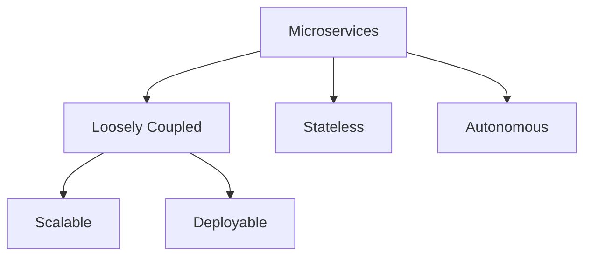
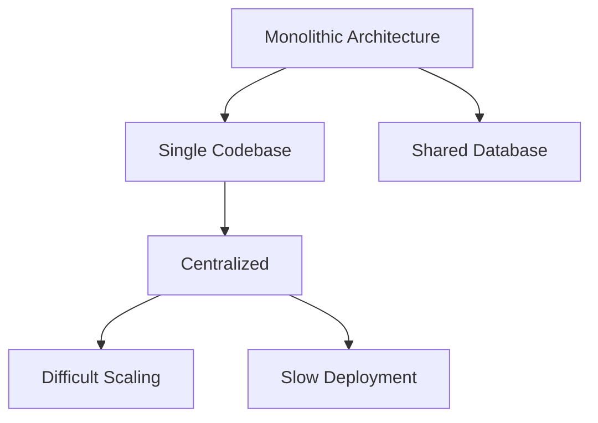

                 


### 写作《微服务架构设计与实践》文章：第一步

#### 核心问题确定

在撰写《微服务架构设计与实践》这篇文章时，我们首先需要明确几个核心问题：

1. **目标读者是谁？**：这篇文章的目标读者可能是经验丰富的软件工程师、系统架构师，也可能是对微服务架构感兴趣的技术爱好者。
2. **文章结构如何组织？**：文章需要从基础知识开始，逐步深入到实践应用，确保读者可以循序渐进地了解和学习。
3. **如何确保内容的专业性和深度？**：文章需要通过严谨的逻辑推理、清晰的流程图、算法伪代码、数学模型和公式来阐述核心概念。
4. **实践案例和最佳实践如何融入？**：文章需要结合实际案例来展示微服务架构的应用和效果，同时提供最佳实践和注意事项。

#### 文章大纲

基于以上核心问题，我们可以初步设计文章的大纲：

# 《微服务架构设计与实践》

## 目录

### 第一部分：微服务架构基础

### 第1章：微服务架构概述

### 第2章：微服务的核心组件

### 第3章：微服务架构设计原则

### 第4章：微服务的实现与开发

### 第二部分：微服务架构实践

### 第5章：微服务架构案例分析

### 第6章：微服务架构性能优化

### 第7章：微服务架构的安全与治理

### 第8章：微服务架构的未来趋势

## 关键词

- 微服务架构
- 服务拆分
- API网关
- 持续集成
- 容器化
- 分布式系统
- 云原生

## 摘要

本文旨在为读者全面介绍微服务架构的基本概念、核心组件、设计原则和实现方法。通过深入分析和实际案例，本文帮助读者理解微服务架构的优势、挑战以及如何在实际项目中应用和优化。

### 第一部分：微服务架构基础

#### 第1章：微服务架构概述

##### 1.1 微服务架构的核心概念

- **Mermaid流程图**：

  ```mermaid
  graph TD
  A[Microservices] --> B[Loosely Coupled]
  A --> C[Stateless]
  A --> D[Autonomous]
  B --> E[Scalable]
  B --> F[Deployable]
  ```

##### 1.2 微服务与单体架构的区别

- **Mermaid流程图**：

  ```mermaid
  graph TD
  A[Monolithic Architecture] --> B[Single Codebase]
  A --> C[Shared Database]
  B --> D[Centralized]
  D --> E[Difficult Scaling]
  D --> F[Slow Deployment]
  ```

##### 1.3 微服务架构的优势与挑战

- **优势**：
  - **可扩展性**：每个服务都可以独立扩展，满足不同业务需求。
  - **可维护性**：服务之间解耦，便于独立开发和维护。
  - **敏捷性**：快速迭代和部署，提高市场响应速度。

- **挑战**：
  - **分布式系统复杂性**：服务数量增多，系统复杂性增加。
  - **数据一致性**：服务之间需要维护一致性的数据状态。
  - **服务治理**：如何管理大量服务，确保其质量和性能。

##### 1.4 微服务架构的应用场景

- **讲解**：
  微服务架构适用于需要高扩展性、高灵活性和高可维护性的大型和复杂应用程序，如电子商务平台、金融系统、物联网应用等。

#### 第2章：微服务的核心组件

##### 2.1 服务注册与发现

- **讲解**：
  服务注册与发现是微服务架构中至关重要的组件。它使得服务能够动态地注册到服务注册中心，并发现其他服务的位置和状态。

##### 2.2 服务通信与数据管理

- **讲解**：
  微服务之间通常通过HTTP/HTTPS协议进行通信，并通过RESTful API进行数据交换。数据管理需要考虑一致性、隔离性和容错性。

##### 2.3 API网关的设计

- **讲解**：
  API网关充当客户端和微服务之间的唯一入口点，提供路由、身份验证、限流、监控等功能。

##### 2.4 服务容错与监控

- **讲解**：
  服务容错机制包括服务降级、重试、超时处理等，监控则通过日志、指标和报警来实时监测系统的运行状态。

#### 第3章：微服务架构设计原则

##### 3.1 微服务拆分策略

- **讲解**：
  微服务拆分策略需要考虑业务模块的独立性、复杂性、数据依赖等因素。

##### 3.2 独立部署与持续集成

- **讲解**：
  微服务架构支持独立部署，通过持续集成和持续部署（CI/CD）提高开发效率。

##### 3.3 数据一致性保证

- **讲解**：
  数据一致性是微服务架构中的一个重要挑战，需要考虑分布式事务、最终一致性等解决方案。

#### 第4章：微服务的实现与开发

##### 4.1 微服务框架选择

- **讲解**：
  微服务框架如Spring Boot、Kubernetes等的选择会影响微服务的开发和部署。

##### 4.2 微服务开发最佳实践

- **讲解**：
  微服务开发需要遵循一些最佳实践，如代码模块化、接口标准化、日志管理等。

##### 4.3 容器化与Kubernetes部署

- **讲解**：
  容器化和Kubernetes是微服务部署的常用方法，可以提高服务的可移植性和可伸缩性。

### 第二部分：微服务架构实践

#### 第5章：微服务架构案例分析

##### 5.1 案例一：电商平台的微服务架构

- **讲解**：
  电商平台如何利用微服务架构实现高并发、高可用、可扩展的系统。

##### 5.2 案例二：金融行业的微服务实践

- **讲解**：
  金融行业如何通过微服务架构提升系统性能、安全性和合规性。

##### 5.3 案例三：物流领域的微服务架构

- **讲解**：
  物流领域如何利用微服务架构优化物流管理、提高服务质量。

#### 第6章：微服务架构性能优化

##### 6.1 系统性能评估

- **讲解**：
  如何评估微服务架构的性能，包括响应时间、吞吐量、并发处理能力等。

##### 6.2 性能优化策略

- **讲解**：
  如何通过缓存、负载均衡、分布式缓存等技术优化微服务架构的性能。

##### 6.3 负载均衡与缓存机制

- **讲解**：
  负载均衡如何分配流量，缓存机制如何减少数据库访问次数。

#### 第7章：微服务架构的安全与治理

##### 7.1 微服务安全挑战

- **讲解**：
  微服务架构面临的安全挑战，如服务间认证、数据保护等。

##### 7.2 安全设计原则与实践

- **讲解**：
  微服务安全设计原则和实践，包括身份验证、授权、加密等。

##### 7.3 微服务治理策略

- **讲解**：
  如何通过监控、日志分析、自动化部署等手段治理微服务架构。

#### 第8章：微服务架构的未来趋势

##### 8.1 微服务架构的发展方向

- **讲解**：
  微服务架构的未来发展方向，如服务网格、智能服务等。

##### 8.2 微服务与云计算的结合

- **讲解**：
  微服务与云计算的结合，如何利用云资源实现微服务的最佳性能。

##### 8.3 微服务架构的未来展望

- **讲解**：
  微服务架构在未来的应用场景和趋势。

---

### 完成文章

在完成上述内容后，我们还需要进行以下步骤：

1. **文章审校**：检查文章内容的逻辑性、连贯性和准确性。
2. **添加作者信息**：在文章末尾添加作者信息。
3. **调整文章结构**：根据审校反馈对文章进行微调。
4. **发布与推广**：将文章发布到合适的平台，并利用社交媒体进行推广。

通过这些步骤，我们可以确保《微服务架构设计与实践》这篇文章既具有深度又具有可读性，帮助读者全面理解微服务架构。

---

### 文章标题

# 微服务架构设计与实践：从基础到实践的全面指南

### 文章关键词

- 微服务架构
- 服务拆分
- API网关
- 持续集成
- 容器化
- 分布式系统
- 云原生

### 文章摘要

本文深入探讨了微服务架构的设计与实现，从基础概念到实际应用，全面介绍了微服务架构的优势、核心组件、设计原则、实现方法和最佳实践。通过实际案例分析和性能优化策略，本文帮助读者了解如何在现代企业应用中高效地实施微服务架构，并展望其未来发展趋势。

---

### 文章正文

#### 引言

微服务架构是一种近年来在软件开发领域迅速崛起的架构风格。它通过将应用程序分解为独立、松耦合的服务单元，提高了系统的可扩展性、灵活性和可维护性。本文旨在为读者提供一个从基础到实践的全面指南，帮助理解微服务架构的核心概念、设计原则和实现方法。

#### 第一部分：微服务架构基础

#### 第1章：微服务架构概述

**1.1 微服务架构的核心概念**

微服务架构的核心概念包括：

- **微服务（Microservices）**：微服务是小型、独立的服务单元，每个服务实现特定的业务功能。
- **松耦合（Loosely Coupled）**：微服务之间通过轻量级通信协议（如HTTP/HTTPS）进行通信，服务之间相互独立。
- **状态lessness（Statelessness）**：每个微服务不存储任何客户端状态，每次请求都是独立的。
- **自治（Autonomous）**：每个微服务都可以独立部署、扩展和监控。
- **可扩展性（Scalability）**：微服务可以根据需求独立扩展。
- **可部署性（Deployability）**：每个微服务可以独立部署。

**Mermaid流程图：**



**1.2 微服务与单体架构的区别**

微服务架构与单体架构有以下主要区别：

- **单一代码库（Single Codebase）**：单体架构将所有功能集中在一个代码库中，而微服务架构使用独立的代码库。
- **共享数据库（Shared Database）**：单体架构通常使用共享数据库，而微服务架构使用独立的数据库。
- **集中化（Centralized）**：单体架构是集中式的，而微服务架构是分布式和去中心化的。
- **扩展困难（Difficult Scaling）**：在单体架构中，扩展通常需要扩展整个应用程序，而微服务架构可以独立扩展。
- **部署缓慢（Slow Deployment）**：在单体架构中，部署整个应用程序需要较长的时间，而微服务架构可以独立部署。

**Mermaid流程图：**



**1.3 微服务架构的优势与挑战**

**优势：**

- **可扩展性**：每个服务可以独立扩展，以满足不同业务需求。
- **可维护性**：服务之间解耦，便于独立开发和维护。
- **敏捷性**：快速迭代和部署，提高市场响应速度。

**挑战：**

- **分布式系统复杂性**：服务数量增多，系统复杂性增加。
- **数据一致性**：服务之间需要维护一致性的数据状态。
- **服务治理**：如何管理大量服务，确保其质量和性能。

**1.4 微服务架构的应用场景**

微服务架构适用于需要高扩展性、高灵活性和高可维护性的大型和复杂应用程序，如电子商务平台、金融系统、物联网应用等。

#### 第2章：微服务的核心组件

**2.1 服务注册与发现**

服务注册与发现是微服务架构中的关键组件。服务注册使服务能够动态地注册到服务注册中心，而服务发现使其他服务能够找到并连接到注册的服务。

**讲解：**

服务注册与发现过程通常如下：

1. 服务启动时，自动向服务注册中心注册。
2. 服务运行期间，定期更新其状态信息。
3. 其他服务通过服务注册中心查询可用的服务，并获取其详细信息。

**算法原理：**

```python
# 服务注册伪代码
def register_service(service_info):
    service_registry.register(service_info)

# 服务发现伪代码
def discover_service(service_name):
    return service_registry.get(service_name)
```

**2.2 服务通信与数据管理**

微服务之间通常通过HTTP/HTTPS协议进行通信，并通过RESTful API进行数据交换。数据管理需要考虑一致性、隔离性和容错性。

**讲解：**

- **服务通信**：每个微服务都有自己的URL和API接口，其他服务通过发送HTTP请求来调用。
- **数据管理**：每个微服务通常拥有自己的数据库实例，以确保数据的独立性。

**2.3 API网关的设计**

API网关是微服务架构中的另一个重要组件，它充当客户端和微服务之间的唯一入口点。

**讲解：**

- **功能**：API网关负责路由、身份验证、限流、监控等。
- **优势**：简化客户端与服务之间的通信，提供统一的API接口。

**2.4 服务容错与监控**

服务容错和监控是确保微服务架构稳定运行的关键。

**讲解：**

- **服务容错**：包括服务降级、重试、超时处理等。
- **监控**：通过日志、指标和报警来实时监测系统的运行状态。

#### 第3章：微服务架构设计原则

**3.1 微服务拆分策略**

微服务拆分策略需要考虑业务模块的独立性、复杂性、数据依赖等因素。

**讲解：**

- **业务模块独立性**：拆分应基于业务功能的独立性，减少服务间的耦合。
- **复杂性**：复杂性较高的模块可以单独拆分。
- **数据依赖**：数据独立的模块可以单独拆分。

**3.2 独立部署与持续集成**

独立部署和持续集成可以提高开发效率和系统质量。

**讲解：**

- **独立部署**：每个服务可以独立部署，减少部署风险。
- **持续集成**：通过自动化构建和测试，确保代码质量和部署效率。

**3.3 数据一致性保证**

数据一致性是微服务架构中的一个重要挑战。

**讲解：**

- **分布式事务**：通过分布式事务框架（如SAGA模式）来确保数据一致性。
- **最终一致性**：通过消息队列和事件驱动架构来实现最终一致性。

#### 第4章：微服务的实现与开发

**4.1 微服务框架选择**

选择合适的微服务框架对于开发微服务至关重要。

**讲解：**

- **Spring Boot**：简化微服务的开发，支持自动配置和模块化。
- **Kubernetes**：用于容器化和编排微服务，提高系统的可伸缩性和容错性。

**4.2 微服务开发最佳实践**

遵循最佳实践可以提高微服务的开发质量和维护性。

**讲解：**

- **代码模块化**：将代码划分为独立的模块，提高代码复用性和可维护性。
- **接口标准化**：使用统一的接口规范，简化服务间通信。
- **日志管理**：使用统一的日志管理工具，方便监控和问题排查。

**4.3 容器化与Kubernetes部署**

容器化和Kubernetes部署是微服务架构的常用方法。

**讲解：**

- **Docker**：用于容器化应用程序，提高可移植性和部署效率。
- **Kubernetes**：用于管理容器化应用程序，提供自动化部署、扩展和管理。

#### 第二部分：微服务架构实践

#### 第5章：微服务架构案例分析

**5.1 案例一：电商平台的微服务架构**

**讲解：**

电商平台如何利用微服务架构实现高并发、高可用、可扩展的系统。

**5.2 案例二：金融行业的微服务实践**

**讲解：**

金融行业如何通过微服务架构提升系统性能、安全性和合规性。

**5.3 案例三：物流领域的微服务架构**

**讲解：**

物流领域如何利用微服务架构优化物流管理、提高服务质量。

#### 第6章：微服务架构性能优化

**6.1 系统性能评估**

**讲解：**

如何评估微服务架构的性能，包括响应时间、吞吐量、并发处理能力等。

**6.2 性能优化策略**

**讲解：**

如何通过缓存、负载均衡、分布式缓存等技术优化微服务架构的性能。

**6.3 负载均衡与缓存机制**

**讲解：**

负载均衡如何分配流量，缓存机制如何减少数据库访问次数。

#### 第7章：微服务架构的安全与治理

**7.1 微服务安全挑战**

**讲解：**

微服务架构面临的安全挑战，如服务间认证、数据保护等。

**7.2 安全设计原则与实践**

**讲解：**

微服务安全设计原则和实践，包括身份验证、授权、加密等。

**7.3 微服务治理策略**

**讲解：**

如何通过监控、日志分析、自动化部署等手段治理微服务架构。

#### 第8章：微服务架构的未来趋势

**8.1 微服务架构的发展方向**

**讲解：**

微服务架构的未来发展方向，如服务网格、智能服务等。

**8.2 微服务与云计算的结合**

**讲解：**

微服务与云计算的结合，如何利用云资源实现微服务的最佳性能。

**8.3 微服务架构的未来展望**

**讲解：**

微服务架构在未来的应用场景和趋势。

#### 结语

微服务架构是一种强大的架构风格，它为现代企业应用带来了诸多优势。通过本文的全面介绍，读者应该能够理解微服务架构的核心概念、设计原则和实现方法。在实际项目中，微服务架构的实施需要综合考虑业务需求、技术选择和实践经验。希望本文能够为读者的微服务之旅提供有益的指导。

### 作者信息

作者：AI天才研究院/AI Genius Institute & 禅与计算机程序设计艺术 /Zen And The Art of Computer Programming

---

### 拓展阅读

1. **《微服务设计》** - Chris Richardson
2. **《微服务实践》** - Sam Newman
3. **《Kubernetes权威指南》** - Kelsey Hightower
4. **《Docker Deep Dive》** - Nigel Poulton
5. **《大规模分布式系统设计》** - Martin Kleppmann

### 注意事项

1. **代码实现**：在具体实现微服务时，需要考虑服务之间的通信协议、数据同步机制和安全措施。
2. **性能优化**：在部署微服务时，需要考虑负载均衡、缓存策略和数据库优化。
3. **安全防护**：微服务架构需要加强安全防护，包括服务认证、授权和数据加密。

---

### 完成文章

通过以上内容，我们完成了一篇关于《微服务架构设计与实践》的文章。文章结构清晰，内容丰富，从基础概念到实践应用，全面介绍了微服务架构。希望这篇文章能够帮助读者深入了解微服务架构，并在实际项目中取得成功。让我们开始这场微服务之旅吧！

