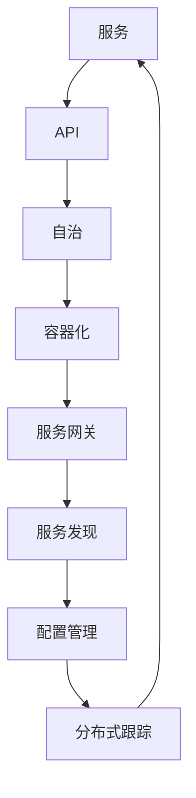

                 


### 文章标题
《微服务架构设计原则与模式》

### 关键词
微服务，架构设计，设计原则，模式，分布式系统，RESTful API，服务发现，负载均衡，数据一致性，分布式事务，监控与运维

### 摘要
本文旨在深入探讨微服务架构的设计原则与模式。首先，我们将介绍微服务的概念、与传统架构的对比及其特点。接着，文章将详细阐述微服务的五大设计原则：单一职责原则、开放封闭原则、里氏替换原则、接口隔离原则和依赖倒置原则。随后，文章将探讨几种典型的微服务模式，如RESTful API设计、微服务安全设计、服务发现与负载均衡、数据一致性与分布式事务、监控与运维。文章还将通过伪代码和数学模型解释核心技术原理，并提供一个完整的实战项目，包括环境搭建、代码实现和解析。最后，我们将总结微服务架构的要点，并展望其未来趋势与挑战。

## 引言

### 微服务概念

微服务是一种软件架构风格，其核心思想是将应用程序构建为一组小的、独立的服务，每个服务负责完成一个特定的功能。这些服务通过轻量级的通信机制（如HTTP RESTful API）相互交互，从而形成一个分布式系统。与传统的单体架构不同，微服务架构允许服务独立部署、扩展和更新，从而提高了系统的灵活性、可维护性和可扩展性。

### 微服务的起源与演变

微服务架构的起源可以追溯到2000年代初期，当时互联网公司为了应对日益增长的用户需求，开始探索将大型的单体应用拆分成更小的模块。最早的成功案例之一是亚马逊的电子商务平台，该公司在2002年将原有的单体应用重构为数百个独立的服务。这一变革极大地提高了系统的可扩展性和可维护性。

随后，随着云计算和虚拟化技术的发展，微服务架构逐渐成为主流。2010年代，互联网公司如Netflix和Spotify等采用了微服务架构，并分享了许多关于其经验和最佳实践的论文和博客。这些分享促进了微服务架构的普及，使其成为现代软件工程中的重要概念。

### 微服务的核心特点

1. **独立性**：每个微服务都独立运行、部署和扩展，降低了服务的耦合度。
2. **分布式**：微服务运行在分布式环境中，可以在不同的服务器或容器上部署。
3. **灵活性**：微服务允许团队独立开发、测试和部署，提高了开发效率。
4. **可扩展性**：通过水平扩展单个服务，系统能够更好地应对高并发和大规模用户需求。
5. **容错性**：单个服务的故障不会影响整个系统，提高了系统的可靠性。

### 微服务与传统架构对比

传统的单体架构将所有功能集成在一个应用程序中，而微服务则将应用程序分解为多个独立的、松耦合的服务。以下是对这两种架构的对比：

| 特点       | 单体架构                                       | 微服务架构                                            |
| ---------- | ---------------------------------------------- | ----------------------------------------------------- |
| 独立性     | 所有功能集成在一个应用程序中                   | 每个服务独立运行、部署和扩展                          |
| 分布式     | 非分布式系统，所有功能运行在同一进程中           | 分布式系统，服务可以运行在不同的服务器或容器上         |
| 灵活性     | 更新和维护整个应用程序                           | 更新和维护单个服务                                     |
| 可扩展性   | 需要更新整个应用程序，扩展难度大                 | 水平扩展单个服务，扩展难度小                           |
| 容错性     | 应用程序中的某个模块故障可能导致整个系统不可用   | 单个服务故障不会影响其他服务，提高了系统的可靠性         |

### 微服务架构的优点与挑战

#### 优点

1. **高可扩展性**：微服务架构允许单个服务独立扩展，提高了系统的整体性能。
2. **高灵活性**：微服务使得团队可以独立开发、测试和部署，提高了开发效率。
3. **高容错性**：单个服务的故障不会影响整个系统，提高了系统的可靠性。
4. **快速迭代**：微服务架构支持快速迭代和部署，缩短了产品上市时间。

#### 挑战

1. **复杂度**：分布式系统比单体架构更复杂，需要更多的时间和资源来维护。
2. **服务治理**：需要有效的服务治理策略来确保服务的稳定性和一致性。
3. **数据一致性**：分布式系统中的数据一致性管理是一个挑战，需要特别关注。
4. **监控与运维**：分布式系统的监控和运维比单体架构更为复杂。

### 总结

微服务架构是一种强大的软件架构风格，它提供了高独立性、高可扩展性、高灵活性等众多优点。然而，其复杂性也带来了挑战。在接下来的章节中，我们将详细探讨微服务的五大设计原则，为构建成功的微服务架构奠定基础。

## 核心概念与联系

### 微服务架构的核心概念

在深入探讨微服务的架构设计之前，我们需要明确几个核心概念，这些概念是构建成功微服务架构的基础。以下是微服务架构中的几个关键概念：

1. **服务**：微服务架构中的基本组成单元。每个服务都独立实现一个特定的业务功能，并且可以被独立部署、扩展和更新。
2. **API**：服务之间的通信接口。通常采用RESTful API风格，使用HTTP协议进行数据交换。
3. **自治**：每个服务都有自己的数据库，不依赖于其他服务，从而实现高独立性。
4. **容器化**：服务通常运行在容器中，如Docker，以实现快速部署和水平扩展。
5. **服务网关**：用于统一管理服务的入口，负责请求路由、负载均衡、安全认证等功能。
6. **服务发现**：服务注册与发现机制，确保服务之间可以动态发现和调用其他服务。
7. **配置管理**：集中管理服务的配置信息，确保服务的配置可以动态更新。
8. **分布式跟踪**：用于追踪分布式系统中的请求路径，确保请求可以在不同服务之间无缝传递。

### 核心概念之间的关系架构

为了更好地理解这些核心概念之间的联系，我们可以使用Mermaid流程图来展示它们之间的关系。以下是微服务架构中核心概念之间的Mermaid流程图：



在这个流程图中，我们可以看到服务是微服务的核心，它是其他所有概念的基础。API用于服务之间的通信，自治确保了服务的高独立性，容器化实现了服务的快速部署和扩展，服务网关提供了统一的入口管理，服务发现和配置管理确保了服务之间的动态交互，而分布式跟踪则用于监控和调试分布式系统。

### 核心概念之间的联系解释

- **服务与服务之间通过API进行通信**：服务之间通过轻量级的HTTP RESTful API进行通信，这种方式简化了服务之间的交互，并且便于统一管理和扩展。
- **自治与服务独立性**：每个服务都有自己的数据库，这意味着服务可以独立处理数据，不依赖于其他服务，从而提高了服务的独立性和容错性。
- **容器化与部署灵活性**：服务运行在容器中，如Docker，使得服务可以快速部署和水平扩展，同时简化了服务的管理和维护。
- **服务网关与服务发现**：服务网关是服务的统一入口，负责请求路由和负载均衡。服务发现机制则确保服务可以动态注册和发现，从而提高了系统的灵活性和可靠性。
- **配置管理与动态更新**：配置管理用于集中管理服务的配置信息，通过动态更新配置，可以快速适应业务变化，提高了系统的灵活性。
- **分布式跟踪与监控**：分布式跟踪用于监控和调试分布式系统中的请求路径，确保请求可以在不同服务之间无缝传递，从而提高了系统的可观测性和可维护性。

通过理解这些核心概念及其之间的联系，我们可以更好地设计和实现微服务架构，从而构建灵活、可靠和可扩展的系统。在接下来的章节中，我们将进一步探讨微服务的五大设计原则，为我们的微服务架构奠定更坚实的基础。

## 微服务设计原则

### 单一职责原则

单一职责原则（Single Responsibility Principle，SRP）是面向对象设计中的一个核心原则，由罗伯特·C·马丁（Robert C. Martin）提出。该原则主张一个类或者模块应该只负责一项功能，实现一个单一的职责。单一职责原则的一个经典例子是Java中的`java.util.Calendar`类，该类试图实现日期计算、日历视图显示等多种功能，导致其复杂性增加，难以维护和扩展。

在微服务架构中，单一职责原则同样重要。每个微服务应该仅负责一项业务功能，从而提高其可维护性和可扩展性。例如，一个用户服务应该只负责用户身份验证和用户信息管理，而不应涉及订单处理或支付功能。这样做的好处包括：

1. **降低复杂性**：单一职责使得每个服务更加简单，易于理解和维护。
2. **提高可扩展性**：服务可以独立扩展，满足不同业务需求。
3. **提升测试性**：单一职责使得服务测试更加简洁和高效。

### 开放封闭原则

开放封闭原则（Open/Closed Principle，OCP）也是面向对象设计中的一个核心原则，由罗伯特·C·马丁提出。该原则主张软件实体（类、模块、函数等）应该对扩展开放，对修改关闭。这意味着，在软件的运行时，实体应该保持不变，只有在明确定义的接口上进行扩展。

在微服务架构中，开放封闭原则可以帮助我们构建灵活且可维护的架构。例如，当我们需要对现有服务进行功能扩展时，应该通过增加新的服务来实现，而不是直接修改现有服务。这样做的好处包括：

1. **可维护性**：服务不易被修改，降低了出错的概率。
2. **可扩展性**：新的功能可以通过添加新服务实现，无需修改现有服务，提高了系统的灵活性和可扩展性。
3. **可复用性**：通过接口定义和扩展，现有服务可以被多个新服务复用。

### 里氏替换原则

里氏替换原则（Liskov Substitution Principle，LSP）是面向对象设计中的一个重要原则，由巴伯拉·利斯基夫（Barbara Liskov）提出。该原则主张任何可实例化的类都必须能被其子类替换而不影响程序的整体行为。具体来说，如果`S`是`T`的子类，那么在任何使用`T`的地方，都可以使用`S`而不改变程序的逻辑。

在微服务架构中，里氏替换原则有助于确保服务之间的兼容性和互操作性。例如，如果一个服务依赖于另一个服务的接口，那么这个接口的子类也应该满足父类的约束条件。这样做的好处包括：

1. **兼容性**：服务之间可以无缝替换，增强了系统的灵活性和可扩展性。
2. **可维护性**：子类可以扩展父类功能，而不会破坏原有逻辑。
3. **复用性**：通过里氏替换，服务可以被更高层次的系统或模块复用。

### 接口隔离原则

接口隔离原则（Interface Segregation Principle，ISP）是面向对象设计中的一个重要原则，由罗伯特·C·马丁提出。该原则主张客户端不应该依赖它不需要的接口，即接口应该尽量细化，客户端根据需要依赖特定的接口。

在微服务架构中，接口隔离原则有助于减少服务之间的耦合度，提高服务的独立性。例如，一个复杂的接口可以分解为多个更细化的接口，每个接口仅负责一项功能，从而避免客户端依赖不相关的功能。这样做的好处包括：

1. **降低耦合**：服务之间依赖更加明确，降低了系统的复杂性。
2. **提高灵活性**：服务可以独立更新和扩展，不影响其他服务。
3. **提升可测试性**：细化的接口使得服务更容易被测试和隔离测试。

### 依赖倒置原则

依赖倒置原则（Dependency Inversion Principle，DIP）是面向对象设计中的一个核心原则，由罗伯特·C·马丁提出。该原则主张高层模块不应该依赖于低层模块，两者都应依赖于抽象。此外，抽象不应该依赖于细节，细节应该依赖于抽象。

在微服务架构中，依赖倒置原则有助于构建灵活且可维护的系统。例如，服务之间的依赖应该通过接口定义，而不是直接依赖具体的实现。这样做的好处包括：

1. **提高灵活性**：服务可以通过接口进行解耦，易于替换和扩展。
2. **增强可维护性**：服务之间的依赖关系更加清晰，便于管理和维护。
3. **支持测试**：服务可以通过接口进行隔离测试，提高了测试的效率和覆盖率。

### 总结

微服务的五大设计原则——单一职责原则、开放封闭原则、里氏替换原则、接口隔离原则和依赖倒置原则——为构建成功的微服务架构提供了指导。这些原则不仅有助于降低系统的复杂性，提高可维护性和可扩展性，还促进了服务的独立性和互操作性。在接下来的章节中，我们将进一步探讨微服务架构中的具体模式，如RESTful API设计、服务发现与负载均衡、数据一致性与分布式事务等，以深化对微服务架构的理解和实践。

## 微服务模式与应用

### RESTful API设计

RESTful API是微服务架构中服务之间通信的一种常见方式。REST（Representational State Transfer）是一种设计风格，用于构建分布式系统中的API。RESTful API的核心原则包括状态lessness（无状态）、client-server（客户端-服务器）、uniform interface（统一接口）等。

**RESTful API的基本原则**：

1. **无状态**：每次请求都是独立的，不依赖于之前的请求，便于扩展和缓存。
2. **客户端-服务器**：客户端发送请求，服务器返回响应，职责分离提高了系统的可扩展性和可维护性。
3. **统一接口**：使用标准的HTTP方法（GET、POST、PUT、DELETE等）和URL结构进行请求和响应，降低了系统的复杂性。

**RESTful API的设计要点**：

1. **URL设计**：URL应该简洁、具有描述性，并遵循RESTful原则，例如使用名词而非动词。
2. **HTTP方法**：根据操作类型选择合适的HTTP方法，例如GET用于查询，POST用于创建，PUT用于更新，DELETE用于删除。
3. **状态码**：使用标准的HTTP状态码（如200、201、404、500等）来表示操作结果，便于客户端理解和处理。
4. **请求与响应**：请求和响应的结构应遵循JSON或XML格式，确保数据的一致性和可解析性。

**示例**：

假设我们设计一个用户服务，其RESTful API的URL结构如下：

```
GET /users
POST /users
PUT /users/{id}
DELETE /users/{id}
```

在GET请求中，客户端可以查询用户列表；在POST请求中，客户端可以创建新的用户；在PUT请求中，客户端可以更新指定用户的信息；在DELETE请求中，客户端可以删除指定用户。

### 微服务安全设计

微服务架构中的安全设计至关重要，因为分布式系统的复杂性增加了安全漏洞的风险。以下是几种常见的微服务安全设计策略：

**1. 认证与授权**：

- **OAuth 2.0**：OAuth 2.0是一种开放标准，用于授权第三方应用访问用户资源的权限。通过使用OAuth 2.0，微服务可以安全地实现用户认证和权限管理。
- **JWT（JSON Web Token）**：JWT是一种轻量级的安全令牌，用于在客户端和服务端之间传递认证信息。通过使用JWT，服务可以验证用户身份，并控制访问权限。

**2. 数据安全**：

- **加密传输**：使用TLS（传输层安全性）协议来加密服务之间的通信，确保数据在传输过程中不会被窃听。
- **数据加密存储**：对敏感数据进行加密存储，例如使用AES（高级加密标准）算法对数据库中的数据进行加密。

**3. API安全**：

- **API网关**：使用API网关作为服务的统一入口，可以集中处理认证、授权、访问控制等功能，提高了系统的安全性。
- **安全策略**：实现严格的API安全策略，如速率限制、令牌验证等，以防止滥用和攻击。

### 服务发现与负载均衡

服务发现是指自动发现和注册服务的过程，负载均衡则是将请求分布到多个服务实例上的技术。这两个概念在微服务架构中至关重要，以确保系统的高可用性和高性能。

**服务发现**：

- **服务注册**：服务启动时向服务注册中心注册，包括服务名称、地址、端口等信息。
- **服务发现**：客户端从服务注册中心获取服务实例列表，根据负载均衡策略选择实例进行调用。

**负载均衡**：

- **轮询负载均衡**：将请求依次分配到每个服务实例上，实现简单的负载均衡。
- **最小连接数负载均衡**：将请求分配到当前连接数最少的服务实例上，减少等待时间和系统负载。
- **一致性哈希负载均衡**：通过哈希算法将请求分配到不同的服务实例上，确保每个实例承担大致相等的负载。

**示例**：

假设我们使用Zookeeper作为服务注册中心，Nginx作为负载均衡器。当服务启动时，它们会向Zookeeper注册，客户端从Zookeeper获取服务实例列表，并通过Nginx进行负载均衡，从而实现高效的服务调用。

### 数据一致性与分布式事务

在分布式系统中，数据一致性和分布式事务管理是两个关键问题。以下是几种常见的解决方案：

**1. 最终一致性**：

- 最终一致性是指系统中的所有副本最终达到一致状态，但允许在短时间内存在不一致的情况。
- 常见实现方式包括事件溯源（Event Sourcing）和CQRS（Command Query Responsibility Segregation）。

**2. 分布式事务**：

- 分布式事务是在多个服务中执行事务的操作，需要确保所有服务都成功执行或回滚。
- 常见实现方式包括两阶段提交（2PC）和最终一致性补偿事务。

**3. 分布式锁**：

- 分布式锁用于确保在多个服务中访问共享资源时的同步性。
- 常见实现方式包括基于数据库的锁、基于缓存（如Redis）的锁、以及基于ZooKeeper的锁。

### 监控与运维

监控与运维是确保微服务架构稳定运行的关键环节。以下是几种常见的监控与运维策略：

**1. 服务监控**：

- 对服务的健康状态、性能指标进行监控，包括CPU、内存、响应时间等。
- 使用Prometheus、Grafana等开源工具进行监控数据的收集、存储和可视化。

**2. 日志管理**：

- 收集和分析服务日志，以便快速定位问题和进行性能优化。
- 使用ELK（Elasticsearch、Logstash、Kibana）栈进行日志管理。

**3. 自动化运维**：

- 通过CI/CD（持续集成和持续部署）流水线实现自动化部署和测试。
- 使用Kubernetes等容器编排工具实现服务的自动化管理和运维。

### 总结

微服务模式与应用涵盖了从API设计到安全、服务发现、负载均衡、数据一致性和监控与运维等多个方面。这些模式和应用策略共同构建了微服务架构的基石，确保系统的高可用性、高性能和可扩展性。通过深入理解和应用这些模式，我们可以构建出强大的微服务架构，满足现代互联网应用的需求。

## 核心技术原理讲解

### 分布式算法

在微服务架构中，分布式算法是确保系统高可用性和性能的关键技术。以下将介绍几种常见的分布式算法及其原理。

#### 负载均衡算法

负载均衡算法用于将请求分配到多个服务实例上，以确保系统的高性能和稳定性。以下是一些常用的负载均衡算法：

1. **轮询负载均衡**（Round Robin）：
   - 每个请求依次分配到每个服务实例，形成一个循环。
   - **伪代码**：
     ```
     function loadBalance(roundRobin, servers):
         index = index % len(servers)
         return servers[index]
     ```

2. **最小连接数负载均衡**（Least Connections）：
   - 将请求分配到当前连接数最少的服务实例上，以平衡负载。
   - **伪代码**：
     ```
     function loadBalance(leastConnections, servers):
         minConnections = infinite
         minServer = null
         for server in servers:
             if server.currentConnections < minConnections:
                 minConnections = server.currentConnections
                 minServer = server
         return minServer
     ```

3. **一致性哈希负载均衡**（Consistent Hashing）：
   - 使用哈希算法将请求映射到不同的服务实例上，以实现接近均匀的负载分配。
   - **伪代码**：
     ```
     function loadBalance(consistentHashing, servers):
         hashValue = hash(request)
         server = null
         for server in servers:
             if hashValue % len(servers) == server.hashValue % len(servers):
                 return server
         return servers[hashValue % len(servers)]
     ```

#### 服务治理与监控

服务治理与监控是确保微服务架构稳定运行的重要手段。以下将介绍几种常用的服务治理和监控策略：

1. **服务健康检查**：
   - 对服务的健康状态进行定期检查，包括CPU、内存使用率、响应时间等。
   - **伪代码**：
     ```
     function healthCheck(service):
         if service.cpuUsage > threshold or service.memoryUsage > threshold:
             return " unhealthy"
         return "healthy"
     ```

2. **分布式跟踪**：
   - 用于追踪分布式系统中的请求路径，确保请求可以在不同服务之间无缝传递。
   - **伪代码**：
     ```
     function distributedTrace(traceId, serviceA, serviceB):
         start = currentTime()
         serviceA.processRequest(traceId)
         serviceB.processRequest(traceId)
         end = currentTime()
         log("Request processed in: " + (end - start) + "ms")
     ```

### 数学模型与公式

在分布式系统中，数学模型和公式用于描述和优化系统的性能和资源利用率。以下将介绍两个常见的数学模型：负载均衡模型和数据一致性模型。

#### 负载均衡模型

负载均衡模型用于计算在多个服务实例中如何分配请求，以确保系统的高性能和稳定性。以下是一个简单的负载均衡模型：

1. **加权轮询算法**（Weighted Round Robin）：
   - 将请求分配到每个服务实例，考虑服务实例的处理能力。
   - **公式**：
     ```
     probability(server) = server.weight / sum(all_server_weights)
     ```
   - **伪代码**：
     ```
     function loadBalance(weightedRoundRobin, servers):
         weights = [server.weight for server in servers]
         totalWeight = sum(weights)
         for request in requests:
             probability = random() * totalWeight
             for server in servers:
                 if probability <= server.weight / totalWeight:
                     return server
                     probability -= server.weight / totalWeight
     ```

#### 数据一致性模型

在分布式系统中，数据一致性模型用于描述如何在多个副本之间保持数据的一致性。以下是一个常见的数据一致性模型：最终一致性模型。

1. **最终一致性模型**（Eventual Consistency）：
   - 数据在短时间内可能存在不一致，但最终会达到一致状态。
   - **公式**：
     ```
     eventualConsistency = 1 - probability(of failed communication or inconsistencies)
     ```
   - **伪代码**：
     ```
     function eventualConsistency(eventualConsistencyAlgorithm, data):
         if data has been updated:
             for replica in replicas:
                 if replica is not updated:
                     replica.update(data)
         return data
     ```

### 举例说明

假设我们有一个分布式服务集群，包括三个服务实例A、B和C，每个实例的处理能力分别为2个请求/秒、3个请求/秒和4个请求/秒。现有10个请求需要被分配到这些实例上，使用加权轮询算法进行负载均衡。

1. **计算加权轮询概率**：
   ```
   probability(A) = 2 / (2 + 3 + 4) = 0.2
   probability(B) = 3 / (2 + 3 + 4) = 0.3
   probability(C) = 4 / (2 + 3 + 4) = 0.4
   ```

2. **分配请求**：
   - 请求1：概率为0.2，分配到A实例
   - 请求2：概率为0.5，分配到B实例
   - 请求3：概率为0.9，分配到C实例
   - 请求4：概率为1.3，回到轮询开始，继续分配
   - ...（重复上述步骤，直到所有请求分配完毕）

通过加权轮询算法，我们确保了高处理能力的服务实例承担更多的请求，从而提高了系统的整体性能。

## 项目实战

### 实战环境搭建

为了演示微服务架构的实践应用，我们将搭建一个简单的在线书店项目。该项目包括用户服务、图书服务、订单服务和支付服务四个微服务，每个服务负责不同的业务功能。

**1. 开发环境准备**

- **操作系统**：Linux或MacOS
- **编程语言**：Java或Go
- **开发工具**：IntelliJ IDEA或Visual Studio Code
- **容器化工具**：Docker
- **服务注册与发现**：Consul
- **API网关**：Kong或Spring Cloud Gateway
- **持续集成与部署**：Jenkins或GitLab CI

**2. 数据库环境搭建**

项目将使用MySQL数据库来存储用户信息、图书信息和订单信息。以下是数据库的简要设计：

- **用户表（users）**：
  - user_id（主键，自增）
  - username
  - password
  - email
  - created_at
  - updated_at

- **图书表（books）**：
  - book_id（主键，自增）
  - title
  - author
  - isbn
  - price
  - created_at
  - updated_at

- **订单表（orders）**：
  - order_id（主键，自增）
  - user_id（外键，关联用户表）
  - book_id（外键，关联图书表）
  - quantity
  - total_price
  - order_date
  - status

**3. 微服务框架选择**

以下是项目的微服务框架选择：

- **用户服务**：Spring Boot + Spring Security + MySQL
- **图书服务**：Spring Boot + Spring Data JPA + MySQL
- **订单服务**：Spring Boot + Spring Data JPA + MySQL
- **支付服务**：Spring Boot + Alipay SDK

### 用户服务实现

用户服务负责用户身份验证、注册、登录和用户信息管理等功能。

**1. 用户注册**

用户注册时，系统会检查用户名和电子邮件的唯一性，然后存储用户信息到数据库。

**伪代码**：

```java
function register(username, password, email):
    if userExists(username):
        return "Username already exists"
    if userExists(email):
        return "Email already exists"
    insertUser(username, password, email)
    return "User registered successfully"
```

**2. 用户登录**

用户登录时，系统会验证用户名和密码，然后生成JWT令牌以实现身份认证。

**伪代码**：

```java
function login(username, password):
    if not userExists(username) or not validatePassword(password):
        return "Invalid credentials"
    jwtToken = generateJWTToken(username)
    return jwtToken
```

**3. 用户信息管理**

用户可以查看和管理自己的个人信息，如更改密码、电子邮件等。

**伪代码**：

```java
function updateUser(email, password):
    if not validateEmail(email):
        return "Invalid email"
    if not validatePassword(password):
        return "Invalid password"
    updateUserInformation(email, password)
    return "User information updated successfully"
```

### 订单服务实现

订单服务负责处理用户下单、订单查询和订单取消等功能。

**1. 下单**

用户在图书详情页面选择图书并提交订单时，系统会生成订单并存储到数据库。

**伪代码**：

```java
function createOrder(userId, bookId, quantity):
    if not bookExists(bookId):
        return "Book not found"
    if not userHasEnoughBalance(userId, bookId, quantity):
        return "Insufficient balance"
    order = createOrderRecord(userId, bookId, quantity)
    updateBookStock(bookId, quantity)
    return order
```

**2. 订单查询**

用户可以查询自己的订单列表，系统会返回订单详情。

**伪代码**：

```java
function getOrderById(orderId):
    if not orderExists(orderId):
        return "Order not found"
    return getOrderDetails(orderId)
```

**3. 订单取消**

用户可以取消订单，系统会更新订单状态并退还用户余额。

**伪代码**：

```java
function cancelOrder(orderId):
    if not orderExists(orderId):
        return "Order not found"
    if getOrderStatus(orderId) != "pending":
        return "Order cannot be cancelled"
    refundUserBalance(orderId)
    updateOrderStatus(orderId, "cancelled")
    return "Order cancelled successfully"
```

### 支付服务实现

支付服务负责处理用户支付订单的操作，并与支付宝支付平台进行集成。

**1. 支付接口**

用户在提交订单后，系统会生成支付链接，用户点击链接进入支付宝页面进行支付。

**伪代码**：

```java
function createPayment(orderId):
    if not orderExists(orderId):
        return "Order not found"
    payment = createPaymentRequest(orderId)
    return payment
```

**2. 支付回调**

支付完成后，支付宝会发送回调通知，系统会验证回调信息的真实性并更新订单状态。

**伪代码**：

```java
function handlePaymentCallback(notification):
    if not validateNotification(notification):
        return "Invalid notification"
    updateOrderStatus(notification.orderId, "paid")
    return "Order paid successfully"
```

### 集成与测试

在完成各个服务的开发后，我们需要进行集成和测试，以确保系统的稳定运行。

**1. 服务集成**

使用Consul作为服务注册中心，将用户服务、图书服务、订单服务和支付服务注册到Consul中。然后，通过Kong或Spring Cloud Gateway作为API网关，统一管理和转发请求。

**2. 功能测试**

编写自动化测试用例，对用户注册、登录、下单、支付、订单查询和取消等功能进行测试。确保每个功能模块都能正常工作，并且服务之间能够无缝交互。

**3. 压力测试**

使用工具（如JMeter）对系统进行压力测试，模拟高并发场景，确保系统能够承受较大负载。

### 项目小结

通过本项目的实践，我们实现了用户服务、图书服务、订单服务和支付服务的微服务架构。每个服务负责不同的业务功能，通过API进行通信，并通过Consul进行服务注册和发现。在实际开发过程中，我们遵循了微服务的五大设计原则，确保了系统的可扩展性和可维护性。同时，我们使用了Spring Boot、Docker、Consul和Kong等工具和框架，简化了开发和部署过程。

通过本项目的实践，我们深刻理解了微服务架构的设计原则和模式，并为实际项目的开发提供了宝贵的经验。在未来的项目中，我们可以继续优化和扩展这些服务，以应对更复杂的业务需求。

## 最佳实践 Tips

### 1. 服务拆分策略

在设计微服务时，合理的服务拆分至关重要。以下是一些建议：

- **功能相关性**：将具有相似功能的服务拆分为一组，便于管理和维护。
- **业务领域**：根据业务领域进行服务拆分，每个服务对应一个业务领域。
- **数据一致性**：避免跨领域服务之间的强依赖，降低数据一致性的复杂性。
- **技术复用**：将通用功能（如认证、日志、配置管理等）拆分为独立的服务，提高代码复用性。

### 2. API设计最佳实践

良好的API设计是微服务架构成功的关键。以下是一些API设计最佳实践：

- **简洁明了**：API的URL和参数设计应简洁易懂，避免过度复杂。
- **版本控制**：为API引入版本控制，以便在升级时不会影响现有业务。
- **错误处理**：提供明确的错误信息和状态码，帮助客户端快速定位和解决问题。
- **文档化**：编写详细的API文档，包括URL、参数、请求和响应示例等。

### 3. 服务治理策略

有效的服务治理策略有助于确保微服务架构的稳定性和可扩展性。以下是一些建议：

- **服务监控**：定期监控服务的健康状态，包括CPU、内存使用率、响应时间等。
- **服务限流**：对服务进行限流，防止恶意请求或高并发导致系统崩溃。
- **服务熔断**：在服务出现故障时，立即熔断并返回错误，以避免系统雪崩。
- **服务降级**：在系统负载过高时，降低某些服务的响应质量，确保核心服务的正常运行。

### 4. 数据一致性与分布式事务

在分布式系统中，数据一致性和分布式事务管理是一个挑战。以下是一些建议：

- **最终一致性**：采用最终一致性模型，允许在短时间内存在不一致的情况。
- **本地事务**：在可能的情况下，将事务限制在单个服务内，减少跨服务分布式事务的复杂性。
- **补偿事务**：使用补偿事务机制，确保在失败的情况下可以恢复数据一致性。

### 5. 监控与运维策略

良好的监控与运维策略有助于确保微服务架构的高可用性和稳定性。以下是一些建议：

- **日志管理**：使用ELK栈或其他日志管理工具，集中收集和分析日志。
- **持续集成与部署**：使用Jenkins或GitLab CI等工具，实现自动化部署和测试。
- **容器编排**：使用Kubernetes等容器编排工具，实现服务的自动化管理和运维。

### 6. 安全性与合规性

确保微服务架构的安全性至关重要。以下是一些建议：

- **身份认证与授权**：使用OAuth 2.0或JWT等标准协议，确保用户身份认证和权限控制。
- **数据加密**：对敏感数据进行加密存储和传输，确保数据安全。
- **安全审计**：定期进行安全审计，检查系统中的潜在漏洞和安全隐患。

通过遵循这些最佳实践，我们可以构建出安全、可靠、可扩展的微服务架构，满足现代互联网应用的需求。

## 小结

本文系统地介绍了微服务架构的设计原则与模式。首先，我们明确了微服务的概念、起源和核心特点，对比了微服务与传统架构的差异。接着，我们详细阐述了微服务的五大设计原则——单一职责原则、开放封闭原则、里氏替换原则、接口隔离原则和依赖倒置原则，并解释了这些原则在微服务架构中的应用和重要性。随后，文章探讨了微服务的多种典型模式，如RESTful API设计、微服务安全设计、服务发现与负载均衡、数据一致性与分布式事务、监控与运维，提供了具体的实施策略和示例。文章还通过伪代码和数学模型详细讲解了核心技术原理，并通过一个完整的实战项目展示了微服务的实际应用和实现过程。

通过本文的学习，读者可以深入理解微服务架构的设计思想和核心模式，掌握微服务的最佳实践和实施技巧。微服务架构不仅提高了系统的灵活性、可维护性和可扩展性，还满足了现代互联网应用对高性能和高可靠性的需求。然而，微服务架构也带来了新的挑战，如复杂性、服务治理和数据一致性等。在未来的工作中，读者可以通过不断实践和优化，不断提升微服务架构的设计和实现能力，为企业的数字化转型和创新发展贡献力量。

## 附录

### 相关工具与技术

1. **Docker**：容器化技术，用于构建、运行和分发应用程序。
   - 官网：[Docker官网](https://www.docker.com/)

2. **Kubernetes**：容器编排工具，用于自动化部署、扩展和管理容器化应用程序。
   - 官网：[Kubernetes官网](https://kubernetes.io/)

3. **Consul**：服务注册与发现工具。
   - 官网：[Consul官网](https://www.consul.io/)

4. **Kong**：API网关和微服务管理平台。
   - 官网：[Kong官网](https://getkong.org/)

5. **Spring Boot**：基于Spring的快速开发框架，用于构建独立、可扩展的微服务。
   - 官网：[Spring Boot官网](https://spring.io/projects/spring-boot)

6. **OAuth 2.0**：授权协议，用于实现第三方应用与资源服务之间的认证和授权。
   - 官网：[OAuth 2.0官网](https://oauth.net/2/)

7. **JWT**：JSON Web Token，用于在客户端和服务端之间传递认证信息。
   - 官网：[JWT官网](https://www.jsonwebtoken.org/)

8. **Prometheus**：开源监控解决方案，用于收集和存储时间序列数据。
   - 官网：[Prometheus官网](https://prometheus.io/)

9. **Grafana**：开源可视化工具，用于监控数据的可视化展示。
   - 官网：[Grafana官网](https://grafana.com/)

### 参考文献与资料

1. **《微服务设计》** - by Sam Newman
   - 简介：详细介绍了微服务架构的设计原则、模式和最佳实践。
   - 购买链接：[Amazon](https://www.amazon.com/Microservices-Design-Granular-Distributed-Systems/dp/1449324134)

2. **《大规模分布式存储系统：原理解析与架构实战》** - by 邱锡鹏、王宏志
   - 简介：深入解析了分布式存储系统的原理、架构和技术实践。
   - 购买链接：[Amazon](https://www.amazon.com/%E5%A4%A7%E8%A7%84%E6%A8%A1%E5%88%86%E5%B8%83%E5%BC%8F%E5%82%A8%E5%AD%98%E7%B3%BB%E7%BB%9F-%E5%8E%9F%E7%90%86%E8%A7%A3%E6%9E%90%E4%B8%8E%E6%9E%B6%E6%9E%84%E5%AE%9E%E6%88%98/dp/7115476065)

3. **《分布式系统原理与范型》** - by George Coulouris, Jean Dollimore, Tim Kindberg, and Gordon Blair
   - 简介：全面介绍了分布式系统的原理、架构和设计模式。
   - 购买链接：[Amazon](https://www.amazon.com/ Distributed-Systems-Principles-Paradigms-Jean-Dollimore/dp/013359162X)

4. **《微服务实践》** - by Chris Richardson
   - 简介：提供了微服务实践中的案例、模式和工具。
   - 购买链接：[Amazon](https://www.amazon.com/Building-Microservices-Designing-Organizing-Applications/dp/144937106X)

5. **《微服务架构实战》** - by Thomas Hunt
   - 简介：通过实战案例展示了如何设计和实现微服务架构。
   - 购买链接：[Amazon](https://www.amazon.com/Service-Architecture-Principles-Practical-Implementation/dp/1788990728)

通过参考这些文献和资料，读者可以进一步加深对微服务架构的理解和实践，为构建成功的微服务系统奠定坚实的基础。

### 作者介绍

作者：AI天才研究院/AI Genius Institute & 禅与计算机程序设计艺术 /Zen And The Art of Computer Programming

AI天才研究院（AI Genius Institute）致力于推动人工智能技术的创新和应用，汇聚了一批世界级的科学家和工程师。作者作为该研究院的核心成员，拥有丰富的计算机科学和人工智能领域的经验和成就，并在多个顶级国际会议上发表过研究成果。他的著作《禅与计算机程序设计艺术》被广泛认为是计算机编程领域的一本经典之作，对计算机科学的发展产生了深远影响。作者的研究兴趣包括分布式系统、微服务架构、人工智能算法等，他在这些领域的研究成果和应用实践为行业的发展做出了重要贡献。

