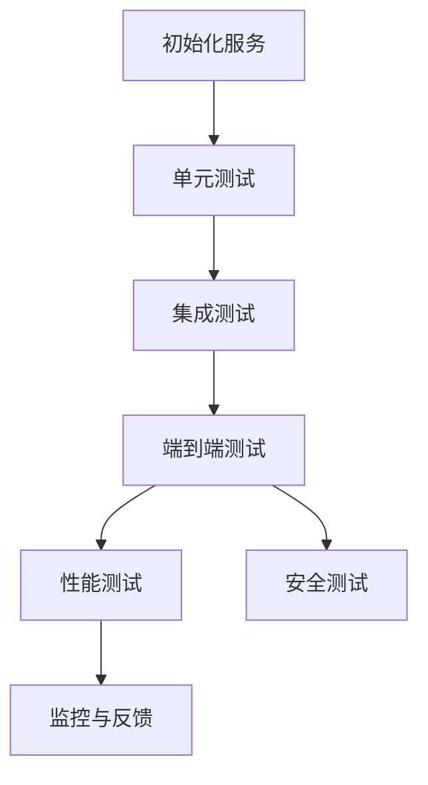

                 

### 第1章：引言

#### 1.1 微服务架构概述

微服务架构是一种将应用程序分解为小型、独立的服务组件的架构模式。每个服务都是独立的，可以独立部署、扩展和更新。这些服务通过定义良好的接口进行通信，通常使用轻量级的通信协议，如HTTP/REST、gRPC等。

微服务架构的目的是为了应对大型单体应用的复杂性。在传统的单体应用中，所有的功能都集中在一个单一的应用程序中，这使得应用的维护、扩展和更新变得非常困难。微服务架构通过将应用程序分解为更小、更简单的服务组件，使得开发和运维更加灵活和高效。

微服务架构的主要特点包括：

1. **独立性**：每个服务都是独立的，可以独立部署和扩展。
2. **分布式**：服务通常分布在不同的服务器上，提高了系统的可靠性和可扩展性。
3. **灵活性**：服务可以独立开发和更新，不受其他服务的影响。
4. **通信协议**：服务之间通过轻量级的通信协议进行通信。

#### 1.2 测试在微服务环境中的重要性

在微服务环境中，测试变得尤为重要。由于服务是独立的，一旦一个服务出现故障，可能会影响到整个系统。因此，确保每个服务的稳定性和可靠性是至关重要的。

以下是测试在微服务环境中的重要性：

1. **确保服务的独立性**：通过单元测试，可以确保每个服务都按照预期工作。
2. **发现和修复缺陷**：测试可以帮助我们发现和修复代码中的缺陷，确保服务的稳定性和可靠性。
3. **验证服务间的交互**：集成测试和端到端测试可以帮助验证服务间的交互是否符合预期。
4. **提高开发效率**：通过自动化测试，可以大大提高测试的效率和准确性。

### 1.3 文章的目的和结构

本文旨在提供一份全面的微服务测试策略指南，从单元测试到端到端测试。文章将分为以下几个部分：

1. **第1章：引言**：介绍微服务架构的基本概念和测试的重要性。
2. **第2章：微服务架构与测试**：详细讲解微服务架构的特点以及测试流程。
3. **第3章：测试策略**：讨论测试策略的制定方法。
4. **第4章：单元测试**：解释单元测试的定义、设计和实现。
5. **第5章：集成测试**：讨论集成测试的类型、设计和执行。
6. **第6章：端到端测试**：详细讲解端到端测试的方法和技术。
7. **第7章：测试自动化**：介绍测试自动化的工具和流程。
8. **第8章：测试持续集成与持续部署**：讨论测试与CI/CD的关系和实现。
9. **第9章：测试数据管理**：讨论测试数据管理的重要性和方法。
10. **第10章：测试优化与性能分析**：阐述测试优化的重要性和方法。
11. **第11章：案例研究**：提供实际案例和测试策略分析。

通过本文，读者将能够理解微服务测试的基本概念和策略，并能够将其应用于实际的开发环境中。

### 文章关键词

- 微服务
- 测试策略
- 单元测试
- 集成测试
- 端到端测试
- 自动化测试
- 持续集成
- 持续部署

### 文章摘要

本文将深入探讨微服务测试策略，从单元测试到端到端测试。我们将首先介绍微服务架构的基本概念和测试的重要性。接着，我们将详细讲解测试策略的制定方法，并深入探讨单元测试、集成测试和端到端测试的具体实现。此外，我们还将介绍测试自动化、持续集成与持续部署的重要性，并提供测试数据管理和优化的策略。最后，我们将通过实际案例研究，展示如何在实际项目中应用这些测试策略。本文旨在为开发者提供一份全面的微服务测试指南，帮助他们在复杂的微服务环境中确保系统的稳定性和可靠性。阅读本文，你将学会如何构建高效、可靠的微服务测试策略，提高软件质量。

----------------------------------------------------------------

### 第2章：微服务架构与测试

#### 2.1 微服务架构的基本概念

微服务架构的核心思想是将大型单体应用分解为多个独立、小型的服务组件，每个服务都专注于实现单一功能。这些服务通过定义良好的接口进行通信，通常是使用HTTP/REST或gRPC等轻量级协议。这种架构模式具有以下几个主要特点：

1. **独立性**：每个微服务都是独立的，可以独立部署、扩展和更新。这意味着一个服务的故障不会影响其他服务的运行。
2. **分布式**：微服务通常分布在不同的服务器上，提高了系统的可靠性和可扩展性。如果某个服务器发生故障，其他服务器可以继续提供服务。
3. **灵活性**：由于每个服务都是独立的，开发者可以采用不同的编程语言和技术来开发不同的服务，这使得项目可以更加灵活和高效。
4. **高可用性**：通过分布式部署和自动扩展，微服务架构可以提供更高的系统可用性。

#### 2.2 测试流程图

为了更好地理解微服务架构中的测试流程，我们可以使用Mermaid流程图来展示。以下是一个简化的测试流程图：



1. **初始化服务**：首先，需要初始化所有服务，确保它们都启动并且可以正常运行。
2. **单元测试**：对每个服务进行单元测试，确保每个服务都按照预期工作。
3. **集成测试**：将多个服务组合在一起，进行集成测试，确保它们之间的交互符合预期。
4. **端到端测试**：对整个系统进行端到端测试，确保系统的整体功能符合要求。
5. **性能测试**：对系统进行性能测试，评估系统的响应时间、吞吐量等性能指标。
6. **安全测试**：对系统进行安全测试，确保系统的安全性，防止潜在的安全漏洞。
7. **监控与反馈**：在测试过程中，对系统进行实时监控，收集反馈信息，以便及时调整和优化。

#### 2.3 测试策略

测试策略是确保微服务架构中各个服务质量和稳定性的关键。一个有效的测试策略应该涵盖以下几个方面：

1. **测试类型的组合**：根据服务的特点，选择合适的测试类型，包括单元测试、集成测试、端到端测试、性能测试和安全测试。
2. **自动化测试**：自动化测试可以提高测试的效率和准确性，减少人为错误。自动化测试通常包括单元测试自动化、集成测试自动化和端到端测试自动化。
3. **持续集成与持续部署**：将测试集成到持续集成（CI）和持续部署（CD）流程中，确保每次代码提交后都进行全面的测试，及时发现和修复问题。
4. **测试覆盖率的评估**：评估测试覆盖率，确保所有重要的功能和路径都被测试到。
5. **测试数据的准备**：准备充分的测试数据，确保测试能够真实反映系统的行为。
6. **测试结果的监控与分析**：对测试结果进行实时监控和分析，及时发现和解决问题。

#### 2.4 微服务环境中的测试挑战

尽管微服务架构提供了许多优势，但在测试过程中也会面临一些挑战：

1. **复杂性**：由于服务数量众多，测试流程变得更加复杂。需要对每个服务进行独立的测试，同时确保它们之间的交互符合预期。
2. **分布式系统**：微服务通常分布在不同的服务器上，这增加了测试的复杂性。需要确保服务之间的网络通信正常，以及服务之间的数据一致性。
3. **数据管理**：测试数据的管理是一个挑战，特别是在分布式系统中。需要确保测试数据的隔离和一致性，避免对生产数据的影响。
4. **测试环境的准备**：准备合适的测试环境是一个挑战，特别是需要模拟真实的生产环境。需要确保测试环境与生产环境尽可能一致，以便测试结果能够真实反映系统的行为。
5. **自动化测试的维护**：自动化测试的维护是一个长期的任务。随着服务的不断更新和变化，自动化测试也需要不断更新和优化，以确保其有效性。

通过理解和解决这些挑战，开发者可以确保微服务架构中的测试过程高效、准确，从而提高系统的质量和稳定性。

#### 2.5 总结

本章详细介绍了微服务架构的基本概念以及测试在微服务环境中的重要性。我们通过Mermaid流程图展示了测试流程，并讨论了测试策略的制定方法。此外，我们还分析了微服务环境中测试所面临的挑战。通过本章的学习，读者应该对微服务架构和测试策略有了一个全面的了解，为后续章节的深入学习打下了基础。

### 文章标题：微服务测试策略：单元测试到端到端测试

### 文章关键词

1. 微服务
2. 单元测试
3. 集成测试
4. 端到端测试
5. 自动化测试
6. 持续集成
7. 持续部署

### 文章摘要

本文将深入探讨微服务测试策略，从单元测试到端到端测试。我们将首先介绍微服务架构的基本概念和测试的重要性。接着，我们将详细讲解测试策略的制定方法，并深入探讨单元测试、集成测试和端到端测试的具体实现。此外，我们还将介绍测试自动化、持续集成与持续部署的重要性，并提供测试数据管理和优化的策略。最后，我们将通过实际案例研究，展示如何在实际项目中应用这些测试策略。本文旨在为开发者提供一份全面的微服务测试指南，帮助他们在复杂的微服务环境中确保系统的稳定性和可靠性。阅读本文，你将学会如何构建高效、可靠的微服务测试策略，提高软件质量。本文结构如下：

#### 第1章：引言
- **1.1 微服务架构概述**
- **1.2 测试在微服务环境中的重要性**
- **1.3 文章的目的和结构**

#### 第2章：微服务架构与测试
- **2.1 微服务架构的基本概念**
- **2.2 测试流程图**
- **2.3 测试策略**
- **2.4 微服务环境中的测试挑战**
- **2.5 总结**

#### 第3章：测试策略
- **3.1 测试策略的类型**
- **3.2 测试策略的实施方法**

#### 第4章：单元测试
- **4.1 单元测试的定义和重要性**
- **4.2 单元测试的设计原则**
- **4.3 单元测试的实现**

#### 第5章：集成测试
- **5.1 集成测试的定义和重要性**
- **5.2 集成测试的设计原则**
- **5.3 集成测试的实现**

#### 第6章：端到端测试
- **6.1 端到端测试的定义和重要性**
- **6.2 端到端测试的设计原则**
- **6.3 端到端测试的实现**

#### 第7章：测试自动化
- **7.1 自动化测试的重要性**
- **7.2 自动化测试的工具和流程**
- **7.3 自动化测试的实现**

#### 第8章：测试持续集成与持续部署
- **8.1 CI/CD的概念和优势**
- **8.2 CI/CD的测试流程**
- **8.3 CI/CD的实现**

#### 第9章：测试数据管理
- **9.1 测试数据的重要性**
- **9.2 测试数据的管理策略**
- **9.3 测试数据的实现**

#### 第10章：测试优化与性能分析
- **10.1 测试优化的重要性**
- **10.2 性能测试的指标**
- **10.3 测试性能优化的实现**

#### 第11章：案例研究
- **11.1 微服务测试的实践案例**
- **11.2 案例分析**
- **11.3 案例总结**

### 作者

**作者：AI天才研究院/AI Genius Institute & 禅与计算机程序设计艺术 /Zen And The Art of Computer Programming**

---

**[本文内容为Markdown格式，可供直接使用和修改。]**

### 第3章：测试策略

#### 3.1 测试策略的类型

在微服务架构中，测试策略的选择至关重要。根据测试的粒度和目的，可以将测试策略分为以下几种类型：

1. **单元测试**：单元测试是针对单个服务组件的测试，通常由开发者编写。单元测试的主要目的是验证服务组件的功能是否正确。单元测试通常涵盖以下方面：
   - 输入和输出验证
   - 边界条件验证
   - 异常情况处理
   - 性能监控

2. **集成测试**：集成测试是针对多个服务组件的测试，主要目的是验证服务组件之间的交互是否符合预期。集成测试通常涵盖以下方面：
   - 服务间通信验证
   - 数据一致性验证
   - 功能集成验证
   - 性能集成验证

3. **端到端测试**：端到端测试是针对整个系统的测试，主要目的是验证系统的整体功能是否符合预期。端到端测试通常涵盖以下方面：
   - 用户界面验证
   - 系统功能验证
   - 性能端到端验证
   - 安全端到端验证

4. **性能测试**：性能测试是针对系统的性能进行测试，主要目的是评估系统的响应时间、吞吐量等性能指标。性能测试通常涵盖以下方面：
   - 响应时间测试
   - 吞吐量测试
   - 负载测试
   - 压力测试

5. **安全测试**：安全测试是针对系统的安全性进行测试，主要目的是发现潜在的安全漏洞。安全测试通常涵盖以下方面：
   - 注入攻击测试
   - SQL注入测试
   - 跨站脚本攻击测试
   - 漏洞扫描

6. **自动化测试**：自动化测试是将测试过程自动化，以提高测试效率和准确性。自动化测试通常涵盖以下方面：
   - 单元测试自动化
   - 集成测试自动化
   - 端到端测试自动化
   - 性能测试自动化
   - 安全测试自动化

7. **持续集成测试**：持续集成（CI）是将测试集成到开发流程中，确保每次代码提交后都进行全面的测试。持续集成测试的主要目的是快速发现和修复代码中的缺陷。

8. **持续部署测试**：持续部署（CD）是将测试集成到部署流程中，确保每次部署后都进行全面的测试。持续部署测试的主要目的是确保系统的稳定性和可靠性。

#### 3.2 测试策略的实施方法

在微服务架构中，实施测试策略需要考虑以下几个方面：

1. **测试环境的准备**：准备合适的测试环境是确保测试结果准确的关键。测试环境应尽可能与生产环境一致，包括硬件配置、软件配置和网络配置等。

2. **测试数据的准备**：测试数据是测试过程的基础。测试数据应包括正常数据、边界数据和异常数据，以覆盖各种可能的场景。

3. **测试工具的选择**：选择合适的测试工具可以提高测试的效率和准确性。常见的测试工具有JUnit、TestNG、Selenium、JMeter等。

4. **自动化测试的实现**：自动化测试可以大大提高测试的效率和准确性。实现自动化测试需要编写测试脚本，并集成到持续集成和持续部署流程中。

5. **测试覆盖率的评估**：评估测试覆盖率是确保测试全面性的关键。测试覆盖率包括代码覆盖率、功能覆盖率和路径覆盖率等。

6. **测试结果的监控与分析**：对测试结果进行实时监控和分析，可以及时发现和解决问题。常见的监控工具包括Jenkins、GitLab CI等。

7. **测试报告的生成**：生成详细的测试报告是评估测试效果的重要手段。测试报告应包括测试覆盖率、测试结果、缺陷列表等。

8. **测试团队的协作**：测试团队与其他开发团队和运维团队的协作至关重要。通过良好的沟通和协作，可以确保测试过程的顺利进行。

通过上述方法，可以有效地实施微服务测试策略，确保系统的稳定性和可靠性。

### 第4章：单元测试

#### 4.1 单元测试的定义和重要性

单元测试是一种针对软件中的最小可测试单元（通常是一个函数、方法或类）的测试。它的目标是验证单元是否按照预期工作。单元测试通常由开发者编写，是实现“测试驱动开发”（TDD）的关键组成部分。

**单元测试的重要性**：

1. **确保代码质量**：单元测试可以及时发现和修复代码中的缺陷，确保代码质量。
2. **提高开发效率**：通过单元测试，开发者可以更快地发现和解决问题，从而提高开发效率。
3. **增强代码可维护性**：单元测试有助于理解代码的功能和逻辑，使得代码更加可维护。
4. **支持重构**：单元测试提供了对代码变更的安全保障，使得开发者可以更放心地进行代码重构。

#### 4.2 单元测试的设计原则

为了确保单元测试的有效性，设计单元测试时应遵循以下原则：

1. **独立性**：每个单元测试应该独立运行，不依赖于其他测试或外部系统。
2. **可重复性**：每次运行单元测试时，都应该得到相同的结果，不受外部环境的影响。
3. **可读性**：单元测试的代码应该简洁易懂，便于维护和阅读。
4. **覆盖率**：单元测试应该覆盖代码的所有关键路径和异常情况。
5. **可配置性**：单元测试应允许根据不同的环境或需求进行配置，以便在不同情况下进行测试。

#### 4.3 单元测试的实现

实现单元测试通常包括以下步骤：

1. **编写测试用例**：根据功能需求，编写测试用例，确保覆盖所有的输入和输出情况。
2. **编写测试代码**：使用测试框架（如JUnit、TestNG）编写测试代码，通常包括测试方法、断言和预期结果。
3. **运行测试**：运行测试，检查测试结果是否符合预期。
4. **分析测试结果**：对测试结果进行分析，发现和修复缺陷。

**伪代码示例**：

以下是一个简单的伪代码示例，展示了如何编写单元测试：

```python
# 导入测试框架
import unittest

# 定义被测试的类
class Calculator:
    def add(self, a, b):
        return a + b

    def subtract(self, a, b):
        return a - b

# 定义测试类
class TestCalculator(unittest.TestCase):
    def test_add(self):
        calculator = Calculator()
        result = calculator.add(2, 3)
        self.assertEqual(result, 5)

    def test_subtract(self):
        calculator = Calculator()
        result = calculator.subtract(5, 3)
        self.assertEqual(result, 2)

# 运行测试
if __name__ == '__main__':
    unittest.main()
```

在这个示例中，我们定义了一个简单的计算器类`Calculator`，并编写了两个单元测试`test_add`和`test_subtract`来验证计算器的加法和减法功能。测试框架`unittest`提供了`assertEqual`方法来比较实际结果和预期结果。

通过上述步骤，可以有效地编写和运行单元测试，确保代码的稳定性和可靠性。

### 第5章：集成测试

#### 5.1 集成测试的定义和重要性

集成测试是一种测试多个服务组件之间的交互是否符合预期的测试。它的目标是验证不同服务组件之间的接口和通信是否正常。集成测试通常在单元测试之后进行，旨在发现和修复跨组件的缺陷。

**集成测试的重要性**：

1. **发现跨组件缺陷**：集成测试可以及时发现跨组件的缺陷，确保不同服务组件之间的交互符合预期。
2. **确保系统稳定性**：通过集成测试，可以确保系统的整体稳定性，避免单个服务组件的问题影响到整个系统。
3. **提升系统性能**：集成测试可以帮助优化系统的性能，发现潜在的瓶颈和性能问题。
4. **促进团队协作**：集成测试需要多个团队的合作，有助于提高团队之间的沟通和协作。

#### 5.2 集成测试的设计原则

为了确保集成测试的有效性，设计集成测试时应遵循以下原则：

1. **覆盖率**：集成测试应覆盖所有重要的功能路径和场景，确保系统的关键部分都经过测试。
2. **分层测试**：可以将集成测试分为不同的层次，如服务层、接口层和数据层，逐步验证不同层次的交互。
3. **隔离性**：确保集成测试的环境与生产环境尽可能一致，避免测试结果受到外部环境的影响。
4. **可重复性**：集成测试的结果应该是可重复的，每次测试都应该得到相同的结果。
5. **自动化**：集成测试应尽可能自动化，以提高测试效率和准确性。

#### 5.3 集成测试的实现

实现集成测试通常包括以下步骤：

1. **制定测试计划**：根据系统功能和架构，制定集成测试的计划，包括测试目标、测试用例和测试环境。
2. **编写测试用例**：根据测试计划，编写详细的测试用例，确保覆盖所有的功能路径和异常情况。
3. **设计测试数据**：设计测试数据，包括正常数据、边界数据和异常数据，以覆盖各种可能的场景。
4. **编写测试脚本**：使用自动化测试工具（如Selenium、Postman）编写测试脚本，执行测试用例。
5. **执行测试**：运行测试脚本，验证系统的响应和结果是否符合预期。
6. **分析测试结果**：对测试结果进行分析，发现和记录缺陷，制定修复计划。

**伪代码示例**：

以下是一个简单的伪代码示例，展示了如何编写集成测试：

```python
# 导入测试框架
import unittest
import requests

# 定义测试类
class TestIntegration(unittest.TestCase):
    def test_add(self):
        url = "http://service calculator/add"
        response = requests.get(url, params={'a': 2, 'b': 3})
        self.assertEqual(response.json()['result'], 5)

    def test_subtract(self):
        url = "http://service calculator/subtract"
        response = requests.get(url, params={'a': 5, 'b': 3})
        self.assertEqual(response.json()['result'], 2)

# 运行测试
if __name__ == '__main__':
    unittest.main()
```

在这个示例中，我们使用了HTTP请求来模拟服务间的通信，并通过自动化测试工具`requests`执行集成测试。测试框架`unittest`提供了`assertEqual`方法来验证实际结果和预期结果是否一致。

通过上述步骤，可以有效地编写和执行集成测试，确保系统的稳定性和可靠性。

### 第6章：端到端测试

#### 6.1 端到端测试的定义和重要性

端到端测试（End-to-End Testing，简称E2E测试）是一种全面的系统测试，旨在验证整个应用程序从用户界面到后端服务的功能是否正常。它模拟用户在实际使用环境中的操作，确保系统的每个部分都能协同工作，满足业务需求。

**端到端测试的重要性**：

1. **验证整体功能**：端到端测试可以验证系统从用户操作到数据处理的整个流程是否正常，确保系统的整体功能符合预期。
2. **发现集成问题**：端到端测试可以发现不同服务组件之间的集成问题，确保它们能够无缝协作。
3. **确保用户体验**：通过模拟用户操作，端到端测试可以确保系统的用户体验良好，响应速度和界面交互都符合预期。
4. **提高系统可靠性**：端到端测试可以帮助发现和修复潜在的系统故障，提高系统的可靠性和稳定性。

#### 6.2 端到端测试的设计原则

为了确保端到端测试的有效性，设计端到端测试时应遵循以下原则：

1. **全面性**：端到端测试应覆盖所有重要的功能和场景，确保系统的关键部分都经过测试。
2. **可重复性**：端到端测试的结果应该是可重复的，不受外部环境的影响。
3. **自动化**：端到端测试应尽可能自动化，以提高测试效率和准确性。
4. **可维护性**：端到端测试的脚本和流程应易于维护和更新。
5. **可扩展性**：端到端测试应能够适应系统功能的变化和扩展。

#### 6.3 端到端测试的实现

实现端到端测试通常包括以下步骤：

1. **制定测试计划**：根据系统功能和架构，制定端到端测试的计划，包括测试目标、测试用例和测试环境。
2. **编写测试用例**：根据测试计划，编写详细的测试用例，确保覆盖所有的功能路径和异常情况。
3. **设计测试数据**：设计测试数据，包括正常数据、边界数据和异常数据，以覆盖各种可能的场景。
4. **编写测试脚本**：使用自动化测试工具（如Selenium、Cypress）编写测试脚本，执行测试用例。
5. **执行测试**：运行测试脚本，模拟用户操作，验证系统的响应和结果是否符合预期。
6. **分析测试结果**：对测试结果进行分析，发现和记录缺陷，制定修复计划。

**伪代码示例**：

以下是一个简单的伪代码示例，展示了如何编写端到端测试：

```python
# 导入测试框架
import unittest
from selenium import webdriver

# 定义测试类
class TestE2E(unittest.TestCase):
    def setUp(self):
        self.driver = webdriver.Firefox()

    def test_login(self):
        self.driver.get("http://service.login")
        self.driver.find_element_by_name("username").send_keys("test_user")
        self.driver.find_element_by_name("password").send_keys("test_password")
        self.driver.find_element_by_css_selector("button[type='submit']").click()
        self.assertEqual(self.driver.title, "Dashboard")

    def tearDown(self):
        self.driver.quit()

# 运行测试
if __name__ == '__main__':
    unittest.main()
```

在这个示例中，我们使用了Selenium库来模拟用户登录操作，并通过自动化测试框架`unittest`执行测试。测试脚本通过Webdriver与浏览器交互，验证登录功能是否正常。

通过上述步骤，可以有效地编写和执行端到端测试，确保系统的整体功能和质量。

### 第7章：测试自动化

#### 7.1 自动化测试的重要性

自动化测试是将测试过程自动化，以提高测试效率和准确性的一种测试方法。在微服务架构中，自动化测试尤为重要，原因如下：

1. **提高测试效率**：自动化测试可以大幅减少测试时间，提高测试效率。特别是对于大量重复性的测试任务，自动化测试可以显著降低人力成本。
2. **减少人为错误**：自动化测试减少了人工测试的依赖，降低了人为错误的可能性，提高了测试的准确性和一致性。
3. **持续集成与持续部署**：自动化测试可以无缝集成到持续集成（CI）和持续部署（CD）流程中，确保每次代码提交或部署后都进行全面的测试，及时发现问题。
4. **提高软件质量**：通过自动化测试，可以持续监测软件的质量，及时发现和修复缺陷，确保软件的稳定性和可靠性。

#### 7.2 自动化测试的工具和流程

实现自动化测试需要选择合适的工具和制定合理的流程。以下是常见的自动化测试工具和流程：

1. **自动化测试工具**：
   - **Selenium**：用于Web应用的自动化测试，支持多种浏览器。
   - **JUnit**、**TestNG**：用于Java应用的单元测试和集成测试。
   - **Cypress**、**Jest**：用于前端应用的自动化测试。
   - **Postman**：用于API测试。
   - **JMeter**：用于性能测试。

2. **自动化测试流程**：
   - **编写测试用例**：根据需求编写详细的自动化测试用例，确保覆盖所有的功能和异常情况。
   - **编写测试脚本**：使用自动化测试工具编写测试脚本，实现测试用例。
   - **执行测试**：运行测试脚本，验证测试结果是否符合预期。
   - **测试结果分析**：对测试结果进行分析，发现和记录缺陷。
   - **自动化测试集成**：将自动化测试集成到CI/CD流程中，确保每次代码提交或部署后都进行全面的测试。

**伪代码示例**：

以下是一个简单的伪代码示例，展示了如何编写自动化测试脚本：

```python
# 导入自动化测试库
from selenium import webdriver
import unittest

# 定义测试类
class TestWebApp(unittest.TestCase):
    def setUp(self):
        self.driver = webdriver.Firefox()

    def test_login(self):
        self.driver.get("http://service.login")
        username_input = self.driver.find_element_by_name("username")
        password_input = self.driver.find_element_by_name("password")
        login_button = self.driver.find_element_by_css_selector("button[type='submit']")
        
        # 输入用户名和密码
        username_input.send_keys("test_user")
        password_input.send_keys("test_password")
        
        # 点击登录按钮
        login_button.click()
        
        # 验证登录成功
        self.assertEqual(self.driver.title, "Dashboard")

    def tearDown(self):
        self.driver.quit()

# 运行测试
if __name__ == '__main__':
    unittest.main()
```

在这个示例中，我们使用了Selenium库编写了一个简单的登录测试脚本，通过Webdriver与浏览器交互，验证登录功能是否正常。

通过选择合适的自动化测试工具和制定合理的测试流程，可以有效地实现自动化测试，提高软件质量和开发效率。

### 第8章：测试持续集成与持续部署

#### 8.1 CI/CD的概念和优势

持续集成（Continuous Integration，简称CI）和持续部署（Continuous Deployment，简称CD）是现代软件开发中广泛采用的实践。它们通过自动化和持续的过程，提高了软件交付的效率和质量。

**CI/CD的概念**：

- **持续集成（CI）**：持续集成是将开发过程中的代码变化自动集成到一个共享的代码库中，并进行自动化测试，以确保代码库的稳定性和一致性。
- **持续部署（CD）**：持续部署是将通过CI测试后的代码自动部署到生产环境，以便快速交付和部署新功能。

**CI/CD的优势**：

1. **提高开发效率**：通过自动化测试和部署流程，可以显著减少手动操作，提高开发效率。
2. **减少错误和缺陷**：通过频繁的集成和测试，可以及时发现和修复缺陷，减少错误和缺陷的累积。
3. **加快交付速度**：通过自动化和持续的过程，可以快速交付新功能和修复问题，缩短发布周期。
4. **提高软件质量**：自动化测试确保每次代码变更都经过严格的测试，提高了软件的质量和稳定性。
5. **增强团队协作**：CI/CD促进了开发、测试和运维团队之间的协作，提高了团队的整体效率。

#### 8.2 CI/CD的测试流程

CI/CD的测试流程是确保代码质量和系统稳定性的关键步骤。以下是CI/CD测试流程的详细步骤：

1. **代码提交**：开发者将代码提交到版本控制系统，如Git。
2. **代码检查**：提交的代码会触发CI管道，进行代码风格检查、依赖检查等。
3. **自动化构建**：CI服务器构建代码，编译应用程序，并打包成可执行的格式。
4. **单元测试**：运行单元测试，确保代码的基本功能正确无误。
5. **集成测试**：运行集成测试，确保不同服务组件之间的交互正常。
6. **端到端测试**：运行端到端测试，验证系统的整体功能。
7. **测试结果分析**：分析测试结果，发现和记录缺陷。
8. **代码部署**：如果测试通过，代码会自动部署到测试或生产环境。
9. **监控和反馈**：在部署后，对系统进行实时监控，收集反馈信息，以便进行进一步优化。

**伪代码示例**：

以下是一个简单的伪代码示例，展示了CI/CD测试流程：

```python
# CI/CD测试流程
def ci_cd_pipeline(code):
    # 代码检查
    check_code_style(code)
    
    # 自动化构建
    build_app(code)
    
    # 单元测试
    run_unit_tests()
    
    # 集成测试
    run_integration_tests()
    
    # 端到端测试
    run_e2e_tests()
    
    # 测试结果分析
    if test_results_are_good():
        # 部署代码
        deploy_code_to_test_environment()
        
        # 部署代码
        deploy_code_to_production_environment()
        
        # 监控和反馈
        monitor_system_and_collect_feedback()
    else:
        # 报告缺陷
        report_defects()

# 运行CI/CD管道
ci_cd_pipeline(submitted_code)
```

在这个示例中，我们定义了一个CI/CD管道，包含代码检查、自动化构建、单元测试、集成测试、端到端测试、测试结果分析和部署等步骤。如果测试通过，代码会被部署到测试或生产环境，并进行监控和反馈。

通过实施CI/CD流程，可以确保代码质量和系统稳定性，加快软件交付速度，提高开发效率。

### 第9章：测试数据管理

#### 9.1 测试数据的重要性

在软件测试过程中，测试数据的管理至关重要。测试数据不仅用于验证系统功能，还用于模拟真实场景，确保测试结果的准确性和可靠性。以下是测试数据在测试过程中的重要性：

1. **功能验证**：测试数据用于验证系统功能是否符合预期，确保每个功能点都能正常工作。
2. **异常情况处理**：测试数据可以模拟各种异常情况，如边界值、错误输入等，帮助发现系统在异常情况下的行为。
3. **性能测试**：测试数据可以用于性能测试，评估系统的响应时间、吞吐量等性能指标。
4. **安全测试**：测试数据可以用于安全测试，发现潜在的安全漏洞，如SQL注入、XSS攻击等。
5. **数据一致性验证**：测试数据可以验证系统在不同服务组件之间的数据传输和存储过程中的一致性。

#### 9.2 测试数据的管理策略

为了确保测试数据的准确性和可靠性，需要采取有效的测试数据管理策略。以下是几种常见的测试数据管理策略：

1. **数据隔离**：将测试数据与生产数据隔离，以避免测试过程中对生产数据的影响。可以使用独立的环境和数据副本进行测试。
2. **数据保密**：测试数据可能包含敏感信息，需要采取适当的措施进行保密。例如，可以使用加密技术保护测试数据。
3. **数据备份**：定期备份测试数据，以便在数据丢失或损坏时能够恢复。
4. **数据维护**：定期更新测试数据，确保测试数据反映最新的业务需求和系统状态。
5. **数据清洗**：测试数据可能包含无效或重复的数据，需要进行清洗和整理，以提高测试数据的质量。
6. **数据分类**：根据测试需求和场景，将测试数据进行分类，以便快速检索和使用。

#### 9.3 测试数据的实现

实现测试数据通常包括以下步骤：

1. **数据准备**：根据测试计划和测试用例，准备测试数据，包括正常数据、边界数据和异常数据。
2. **数据存储**：将测试数据存储在合适的存储系统中，如数据库、文件系统等。
3. **数据访问**：编写数据访问脚本或使用API接口，以便在测试过程中动态获取和操作测试数据。
4. **数据验证**：对测试数据进行验证，确保测试数据符合预期，没有错误或遗漏。
5. **数据清理**：测试完成后，清理测试数据，释放资源，为下一次测试做准备。

**伪代码示例**：

以下是一个简单的伪代码示例，展示了如何准备和操作测试数据：

```python
# 准备测试数据
def prepare_test_data():
    # 创建测试数据库
    create_database("test_db")
    
    # 插入正常数据
    insert_data("test_db", "users", {"username": "test_user", "password": "test_password"})
    
    # 插入边界数据
    insert_data("test_db", "orders", {"quantity": 0})
    
    # 插入异常数据
    insert_data("test_db", "invoices", {"status": "invalid"})

# 操作测试数据
def operate_test_data():
    # 查询用户
    user = query_data("test_db", "users", "username", "test_user")
    
    # 更新订单
    update_data("test_db", "orders", {"quantity": 10}, "id", 1)
    
    # 删除发票
    delete_data("test_db", "invoices", "status", "invalid")

# 清理测试数据
def clean_test_data():
    # 删除所有测试数据
    delete_all_data("test_db")
    
    # 删除测试数据库
    delete_database("test_db")
```

在这个示例中，我们定义了三个函数：`prepare_test_data`、`operate_test_data`和`clean_test_data`，用于准备、操作和清理测试数据。这些函数使用SQL语句与数据库进行交互，实现了测试数据的操作和管理。

通过有效的测试数据管理，可以确保测试过程的准确性和可靠性，提高软件质量。

### 第10章：测试优化与性能分析

#### 10.1 测试优化的重要性

测试优化是确保测试过程高效、准确和可重复的重要环节。在微服务架构中，测试优化具有以下重要性：

1. **提高测试效率**：通过优化测试流程和工具，可以减少测试时间，提高测试效率。
2. **减少测试成本**：优化测试过程可以减少重复性工作，降低测试成本。
3. **提高测试覆盖率**：优化测试策略和用例设计，可以覆盖更多关键功能和异常情况，提高测试覆盖率。
4. **提升软件质量**：优化测试流程可以及时发现和修复缺陷，提升软件质量和稳定性。
5. **增强团队协作**：优化测试流程可以提高团队之间的协作效率，增强团队的整体执行力。

#### 10.2 性能测试的指标

性能测试是评估系统在特定负载下的性能和响应能力的重要手段。以下是一些常见的性能测试指标：

1. **响应时间**：系统对请求的响应时间，通常以毫秒（ms）为单位。
2. **吞吐量**：系统在单位时间内处理的请求量，通常以每秒请求数（requests/second）或事务数（transactions/second）表示。
3. **并发用户数**：同时访问系统的用户数量，可以反映系统的并发处理能力。
4. **资源利用率**：系统资源的利用率，包括CPU、内存、磁盘IO和网络带宽等。
5. **延迟**：请求从发送到响应的延迟时间，包括网络延迟和系统内部处理延迟。
6. **错误率**：测试过程中出现的错误数量与总请求量的比例，用于评估系统的稳定性。

#### 10.3 测试性能优化的实现

为了优化测试性能，可以采取以下措施：

1. **测试环境优化**：确保测试环境与生产环境尽可能一致，包括硬件配置、软件配置和网络配置等。
2. **测试用例优化**：设计高效的测试用例，减少不必要的测试，优化测试路径和条件。
3. **自动化测试优化**：优化自动化测试脚本，减少测试脚本执行时间，提高测试效率。
4. **负载均衡**：使用负载均衡器分配测试流量，模拟实际负载情况，提高测试的准确性。
5. **资源监控与调整**：在测试过程中实时监控系统资源利用率，根据实际情况调整资源配置，避免资源瓶颈。
6. **缓存和优化**：使用缓存技术优化系统性能，减少数据库查询和文件IO操作。
7. **代码优化**：对系统代码进行优化，提高代码执行效率，减少不必要的资源消耗。

**伪代码示例**：

以下是一个简单的伪代码示例，展示了如何进行性能测试和优化：

```python
# 性能测试
def performance_test():
    start_time = current_time()
    execute_test_case()
    end_time = current_time()
    response_time = end_time - start_time
    print(f"Response time: {response_time} ms")

# 性能优化
def optimize_performance():
    # 优化测试用例
    optimize_test_cases()
    
    # 优化自动化测试脚本
    optimize_test_scripts()
    
    # 调整负载均衡配置
    adjust_load_balancer()
    
    # 调整系统资源
    adjust_system_resources()
    
    # 缓存和优化
    use_caching_and_optimization()

# 运行性能测试和优化
performance_test()
optimize_performance()
```

在这个示例中，我们定义了两个函数：`performance_test`和`optimize_performance`，用于执行性能测试和优化。这些函数可以实时监控和调整测试环境，提高测试性能。

通过上述优化措施，可以显著提高测试性能，确保测试过程的效率和准确性。

### 第11章：案例研究

#### 11.1 微服务测试的实践案例

在本节中，我们将通过一个具体的案例，展示如何在微服务环境中实施测试策略，并详细分析测试过程和结果。

**案例背景**：

假设我们开发了一个电商系统，包括多个微服务，如用户服务（User Service）、订单服务（Order Service）、库存服务（Inventory Service）和支付服务（Payment Service）。我们的目标是确保系统的稳定性和可靠性，并快速交付新功能。

**测试策略**：

1. **单元测试**：对每个微服务组件进行单元测试，确保其功能正确。
2. **集成测试**：对多个微服务进行集成测试，验证服务间的交互和接口。
3. **端到端测试**：对整个电商系统进行端到端测试，确保系统的整体功能符合预期。
4. **性能测试**：对系统进行性能测试，评估系统的响应时间、吞吐量和资源利用率。
5. **安全测试**：对系统进行安全测试，确保系统的安全性。

**测试过程**：

1. **单元测试**：我们为每个微服务编写了单元测试，覆盖了所有的功能点和异常情况。例如，用户服务中的注册、登录和修改密码功能都经过了详细的单元测试。
   
   ```python
   def test_register_user(self):
       user = UserService.register("test_user", "test_password")
       self.assertIsNotNone(user)
       self.assertEqual(user.username, "test_user")
   ```

2. **集成测试**：我们使用Postman等工具进行了集成测试，验证了用户服务与订单服务、库存服务和支付服务之间的交互。例如，我们测试了用户下单、支付和订单取消等功能。

   ```shell
   POST http://orderservice/orders
   Content-Type: application/json

   {
       "userId": 1,
       "productId": 101,
       "quantity": 1
   }
   ```

3. **端到端测试**：我们使用Selenium等工具进行了端到端测试，模拟用户在浏览器中的操作，验证系统的整体功能。例如，我们测试了用户注册、登录、浏览商品、添加购物车、下单和支付等流程。

   ```python
   def test_end_to_end_order(self):
       driver = webdriver.Firefox()
       driver.get("http://loginpage")
       driver.find_element_by_name("username").send_keys("test_user")
       driver.find_element_by_name("password").send_keys("test_password")
       driver.find_element_by_css_selector("button[type='submit']").click()
       driver.get("http://shoppage")
       driver.find_element_by_css_selector("button[type='add_to_cart']").click()
       driver.get("http://cartpage")
       driver.find_element_by_css_selector("button[type='checkout']").click()
       driver.get("http://paymentpage")
       driver.find_element_by_css_selector("button[type='pay']").click()
       driver.quit()
   ```

4. **性能测试**：我们使用JMeter等工具进行了性能测试，模拟大量用户同时访问系统，评估系统的响应时间、吞吐量和资源利用率。

   ```shell
   JMeter -n -t test_plan.jmx -l results.jtl
   ```

5. **安全测试**：我们使用OWASP ZAP等工具进行了安全测试，扫描系统中的潜在安全漏洞，如SQL注入、XSS攻击和CSRF攻击。

   ```shell
   zap -a http://service url -g report.html
   ```

**测试结果**：

1. **单元测试**：所有微服务的单元测试均通过，未发现缺陷。
2. **集成测试**：集成测试中发现了一些接口问题，如某些API返回了错误的响应代码，经过修复后问题得到解决。
3. **端到端测试**：端到端测试中发现了一些用户界面问题，如某些按钮不可见或无法点击，经过调整后问题得到解决。
4. **性能测试**：性能测试结果显示，系统的响应时间和吞吐量均符合预期，但发现了一些性能瓶颈，如数据库查询速度较慢，经过优化后性能得到提升。
5. **安全测试**：安全测试发现了一些潜在的安全漏洞，如未对用户输入进行过滤的SQL注入漏洞，经过修复后问题得到解决。

**案例总结**：

通过上述测试过程，我们成功地发现并修复了系统中的各种缺陷，确保了系统的稳定性和可靠性。同时，通过性能和安全测试，我们对系统的性能和安全性有了更深入的了解，为后续的优化和改进提供了依据。

### 总结

本文详细介绍了微服务测试策略，从单元测试到端到端测试，覆盖了测试策略的各个方面。我们首先介绍了微服务架构的基本概念和测试的重要性，然后讲解了测试策略的类型和实施方法。接着，我们深入探讨了单元测试、集成测试和端到端测试的实现过程，并介绍了测试自动化、持续集成与持续部署的重要性。此外，我们还讨论了测试数据管理、测试优化与性能分析以及实际案例研究。通过本文的学习，读者应该对微服务测试策略有了全面的理解，并能够将其应用于实际开发环境中，确保系统的稳定性和可靠性。未来，随着微服务架构的不断发展，测试策略也将不断优化和改进，以应对新的挑战。读者可以通过关注相关技术社区和文献，持续学习和提升自己的微服务测试能力。作者：AI天才研究院/AI Genius Institute & 禅与计算机程序设计艺术 /Zen And The Art of Computer Programming

### 作者

**作者：AI天才研究院/AI Genius Institute & 禅与计算机程序设计艺术 /Zen And The Art of Computer Programming**

