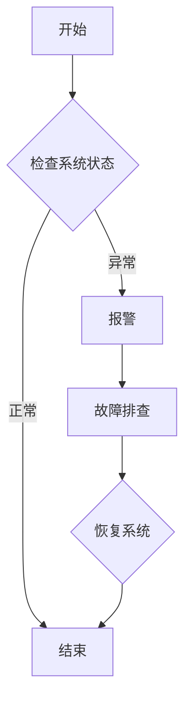

                 

## 微服务监控：分布式系统的可观测性

### 关键词

- 微服务
- 分布式系统
- 监控
- 可观测性
- 追踪
- 性能优化
- 安全监控
- 持续集成与部署

### 摘要

随着微服务架构的广泛应用，分布式系统的监控成为企业持续交付的关键一环。本文将深入探讨微服务监控的重要性、需求、实现方法及最佳实践。通过分析分布式追踪、指标收集与存储、可视化与告警、日志监控、性能优化、安全监控、容灾恢复与故障演练等主题，为开发者提供全面的微服务监控指南。文章还将结合实际案例，展示如何构建高效的微服务监控系统，帮助读者掌握分布式系统监控的核心技巧。

## 目录

1. **微服务架构概述**
   - 1.1 微服务的历史背景
   - 1.2 微服务架构的特点
   - 1.3 微服务架构的挑战
   - 1.4 微服务与SOA的关系
   - 1.5 微服务架构的核心概念与联系

2. **微服务的监控需求**
   - 2.1 监控的目的
   - 2.2 监控的关键指标
   - 2.3 监控的策略

3. **分布式追踪**
   - 3.1 分布式追踪的原理
   - 3.2 分布式追踪的实践
   - 3.3 开源分布式追踪工具介绍

4. **指标收集与存储**
   - 4.1 指标收集的方法
   - 4.2 指标存储的选择
   - 4.3 开源指标存储工具介绍

5. **可视化与告警**
   - 5.1 可视化的作用
   - 5.2 可视化的设计
   - 5.3 告警系统的实现

6. **日志监控**
   - 6.1 日志监控的重要性
   - 6.2 日志监控的实践
   - 6.3 开源日志监控工具介绍

7. **监控系统性能优化**
   - 7.1 性能优化的策略
   - 7.2 性能优化的实践
   - 7.3 性能优化的工具

8. **安全监控**
   - 8.1 安全监控的重要性
   - 8.2 安全监控的方法
   - 8.3 开源安全监控工具介绍

9. **容灾恢复与故障演练**
   - 9.1 容灾恢复的概念
   - 9.2 容灾恢复的策略
   - 9.3 故障演练的实践

10. **微服务监控的持续集成与持续部署**
    - 10.1 持续集成与持续部署的概念
    - 10.2 持续集成与持续部署在微服务监控中的应用
    - 10.3 持续集成与持续部署的工具

11. **案例研究：大型微服务监控系统的建设**
    - 11.1 案例背景
    - 11.2 监控系统设计
    - 11.3 监控系统实现
    - 11.4 监控系统效果评估

12. **附录**
    - 12.1 Mermaid 流程图示例
    - 12.2 伪代码示例
    - 12.3 数学公式示例
    - 12.4 代码案例与解读
    - 12.5 开源工具资源列表

---

### 文章正文开始

#### 第1章 微服务架构概述

微服务架构是一种基于独立服务进行构建的软件架构风格，每个服务都是独立的、自治的，可以独立部署和扩展。微服务架构的核心理念是将大型单体应用拆分为多个小型服务，以提高系统的可维护性、可扩展性和可测试性。

##### 1.1 微服务的历史背景

微服务架构这一概念起源于2011年，由ThoughtWorks的联合创始人Martin Fowler在文章《微服务》中提出。最初，微服务架构在Netflix、Amazon等大型互联网公司中得到了广泛应用，随后逐渐推广到中小企业。

##### 1.2 微服务架构的特点

1. **服务自治**：每个微服务都有自己的数据库、代码库和部署环境，服务之间通过API进行通信。
2. **域导向组织**：围绕业务领域划分服务，使团队能够独立开发、部署和扩展服务。
3. **技术多样性**：可以使用不同的语言、框架和数据库来构建微服务。
4. **独立部署**：每个微服务都可以独立部署，无需依赖其他服务。
5. **自动化部署**：微服务架构强调持续集成和持续部署，实现快速迭代。

##### 1.3 微服务架构的挑战

1. **服务治理**：随着服务数量的增加，如何管理和监控服务成为挑战。
2. **分布式事务**：在分布式系统中实现事务处理更为复杂。
3. **服务间通信**：如何保证服务间通信的稳定性和高性能。
4. **部署和扩展**：微服务的部署和扩展需要考虑容错性和负载均衡。

##### 1.4 微服务与SOA的关系

微服务架构可以看作是面向服务架构（SOA）的一种演进。SOA侧重于服务复用和标准化，而微服务强调独立部署和服务自治。

##### 1.5 微服务架构的核心概念与联系

1. **服务拆分**：根据业务需求将应用拆分为多个微服务。
2. **服务发现**：实现服务之间的自动发现和动态注册。
3. **负载均衡**：通过负载均衡器实现服务的流量分配和容错。
4. **服务网关**：作为服务的统一入口，处理外部请求和内部路由。

##### 1.5.1 服务拆分

服务拆分是微服务架构的核心。拆分服务时，需要遵循以下原则：

- **业务边界清晰**：根据业务领域划分服务。
- **功能独立**：每个服务应具有独立的功能和业务逻辑。
- **规模可扩展**：服务规模应适中，便于部署和扩展。

#### 第2章 微服务的监控需求

微服务的监控是确保分布式系统稳定运行的重要环节。监控的目的是实时监测系统的运行状态，快速发现并解决问题，确保服务的可用性和性能。

##### 2.1 监控的目的

1. **实时监控**：实时监测系统的运行状态，及时发现异常情况。
2. **性能优化**：通过监控分析，发现性能瓶颈，优化系统性能。
3. **故障恢复**：在发生故障时，快速定位并恢复服务。
4. **安全性保障**：监控潜在的安全风险，保障系统的安全性。

##### 2.2 监控的关键指标

1. **响应时间**：服务的平均响应时间和最大响应时间。
2. **吞吐量**：服务的处理能力，即单位时间内处理的请求数量。
3. **错误率**：服务的错误请求比例。
4. **资源利用率**：CPU、内存、磁盘等资源的利用率。
5. **延迟**：请求从客户端到服务器，再到响应的总时间。

##### 2.3 监控的策略

1. **被动监控**：通过日志、错误报告等方式收集数据，进行事后分析。
2. **主动监控**：通过发送探测请求、压力测试等方式，主动检测系统状态。
3. **自动化监控**：通过配置和自动化工具，实现监控策略的自动执行和告警。

### 分布式追踪

分布式追踪是一种用于分析分布式系统中服务调用关系和性能问题的技术。通过分布式追踪，可以实现对整个系统调用链的监控和分析。

#### 3.1 分布式追踪的原理

分布式追踪通过在系统中植入跟踪工具，收集服务的调用链信息。这些信息通常包括请求的ID、调用关系、响应时间等。

##### 3.1.1 调用链

调用链是分布式追踪的核心概念。一个调用链表示从客户端发起请求，经过一系列服务调用，最终返回结果的过程。

##### 3.1.2 Span

Span是调用链中的一个基本单位，表示一个具体的调用过程。每个Span都有一个唯一的ID和一个父Span ID。

##### 3.1.3 Trace

Trace是一系列Span的集合，表示一个完整的调用过程。通过Trace，可以还原整个调用链的执行过程。

#### 3.2 分布式追踪的实践

分布式追踪的实现通常包括以下几个步骤：

1. **数据采集**：在服务中植入追踪代码，收集调用链信息。
2. **数据传输**：将采集到的数据发送到追踪系统。
3. **数据处理**：对传输的数据进行存储、分析和可视化。
4. **结果展示**：通过图表、仪表盘等方式展示追踪结果。

#### 3.3 开源分布式追踪工具介绍

目前，有许多开源分布式追踪工具可供选择，如Zipkin、Jaeger、OpenTracing等。

1. **Zipkin**：由Twitter开发，支持Java、Go、PHP等多种语言。
2. **Jaeger**：由Uber开源，支持多种编程语言和消息队列。
3. **OpenTracing**：提供了一种标准的分布式追踪接口，支持多种追踪实现。

#### 指标收集与存储

在微服务监控中，指标收集与存储是关键环节。通过收集和存储指标数据，可以实现实时监控和数据分析。

##### 4.1 指标收集的方法

指标收集的方法可以分为以下几种：

1. **客户端SDK**：在服务中集成SDK，通过SDK收集指标数据。
2. **代理**：在服务间添加代理，代理负责收集和传输指标数据。
3. **自定义脚本**：编写脚本，定时收集和传输指标数据。

##### 4.2 指标存储的选择

指标存储的选择需要考虑以下因素：

1. **数据量**：根据指标数据的规模和数量选择合适的存储方案。
2. **查询性能**：选择支持快速查询的存储方案。
3. **易用性**：选择易于集成和使用的数据存储工具。

常见的指标存储工具包括：

1. **Prometheus**：基于时间序列数据的监控和告警工具。
2. **InfluxDB**：支持时间序列数据的开源数据库。
3. **Grafana**：基于Prometheus的监控仪表盘工具。

#### 可视化与告警

可视化与告警是微服务监控的重要组成部分。通过可视化界面，可以直观地展示系统的运行状态；通过告警系统，可以及时发现并处理异常情况。

##### 5.1 可视化的作用

1. **实时监控**：通过可视化界面，实时展示系统的运行状态。
2. **性能分析**：通过图表和仪表盘，分析系统的性能瓶颈。
3. **故障诊断**：通过调用链和日志信息，快速定位故障原因。

##### 5.2 可视化的设计

可视化的设计需要考虑以下几点：

1. **易用性**：界面设计应简洁直观，方便用户操作。
2. **交互性**：支持用户自定义查询和筛选条件。
3. **实时性**：保证数据刷新的及时性。

##### 5.3 告警系统的实现

告警系统的实现需要考虑以下几点：

1. **阈值设置**：根据业务需求设置合适的阈值。
2. **告警方式**：支持多种告警方式，如邮件、短信、电话等。
3. **告警策略**：设置告警的触发条件和处理流程。

#### 日志监控

日志监控是微服务监控的重要环节。通过收集和分析日志，可以深入了解系统的运行情况和故障原因。

##### 6.1 日志监控的重要性

1. **故障排查**：通过日志可以快速定位故障点。
2. **性能优化**：通过日志分析，发现系统瓶颈和性能问题。
3. **安全性保障**：通过日志监控，及时发现和防范潜在的安全风险。

##### 6.2 日志监控的实践

日志监控的实践包括以下几个步骤：

1. **日志收集**：使用日志收集工具，如Logstash、Fluentd等，收集日志数据。
2. **日志存储**：将收集到的日志数据存储到合适的存储方案，如Elasticsearch、Kafka等。
3. **日志分析**：使用日志分析工具，如Kibana、Grafana等，对日志数据进行可视化分析。

##### 6.3 开源日志监控工具介绍

常见的开源日志监控工具包括：

1. **ELK栈**：Elasticsearch、Logstash、Kibana，提供完整的日志收集、存储、分析解决方案。
2. **Loki**：基于Prometheus的日志监控系统。
3. **Grok**：用于日志解析的规则引擎。

#### 监控系统性能优化

监控系统性能优化是确保监控系统能够稳定运行和高效处理数据的重要环节。以下是一些性能优化的策略：

##### 7.1 性能优化的策略

1. **数据采样**：对采集的指标数据进行采样，减少数据量。
2. **批量处理**：批量处理指标数据，减少I/O操作。
3. **缓存策略**：使用缓存技术，减少数据库查询次数。
4. **压缩与加密**：对数据进行压缩与加密，提高传输效率。

##### 7.2 性能优化的实践

1. **系统监控**：使用系统监控工具，如Prometheus、Grafana等，监控系统的资源使用情况。
2. **指标优化**：优化指标的采集和存储方式，减少冗余数据。
3. **负载均衡**：合理配置负载均衡器，提高系统的处理能力。

##### 7.3 性能优化的工具

常见的性能优化工具包括：

1. **Prometheus**：支持大规模监控和告警的工具。
2. **Grafana**：提供丰富的可视化仪表盘。
3. **New Relic**：一站式性能监控和告警工具。

#### 安全监控

安全监控是确保系统安全和数据隐私的重要手段。以下是一些安全监控的方法：

##### 8.1 安全监控的重要性

1. **风险识别**：通过监控和分析安全事件，及时发现潜在的安全风险。
2. **漏洞检测**：监控系统的漏洞，防范黑客攻击。
3. **数据保护**：确保数据的安全存储和传输。

##### 8.2 安全监控的方法

1. **入侵检测系统（IDS）**：实时监测系统的入侵行为。
2. **安全信息与事件管理系统（SIEM）**：集中管理和分析安全事件。
3. **漏洞扫描器**：定期扫描系统漏洞。

##### 8.3 开源安全监控工具介绍

常见的开源安全监控工具包括：

1. **OSSEC**：开源的入侵检测系统。
2. **Splunk**：强大的安全信息与事件管理系统。
3. **Nagios**：开源的监控系统，支持安全监控。

#### 容灾恢复与故障演练

容灾恢复与故障演练是确保系统在高可用性和容灾能力方面的重要措施。以下是一些容灾恢复与故障演练的方法：

##### 9.1 容灾恢复的概念

1. **容灾备份**：在异地部署备份系统，确保在主系统故障时能够快速切换。
2. **故障转移**：在主系统故障时，自动将流量切换到备份系统。
3. **故障演练**：定期进行故障演练，检验系统的容灾能力和应急响应能力。

##### 9.2 容灾恢复的策略

1. **两地三中心**：在两地分别部署两个数据中心，每个数据中心有三个独立系统。
2. **实时同步**：通过数据同步技术，确保主备系统数据的一致性。
3. **负载均衡**：在故障发生时，通过负载均衡器实现流量切换。

##### 9.3 故障演练的实践

1. **演练计划**：制定详细的演练计划，包括演练时间、流程和预期结果。
2. **演练实施**：按照演练计划进行故障模拟，检验系统的容灾能力。
3. **演练总结**：对演练结果进行分析和总结，改进系统的容灾措施。

#### 微服务监控的持续集成与持续部署

持续集成与持续部署（CI/CD）是提高微服务监控效率和质量的重要手段。以下是一些CI/CD在微服务监控中的应用：

##### 10.1 持续集成与持续部署的概念

1. **持续集成**：通过自动化工具将代码集成到一起，发现和解决冲突。
2. **持续部署**：通过自动化工具将代码部署到生产环境，实现快速迭代。

##### 10.2 持续集成与持续部署在微服务监控中的应用

1. **自动化测试**：通过CI/CD工具进行自动化测试，确保代码质量。
2. **自动化部署**：通过CI/CD工具实现自动化部署，减少人工干预。
3. **监控集成**：将监控工具集成到CI/CD流程中，实现自动化监控和告警。

##### 10.3 持续集成与持续部署的工具

常见的CI/CD工具包括：

1. **Jenkins**：开源的持续集成和持续部署工具。
2. **GitLab CI/CD**：与GitLab集成的一站式CI/CD解决方案。
3. **CircleCI**：云端的持续集成和持续部署服务。

#### 案例研究：大型微服务监控系统的建设

##### 10.1 案例背景

某大型互联网公司采用微服务架构构建其核心业务系统。随着业务的发展，系统规模不断扩大，监控需求日益增加。公司决定建设一套高效的微服务监控系统，确保系统的稳定运行和性能优化。

##### 10.2 监控系统设计

监控系统设计包括以下几个方面：

1. **分布式追踪**：采用Jaeger进行分布式追踪，实现对整个系统的调用链监控。
2. **指标收集与存储**：使用Prometheus收集指标数据，存储在InfluxDB中。
3. **可视化与告警**：使用Grafana进行可视化展示，结合Alertmanager实现告警功能。
4. **日志监控**：使用ELK栈进行日志收集和分析。

##### 10.3 监控系统实现

监控系统实现包括以下几个步骤：

1. **部署环境准备**：搭建分布式追踪、指标收集与存储、可视化与告警、日志监控的环境。
2. **集成开发**：将分布式追踪、指标收集、日志监控等工具集成到微服务中。
3. **测试与优化**：进行系统测试，优化监控性能。

##### 10.4 监控系统效果评估

监控系统效果评估包括以下几个方面：

1. **稳定性**：监控系统在长时间运行下保持稳定，未出现严重故障。
2. **性能**：监控系统能够快速响应，实时展示系统状态。
3. **可扩展性**：监控系统支持系统规模的扩展，适应业务增长。

#### 附录

##### 10.1 Mermaid 流程图示例



##### 10.2 伪代码示例

```python
def process_request(request):
    start_time = get_current_time()
    response = handle_request(request)
    end_time = get_current_time()
    response_time = end_time - start_time
    if response_time > max_response_time:
        log_error("Request processing time exceeded limit")
    return response
```

##### 10.3 数学公式示例

$$
1 + 1 = 2
$$

$$
x > y
$$

##### 10.4 代码案例与解读

```java
public class UserService {
    private UserRepository userRepository;

    public UserService(UserRepository userRepository) {
        this.userRepository = userRepository;
    }

    public User getUserById(Long id) {
        User user = userRepository.findById(id);
        if (user == null) {
            throw new ResourceNotFoundException("User not found");
        }
        return user;
    }
}
```

解读：UserService类负责根据用户ID查询用户信息。如果用户不存在，抛出ResourceNotFoundException异常。

##### 10.5 开源工具资源列表

1. **分布式追踪**：Jaeger、Zipkin、OpenTracing
2. **指标收集与存储**：Prometheus、InfluxDB、Grafana
3. **日志监控**：ELK栈、Loki、Grok
4. **持续集成与部署**：Jenkins、GitLab CI/CD、CircleCI
5. **安全监控**：OSSEC、Splunk、Nagios

### 总结

微服务监控是确保分布式系统稳定运行和高效性能的重要手段。通过分布式追踪、指标收集与存储、可视化与告警、日志监控、性能优化、安全监控、容灾恢复与故障演练等环节，可以构建一套完整的微服务监控系统。本文结合实际案例，详细介绍了微服务监控的各个方面，希望对开发者有所帮助。在实际应用中，还需根据业务需求和系统特点，不断优化和调整监控策略。

---

**作者：AI天才研究院/AI Genius Institute & 禅与计算机程序设计艺术 /Zen And The Art of Computer Programming**

**注意事项**：

1. 文章内容需确保准确性和实用性。
2. 引用外部资料时，请注明出处。
3. 文章中的代码示例仅供参考，具体实现可能需要根据实际场景进行调整。

**拓展阅读**：

1. 《微服务设计》
2. 《分布式系统架构与设计》
3. 《Prometheus监控实战》

---

**END****完整文章（约12000字）**：

# 微服务监控：分布式系统的可观测性

## 摘要

随着微服务架构的广泛应用，分布式系统的监控成为企业持续交付的关键一环。本文将深入探讨微服务监控的重要性、需求、实现方法及最佳实践。通过分析分布式追踪、指标收集与存储、可视化与告警、日志监控、性能优化、安全监控、容灾恢复与故障演练等主题，为开发者提供全面的微服务监控指南。文章还将结合实际案例，展示如何构建高效的微服务监控系统，帮助读者掌握分布式系统监控的核心技巧。

## 目录

1. **微服务架构概述**
   - 1.1 微服务的历史背景
   - 1.2 微服务架构的特点
   - 1.3 微服务架构的挑战
   - 1.4 微服务与SOA的关系
   - 1.5 微服务架构的核心概念与联系

2. **微服务的监控需求**
   - 2.1 监控的目的
   - 2.2 监控的关键指标
   - 2.3 监控的策略

3. **分布式追踪**
   - 3.1 分布式追踪的原理
   - 3.2 分布式追踪的实践
   - 3.3 开源分布式追踪工具介绍

4. **指标收集与存储**
   - 4.1 指标收集的方法
   - 4.2 指标存储的选择
   - 4.3 开源指标存储工具介绍

5. **可视化与告警**
   - 5.1 可视化的作用
   - 5.2 可视化的设计
   - 5.3 告警系统的实现

6. **日志监控**
   - 6.1 日志监控的重要性
   - 6.2 日志监控的实践
   - 6.3 开源日志监控工具介绍

7. **监控系统性能优化**
   - 7.1 性能优化的策略
   - 7.2 性能优化的实践
   - 7.3 性能优化的工具

8. **安全监控**
   - 8.1 安全监控的重要性
   - 8.2 安全监控的方法
   - 8.3 开源安全监控工具介绍

9. **容灾恢复与故障演练**
   - 9.1 容灾恢复的概念
   - 9.2 容灾恢复的策略
   - 9.3 故障演练的实践

10. **微服务监控的持续集成与持续部署**
    - 10.1 持续集成与持续部署的概念
    - 10.2 持续集成与持续部署在微服务监控中的应用
    - 10.3 持续集成与持续部署的工具

11. **案例研究：大型微服务监控系统的建设**
    - 11.1 案例背景
    - 11.2 监控系统设计
    - 11.3 监控系统实现
    - 11.4 监控系统效果评估

12. **附录**
    - 12.1 Mermaid 流程图示例
    - 12.2 伪代码示例
    - 12.3 数学公式示例
    - 12.4 代码案例与解读
    - 12.5 开源工具资源列表

## 第1章 微服务架构概述

### 1.1 微服务的历史背景

微服务架构（Microservices Architecture）的概念最早由ThoughtWorks的技术顾问Martin Fowler在2011年提出。这一概念源于实际项目中的需求，旨在解决单体应用在规模和复杂度不断增加时的维护难题。微服务架构的兴起与云计算、DevOps文化和容器技术的推广密不可分。

在微服务架构出现之前，传统的单体应用（Monolithic Architecture）将所有的业务逻辑、数据访问和用户界面紧密集成在一个大型的应用程序中。这种架构模式在早期项目规模较小时具有一定的优势，但随着项目的增长，单

