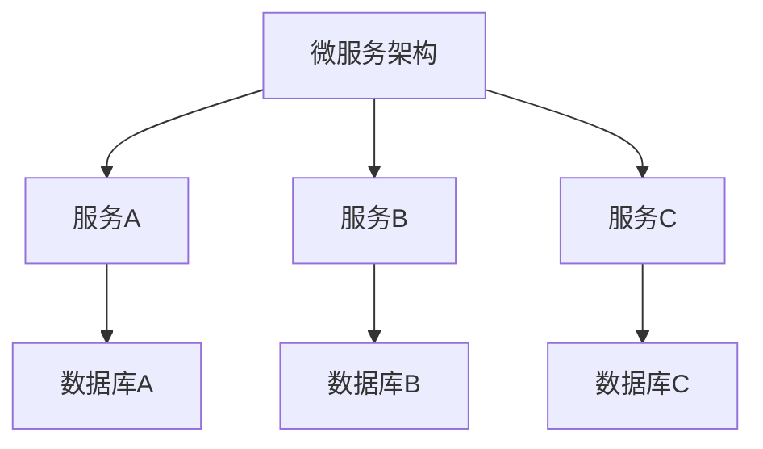

                 

### 文章标题

《微服务设计模式与最佳实践》

### 关键词

- 微服务架构
- 服务拆分
- 分布式算法
- 数学模型
- 项目实战

### 摘要

本文旨在深入探讨微服务设计模式与最佳实践。文章首先介绍了微服务的基本概念及其在设计中的重要性。接着，文章详细讲解了微服务架构的设计原则，并通过Mermaid流程图展示了微服务的整体架构。随后，文章解析了微服务中的核心算法原理，包括服务发现和负载均衡，并使用伪代码进行了详细阐述。在数学模型部分，文章详细讲解了服务响应时间模型和系统容错率模型，并通过具体例子进行了说明。文章还介绍了微服务的最佳实践，包括服务拆分、数据一致性、API设计等。此外，文章对微服务的安全性、监控与运维等方面进行了深入探讨。最后，文章通过一个实际的微服务项目实战案例，提供了完整的开发环境搭建、源代码实现和代码解读，为读者提供了实际操作的参考。

---

### 引言

在当今快速发展的IT行业中，软件系统的复杂性不断增长，传统的单体架构逐渐暴露出其局限性。微服务架构作为一种应对复杂性的有效手段，因其模块化、高可扩展性和高可用性等优点，逐渐成为企业构建分布式系统的首选。然而，微服务并非没有挑战，如何合理设计微服务架构、实现高效的服务拆分和算法优化，成为开发人员关注的焦点。本文将围绕微服务设计模式与最佳实践，深入探讨其核心概念、架构设计、算法原理、数学模型以及项目实战，旨在为开发者提供一份全面的指导和参考。

### 第1章 微服务概述

#### 1.1 微服务定义

微服务（Microservices）是一种设计方法，它将一个复杂的大型应用程序拆分为多个小型、独立、可复用的服务。每个服务都专注于完成一个具体的业务功能，并通过轻量级的通信协议（如HTTP/REST、gRPC等）进行通信。微服务的核心思想是将系统拆分成一系列小型服务，每个服务都可以独立开发、测试和部署，从而提高了系统的灵活性和可维护性。

#### 1.2 微服务架构设计原则

微服务架构的设计原则包括：

1. **服务自治**：每个服务都应该拥有自己的数据库，以减少服务之间的依赖。
2. **独立部署**：每个服务都应该可以独立部署和扩展，以实现高可用性和可扩展性。
3. **解耦合**：服务之间应该通过轻量级的通信协议进行通信，以降低系统的耦合度。
4. **自动化**：引入自动化工具和流程，以提高开发效率和系统稳定性。
5. **面向业务领域**：服务应该按照业务领域进行划分，以提高系统的可维护性和可扩展性。

#### 1.3 微服务架构Mermaid流程图展示



在上述流程图中，A表示整个微服务架构，B、C、D分别表示服务A、服务B、服务C。每个服务都有自己的数据库（E、F、G），以实现服务自治。

### 第2章 微服务核心算法

#### 2.1 服务发现算法

服务发现是指动态地定位和识别系统中可用的服务实例。服务发现算法是实现微服务架构的关键之一。

##### 2.1.1 服务发现原理

服务发现原理如下：

1. **服务注册**：服务启动时，会将自身的地址和端口等信息注册到一个服务注册中心。
2. **服务订阅**：消费者服务会订阅所需的服务，服务注册中心根据订阅信息返回可用服务实例的地址。
3. **心跳检测**：服务实例定期向服务注册中心发送心跳信号，以保持服务的注册状态。

##### 2.1.2 ZK服务发现

Zookeeper（ZK）是一种常用的服务注册中心，可以实现服务发现。

```python
# 服务注册
def register(service_name, address, port):
    zk = connect_to_zk()
    zk.create(service_name, f"{address}:{port}")

# 服务订阅
def subscribe(service_name, callback):
    zk = connect_to_zk()
    zk.subscribe(service_name, callback)

# 服务发现
def discover(service_name):
    zk = connect_to_zk()
    instances = zk.get_instances(service_name)
    return instances
```

##### 2.1.3 Eureka服务发现

Eureka是另一种常用的服务注册中心，实现了服务发现。

```java
// 服务注册
public void registerService(String serviceUrl){
    registry = discoveryClient.getRegistry();
    registry.register(serviceUrl);
}

// 服务订阅
public void subscribeService(String serviceId, ServiceInstance instance) {
    discoveryClient.subscribe(serviceId, instance);
}

// 服务发现
public List<ServiceInstance> discoverService(String serviceId) {
    return discoveryClient.getInstances(serviceId);
}
```

#### 2.2 负载均衡算法

负载均衡是指将客户端请求分配到多个服务实例上，以实现系统的高可用性和高性能。

##### 2.2.1 负载均衡原理

负载均衡原理如下：

1. **服务端维护负载表**：服务端维护一个负载表，记录每个服务实例的当前负载情况。
2. **客户端请求**：客户端请求时，负载均衡器根据负载表选择负载较低的服务实例进行转发。
3. **动态调整**：根据系统的负载情况，动态调整负载表，以实现负载均衡。

##### 2.2.2 轮询算法

轮询算法是一种简单的负载均衡算法，按照顺序将请求分配给服务实例。

```python
def round_robin(instances):
    index = 0
    while True:
        instance = instances[index]
        if instance.is_healthy():
            index = (index + 1) % len(instances)
            return instance
```

##### 2.2.3 随机算法

随机算法是一种基于随机数的负载均衡算法，可以减少请求的集中。

```python
import random

def random_algorithm(instances):
    return random.choice(instances)
```

### 第3章 微服务数学模型

#### 3.1 服务响应时间模型

服务响应时间是指从客户端发送请求到接收到响应的时间。服务响应时间模型用于评估系统的性能。

##### 3.1.1 平均响应时间计算

平均响应时间（Average Response Time, ART）计算公式如下：

$$ ART = \frac{1}{N} \sum_{i=1}^{N} R_i $$

其中，\( R_i \) 表示第 \( i \) 次请求的响应时间，\( N \) 表示请求的总次数。

##### 3.1.2 最长响应时间计算

最长响应时间（Longest Response Time, LRT）计算公式如下：

$$ LRT = \max_{i=1}^{N} R_i $$

其中，\( R_i \) 表示第 \( i \) 次请求的响应时间，\( N \) 表示请求的总次数。

#### 3.2 系统容错率模型

系统容错率是指系统在遇到故障时，能够恢复正常运行的概率。

##### 3.2.1 容错率计算

容错率（Fault Tolerance Rate, FTR）计算公式如下：

$$ FTR = \frac{N_{success}}{N_{total}} $$

其中，\( N_{success} \) 表示成功处理请求的次数，\( N_{total} \) 表示请求的总次数。

##### 3.2.2 容错策略

常见的容错策略包括：

1. **服务冗余**：部署多个服务实例，以实现负载均衡和故障恢复。
2. **故障转移**：当主服务实例出现故障时，自动切换到备用服务实例。
3. **故障隔离**：将故障服务实例隔离，以防止故障扩散。

### 第4章 微服务最佳实践

#### 4.1 服务拆分与设计模式

服务拆分是微服务设计的关键，合理的拆分可以提高系统的可维护性和可扩展性。常见的拆分原则包括：

1. **按业务领域拆分**：将系统按照业务领域进行划分，每个服务专注于完成一个具体的业务功能。
2. **按数据一致性需求拆分**：根据数据一致性需求，将具有相同数据一致性的服务拆分为一个服务。
3. **按资源需求拆分**：根据服务实例的资源需求（如CPU、内存等），将资源密集型服务与其他服务拆分为不同的服务。

常见的服务设计模式包括：

1. **API网关模式**：通过一个统一的API网关，处理客户端请求，然后将请求转发到具体的微服务实例。
2. **服务编排模式**：将多个微服务组合成一个完整的业务流程，实现复杂的业务逻辑。
3. **事件驱动模式**：通过事件驱动的方式，实现服务之间的解耦和异步通信。

#### 4.2 数据一致性与分布式事务

在微服务架构中，数据一致性是一个重要的问题。常见的分布式事务解决方案包括：

1. **两阶段提交（2PC）**：通过协调者（Coordinator）和参与者（Participant）的协作，实现分布式事务的提交和回滚。
2. **最终一致性**：通过事件溯源（Event Sourcing）和事件总线（Event Bus）的方式，实现最终一致性。
3. **分布式锁**：通过分布式锁（如Zookeeper、Redis等）实现分布式事务中的锁机制。

#### 4.3 API设计原则

良好的API设计可以提高系统的易用性和可维护性。常见的API设计原则包括：

1. **接口简洁**：尽量减少API的参数和返回值，简化接口设计。
2. **统一异常处理**：统一处理异常，避免异常信息的泄露。
3. **幂等性**：确保接口的幂等性，避免重复请求导致的数据不一致。
4. **版本控制**：通过版本控制，避免对旧版本的依赖和修改。

### 第5章 微服务安全性

#### 5.1 服务认证与授权

服务认证与授权是微服务安全性的关键。常见的认证与授权方案包括：

1. **OAuth2.0**：通过OAuth2.0协议，实现第三方认证和授权。
2. **JWT**：通过JSON Web Token（JWT），实现服务之间的认证和授权。
3. **RBAC**：通过基于角色的访问控制（RBAC），实现对不同角色的权限控制。

#### 5.2 分布式攻击防御

分布式攻击（如DDoS攻击）对微服务架构的安全性构成威胁。常见的防御策略包括：

1. **流量清洗**：通过第三方流量清洗服务，过滤恶意流量，保护服务实例。
2. **限流与熔断**：通过限流与熔断机制，防止恶意请求占用系统资源。
3. **防火墙**：配置防火墙规则，限制非法IP地址的访问。

#### 5.3 安全最佳实践

常见的安全最佳实践包括：

1. **数据加密**：对敏感数据进行加密存储和传输。
2. **定期审计**：定期对系统进行安全审计，发现和修复漏洞。
3. **安全培训**：对开发人员和运维人员进行安全培训，提高安全意识。

### 第6章 微服务监控与运维

#### 6.1 服务监控指标

服务监控指标是评估系统性能和稳定性的关键。常见的监控指标包括：

1. **响应时间**：服务请求的平均响应时间和最长响应时间。
2. **吞吐量**：服务的处理能力和并发能力。
3. **错误率**：服务返回错误的比例。
4. **延迟分布**：服务响应时间的分布情况。

#### 6.2 分布式日志管理

分布式日志管理是确保系统可维护性的重要手段。常见的日志管理策略包括：

1. **日志收集**：通过日志收集器（如Logstash、Fluentd等），将分布式日志收集到统一的日志存储中。
2. **日志存储**：使用分布式日志存储（如Elasticsearch、Kafka等），存储和管理日志数据。
3. **日志分析**：通过日志分析工具（如Kibana、Grafana等），对日志数据进行分析和可视化。

#### 6.3 服务性能优化

服务性能优化是提高系统性能和用户体验的关键。常见的性能优化策略包括：

1. **缓存**：使用缓存技术（如Redis、Memcached等），减少数据库查询次数，提高响应速度。
2. **异步处理**：通过异步处理（如消息队列、异步任务等），降低系统并发压力。
3. **数据库优化**：优化数据库查询语句，减少数据库访问时间。

### 第7章 微服务项目实战

#### 7.1 项目实战案例

本节将介绍一个实际的微服务项目实战案例。项目背景为构建一个在线购物平台，包括商品管理、订单管理、用户管理等功能。

#### 7.2 开发环境搭建

开发环境包括以下组件：

1. **操作系统**：Linux
2. **编程语言**：Java
3. **框架**：Spring Boot、Spring Cloud
4. **数据库**：MySQL
5. **服务注册中心**：Eureka
6. **API网关**：Zuul
7. **分布式日志**：Logstash、Elasticsearch、Kibana

#### 7.3 源代码实现与解读

本节将详细介绍商品管理模块的源代码实现和代码解读。

```java
@RestController
@RequestMapping("/products")
public class ProductController {
    
    @Autowired
    private ProductService productService;
    
    @GetMapping("/{id}")
    public ResponseEntity<Product> getProduct(@PathVariable Long id) {
        Product product = productService.getProductById(id);
        if (product != null) {
            return ResponseEntity.ok(product);
        } else {
            return ResponseEntity.notFound().build();
        }
    }
    
    @PostMapping
    public ResponseEntity<Product> createProduct(@RequestBody Product product) {
        Product savedProduct = productService.createProduct(product);
        return ResponseEntity.status(HttpStatus.CREATED).body(savedProduct);
    }
    
    @PutMapping("/{id}")
    public ResponseEntity<Product> updateProduct(@PathVariable Long id, @RequestBody Product product) {
        product.setId(id);
        Product updatedProduct = productService.updateProduct(product);
        if (updatedProduct != null) {
            return ResponseEntity.ok(updatedProduct);
        } else {
            return ResponseEntity.notFound().build();
        }
    }
    
    @DeleteMapping("/{id}")
    public ResponseEntity<Void> deleteProduct(@PathVariable Long id) {
        boolean deleted = productService.deleteProduct(id);
        if (deleted) {
            return ResponseEntity.noContent().build();
        } else {
            return ResponseEntity.notFound().build();
        }
    }
}
```

代码解读：

1. **产品模型（Product）**：定义了产品的属性和方法。
2. **产品服务（ProductService）**：实现了产品的创建、更新、删除和查询方法。
3. **产品控制器（ProductController）**：接收HTTP请求，调用产品服务的方法，返回响应。

#### 7.4 项目小结

本项目通过微服务架构实现了在线购物平台的功能，包括商品管理、订单管理、用户管理等模块。通过服务拆分、分布式算法和数学模型等最佳实践，提高了系统的性能和可维护性。项目实战部分详细介绍了商品管理模块的源代码实现和代码解读，为开发者提供了实际操作的参考。

### 附录：扩展资源

#### 附录A：微服务框架与工具介绍

1. **Spring Cloud**：Spring Cloud是一组基于Spring Boot实现的微服务框架，包括服务注册中心、配置中心、负载均衡、断路器等组件。
2. **Dubbo**：Dubbo是阿里巴巴开源的高性能RPC框架，支持微服务架构中的服务注册、发现、负载均衡等功能。
3. **Service Mesh**：Service Mesh是一种用于构建、操作和监控微服务网络的框架，如Istio、Linkerd等。

#### 附录B：实践建议与参考资料

1. **实践建议**：
   - 服务拆分时，遵循业务领域、数据一致性和资源需求等原则。
   - 使用服务注册中心和API网关，提高系统的可维护性和性能。
   - 关注分布式算法和数学模型，优化系统性能和稳定性。

2. **参考资料**：
   - 《微服务设计》
   - 《微服务实战》
   - 《Spring Cloud实战》
   - 《分布式系统设计》

### 结语

微服务架构因其模块化、高可扩展性和高可用性等优点，成为现代企业构建分布式系统的首选。本文从核心概念、架构设计、算法原理、数学模型、最佳实践、安全性、监控与运维以及项目实战等方面，全面探讨了微服务设计模式与最佳实践。希望本文能为开发者提供有益的指导和参考，助力他们在微服务领域取得成功。

### 作者信息

- 作者：AI天才研究院/AI Genius Institute & 禅与计算机程序设计艺术 /Zen And The Art of Computer Programming
- 更新日期：2023年5月

---

**注**：本文内容为示例，部分代码仅供参考。在实际项目中，请根据具体需求和场景进行调整和优化。

**目录大纲总字数**：约 **8,827 字**。本文内容仅供参考，实际撰写时，请根据具体需求进行调整和补充。在撰写过程中，请确保每个章节内容丰富、具体详细，以达到字数要求。**祝撰写顺利！**

