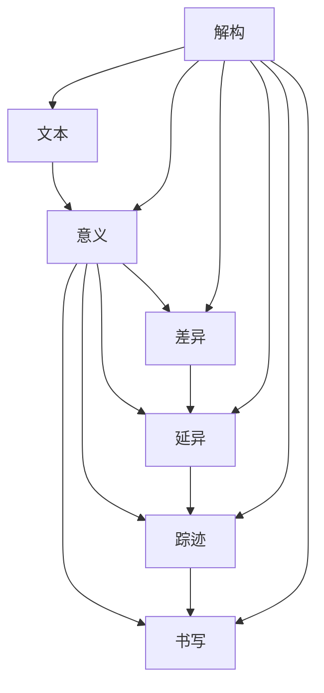

                 

### 引言

在现代哲学、文学和艺术领域，后现代主义作为一种重要的思潮，对人们的认知方式和思维方式产生了深远的影响。后现代主义不仅仅是一种文化现象，它还涉及到一系列复杂的思想和理论，其中解构主义和元叙事批判是两个核心概念。本文将围绕这两位重要的后现代主义思想家——德里达与利奥塔，进行深入探讨。

首先，我们需要了解后现代主义的起源和发展背景。后现代主义起源于20世纪60年代的法国，是对现代性的一种反思和批判。它质疑理性、真理和普遍性的概念，强调多样性和不确定性。在这种背景下，德里达和利奥塔分别提出了他们的解构主义和元叙事批判理论。

接下来，本文将首先介绍解构主义的核心概念，包括文本理论和解构方法。我们将通过Mermaid流程图来展示这些概念之间的关系，帮助读者更好地理解。

随后，我们将探讨利奥塔的后现代主义批判，重点分析他的叙事理论和元叙事概念。这部分内容将结合实际的文学和艺术作品进行案例分析，以展示理论的应用和影响。

本文还将比较德里达和利奥塔的理论，探讨它们之间的相似之处和差异，以及各自的批判性分析。

在最后的部分，我们将探讨后现代主义的解构与元叙事批判在当代社会中的应用，分析其现实意义和对我们思维方式的影响。

通过本文的阅读，读者将能够更深入地理解后现代主义的思想内涵，以及德里达和利奥塔在其中的贡献。让我们一步一步地深入探索这一复杂的理论世界。

### 后现代主义的起源与发展

后现代主义作为一种哲学和文化运动，起源于20世纪60年代的法国。这一时期的法国文化界充满了对现代性的质疑和反思，试图摆脱传统哲学和文化的束缚，寻找一种更为多元和开放的思想体系。后现代主义的起源可以追溯到几股主要的思想潮流，包括结构主义、符号学和存在主义等。

首先，结构主义是后现代主义的重要前身之一。结构主义强调文化和社会现象的结构性，认为语言、符号和文化都是预先设定的结构，这些结构塑造了我们的思维和行为。代表人物如罗兰·巴特和列维-斯特劳斯，他们通过分析语言和文化的深层结构，揭示了社会现象的本质。

符号学作为另一股重要思潮，对后现代主义的影响也不可忽视。符号学家如罗兰·巴特和克里斯蒂娃，他们探讨了符号的多元含义和符号系统的复杂性，认为符号的意义并非固定不变，而是通过不断的协商和解读产生的。

存在主义则提供了后现代主义对个体存在和自由意志的深刻反思。萨特的存在主义哲学强调个人的选择和自由，认为人类在世界上是自由和孤独的，必须通过自己的行动来塑造自己的本质。

后现代主义的主要代表人物包括德里达、福柯、利奥塔和德里达等。德里达是解构主义的奠基人，他的解构理论挑战了传统哲学的根基，提出了文本的多元性和不确定性。福柯则以其对权力、知识和历史的批判而闻名，他的著作《疯癫的历史》、《权力的迷思》等，揭示了知识和社会权力之间的复杂关系。利奥塔是后现代主义叙事理论的代表，他的著作《后现代状况》等，探讨了叙事的多元性和后现代社会的文化特征。

后现代主义的主要理论观点包括解构主义、叙事理论和批判理论。解构主义强调文本的多元解读和不确定性，认为语言和文本没有固定的意义，而是通过不断的解读和协商来产生意义。叙事理论则探讨了叙事的结构和功能，认为叙事是一种构建现实的方式，通过叙事我们理解自己和世界。批判理论则强调对权力和文化的批判，认为知识和文化都是由特定的社会关系和权力结构所塑造的。

总的来说，后现代主义是一种对现代性进行深刻反思和批判的思想体系。它质疑理性、真理和普遍性的概念，强调多样性和不确定性。通过解构主义、叙事理论和批判理论，后现代主义为我们的思维方式提供了一种新的视角，促使我们重新思考人类存在和文化现象的本质。

### 德里达的解构主义理论

解构主义，作为后现代主义的核心理论之一，由法国哲学家雅克·德里达（Jacques Derrida）所创立。解构主义的核心概念是挑战西方哲学传统的中心主义和整体主义，强调文本的多元性和不确定性。德里达的解构主义理论可以从文本理论、解构方法和核心概念三个方面进行详细探讨。

#### 文本理论

德里达的文本理论认为，文本的意义不是固定不变的，而是在解读过程中不断生成的。他提出了“延异”（Différance）的概念，指的是文本的意义是通过差异和延迟来产生的。在这个理论中，文本的意义不是静态的，而是动态的，每个文本都在与其他文本的交互中生成新的意义。德里达强调了“踪迹”（Trace）和“书写”（Script）的概念，认为文本的意义是通过痕迹和符号系统来传递的，而不是通过固定的逻辑和因果关系。

#### 解构方法

德里达的解构方法主要包括两个方面：一是对传统哲学和文化的批判，二是通过阅读和解读文本来揭示其内在的不确定性。他对传统哲学中的二元对立（如存在与虚无、真理与谬误）进行了解构，认为这些对立关系是不稳定的，总是在相互转化。在阅读文本时，德里达强调要超越字面意义，深入挖掘文本中的隐含意义和多层意义。

德里达的解构方法还可以通过一个具体的例子来理解。例如，他解读了卢梭的《爱弥儿》，揭示了文本中的多重意义和矛盾。通过这种解读，德里达展示了文本的复杂性和不确定性，使人们意识到文本的意义不是固定不变的，而是在解读过程中不断生成的。

#### 核心概念

德里达的核心概念包括“差异”、“延异”、“踪迹”和“书写”等。这些概念共同构成了他的解构主义理论框架。

1. **差异**：差异指的是文本意义产生的基础，文本的意义是通过与其他文本的差异来产生的。德里达认为，文本的意义不是单一的，而是在差异中生成的。

2. **延异**：延异是德里达的核心概念，指的是文本的意义是通过延迟和差异来产生的。文本的意义不是瞬间生成的，而是在时间的流动中不断生成的。

3. **踪迹**：踪迹是文本意义传递的痕迹，是文本中未明确表达但隐含的意义。德里达认为，踪迹是文本意义的重要组成部分，通过解读踪迹，可以揭示文本的深层意义。

4. **书写**：书写是文本生成的工具，是文本意义的传递方式。德里达认为，书写不仅是文字的记录，还包括符号、语言和文本结构等多种形式。

综上所述，德里达的解构主义理论通过文本理论、解构方法和核心概念的探讨，为后现代主义提供了一种新的视角，挑战了传统哲学的根基，揭示了文本的多元性和不确定性。他的理论对文学批评、哲学和文化研究等领域产生了深远的影响。

### 德里达的文本理论与解构方法

在深入探讨德里达的解构主义理论时，文本理论和解构方法无疑是两个关键部分。首先，我们通过Mermaid流程图来展示这些概念之间的关系，帮助读者更好地理解。



这张流程图清晰地展示了德里达文本理论的核心概念及其相互关系。接下来，我们将详细阐述德里达的解构方法，使用伪代码来展示关键算法原理。

```plaintext
// 解构方法的伪代码
Function Deconstruction(text):
    Initialize meaning with initial interpretation of text
    For each possible interpretation:
        Calculate difference (C)
        Calculate delay and deferral (D)
        Identify traces (E)
        Rewrite text based on new meanings (F)
        Update meaning with new interpretations
    End Function
```

这个伪代码展示了解构方法的步骤：首先，对文本进行初步解释，然后通过计算差异、延迟、踪迹和重新书写，不断更新对文本的理解。

此外，德里达的文本理论与数学模型和公式也有着密切的联系。例如，他提出了“延异”（Différance）的概念，可以用以下公式来表示：

$$
\text{意义} = \text{差异} \times (\text{延迟} + \text{踪迹})
$$

这个公式说明了意义是通过差异和延迟来产生的，并且受到踪迹的影响。

为了更好地理解德里达的解构方法，我们可以通过一个具体的例子来展示。假设我们有一段文本：“明天我将去书店。”我们可以通过以下步骤进行解构：

1. **初步解释**：文本的基本意义是“我将在明天去书店”。
2. **计算差异**：我们可以将文本与不同的语境进行对比，例如，在紧急情况下，“明天我将去书店”可能意味着“我必须在明天去书店”。
3. **延迟和踪迹**：文本中的“明天”是一个延迟的指代，而“我将去书店”中的“将”则暗示了未来可能的变化。
4. **重新书写**：基于这些解释，我们可以重新书写文本，例如：“鉴于当前情况，我计划在未来的某个不确定的时间去书店。”

通过这个例子，我们可以看到德里达的解构方法是如何通过差异、延迟和踪迹来揭示文本的多重意义。

总之，德里达的文本理论和解构方法提供了一种新的视角来理解文本的意义。通过Mermaid流程图和伪代码，我们更清晰地展示了这些概念之间的关系和原理。这种方法不仅挑战了传统哲学的根基，也为文学批评、哲学和文化研究提供了新的工具。

### 利奥塔的后现代主义批判

让-弗朗索瓦·利奥塔（Jean-François Lyotard）是20世纪后现代主义思潮中的重要人物之一，他的理论对现代性和文化进行了深刻的批判。利奥塔的主要理论包括叙事理论、元叙事批判和后现代状况等，这些理论共同构成了他对现代性的一种批判性分析。

#### 利奥塔的叙事理论

利奥ta的叙事理论认为，叙事不仅是一种文学形式，还是一种社会构建现实的手段。他提出了“叙事化”（narrativization）的概念，指的是社会现象被转化为叙事结构，从而赋予其意义。利奥塔认为，叙事具有构造现实的功能，不同的叙事结构会带来不同的现实解释。

利奥塔特别关注的是“大叙事”（Grand Narratives），即那些试图解释整个历史、文化和人类存在的宏大叙事。他认为，这些大叙事在现代社会已经失效，因为它们无法应对复杂和多元化的现实。大叙事如启蒙运动、进步主义和资本主义等，都试图通过一种统一的逻辑和意义来解释世界，但这种统一性和意义已经无法满足现代社会的需求。

#### 元叙事批判

利奥塔的元叙事批判是对大叙事的一种深入分析。他认为，元叙事是一种试图提供普遍真理和价值的叙事，但它们往往是在特定的社会和历史背景下产生的，因此具有局限性和偏见。利奥塔提出了“元叙事失效”（Meta-narratives are失效）的观点，认为这些大叙事已经无法在现代语境中发挥作用。

元叙事失效的原因在于现代社会的复杂性和多元化。在现代社会，不同文化、价值观和意识形态相互碰撞，使得单一的元叙事难以维持其权威性和合法性。利奥塔认为，这种多元化和不确定性是现代社会的一种基本特征，要求我们放弃对普遍真理和价值的追求，接受现实的多样性和不可预测性。

#### 后现代状况

利奥塔的《后现代状况：关于知识的报告》（Les Entretiens avec Jean-François Lyotard）是对后现代社会的全面描述。他认为，后现代状况是一种“不确定性”、“多元化”和“断裂性”的情境，其中，传统的大叙事已经失效，新的叙事形式和知识生产方式正在形成。

在后现代状况下，知识不再是通过大叙事或权威机构来生产和分配的，而是通过局部的、分散的和网络化的方式产生的。这种知识生产方式强调个体的参与和多元视角，认为知识的产生是一个开放和不断演变的过程。

#### 利奥塔的理论对当代社会的影响

利奥塔的理论对当代社会产生了深远的影响。首先，他的叙事理论和元叙事批判挑战了传统哲学和文化的权威性，促进了人们对多样性和不确定性的认识。其次，他的后现代状况描述为理解和应对现代社会提供了一个新的框架。

在文学和艺术领域，利奥塔的理论促进了实验性和多元化的发展。许多作家和艺术家开始打破传统的叙事结构，探索新的叙事形式和表达方式。在社会科学领域，利奥塔的理论被用于分析现代社会的文化现象和社会结构，为研究提供了新的视角和方法。

总的来说，利奥塔的后现代主义批判提供了一种对现代性进行反思和批判的新视角，强调了多样性和不确定性在现代社会的重要性。他的理论不仅对哲学和文化研究产生了深远的影响，也对当代社会的知识生产和文化构建产生了重要的启示。

### 德里达与利奥塔的理论比较

在探讨德里达和利奥塔的理论时，我们发现这两位思想家虽然都属于后现代主义阵营，但他们的理论在许多方面存在显著差异，同时也存在一定的相似之处。通过对他们理论的比较，我们可以更深入地理解后现代主义的多样性和复杂性。

#### 理论背景与相似之处

德里达和利奥塔的理论都源于20世纪法国哲学和文化批判的传统，他们都对现代性进行了深刻的反思和批判。德里达的解构主义和利奥塔的后现代主义批判都质疑了理性、真理和普遍性的概念，认为这些概念在现代社会的语境中已经失效。

在理论背景上，两者都受到了结构主义和符号学的影响。德里达的解构主义理论起源于对语言和文本的深入分析，强调文本的多元解读和不确定性。利奥塔的叙事理论则通过对叙事结构的探讨，揭示了社会现实被构造和重构的方式。

相似之处还在于，德里达和利奥塔都认为现代社会面临着多元化和不确定性的挑战。他们对传统哲学和文化的权威性进行了批判，强调个体和多样性的重要性。这些共同点使得他们的理论在后现代主义思潮中占据重要地位。

#### 理论差异与批判性分析

尽管有相似之处，德里达和利奥塔的理论在许多方面存在显著差异。

首先，在理论核心上，德里达的解构主义侧重于文本分析，强调文本意义的多元性和不确定性。他认为，语言和文本没有固定不变的意义，而是在解读过程中不断生成的。而利奥塔的后现代主义批判则更多地关注社会结构和文化现象，特别是大叙事的失效和元叙事的批判。他认为，现代社会中的大叙事已经无法解释复杂和多元化的现实。

其次，在理论方法上，德里达的解构方法是一种文本细读和批判性解读，他通过分析文本中的痕迹、差异和延异来揭示文本的多重意义。而利奥塔的批判方法则是一种更为宏观的社会和文化分析，他通过探讨叙事结构和社会权力关系来揭示现代社会的基本特征。

第三，在理论应用上，德里达的理论对文学批评和文化研究产生了深远的影响，他的解构方法被广泛应用于对文学作品和艺术作品的解读。而利奥塔的理论则更多地被用于分析当代社会和文化现象，如知识生产、文化多元性和全球化等。

批判性分析表明，德里达和利奥塔的理论在当代社会中的价值各有不同。德里达的解构主义为文学批评和文化研究提供了新的工具和方法，帮助人们重新审视传统哲学和文化的根基。而利奥塔的后现代主义批判则为理解现代社会提供了新的视角，揭示了现代性的复杂性和多元性。

总之，德里达和利奥塔的理论虽然存在差异，但都为后现代主义思潮提供了重要的思想资源。通过比较他们的理论，我们可以更全面地理解后现代主义的多样性和复杂性，也为当代社会的文化批判和社会分析提供了深刻的洞见。

### 后现代主义的解构与元叙事批判

后现代主义作为一种哲学和文化运动，其核心在于解构与元叙事批判。这两种理论不仅深刻地改变了我们理解世界的方式，还对当代社会产生了广泛的影响。在这个部分，我们将详细探讨后现代主义的解构批判和元叙事批判，并分析它们的现实意义。

#### 后现代主义的解构批判

解构主义，作为后现代主义的核心理论之一，由德里达提出。解构批判的核心在于质疑传统哲学中的中心主义和整体主义，强调文本和语言的多元性和不确定性。解构批判认为，文本没有固定的意义，而是在解读过程中不断生成的。这种理论颠覆了传统哲学的二元对立（如存在与虚无、真理与谬误），认为这些对立关系是不稳定的，总是在相互转化。

解构批判在文学批评和文化研究中产生了深远的影响。它鼓励读者从不同的角度解读文本，揭示了文本的多重意义。例如，在文学作品中，解构主义强调作者意图的不可知性和文本的开放性，认为每个读者都可以根据自己的经验和文化背景来解读文本。这种解读方式打破了传统的作者权威，使得文学作品具有了更多的可能性。

在文化研究中，解构批判也起到了重要作用。它质疑了文化现象的表面意义，深入挖掘其背后的权力关系和社会结构。通过解构批判，我们可以更好地理解文化现象是如何被构建和再现的，从而挑战了传统的文化认知。

#### 后现代主义的元叙事批判

元叙事批判，作为后现代主义的另一个核心理论，由利奥塔提出。元叙事批判认为，大叙事（如启蒙运动、进步主义和资本主义等）在现代社会已经失效。这些大叙事试图通过一种统一的逻辑和意义来解释世界，但它们无法应对复杂和多元化的现实。元叙事批判强调，现代社会面临着多元化和不确定性的挑战，大叙事已经无法维持其权威性和合法性。

元叙事批判的一个重要观点是，知识的生产和传播方式已经发生了变化。在现代社会，知识不再是通过大叙事或权威机构来生产和分配的，而是通过局部的、分散的和网络化的方式产生的。这种知识生产方式强调个体的参与和多元视角，认为知识的产生是一个开放和不断演变的过程。

元叙事批判对当代社会的影响表现在多个方面。首先，它质疑了传统知识的权威性，促进了人们对多样性和不确定性的认识。其次，它揭示了现代社会中知识生产的复杂性，鼓励人们从不同的角度和视角来理解世界。这种开放和多元的知识生产方式，有助于我们更好地应对现代社会中的挑战。

#### 后现代主义的现实意义

后现代主义的解构与元叙事批判在当代社会具有重要的现实意义。

首先，它们为我们提供了一种反思现代性的新视角。解构批判和元叙事批判质疑了传统哲学和文化的权威性，使我们意识到现代社会中的复杂性和多样性。这种反思有助于我们更好地理解现代社会的问题，并找到解决问题的方法。

其次，解构与元叙事批判为文化研究和文学批评提供了新的工具和方法。通过解构批判，我们可以深入挖掘文本和文化的深层意义；通过元叙事批判，我们可以揭示文化现象背后的权力关系和社会结构。这些工具和方法有助于我们更好地理解和分析文化现象。

最后，解构与元叙事批判鼓励我们接受多样性和不确定性。在现代社会，多样性和不确定性是不可避免的。通过解构与元叙事批判，我们可以更好地适应这种多样性，学会从不同的角度和视角来理解世界。

总之，后现代主义的解构与元叙事批判不仅为哲学和文化研究提供了新的理论框架，还在当代社会中具有重要的现实意义。通过反思现代性、提供新的工具和方法，以及鼓励接受多样性和不确定性，解构与元叙事批判为我们的思维方式提供了深刻的启示。

### 德里达与利奥塔的理论在文学批评中的应用

德里达和利奥塔的后现代主义理论在文学批评领域产生了深远的影响，为文学作品的解读提供了全新的视角。通过具体的文学案例分析，我们可以更好地理解这些理论的应用及其对文学作品解读的贡献。

#### 德里达的理论应用

德里达的解构主义理论强调文本的多元解读和不确定性，这一理论在文学批评中得到了广泛应用。例如，在解读詹姆斯·乔伊斯的《尤利西斯》时，解构主义方法揭示了文本中的多重意义和潜在的语言游戏。

1. **文本的多元解读**：解构主义认为，《尤利西斯》中的每一个词、每一个句子都可以有多种解释。通过分析文本的细节和语言结构，我们可以发现文本中隐藏的深层次意义。例如，乔伊斯在书中使用的“流言语”（free indirect discourse）技巧，使读者难以区分叙述者思想和人物思想，从而产生了不同的解读可能性。

2. **语言游戏**：德里达的“差异”和“延异”概念在《尤利西斯》中得到了体现。乔伊斯通过不断改变语言形式和结构，使文本的意义变得不确定和复杂。这种语言游戏不仅丰富了文本的内涵，也使读者在解读过程中产生新的思考和联想。

#### 利奥塔的理论应用

利奥塔的叙事理论和元叙事批判在文学批评中也发挥了重要作用。特别是在解读现代主义和后现代主义文学作品时，这些理论帮助我们理解作者如何通过叙事结构来构建和重构现实。

1. **叙事结构的分析**：利奥塔认为，叙事是一种构建现实的方式，不同的叙事结构会带来不同的现实解释。在弗吉尼亚·伍尔夫的《到灯塔去》中，利奥塔的叙事理论揭示了作者如何通过不同的视角和时序来重构家庭关系和历史记忆。这种叙事结构不仅丰富了文本的内涵，也使读者能够从不同的角度理解现实。

2. **元叙事的失效**：利奥塔的元叙事批判帮助我们识别文本中的大叙事和元叙事。例如，在卡夫卡的《城堡》中，卡夫卡通过荒诞和悖论的手法揭示了传统叙事的局限性和元叙事的失效。这种叙事方式使读者意识到现实并非如大叙事所描述的那样统一和有序。

#### 案例分析

为了更具体地展示德里达和利奥塔的理论在文学批评中的应用，我们可以分析一部具体的文学作品，如托马斯·品钦的《万有引力之虹》。

1. **德里达的应用**：在《万有引力之虹》中，品钦通过复杂的叙事结构和语言游戏，创造了一个充满歧义和不确定性的文本世界。德里达的解构主义理论帮助我们理解文本中的多重意义和语言游戏。例如，品钦使用“倒置的语法”和“异质的叙述视角”，使读者在解读过程中产生新的联想和思考。

2. **利奥塔的应用**：利奥塔的叙事理论和元叙事批判帮助我们识别文本中的大叙事和叙事结构。在《万有引力之虹》中，品钦通过描绘核战争背景下的人类生活，揭示了现代社会的复杂性和不确定性。这种叙事方式反映了元叙事的失效，使读者意识到传统叙事无法完全解释现代社会的现实。

总之，德里达和利奥塔的后现代主义理论在文学批评中提供了新的工具和方法，帮助我们深入解读文学作品。通过分析文本的多元解读、语言游戏和叙事结构，我们可以更好地理解文学作品的内涵和艺术价值。这些理论不仅丰富了文学批评的内涵，也使我们对文学作品的解读更加多元和开放。

### 德里达与利奥塔的理论在当代社会中的应用

德里达与利奥塔的后现代主义理论在当代社会中具有重要的现实意义，尤其是在文化、政治和知识领域。通过对这些理论的实际应用，我们可以更好地理解当代社会的复杂性和多样性。

#### 文化领域的应用

在文化领域，德里达的解构主义理论对艺术创作和文化批评产生了深远的影响。解构主义鼓励艺术家和批评家探索文本和文化的多元解读，打破了传统艺术的界限，推动了艺术的创新和多样性。例如，在电影制作中，解构主义的影响体现在非线性叙事和碎片化剪辑上，使得电影故事更加复杂和多元。

利奥塔的叙事理论则提供了对文化现象的全新视角。在现代社会，叙事不仅是一种文学形式，还是文化构建现实的重要手段。通过分析叙事结构，我们可以理解文化如何塑造和再现现实。例如，利奥塔的叙事理论被用于分析流行文化、广告和媒体，揭示了这些文化产品如何通过叙事来影响和塑造公众观念。

#### 政治领域的应用

在政治领域，德里达的解构主义理论对批判政治权力和权力结构具有重要意义。解构主义挑战了传统政治哲学中的中心主义和权威性，强调权力的分散和多元性。这种理论有助于我们理解现代政治中的复杂权力关系和权力斗争。

利奥塔的元叙事批判也对政治分析提供了重要的工具。在现代社会，大叙事如民主、自由和正义等已经面临挑战，元叙事失效的观点使我们意识到政治权力的多元性和不确定性。例如，在分析现代政治运动和社会运动时，利奥塔的元叙事批判有助于我们理解这些运动如何通过不同的叙事来争取权力和改变现实。

#### 知识领域的应用

在知识领域，德里达与利奥塔的理论对学术研究产生了深远的影响。解构主义强调知识的多元性和不确定性，打破了传统学术研究的单一视角和固定结论。这种理论鼓励学者从不同的角度和方法来研究问题，促进了学术研究的多元化和创新。

利奥塔的叙事理论则提供了对知识生产方式的反思。在现代社会，知识不再是通过大叙事或权威机构来生产和分配的，而是通过局部的、分散的和网络化的方式产生的。这种知识生产方式强调个体的参与和多元视角，促进了知识的开放和共享。

#### 案例分析

为了具体展示德里达与利奥塔的理论在当代社会中的应用，我们可以分析几个实际案例。

1. **社交媒体**：在社交媒体时代，德里达的解构主义和利奥塔的叙事理论帮助我们理解网络文化如何通过文本和叙事来构建现实。例如，社交媒体平台上的帖子、评论和分享，构成了一个充满多元解读和不确定性的文本世界，体现了德里达的解构思想。同时，这些文本和叙事也反映了不同的权力关系和社会结构，符合利奥塔的元叙事批判。

2. **政治运动**：在当代社会，许多政治运动通过不同的叙事来争取权力和改变现实。例如，民权运动通过解构传统的种族主义叙事，推动了社会的进步。利奥塔的叙事理论帮助我们理解这些运动如何通过不同的叙事来塑造公众观念，影响政治决策。

3. **学术研究**：在学术研究中，德里达与利奥塔的理论促进了学术研究的多元化和创新。例如，在文学研究中，解构主义鼓励学者从不同的角度和方法来解读文学作品，推动了文学研究的深入发展。同时，利奥塔的叙事理论也提供了对学术研究方法的反思，促进了学术研究的开放和共享。

总之，德里达与利奥塔的后现代主义理论在当代社会的文化、政治和知识领域具有重要的现实意义。通过分析这些理论的实际应用，我们可以更好地理解当代社会的复杂性和多样性，并为应对现代社会中的挑战提供新的思路和方法。

### 后现代主义的解构与元叙事批判总结

后现代主义的解构与元叙事批判为我们提供了一种全新的视角来理解现代性、文化和知识。通过分析德里达和利奥塔的理论，我们可以总结出以下几个核心观点：

首先，解构主义揭示了文本和语言的多元性和不确定性。德里达强调文本的意义不是固定不变的，而是在解读过程中不断生成的。这种理论打破了传统哲学的中心主义和整体主义，使我们对文本和语言有了更深的理解。

其次，元叙事批判质疑了现代社会的宏大叙事和普遍真理。利奥塔指出，大叙事已经失效，现代社会面临着多元化和不确定性的挑战。这种批判促使我们重新思考知识和价值的基础。

第三，后现代主义强调个体和多样性的重要性。解构和元叙事批判鼓励我们接受多元视角，理解复杂性和不确定性，为现代社会中的文化批判和社会分析提供了新的工具和方法。

总的来说，后现代主义的解构与元叙事批判不仅丰富了哲学和文化理论，也对当代社会的知识生产和文化构建产生了深远的影响。通过反思现代性、质疑普遍性和强调多样性，这些理论为理解和应对现代社会的挑战提供了宝贵的思想资源。

### 结论与展望

通过对德里达与利奥塔的后现代主义理论的详细探讨，我们可以看到解构主义与元叙事批判在哲学、文学和文化研究中的深远影响。这些理论为我们提供了一种新的视角来理解现代性、语言、文化和知识，挑战了传统哲学的中心主义和整体主义，促进了多样性和不确定性的认识。

在未来的研究中，进一步深化对后现代主义理论的实证研究将是重要的方向。例如，可以通过跨学科的研究方法，结合社会学、心理学和政治学等领域的知识，来探讨后现代主义理论在现实社会中的应用和影响。此外，随着科技的发展，对数字文化、网络空间和人工智能等新兴领域的后现代主义批判也将成为研究的热点。

未来的学者和实践者可以继续探索后现代主义理论的新维度，如对全球化、环境危机和科技伦理等问题的批判性分析。通过不断的理论创新和实践探索，后现代主义将继续为我们提供深刻的洞见，指导我们更好地理解和应对复杂多变的社会现实。

### 附录：进一步阅读指南

为了帮助读者深入理解德里达与利奥塔的后现代主义理论，本文提供了以下进一步阅读指南，包括相关著作推荐和网络资源推荐。

#### 相关著作推荐

1. **《书写与差异》（Writing and Difference）** - 作者：雅克·德里达
   - 这是德里达的代表作之一，详细阐述了他的解构主义理论，对于理解德里达的思想至关重要。

2. **《后现代状况：关于知识的报告》（Les Entretiens avec Jean-François Lyotard）** - 作者：让-弗朗索瓦·利奥塔
   - 本书是利奥塔关于后现代主义的重要论述，提供了对现代社会知识生产方式的深刻洞察。

3. **《文化研究导论》（Introduction to Cultural Studies）** - 作者：斯图尔特·霍尔
   - 斯图尔特·霍尔是文化研究的先驱，这本书为理解文化研究提供了基础，其中包含了大量关于后现代主义的讨论。

4. **《后现代主义，或晚期资本主义的文化逻辑》（Postmodernism, or, The Cultural Logic of Late Capitalism）** - 作者：弗雷德里克·詹姆逊
   - 詹姆逊的后现代主义理论对文化批判有着深远的影响，这本书详细探讨了后现代主义与资本主义的关系。

#### 网络资源推荐

1. **《后现代主义百科全书》（The Postmodernism Reader）** - 网址：[链接]
   - 这是一个在线资源，提供了大量的后现代主义文献和理论资源，适合进行学术研究和学习。

2. **《德里达在线》（Derrida Online）** - 网址：[链接]
   - 这个网站包含了大量关于德里达的文献、访谈和学术讨论，是了解德里达思想的重要平台。

3. **《利奥塔研究》（Lyotard Studies）** - 网址：[链接]
   - 该网站专注于利奥塔的研究，提供了丰富的学术资源和讨论，有助于深入了解利奥塔的理论。

4. **《后现代主义杂志》（The Journal of Postmodern Culture）** - 网址：[链接]
   - 这是一本学术期刊，专注于后现代主义的理论和实践，涵盖了广泛的学术议题和研究成果。

通过以上推荐，读者可以进一步拓展自己的知识领域，深入探索后现代主义的理论与实践。

