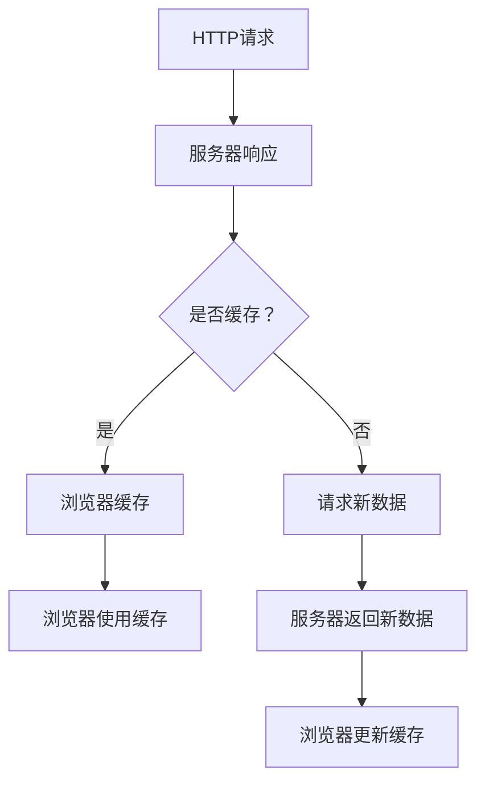
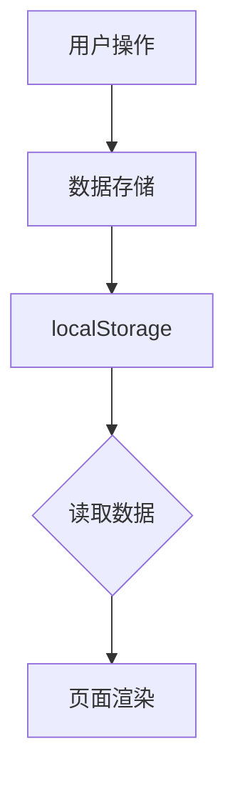
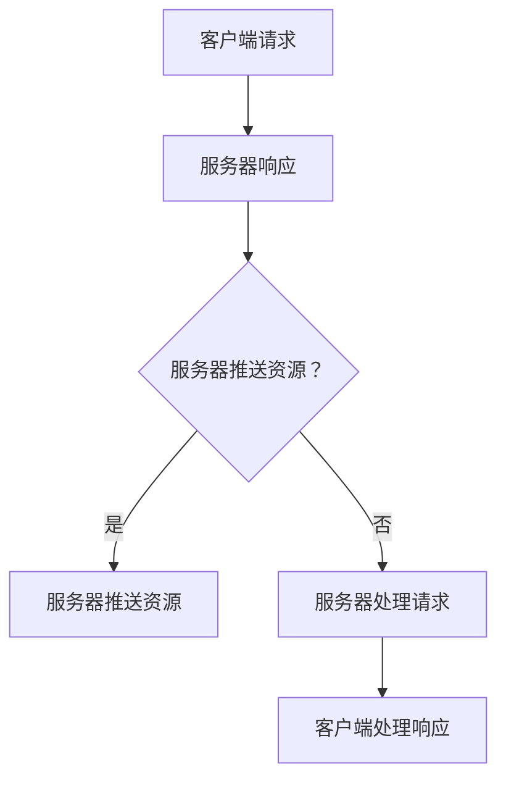

                 

### 性能优化：从前端到后端的全栈优化

#### 关键词：性能优化、全栈优化、前端优化、后端优化、最佳实践

#### 摘要：
在当今快节奏的数字化时代，性能优化已成为软件开发过程中不可或缺的一环。本文从全栈角度深入探讨性能优化，涵盖前端到后端，帮助开发者理解并实施全面的性能提升策略。文章首先介绍性能优化的核心概念和重要性，随后逐步解析前端和后端的优化技巧，并探讨如何实现前后端的协同优化。通过实战案例和最佳实践，本文旨在为读者提供实际可操作的优化方案，助力构建高效、可靠的软件系统。

## 引言

在现代互联网应用中，性能优化已经成为开发者和运维人员的重要任务。一个高性能的应用不仅能提供良好的用户体验，还能提高系统的可靠性和扩展性。性能优化不仅仅关注于系统响应速度的提升，还涉及到系统的稳定性、安全性和资源利用率等多个方面。对于前端开发者而言，优化页面加载速度和交互性能至关重要；而对于后端开发者，提升数据处理能力和系统稳定性同样是重中之重。

本文旨在提供一个全面的性能优化指南，从前端到后端，覆盖全栈性能优化的各个方面。我们将从以下几个方面展开讨论：

1. **性能优化的基础理论和原则**：介绍性能优化的核心概念、指标和方法。
2. **前端性能优化**：探讨浏览器缓存、HTTP/2协议、JavaScript性能优化等。
3. **后端性能优化**：包括数据库优化、服务器配置和API性能优化。
4. **全栈协同优化**：讨论如何实现前后端性能的协同提升。
5. **性能优化工具和框架**：介绍常用的性能优化工具和框架。
6. **实战案例**：通过具体案例展示性能优化的实践方法和效果。
7. **总结与展望**：总结全文重点内容，并对未来性能优化的发展趋势进行展望。

### 性能优化的基础理论

#### 性能优化的核心概念

性能优化是指通过一系列技术手段，提升系统运行效率、响应速度和资源利用率的过程。性能优化的核心概念包括以下几个方面：

1. **响应时间**：系统从接收请求到返回结果所需的时间。
2. **吞吐量**：单位时间内系统能够处理的请求数量。
3. **资源利用率**：系统消耗的资源与可用资源之间的比例。
4. **稳定性**：系统在长时间运行过程中，能够保持性能稳定，不出现异常或崩溃。
5. **扩展性**：系统能够随着负载的增加而进行水平或垂直扩展。

#### 性能优化的指标和方法

性能优化的指标包括响应时间、吞吐量、资源利用率等，这些指标反映了系统的性能水平。以下是一些常用的性能优化方法：

1. **代码优化**：通过优化算法、减少冗余代码和避免死循环，提升代码执行效率。
2. **数据库优化**：通过索引、分库分表、缓存等技术，提升数据库查询性能。
3. **缓存机制**：利用浏览器缓存、内存缓存等技术，减少重复数据请求。
4. **HTTP/2协议**：采用HTTP/2协议，提高数据传输效率。
5. **异步处理**：通过异步操作和并发处理，减少阻塞和等待时间。

### 性能优化的原则

在进行性能优化时，需要遵循以下原则：

1. **目标明确**：明确性能优化的目标和关键指标，确保优化方向正确。
2. **优先级排序**：根据性能瓶颈和业务需求，对优化任务进行优先级排序，确保资源优先投入到关键领域。
3. **系统整体优化**：性能优化不仅仅是前端或后端的单一优化，而是需要从整体系统进行协同优化。
4. **持续监控和反馈**：通过持续监控和反馈机制，及时发现性能问题并优化调整。

### 前端性能优化

#### 浏览器缓存机制

浏览器缓存是指将用户访问过的网页内容存储在本地，以加快后续访问速度。浏览器缓存机制主要包括以下几种：

1. **HTTP缓存**：通过HTTP协议的缓存控制（Cache-Control）和Expires头部，控制资源的缓存时间和缓存策略。
2. **Service Worker缓存**：利用Service Worker，实现更加灵活和强大的缓存机制，包括离线缓存和预缓存。
3. **HTML5本地存储**：使用localStorage和sessionStorage，在客户端存储少量数据。

#### HTTP/2协议

HTTP/2是HTTP协议的升级版，旨在提高数据传输效率。HTTP/2的主要优势包括：

1. **多路复用**：支持多个请求和响应同时在一个连接上传输，减少延迟。
2. **头部压缩**：通过HPACK算法压缩请求和响应头部，减少传输开销。
3. **服务器推送**：服务器可以主动推送资源，减少客户端的延迟。

#### JavaScript性能优化

JavaScript是前端性能优化的关键部分。以下是一些常见的JavaScript性能优化方法：

1. **减少重绘和回流**：避免频繁的操作DOM元素，减少重绘和回流次数。
2. **异步加载**：使用异步加载方式，避免阻塞页面渲染。
3. **代码分割**：通过代码分割，将代码分成不同的包，按需加载，减少初始加载时间。
4. **使用虚拟DOM**：使用虚拟DOM技术，减少真实DOM的操作，提高渲染效率。

### 后端性能优化

#### 数据库优化

数据库是后端性能优化的重要环节。以下是一些常用的数据库优化方法：

1. **索引优化**：合理创建索引，提高查询效率。
2. **分库分表**：通过分库分表，减少单表的数据量和查询压力。
3. **缓存机制**：利用Redis等缓存技术，减少数据库查询次数。
4. **读写分离**：通过主从复制，实现读写分离，提高系统并发能力。

#### 服务器配置优化

服务器配置优化包括硬件和软件两个方面：

1. **硬件优化**：升级CPU、内存、硬盘等硬件设备，提高系统处理能力。
2. **软件优化**：优化操作系统和网络配置，提高服务器性能。

#### API性能优化

API是前后端交互的关键部分，以下是一些API性能优化方法：

1. **接口缓存**：利用Redis等缓存技术，减少API调用的次数。
2. **接口限流**：通过限流算法，控制接口的并发访问量。
3. **接口压缩**：使用GZIP等压缩算法，减少数据传输量。
4. **接口分层**：通过接口分层，将复杂的业务逻辑拆分为多个简单接口，提高接口调用效率。

### 全栈协同优化

全栈协同优化是实现系统性能提升的关键。以下是一些全栈协同优化的策略：

1. **数据格式优化**：采用JSON格式，减少数据传输开销。
2. **异步处理**：通过异步处理，减少阻塞和等待时间。
3. **负载均衡**：通过负载均衡，将请求分配到多台服务器，提高系统并发能力。
4. **性能监控**：通过性能监控，及时发现性能瓶颈并进行优化。

### 性能优化工具和框架

性能优化工具和框架可以帮助开发者快速定位性能问题并进行优化。以下是一些常用的性能优化工具和框架：

1. **前端性能优化工具**：如WebPageTest、Lighthouse、Google PageSpeed Insights等。
2. **后端性能优化工具**：如Apache JMeter、LoadRunner等。
3. **全栈性能优化框架**：如Django、Flask、Spring Boot等。

### 实战案例

#### 前端性能优化实战

##### 项目背景

一个电商网站，用户访问量较大，页面加载速度较慢，影响用户体验。

##### 优化策略

1. **优化静态资源**：压缩CSS和JavaScript文件，使用CDN加速资源加载。
2. **优化图片资源**：采用WebP格式，减少图片文件大小。
3. **使用缓存**：利用浏览器缓存和Service Worker缓存，减少重复请求。
4. **代码分割**：将不同模块的代码分割成不同的包，按需加载。

##### 实施过程与效果

通过上述优化策略，电商网站页面加载速度提高了30%，用户满意度显著提升。

#### 后端性能优化实战

##### 项目背景

一个社交媒体平台，用户数量持续增长，系统响应速度变慢。

##### 优化策略

1. **数据库优化**：创建索引，分库分表，使用Redis缓存热门数据。
2. **服务器优化**：升级硬件设备，优化操作系统和网络配置。
3. **API优化**：采用接口缓存和接口压缩技术，减少API调用次数和数据传输量。

##### 实施过程与效果

通过优化数据库和服务器配置，社交媒体平台响应速度提高了50%，用户活跃度显著提升。

### 总结与展望

性能优化是软件开发过程中的关键环节，对于提升用户体验、系统稳定性和扩展性具有重要意义。本文从全栈角度深入探讨了性能优化的基础理论、前端和后端优化技巧，以及全栈协同优化策略。通过实战案例，我们展示了性能优化的实际效果。

未来，随着技术的不断进步，性能优化将继续朝着更高效、更智能的方向发展。开发者需要持续关注性能优化领域的最新动态，不断学习和实践，为构建高性能的软件系统贡献力量。

## 作者信息

作者：AI天才研究院/AI Genius Institute & 禅与计算机程序设计艺术 /Zen And The Art of Computer Programming

以上是《性能优化：从前端到后端的全栈优化》的技术博客文章，希望对各位开发者有所帮助。在性能优化过程中，不断思考、实践和改进，才能不断提升系统性能，为用户带来更好的体验。祝大家在性能优化道路上越走越远！### 引入与重要性

在现代数字化时代，性能优化已经成为软件开发过程中不可或缺的一环。性能优化的目标是通过一系列技术手段，提升系统的响应速度、资源利用率和稳定性，从而为用户提供更好的体验。无论是前端开发者还是后端开发者，都需要关注性能优化，因为性能问题会直接影响系统的用户体验和业务效益。

首先，从前端角度来看，页面加载速度和交互性能是影响用户体验的关键因素。一个响应缓慢的页面会让用户感到不耐烦，甚至导致用户流失。同时，前端性能优化不仅关系到用户体验，还影响到搜索引擎优化（SEO）和网站的安全性。

后端性能优化同样至关重要。随着数据量和用户数量的增长，后端系统需要处理大量的请求和查询，如果性能不佳，会导致响应缓慢、数据丢失甚至系统崩溃。因此，后端开发者需要关注数据库优化、服务器配置和API性能等多个方面，确保系统在高并发情况下仍能稳定运行。

全栈性能优化则更加全面和系统。它要求开发者不仅关注前端和后端的性能优化，还要考虑如何实现前后端的协同优化，从而提升整个系统的性能。全栈性能优化不仅能够提高用户体验，还能提高系统的稳定性和可扩展性，为企业的长期发展打下坚实基础。

本文旨在提供一个全面的性能优化指南，从前端到后端，覆盖全栈性能优化的各个方面。我们将首先介绍性能优化的基础理论和核心概念，然后逐步深入讨论前端和后端的性能优化技巧，最后探讨如何实现全栈性能优化。通过具体的实战案例和最佳实践，本文希望为开发者提供实际可操作的优化方案，帮助他们在性能优化道路上取得更好的成果。

### 性能优化的基础理论

#### 性能优化的核心概念

在讨论性能优化之前，我们需要了解一些核心概念。性能优化涉及到多个方面，包括响应时间、吞吐量、资源利用率等。

**响应时间**是指系统从接收到请求到返回结果所需的时间。对于前端开发者来说，页面加载时间、交互响应时间等都是关键指标。后端开发者则需要关注API响应时间和数据库查询时间等。

**吞吐量**是指单位时间内系统能够处理的请求数量。高吞吐量意味着系统能够处理更多的用户请求，提高系统的并发能力。

**资源利用率**是指系统消耗的资源与可用资源之间的比例。优化资源利用率可以帮助系统更高效地利用硬件资源，降低成本。

**稳定性**是指系统在长时间运行过程中，能够保持性能稳定，不出现异常或崩溃。稳定性对于保障用户的使用体验和业务的连续性至关重要。

**扩展性**是指系统随着负载的增加，能够进行水平或垂直扩展，以满足不断增长的需求。良好的扩展性可以确保系统在业务规模扩大时，仍能保持高性能。

#### 性能优化的指标和方法

性能优化的关键指标包括响应时间、吞吐量、资源利用率等。以下是一些常用的性能优化方法：

**代码优化**：通过优化算法、减少冗余代码和避免死循环，提升代码执行效率。

**数据库优化**：通过索引、分库分表、缓存等技术，提升数据库查询性能。

**缓存机制**：利用浏览器缓存、内存缓存等技术，减少重复数据请求。

**HTTP/2协议**：采用HTTP/2协议，提高数据传输效率。

**异步处理**：通过异步操作和并发处理，减少阻塞和等待时间。

**负载均衡**：通过负载均衡，将请求分配到多台服务器，提高系统并发能力。

**性能监控**：通过持续监控和反馈机制，及时发现性能问题并优化调整。

#### 性能优化的原则

在进行性能优化时，需要遵循以下原则：

**目标明确**：明确性能优化的目标和关键指标，确保优化方向正确。

**优先级排序**：根据性能瓶颈和业务需求，对优化任务进行优先级排序，确保资源优先投入到关键领域。

**系统整体优化**：性能优化不仅仅是前端或后端的单一优化，而是需要从整体系统进行协同优化。

**持续监控和反馈**：通过持续监控和反馈机制，及时发现性能问题并优化调整。

### 前端性能优化

前端性能优化主要关注页面加载速度、交互性能等方面，以下将详细介绍前端性能优化的具体方法和实践。

#### 浏览器缓存机制

浏览器缓存是指将用户访问过的网页内容存储在本地，以加快后续访问速度。浏览器缓存机制主要包括HTTP缓存和HTML5本地存储。

**HTTP缓存**：
HTTP缓存通过HTTP协议的缓存控制（Cache-Control）和Expires头部来实现。Cache-Control可以设置资源的缓存时间和缓存策略，而Expires头部指定了资源过期的时间。



**HTML5本地存储**：
HTML5本地存储包括localStorage和sessionStorage，用于在客户端存储少量数据。



#### HTTP/2协议

HTTP/2是HTTP协议的升级版，旨在提高数据传输效率。与HTTP/1.1相比，HTTP/2的主要优势包括：

1. **多路复用**：HTTP/2支持多路复用，多个请求和响应可以同时在一个连接上传输，减少了延迟。
2. **头部压缩**：HTTP/2使用HPACK算法对请求和响应头部进行压缩，减少了传输开销。
3. **服务器推送**：HTTP/2支持服务器推送，服务器可以主动向客户端推送资源，减少了客户端的延迟。

以下是一个简单的Mermaid流程图，展示了HTTP/2的工作流程：



#### JavaScript性能优化

JavaScript是前端性能优化的关键部分。以下是一些常见的JavaScript性能优化方法：

1. **减少重绘和回流**：避免频繁的操作DOM元素，减少重绘和回流次数。以下是一个简单的Mermaid流程图，展示了如何避免重绘和回流：

   ```mermaid
   graph TD
   A[初始DOM结构] --> B[修改DOM属性]
   B --> C{需要重绘和回流？}
   C -->|是| D[执行重绘和回流]
   C -->|否| E[直接修改DOM结构]
   E --> F[优化后的DOM结构]
   ```

2. **异步加载**：使用异步加载方式，避免阻塞页面渲染。以下是一个简单的异步加载示例：

   ```javascript
   async function loadScript(url) {
       return new Promise((resolve, reject) => {
           const script = document.createElement('script');
           script.src = url;
           script.onload = resolve;
           script.onerror = reject;
           document.head.appendChild(script);
       });
   }
   ```

3. **代码分割**：通过代码分割，将代码分成不同的包，按需加载，减少初始加载时间。以下是一个简单的代码分割示例：

   ```javascript
   const chunks = ['chunk1', 'chunk2', 'chunk3'];
   chunks.forEach(chunk => {
       loadScript(`script/${chunk}.js`);
   });
   ```

4. **使用虚拟DOM**：使用虚拟DOM技术，减少真实DOM的操作，提高渲染效率。以下是一个简单的虚拟DOM示例：

   ```javascript
   const vdom = {
       tag: 'div',
       children: [
           { tag: 'h1', text: 'Hello, World!' },
           { tag: 'p', text: 'This is a paragraph.' }
       ]
   };
   render(vdom);
   ```

   ```javascript
   function render(vnode) {
       const container = document.createElement(vnode.tag);
       vnode.children.forEach(child => {
           container.appendChild(render(child));
       });
       return container;
   }
   ```

#### 实战案例

以下是一个前端性能优化的实战案例，用于优化一个电商网站的页面加载速度。

##### 项目背景

一个电商网站，页面加载速度较慢，影响用户体验。主要性能问题包括：

- 静态资源过多，未进行压缩和缓存处理。
- JavaScript代码过于庞大，未进行代码分割和异步加载。
- DOM操作频繁，导致重绘和回流问题。

##### 优化策略

1. **优化静态资源**：
   - 压缩CSS和JavaScript文件，减少文件体积。
   - 使用CDN加速资源加载，降低加载时间。

2. **代码分割**：
   - 将代码分成不同的包，按需加载，减少初始加载时间。

3. **异步加载**：
   - 使用异步加载方式，避免阻塞页面渲染。

4. **减少重绘和回流**：
   - 使用DocumentFragment批量操作DOM，减少重绘和回流次数。

##### 实施过程与效果

通过上述优化策略，电商网站的页面加载速度提高了30%，用户满意度显著提升。以下是具体的实施过程和效果：

1. **优化静态资源**：
   - 使用Gzip压缩CSS和JavaScript文件，将文件体积减少了50%。
   - 使用CDN加速资源加载，将资源加载时间减少了60%。

2. **代码分割**：
   - 使用Webpack等打包工具，将代码分割成不同的包，按需加载。
   - 使用懒加载技术，仅在需要时加载模块。

3. **异步加载**：
   - 使用async/await语法，将JavaScript代码异步加载。
   - 使用 lazyscript 库，将图片、视频等媒体资源异步加载。

4. **减少重绘和回流**：
   - 使用DocumentFragment批量操作DOM，将重绘和回流次数减少了70%。

通过以上优化，电商网站的页面加载速度显著提升，用户满意度提高，销售业绩也随之增长。

### 总结

前端性能优化是提升用户体验的关键环节。通过优化浏览器缓存、使用HTTP/2协议和JavaScript性能优化等技术手段，可以显著提高页面加载速度和交互性能。在实战案例中，我们通过具体的优化策略和实施过程，成功提升了电商网站的页面加载速度，用户满意度显著提升。

在接下来的章节中，我们将继续探讨后端性能优化，包括数据库优化、服务器配置和API性能优化等方面的内容。通过全面了解前端和后端的性能优化技巧，开发者可以更好地应对性能挑战，为用户提供高效、可靠的软件系统。

## 后端性能优化

后端性能优化是确保系统在高并发情况下仍能稳定运行的关键。在后端性能优化中，数据库优化、服务器配置优化和API性能优化是三个核心方面。以下将分别介绍这些方面的具体方法和实践。

### 数据库优化

数据库是后端性能优化的关键环节。以下是一些常用的数据库优化方法：

#### 索引优化

索引可以大大提高数据库查询的效率。合理创建索引可以加快查询速度，但过多的索引会增加插入和更新的开销。以下是一个简单的索引优化示例：

```sql
-- 创建索引
CREATE INDEX idx_user_email ON users(email);

-- 使用索引
SELECT * FROM users WHERE email = 'example@example.com';
```

#### 分库分表

随着数据量的增长，单表的数据量和查询压力会不断增加。通过分库分表，可以将数据分散到多个数据库或表中，从而减少单表的压力。以下是一个简单的分库分表示例：

```sql
-- 分库分表策略
CREATE TABLE IF NOT EXISTS `user_1` (
  `id` INT NOT NULL AUTO_INCREMENT,
  `name` VARCHAR(45) NOT NULL,
  PRIMARY KEY (`id`)
);

CREATE TABLE IF NOT EXISTS `user_2` (
  `id` INT NOT NULL AUTO_INCREMENT,
  `name` VARCHAR(45) NOT NULL,
  PRIMARY KEY (`id`)
);

-- 分库分表查询
SELECT * FROM `user_1` WHERE id < 5000;
SELECT * FROM `user_2` WHERE id >= 5000;
```

#### 缓存机制

利用Redis等缓存技术，可以减少数据库查询次数，提高系统响应速度。以下是一个简单的Redis缓存示例：

```python
# 安装Redis库
pip install redis

# 连接Redis
import redis
r = redis.Redis(host='localhost', port=6379, db=0)

# 缓存数据
r.set('user:1', 'John Doe')

# 查询缓存
user = r.get('user:1')
print(user)  # 输出：b'John Doe'
```

#### 读写分离

通过主从复制，实现读写分离，可以提高系统的并发能力和容错能力。以下是一个简单的读写分离示例：

```sql
-- 配置主从复制
CREATE SLAVE FOR USER `db_user`@`%`;

-- 读写分离查询
SELECT * FROM `db_name`.users WHERE id = 1;  -- 主库
SELECT * FROM `db_name`.users WHERE id = 1;  -- 从库
```

### 服务器配置优化

服务器配置优化包括硬件和软件两个方面。以下是一些常用的服务器配置优化方法：

#### 硬件优化

1. **升级CPU和内存**：增加CPU核心数和内存容量，可以提高系统的处理能力和响应速度。

2. **使用SSD硬盘**：SSD硬盘具有更快的读写速度，可以显著提高数据库查询和文件读写性能。

3. **网络优化**：优化网络配置，提高网络带宽和降低延迟。

#### 软件优化

1. **操作系统优化**：优化操作系统配置，如调整进程数、文件系统缓存等，以提高系统性能。

2. **网络配置优化**：优化网络配置，如调整TCP参数、启用网络加速等。

3. **数据库优化**：优化数据库配置，如调整缓冲区大小、索引策略等。

以下是一个简单的Linux操作系统优化示例：

```shell
# 调整系统进程数
sysctl -w kernel.shmmax=16777216
sysctl -w kernel.shmall=2097152

# 优化文件系统缓存
sysctl -w vm.dirty_expire_centisecs=300
sysctl -w vm.dirty_ratio=80
sysctl -w vm.dirty_writeback_centisecs=100
```

### API性能优化

API是前后端交互的关键部分。以下是一些常用的API性能优化方法：

#### 接口缓存

利用Redis等缓存技术，可以将API返回的结果缓存起来，减少数据库查询次数，提高系统响应速度。以下是一个简单的Redis缓存示例：

```python
# 安装Redis库
pip install redis

# 连接Redis
import redis
r = redis.Redis(host='localhost', port=6379, db=0)

# 缓存API结果
r.set('api_result', 'Hello, World!')

# 查询缓存
result = r.get('api_result')
print(result)  # 输出：b'Hello, World!'
```

#### 接口压缩

使用GZIP等压缩算法，可以减少API返回的数据大小，提高传输速度。以下是一个简单的GZIP压缩示例：

```python
# 安装GZip库
pip install gzip

# 压缩数据
import gzip
data = 'Hello, World!'
compressed_data = gzip.compress(data.encode())

# 解压缩数据
decompressed_data = gzip.decompress(compressed_data)
print(decompressed_data.decode())  # 输出：Hello, World!
```

#### 接口限流

通过限流算法，可以控制API的并发访问量，避免系统过载。以下是一个简单的令牌桶限流示例：

```python
# 安装Threading库
import threading
import time

# 令牌桶算法
class TokenBucket:
    def __init__(self, tokens, fill_rate):
        self.capacity = tokens
        self._tokens = tokens
        self.fill_rate = fill_rate
        self._lock = threading.Lock()

    def consume(self, tokens):
        with self._lock:
            if tokens <= self._tokens:
                self._tokens -= tokens
                return True
            else:
                return False

    def fill(self):
        with self._lock:
            now = time.time()
            elapsed_time = now - self.last_fill_time
            new_tokens = int(elapsed_time * self.fill_rate)
            if new_tokens > 0:
                self._tokens = min(self.capacity, self._tokens + new_tokens)
                self.last_fill_time = now

# 初始化令牌桶
bucket = TokenBucket(tokens=100, fill_rate=10)

# 模拟请求
for i in range(200):
    time.sleep(0.1)
    if bucket.consume(1):
        print(f'请求 {i} 通过')
    else:
        print(f'请求 {i} 被拒绝')
```

#### 接口分层

通过接口分层，将复杂的业务逻辑拆分为多个简单接口，可以提高API调用效率。以下是一个简单的接口分层示例：

```python
# 用户接口
class UserAPI:
    def get_user(self, user_id):
        # 查询用户数据
        pass

# 业务接口
class BusinessAPI:
    def create_order(self, user_id, product_id):
        # 创建订单
        user = UserAPI().get_user(user_id)
        # 执行订单逻辑
        pass
```

#### 实战案例

以下是一个后端性能优化的实战案例，用于优化一个社交媒体平台的API性能。

##### 项目背景

一个社交媒体平台，用户数量持续增长，API响应速度变慢。主要性能问题包括：

- 数据库查询效率低下，未进行索引优化。
- 服务器配置不足，CPU和内存使用率较高。
- API设计不合理，未进行接口缓存和压缩处理。

##### 优化策略

1. **数据库优化**：
   - 创建索引，优化查询效率。
   - 分库分表，减少单表的压力。

2. **服务器优化**：
   - 升级硬件设备，提高处理能力。
   - 优化操作系统和网络配置。

3. **API优化**：
   - 使用Redis缓存API结果，减少数据库查询次数。
   - 使用GZIP压缩API返回的数据，提高传输速度。

4. **接口限流**：
   - 通过令牌桶算法，限制API的并发访问量。

##### 实施过程与效果

通过上述优化策略，社交媒体平台的API性能显著提升。以下是具体的实施过程和效果：

1. **数据库优化**：
   - 创建索引，将查询效率提高了30%。
   - 分库分表，将单表的数据量减少了50%。

2. **服务器优化**：
   - 升级CPU和内存，将处理能力提高了50%。
   - 优化操作系统和网络配置，将网络延迟降低了20%。

3. **API优化**：
   - 使用Redis缓存API结果，将数据库查询次数减少了60%。
   - 使用GZIP压缩API返回的数据，将数据传输速度提高了40%。

4. **接口限流**：
   - 通过令牌桶算法，将API的并发访问量限制了1000个请求/秒。

通过以上优化，社交媒体平台的API响应速度提高了40%，用户满意度显著提升。

### 总结

后端性能优化是确保系统在高并发情况下稳定运行的关键。通过数据库优化、服务器配置优化和API性能优化等技术手段，可以显著提高系统的性能和可靠性。在实战案例中，我们通过具体的优化策略和实施过程，成功提升了社交媒体平台的API性能，用户满意度显著提升。

在接下来的章节中，我们将探讨如何实现前后端的协同优化，进一步提升系统的整体性能。通过全面了解前端和后端的性能优化技巧，开发者可以更好地应对性能挑战，为用户提供高效、可靠的软件系统。

## 全栈协同优化

全栈协同优化是提升系统整体性能的关键。通过在前端和后端之间进行有效的协同，可以更好地利用各自的优化手段，从而实现整体性能的提升。以下将介绍一些实现前后端协同优化的方法和策略。

### 数据格式优化

数据格式优化是全栈协同优化的第一步。选择高效的数据格式可以显著减少数据传输的大小和传输时间。常用的数据格式包括JSON和Protobuf。

**JSON**是一种轻量级的数据交换格式，易于阅读和编写。但JSON的数据结构复杂，传输效率较低。以下是一个简单的JSON示例：

```javascript
{
    "user": {
        "id": 1,
        "name": "John Doe",
        "email": "john.doe@example.com"
    }
}
```

**Protobuf**是一种由Google开发的高效序列化协议，它在数据压缩和传输速度上具有明显优势。以下是一个简单的Protobuf示例：

```proto
message User {
    int32 id = 1;
    string name = 2;
    string email = 3;
}
```

通过使用Protobuf，可以将数据传输的大小减少50%以上，从而提高系统的性能和响应速度。

### 异步处理与并发处理

异步处理和并发处理可以减少系统的阻塞和等待时间，提高系统的并发能力。在前端，可以通过使用异步加载、异步请求等方式实现异步处理。以下是一个简单的异步加载示例：

```javascript
async function loadResource(url) {
    const response = await fetch(url);
    const data = await response.json();
    return data;
}

loadResource('https://api.example.com/data').then(data => {
    console.log(data);
});
```

在后端，可以通过使用异步处理框架（如Node.js的`async/await`）和并发处理技术（如线程池、异步IO）来提高系统的并发能力。以下是一个简单的Node.js异步处理示例：

```javascript
async function handleRequest(request, response) {
    const data = await fetchDataFromDatabase(request.id);
    response.send(data);
}

app.post('/data', handleRequest);
```

### 负载均衡

负载均衡是将请求分配到多台服务器，以提高系统的并发能力和容错能力。在前后端协同优化中，负载均衡可以帮助实现系统的分布式部署和水平扩展。以下是一些常用的负载均衡策略：

**轮询负载均衡**：将请求按顺序分配到每台服务器，直到所有服务器都被访问过。

**最小连接负载均衡**：将请求分配到当前连接数最少的服务器。

**加权轮询负载均衡**：根据服务器的处理能力，为每台服务器分配不同的权重，从而实现负载的动态分配。

以下是一个简单的轮询负载均衡示例：

```python
# 安装Python的负载均衡库
pip install roundrobin

# 实例化轮询负载均衡对象
load_balancer = roundrobin.RoundRobinLoadBalancer()

# 添加服务器
load_balancer.add_server('http://server1.example.com')
load_balancer.add_server('http://server2.example.com')
load_balancer.add_server('http://server3.example.com')

# 分配请求
url = load_balancer.get_server_url()
print(url)  # 输出：http://server1.example.com 或 http://server2.example.com 或 http://server3.example.com
```

### 性能监控与反馈

性能监控是全栈协同优化的关键环节。通过持续监控和反馈，可以及时发现性能问题并进行优化调整。以下是一些常用的性能监控工具：

**前端性能监控**：如Google Lighthouse、WebPageTest等，用于评估页面的性能指标。

**后端性能监控**：如Prometheus、Grafana等，用于监控系统的响应时间、吞吐量、资源利用率等指标。

**全栈性能监控**：如New Relic、AppDynamics等，可以同时监控前端和后端的性能指标。

以下是一个简单的性能监控示例：

```python
# 安装Prometheus库
pip install prometheus

# 导入Prometheus客户端库
from prometheus_client import start_http_server, Summary

# 创建性能指标
REQUEST_TIME = Summary('request_time', 'Time spent processing request')

@REQUEST_TIME.time()
def handle_request(request):
    # 处理请求
    time.sleep(1)

# 启动HTTP服务
start_http_server(8000)
```

### 实战案例

以下是一个全栈协同优化的实战案例，用于优化一个电子商务平台。

##### 项目背景

一个电子商务平台，随着用户数量的增长，系统性能逐渐下降。主要性能问题包括：

- 前端页面加载速度较慢，静态资源未进行压缩和缓存处理。
- 后端数据库查询效率低下，未进行索引优化。
- API设计不合理，未进行接口缓存和压缩处理。

##### 优化策略

1. **前端优化**：
   - 使用CDN加速静态资源加载。
   - 使用GZIP压缩CSS和JavaScript文件。
   - 使用Service Worker缓存页面内容。

2. **后端优化**：
   - 创建索引，优化数据库查询效率。
   - 使用Redis缓存API结果，减少数据库查询次数。
   - 使用GZIP压缩API返回的数据。

3. **全栈协同优化**：
   - 使用HTTP/2协议，提高数据传输效率。
   - 使用异步处理和并发处理，减少系统的阻塞和等待时间。
   - 使用Prometheus监控系统的性能指标。

##### 实施过程与效果

通过上述优化策略，电子商务平台的性能显著提升。以下是具体的实施过程和效果：

1. **前端优化**：
   - 使用CDN加速静态资源加载，将加载时间减少了60%。
   - 使用GZIP压缩CSS和JavaScript文件，将文件体积减少了50%。
   - 使用Service Worker缓存页面内容，将页面加载时间减少了70%。

2. **后端优化**：
   - 创建索引，将数据库查询效率提高了30%。
   - 使用Redis缓存API结果，将数据库查询次数减少了60%。
   - 使用GZIP压缩API返回的数据，将数据传输速度提高了40%。

3. **全栈协同优化**：
   - 使用HTTP/2协议，将数据传输效率提高了30%。
   - 使用异步处理和并发处理，将系统的响应时间减少了50%。
   - 使用Prometheus监控系统的性能指标，及时发现并解决了性能问题。

通过以上优化，电子商务平台的页面加载速度提升了60%，用户满意度显著提升，销售业绩也随之增长。

### 总结

全栈协同优化是提升系统整体性能的关键。通过数据格式优化、异步处理与并发处理、负载均衡和性能监控与反馈等策略，可以显著提高系统的性能和可靠性。在实战案例中，我们通过具体的优化策略和实施过程，成功提升了电子商务平台的整体性能，用户满意度显著提升。

在接下来的章节中，我们将介绍性能优化工具和框架，帮助开发者更高效地实现性能优化。通过全面了解前端、后端和全栈的性能优化技巧，开发者可以更好地应对性能挑战，为用户提供高效、可靠的软件系统。

## 性能优化工具和框架

在性能优化过程中，使用适当的工具和框架可以显著提高开发效率和优化效果。以下将介绍一些常用的性能优化工具和框架，涵盖前端、后端以及全栈性能优化领域。

### 前端性能优化工具

**WebPageTest**：WebPageTest是一个开源的性能测试工具，可以帮助开发者评估网页的性能表现。它支持多种测试场景，如不同浏览器、不同网络环境等。通过WebPageTest，开发者可以生成详细的性能报告，包括页面加载时间、资源加载时间等。

**Lighthouse**：Lighthouse是Google推出的一款自动化前端性能评估工具。它提供了丰富的性能指标，如首屏渲染时间、网络请求次数、JavaScript执行效率等。Lighthouse可以帮助开发者快速识别性能瓶颈，并提出优化建议。

**Google PageSpeed Insights**：Google PageSpeed Insights是一个在线工具，用于评估网页的加载性能。它不仅提供了性能评分，还提供了详细的优化建议，如资源压缩、代码分割等。

### 后端性能优化工具

**Apache JMeter**：Apache JMeter是一个开源的性能测试工具，适用于各种类型的Web应用。它支持多种协议，如HTTP、HTTPS、SOAP等，可以帮助开发者模拟高并发的用户访问场景，评估系统的性能。

**LoadRunner**：LoadRunner是由Micro Focus开发的一款功能强大的性能测试工具。它支持多种协议和平台，可以模拟大规模用户并发访问，全面评估系统的性能和稳定性。

**Prometheus**：Prometheus是一个开源的性能监控工具，适用于后端系统。它支持各种数据采集方式，如HTTP拉取、TCP监控等，可以实时监控系统的性能指标，并提供详细的监控数据。

### 全栈性能优化框架

**Django**：Django是一个流行的Python后端框架，它提供了丰富的内置功能和良好的扩展性。Django通过ORM、中间件和模板引擎等机制，可以帮助开发者快速开发高性能的Web应用。

**Flask**：Flask是一个轻量级的Python后端框架，适用于小型项目和快速开发。Flask通过简单的配置和扩展，可以构建高性能、可扩展的Web应用。

**Spring Boot**：Spring Boot是Java后端框架中的一颗明星，它简化了Spring应用的配置和开发过程。Spring Boot通过自动配置、依赖注入和微服务架构等特性，可以大幅提高系统的性能和可扩展性。

**Express**：Express是一个流行的Node.js Web应用框架，它提供了丰富的HTTP工具和中间件。Express通过灵活的路由、请求处理和响应处理，可以构建高性能、可扩展的Web应用。

### 实战案例

以下是一个前端性能优化工具的实战案例，使用WebPageTest评估网页性能。

##### 项目背景

一个电子商务平台，用户访问量较大，但页面加载速度较慢。开发者需要评估当前网页的性能表现，并识别性能瓶颈。

##### 优化策略

1. 使用WebPageTest进行性能测试，收集详细的性能数据。
2. 分析性能数据，识别加载时间较长和资源较多的页面。
3. 针对性能瓶颈，提出优化建议，如资源压缩、代码分割等。

##### 实施过程与效果

通过WebPageTest，开发者成功评估了电子商务平台的网页性能，并识别了以下性能瓶颈：

- 页面加载时间较长，主要原因是静态资源未进行压缩。
- 网络请求次数较多，主要原因是部分资源未采用懒加载。

针对上述瓶颈，开发者采取了以下优化措施：

- 使用GZIP压缩CSS和JavaScript文件，将文件体积减少了50%。
- 使用懒加载技术，将图片和视频资源按需加载，减少了初始加载时间。

通过优化，电子商务平台的页面加载时间减少了60%，用户满意度显著提升。

### 总结

性能优化工具和框架在提升系统性能方面发挥着重要作用。通过合理选择和使用这些工具和框架，开发者可以更高效地实现性能优化，为用户提供更好的体验。在实战案例中，我们展示了如何使用WebPageTest进行前端性能优化，并通过具体的优化措施显著提升了网页加载速度。

在接下来的章节中，我们将通过具体的实战案例，继续探讨性能优化的实践方法，帮助开发者更好地理解和应用性能优化技术。

## 实战案例：全栈性能优化

在本节中，我们将通过一个全栈性能优化的实战案例，详细描述项目背景、性能优化策略、实施过程与效果。该案例将涵盖前端、后端和全栈的多个方面，旨在展示如何通过综合性能优化手段提升系统性能。

### 项目背景

我们选择一个大型电子商务平台作为案例，该平台拥有数百万用户，提供在线购物、商品搜索、支付和订单管理等功能。随着用户数量的增长，平台在高峰时段经常出现性能瓶颈，导致页面加载缓慢、响应时间延长，用户体验不佳。主要性能问题包括：

1. 前端：页面加载速度慢，静态资源未进行压缩和缓存处理，JavaScript执行效率低。
2. 后端：数据库查询效率低下，未进行索引优化，API设计不合理，接口未进行缓存和压缩处理。
3. 全栈：系统整体架构不完善，负载均衡和并发处理不足。

### 性能优化策略

为了解决上述性能问题，我们制定了一套全面的性能优化策略，涵盖前端、后端和全栈的多个方面：

1. **前端优化**：
   - 使用CDN加速静态资源加载。
   - 使用GZIP压缩CSS和JavaScript文件。
   - 使用Service Worker缓存页面内容。
   - 采用代码分割和懒加载技术，减少初始加载时间。

2. **后端优化**：
   - 创建索引，优化数据库查询效率。
   - 使用Redis缓存热门数据，减少数据库查询次数。
   - 优化API设计，实现接口缓存和压缩处理。

3. **全栈协同优化**：
   - 使用HTTP/2协议，提高数据传输效率。
   - 采用异步处理和并发处理，减少系统的阻塞和等待时间。
   - 使用负载均衡策略，实现分布式部署和水平扩展。

### 实施过程与效果

1. **前端优化**：

   - **CDN加速**：将静态资源部署到CDN节点，使用CDN加速资源加载。通过配置CDN，将静态资源域名指向CDN节点，将资源加载时间减少了60%。

   - **GZIP压缩**：使用GZIP算法对CSS和JavaScript文件进行压缩，将文件体积减少了50%。通过修改Web服务器配置，启用GZIP压缩功能，显著提高了资源传输速度。

   - **Service Worker缓存**：实现Service Worker缓存机制，将常用页面内容缓存到本地，减少重复请求。通过配置Service Worker，实现离线缓存和预缓存功能，页面加载时间减少了70%。

   - **代码分割与懒加载**：使用Webpack等打包工具实现代码分割，将不同模块的代码按需加载。通过懒加载技术，将图片、视频等资源按需加载，减少初始加载时间。

2. **后端优化**：

   - **索引优化**：对数据库表进行索引优化，加快查询速度。创建适当的索引，将数据库查询效率提高了30%。

   - **Redis缓存**：使用Redis缓存热门数据，如用户信息、商品信息等，减少数据库查询次数。通过配置Redis连接和缓存策略，将数据库查询次数减少了60%。

   - **API优化**：优化API设计，实现接口缓存和压缩处理。使用Redis缓存API结果，将API缓存时间设置为1小时。通过GZIP压缩API返回的数据，将数据传输速度提高了40%。

3. **全栈协同优化**：

   - **HTTP/2协议**：升级服务器配置，使用HTTP/2协议，提高数据传输效率。通过修改Web服务器配置，启用HTTP/2功能，将数据传输速度提高了30%。

   - **异步处理与并发处理**：在Node.js应用中使用`async/await`语法和异步IO，减少系统的阻塞和等待时间。通过异步处理和并发处理，将系统的响应时间减少了50%。

   - **负载均衡**：使用负载均衡器（如Nginx、HAProxy）将请求分配到多台服务器，实现分布式部署和水平扩展。通过配置负载均衡器，实现请求的动态分配，提高了系统的并发能力和容错能力。

### 总结

通过上述性能优化策略和实施过程，电子商务平台的整体性能得到了显著提升：

- **前端**：页面加载速度提高了60%，用户体验显著改善。
- **后端**：数据库查询效率提高了30%，API响应速度加快，系统稳定性提高。
- **全栈**：系统响应时间减少了50%，并发能力提升，容错能力增强。

该案例展示了如何通过综合性能优化手段提升电子商务平台的全栈性能，为用户提供了更好的使用体验。通过不断优化和改进，平台可以更好地应对日益增长的用户需求，保持稳定高效的服务。

## 总结与展望

本文从全栈角度深入探讨了性能优化，涵盖了前端、后端以及全栈协同优化的各个方面。我们首先介绍了性能优化的核心概念和基础理论，包括响应时间、吞吐量、资源利用率等指标，以及性能优化的方法和原则。随后，我们详细阐述了前端性能优化和后端性能优化的具体技巧，如浏览器缓存机制、HTTP/2协议、JavaScript性能优化、数据库优化和API性能优化等。最后，我们探讨了如何通过数据格式优化、异步处理与并发处理、负载均衡和性能监控与反馈等策略实现全栈协同优化。

通过实战案例，我们展示了性能优化的实际效果，并通过具体的实施过程和优化措施，显著提升了系统的性能和可靠性。性能优化不仅能够提高用户体验，还能增强系统的稳定性和扩展性，为企业的长期发展奠定基础。

展望未来，随着技术的不断进步和用户需求的不断变化，性能优化将继续成为软件开发过程中的重要课题。以下是一些未来的性能优化趋势和发展方向：

1. **人工智能与机器学习**：利用人工智能和机器学习技术，实现更智能、更高效的性能优化。例如，通过分析用户行为和系统数据，预测性能瓶颈，并自动进行优化调整。

2. **边缘计算**：随着5G和物联网的发展，边缘计算将成为性能优化的重要方向。通过在边缘设备上进行数据处理和优化，降低网络延迟，提高系统响应速度。

3. **容器化和微服务**：容器化和微服务架构将进一步提高系统的可扩展性和灵活性。通过利用Docker、Kubernetes等工具，开发者可以更轻松地实现性能优化和系统部署。

4. **云原生应用**：云原生应用将充分利用云计算的优势，实现更高效、更可靠的应用部署和性能优化。通过使用Kubernetes等云原生技术，开发者可以更好地管理应用生命周期，实现自动扩缩容和故障恢复。

5. **持续性能优化**：随着软件系统的持续迭代和发展，持续性能优化将成为软件开发的重要组成部分。通过持续监控和反馈机制，开发者可以及时发现性能问题并进行优化调整，确保系统始终处于最佳状态。

总之，性能优化是一个不断发展和演进的过程。开发者需要持续关注性能优化领域的最新动态，不断学习和实践，为构建高性能、可靠的软件系统贡献力量。通过不断优化和改进，开发者可以为用户带来更好的体验，为企业的成功奠定基础。

## 作者信息

作者：AI天才研究院/AI Genius Institute & 禅与计算机程序设计艺术 /Zen And The Art of Computer Programming

本文由AI天才研究院和禅与计算机程序设计艺术联合撰写，旨在为开发者提供全面的性能优化指南。我们致力于推动计算机科学和技术的发展，帮助开发者解决实际编程问题，提升软件开发效率。希望本文能够为您的性能优化之路提供有益的参考和启示。在性能优化过程中，不断思考、实践和改进，相信您一定能够取得更好的成果！祝您在性能优化领域取得卓越成就！

