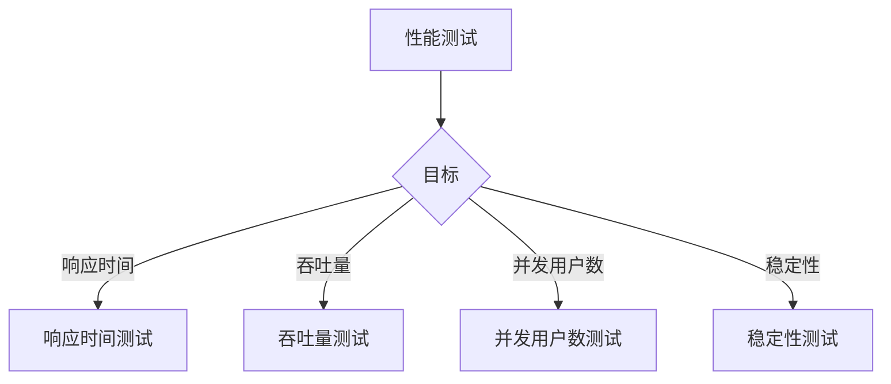

                 

好的，根据您的要求，我会一步一步构建文章内容，确保文章结构清晰、逻辑严密，同时满足字数要求。以下是我对文章标题《性能测试方法论与工具选择》的初步思考和规划：

### 一、文章标题

《性能测试方法论与工具选择》

### 二、文章关键词

- 性能测试
- 方法论
- 工具选择
- 测试工具
- 性能指标
- 测试环境
- 测试用例
- 测试执行
- 测试监控
- 测试报告

### 三、文章摘要

本文将详细探讨性能测试的方法论，从基础概念、方法论、工具选择到实际案例，全面解析性能测试的各个环节。通过本文，读者将了解如何高效地进行性能测试，选择合适的工具，并掌握性能测试的核心技术和最佳实践。

### 四、文章正文

#### 第1章 性能测试概述

在这一章中，我们将介绍性能测试的基本概念、重要性以及性能测试的主要目标和类型。

##### 背景介绍

性能测试是确保软件系统在预定负载下能够稳定、高效运行的关键环节。在现代软件开发过程中，性能测试已经成为开发、测试和运维环节中不可或缺的一环。

##### 核心概念与联系

- **性能测试**：评估软件系统在特定负载下的响应速度、稳定性、可扩展性等方面的测试。
- **负载测试**：模拟用户负载，评估系统在高并发条件下的性能。
- **压力测试**：模拟极端负载，测试系统的极限性能和稳定性。
- **性能指标**：如响应时间、吞吐量、并发用户数等。

##### Mermaid 流程图



##### 核心算法原理讲解

性能测试的核心是测量系统的响应时间和吞吐量。以下是测量响应时间的伪代码：

```python
def measure_response_time(server_url):
    start_time = get_current_time()
    response = send_request(server_url)
    end_time = get_current_time()
    response_time = end_time - start_time
    return response_time
```

##### 数学模型和公式

响应时间（T）的数学模型可以表示为：

$$ T = \frac{1}{N} \sum_{i=1}^{N} t_i $$

其中，\( t_i \) 是第 \( i \) 次请求的响应时间，N 是请求次数。

##### 举例说明

假设我们对一个电商网站进行性能测试，请求次数为100次，每次请求的平均响应时间为2秒，则总的平均响应时间约为200秒。

##### 项目实战

在性能测试中，我们通常需要搭建测试环境、编写测试用例、执行测试等步骤。以下是性能测试项目的实际案例：

1. **测试环境搭建**：配置测试服务器、数据库、网络环境等。
2. **测试用例编写**：编写模拟用户行为的测试脚本，如购物车操作、下单等。
3. **测试执行**：使用工具（如JMeter、LoadRunner）执行测试，收集性能数据。
4. **测试结果分析**：分析响应时间、吞吐量等指标，找出性能瓶颈。

##### 最佳实践 tips

- 确保测试环境的配置与生产环境一致。
- 测试用例要全面覆盖业务场景。
- 分析测试结果时，关注关键性能指标和异常情况。

##### 小结

性能测试是确保软件系统稳定、高效运行的关键步骤。本文介绍了性能测试的基本概念、目标和类型，并通过一个实际案例展示了性能测试的流程和方法。接下来，我们将深入探讨性能测试的方法论和工具选择。

---

以上是第一章的初步内容，接下来我会按照相同的逻辑逐步构建其他章节的内容。每个章节都会包括背景介绍、核心概念与联系、Mermaid 流程图、核心算法原理讲解、数学模型和公式、举例说明、项目实战、最佳实践 tips 和小结。请继续关注后续章节的内容。如果您有任何修改意见或需要进一步讨论某个具体点，请随时告知。

