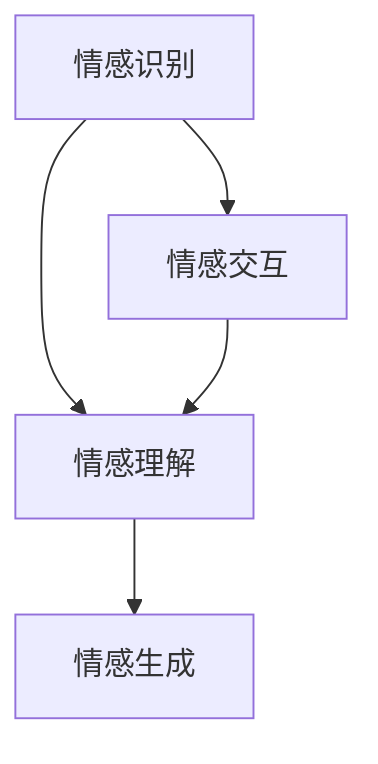

                 

### 文章标题: 情感计算新维度：提示词深度解析用户反馈

#### 关键词：情感计算、提示词、用户反馈、深度解析、人工智能

#### 摘要：
本文将深入探讨情感计算领域的新维度，特别是如何利用提示词来深度解析用户反馈。我们将首先介绍情感计算的基本概念和背景，然后分析提示词在情感计算中的关键作用，接着探讨用户反馈的类型和收集方法，并详细阐述情感计算的算法原理和数学模型。文章还将通过实际案例展示情感计算的实践应用，最终提供一些建议和展望。

## 第一部分：情感计算新维度概述

### 1.1 情感计算的概念与背景

#### 背景介绍
情感计算是指通过计算机技术和算法来识别、理解、处理和模拟人类情感的能力。它是人工智能领域的一个重要分支，旨在使计算机能够与人类情感互动，提供更加人性化的用户体验。

#### 核心概念与联系
情感计算的核心概念包括情感识别、情感理解和情感生成。这些概念相互关联，形成一个完整的情感计算框架。以下是情感计算核心概念之间的Mermaid流程图：

#### 情感计算的应用场景
情感计算的应用场景非常广泛，包括但不限于：
- 智能客服系统
- 社交媒体分析
- 个性化推荐系统
- 健康监测与心理辅导

### 1.2 提示词在情感计算中的作用

#### 提示词的定义
提示词是指用于引导用户表达情感的关键词或短语。它们在情感计算中起着关键作用，能够帮助计算机更好地理解用户的情感状态。

#### 提示词在情感计算中的应用
提示词在情感计算中的应用包括：
- 情感分析：通过提示词来提取用户的情感信息
- 交互式对话系统：使用提示词来引导用户表达情感，提供个性化的互动体验
- 情感生成：根据用户的情感信息生成相应的情感表达

#### 提示词的重要性
提示词的重要性在于：
- 提高情感分析的准确性：通过精确的提示词，计算机可以更准确地识别用户的情感
- 促进用户参与：提示词可以引导用户更积极地参与情感交互，提高用户体验

### 1.3 用户反馈的深度解析

#### 用户反馈的意义
用户反馈是理解用户需求、改进产品和服务的重要手段。深度解析用户反馈有助于：
- 识别用户情感：通过反馈了解用户的满意度和不满意度
- 优化产品功能：根据用户反馈调整产品设计和功能

#### 用户反馈的类型
用户反馈可以分为以下几种类型：
- 结构化反馈：以表格或问卷形式收集的用户反馈
- 非结构化反馈：以文本、图片或语音形式收集的用户反馈
- 交互式反馈：通过与用户实时互动收集的反馈

#### 用户反馈的处理方法
处理用户反馈的方法包括：
- 数据清洗：去除噪声数据，确保反馈的准确性和可靠性
- 文本分析：使用自然语言处理技术对用户反馈进行情感分析和主题识别
- 数据可视化：通过图表和报告呈现用户反馈的统计和分析结果

## 第二部分：情感计算的技术原理

### 2.1 情感计算的核心算法原理

#### 情感分析算法的基本概念
情感分析算法是情感计算的核心组成部分，旨在从文本数据中识别用户的情感。它通常包括以下几个步骤：
- 预处理：对文本进行清洗、分词、去停用词等操作
- 特征提取：将文本转换为机器可处理的特征向量
- 情感分类：使用分类算法对特征向量进行分类，判断用户的情感状态

#### 情感分析算法的分类
情感分析算法可以分为以下几种类型：
- 基于规则的方法：使用预定义的规则进行情感分类
- 基于机器学习的方法：使用训练数据训练分类模型
- 基于深度学习的方法：使用深度神经网络进行情感分类

#### 情感分析算法的优缺点
- 基于规则的方法：简单易实现，但灵活性较差，难以处理复杂情感
- 基于机器学习的方法：能够处理复杂情感，但需要大量的标注数据
- 基于深度学习的方法：具有强大的表达能力和灵活性，但计算复杂度高，对标注数据要求较高

### 2.2 情感计算的数学模型

#### 情感计算的相关数学公式
情感计算中常用的数学公式包括：
- 情感强度计算公式：用于计算文本中情感的强度，通常使用TF-IDF等指标
- 情感分类公式：用于分类文本的情感类别，通常使用softmax等激活函数

#### 数学模型详细讲解与举例说明
以TF-IDF为例，情感强度计算公式如下：

$$
TF(t) = \frac{f_t}{f_t + 1}
$$

$$
IDF(t) = \log \left( \frac{N}{n_t + 1} \right)
$$

$$
S_t = TF(t) \cdot IDF(t)
$$

其中，$f_t$表示词$t$在文本中的频率，$n_t$表示包含词$t$的文本数量，$N$表示总的文本数量。

假设我们有一个文本，其中包含以下词汇：

- 文本1：“我非常喜欢这款产品，它的性能非常好。”
- 文本2：“这款产品的设计很糟糕，功能也不实用。”

使用TF-IDF计算词汇“喜欢”在文本1中的情感强度：

$$
TF(“喜欢”) = \frac{1}{1 + 1} = 0.5
$$

$$
IDF(“喜欢”) = \log \left( \frac{2}{1 + 1} \right) = \log 1 = 0
$$

$$
S_{“喜欢”} = TF(“喜欢”) \cdot IDF(“喜欢”) = 0.5 \cdot 0 = 0
$$

使用TF-IDF计算词汇“糟糕”在文本2中的情感强度：

$$
TF(“糟糕”) = \frac{1}{1 + 1} = 0.5
$$

$$
IDF(“糟糕”) = \log \left( \frac{2}{1 + 1} \right) = \log 1 = 0
$$

$$
S_{“糟糕”} = TF(“糟糕”) \cdot IDF(“糟糕”) = 0.5 \cdot 0 = 0
$$

通过计算，我们可以发现“喜欢”和“糟糕”这两个词汇在两个文本中的情感强度均为0。这表明，这两个词汇在文本中的情感表达并不强烈。

### 2.3 情感计算的算法实现与优化

#### 算法实现
情感计算算法的实现通常包括以下几个步骤：
- 数据收集：收集包含情感信息的文本数据
- 数据预处理：对文本进行清洗、分词、去停用词等操作
- 特征提取：将文本转换为机器可处理的特征向量
- 模型训练：使用训练数据训练分类模型
- 模型评估：使用测试数据评估模型的性能

#### 算法优化
算法优化是提高情感计算性能的重要手段，包括以下几个方面：
- 特征选择：选择对情感计算影响最大的特征
- 模型调参：调整模型的参数，提高模型的性能
- 数据增强：使用数据增强技术，提高数据的多样性和质量

## 第三部分：情感计算的实践应用

### 3.1 情感计算在智能客服系统中的应用

#### 智能客服系统的架构
智能客服系统的架构通常包括以下几个部分：
- 前端界面：与用户进行交互的界面
- 自然语言处理模块：处理用户输入的文本信息
- 情感分析模块：分析用户的情感状态
- 后端服务：提供客服服务和支持

#### 情感计算在智能客服系统中的应用
情感计算在智能客服系统中的应用包括：
- 情感识别：识别用户的情感状态，如愤怒、高兴、失望等
- 情感分类：将情感分类为积极或消极
- 情感响应：根据用户的情感状态，提供相应的情感化响应

#### 案例分析
以下是一个智能客服系统的案例分析：

用户输入：“我非常生气，你们的快递服务太差了。”

- 情感识别：系统识别出用户情感为愤怒
- 情感分类：系统将愤怒分类为消极情感
- 情感响应：系统自动生成一条回复：“非常抱歉让您感到不满，我们将尽快解决您的问题。”

### 3.2 情感计算在社交媒体分析中的应用

#### 社交媒体分析的目的
社交媒体分析旨在从社交媒体平台上收集和解析用户反馈，以便：
- 了解用户对品牌和产品的态度
- 识别潜在的客户需求和问题
- 监测市场趋势和竞争环境

#### 社交媒体分析的方法
社交媒体分析的方法包括：
- 文本情感分析：对用户评论和帖子进行情感分析
- 主题模型：识别社交媒体中的热点话题和趋势
- 用户行为分析：分析用户在社交媒体上的行为和偏好

#### 案例分析
以下是一个社交媒体分析案例分析：

品牌A在社交媒体上发布了一款新产品，用户反馈如下：

用户1：“这款产品的设计非常漂亮，我很喜欢。”
用户2：“这个产品的功能很差，我用了一次就放弃了。”
用户3：“我希望这款产品有更多的颜色选择。”

- 文本情感分析：系统识别出用户1的情感为积极，用户2的情感为消极，用户3的情感为中立
- 主题模型：系统识别出讨论的主要话题为产品设计、功能和颜色选择
- 用户行为分析：系统分析出用户1和用户2对品牌的关注程度较高，用户3对产品的具体需求较为关注

基于以上分析，品牌A可以针对用户反馈进行以下优化：
- 提升产品质量，解决用户2提出的功能问题
- 增加产品颜色选择，满足用户3的需求
- 加强与用户1和用户2的互动，提高用户满意度

### 3.3 情感计算在其他领域的应用

#### 情感计算在个性化推荐系统中的应用
个性化推荐系统利用情感计算技术，根据用户的情感偏好提供个性化的推荐。

#### 情感计算在健康监测与心理辅导中的应用
健康监测与心理辅导利用情感计算技术，对用户的情绪和行为进行分析，提供个性化的健康建议和心理辅导。

### 3.4 情感计算的挑战与未来发展方向

#### 挑战
- 情感识别的准确性：如何提高情感识别的准确性，是情感计算的挑战之一。
- 情感理解的深度：如何理解用户情感的深度和复杂性，是情感计算的另一个挑战。
- 数据隐私：如何在保护用户隐私的前提下，收集和处理用户情感数据。

#### 未来发展方向
- 深度学习：利用深度学习技术，提高情感计算的准确性和效率。
- 跨领域情感计算：将情感计算应用于更多领域，实现跨领域的情感理解和交互。
- 情感生成：研究情感生成技术，使计算机能够生成更加自然和丰富的情感表达。

## 结论

本文从多个角度探讨了情感计算的新维度，特别是如何利用提示词深度解析用户反馈。我们首先介绍了情感计算的基本概念和背景，然后分析了提示词在情感计算中的作用，接着探讨了用户反馈的类型和收集方法，并详细阐述了情感计算的算法原理和数学模型。文章还通过实际案例展示了情感计算的实践应用，并对未来发展方向进行了展望。

### 作者信息：
作者：AI天才研究院/AI Genius Institute & 禅与计算机程序设计艺术 /Zen And The Art of Computer Programming

