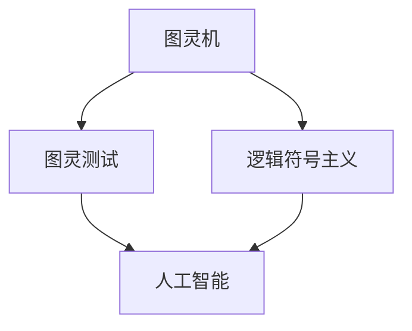

                 

 
### 第1章：人工智能的诞生与早期发展

人工智能作为一门学科，起源于20世纪中叶。其历史背景可以追溯到几个关键的事件和人物。

#### 背景介绍

在二战期间，由于密码学的需求，计算机科学开始萌芽。1940年代，艾伦·图灵（Alan Turing）提出了图灵机（Turing Machine）这一概念，为后来的计算机科学奠定了基础。图灵认为，如果一台机器能够模仿人类的思维过程，那么它就可以被认为具有智能。

#### 核心概念与联系

以下是人工智能发展的核心概念及它们之间的联系：

- **图灵机（Turing Machine）**：图灵机是抽象的计算机模型，由一个无限长的纸带、读写头和一系列状态组成。图灵机的概念揭示了计算的本质。
  
- **图灵测试（Turing Test）**：图灵测试是衡量机器是否具有智能的标准。如果一个机器能够以一种让人类无法区分其与人类对话的方式进行交流，那么这个机器就可以被认为具有智能。

- **逻辑符号主义（Symbolic Logic）**：这一理论主张通过符号逻辑来模拟人类思维过程。逻辑符号主义是早期人工智能研究的重要理论基础。

Mermaid 流程图：



#### 核心算法原理讲解

虽然在这一时期并没有特定的算法，但以下几个概念对后续发展至关重要：

- **决策树（Decision Tree）**：决策树是一种结构化方法，用于根据一系列问题对数据进行分类。
  
- **支持向量机（Support Vector Machine，SVM）**：SVM是一种用于分类和回归分析的算法，其核心思想是找到最佳决策边界。

以下是决策树的伪代码：

```python
function DecisionTree(data, attributes):
    if all_values_identical(data):
        return majority_class(data)
    if no_more_attributes:
        return most_common_class(data)
    selected_attribute = select_best_attribute(data, attributes)
    decision_tree = {}
    sub_data = split_data(data, selected_attribute)
    for value in possible_values(selected_attribute):
        decision_tree[value] = DecisionTree(sub_data_with_value, remaining_attributes)
    return decision_tree
```

以下是SVM的伪代码：

```python
function SVM training(data, labels):
    # 使用如SMO算法来训练
    return trained_model
```

#### 数学模型和公式

在早期人工智能中，逻辑符号主义和统计方法都是核心。以下是逻辑符号主义中的一个公式示例：

$$P(A|B) = \frac{P(B|A)P(A)}{P(B)}$$

这个公式表示在给定事件B发生的条件下，事件A发生的概率。

#### 举例说明

假设我们要分类一组数据，数据包括特征`X`和标签`Y`。我们可以使用决策树来对数据进行分类：

1. 选择最佳特征（如信息增益或基尼指数）。
2. 根据该特征将数据划分为子集。
3. 递归地对子集进行分类，直到满足停止条件（如所有样本属于同一类别）。

#### 项目实战

- **开发环境搭建**：安装Python和相关的机器学习库（如scikit-learn）。
- **源代码详细实现和代码解读**：编写Python代码实现决策树和SVM，并对代码进行解读。
- **代码应用解读与分析**：使用实际数据集对算法进行测试，分析结果。
- **实际案例分析和详细讲解剖析**：分析一个实际案例，讲解如何使用决策树和SVM进行分类。
- **项目小结**：总结项目的关键点，提出最佳实践 tips。

#### 最佳实践 tips、小结、注意事项、拓展阅读等内容

- **最佳实践 tips**：在实现机器学习算法时，要注意数据预处理、特征选择和模型调优。
- **小结**：早期人工智能的核心在于模拟人类思维过程，使用逻辑和统计方法。
- **注意事项**：理解核心算法原理和数学模型对于后续学习至关重要。
- **拓展阅读**：推荐阅读《人工智能：一种现代的方法》和《机器学习》。

### 结论

本章介绍了人工智能的起源和早期发展，包括图灵机、图灵测试和逻辑符号主义等核心概念。通过这些概念，我们可以理解人工智能是如何从抽象的理论逐步走向实际应用的。下一章将深入探讨符号主义人工智能的发展。

---

接下来的章节将详细讨论符号主义人工智能的发展，包括逻辑主义、知识表示、推理方法和问题求解等。我们将继续使用一步一步分析推理思考的方式，以便让读者更好地理解这些复杂的概念。

