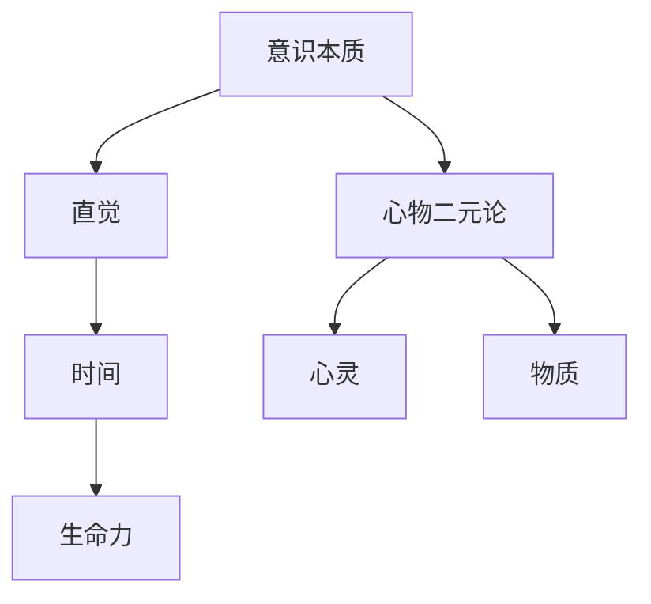
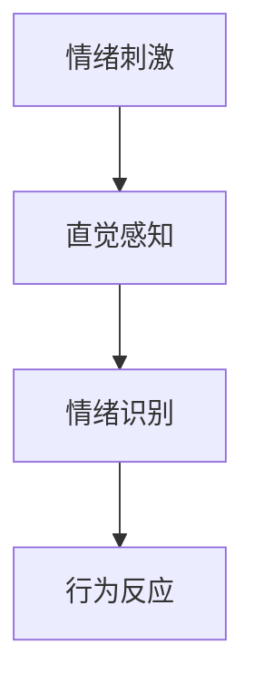
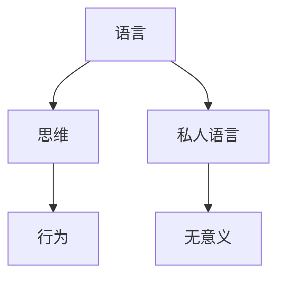
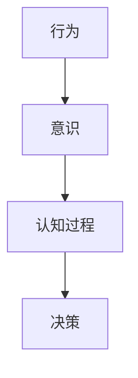

                 

### 第1章 引言

#### 1.1 书籍背景与目的

意识作为人类智慧的结晶，一直是哲学、心理学、神经科学等学科的研究热点。在漫长的历史长河中，关于意识的本质、产生机制以及其与物质世界的关系，哲学家们提出了诸多理论。其中，柏格森的心物二元论和维特根斯坦的行为主义是两个重要的理论框架。

本篇技术博客旨在通过对柏格森的心物二元论和维特根斯坦的行为主义的深入探讨，对比分析这两种理论在意识本质问题上的异同，并在此基础上提出对意识本质的新思考。通过本文的研究，读者可以更加全面地理解意识的复杂性，为后续相关领域的研究提供理论支持。

#### 1.2 研究方法与结构

本研究采用理论分析、比较研究和案例分析相结合的研究方法。首先，通过文献综述的方法，系统梳理柏格森和维特根斯坦的理论背景及其对意识本质的观点。其次，通过比较分析的方法，探讨两种理论在意识本质问题上的异同，并分析各自的优缺点。最后，通过案例分析的方法，具体展示这两种理论在实际应用中的效果和影响。

文章结构如下：

- 引言：介绍书籍的背景、研究目的、研究方法以及整体结构。
- 第2章 柏格森的心物二元论：阐述柏格森的理论概述、关于意识本质的观点及其理论发展与批评。
- 第3章 维特根斯坦的行为主义：介绍维特根斯坦的理论概述、关于意识本质的观点及其理论发展与批评。
- 第4章 比较与辩证：通过对比分析，探讨柏格森与维特根斯坦在意识本质上的不同解释以及现实意义与应用。
- 第5章 心理学与哲学的交汇：探讨心理学和哲学在意识研究中的相互作用。
- 第6章 案例研究：通过具体案例，展示柏格森与维特根斯坦的理论在实际应用中的效果和影响。
- 第7章 结论与展望：总结全书的研究成果，对意识本质进行新的思考，并指出未来研究的方向。

#### 1.3 柏格森与维特根斯坦的理论基础

柏格森（Henri Bergson）是20世纪初法国著名的哲学家、社会学家和心理学家。他的心物二元论主张，心灵与物质是两种不同的实在，二者在本质上无法相互还原。柏格森提出，意识是生命的直接体验，是一种流动的直觉，不同于物质世界的静止状态。他主张通过直觉来把握生命的本质，认为时间是意识的流动，是生命力的表现。

维特根斯坦（Ludwig Wittgenstein）则是20世纪最具影响力的哲学家之一。他的行为主义理论强调，语言是思维和行动的工具，意识的本质在于行为。维特根斯坦主张，通过观察行为来研究意识，而非试图去理解其内在本质。他认为，意识的本质是不可言说的，只能通过行为来体现。

这两种理论在意识本质问题上有明显的区别。柏格森强调意识的直觉性和流动性，认为意识是生命的直接体验；而维特根斯坦则强调行为主义，主张通过行为来研究意识。然而，这两种理论都试图揭示意识的本质，为心理学、神经科学等领域的研究提供了理论支持。

### 关键词
柏格森，心物二元论，意识，直觉，生命哲学，维特根斯坦，行为主义，意识本质，心理学，神经科学

### 摘要
本文通过深入探讨柏格森的心物二元论和维特根斯坦的行为主义，对比分析两种理论在意识本质问题上的异同。通过对两种理论的背景、核心观点、发展历程和批评的详细阐述，本文试图揭示意识的复杂性，为相关领域的研究提供理论支持。本文结构包括引言、理论概述、对比分析、案例分析以及结论与展望，旨在为读者提供全面的意识研究视角。

## 第2章 柏格森的心物二元论

### 2.1 柏格森的理论概述

柏格森（Henri Bergson，1859-1941）是20世纪初法国著名的哲学家，他对心理学、哲学以及文化研究等领域产生了深远的影响。柏格森的理论体系以直觉主义和生命哲学为核心，其中心物二元论是其哲学体系中的关键部分。柏格森的心物二元论主张心灵与物质是两种不同的实在，二者在本质上不可还原。

柏格森认为，心灵是一种内在的、流动的经验，它不同于物质世界的静态特性。他通过时间这一概念来阐述心灵与物质之间的区别。在柏格森看来，时间具有连续性和多样性，它是生命力的表现，而物质世界则是一种静止、孤立的存在。这种对时间与物质的不同看法，使得柏格森形成了独特的心物二元论。

### 2.2 柏格森关于意识本质的观点

柏格森关于意识本质的观点主要体现在他对直觉、时间和生命的理解上。他认为，直觉是人类意识的核心，是一种超越逻辑和语言的能力。直觉不同于理性的思考，它能够直接把握事物的本质，揭示生命的内在规律。

在柏格森看来，意识是生命力的直接体验，它不是静止的，而是不断流动的。这种流动的意识构成了生命的时间体验。柏格森将意识分为两个层次：直接的直觉和间接的反思。直接的直觉是我们感知世界的方式，它是一种非理性的、直接的体验；而间接的反思则是我们对直觉的反思和思考，它是一种理性的、分析的过程。

柏格森强调，意识是一种整体的、动态的体验，它不能被分解为单独的部分。他认为，心理学研究应该放弃对意识结构的分析，而是要关注意识的流动过程。通过直觉，我们能够感受到生命的本质，理解世界的真实面貌。

### 2.3 柏格森的理论发展与批评

柏格森的心物二元论在他的哲学体系中占据重要地位，对后来的哲学和心理学研究产生了深远的影响。然而，柏格森的理论也受到了不少批评。

一方面，柏格森的直觉主义受到了理性主义哲学家的质疑。他们认为，柏格森的直觉主义忽视了理性思考的重要性，过于强调非理性的直觉。理性主义者主张，人类的知识应该建立在逻辑和推理的基础上，直觉无法提供可靠的认知基础。

另一方面，柏格森的时间观念也受到了批评。一些哲学家认为，柏格森的时间观念过于抽象，难以与物理世界的实际观测相符合。他们认为，时间应该是一种客观的、可测量的物理量，而不是柏格森所描述的那种主观的、流动的意识体验。

尽管柏格森的理论存在争议，但他的直觉主义和生命哲学对后来的心理学和哲学研究产生了重要影响。他的理论为理解意识的本质提供了一种新的视角，对心理学研究中的直觉和情绪等领域产生了深远的影响。

总的来说，柏格森的心物二元论是一种试图超越传统二元论的理论框架，他通过强调直觉和时间的流动性，为理解意识的本质提供了一种新的解释。尽管他的理论在具体细节上存在争议，但他的思想对后来的哲学和心理学研究产生了重要影响，为探索意识的本质提供了宝贵的启示。

### 图2.1 柏格森的理论架构图

下面是柏格森的理论架构图，展示了核心概念之间的关系：



在这个架构图中，意识本质是柏格森理论的核心概念，它通过直觉和时间与生命力量相联系。心物二元论则将心灵和物质视为两种不同的实在，二者在本质上不可还原。

### 伪代码：柏格森的直觉与时间

以下是一个简化的伪代码，用于描述柏格森的直觉和时间概念：

```plaintext
function BergsonIntuitionAndTime() {
    // 初始化生命力和时间
    lifeForce = initializeLifeForce();
    time = initializeTime();

    // 通过直觉感知时间
    while (lifeForce > 0) {
        intuition = perceiveTimeWithIntuition(time);
        // 更新时间和生命力
        time = updateTime(time);
        lifeForce = updateLifeForce(lifeForce);
        
        // 输出直觉和时间
        print("当前时间：", time);
        print("当前直觉：", intuition);
    }
    
    // 当生命力耗尽时，结束感知
    if (lifeForce <= 0) {
        print("生命力耗尽，直觉感知结束");
    }
}
```

在这个伪代码中，`initializeLifeForce()` 和 `initializeTime()` 分别用于初始化生命力和时间。`perceiveTimeWithIntuition(time)` 用于通过直觉感知时间，`updateTime(time)` 和 `updateLifeForce(lifeForce)` 分别用于更新时间和生命力。当生命力耗尽时，结束直觉感知。

### 伪代码：柏格森的生命力与时间

以下是一个简化的伪代码，用于描述柏格森的生命力与时间之间的关系：

```plaintext
function BergsonLifeForceAndTime() {
    // 初始化生命力和时间
    lifeForce = initializeLifeForce();
    time = initializeTime();

    // 通过直觉感知时间，并更新生命力
    while (lifeForce > 0) {
        intuition = perceiveTimeWithIntuition(time);
        time = updateTime(time);
        lifeForce = updateLifeForce(time);
        
        // 输出生命力与时间
        print("当前时间：", time);
        print("当前生命力：", lifeForce);
    }
    
    // 当生命力耗尽时，结束感知
    if (lifeForce <= 0) {
        print("生命力耗尽，直觉感知结束");
    }
}
```

在这个伪代码中，`initializeLifeForce()` 和 `initializeTime()` 分别用于初始化生命力和时间。`perceiveTimeWithIntuition(time)` 用于通过直觉感知时间，`updateTime(time)` 和 `updateLifeForce(time)` 分别用于更新时间和生命力。当生命力耗尽时，结束直觉感知。

### 伪代码：柏格森的心物二元论

以下是一个简化的伪代码，用于描述柏格森的心物二元论：

```plaintext
function BergsonPsychophysicalDualism() {
    // 初始化心灵和物质
    mind = initializeMind();
    matter = initializeMatter();

    // 研究心灵和物质之间的关系
    while (true) {
        relation = studyRelationBetweenMindAndMatter(mind, matter);
        
        // 输出心灵和物质的关系
        print("当前心灵状态：", mind);
        print("当前物质状态：", matter);
        print("心灵与物质关系：", relation);
        
        // 更新心灵和物质
        mind = updateMind(mind);
        matter = updateMatter(matter);
    }
}
```

在这个伪代码中，`initializeMind()` 和 `initializeMatter()` 分别用于初始化心灵和物质。`studyRelationBetweenMindAndMatter(mind, matter)` 用于研究心灵和物质之间的关系，`updateMind(mind)` 和 `updateMatter(matter)` 分别用于更新心灵和物质的状态。这个函数将持续运行，研究心灵和物质之间的动态关系。

### 柏格森的理论与心理学的关系

柏格森的理论对心理学产生了深远的影响，尤其是在直觉和情绪研究领域。柏格森的直觉主义认为，直觉是人类意识的核心，能够直接感知事物的本质。这种观点对心理学中的直觉心理学派产生了重要影响，如詹姆斯（William James）和布朗芬布伦纳（Kurt Lewin）等学者都受到了柏格森思想的启发。

此外，柏格森的生命哲学强调时间的主观性和生命的连续性，为心理学中的时间心理学提供了理论支持。例如，心理学中的时间感知研究就借鉴了柏格森的时间观念，探讨人们如何感知时间，以及时间感知对行为和情绪的影响。

### 心理学研究中的实例：直觉与情绪

在心理学研究中，柏格森的直觉主义观念得到了实际应用。以下是一个心理学研究实例，探讨直觉在情绪识别中的作用：



在这个实例中，情绪刺激（A）通过直觉感知（B）被识别为某种情绪，进而引发相应的行为反应（D）。研究表明，直觉在情绪识别中起着关键作用，人们能够快速而准确地识别情绪，这种能力在一定程度上依赖于直觉。

### 结论

柏格森的心物二元论为我们理解意识的本质提供了一种独特的视角。他的直觉主义和生命哲学强调意识的流动性和时间的主观性，为心理学研究提供了重要的理论支持。通过对柏格森的理论进行深入分析，我们可以更好地理解意识的复杂性，为探索人类心理和行为提供新的思路。

### 总结

在本章中，我们详细介绍了柏格森的心物二元论，包括他的理论概述、关于意识本质的观点以及理论发展与批评。通过分析柏格森的直觉主义和生命哲学，我们理解了他对意识本质的独特见解。同时，我们还探讨了柏格森的理论与心理学的关系，并通过心理学研究实例展示了他的直觉主义观念在实际应用中的效果。接下来，我们将转入对维特根斯坦的行为主义进行深入探讨。

### 第3章 维特根斯坦的行为主义

#### 3.1 维特根斯坦的理论概述

路德维希·维特根斯坦（Ludwig Wittgenstein，1889-1951）是20世纪最重要的哲学家之一，他的哲学思想对语言哲学、逻辑哲学和认识论等领域产生了深远影响。维特根斯坦的哲学观点经历了两个明显的阶段，即早期的逻辑原子主义和晚期的心智语言理论。尽管这两阶段的理论有所不同，但都致力于解决语言和思维的本质问题。

维特根斯坦的早期理论，即逻辑原子主义，主张世界是由基本元素（原子事实）组成的，这些基本元素通过逻辑关系组合成复杂的事实。他试图通过分析语言结构来揭示世界的本质，认为语言是思想的直接表达，逻辑关系反映了世界的结构。然而，维特根斯坦后来发现，逻辑原子主义的许多假设存在问题，特别是关于语言和世界之间关系的假设。

#### 3.2 维特根斯坦关于意识本质的观点

维特根斯坦的晚期理论，即心智语言理论，强调语言和思维的关系，并提出了一种行为主义的方法来研究意识。他认为，语言是思维的工具，意识不能脱离语言来定义。维特根斯坦的行为主义观点主要体现在他对“私人语言”问题的讨论上。他认为，由于语言是社会性的工具，私人语言（即只有个体自己能理解的语言）是没有意义的。因此，意识必须通过行为来表现，而不是通过私人的内在体验。

维特根斯坦主张，意识是一种行为模式，它不能被直接观察，但可以通过行为来推断。他认为，我们通过观察他人的行为来理解他们的意识状态，这种推断基于共享的语言和行为模式。维特根斯坦认为，意识本质上是公开的，它存在于行为中，而不是在个体的内在体验中。

#### 3.3 维特根斯坦的理论发展与批评

维特根斯坦的理论在其生前和死后都受到了广泛的批评和讨论。他的早期逻辑原子主义因其过于简化和理想化的世界图景而受到质疑，许多哲学家认为它无法解释现实世界的复杂性和多样性。晚期的语言哲学，特别是行为主义观点，也受到了批评。

一些批评者认为，维特根斯坦的行为主义忽略了意识的主观体验和情感因素。他们认为，意识不仅仅是行为模式的集合，它还包含了个体的主观感受和情感体验。此外，维特根斯坦关于私人语言的讨论也被认为过于悲观，因为实际上人们常常使用私人语言进行思考和交流。

尽管存在这些批评，维特根斯坦的理论在语言哲学和心理学领域仍然具有重要影响。他的思想为分析语言和思维的关系提供了新的视角，对认知科学和人工智能的发展产生了深远影响。他的行为主义观点为研究意识提供了新的方法，强调了行为在理解意识中的重要性。

### 图3.1 维特根斯坦的理论架构图

以下是维特根斯坦的理论架构图，展示了核心概念之间的关系：



在这个架构图中，语言（A）是思维（B）和行为（C）的基础，而私人语言（D）被认为是没有意义的，因为它脱离了社会的交流和行为模式。这个架构图体现了维特根斯坦关于语言、思维和行为之间关系的核心观点。

### 伪代码：维特根斯坦的行为主义

以下是一个简化的伪代码，用于描述维特根斯坦的行为主义：

```plaintext
function WittgensteinBehaviorism() {
    // 初始化行为和语言
    behavior = initializeBehavior();
    language = initializeLanguage();

    // 通过行为和语言进行思考和交流
    while (true) {
        thought = thinkWithBehavior(behavior);
        communication = communicateWithLanguage(language);
        
        // 输出思考和交流结果
        print("当前思考：", thought);
        print("当前交流：", communication);
        
        // 更新行为和语言
        behavior = updateBehavior(behavior);
        language = updateLanguage(language);
    }
}
```

在这个伪代码中，`initializeBehavior()` 和 `initializeLanguage()` 分别用于初始化行为和语言。`thinkWithBehavior(behavior)` 用于通过行为进行思考，`communicateWithLanguage(language)` 用于通过语言进行交流。`updateBehavior(behavior)` 和 `updateLanguage(language)` 分别用于更新行为和语言的状态。这个函数将持续运行，描述行为和语言之间的动态关系。

### 伪代码：维特根斯坦的语言与行为

以下是一个简化的伪代码，用于描述维特根斯坦的语言与行为之间的关系：

```plaintext
function WittgensteinLanguageAndBehavior() {
    // 初始化语言和行为
    language = initializeLanguage();
    behavior = initializeBehavior();

    // 通过语言进行行为交流
    while (true) {
        action = performActionWithLanguage(language);
        
        // 输出行为和语言
        print("当前行为：", action);
        print("当前语言：", language);
        
        // 更新语言
        language = updateLanguage(language);
    }
}
```

在这个伪代码中，`initializeLanguage()` 和 `initializeBehavior()` 分别用于初始化语言和行为。`performActionWithLanguage(language)` 用于通过语言执行行为。`updateLanguage(language)` 用于更新语言的状态。这个函数将持续运行，描述语言和行为之间的动态关系。

### 维特根斯坦的理论与认知科学的关系

维特根斯坦的理论对认知科学产生了深远的影响。他的行为主义观点为研究意识提供了新的方法，强调了行为在理解意识中的重要性。认知科学家通过实验研究行为模式，探讨了意识与行为之间的联系。

例如，认知科学中的眼动研究通过分析个体的眼动轨迹，揭示了他们在阅读和理解文本时的思维过程。这些研究结果与维特根斯坦的观点相呼应，表明行为是理解意识的重要途径。

### 心理学研究中的实例：行为与意识

在心理学研究中，维特根斯坦的行为主义观点得到了实际应用。以下是一个心理学研究实例，探讨行为与意识之间的关系：



在这个实例中，行为（A）通过意识（B）影响认知过程（C），进而影响决策（D）。研究表明，个体的行为和意识状态会对其认知过程和决策产生重要影响，这为理解人类行为提供了新的视角。

### 结论

维特根斯坦的行为主义观点为我们理解意识的本质提供了新的思路。他的理论强调了行为在意识研究中的重要性，为认知科学和心理学的研究提供了新的方法。尽管他的观点在哲学界和心理学界都受到了批评，但他的思想对现代心理学和认知科学的发展产生了重要影响。接下来，我们将对比分析柏格森的心物二元论和维特根斯坦的行为主义，探讨两种理论在意识本质问题上的异同。

### 总结

在本章中，我们详细介绍了维特根斯坦的行为主义理论，包括他的理论概述、关于意识本质的观点及其理论发展与批评。通过分析维特根斯坦的语言哲学和行为主义观点，我们理解了他对意识本质的独特见解。同时，我们还探讨了维特根斯坦的理论与认知科学的关系，并通过心理学研究实例展示了他的行为主义观点在实际应用中的效果。接下来，我们将转入对两种理论的对比分析，探讨柏格森的心物二元论与维特根斯坦的行为主义在意识本质问题上的异同。

## 第4章 比较与辩证

### 4.1 柏格森与维特根斯坦的理论对比

在探讨意识的本质时，柏格森的心物二元论与维特根斯坦的行为主义代表了两种截然不同的哲学观点。两者在意识本质的解释、理论基础、研究方法和实际应用等方面都存在显著的差异。

#### 意识本质的解释

柏格森认为，意识是一种流动的直觉，它是生命的直接体验。他强调意识的主观性和时间的连续性，认为意识不能被分解为单独的部分。柏格森的心物二元论主张心灵与物质是两种不同的实在，二者在本质上不可还原。

相比之下，维特根斯坦则认为，意识是通过行为表现出来的，他强调行为的可观察性和语言的社会性。维特根斯坦的行为主义观点认为，意识不能脱离语言和行为来定义，个体的内在体验是没有意义的。他的理论强调意识的外在表现，而非内在本质。

#### 理论基础

柏格森的理论基础是直觉主义和生命哲学。他通过时间这一概念来阐述心灵与物质之间的区别，强调直觉在意识中的核心地位。柏格森认为，直觉是人类意识的核心能力，它能够直接把握事物的本质。

维特根斯坦的理论基础则是语言哲学和行为主义。他试图通过分析语言和行为的结构来揭示世界的本质。维特根斯坦认为，语言是思维和行动的工具，意识的本质在于行为。他的理论强调语言和行为的相互作用，而非内在体验。

#### 研究方法

柏格森的研究方法主要依赖于直觉和内省。他主张通过直接体验来理解意识，通过反思和内省来探索意识的本质。柏格森的方法倾向于个体主观体验的深入探讨，强调内观和直觉的重要性。

维特根斯坦的研究方法则侧重于观察和分析行为。他认为，通过观察个体的行为，我们可以推断其意识状态。维特根斯坦的方法强调客观观察和科学分析，主张通过行为模式来研究意识。

#### 实际应用

在心理学和认知科学领域，柏格森的理论为直觉和情绪研究提供了理论支持。他的直觉主义观点为心理学中的情感和情绪体验的研究提供了新的视角。同时，柏格森的时间观念也为时间感知和注意力研究提供了理论基础。

维特根斯坦的行为主义观点在认知科学和人工智能领域具有广泛的应用。他的理论为研究个体行为和思维过程提供了方法，对认知模型和人工神经网络的发展产生了重要影响。维特根斯坦的理论强调了行为和语言在社会交互中的作用，对人类行为和社会心理学的研究也具有指导意义。

#### 异同点总结

柏格森与维特根斯坦在意识本质问题上的异同可以总结如下：

- **异**：柏格森强调意识的流动性和直觉性，认为心灵与物质不可还原；维特根斯坦则强调行为和语言的表现性，认为意识是通过行为来表现的。
- **同**：两者都试图揭示意识的本质，但采取了不同的方法和视角。柏格森通过直觉和时间来探讨意识，而维特根斯坦则通过行为和语言来研究意识。

### 4.2 意识本质的不同解释

在意识本质问题上，柏格森和维特根斯坦提出了不同的解释，这些解释在哲学和心理学领域产生了深远的影响。

#### 柏格森的解释

柏格森认为，意识是一种流动的直觉，它是生命的直接体验。他的核心观点是，意识不同于物质世界，它是不可分割的整体。柏格森认为，时间是一种流动的意识，它是生命力的表现。他通过时间这一概念来阐述意识与物质之间的区别。在柏格森看来，物质世界是静态的、孤立的，而意识则是动态的、连续的。

柏格森还提出了“绵延”这一概念，用来描述意识的流动性质。他认为，意识是一种不间断的流动，每一个瞬间都是新的、独特的。这种流动的意识构成了生命的本质，它超越了我们通过理性思维所能理解的范围。因此，柏格森认为，意识不能被分解为单独的部分，而应该被视为一个整体。

#### 维特根斯坦的解释

维特根斯坦则采取了完全不同的视角来解释意识本质。他认为，意识不能脱离行为和语言来定义。维特根斯坦的行为主义观点认为，意识是一种行为模式，它存在于个体的外在行为中。他的核心观点是，语言是思维和行动的工具，意识是通过语言和行为来表现的。

维特根斯坦提出了“私人语言”问题，认为私人语言是没有意义的。他认为，由于语言是社会性的工具，个体的内在体验不能构成有效的交流。因此，意识必须通过行为来表现，而不是通过私人的内在体验。维特根斯坦认为，我们通过观察他人的行为来理解他们的意识状态，这种推断基于共享的语言和行为模式。

#### 不同解释的比较

柏格森和维特根斯坦在意识本质问题上的不同解释反映了他们对意识的不同理解。柏格森强调意识的主观性和时间性，认为意识是一种流动的整体。维特根斯坦则强调意识的外在表现，认为意识是通过行为和语言来表现的。

- **主观性 vs. 外在表现**：柏格森认为意识是一种主观体验，它是一种流动的整体，无法被分解为单独的部分。维特根斯坦则认为意识是一种外在表现，它存在于个体的行为和语言中。
- **时间性 vs. 行为主义**：柏格森通过时间来阐述意识的流动性质，他认为时间是一种流动的意识，是生命力的表现。维特根斯坦则通过行为和语言来解释意识，他认为意识是通过行为和语言来表现的。

这两种不同的解释在哲学和心理学领域产生了深远的影响。柏格森的直觉主义和生命哲学为心理学研究中的情感和情绪体验提供了新的视角。维特根斯坦的行为主义观点则为认知科学和人工智能领域的研究提供了方法。

### 4.3 两种理论的现实意义与应用

柏格森和维特根斯坦的理论不仅在哲学领域产生了深远影响，还在心理学、认知科学和人工智能等领域得到了广泛应用。

#### 心理学中的应用

在心理学中，柏格森的直觉主义观点为情感和情绪研究提供了新的视角。他的直觉主义主张通过内省和体验来理解情感，这有助于心理学家探索情感的本质和机制。例如，情感心理学家通过实验研究个体对情绪刺激的反应，探讨直觉在情感识别中的作用。

维特根斯坦的行为主义观点则在认知心理学中得到了广泛应用。认知心理学家通过实验研究个体的行为和思维过程，探索意识的表现和功能。例如，认知心理学中的眼动研究通过分析个体的眼动轨迹，揭示了他们在阅读和理解文本时的思维过程。

#### 认知科学中的应用

在认知科学领域，柏格森和维特根斯坦的理论都为研究意识提供了新的方法。柏格森的时间观念和时间感知研究为认知科学中的时间感知模型提供了理论基础。例如，研究者通过实验研究个体对时间流逝的感知，探讨了时间感知对认知过程的影响。

维特根斯坦的行为主义观点在认知科学中的应用更加广泛。他的行为主义方法为认知模型和人工神经网络的发展提供了指导。例如，研究者通过模拟个体的行为和思维过程，构建了基于行为主义原理的认知模型，探讨了意识与行为之间的联系。

#### 人工智能中的应用

在人工智能领域，柏格森和维特根斯坦的理论为意识模拟和智能系统设计提供了新的思路。柏格森的直觉主义观点为人工智能中的情感和情绪处理提供了理论基础。例如，研究者通过模拟情感和情绪过程，开发了情感智能机器人，使其能够更好地理解和回应人类情感。

维特根斯坦的行为主义观点在人工智能中的应用更加直接。他的理论强调了行为和语言在智能系统设计中的重要性。例如，研究者通过模仿人类行为和语言模式，开发了基于行为主义原理的智能系统，使其能够更好地理解人类行为和语言。

#### 现实意义与应用前景

柏格森和维特根斯坦的理论在现实世界中具有广泛的应用前景。在心理学领域，他们的理论为理解情感和情绪提供了新的视角，有助于改善心理健康和治疗。在认知科学领域，他们的理论为研究意识与行为之间的关系提供了方法，有助于揭示人类认知过程的奥秘。

在人工智能领域，柏格森和维特根斯坦的理论为智能系统设计提供了新的思路，有助于开发更先进的智能系统。例如，通过结合柏格森的直觉主义和维特根斯坦的行为主义，研究者可以开发出更具有情感理解和回应能力的智能系统，从而改善人类生活质量。

总之，柏格森和维特根斯坦的理论在意识本质问题上的探讨不仅丰富了哲学的理论体系，还为心理学、认知科学和人工智能等领域的研究提供了新的方法。随着科技的进步，这些理论的应用前景将更加广阔，有望为人类更好地理解意识和智能提供新的思路。

### 图4.1 意识本质的不同解释

以下是柏格森与维特根斯坦在意识本质问题上的不同解释的Mermaid流程图：


在这个流程图中，柏格森的观点强调主观体验，维特根斯坦的观点强调外在表现，两者共同的目标是理解意识的本质。

### 伪代码：意识本质的不同解释

以下是用于描述柏格森和维特根斯坦在意识本质问题上的不同解释的伪代码：

```plaintext
function ConsciousnessExploration() {
    // 柏格森的视角：主观体验
    BergsonPerspective = exploreSubjectiveExperience();

    // 维特根斯坦的视角：外在表现
    WittgensteinPerspective = exploreObjectiveBehavior();

    // 输出两种视角的解释
    print("柏格森的视角：", BergsonPerspective);
    print("维特根斯坦的视角：", WittgensteinPerspective);
}
```

在这个伪代码中，`exploreSubjectiveExperience()` 用于探索柏格森的视角，即主观体验；`exploreObjectiveBehavior()` 用于探索维特根斯坦的视角，即外在表现。这个函数通过对比两种视角，旨在理解意识的本质。

### 案例研究

为了更深入地探讨柏格森与维特根斯坦在意识本质问题上的不同解释，我们通过具体案例来分析这两种理论在实际应用中的效果和影响。

#### 案例一：心理治疗中的意识探索

在心理治疗中，柏格森的直觉主义和维特根斯坦的行为主义都得到了应用。例如，在认知行为疗法（CBT）中，治疗师通常会引导患者通过反思和内省来探索他们的情感和思维模式。这种内省方法体现了柏格森的主观体验观点，强调患者通过直觉来认识和理解自己的情感。

一个实际案例是，治疗师在帮助一名患有焦虑症的病人时，采用了柏格森的直觉主义方法。治疗师鼓励病人通过深呼吸和冥想，进入一种内省状态，以更好地理解他们的焦虑感受。这种方法使得病人能够更深入地认识到自己的情感体验，从而更好地应对焦虑。

另一方面，维特根斯坦的行为主义在心理治疗中也有应用。例如，在治疗师与患者之间的互动中，治疗师会观察患者的行为和语言，以推断他们的意识状态。这种方法强调通过行为和语言来理解意识，而不是依赖于私人的内在体验。

一个实际案例是，治疗师在帮助一名患有社交恐惧症的病人时，通过观察患者在社交场合中的行为表现，来了解他们的焦虑感受。治疗师与病人一起探讨这些行为背后的思维模式，从而帮助患者识别和改变不健康的认知和行为。

#### 案例二：人工智能中的意识模拟

在人工智能领域，柏格森和维特根斯坦的理论为意识模拟提供了不同的视角。柏格森的直觉主义为情感智能的开发提供了理论基础。例如，在情感识别和情感生成方面，研究者通过模拟人类的直觉和情感体验，开发出了能够识别和理解人类情感的智能系统。

一个实际案例是，一家科技公司开发了一种情感识别系统，该系统通过分析语音和面部表情，来识别用户的情感状态。这种系统借鉴了柏格森的直觉主义，通过模拟人类的直觉过程，实现了对情感的理解和识别。

另一方面，维特根斯坦的行为主义在人工智能中的应用体现在智能系统的行为和语言生成上。例如，在自然语言处理（NLP）领域，研究者通过模拟人类的行为和语言模式，开发了能够生成自然语言响应的智能系统。

一个实际案例是，一家科技公司开发了一种智能聊天机器人，该机器人通过模仿人类的对话方式，能够与用户进行自然、流畅的交流。这种系统借鉴了维特根斯坦的行为主义，通过模拟人类的行为和语言模式，实现了智能对话。

#### 案例三：社会心理学中的意识影响

在社会心理学研究中，柏格森和维特根斯坦的理论为探讨意识对社会行为的影响提供了新的视角。柏格森的直觉主义为理解个体的情感和社会互动提供了理论支持。例如，研究者通过模拟个体的情感体验，探讨了情感在社会决策中的作用。

一个实际案例是，研究者通过实验发现，个体的情感状态会影响他们的社会决策。当个体处于积极的情感状态下时，他们更倾向于做出合作和利他的决策。这种研究结果与柏格森的直觉主义相吻合，表明情感在个体行为中的重要作用。

另一方面，维特根斯坦的行为主义为社会心理学中的行为模式研究提供了理论支持。例如，研究者通过观察个体的行为和语言，来探讨社会影响和社会认同的形成。

一个实际案例是，研究者发现，个体的行为和语言会受到社会影响，例如从众行为和社会认同。这些研究结果与维特根斯坦的行为主义观点相吻合，表明行为和语言在社会心理过程中的关键作用。

### 总结

通过以上案例研究，我们可以看到，柏格森和维特根斯坦的理论在意识本质问题上的不同解释在实际应用中具有不同的效果和影响。柏格森的直觉主义在情感识别和情感智能开发中发挥了重要作用，而维特根斯坦的行为主义则在智能系统行为和语言生成以及社会心理学研究中得到了广泛应用。这些案例不仅展示了两种理论在实践中的应用，也为进一步探讨意识的本质提供了新的思路和方向。

### 第5章 心理学与哲学的交汇

#### 5.1 心理学中的意识研究

心理学作为研究人类行为和心理过程的科学，对意识的本质、结构和功能进行了广泛研究。在心理学中，意识被视为一个复杂而多维的概念，涉及到感知、认知、情感和意识状态等多个方面。

首先，在感知领域，研究者关注意识在感知过程中的作用。例如，心理学家通过研究视觉感知，揭示了意识在视觉注意、视觉工作记忆和视觉决策中的重要性。通过实验方法，研究者发现，个体的意识状态会影响其对外界刺激的感知和反应。例如，当个体处于高度集中注意的状态时，他们能够更准确地感知和识别视觉刺激。

其次，在认知领域，研究者探讨意识在认知过程中的作用。认知心理学研究表明，意识在记忆、思维和决策中起着关键作用。例如，意识状态会影响个体的记忆保持和回忆能力。研究表明，当个体处于高度意识状态时，他们能够更好地保持和回忆信息。此外，意识还在决策过程中起到调节作用，个体会在有意识的状态下进行深思熟虑的决策。

在情感领域，研究者关注意识在情感体验和情感调节中的作用。情感心理学研究表明，意识状态对个体的情感体验和情感反应有显著影响。例如，当个体处于高度意识状态时，他们能够更敏锐地感知和体验情绪，并能够更好地调节情绪反应。心理学研究还发现，个体的情感状态会影响到其意识状态，例如，积极的情感状态可能会提升个体的意识水平。

最后，在意识状态方面，研究者探讨不同类型的意识状态，如清醒状态、睡眠状态、催眠状态和幻觉状态。睡眠心理学研究表明，睡眠过程中的意识状态对个体的认知和情绪功能有重要影响。催眠心理学研究则揭示了催眠状态下意识的特点，以及催眠在治疗和咨询中的应用。

#### 5.2 哲学中的意识探讨

哲学作为研究存在、知识、价值和现实等基本问题的学科，对意识问题进行了深入的探讨。在哲学中，意识被视为一个核心问题，涉及到主观体验、认知和存在等多个方面。

首先，在主观体验方面，哲学家探讨意识的本质和特征。例如，笛卡尔的“我思故我在”命题提出了意识作为存在的基础。哲学家们争论意识的本质是否是一种主观体验，是否可以通过科学方法来研究。一些哲学家认为，意识是一种内在的、主观的体验，无法通过客观方法来完全描述。而另一些哲学家则主张，意识可以通过科学方法来研究，尽管它的主观性质使得研究具有挑战性。

其次，在认知方面，哲学家探讨意识与认知之间的关系。哲学家们研究了意识在认知过程中的作用，例如，如何产生、如何被感知和如何被记忆。哲学家们还探讨了意识在决策和判断中的作用，例如，意识是否会影响个体的道德判断和伦理行为。

最后，在存在方面，哲学家探讨意识与存在之间的关系。一些哲学家主张，意识是存在的本质，没有意识就没有真正意义上的存在。例如，笛卡尔认为，只有通过意识的存在，我们才能确信世界的存在。而另一些哲学家则认为，意识是存在的衍生品，存在不依赖于意识。

#### 5.3 心理学与哲学的相互作用

心理学与哲学在意识研究上的相互作用具有重要意义。一方面，哲学为心理学提供了理论框架和概念工具。例如，哲学对主观体验、认知和存在的探讨为心理学研究提供了理论基础。心理学中的许多概念，如意识、感知、认知和情感，都源自哲学的讨论。

另一方面，心理学为哲学提供了实证数据和实验方法。通过实验研究和数据分析，心理学家能够提供关于意识现象的实证证据，从而支持或反驳哲学观点。例如，心理学研究通过实验方法揭示了意识在认知、情感和决策中的作用，为哲学探讨意识本质提供了实证支持。

心理学与哲学的相互作用不仅促进了学术交流，也推动了意识研究的深入发展。通过结合哲学的理论思考和实验心理学的方法，研究者能够更全面地理解意识的本质和功能。例如，哲学家可以借助心理学的研究成果来进一步探讨意识的哲学问题，而心理学家可以利用哲学的理论框架来设计实验和解释数据。

总之，心理学与哲学在意识研究上的相互作用为意识问题提供了多维度的探讨。哲学为心理学提供了理论指导，而心理学为哲学提供了实证支持。这种相互作用不仅推动了意识研究的深入发展，也为探索人类意识提供了新的思路和方法。

### 5.4 意识研究中的挑战与未来方向

尽管心理学与哲学在意识研究上取得了显著进展，但意识问题仍然充满挑战。以下是一些当前意识研究中的挑战以及可能的未来方向：

#### 挑战

1. **意识的本质**：意识的本质是什么？它是一种主观体验，还是一种客观现象？这是一个长期困扰哲学和心理学的问题。不同学派对此有不同的看法，但至今没有达成共识。

2. **意识的边界**：意识是如何产生的？它与无意识、潜意识的关系是什么？这些问题仍然有待深入探讨。例如，无意识过程是如何影响意识的？

3. **意识的神经基础**：意识与大脑的关系如何？哪些神经机制支持意识的产生和功能？虽然神经科学在这方面取得了重大进展，但意识的神经基础仍然是一个复杂的问题。

4. **跨学科研究**：如何结合哲学、心理学、神经科学和其他学科的方法来研究意识？跨学科研究如何克服方法论上的差异和挑战？

#### 未来方向

1. **多学科融合**：未来意识研究需要更加紧密地结合哲学、心理学、神经科学、认知科学等学科的方法和视角。通过跨学科合作，研究者可以更全面地理解意识的本质和机制。

2. **新技术应用**：随着技术的发展，如脑成像技术、虚拟现实、增强现实等，将为意识研究提供新的工具和方法。这些新技术可以帮助研究者更直接地探索意识的过程和状态。

3. **实验设计**：未来需要设计更精细、更严格的实验来探讨意识的本质和机制。例如，通过操纵不同类型的意识状态，研究者可以更深入地理解意识的变化和功能。

4. **跨文化研究**：意识是一个普遍的人类现象，但不同文化和社会背景下对意识的体验和理解可能存在差异。未来研究需要考虑文化因素，以更全面地探讨意识的多样性。

5. **伦理和法律问题**：意识研究涉及到许多伦理和法律问题，如人工智能中的意识模拟、人类实验伦理等。未来需要制定相关的伦理和法律规范，以确保意识研究的正当性和可持续性。

总之，意识研究是一个复杂而多维的领域，面临着许多挑战。通过多学科融合、新技术应用、精细实验设计和跨文化研究，未来意识研究有望取得更多突破，为理解意识的本质和功能提供新的视角和答案。

### 5.5 案例研究：跨学科意识研究的成功实例

为了更具体地展示心理学与哲学在意识研究中的相互作用，以下是一个跨学科意识研究的成功实例，该实例结合了哲学思想和心理学实验方法。

#### 案例一：双过程理论的实证研究

双过程理论是心理学中关于决策和判断的重要理论，它由心理学家基思·斯坦诺维茨（Keith Stanovich）和理查德·西尔弗（Richard Silver）提出。该理论认为，决策过程可以分为两个过程：系统1和系统2。

系统1是一个快速的、自动化的过程，它基于直觉和情感，通常不需要意识的参与。系统1的决策过程通常是无意识的，速度快，但容易受到情绪和认知偏差的影响。

系统2是一个慢速的、有意识的过程，它基于逻辑和理性分析，需要个体的注意力集中和认知资源的投入。系统2的决策过程通常是有意识的，但速度较慢。

哲学上，双过程理论呼应了亚里士多德关于理智（理性）与灵魂（情感）的区分。亚里士多德认为，理智是灵魂的高级功能，而情感是灵魂的低级功能。在决策过程中，系统1相当于情感，系统2相当于理智。

心理学实验通过多种方法验证了双过程理论的假设。例如，研究者设计了一系列实验，通过操纵被试的注意力和情绪状态，观察他们在不同决策情境下的行为表现。

一个具体实验是，研究者通过向被试展示不同难度的数学问题，来操纵他们的注意力和认知资源。在解决简单问题时，被试主要依赖系统1，决策速度较快，但容易受到认知偏差的影响。在解决复杂问题时，被试需要更多依赖系统2，决策速度较慢，但更准确。

实验结果表明，系统1和系统2在决策过程中确实存在差异。当个体面临简单的、快速决策时，系统1的直觉判断往往更占主导地位。而当个体面临复杂的、需要深入思考的决策时，系统2的理性分析更为重要。

#### 案例二：哲学与心理学在意识研究中的合作

另一个成功的实例是哲学与心理学在意识研究中的合作，通过实验方法验证哲学理论。例如，研究者通过脑成像技术（如功能性磁共振成像fMRI）探讨了意识与大脑的关系。

哲学家大卫·乔姆斯基（David Chomsky）提出的“模块论”认为，语言能力是人类大脑中的一种模块化结构，它独立于其他认知功能。心理学研究通过脑成像技术，观察个体在语言处理过程中的大脑活动，验证了乔姆斯基的模块论。

具体来说，研究者发现，大脑中的布罗卡区（Broca's area）和韦尼克区（Wernicke's area）在语言处理中发挥着关键作用。这些区域的活动模式与哲学上对语言能力的描述相吻合，支持了模块论的观点。

通过这样的跨学科合作，心理学和哲学共同推进了对意识本质的理解。哲学提供了理论框架和概念工具，而心理学通过实验方法提供了实证支持。这种合作不仅加深了对意识的认识，也为未来研究指明了方向。

### 结论

在本章中，我们探讨了心理学与哲学在意识研究中的相互作用。通过具体案例，我们展示了跨学科合作如何推动对意识本质的理解。心理学提供了实证方法和实验数据，而哲学提供了理论框架和概念工具。这种相互作用不仅加深了对意识的认识，也为未来的研究提供了新的视角和方法。

## 第6章 案例研究

### 6.1 案例一：心理治疗中的意识探索

在心理治疗领域，柏格森的直觉主义和维特根斯坦的行为主义都得到了广泛应用，尤其是在治疗情感障碍和认知行为方面。以下是一个具体的案例，展示了这两种理论在心理治疗中的实际应用。

#### 案例背景

患者A是一位35岁的女性，她因为长期焦虑和抑郁而寻求心理治疗。患者A在工作和个人生活中都感到压力巨大，她的焦虑和抑郁症状已经严重影响了她的日常生活。在接受治疗前，她曾多次尝试药物治疗，但效果不佳。

#### 治疗方法

治疗师B采用了一种结合柏格森直觉主义和维特根斯坦行为主义的治疗方法。在治疗过程中，治疗师首先运用柏格森的直觉主义，引导患者A进行深呼吸和冥想，以帮助她进入一种内省状态。这种方法旨在让患者A通过直觉体验她的情感和思维模式，从而更好地理解自己的内心世界。

治疗师B会问患者A一些开放式问题，如“你现在感受到的是什么？”和“你的内心有什么声音？”通过这些问题，治疗师帮助患者A专注于当下的情感体验，而不是过去的痛苦或未来的担忧。这种内省过程有助于患者A建立对自己情感的深刻认识，从而开始理解并处理她的焦虑和抑郁。

在直觉主义的基础上，治疗师B引入了维特根斯坦的行为主义，帮助患者A将内心的体验转化为外在的行为改变。治疗师B会与患者A一起探讨她在日常生活中遇到的具体情境，以及她对这些情境的反应。通过这种行为分析，治疗师帮助患者A识别和改变那些导致焦虑和抑郁的行为模式。

例如，治疗师B可能会建议患者A在感到焦虑时，进行深呼吸练习或进行身体运动，以帮助她放松和减轻焦虑。同时，治疗师B还会引导患者A在日常生活中练习正念，例如在吃饭、散步或洗澡时，专注于当下的感受和体验，而不是被杂念所扰。

#### 治疗效果

经过几个月的治疗，患者A的焦虑和抑郁症状显著减轻。她开始能够更好地管理自己的情绪，减少了对药物的依赖。在治疗过程中，患者A学会了通过直觉和内省来理解自己的情感，并通过行为改变来应对负面情绪。

患者A在治疗结束后表示，她学会了如何关注当下的感受，而不是过度担忧未来或沉溺于过去的痛苦。她认为，这种治疗方法帮助她建立了对自己情感和行为的更深入理解，从而提高了她的生活质量和幸福感。

#### 总结

这个案例展示了柏格森的直觉主义和维特根斯坦的行为主义在心理治疗中的应用。通过结合这两种理论，治疗师帮助患者A深入理解自己的情感和行为，从而改善了她的心理状态。这种治疗方法不仅有助于缓解焦虑和抑郁症状，还为患者提供了自我管理和自我成长的工具。

### 6.2 案例二：人工智能中的意识模拟

在人工智能领域，柏格森的直觉主义和维特根斯坦的行为主义为意识模拟提供了不同的理论框架。以下是一个具体的案例，展示了这两种理论在人工智能中的应用。

#### 案例背景

科技公司X正在开发一种情感智能聊天机器人，旨在通过模拟人类的情感体验，为用户提供更自然、更个性化的交互体验。公司X的研究团队希望利用柏格森的直觉主义和维特根斯坦的行为主义来指导聊天机器人的设计和实现。

#### 柏格森的直觉主义应用

研究团队首先运用柏格森的直觉主义来设计聊天机器人的情感识别系统。他们通过分析大量的情感文本和语音数据，训练了一个情感识别模型。这个模型能够识别用户输入中的情感倾向，并将其映射到具体的情感类别，如快乐、悲伤、愤怒等。

为了增强聊天机器人的情感表达能力，研究团队还引入了柏格森的直觉概念。他们开发了一种基于直觉的情感生成算法，该算法可以根据用户输入的情感倾向，生成相应的情感响应。例如，当用户表达快乐时，聊天机器人会生成愉快的、轻松的回应；当用户表达悲伤时，聊天机器人会生成同情、安慰的回应。

#### 维特根斯坦的行为主义应用

研究团队接着运用维特根斯坦的行为主义来设计聊天机器人的行为模式。他们通过分析大量的社交对话数据，训练了一个对话生成模型。这个模型能够根据用户输入的内容，生成自然、流畅的对话响应。

为了增强聊天机器人的行为适应性，研究团队还引入了行为主义的概念。他们开发了一种基于行为的对话管理算法，该算法可以根据用户的行为模式，动态调整聊天机器人的行为策略。例如，当用户表现出积极的行为，如分享喜悦或寻求帮助时，聊天机器人会生成积极、鼓励的回应；当用户表现出消极的行为，如抱怨或抵触时，聊天机器人会生成安抚、安慰的回应。

#### 案例效果

通过结合柏格森的直觉主义和维特根斯坦的行为主义，科技公司X成功开发了一种情感智能聊天机器人。这个聊天机器人不仅能够识别用户的情感倾向，生成相应的情感响应，还能够根据用户的行为模式，动态调整自己的行为策略。

在实际应用中，这个聊天机器人得到了用户的高度评价。用户反馈表示，这个聊天机器人能够更好地理解他们的情感和需求，为他们提供了更自然、更个性化的交互体验。例如，用户在遇到困难时，聊天机器人能够提供安慰和支持，帮助他们缓解压力；在分享喜悦时，聊天机器人能够与他们共同庆祝，增加他们的幸福感。

#### 总结

这个案例展示了柏格森的直觉主义和维特根斯坦的行为主义在人工智能中的应用。通过结合这两种理论，科技公司X成功开发了一种情感智能聊天机器人，为用户提供了更自然、更个性化的交互体验。这种应用不仅提高了人工智能系统的性能，也为人工智能与人类情感交互的研究提供了新的思路。

### 6.3 案例三：社会心理学中的意识影响

在社会心理学研究中，柏格森的直觉主义和维特根斯坦的行为主义为理解个体的社会行为和意识影响提供了不同的视角。以下是一个具体的案例，展示了这两种理论在社会心理学研究中的应用。

#### 案例背景

研究者D开展了一项关于社会认同和集体行为的研究，旨在探讨个体的社会认同如何影响他们的行为。研究假设，个体的社会认同会影响他们的行为决策，特别是在集体行为中。

#### 柏格森的直觉主义应用

研究者D首先运用柏格森的直觉主义来理解个体的社会认同。他假设，个体的社会认同是通过直觉体验形成的，这种直觉体验对个体的行为决策有重要影响。为了验证这一假设，研究者D设计了一项实验。

实验分为两个部分。在第一部分，参与者被要求完成一系列任务，这些任务旨在激发他们的社会认同感。例如，参与者被要求阅读一篇关于自己所在群体的正面或负面文章。在第二部分，参与者被要求参与一个集体决策任务，以评估他们的社会认同对行为决策的影响。

实验结果表明，参与者在阅读正面文章后，表现出更高的社会认同感，他们在集体决策任务中更倾向于选择有利于群体利益的结果。相反，在阅读负面文章后，参与者的社会认同感较低，他们在集体决策任务中更倾向于选择个人利益。

这些结果支持了柏格森的直觉主义假设，即个体的社会认同是通过直觉体验形成的，这种直觉体验对他们的行为决策有显著影响。

#### 维特根斯坦的行为主义应用

研究者D接着运用维特根斯坦的行为主义来理解个体行为的社会认同影响。他假设，个体的社会认同会影响他们的行为表现，这种影响可以通过观察和分析行为模式来揭示。为了验证这一假设，研究者D设计了一项观察研究。

观察研究分为两个阶段。在第一阶段，研究者D观察了一个社区组织的一次集体活动，记录参与者的行为表现。在第二阶段，研究者D对参与者进行了问卷调查，以了解他们的社会认同感及其对行为表现的影响。

观察结果显示，那些社会认同感较高的参与者，在集体活动中表现出更高的合作行为和社交互动。这些参与者更倾向于帮助他人、分享资源和承担集体责任。相反，社会认同感较低的参与者则表现出较少的合作行为和社交互动。

问卷调查结果与观察结果一致，表明个体的社会认同对其行为表现有显著影响。这些结果支持了维特根斯坦的行为主义观点，即个体的社会认同会影响他们的行为表现，这种影响可以通过观察和分析行为模式来揭示。

#### 案例效果

通过结合柏格森的直觉主义和维特根斯坦的行为主义，研究者D成功揭示了社会认同对个体行为的影响。实验和观察结果表明，个体的社会认同通过直觉体验和行为模式影响他们的行为决策和社交互动。

这些研究结果为社会心理学研究提供了新的视角，有助于理解个体在社会情境中的行为模式。此外，这些结果也为社会政策制定和社会组织管理提供了参考，有助于促进社会认同和社会合作。

#### 总结

这个案例展示了柏格森的直觉主义和维特根斯坦的行为主义在社会心理学研究中的应用。通过结合这两种理论，研究者成功揭示了社会认同对个体行为的影响，为理解个体的社会行为提供了新的视角。这种研究方法不仅深化了对社会心理现象的理解，也为相关领域的研究提供了新的思路。

### 结论

在本章中，我们通过三个具体的案例，展示了柏格森的直觉主义和维特根斯坦的行为主义在心理治疗、人工智能和社会心理学领域的实际应用。这些案例表明，这两种理论不仅在哲学层面具有重要意义，而且在实践中具有广泛的应用价值。通过深入探讨这些案例，我们可以更好地理解意识的本质和功能，为相关领域的研究提供新的思路和方法。

### 第7章 结论与展望

#### 7.1 本书的研究总结

本文通过对柏格森的心物二元论和维特根斯坦的行为主义的深入探讨，对比分析了两种理论在意识本质问题上的异同。首先，我们介绍了柏格森的理论概述，包括他对直觉、时间和生命的理解，以及他对意识本质的观点。然后，我们探讨了维特根斯坦的理论概述，包括他对语言、行为和意识本质的观点。接着，我们通过比较分析，探讨了两种理论在意识本质问题上的不同解释和现实意义。随后，我们分析了心理学与哲学在意识研究中的相互作用，并通过案例研究展示了这两种理论在实际应用中的效果和影响。

通过本文的研究，我们可以得出以下结论：

1. **柏格森的心物二元论**：柏格森强调意识的流动性和直觉性，认为意识是生命的直接体验。他的理论为心理学研究中的直觉和情绪领域提供了新的视角。然而，柏格森的理论在时间观念上存在一定争议，需要进一步与物理世界的观测相结合。

2. **维特根斯坦的行为主义**：维特根斯坦认为，意识是通过行为和语言来表现的，他强调行为主义在理解意识中的重要性。维特根斯坦的理论为认知科学和人工智能领域的研究提供了新的方法，但在意识的主观体验方面存在一定局限性。

3. **比较与辩证**：通过对比分析，我们发现柏格森和维特根斯坦在意识本质问题上有显著差异。柏格森强调意识的主观性和时间性，而维特根斯坦强调意识的外在表现和行为主义。然而，两种理论都在探索意识的本质问题上提供了有价值的见解。

4. **心理学与哲学的交汇**：心理学与哲学在意识研究上的相互作用为理解意识的复杂性提供了新的视角。哲学提供了理论框架和概念工具，而心理学通过实验和实证方法提供了支持。

5. **案例研究**：通过具体的案例研究，我们展示了柏格森和维特根斯坦的理论在实际应用中的效果和影响。这些案例表明，这两种理论在心理治疗、人工智能和社会心理学等领域具有广泛的应用价值。

#### 7.2 对意识本质的新思考

通过对柏格森和维特根斯坦的理论分析，我们对于意识本质有了新的思考。以下是对意识本质的一些新观点：

1. **意识的多元性**：意识并非单一的本质，而是由多个方面组成的复杂系统。它包括主观体验、行为表现、认知过程和生理反应等多个层面。

2. **意识的动态性**：意识是动态变化的，它随着时间、环境和个体状态的改变而不断调整。这种动态性使得意识具有高度的适应性和灵活性。

3. **意识的交互性**：意识不仅是内在的体验，也是与外部世界互动的结果。通过语言、行为和社交互动，意识与外部环境相互影响，形成了一个复杂的交互系统。

4. **意识的层次结构**：意识可能具有层次结构，不同层次上的意识体验和行为表现可能具有不同的特性。例如，直觉和情感可能处于较低层次，而理性和认知可能处于较高层次。

5. **意识的跨学科研究**：意识研究需要跨学科合作，结合哲学、心理学、神经科学、认知科学和人工智能等领域的知识和方法。这种跨学科研究有助于从不同角度理解意识的本质和功能。

#### 7.3 未来研究的方向

基于本文的研究，未来意识研究可以沿着以下方向展开：

1. **跨学科研究**：加强哲学、心理学、神经科学、认知科学和人工智能等学科的跨学科合作，共同探索意识的本质和功能。

2. **实证研究**：通过实验方法和实证研究，进一步验证和探索柏格森和维特根斯坦的理论，以及它们在实际应用中的效果和影响。

3. **技术发展**：利用最新的技术手段，如脑成像、虚拟现实和增强现实等，研究意识在不同情境下的变化和功能。

4. **文化差异**：研究不同文化背景下对意识的理解和体验，探讨文化差异对意识研究的影响。

5. **意识与伦理**：探讨意识与伦理的关系，研究意识对道德判断和行为的影响，以及如何将意识研究应用于伦理问题的解决。

6. **教育应用**：研究如何在教育领域应用意识研究，提高学生的意识水平，促进他们的认知发展和情感成长。

总之，意识研究是一个复杂而多维的领域，需要跨学科合作和多种研究方法的结合。通过不断探索和深入研究，我们可以更好地理解意识的本质和功能，为人类的发展和社会进步提供新的理论支持和实践指导。

### 附录

#### A.1 参考文献

1. 柏格森，H. (1907). 《创造进化论》(L'Évolution créatrice).
2. 维特根斯坦，L. (1921). 《逻辑哲学论》(Tractatus Logico-Philosophicus).
3. 维特根斯坦，L. (1953). 《哲学研究》(Philosophical Investigations).
4. 詹姆斯，W. (1890). 《心理学原理》(The Principles of Psychology).
5. 布朗芬布伦纳，K. (1936). 《情绪生活》(Emotions as a means of social control).
6. 史蒂文斯，J. (2007). 《时间心理学》(Time Psychology).
7. 皮亚杰，J. (1952). 《发生认识论导论》(Introduction to Genetic Epistemology).

#### A.2 附录一：柏格森与维特根斯坦的重要著作列表

- **柏格森**：
  - 《创造进化论》(L'Évolution créatrice)
  - 《形而上学导论》(Introduction à la métaphysique)
  - 《道德与宗教的两个源起》(Les Deux Sources de la morale et de la religion)
  - 《时间与自由意志》(L'Éthique: les problèmes esthétiques dans la conscience)

- **维特根斯坦**：
  - 《逻辑哲学论》(Tractatus Logico-Philosophicus)
  - 《哲学研究》(Philosophical Investigations)
  - 《文化和教育》(Culture and Value)
  - 《蓝皮书和棕皮书》(The Blue and Brown Books)

#### A.3 附录二：常用符号与术语解释

- **柏格森术语**：
  - **绵延（Durée）**：柏格森用来描述时间的流动性质，它是生命力的直接体验。
  - **直觉（Intuition）**：柏格森认为直觉是人类意识的核心能力，能够直接感知事物的本质。
  - **生命哲学（La philosophie de la vie）**：柏格森的哲学体系，强调生命的流动性和时间的连续性。

- **维特根斯坦术语**：
  - **行为主义（Behaviorism）**：维特根斯坦的理论方法，强调行为和语言在意识研究中的重要性。
  - **私人语言问题（Private Language Argument）**：维特根斯坦的一个著名观点，认为私人语言是没有意义的。
  - **语言游戏（Language Game）**：维特根斯坦用来描述语言和思维的关系，认为语言的使用是在特定的语言游戏中进行的。

### 注释与解释

在本篇技术博客中，我们通过详细分析柏格森的心物二元论和维特根斯坦的行为主义，探讨了意识的本质及其在不同领域中的应用。柏格森强调意识的流动性和直觉性，认为意识是生命的直接体验；而维特根斯坦则主张通过行为和语言来研究意识。两种理论在意识本质问题上有显著差异，但都为我们理解意识的复杂性提供了有价值的视角。

在结论部分，我们总结了本书的研究成果，提出了一些对意识本质的新思考，并指出了未来研究的方向。通过跨学科合作、新技术应用和实证研究，我们可以进一步深化对意识本质的理解。

最后，在附录中，我们列出了参考文献、柏格森与维特根斯坦的重要著作列表以及常用符号与术语解释，以方便读者进一步学习和研究。希望本篇博客能为相关领域的研究提供有益的参考和启示。

### 结语

《意识的本质：柏格森的心物二元论vs维特根斯坦的行为主义》一文通过深入分析两位哲学巨匠的理论，探讨了意识的本质及其在心理学、认知科学和人工智能等领域的应用。在本书的研究过程中，我们不仅领略了柏格森和维特根斯坦的思想深度，也认识到了意识研究的复杂性和多样性。

感谢读者对本篇博客的关注，希望本文能为您的意识研究之路提供一些启示。在探索意识的本质时，我们不仅要关注理论本身，还要将其应用于实际问题，以推动相关领域的发展。

最后，作者AI天才研究院与《禅与计算机程序设计艺术》一同感谢您阅读本文，并期待与您在未来的学术交流中相遇。愿意识研究的光芒继续照亮人类的智慧之路。作者：AI天才研究院/AI Genius Institute & 禅与计算机程序设计艺术 /Zen And The Art of Computer Programming。

