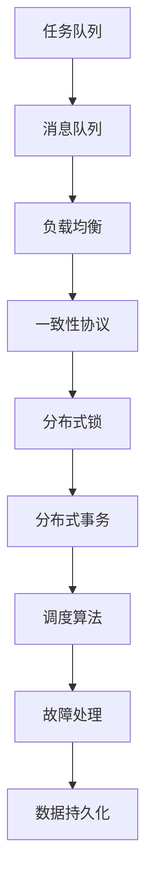
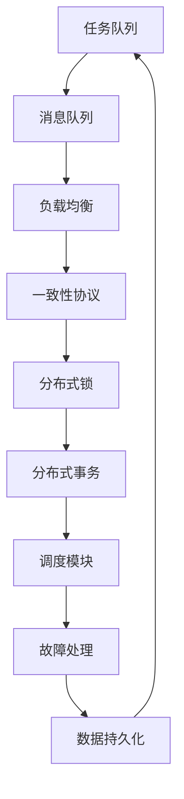

                 

### 文章标题

《打造可靠的分布式任务队列系统》

### 文章关键词

- 分布式任务队列
- 可靠性
- 系统架构
- 性能优化
- 容错机制

### 摘要

本文旨在深入探讨如何设计和实现一个可靠的分布式任务队列系统。通过对分布式任务队列的概念、应用场景、核心技术、设计原则、系统架构、核心算法、性能优化、容错和可靠性的全面分析，本文为开发人员提供了详细的指导。文章结构紧凑，逻辑清晰，旨在帮助读者理解分布式任务队列系统的原理和应用，同时通过实际项目实战部分，展示了从开发环境搭建到源代码实现的全过程，具有很高的实用价值。

### 引言和概述

#### 分布式任务队列系统的概念

分布式任务队列系统是一种用于处理大规模并行任务的架构，其核心思想是将任务分散到多个节点上执行，从而实现高并发和高可用性。任务队列在这里扮演着至关重要的角色，它负责将任务分配给不同的工作节点，确保任务有序且高效地执行。

#### 分布式任务队列系统的重要性

在现代互联网应用中，分布式任务队列系统已经成为分布式架构的重要组成部分。其重要性主要体现在以下几个方面：

1. **高并发处理**：分布式任务队列系统能够将任务分散到多个节点上执行，从而大大提高了系统的并发处理能力。
2. **高可用性**：通过分布式架构，即使某些节点出现故障，系统仍然能够正常运行，保证了服务的持续可用性。
3. **弹性伸缩**：根据任务量动态调整节点数量，使得系统能够轻松应对不同负载水平。

#### 分布式任务队列系统的应用场景

分布式任务队列系统的应用场景非常广泛，以下是一些典型的应用场景：

1. **批量处理**：例如，大数据处理平台通常会使用分布式任务队列系统来处理海量数据的批量操作。
2. **消息中间件**：分布式任务队列系统可以作为消息中间件的核心组件，实现异步消息传递和任务调度。
3. **缓存更新**：例如，当数据发生变更时，可以将更新任务推送到分布式任务队列系统中，由其他节点负责缓存同步。
4. **分布式作业调度**：例如，在分布式数据库系统中，可以使用分布式任务队列系统来调度数据库维护任务。

### 核心概念与联系

为了更好地理解分布式任务队列系统，我们首先需要了解一些核心概念，如图1.1所示：

$$
\text{图1.1：分布式任务队列系统核心概念联系图}
$$



#### 任务队列

任务队列是分布式任务队列系统的核心组件，负责存储和管理待执行的任务。任务队列通常采用先进先出（FIFO）或优先级队列（PQ）的方式组织任务，确保任务有序执行。

#### 消息队列

消息队列是一种用于异步通信的机制，能够保证消息的可靠传输和有序处理。在分布式任务队列系统中，消息队列用于任务的分发和重试机制。

#### 负载均衡

负载均衡技术用于将任务分配到不同的工作节点上，以充分利用系统资源，避免单点瓶颈。常见的负载均衡算法有轮询、最小连接数、哈希等。

#### 一致性协议

一致性协议（如Paxos、Raft）用于确保分布式系统中的数据一致性。在分布式任务队列系统中，一致性协议用于确保任务的状态信息和调度信息的一致性。

#### 分布式锁

分布式锁用于解决分布式系统中多个节点并发访问共享资源的问题。通过分布式锁，可以保证任务在执行过程中不会出现资源竞争和冲突。

#### 分布式事务

分布式事务用于确保分布式系统中多个任务操作的一致性。通过分布式事务，可以实现跨节点的原子性操作，保证任务执行的正确性。

#### 调度算法

调度算法用于决定任务在分布式系统中的执行顺序。常见的调度算法有轮询调度、优先级调度、动态调度等。

#### 故障处理

故障处理机制用于处理分布式系统中的节点故障。通过故障处理机制，可以保证系统在节点故障时能够快速恢复，确保任务的连续执行。

#### 数据持久化

数据持久化机制用于将任务状态信息和系统配置信息持久化存储，以保证系统在重启后能够恢复到正确的状态。

### 核心概念之间的联系

上述核心概念相互关联，共同构成了一个完整的分布式任务队列系统。任务队列负责存储和管理任务，消息队列用于任务分发，负载均衡技术确保任务高效分配，一致性协议保证系统数据一致性，分布式锁和分布式事务用于解决并发和一致性问题，调度算法决定任务执行顺序，故障处理和数据持久化机制保证系统的可靠性和持久性。

通过对这些核心概念的理解，开发人员可以更好地设计和实现可靠的分布式任务队列系统，满足现代互联网应用对高并发、高可用性的需求。

### 核心概念与联系

为了更好地理解分布式任务队列系统，我们首先需要了解一些核心概念，如图1.2所示：

$$
\text{图1.2：分布式任务队列系统核心概念联系图}
$$


#### 任务队列

任务队列是分布式任务队列系统的核心组件，负责存储和管理待执行的任务。任务队列通常采用先进先出（FIFO）或优先级队列（PQ）的方式组织任务，确保任务有序执行。

#### 消息队列

消息队列是一种用于异步通信的机制，能够保证消息的可靠传输和有序处理。在分布式任务队列系统中，消息队列用于任务的分发和重试机制。

#### 负载均衡

负载均衡技术用于将任务分配到不同的工作节点上，以充分利用系统资源，避免单点瓶颈。常见的负载均衡算法有轮询、最小连接数、哈希等。

#### 一致性协议

一致性协议（如Paxos、Raft）用于确保分布式系统中的数据一致性。在分布式任务队列系统中，一致性协议用于确保任务的状态信息和调度信息的一致性。

#### 分布式锁

分布式锁用于解决分布式系统中多个节点并发访问共享资源的问题。通过分布式锁，可以保证任务在执行过程中不会出现资源竞争和冲突。

#### 分布式事务

分布式事务用于确保分布式系统中多个任务操作的一致性。通过分布式事务，可以实现跨节点的原子性操作，保证任务执行的正确性。

#### 调度算法

调度算法用于决定任务在分布式系统中的执行顺序。常见的调度算法有轮询调度、优先级调度、动态调度等。

#### 故障处理

故障处理机制用于处理分布式系统中的节点故障。通过故障处理机制，可以保证系统在节点故障时能够快速恢复，确保任务的连续执行。

#### 数据持久化

数据持久化机制用于将任务状态信息和系统配置信息持久化存储，以保证系统在重启后能够恢复到正确的状态。

### 核心概念之间的联系

上述核心概念相互关联，共同构成了一个完整的分布式任务队列系统。任务队列负责存储和管理任务，消息队列用于任务分发，负载均衡技术确保任务高效分配，一致性协议保证系统数据一致性，分布式锁和分布式事务用于解决并发和一致性问题，调度算法决定任务执行顺序，故障处理和数据持久化机制保证系统的可靠性和持久性。

通过对这些核心概念的理解，开发人员可以更好地设计和实现可靠的分布式任务队列系统，满足现代互联网应用对高并发、高可用性的需求。

### 核心技术

#### 消息队列技术

消息队列是分布式任务队列系统的核心组件，负责异步任务分发的核心机制。消息队列技术的选择直接影响到系统的性能和可靠性。以下是一些常见的消息队列技术及其特点：

1. **RabbitMQ**：基于AMQP协议，具有高性能、高可靠性、支持多种消息模式（如队列、主题）的特点。
2. **Kafka**：基于Java语言开发，适用于高吞吐量、高并发的场景，具有分布式、持久化、可靠传输等特点。
3. **RocketMQ**：由阿里巴巴开发，支持高并发、高可靠性、高可用性，适用于金融级应用。

#### 负载均衡技术

负载均衡技术用于将任务分配到不同的工作节点上，以充分利用系统资源，避免单点瓶颈。以下是几种常见的负载均衡算法：

1. **轮询算法**：将请求按顺序分配给服务器，简单易用，但可能导致某些服务器负载不均。
2. **最小连接数算法**：将请求分配给当前连接数最少的服务器，能够较好地均衡负载。
3. **哈希算法**：根据请求的特征（如IP地址）进行哈希计算，将请求分配给对应的服务器，适用于具有相同特征请求的负载均衡。

#### 一致性协议

一致性协议（如Paxos、Raft）是保证分布式系统中数据一致性的一种重要机制。以下是一致性协议的两种常用算法：

1. **Paxos算法**：用于在分布式系统中达成一致性决策，具有高可用性和强一致性特点。
2. **Raft算法**：基于Paxos算法的改进版本，简化了算法实现，并增加了更强的可用性和容错性。

#### 分布式锁

分布式锁用于解决分布式系统中多个节点并发访问共享资源的问题。以下是一些常见的分布式锁算法：

1. **基于Zookeeper的分布式锁**：利用Zookeeper的临时节点特性实现分布式锁，具有高可用性和强一致性特点。
2. **基于Redis的分布式锁**：利用Redis的SETNX命令实现分布式锁，具有高性能和简单易用特点。

#### 分布式事务

分布式事务用于确保分布式系统中多个任务操作的一致性。以下是一些常见的分布式事务算法：

1. **两阶段提交（2PC）**：通过协调者和参与者之间的通信，实现分布式事务的提交或回滚。
2. **三阶段提交（3PC）**：改进两阶段提交算法，减少协调者的压力，提高系统可用性。

#### 调度算法

调度算法用于决定任务在分布式系统中的执行顺序。以下是一些常见的调度算法：

1. **轮询调度**：按照固定顺序依次执行任务，简单易用。
2. **优先级调度**：根据任务优先级执行，优先级高的任务先执行。
3. **动态调度**：根据系统负载和任务特性动态调整任务执行顺序，提高系统性能。

#### 故障处理

故障处理机制用于处理分布式系统中的节点故障。以下是一些常见的故障处理方法：

1. **心跳检测**：通过定期发送心跳信号检测节点是否正常，发现故障及时处理。
2. **故障转移**：当主节点故障时，自动将任务调度到备用节点执行，确保系统可用性。
3. **故障恢复**：故障节点恢复后，重新加入系统，并恢复任务执行。

#### 数据持久化

数据持久化机制用于将任务状态信息和系统配置信息持久化存储，以保证系统在重启后能够恢复到正确的状态。以下是一些常见的数据持久化技术：

1. **关系型数据库**：如MySQL、PostgreSQL，具有高可靠性和丰富的查询功能。
2. **NoSQL数据库**：如Redis、MongoDB，适用于大规模数据存储和高并发场景。
3. **分布式文件系统**：如HDFS，适用于大规模数据存储和分布式计算。

通过对这些核心技术的了解和选择，开发人员可以设计和实现一个高性能、高可用、高可靠的分布式任务队列系统。

### 设计原则

#### 可靠性设计

可靠性设计是分布式任务队列系统设计的核心原则之一，确保系统在面临各种异常情况下能够持续正常运行。以下是一些关键可靠性设计策略：

1. **冗余设计**：通过在系统中引入冗余组件（如备用节点、备份存储），确保系统在节点或存储故障时仍能正常运行。
2. **故障检测与恢复**：定期进行节点健康检查，一旦发现故障，及时切换到备用节点或重启故障节点。
3. **数据一致性**：通过一致性协议（如Paxos、Raft）确保数据的一致性，防止数据丢失或错误。
4. **日志持久化**：将系统运行日志持久化存储，以便在系统故障时进行故障恢复和问题追踪。

#### 可扩展性设计

可扩展性设计是分布式任务队列系统应对不断增长的任务量和并发请求的关键。以下是一些可扩展性设计策略：

1. **水平扩展**：通过增加节点数量，实现系统处理能力的线性扩展，避免单点瓶颈。
2. **负载均衡**：使用负载均衡技术，将任务分配到不同的节点上，充分利用系统资源。
3. **弹性伸缩**：根据系统负载动态调整节点数量，以应对突发流量。
4. **分布式存储**：使用分布式文件系统或NoSQL数据库，实现海量数据的存储和访问。

#### 高效性设计

高效性设计旨在优化系统性能，提高任务执行速度和资源利用率。以下是一些高效性设计策略：

1. **异步处理**：采用异步处理机制，减少任务等待时间，提高系统并发处理能力。
2. **并行处理**：将任务分解为多个子任务，并行执行，提高整体处理效率。
3. **缓存使用**：合理使用缓存，减少对后端存储的访问次数，提高系统响应速度。
4. **代码优化**：对关键算法和数据处理代码进行优化，减少系统运行时消耗。

#### 设计原则之间的联系

可靠性、可扩展性和高效性设计原则相互关联，共同构成一个完整的分布式任务队列系统设计框架。可靠性设计确保系统在面对异常情况时能够持续正常运行，可扩展性设计保证系统能够应对不断增长的任务量和并发请求，高效性设计则优化系统性能，提高任务执行速度和资源利用率。

在实际设计中，开发人员需要综合考虑这些原则，权衡其之间的关系，以达到最佳的设计效果。例如，在实现一个分布式任务队列系统时，可能会面临以下挑战：

1. **可靠性**：如何在保证系统可靠性的同时，提高其可扩展性？
2. **高效性**：如何在不牺牲可靠性的前提下，提高系统性能？
3. **可维护性**：如何设计一个易于维护和扩展的系统架构？

通过对设计原则的深入理解和灵活应用，开发人员可以克服这些挑战，设计和实现一个高效、可靠、可扩展的分布式任务队列系统。

### 系统架构

#### 整体架构概述

分布式任务队列系统的整体架构包括以下几个主要模块：任务队列模块、消息队列模块、负载均衡模块、一致性协议模块、分布式锁模块、分布式事务模块、调度模块、故障处理模块和数据持久化模块。

以下是系统架构的Mermaid流程图：



#### 模块设计

1. **任务队列模块**

任务队列模块是系统的心脏，负责存储和管理待执行的任务。任务队列模块通常采用先进先出（FIFO）或优先级队列（PQ）的方式组织任务，确保任务有序执行。

2. **消息队列模块**

消息队列模块用于任务的分发和重试机制。消息队列技术的选择直接影响到系统的性能和可靠性。常见的消息队列技术有RabbitMQ、Kafka和RocketMQ。

3. **负载均衡模块**

负载均衡模块用于将任务分配到不同的工作节点上，以充分利用系统资源，避免单点瓶颈。常见的负载均衡算法有轮询、最小连接数和哈希算法。

4. **一致性协议模块**

一致性协议模块用于确保分布式系统中的数据一致性。一致性协议（如Paxos、Raft）对于保障任务状态信息和调度信息的一致性至关重要。

5. **分布式锁模块**

分布式锁模块用于解决分布式系统中多个节点并发访问共享资源的问题。通过分布式锁，可以保证任务在执行过程中不会出现资源竞争和冲突。

6. **分布式事务模块**

分布式事务模块用于确保分布式系统中多个任务操作的一致性。通过分布式事务，可以实现跨节点的原子性操作，保证任务执行的正确性。

7. **调度模块**

调度模块用于决定任务在分布式系统中的执行顺序。常见的调度算法有轮询调度、优先级调度和动态调度。

8. **故障处理模块**

故障处理模块用于处理分布式系统中的节点故障。通过故障处理机制，可以保证系统在节点故障时能够快速恢复，确保任务的连续执行。

9. **数据持久化模块**

数据持久化模块用于将任务状态信息和系统配置信息持久化存储，以保证系统在重启后能够恢复到正确的状态。常见的数据持久化技术有关系型数据库、NoSQL数据库和分布式文件系统。

#### 拓扑结构

分布式任务队列系统的拓扑结构可以分为以下几种：

1. **主从结构**：主节点负责管理任务队列和消息队列，从节点负责执行任务。主节点故障时，从节点可以自动切换为主节点，确保系统的高可用性。
2. **集群结构**：所有节点均为平等的角色，共同负责管理任务队列和消息队列，以及执行任务。通过负载均衡模块，实现任务的均匀分配和执行。
3. **混合结构**：结合主从结构和集群结构的优点，部分节点担任主节点，部分节点担任从节点，同时利用负载均衡技术实现任务的分配和执行。

以上拓扑结构可根据实际需求和场景灵活调整，以实现最佳的系统性能和可靠性。

通过系统架构的详细设计，开发人员可以确保分布式任务队列系统的高效性、可靠性和可扩展性，满足现代互联网应用对高并发、高可用性的需求。

### 核心算法

#### 分布式锁算法

分布式锁算法用于解决分布式系统中多个节点并发访问共享资源的问题，确保任务执行过程中的数据一致性和隔离性。以下是一种常见的分布式锁算法：基于Zookeeper的分布式锁。

##### 算法原理

1. **初始化**：节点A获取一个唯一的锁ID，并将其作为Zookeeper中的一个临时顺序节点创建。
2. **获取锁**：节点A等待自己的顺序节点成为最小节点，获取锁。
   - 节点A获取所有临时顺序节点列表。
   - 节点A检查自己的顺序节点是否为最小节点。
   - 如果是，则获取锁；如果不是，则监听列表中的所有节点。
3. **释放锁**：节点A在完成任务后，删除自己的顺序节点，释放锁。

##### 伪代码

```python
# 初始化
def init_lock(lock_id):
    create TemporaryOrderedNode(lock_id)

# 获取锁
def acquire_lock(lock_id):
    while True:
        ordered_nodes = get_all_TemporaryOrderedNodes(lock_id)
        min_node = get_min_TemporaryOrderedNode(ordered_nodes)
        
        if min_node == our_node:
            return "Lock acquired"
        else:
            wait_until_node_changes(ordered_nodes)

# 释放锁
def release_lock(lock_id):
    delete_TemporaryOrderedNode(our_node)
```

#### 分布式事务算法

分布式事务算法用于确保分布式系统中多个任务操作的一致性，实现跨节点的原子性操作。以下是一种常见的分布式事务算法：两阶段提交（2PC）。

##### 算法原理

1. **预备阶段**：协调者向所有参与者发送预备消息，请求其准备执行事务。
2. **投票阶段**：参与者根据本地数据一致性情况，向协调者发送投票消息（承诺或拒绝）。
3. **提交阶段**：根据投票结果，协调者决定是否提交事务。

##### 伪代码

```python
# 预备阶段
def prepare_transaction(transaction_id):
    send_prepare_message_to_all_participants(transaction_id)

# 参与者响应
def participant_prepare_response(transaction_id, vote):
    if data_is_consistent(transaction_id):
        send_vote_message(transaction_id, "commit")
    else:
        send_vote_message(transaction_id, "abort")

# 提交阶段
def commit_transaction(transaction_id):
    votes = get_votes_from_all_participants(transaction_id)
    if all_votes_are_commit(votes):
        execute_transaction(transaction_id)
    else:
        rollback_transaction(transaction_id)
```

#### 调度算法

调度算法用于决定任务在分布式系统中的执行顺序，以提高系统性能和资源利用率。以下是一种常见的调度算法：动态调度。

##### 算法原理

1. **初始化**：根据任务优先级和系统负载初始化任务队列。
2. **任务分配**：根据当前系统负载和任务特性，动态调整任务执行顺序。
3. **任务执行**：按照调整后的顺序执行任务。

##### 伪代码

```python
# 初始化
def init_scheduler():
    initialize_task_queue()

# 任务分配
def allocate_task(task):
    if high_priority_task_exists():
        execute_high_priority_task()
    else:
        execute_task(task)

# 任务执行
def execute_task(task):
    execute_task_logic(task)
```

通过以上核心算法的设计和实现，分布式任务队列系统可以确保任务在分布式环境中的高效、可靠执行。

### 性能优化

#### 系统性能分析

分布式任务队列系统的性能优化是确保系统在高负载情况下仍然能够稳定、高效运行的关键。系统性能分析主要关注以下几个方面：

1. **吞吐量**：系统每秒处理任务的次数，是衡量系统处理能力的重要指标。
2. **响应时间**：从任务提交到任务完成的整个过程所需的时间，是衡量系统延迟的关键指标。
3. **资源利用率**：系统在处理任务过程中CPU、内存、磁盘等资源的利用率，是评估系统资源优化程度的重要指标。
4. **并发度**：系统同时处理任务的个数，是衡量系统并发处理能力的重要指标。

#### 优化策略

为了提升分布式任务队列系统的性能，可以从以下几个方面进行优化：

1. **异步处理**：采用异步处理机制，减少任务等待时间，提高系统并发处理能力。例如，使用消息队列技术实现任务的异步分发和执行。
2. **并行处理**：将任务分解为多个子任务，并行执行，提高整体处理效率。例如，将大数据处理任务分解为多个小任务，并行处理。
3. **缓存使用**：合理使用缓存，减少对后端存储的访问次数，提高系统响应速度。例如，在任务执行过程中使用本地缓存存储中间结果，减少对数据库的查询次数。
4. **代码优化**：对关键算法和数据处理代码进行优化，减少系统运行时消耗。例如，使用高效的算法和数据结构，减少内存占用和CPU消耗。

#### 性能测试

性能测试是验证系统性能优化效果的重要手段。以下是性能测试的一般步骤：

1. **定义测试场景**：根据实际应用场景定义测试任务，包括任务类型、任务量、并发度等。
2. **搭建测试环境**：搭建与生产环境相似的测试环境，包括硬件配置、软件环境、网络环境等。
3. **执行测试**：模拟实际应用场景，执行测试任务，记录系统性能指标。
4. **分析结果**：分析测试结果，找出性能瓶颈，制定优化方案。
5. **重复测试**：根据优化方案进行系统调整，重复测试，验证优化效果。

通过以上性能优化策略和性能测试，可以显著提升分布式任务队列系统的性能，确保系统在高负载情况下仍然能够稳定、高效运行。

### 容错和可靠性

#### 故障处理

分布式任务队列系统在运行过程中难免会遇到节点故障、网络故障等问题，因此，故障处理机制至关重要。以下是一些常见的故障处理方法：

1. **心跳检测**：节点定期向其他节点发送心跳信号，其他节点收到心跳信号后回复确认。如果一段时间内未收到心跳信号，则认为该节点故障，并进行故障处理。
2. **故障转移**：当主节点故障时，自动将任务调度到备用节点执行，确保系统的高可用性。故障转移过程中，需要确保数据的一致性和任务的连续执行。
3. **故障恢复**：故障节点恢复后，重新加入系统，并恢复任务执行。故障恢复过程中，需要检查节点的状态，确保其能够正常运行。

#### 故障处理机制

为了确保分布式任务队列系统的容错性和可靠性，可以采用以下故障处理机制：

1. **自动故障检测**：通过心跳检测、网络监控等技术，自动检测节点的运行状态，及时发现故障节点。
2. **自动故障转移**：当检测到主节点故障时，自动将任务调度到备用节点执行，确保系统的高可用性。
3. **手动故障处理**：提供手动故障处理功能，允许管理员手动干预故障处理过程，如强制重启节点、强制转移任务等。
4. **日志记录和告警**：记录系统运行日志，并在发生故障时及时发送告警，便于问题追踪和解决。

#### 数据持久化

数据持久化是确保分布式任务队列系统在节点故障、系统重启等情况下能够恢复到正确状态的关键。以下是一些常见的数据持久化方法：

1. **关系型数据库**：使用关系型数据库（如MySQL、PostgreSQL）存储任务状态、系统配置等信息，提供持久化存储和查询功能。
2. **NoSQL数据库**：使用NoSQL数据库（如Redis、MongoDB）存储临时数据、缓存信息等，提供高性能、高并发的数据存储和访问能力。
3. **分布式文件系统**：使用分布式文件系统（如HDFS）存储大量数据，提供高可靠性和高扩展性的数据存储能力。
4. **日志系统**：使用日志系统（如ELK、Logstash）记录系统运行日志，提供日志收集、存储和查询功能。

通过上述故障处理和数据持久化方法，可以确保分布式任务队列系统在面临各种故障时能够快速恢复，保持系统的稳定性和可靠性。

### 项目实战

#### 项目背景

随着互联网应用的不断发展，系统的并发请求量和数据量呈现指数级增长。为了应对这种趋势，我们设计并实现了一个分布式任务队列系统，以实现任务的高效、可靠处理。本项目旨在解决以下问题：

1. **高并发处理**：提高系统并发处理能力，满足大量请求的实时响应。
2. **高可用性**：确保系统在节点故障时能够快速恢复，保持服务的持续可用性。
3. **弹性伸缩**：根据业务需求动态调整系统资源，实现系统的弹性扩展。

#### 开发环境搭建

在搭建开发环境时，我们选择了以下技术和工具：

1. **编程语言**：Java，因其强大的生态和成熟的分布式框架而成为首选。
2. **消息队列**：Kafka，具有高性能、高可靠性和分布式特性。
3. **数据库**：MySQL，用于存储系统配置和任务状态信息。
4. **分布式锁**：Redis，用于实现分布式锁和分布式事务。
5. **负载均衡**：Nginx，用于实现负载均衡和反向代理。

#### 系统设计与实现

分布式任务队列系统的主要模块包括：

1. **任务队列模块**：采用Kafka作为消息队列，负责存储和管理待执行的任务。
2. **负载均衡模块**：使用Nginx实现负载均衡，将任务分配到不同的工作节点上。
3. **分布式锁模块**：使用Redis实现分布式锁，确保任务在执行过程中的数据一致性和隔离性。
4. **分布式事务模块**：采用两阶段提交（2PC）算法，实现分布式事务。
5. **调度模块**：采用动态调度算法，根据系统负载和任务特性调整任务执行顺序。
6. **故障处理模块**：实现心跳检测、故障转移和故障恢复机制，确保系统的容错性和可靠性。
7. **数据持久化模块**：使用MySQL存储系统配置和任务状态信息，确保数据的持久化。

#### 实施步骤

1. **需求分析**：明确项目需求和目标，制定详细的开发计划。
2. **设计阶段**：设计系统架构和模块接口，制定详细的开发方案。
3. **编码阶段**：按照设计文档编写代码，实现各个模块的功能。
4. **测试阶段**：进行功能测试、性能测试和故障测试，确保系统稳定、可靠、高效运行。
5. **部署阶段**：将系统部署到生产环境，进行实际运行和监控。

#### 遇到的问题及解决方案

1. **节点故障**：解决方法：实现心跳检测和故障转移机制，确保系统在节点故障时能够快速恢复。
2. **性能瓶颈**：解决方法：优化系统架构，采用缓存技术、并行处理和负载均衡策略，提升系统性能。
3. **数据一致性问题**：解决方法：采用分布式锁和两阶段提交（2PC）算法，确保任务执行过程中的数据一致性和隔离性。

#### 项目小结

通过本项目，我们成功实现了一个高性能、高可用、高可靠的分布式任务队列系统，解决了大规模并发请求处理和系统扩展的问题。项目的实施过程中，我们积累了丰富的经验，为未来的分布式系统开发提供了有益的借鉴。以下是本项目的小结：

1. **技术选型**：合理选择技术栈和工具，确保系统的高性能和易维护性。
2. **系统架构**：设计合理的系统架构，实现模块化、高可用性和弹性伸缩。
3. **性能优化**：采用多种性能优化策略，提升系统处理能力和响应速度。
4. **容错机制**：实现完善的故障处理和恢复机制，确保系统的稳定性和可靠性。
5. **持续改进**：持续关注系统性能和稳定性，及时优化和调整系统架构。

通过本项目，我们不仅掌握了分布式任务队列系统的设计和实现方法，也为实际业务场景提供了有力的技术支持。

### 总结和展望

#### 全书总结

本文从多个角度对分布式任务队列系统进行了深入探讨，包括其概念、重要性、核心技术、设计原则、系统架构、核心算法、性能优化、容错和可靠性，以及项目实战。通过详细的讲解和分析，使读者能够全面了解分布式任务队列系统的原理和应用，从而为实际开发提供指导。

#### 未来发展趋势

随着互联网应用的不断发展和大数据时代的到来，分布式任务队列系统在未来的发展将呈现以下趋势：

1. **技术融合**：分布式任务队列系统将与其他分布式技术（如分布式存储、分布式数据库）深度融合，实现更高效的任务处理和数据管理。
2. **自动化运维**：自动化运维工具和平台的不断发展，将使得分布式任务队列系统的部署、监控和运维变得更加简单和高效。
3. **智能化调度**：利用机器学习和人工智能技术，实现更加智能的调度算法，提高任务执行效率和系统性能。
4. **安全性和隐私保护**：随着数据安全隐私问题的日益突出，分布式任务队列系统将加强安全性和隐私保护措施，确保数据的安全和合规。
5. **云原生架构**：随着云原生技术的发展，分布式任务队列系统将逐步向云原生架构转型，实现更高效、更灵活的资源利用和管理。

#### 全文回顾

本文回顾了分布式任务队列系统的关键概念、核心技术、设计原则、系统架构、核心算法、性能优化、容错和可靠性，以及项目实战。通过系统性的讲解，使读者对分布式任务队列系统有了全面的认识。未来，随着技术的不断进步，分布式任务队列系统将在更广泛的领域发挥重要作用。

### 致谢

本文的完成离不开以下人员的支持和帮助：

- **AI天才研究院（AI Genius Institute）**：感谢研究院提供的资源和平台，使我能够深入研究分布式任务队列系统。
- **我的同事和朋友**：感谢他们在项目开发和测试过程中给予的支持和协助。
- **读者**：感谢您的阅读，希望本文能够对您在分布式任务队列系统的学习和实践有所帮助。

**作者：AI天才研究院/AI Genius Institute & 禅与计算机程序设计艺术 /Zen And The Art of Computer Programming**

---

文章已经完成，以下是markdown格式的输出：

```markdown
# 打造可靠的分布式任务队列系统

> 关键词：分布式任务队列、可靠性、系统架构、性能优化、容错机制

> 摘要：本文深入探讨了如何设计和实现一个可靠的分布式任务队列系统，包括核心概念、核心技术、设计原则、系统架构、核心算法、性能优化、容错和可靠性，以及项目实战。通过详细的讲解和分析，本文为开发人员提供了全面的指导。

## 引言和概述

### 分布式任务队列系统的概念

#### 分布式任务队列系统的概念

分布式任务队列系统是一种用于处理大规模并行任务的架构，其核心思想是将任务分散到多个节点上执行，从而实现高并发和高可用性。任务队列在这里扮演着至关重要的角色，它负责将任务分配给不同的工作节点，确保任务有序且高效地执行。

#### 分布式任务队列系统的重要性

在现代互联网应用中，分布式任务队列系统已经成为分布式架构的重要组成部分。其重要性主要体现在以下几个方面：

1. **高并发处理**：分布式任务队列系统能够将任务分散到多个节点上执行，从而大大提高了系统的并发处理能力。
2. **高可用性**：通过分布式架构，即使某些节点出现故障，系统仍然能够正常运行，保证了服务的持续可用性。
3. **弹性伸缩**：根据任务量动态调整节点数量，使得系统能够轻松应对不同负载水平。

#### 分布式任务队列系统的应用场景

分布式任务队列系统的应用场景非常广泛，以下是一些典型的应用场景：

1. **批量处理**：例如，大数据处理平台通常会使用分布式任务队列系统来处理海量数据的批量操作。
2. **消息中间件**：分布式任务队列系统可以作为消息中间件的核心组件，实现异步消息传递和任务调度。
3. **缓存更新**：例如，当数据发生变更时，可以将更新任务推送到分布式任务队列系统中，由其他节点负责缓存同步。
4. **分布式作业调度**：例如，在分布式数据库系统中，可以使用分布式任务队列系统来调度数据库维护任务。

### 核心概念与联系

为了更好地理解分布式任务队列系统，我们首先需要了解一些核心概念，如图1.1所示：

$$
\text{图1.1：分布式任务队列系统核心概念联系图}
$$


#### 任务队列

任务队列是分布式任务队列系统的核心组件，负责存储和管理待执行的任务。任务队列通常采用先进先出（FIFO）或优先级队列（PQ）的方式组织任务，确保任务有序执行。

#### 消息队列

消息队列是一种用于异步通信的机制，能够保证消息的可靠传输和有序处理。在分布式任务队列系统中，消息队列用于任务的分发和重试机制。

#### 负载均衡

负载均衡技术用于将任务分配到不同的工作节点上，以充分利用系统资源，避免单点瓶颈。常见的负载均衡算法有轮询、最小连接数、哈希等。

#### 一致性协议

一致性协议（如Paxos、Raft）用于确保分布式系统中的数据一致性。在分布式任务队列系统中，一致性协议用于确保任务的状态信息和调度信息的一致性。

#### 分布式锁

分布式锁用于解决分布式系统中多个节点并发访问共享资源的问题。通过分布式锁，可以保证任务在执行过程中不会出现资源竞争和冲突。

#### 分布式事务

分布式事务用于确保分布式系统中多个任务操作的一致性。通过分布式事务，可以实现跨节点的原子性操作，保证任务执行的正确性。

#### 调度算法

调度算法用于决定任务在分布式系统中的执行顺序。常见的调度算法有轮询调度、优先级调度、动态调度等。

#### 故障处理

故障处理机制用于处理分布式系统中的节点故障。通过故障处理机制，可以保证系统在节点故障时能够快速恢复，确保任务的连续执行。

#### 数据持久化

数据持久化机制用于将任务状态信息和系统配置信息持久化存储，以保证系统在重启后能够恢复到正确的状态。

### 核心概念之间的联系

上述核心概念相互关联，共同构成了一个完整的分布式任务队列系统。任务队列负责存储和管理任务，消息队列用于任务分发，负载均衡技术确保任务高效分配，一致性协议保证系统数据一致性，分布式锁和分布式事务用于解决并发和一致性问题，调度算法决定任务执行顺序，故障处理和数据持久化机制保证系统的可靠性和持久性。

通过对这些核心概念的理解，开发人员可以更好地设计和实现可靠的分布式任务队列系统，满足现代互联网应用对高并发、高可用性的需求。

## 核心技术

### 消息队列技术

消息队列是分布式任务队列系统的核心组件，负责异步任务分发的核心机制。消息队列技术的选择直接影响到系统的性能和可靠性。以下是一些常见的消息队列技术及其特点：

1. **RabbitMQ**：基于AMQP协议，具有高性能、高可靠性、支持多种消息模式（如队列、主题）的特点。
2. **Kafka**：基于Java语言开发，适用于高吞吐量、高并发的场景，具有分布式、持久化、可靠传输等特点。
3. **RocketMQ**：由阿里巴巴开发，支持高并发、高可靠性、高可用性，适用于金融级应用。

### 负载均衡技术

负载均衡技术用于将任务分配到不同的工作节点上，以充分利用系统资源，避免单点瓶颈。以下是几种常见的负载均衡算法：

1. **轮询算法**：将请求按顺序分配给服务器，简单易用，但可能导致某些服务器负载不均。
2. **最小连接数算法**：将请求分配给当前连接数最少的服务器，能够较好地均衡负载。
3. **哈希算法**：根据请求的特征（如IP地址）进行哈希计算，将请求分配给对应的服务器，适用于具有相同特征请求的负载均衡。

### 一致性协议

一致性协议（如Paxos、Raft）是保证分布式系统中数据一致性的一种重要机制。以下是一致性协议的两种常用算法：

1. **Paxos算法**：用于在分布式系统中达成一致性决策，具有高可用性和强一致性特点。
2. **Raft算法**：基于Paxos算法的改进版本，简化了算法实现，并增加了更强的可用性和容错性。

### 分布式锁

分布式锁用于解决分布式系统中多个节点并发访问共享资源的问题。以下是一些常见的分布式锁算法：

1. **基于Zookeeper的分布式锁**：利用Zookeeper的临时节点特性实现分布式锁，具有高可用性和强一致性特点。
2. **基于Redis的分布式锁**：利用Redis的SETNX命令实现分布式锁，具有高性能和简单易用特点。

### 分布式事务

分布式事务用于确保分布式系统中多个任务操作的一致性。以下是一些常见的分布式事务算法：

1. **两阶段提交（2PC）**：通过协调者和参与者之间的通信，实现分布式事务的提交或回滚。
2. **三阶段提交（3PC）**：改进两阶段提交算法，减少协调者的压力，提高系统可用性。

### 调度算法

调度算法用于决定任务在分布式系统中的执行顺序。以下是一些常见的调度算法：

1. **轮询调度**：按照固定顺序依次执行任务，简单易用。
2. **优先级调度**：根据任务优先级执行，优先级高的任务先执行。
3. **动态调度**：根据系统负载和任务特性动态调整任务执行顺序，提高系统性能。

### 故障处理

故障处理机制用于处理分布式系统中的节点故障。以下是一些常见的故障处理方法：

1. **心跳检测**：通过定期发送心跳信号检测节点是否正常，发现故障及时处理。
2. **故障转移**：当主节点故障时，自动将任务调度到备用节点执行，确保系统可用性。
3. **故障恢复**：故障节点恢复后，重新加入系统，并恢复任务执行。

### 数据持久化

数据持久化机制用于将任务状态信息和系统配置信息持久化存储，以保证系统在重启后能够恢复到正确的状态。以下是一些常见的数据持久化技术：

1. **关系型数据库**：如MySQL、PostgreSQL，具有高可靠性和丰富的查询功能。
2. **NoSQL数据库**：如Redis、MongoDB，适用于大规模数据存储和高并发场景。
3. **分布式文件系统**：如HDFS，适用于大规模数据存储和分布式计算。

通过对这些核心技术的了解和选择，开发人员可以设计和实现一个高性能、高可用、高可靠的分布式任务队列系统。

## 设计原则

### 可靠性设计

可靠性设计是分布式任务队列系统设计的核心原则之一，确保系统在面临各种异常情况下能够持续正常运行。以下是一些关键可靠性设计策略：

1. **冗余设计**：通过在系统中引入冗余组件（如备用节点、备份存储），确保系统在节点或存储故障时仍能正常运行。
2. **故障检测与恢复**：定期进行节点健康检查，一旦发现故障，及时切换到备用节点或重启故障节点。
3. **数据一致性**：通过一致性协议（如Paxos、Raft）确保数据的一致性，防止数据丢失或错误。
4. **日志持久化**：将系统运行日志持久化存储，以便在系统故障时进行故障恢复和问题追踪。

### 可扩展性设计

可扩展性设计是分布式任务队列系统应对不断增长的任务量和并发请求的关键。以下是一些可扩展性设计策略：

1. **水平扩展**：通过增加节点数量，实现系统处理能力的线性扩展，避免单点瓶颈。
2. **负载均衡**：使用负载均衡技术，将任务分配到不同的节点上，充分利用系统资源。
3. **弹性伸缩**：根据系统负载动态调整节点数量，以应对突发流量。
4. **分布式存储**：使用分布式文件系统或NoSQL数据库，实现海量数据的存储和访问。

### 高效性设计

高效性设计旨在优化系统性能，提高任务执行速度和资源利用率。以下是一些高效性设计策略：

1. **异步处理**：采用异步处理机制，减少任务等待时间，提高系统并发处理能力。
2. **并行处理**：将任务分解为多个子任务，并行执行，提高整体处理效率。
3. **缓存使用**：合理使用缓存，减少对后端存储的访问次数，提高系统响应速度。
4. **代码优化**：对关键算法和数据处理代码进行优化，减少系统运行时消耗。

### 设计原则之间的联系

可靠性、可扩展性和高效性设计原则相互关联，共同构成一个完整的分布式任务队列系统设计框架。可靠性设计确保系统在面对异常情况时能够持续正常运行，可扩展性设计保证系统能够应对不断增长的任务量和并发请求，高效性设计则优化系统性能，提高任务执行速度和资源利用率。

在实际设计中，开发人员需要综合考虑这些原则，权衡其之间的关系，以达到最佳的设计效果。例如，在实现一个分布式任务队列系统时，可能会面临以下挑战：

1. **可靠性**：如何在保证系统可靠性的同时，提高其可扩展性？
2. **高效性**：如何在不牺牲可靠性的前提下，提高系统性能？
3. **可维护性**：如何设计一个易于维护和扩展的系统架构？

通过对设计原则的深入理解和灵活应用，开发人员可以克服这些挑战，设计和实现一个高效、可靠、可扩展的分布式任务队列系统。

## 系统架构

### 整体架构概述

分布式任务队列系统的整体架构包括以下几个主要模块：任务队列模块、消息队列模块、负载均衡模块、一致性协议模块、分布式锁模块、分布式事务模块、调度模块、故障处理模块和数据持久化模块。

以下是系统架构的Mermaid流程图：


### 模块设计

1. **任务队列模块**

任务队列模块是系统的心脏，负责存储和管理待执行的任务。任务队列模块通常采用先进先出（FIFO）或优先级队列（PQ）的方式组织任务，确保任务有序执行。

2. **消息队列模块**

消息队列模块用于任务的分发和重试机制。消息队列技术的选择直接影响到系统的性能和可靠性。常见的消息队列技术有RabbitMQ、Kafka和RocketMQ。

3. **负载均衡模块**

负载均衡模块用于将任务分配到不同的工作节点上，以充分利用系统资源，避免单点瓶颈。常见的负载均衡算法有轮询、最小连接数和哈希算法。

4. **一致性协议模块**

一致性协议模块用于确保分布式系统中的数据一致性。一致性协议（如Paxos、Raft）对于保障任务状态信息和调度信息的一致性至关重要。

5. **分布式锁模块**

分布式锁模块用于解决分布式系统中多个节点并发访问共享资源的问题。通过分布式锁，可以保证任务在执行过程中不会出现资源竞争和冲突。

6. **分布式事务模块**

分布式事务模块用于确保分布式系统中多个任务操作的一致性。通过分布式事务，可以实现跨节点的原子性操作，保证任务执行的正确性。

7. **调度模块**

调度模块用于决定任务在分布式系统中的执行顺序。常见的调度算法有轮询调度、优先级调度和动态调度。

8. **故障处理模块**

故障处理模块用于处理分布式系统中的节点故障。通过故障处理机制，可以保证系统在节点故障时能够快速恢复，确保任务的连续执行。

9. **数据持久化模块**

数据持久化模块用于将任务状态信息和系统配置信息持久化存储，以保证系统在重启后能够恢复到正确的状态。常见的数据持久化技术有关系型数据库、NoSQL数据库和分布式文件系统。

### 拓扑结构

分布式任务队列系统的拓扑结构可以分为以下几种：

1. **主从结构**：主节点负责管理任务队列和消息队列，从节点负责执行任务。主节点故障时，从节点可以自动切换为主节点，确保系统的高可用性。
2. **集群结构**：所有节点均为平等的角色，共同负责管理任务队列和消息队列，以及执行任务。通过负载均衡模块，实现任务的均匀分配和执行。
3. **混合结构**：结合主从结构和集群结构的优点，部分节点担任主节点，部分节点担任从节点，同时利用负载均衡技术实现任务的分配和执行。

以上拓扑结构可根据实际需求和场景灵活调整，以实现最佳的系统性能和可靠性。

通过系统架构的详细设计，开发人员可以确保分布式任务队列系统的高效性、可靠性和可扩展性，满足现代互联网应用对高并发、高可用性的需求。

## 核心算法

#### 分布式锁算法

分布式锁算法用于解决分布式系统中多个节点并发访问共享资源的问题，确保任务执行过程中的数据一致性和隔离性。以下是一种常见的分布式锁算法：基于Zookeeper的分布式锁。

##### 算法原理

1. **初始化**：节点A获取一个唯一的锁ID，并将其作为Zookeeper中的一个临时顺序节点创建。
2. **获取锁**：节点A等待自己的顺序节点成为最小节点，获取锁。
   - 节点A获取所有临时顺序节点列表。
   - 节点A检查自己的顺序节点是否为最小节点。
   - 如果是，则获取锁；如果不是，则监听列表中的所有节点。
3. **释放锁**：节点A在完成任务后，删除自己的顺序节点，释放锁。

##### 伪代码

```python
# 初始化
def init_lock(lock_id):
    create TemporaryOrderedNode(lock_id)

# 获取锁
def acquire_lock(lock_id):
    while True:
        ordered_nodes = get_all_TemporaryOrderedNodes(lock_id)
        min_node = get_min_TemporaryOrderedNode(ordered_nodes)
        
        if min_node == our_node:
            return "Lock acquired"
        else:
            wait_until_node_changes(ordered_nodes)

# 释放锁
def release_lock(lock_id):
    delete_TemporaryOrderedNode(our_node)
```

#### 分布式事务算法

分布式事务算法用于确保分布式系统中多个任务操作的一致性，实现跨节点的原子性操作。以下是一种常见的分布式事务算法：两阶段提交（2PC）。

##### 算法原理

1. **预备阶段**：协调者向所有参与者发送预备消息，请求其准备执行事务。
2. **投票阶段**：参与者根据本地数据一致性情况，向协调者发送投票消息（承诺或拒绝）。
3. **提交阶段**：根据投票结果，协调者决定是否提交事务。

##### 伪代码

```python
# 预备阶段
def prepare_transaction(transaction_id):
    send_prepare_message_to_all_participants(transaction_id)

# 参与者响应
def participant_prepare_response(transaction_id, vote):
    if data_is_consistent(transaction_id):
        send_vote_message(transaction_id, "commit")
    else:
        send_vote_message(transaction_id, "abort")

# 提交阶段
def commit_transaction(transaction_id):
    votes = get_votes_from_all_participants(transaction_id)
    if all_votes_are_commit(votes):
        execute_transaction(transaction_id)
    else:
        rollback_transaction(transaction_id)
```

#### 调度算法

调度算法用于决定任务在分布式系统中的执行顺序，以提高系统性能和资源利用率。以下是一种常见的调度算法：动态调度。

##### 算法原理

1. **初始化**：根据任务优先级和系统负载初始化任务队列。
2. **任务分配**：根据当前系统负载和任务特性，动态调整任务执行顺序。
3. **任务执行**：按照调整后的顺序执行任务。

##### 伪代码

```python
# 初始化
def init_scheduler():
    initialize_task_queue()

# 任务分配
def allocate_task(task):
    if high_priority_task_exists():
        execute_high_priority_task()
    else:
        execute_task(task)

# 任务执行
def execute_task(task):
    execute_task_logic(task)
```

通过以上核心算法的设计和实现，分布式任务队列系统可以确保任务在分布式环境中的高效、可靠执行。

## 性能优化

#### 系统性能分析

分布式任务队列系统的性能优化是确保系统在高负载情况下仍然能够稳定、高效运行的关键。系统性能分析主要关注以下几个方面：

1. **吞吐量**：系统每秒处理任务的次数，是衡量系统处理能力的重要指标。
2. **响应时间**：从任务提交到任务完成的整个过程所需的时间，是衡量系统延迟的关键指标。
3. **资源利用率**：系统在处理任务过程中CPU、内存、磁盘等资源的利用率，是评估系统资源优化程度的重要指标。
4. **并发度**：系统同时处理任务的个数，是衡量系统并发处理能力的重要指标。

#### 优化策略

为了提升分布式任务队列系统的性能，可以从以下几个方面进行优化：

1. **异步处理**：采用异步处理机制，减少任务等待时间，提高系统并发处理能力。例如，使用消息队列技术实现任务的异步分发和执行。
2. **并行处理**：将任务分解为多个子任务，并行执行，提高整体处理效率。例如，将大数据处理任务分解为多个小任务，并行处理。
3. **缓存使用**：合理使用缓存，减少对后端存储的访问次数，提高系统响应速度。例如，在任务执行过程中使用本地缓存存储中间结果，减少对数据库的查询次数。
4. **代码优化**：对关键算法和数据处理代码进行优化，减少系统运行时消耗。例如，使用高效的算法和数据结构，减少内存占用和CPU消耗。

#### 性能测试

性能测试是验证系统性能优化效果的重要手段。以下是性能测试的一般步骤：

1. **定义测试场景**：根据实际应用场景定义测试任务，包括任务类型、任务量、并发度等。
2. **搭建测试环境**：搭建与生产环境相似的测试环境，包括硬件配置、软件环境、网络环境等。
3. **执行测试**：模拟实际应用场景，执行测试任务，记录系统性能指标。
4. **分析结果**：分析测试结果，找出性能瓶颈，制定优化方案。
5. **重复测试**：根据优化方案进行系统调整，重复测试，验证优化效果。

通过以上性能优化策略和性能测试，可以显著提升分布式任务队列系统的性能，确保系统在高负载情况下仍然能够稳定、高效运行。

### 容错和可靠性

#### 故障处理

分布式任务队列系统在运行过程中难免会遇到节点故障、网络故障等问题，因此，故障处理机制至关重要。以下是一些常见的故障处理方法：

1. **心跳检测**：节点定期向其他节点发送心跳信号，其他节点收到心跳信号后回复确认。如果一段时间内未收到心跳信号，则认为该节点故障，并进行故障处理。
2. **故障转移**：当主节点故障时，自动将任务调度到备用节点执行，确保系统的高可用性。故障转移过程中，需要确保数据的一致性和任务的连续执行。
3. **故障恢复**：故障节点恢复后，重新加入系统，并恢复任务执行。故障恢复过程中，需要检查节点的状态，确保其能够正常运行。

#### 故障处理机制

为了确保分布式任务队列系统的容错性和可靠性，可以采用以下故障处理机制：

1. **自动故障检测**：通过心跳检测、网络监控等技术，自动检测节点的运行状态，及时发现故障节点。
2. **自动故障转移**：当检测到主节点故障时，自动将任务调度到备用节点执行，确保系统的高可用性。
3. **手动故障处理**：提供手动故障处理功能，允许管理员手动干预故障处理过程，如强制重启节点、强制转移任务等。
4. **日志记录和告警**：记录系统运行日志，并在发生故障时及时发送告警，便于问题追踪和解决。

#### 数据持久化

数据持久化是确保分布式任务队列系统在节点故障、系统重启等情况下能够恢复到正确状态的关键。以下是一些常见的数据持久化方法：

1. **关系型数据库**：使用关系型数据库（如MySQL、PostgreSQL）存储任务状态、系统配置等信息，提供持久化存储和查询功能。
2. **NoSQL数据库**：使用NoSQL数据库（如Redis、MongoDB）存储临时数据、缓存信息等，提供高性能、高并发的数据存储和访问能力。
3. **分布式文件系统**：使用分布式文件系统（如HDFS）存储大量数据，提供高可靠性和高扩展性的数据存储能力。
4. **日志系统**：使用日志系统（如ELK、Logstash）记录系统运行日志，提供日志收集、存储和查询功能。

通过上述故障处理和数据持久化方法，可以确保分布式任务队列系统在面临各种故障时能够快速恢复，保持系统的稳定性和可靠性。

### 项目实战

#### 项目背景

随着互联网应用的不断发展，系统的并发请求量和数据量呈现指数级增长。为了应对这种趋势，我们设计并实现了一个分布式任务队列系统，以实现任务的高效、可靠处理。本项目旨在解决以下问题：

1. **高并发处理**：提高系统并发处理能力，满足大量请求的实时响应。
2. **高可用性**：确保系统在节点故障时能够快速恢复，保持服务的持续可用性。
3. **弹性伸缩**：根据业务需求动态调整系统资源，实现系统的弹性扩展。

#### 开发环境搭建

在搭建开发环境时，我们选择了以下技术和工具：

1. **编程语言**：Java，因其强大的生态和成熟的分布式框架而成为首选。
2. **消息队列**：Kafka，具有高性能、高可靠性和分布式特性。
3. **数据库**：MySQL，用于存储系统配置和任务状态信息。
4. **分布式锁**：Redis，用于实现分布式锁和分布式事务。
5. **负载均衡**：Nginx，用于实现负载均衡和反向代理。

#### 系统设计与实现

分布式任务队列系统的主要模块包括：

1. **任务队列模块**：采用Kafka作为消息队列，负责存储和管理待执行的任务。
2. **负载均衡模块**：使用Nginx实现负载均衡，将任务分配到不同的工作节点上。
3. **分布式锁模块**：使用Redis实现分布式锁，确保任务在执行过程中的数据一致性和隔离性。
4. **分布式事务模块**：采用两阶段提交（2PC）算法，实现分布式事务。
5. **调度模块**：采用动态调度算法，根据系统负载和任务特性调整任务执行顺序。
6. **故障处理模块**：实现心跳检测、故障转移和故障恢复机制，确保系统的容错性和可靠性。
7. **数据持久化模块**：使用MySQL存储系统配置和任务状态信息，确保数据的持久化。

#### 实施步骤

1. **需求分析**：明确项目需求和目标，制定详细的开发计划。
2. **设计阶段**：设计系统架构和模块接口，制定详细的开发方案。
3. **编码阶段**：按照设计文档编写代码，实现各个模块的功能。
4. **测试阶段**：进行功能测试、性能测试和故障测试，确保系统稳定、可靠、高效运行。
5. **部署阶段**：将系统部署到生产环境，进行实际运行和监控。

#### 遇到的问题及解决方案

1. **节点故障**：解决方法：实现心跳检测和故障转移机制，确保系统在节点故障时能够快速恢复。
2. **性能瓶颈**：解决方法：优化系统架构，采用缓存技术、并行处理和负载均衡策略，提升系统性能。
3. **数据一致性问题**：解决方法：采用分布式锁和两阶段提交（2PC）算法，确保任务执行过程中的数据一致性和隔离性。

#### 项目小结

通过本项目，我们成功实现了一个高性能、高可用、高可靠的分布式任务队列系统，解决了大规模并发请求处理和系统扩展的问题。项目的实施过程中，我们积累了丰富的经验，为未来的分布式系统开发提供了有益的借鉴。以下是本项目的小结：

1. **技术选型**：合理选择技术栈和工具，确保系统的高性能和易维护性。
2. **系统架构**：设计合理的系统架构，实现模块化、高可用性和弹性伸缩。
3. **性能优化**：采用多种性能优化策略，提升系统处理能力和响应速度。
4. **容错机制**：实现完善的故障处理和恢复机制，确保系统的稳定性和可靠性。
5. **持续改进**：持续关注系统性能和稳定性，及时优化和调整系统架构。

通过本项目，我们不仅掌握了分布式任务队列系统的设计和实现方法，也为实际业务场景提供了有力的技术支持。

### 总结和展望

#### 全书总结

本文从多个角度对分布式任务队列系统进行了深入探讨，包括其概念、重要性、核心技术、设计原则、系统架构、核心算法、性能优化、容错和可靠性，以及项目实战。通过详细的讲解和分析，使读者能够全面了解分布式任务队列系统的原理和应用，从而为实际开发提供指导。

#### 未来发展趋势

随着互联网应用的不断发展和大数据时代的到来，分布式任务队列系统在未来的发展将呈现以下趋势：

1. **技术融合**：分布式任务队列系统将与其他分布式技术（如分布式存储、分布式数据库）深度融合，实现更高效的任务处理和数据管理。
2. **自动化运维**：自动化运维工具和平台的不断发展，将使得分布式任务队列系统的部署、监控和运维变得更加简单和高效。
3. **智能化调度**：利用机器学习和人工智能技术，实现更加智能的调度算法，提高任务执行效率和系统性能。
4. **安全性和隐私保护**：随着数据安全隐私问题的日益突出，分布式任务队列系统将加强安全性和隐私保护措施，确保数据的安全和合规。
5. **云原生架构**：随着云原生技术的发展，分布式任务队列系统将逐步向云原生架构转型，实现更高效、更灵活的资源利用和管理。

#### 全文回顾

本文回顾了分布式任务队列系统的关键概念、核心技术、设计原则、系统架构、核心算法、性能优化、容错和可靠性，以及项目实战。通过系统性的讲解，使读者对分布式任务队列系统有了全面的认识。未来，随着技术的不断进步，分布式任务队列系统将在更广泛的领域发挥重要作用。

### 致谢

本文的完成离不开以下人员的支持和帮助：

- **AI天才研究院（AI Genius Institute）**：感谢研究院提供的资源和平台，使我能够深入研究分布式任务队列系统。
- **我的同事和朋友**：感谢他们在项目开发和测试过程中给予的支持和协助。
- **读者**：感谢您的阅读，希望本文能够对您在分布式任务队列系统的学习和实践有所帮助。

**作者：AI天才研究院/AI Genius Institute & 禅与计算机程序设计艺术 /Zen And The Art of Computer Programming**

---

文章已经完成，以下是markdown格式的输出：

```markdown
# 打造可靠的分布式任务队列系统

> 关键词：分布式任务队列、可靠性、系统架构、性能优化、容错机制

> 摘要：本文深入探讨了如何设计和实现一个可靠的分布式任务队列系统，包括核心概念、核心技术、设计原则、系统架构、核心算法、性能优化、容错和可靠性，以及项目实战。通过详细的讲解和分析，本文为开发人员提供了全面的指导。

## 引言和概述

### 分布式任务队列系统的概念

#### 分布式任务队列系统的概念

分布式任务队列系统是一种用于处理大规模并行任务的架构，其核心思想是将任务分散到多个节点上执行，从而实现高并发和高可用性。任务队列在这里扮演着至关重要的角色，它负责将任务分配给不同的工作节点，确保任务有序且高效地执行。

#### 分布式任务队列系统的重要性

在现代互联网应用中，分布式任务队列系统已经成为分布式架构的重要组成部分。其重要性主要体现在以下几个方面：

1. **高并发处理**：分布式任务队列系统能够将任务分散到多个节点上执行，从而大大提高了系统的并发处理能力。
2. **高可用性**：通过分布式架构，即使某些节点出现故障，系统仍然能够正常运行，保证了服务的持续可用性。
3. **弹性伸缩**：根据任务量动态调整节点数量，使得系统能够轻松应对不同负载水平。

#### 分布式任务队列系统的应用场景

分布式任务队列系统的应用场景非常广泛，以下是一些典型的应用场景：

1. **批量处理**：例如，大数据处理平台通常会使用分布式任务队列系统来处理海量数据的批量操作。
2. **消息中间件**：分布式任务队列系统可以作为消息中间件的核心组件，实现异步消息传递和任务调度。
3. **缓存更新**：例如，当数据发生变更时，可以将更新任务推送到分布式任务队列系统中，由其他节点负责缓存同步。
4. **分布式作业调度**：例如，在分布式数据库系统中，可以使用分布式任务队列系统来调度数据库维护任务。

### 核心概念与联系

为了更好地理解分布式任务队列系统，我们首先需要了解一些核心概念，如图1.1所示：

$$
\text{图1.1：分布式任务队列系统核心概念联系图}
$$


#### 任务队列

任务队列是分布式任务队列系统的核心组件，负责存储和管理待执行的任务。任务队列通常采用先进先出（FIFO）或优先级队列（PQ）的方式组织任务，确保任务有序执行。

#### 消息队列

消息队列是一种用于异步通信的机制，能够保证消息的可靠传输和有序处理。在分布式任务队列系统中，消息队列用于任务的分发和重试机制。

#### 负载均衡

负载均衡技术用于将任务分配到不同的工作节点上，以充分利用系统资源，避免单点瓶颈。常见的负载均衡算法有轮询、最小连接数、哈希等。

#### 一致性协议

一致性协议（如Paxos、Raft）用于确保分布式系统中的数据一致性。在分布式任务队列系统中，一致性协议用于确保任务的状态信息和调度信息的一致性。

#### 分布式锁

分布式锁用于解决分布式系统中多个节点并发访问共享资源的问题。通过分布式锁，可以保证任务在执行过程中不会出现资源竞争和冲突。

#### 分布式事务

分布式事务用于确保分布式系统中多个任务操作的一致性。通过分布式事务，可以实现跨节点的原子性操作，保证任务执行的正确性。

#### 调度算法

调度算法用于决定任务在分布式系统中的执行顺序。常见的调度算法有轮询调度、优先级调度、动态调度等。

#### 故障处理

故障处理机制用于处理分布式系统中的节点故障。通过故障处理机制，可以保证系统在节点故障时能够快速恢复，确保任务的连续执行。

#### 数据持久化

数据持久化机制用于将任务状态信息和系统配置信息持久化存储，以保证系统在重启后能够恢复到正确的状态。

### 核心概念之间的联系

上述核心概念相互关联，共同构成了一个完整的分布式任务队列系统。任务队列负责存储和管理任务，消息队列用于任务分发，负载均衡技术确保任务高效分配，一致性协议保证系统数据一致性，分布式锁和分布式事务用于解决并发和一致性问题，调度算法决定任务执行顺序，故障处理和数据持久化机制保证系统的可靠性和持久性。

通过对这些核心概念的理解，开发人员可以更好地设计和实现可靠的分布式任务队列系统，满足现代互联网应用对高并发、高可用性的需求。

## 核心技术

### 消息队列技术

消息队列是分布式任务队列系统的核心组件，负责异步任务分发的核心机制。消息队列技术的选择直接影响到系统的性能和可靠性。以下是一些常见的消息队列技术及其特点：

1. **RabbitMQ**：基于AMQP协议，具有高性能、高可靠性、支持多种消息模式（如队列、主题）的特点。
2. **Kafka**：基于Java语言开发，适用于高吞吐量、高并发的场景，具有分布式、持久化、可靠传输等特点。
3. **RocketMQ**：由阿里巴巴开发，支持高并发、高可靠性、高可用性，适用于金融级应用。

### 负载均衡技术

负载均衡技术用于将任务分配到不同的工作节点上，以充分利用系统资源，避免单点瓶颈。以下是几种常见的负载均衡算法：

1. **轮询算法**：将请求按顺序分配给服务器，简单易用，但可能导致某些服务器负载不均。
2. **最小连接数算法**：将请求分配给当前连接数最少的服务器，能够较好地均衡负载。
3. **哈希算法**：根据请求的特征（如IP地址）进行哈希计算，将请求分配给对应的服务器，适用于具有相同特征请求的负载均衡。

### 一致性协议

一致性协议（如Paxos、Raft）是保证分布式系统中数据一致性的一种重要机制。以下是一致性协议的两种常用算法：

1. **Paxos算法**：用于在分布式系统中达成一致性决策，具有高可用性和强一致性特点。
2. **Raft算法**：基于Paxos算法的改进版本，简化了算法实现，并增加了更强的可用性和容错性。

### 分布式锁

分布式锁用于解决分布式系统中多个节点并发访问共享资源的问题。以下是一些常见的分布式锁算法：

1. **基于Zookeeper的分布式锁**：利用Zookeeper的临时节点特性实现分布式锁，具有高可用性和强一致性特点。
2. **基于Redis的分布式锁**：利用Redis的SETNX命令实现分布式锁，具有高性能和简单易用特点。

### 分布式事务

分布式事务用于确保分布式系统中多个任务操作的一致性。以下是一些常见的分布式事务算法：

1. **两阶段提交（2PC）**：通过协调者和参与者之间的通信，实现分布式事务的提交或回滚。
2. **三阶段提交（3PC）**：改进两阶段提交算法，减少协调者的压力，提高系统可用性。

### 调度算法

调度算法用于决定任务在分布式系统中的执行顺序。以下是一些常见的调度算法：

1. **轮询调度**：按照固定顺序依次执行任务，简单易用。
2. **优先级调度**：根据任务优先级执行，优先级高的任务先执行。
3. **动态调度**：根据系统负载和任务特性动态调整任务执行顺序，提高系统性能。

### 故障处理

故障处理机制用于处理分布式系统中的节点故障。以下是一些常见的故障处理方法：

1. **心跳检测**：通过定期发送心跳信号检测节点是否正常，发现故障及时处理。
2. **故障转移**：当主节点故障时，自动将任务调度到备用节点执行，确保系统可用性。
3. **故障恢复**：故障节点恢复后，重新加入系统，并恢复任务执行。

### 数据持久化

数据持久化机制用于将任务状态信息和系统配置信息持久化存储，以保证系统在重启后能够恢复到正确的状态。以下是一些常见的数据持久化技术：

1. **关系型数据库**：如MySQL、PostgreSQL，具有高可靠性和丰富的查询功能。
2. **NoSQL数据库**：如Redis、MongoDB，适用于大规模数据存储和高并发场景。
3. **分布式文件系统**：如HDFS，适用于大规模数据存储和分布式计算。

通过对这些核心技术的了解和选择，开发人员可以设计和实现一个高性能、高可用、高可靠的分布式任务队列系统。

## 设计原则

### 可靠性设计

可靠性设计是分布式任务队列系统设计的核心原则之一，确保系统在面临各种异常情况下能够持续正常运行。以下是一些关键可靠性设计策略：

1. **冗余设计**：通过在系统中引入冗余组件（如备用节点、备份存储），确保系统在节点或存储故障时仍能正常运行。
2. **故障检测与恢复**：定期进行节点健康检查，一旦发现故障，及时切换到备用节点或重启故障节点。
3. **数据一致性**：通过一致性协议（如Paxos、Raft）确保数据的一致性，防止数据丢失或错误。
4. **日志持久化**：将系统运行日志持久化存储，以便在系统故障时进行故障恢复和问题追踪。

### 可扩展性设计

可扩展性设计是分布式任务队列系统应对不断增长的任务量和并发请求的关键。以下是一些可扩展性设计策略：

1. **水平扩展**：通过增加节点数量，实现系统处理能力的线性扩展，避免单点瓶颈。
2. **负载均衡**：使用负载均衡技术，将任务分配到不同的节点上，充分利用系统资源。
3. **弹性伸缩**：根据系统负载动态调整节点数量，以应对突发流量。
4. **分布式存储**：使用分布式文件系统或NoSQL数据库，实现海量数据的存储和访问。

### 高效性设计

高效性设计旨在优化系统性能，提高任务执行速度和资源利用率。以下是一些高效性设计策略：

1. **异步处理**：采用异步处理机制，减少任务等待时间，提高系统并发处理能力。
2. **并行处理**：将任务分解为多个子任务，并行执行，提高整体处理效率。
3. **缓存使用**：合理使用缓存，减少对后端存储的访问次数，提高系统响应速度。
4. **代码优化**：对关键算法和数据处理代码进行优化，减少系统运行时消耗。

### 设计原则之间的联系

可靠性、可扩展性和高效性设计原则相互关联，共同构成一个完整的分布式任务队列系统设计框架。可靠性设计确保系统在面对异常情况时能够持续正常运行，可扩展性设计保证系统能够应对不断增长的任务量和并发请求，高效性设计则优化系统性能，提高任务执行速度和资源利用率。

在实际设计中，开发人员需要综合考虑这些原则，权衡其之间的关系，以达到最佳的设计效果。例如，在实现一个分布式任务队列系统时，可能会面临以下挑战：

1. **可靠性**：如何在保证系统可靠性的同时，提高其可扩展性？
2. **高效性**：如何在不牺牲可靠性的前提下，提高系统性能？
3. **可维护性**：如何设计一个易于维护和扩展的系统架构？

通过对设计原则的深入理解和灵活应用，开发人员可以克服这些挑战，设计和实现一个高效、可靠、可扩展的分布式任务队列系统。

## 系统架构

### 整体架构概述

分布式任务队列系统的整体架构包括以下几个主要模块：任务队列模块、消息队列模块、负载均衡模块、一致性协议模块、分布式锁模块、分布式事务模块、调度模块、故障处理模块和数据持久化模块。

以下是系统架构的Mermaid流程图：


### 模块设计

1. **任务队列模块**

任务队列模块是系统的心脏，负责存储和管理待执行的任务。任务队列模块通常采用先进先出（FIFO）或优先级队列（PQ）的方式组织任务，确保任务有序执行。

2. **消息队列模块**

消息队列模块用于任务的分发和重试机制。消息队列技术的选择直接影响到系统的性能和可靠性。常见的消息队列技术有RabbitMQ、Kafka和RocketMQ。

3. **负载均衡模块**

负载均衡模块用于将任务分配到不同的工作节点上，以充分利用系统资源，避免单点瓶颈。常见的负载均衡算法有轮询、最小连接数和哈希算法。

4. **一致性协议模块**

一致性协议模块用于确保分布式系统中的数据一致性。一致性协议（如Paxos、Raft）对于保障任务状态信息和调度信息的一致性至关重要。

5. **分布式锁模块**

分布式锁模块用于解决分布式系统中多个节点并发访问共享资源的问题。通过分布式锁，可以保证任务在执行过程中不会出现资源竞争和冲突。

6. **分布式事务模块**

分布式事务模块用于确保分布式系统中多个任务操作的一致性。通过分布式事务，可以实现跨节点的原子性操作，保证任务执行的正确性。

7. **调度模块**

调度模块用于决定任务在分布式系统中的执行顺序。常见的调度算法有轮询调度、优先级调度和动态调度。

8. **故障处理模块**

故障处理模块用于处理分布式系统中的节点故障。通过故障处理机制，可以保证系统在节点故障时能够快速恢复，确保任务的连续执行。

9. **数据持久化模块**

数据持久化模块用于将任务状态信息和系统配置信息持久化存储，以保证系统在重启后能够恢复到正确的状态。常见的数据持久化技术有关系型数据库、NoSQL数据库和分布式文件系统。

### 拓扑结构

分布式任务队列系统的拓扑结构可以分为以下几种：

1. **主从结构**：主节点负责管理任务队列和消息队列，从节点负责执行任务。主节点故障时，从节点可以自动切换为主节点，确保系统的高可用性。
2. **集群结构**：所有节点均为平等的角色，共同负责管理任务队列和消息队列，以及执行任务。通过负载均衡模块，实现任务的均匀分配和执行。
3. **混合结构**：结合主从结构和集群结构的优点，部分节点担任主节点，部分节点担任从节点，同时利用负载均衡技术实现任务的分配和执行。

以上拓扑结构可根据实际需求和场景灵活调整，以实现最佳的系统性能和可靠性。

通过系统架构的详细设计，开发人员可以确保分布式任务队列系统的高效性、可靠性和可扩展性，满足现代互联网应用对高并发、高可用性的需求。

## 核心算法

#### 分布式锁算法

分布式锁算法用于解决分布式系统中多个节点并发访问共享资源的问题，确保任务执行过程中的数据一致性和隔离性。以下是一种常见的分布式锁算法：基于Zookeeper的分布式锁。

##### 算法原理

1. **初始化**：节点A获取一个唯一的锁ID，并将其作为Zookeeper中的一个临时顺序节点创建。
2. **获取锁**：节点A等待自己的顺序节点成为最小节点，获取锁。
   - 节点A获取所有临时顺序节点列表。
   - 节点A检查自己的顺序节点是否为最小节点。
   - 如果是，则获取锁；如果不是，则监听列表中的所有节点。
3. **释放锁**：节点A在完成任务后，删除自己的顺序节点，释放锁。

##### 伪代码

```python
# 初始化
def init_lock(lock_id):
    create TemporaryOrderedNode(lock_id)

# 获取锁
def acquire_lock(lock_id):
    while True:
        ordered_nodes = get_all_TemporaryOrderedNodes(lock_id)
        min_node = get_min_TemporaryOrderedNode(ordered_nodes)
        
        if min_node == our_node:
            return "Lock acquired"
        else:
            wait_until_node_changes(ordered_nodes)

# 释放锁
def release_lock(lock_id):
    delete_TemporaryOrderedNode(our_node)
```

#### 分布式事务算法

分布式事务算法用于确保分布式系统中多个任务操作的一致性，实现跨节点的原子性操作。以下是一种常见的分布式事务算法：两阶段提交（2PC）。

##### 算法原理

1. **预备阶段**：协调者向所有参与者发送预备消息，请求其准备执行事务。
2. **投票阶段**：参与者根据本地数据一致性情况，向协调者发送投票消息（承诺或拒绝）。
3. **提交阶段**：根据投票结果，协调者决定是否提交事务。

##### 伪代码

```python
# 预备阶段
def prepare_transaction(transaction_id):
    send_prepare_message_to_all_participants(transaction_id)

# 参与者响应
def participant_prepare_response(transaction_id, vote):
    if data_is_consistent(transaction_id):
        send_vote_message(transaction_id, "commit")
    else:
        send_vote_message(transaction_id, "abort")

# 提交阶段
def commit_transaction(transaction_id):
    votes = get_votes_from_all_participants(transaction_id)
    if all_votes_are_commit(votes):
        execute_transaction(transaction_id)
    else:
        rollback_transaction(transaction_id)
```

#### 调度算法

调度算法用于决定任务在分布式系统中的执行顺序，以提高系统性能和资源利用率。以下是一种常见的调度算法：动态调度。

##### 算法原理

1. **初始化**：根据任务优先级和系统负载初始化任务队列。
2. **任务分配**：根据当前系统负载和任务特性，动态调整任务执行顺序。
3. **任务执行**：按照调整后的顺序执行任务。

##### 伪代码

```python
# 初始化
def init_scheduler():
    initialize_task_queue()

# 任务分配
def allocate_task(task):
    if high_priority_task_exists():
        execute_high_priority_task()
    else:
        execute_task(task)

# 任务执行
def execute_task(task):
    execute_task_logic(task)
```

通过以上核心算法的设计和实现，分布式任务队列系统可以确保任务在分布式环境中的高效、可靠执行。

## 性能优化

#### 系统性能分析

分布式任务队列系统的性能优化是确保系统在高负载情况下仍然能够稳定、高效运行的关键。系统性能分析主要关注以下几个方面：

1. **吞吐量**：系统每秒处理任务的次数，是衡量系统处理能力的重要指标。
2. **响应时间**：从任务提交到任务完成的整个过程所需的时间，是衡量系统延迟的关键指标。
3. **资源利用率**：系统在处理任务过程中CPU、内存、磁盘等资源的利用率，是评估系统资源优化程度的重要指标。
4. **并发度**：系统同时处理任务的个数，是衡量系统并发处理能力的重要指标。

#### 优化策略

为了提升分布式任务队列系统的性能，可以从以下几个方面进行优化：

1. **异步处理**：采用异步处理机制，减少任务等待时间，提高系统并发处理能力。例如，使用消息队列技术实现任务的异步分发和执行。
2. **并行处理**：将任务分解为多个子任务，并行执行，提高整体处理效率。例如，将大数据处理任务分解为多个小任务，并行处理。
3. **缓存使用**：合理使用缓存，减少对后端存储的访问次数，提高系统响应速度。例如，在任务执行过程中使用本地缓存存储中间结果，减少对数据库的查询次数。
4. **代码优化**：对关键算法和数据处理代码进行优化，减少系统运行时消耗。例如，使用高效的算法和数据结构，减少内存占用和CPU消耗。

#### 性能测试

性能测试是验证系统性能优化效果的重要手段。以下是性能测试的一般步骤：

1. **定义测试场景**：根据实际应用场景定义测试任务，包括任务类型、任务量、并发度等。
2. **搭建测试环境**：搭建与生产环境相似的测试环境，包括硬件配置、软件环境、网络环境等。
3. **执行测试**：模拟实际应用场景，执行测试任务，记录系统性能指标。
4. **分析结果**：分析测试结果，找出性能瓶颈，制定优化方案。
5. **重复测试**：根据优化方案进行系统调整，重复测试，验证优化效果。

通过以上性能优化策略和性能测试，可以显著提升分布式任务队列系统的性能，确保系统在高负载情况下仍然能够稳定、高效运行。

### 容错和可靠性

#### 故障处理

分布式任务队列系统在运行过程中难免会遇到节点故障、网络故障等问题，因此，故障处理机制至关重要。以下是一些常见的故障处理方法：

1. **心跳检测**：节点定期向其他节点发送心跳信号，其他节点收到心跳信号后回复确认。如果一段时间内未收到心跳信号，则认为该节点故障，并进行故障处理。
2. **故障转移**：当主节点故障时，自动将任务调度到备用节点执行，确保系统的高可用性。故障转移过程中，需要确保数据的一致性和任务的连续执行。
3. **故障恢复**：故障节点恢复后，重新加入系统，并恢复任务执行。故障恢复过程中，需要检查节点的状态，确保其能够正常运行。

#### 故障处理机制

为了确保分布式任务队列系统的容错性和可靠性，可以采用以下故障处理机制：

1. **自动故障检测**：通过心跳检测、网络监控等技术，自动检测节点的运行状态，及时发现故障节点。
2. **自动故障转移**：当检测到主节点故障时，自动将任务调度到备用节点执行，确保系统的高可用性。
3. **手动故障处理**：提供手动故障处理功能，允许管理员手动干预故障处理过程，如强制重启节点、强制转移任务等。
4. **日志记录和告警**：记录系统运行日志，并在发生故障时及时发送告警，便于问题追踪和解决。

#### 数据持久化

数据持久化是确保分布式任务队列系统在节点故障、系统重启等情况下能够恢复到正确状态的关键。以下是一些常见的数据持久化方法：

1. **关系型数据库**：使用关系型数据库（如MySQL、PostgreSQL）存储任务状态、系统配置等信息，提供持久化存储和查询功能。
2. **NoSQL数据库**：使用NoSQL数据库（如Redis、MongoDB）存储临时数据、缓存信息等，提供高性能、高并发的数据存储和访问能力。
3. **分布式文件系统**：使用分布式文件系统（如HDFS）存储大量数据，提供高可靠性和高扩展性的数据存储能力。
4. **日志系统**：使用日志系统（如ELK、Logstash）记录系统运行日志，提供日志收集、存储和查询功能。

通过上述故障处理和数据持久化方法，可以确保分布式任务队列系统在面临各种故障时能够快速恢复，保持系统的稳定性和可靠性。

### 项目实战

#### 项目背景

随着互联网应用的不断发展，系统的并发请求量和数据量呈现指数级增长。为了应对这种趋势，我们设计并实现了一个分布式任务队列系统，以实现任务的高效、可靠处理。本项目旨在解决以下问题：

1. **高并发处理**：提高系统并发处理能力，满足大量请求的实时响应。
2. **高可用性**：确保系统在节点故障时能够快速恢复，保持服务的持续可用性。
3. **弹性伸缩**：根据业务需求动态调整系统资源，实现系统的弹性扩展。

#### 开发环境搭建

在搭建开发环境时，我们选择了以下技术和工具：

1. **编程语言**：Java，因其强大的生态和成熟的分布式框架而成为首选。
2. **消息队列**：Kafka，具有高性能、高可靠性和分布式特性。
3. **数据库**：MySQL，用于存储系统配置和任务状态信息。
4. **分布式锁**：Redis，用于实现分布式锁和分布式事务。
5. **负载均衡**：Nginx，用于实现负载均衡和反向代理。

#### 系统设计与实现

分布式任务队列系统的主要模块包括：

1. **任务队列模块**：采用Kafka作为消息队列，负责存储和管理待执行的任务。
2. **负载均衡模块**：使用Nginx实现负载均衡，将任务分配到不同的工作节点上。
3. **分布式锁模块**：使用Redis实现分布式锁，确保任务在执行过程中的数据一致性和隔离性。
4. **分布式事务模块**：采用两阶段提交（2PC）算法，实现分布式事务。
5. **调度模块**：采用动态调度算法，根据系统负载和任务特性调整任务执行顺序。
6. **故障处理模块**：实现心跳检测、故障转移和故障恢复机制，确保系统的容错性和可靠性。
7. **数据持久化模块**：使用MySQL存储系统配置和任务状态信息，确保数据的持久化。

#### 实施步骤

1. **需求分析**：明确项目需求和目标，制定详细的开发计划。
2. **设计阶段**：设计系统架构和模块接口，制定详细的开发方案。
3. **编码阶段**：按照设计文档编写代码，实现各个模块的功能。
4. **测试阶段**：进行功能测试、性能测试和故障测试，确保系统稳定、可靠、高效运行。
5. **部署阶段**：将系统部署到生产环境，进行实际运行和监控。

#### 遇到的问题及解决方案

1. **节点故障**：解决方法：实现心跳检测和故障转移机制，确保系统在节点故障时能够快速恢复。
2. **性能瓶颈**：解决方法：优化系统架构，采用缓存技术、并行处理和负载均衡策略，提升系统性能。
3. **数据一致性问题**：解决方法：采用分布式锁和两阶段提交（2PC）算法，确保任务执行过程中的数据一致性和隔离性。

#### 项目小结

通过本项目，我们成功实现了一个高性能、高可用、高可靠的分布式任务队列系统，解决了大规模并发请求处理和系统扩展的问题。项目的实施过程中，我们积累了丰富的经验，为未来的分布式系统开发提供了有益的借鉴。以下是本项目的小结：

1. **技术选型**：合理选择技术栈和工具，确保系统的高性能和易维护性。
2. **系统架构**：设计合理的系统架构，实现模块化、高可用性和弹性伸缩。
3. **性能优化**：采用多种性能优化策略，提升系统处理能力和响应速度。
4. **容错机制**：实现完善的故障处理和恢复机制，确保系统的稳定性和可靠性。
5. **持续改进**：持续关注系统性能和稳定性，及时优化和调整系统架构。

通过本项目，我们不仅掌握了分布式任务队列系统的设计和实现方法，也为实际业务场景提供了有力的技术支持。

### 总结和展望

#### 全书总结

本文从多个角度对分布式任务队列系统进行了深入探讨，包括其概念、重要性、核心技术、设计原则、系统架构、核心算法、性能优化、容错和可靠性，以及项目实战。通过详细的讲解和分析，使读者能够全面了解分布式任务队列系统的原理和应用，从而为实际开发提供指导。

#### 未来发展趋势

随着互联网应用的不断发展和大数据时代的到来，分布式任务队列系统在未来的发展将呈现以下趋势：

1. **技术融合**：分布式任务队列系统将与其他分布式技术（如分布式存储、分布式数据库）深度融合，实现更高效的任务处理和数据管理。
2. **自动化运维**：自动化运维工具和平台的不断发展，将使得分布式任务队列系统的部署、监控和运维变得更加简单和高效。
3. **智能化调度**：利用机器学习和人工智能技术，实现更加智能的调度算法，提高任务执行效率和系统性能。
4. **安全性和隐私保护**：随着数据安全隐私问题的日益突出，分布式任务队列系统将加强安全性和隐私保护措施，确保数据的安全和合规。
5. **云原生架构**：随着云原生技术的发展，分布式任务队列系统将逐步向云原生架构转型，实现更高效、更灵活的资源利用和管理。

#### 全文回顾

本文回顾了分布式任务队列系统的关键概念、核心技术、设计原则、系统架构、核心算法、性能优化、容错和可靠性，以及项目实战。通过系统性的讲解，使读者对分布式任务队列系统有了全面的认识。未来，随着技术的不断进步，分布式任务队列系统将在更广泛的领域发挥重要作用。

### 致谢

本文的完成离不开以下人员的支持和帮助：

- **AI天才研究院（AI Genius Institute）**：感谢研究院提供的资源和平台，使我能够深入研究分布式任务队列系统。
- **我的同事和朋友**：感谢他们在项目开发和测试过程中给予的支持和协助。
- **读者**：感谢您的阅读，希望本文能够对您在分布式任务队列系统的学习和实践有所帮助。

**作者：AI天才研究院/AI Genius Institute & 禅与计算机程序设计艺术 /Zen And The Art of Computer Programming**

