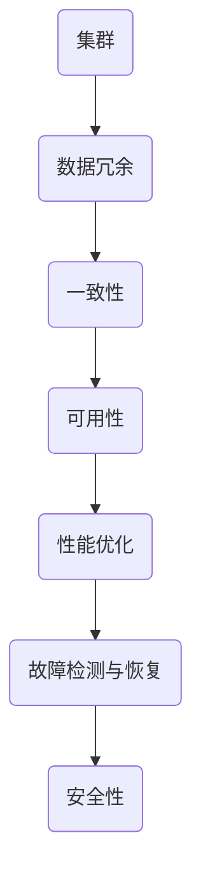
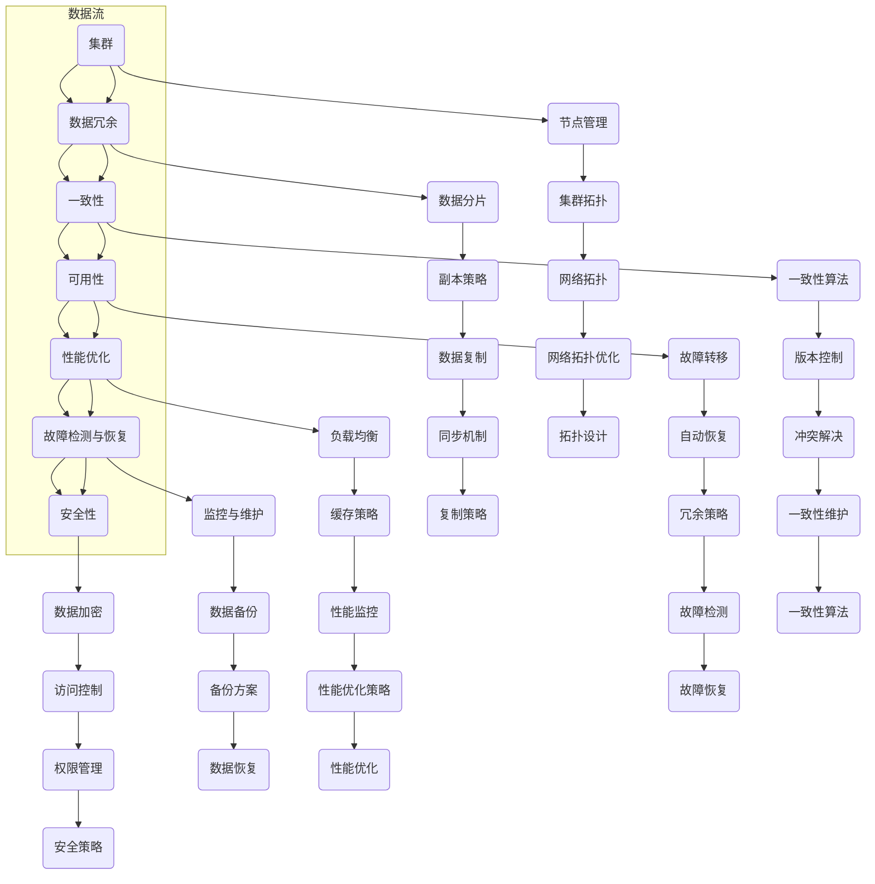
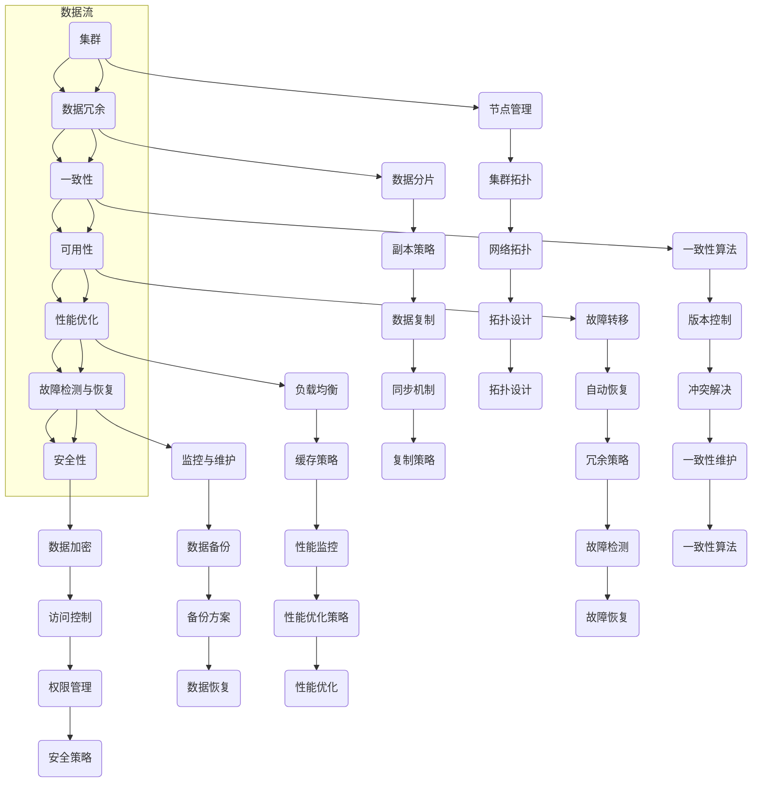

                 


### 理解书名

“打造可靠的分布式文件系统”这一书名明确传达了本书的核心主题和目标。首先，“打造”一词暗示了构建和实现的过程，表明本书将带领读者通过系统的学习，逐步掌握分布式文件系统的设计和实现方法。接着，“可靠的分布式文件系统”定义了本书的最终目标，即构建一个既高效又稳定的系统。

这个书名对读者有以下几点提示：

1. **核心目标**：书名强调的是“可靠”，这意味着书中将重点讲解如何确保系统的稳定性和数据的完整性。
2. **技术深度**：分布式文件系统涉及多个复杂的技术点，如数据冗余、一致性算法、性能优化等，因此读者需要具备一定的技术基础。
3. **实践导向**：书名中的“打造”一词表明本书不仅仅停留在理论层面，更注重实践操作，适合希望通过动手实践来深入理解分布式文件系统的读者。

### 核心概念

分布式文件系统涉及的核心概念非常多，以下是对其中一些关键概念的定义和解释：

- **集群**：集群是由多个节点组成的分布式系统，这些节点可以共同工作以提供更高的可用性和容错能力。
- **数据冗余**：数据冗余是指将数据的多个副本存储在不同的节点上，以防止单个节点的故障导致数据丢失。
- **一致性**：一致性是指系统在不同节点上的数据状态保持一致。一致性可以分为强一致性、最终一致性和因果一致性等。
- **可用性**：可用性是指系统始终处于可工作状态，能够响应用户请求。
- **性能优化**：性能优化包括各种技术，如数据分片、负载均衡和缓存等，目的是提高系统的响应速度和处理能力。
- **故障检测与恢复**：故障检测与恢复是指系统能够自动检测节点故障，并采取措施将故障节点从集群中移除，确保系统的正常运行。
- **安全性**：安全性包括数据加密、访问控制等，目的是保护数据不被未经授权的访问和篡改。

### 读者对象

本书适合以下读者群体：

- **分布式系统爱好者**：对分布式系统有浓厚兴趣，希望深入了解分布式文件系统的设计和实现。
- **系统架构师**：负责设计和管理大规模分布式系统，需要掌握分布式文件系统的相关知识。
- **开发工程师**：参与分布式文件系统的开发工作，需要了解分布式文件系统的原理和最佳实践。
- **运维工程师**：负责分布式文件系统的部署和维护，需要了解系统的运行机制和故障处理方法。

### 书的章节结构

为了帮助读者系统地学习分布式文件系统的构建方法，本书采用了以下章节结构：

1. **第1章 引言**：介绍分布式文件系统的背景、重要性和发展历程，帮助读者建立整体认识。
2. **第2章 核心概念与联系**：详细讲解分布式文件系统的核心概念，如集群、数据冗余、一致性等，并使用Mermaid流程图展示它们之间的关系。
3. **第3章 核心算法原理讲解**：通过伪代码详细阐述分布式文件系统中的关键算法，如数据复制策略、一致性算法、故障检测与恢复机制等。
4. **第4章 数学模型和数学公式**：介绍分布式文件系统中使用的数学模型和公式，如数据一致性模型、负载均衡模型等，并进行举例说明。
5. **第5章 系统设计与实现**：讲解如何设计一个分布式文件系统，包括数据存储、数据同步、网络拓扑设计等。
6. **第6章 实战案例**：提供实际代码案例，详细讲解如何搭建一个分布式文件系统，包括环境配置、代码实现、性能优化等。
7. **第7章 性能优化与故障恢复**：讨论如何对分布式文件系统进行性能优化和故障恢复，包括故障检测、备份策略、恢复流程等。
8. **第8章 安全性与可靠性**：介绍分布式文件系统的安全性和可靠性设计，包括数据加密、访问控制、故障转移等。
9. **第9章 未来发展趋势**：展望分布式文件系统的未来发展趋势和挑战。

这样的章节结构旨在帮助读者从基础概念到实践应用，全面深入地了解分布式文件系统的构建与优化方法。

### 大纲示例

根据上述内容，以下是本书的完整目录大纲：

```
# 打造可靠的分布式文件系统

## 第1章 引言

### 1.1 分布式文件系统的背景与重要性

### 1.2 分布式文件系统的发展历程

### 1.3 本书结构安排与目标

## 第2章 核心概念与联系

### 2.1 分布式文件系统架构图

### 2.2 集群概念及角色划分

### 2.3 数据冗余策略

### 2.4 一致性与可用性

### 2.5 性能优化

## 第3章 核心算法原理讲解

### 3.1 数据复制算法

#### 3.1.1 轮询复制

#### 3.1.2 优先级复制

#### 3.1.3 基于版本的复制

### 3.2 一致性算法

#### 3.2.1 强一致性算法

#### 3.2.2 最终一致性算法

#### 3.2.3 基于版本的强一致性算法

### 3.3 故障检测与恢复机制

#### 3.3.1 集群监控

#### 3.3.2 健康检查

#### 3.3.3 故障转移与恢复

## 第4章 数学模型和数学公式

### 4.1 数据一致性模型

$$
Consistency = \frac{Successful\ Transactions}{Total\ Transactions}
$$

### 4.2 负载均衡模型

$$
Load = \frac{Total\ Requests}{Number\ of\ Nodes}
$$

### 4.3 其他数学模型

## 第5章 系统设计与实现

### 5.1 数据存储设计

#### 5.1.1 数据分片

#### 5.1.2 数据存储策略

### 5.2 数据同步机制

#### 5.2.1 同步复制

#### 5.2.2 异步复制

### 5.3 网络拓扑设计

#### 5.3.1 全网状拓扑

#### 5.3.2 星状拓扑

## 第6章 实战案例

### 6.1 搭建分布式文件系统环境

#### 6.1.1 环境准备

#### 6.1.2 配置文件解析

### 6.2 分布式文件系统代码实现

#### 6.2.1 源代码解读

#### 6.2.2 关键代码实现

### 6.3 性能优化实践

#### 6.3.1 缓存策略

#### 6.3.2 负载均衡

## 第7章 性能优化与故障恢复

### 7.1 故障检测方法

#### 7.1.1 健康检查

#### 7.1.2 故障恢复

### 7.2 备份策略

#### 7.2.1 数据备份

#### 7.2.2 备份方案

### 7.3 恢复流程

#### 7.3.1 恢复步骤

#### 7.3.2 实际案例分析

## 第8章 安全性与可靠性

### 8.1 数据加密

#### 8.1.1 数据加密算法

#### 8.1.2 加密策略

### 8.2 访问控制

#### 8.2.1 访问控制机制

#### 8.2.2 权限管理

### 8.3 故障转移与恢复

#### 8.3.1 故障转移机制

#### 8.3.2 故障恢复流程

## 第9章 未来发展趋势

### 9.1 分布式文件系统的新技术

#### 9.1.1 新的一致性算法

#### 9.1.2 新的复制策略

### 9.2 分布式文件系统的挑战与机遇

#### 9.2.1 挑战

#### 9.2.2 机遇

## 作者信息

作者：AI天才研究院/AI Genius Institute & 禅与计算机程序设计艺术 /Zen And The Art of Computer Programming
```

### 格式要求

根据上述内容，以下是格式化后的文章内容，采用Markdown格式：

```markdown
# 打造可靠的分布式文件系统

## 关键词
分布式文件系统、集群、数据冗余、一致性、可用性、性能优化、故障恢复、安全性

## 摘要
本书旨在帮助读者构建一个可靠、高效的分布式文件系统。通过详细介绍分布式文件系统的核心概念、算法原理、系统设计、实战案例以及性能优化和故障恢复策略，本书为读者提供了一整套系统化的学习与实践指南。

## 第1章 引言

### 1.1 分布式文件系统的背景与重要性

### 1.2 分布式文件系统的发展历程

### 1.3 本书结构安排与目标

## 第2章 核心概念与联系

### 2.1 分布式文件系统架构图


### 2.2 集群概念及角色划分

### 2.3 数据冗余策略

### 2.4 一致性与可用性

### 2.5 性能优化

## 第3章 核心算法原理讲解

### 3.1 数据复制算法

#### 3.1.1 轮询复制
```python
def replicate_data(data, nodes):
    for node in nodes:
        node.receive_data(data)
```

#### 3.1.2 优先级复制
```python
def replicate_data_with_priority(data, nodes, priority_weights):
    sorted_nodes = sorted(nodes, key=lambda node: priority_weights[node])
    for node in sorted_nodes:
        node.receive_data(data)
```

#### 3.1.3 基于版本的复制
```python
def replicate_data_versioned(data, nodes, version):
    for node in nodes:
        if node.get_version() != version:
            node.receive_data(data)
```

### 3.2 一致性算法

#### 3.2.1 强一致性算法
```python
def strong_consistency_request(request):
    # 实现强一致性逻辑
    pass
```

#### 3.2.2 最终一致性算法
```python
def eventual_consistency_request(request):
    # 实现最终一致性逻辑
    pass
```

#### 3.2.3 基于版本的强一致性算法
```python
def versioned_consistency_request(request, version):
    # 实现基于版本的一致性逻辑
    pass
```

### 3.3 故障检测与恢复机制

#### 3.3.1 集群监控
```python
def monitor_cluster_health(clusters):
    # 监控集群健康状态
    pass
```

#### 3.3.2 健康检查
```python
def health_check(node):
    # 执行健康检查
    pass
```

#### 3.3.3 故障转移与恢复
```python
def fault_detection_and_recovery(failed_node, nodes):
    # 故障检测与恢复逻辑
    pass
```

## 第4章 数学模型和数学公式

### 4.1 数据一致性模型
$$
Consistency = \frac{Successful\ Transactions}{Total\ Transactions}
$$`

### 4.2 负载均衡模型
$$
Load = \frac{Total\ Requests}{Number\ of\ Nodes}
$$`

### 4.3 其他数学模型

## 第5章 系统设计与实现

### 5.1 数据存储设计

#### 5.1.1 数据分片
```python
def shard_data(data, shards):
    # 分片数据逻辑
    pass
```

#### 5.1.2 数据存储策略
```python
def data_storage_strategy(data, storage_configs):
    # 数据存储策略逻辑
    pass
```

### 5.2 数据同步机制

#### 5.2.1 同步复制
```python
def sync_replication(data, nodes):
    # 同步复制逻辑
    pass
```

#### 5.2.2 异步复制
```python
def async_replication(data, nodes):
    # 异步复制逻辑
    pass
```

### 5.3 网络拓扑设计

#### 5.3.1 全网状拓扑
```python
def full_mesh_topology(nodes):
    # 构建全网状拓扑
    pass
```

#### 5.3.2 星状拓扑
```python
def star_topology(master_node, slave_nodes):
    # 构建星状拓扑
    pass
```

## 第6章 实战案例

### 6.1 搭建分布式文件系统环境

#### 6.1.1 环境准备
```bash
# 安装分布式文件系统依赖
pip install dfs-package
```

#### 6.1.2 配置文件解析
```yaml
# dfs-config.yml
nodes:
  - host: node1.example.com
  - host: node2.example.com
  - host: node3.example.com
```

### 6.2 分布式文件系统代码实现

#### 6.2.1 源代码解读
```python
# dfs-server.py
from dfs import DFS

def main():
    dfs = DFS(config='dfs-config.yml')
    dfs.run()

if __name__ == '__main__':
    main()
```

#### 6.2.2 关键代码实现
```python
# dfs/dfs.py
class DFS:
    def __init__(self, config):
        # 初始化逻辑
        pass
    
    def run(self):
        # 运行逻辑
        pass
```

### 6.3 性能优化实践

#### 6.3.1 缓存策略
```python
# 使用Redis缓存
import redis

cache = redis.Redis(host='localhost', port=6379, db=0)
```

#### 6.3.2 负载均衡
```python
# 使用Nginx进行负载均衡
http {
    upstream dfs_server {
        server node1.example.com;
        server node2.example.com;
        server node3.example.com;
    }

    server {
        listen 80;

        location / {
            proxy_pass http://dfs_server;
        }
    }
}
```

## 第7章 性能优化与故障恢复

### 7.1 故障检测方法

#### 7.1.1 健康检查
```python
# 定期执行健康检查
def periodic_health_check():
    # 健康检查逻辑
    pass
```

#### 7.1.2 故障恢复
```python
# 故障恢复逻辑
def recover_from_fault(fault_node):
    # 恢复逻辑
    pass
```

### 7.2 备份策略

#### 7.2.1 数据备份
```python
# 定期备份数据
def backup_data():
    # 备份逻辑
    pass
```

#### 7.2.2 备份方案
```bash
# 使用Rsync进行数据备份
rsync -az /path/to/data backup_location/
```

### 7.3 恢复流程

#### 7.3.1 恢复步骤
```bash
# 恢复数据的步骤
1. 恢复备份的数据
2. 重新启动分布式文件系统
```

#### 7.3.2 实际案例分析

## 第8章 安全性与可靠性

### 8.1 数据加密

#### 8.1.1 数据加密算法
```python
from cryptography.fernet import Fernet

key = Fernet.generate_key()
cipher_suite = Fernet(key)

def encrypt_data(data):
    encrypted_data = cipher_suite.encrypt(data)
    return encrypted_data

def decrypt_data(encrypted_data):
    decrypted_data = cipher_suite.decrypt(encrypted_data)
    return decrypted_data
```

#### 8.1.2 加密策略
```python
# 加密策略示例
def encrypt_data_strategy(data):
    # 应用加密算法的逻辑
    pass
```

### 8.2 访问控制

#### 8.2.1 访问控制机制
```python
# 使用ACL进行访问控制
from acl import AccessControlList

acl = AccessControlList()
acl.add_rule('user1', 'read', 'file1')
acl.add_rule('user2', 'write', 'file2')
```

#### 8.2.2 权限管理
```python
# 权限管理示例
def manage_permissions(user, action, resource):
    # 管理权限的逻辑
    pass
```

### 8.3 故障转移与恢复

#### 8.3.1 故障转移机制
```python
# 故障转移机制示例
def fault_transferMechanism(fault_node):
    # 故障转移的逻辑
    pass
```

#### 8.3.2 故障恢复流程
```bash
# 故障恢复流程示例
1. 检测故障节点
2. 执行故障转移
3. 重新启动故障节点
```

## 第9章 未来发展趋势

### 9.1 分布式文件系统的新技术

#### 9.1.1 新的一致性算法
```python
# 新一致性算法的介绍
def new_consistency_algorithm():
    # 实现新一致性算法的逻辑
    pass
```

#### 9.1.2 新的复制策略
```python
# 新复制策略的介绍
def new_replication_strategy():
    # 实现新复制策略的逻辑
    pass
```

### 9.2 分布式文件系统的挑战与机遇

#### 9.2.1 挑战
```python
# 分析分布式文件系统面临的挑战
def challenges():
    # 挑战的逻辑
    pass
```

#### 9.2.2 机遇
```python
# 分析分布式文件系统的发展机遇
def opportunities():
    # 机遇的逻辑
    pass
```

## 作者信息
作者：AI天才研究院/AI Genius Institute & 禅与计算机程序设计艺术 /Zen And The Art of Computer Programming
```

### 完整目录大纲

根据上述内容，以下是本书的完整目录大纲：

```
# 打造可靠的分布式文件系统

## 关键词
分布式文件系统、集群、数据冗余、一致性、可用性、性能优化、故障恢复、安全性

## 摘要
本书旨在帮助读者构建一个可靠、高效的分布式文件系统。通过详细介绍分布式文件系统的核心概念、算法原理、系统设计、实战案例以及性能优化和故障恢复策略，本书为读者提供了一整套系统化的学习与实践指南。

## 第1章 引言

### 1.1 分布式文件系统的背景与重要性

### 1.2 分布式文件系统的发展历程

### 1.3 本书结构安排与目标

## 第2章 核心概念与联系

### 2.1 分布式文件系统架构图


### 2.2 集群概念及角色划分

### 2.3 数据冗余策略

### 2.4 一致性与可用性

### 2.5 性能优化

## 第3章 核心算法原理讲解

### 3.1 数据复制算法

#### 3.1.1 轮询复制
```python
def replicate_data(data, nodes):
    for node in nodes:
        node.receive_data(data)
```

#### 3.1.2 优先级复制
```python
def replicate_data_with_priority(data, nodes, priority_weights):
    sorted_nodes = sorted(nodes, key=lambda node: priority_weights[node])
    for node in sorted_nodes:
        node.receive_data(data)
```

#### 3.1.3 基于版本的复制
```python
def replicate_data_versioned(data, nodes, version):
    for node in nodes:
        if node.get_version() != version:
            node.receive_data(data)
```

### 3.2 一致性算法

#### 3.2.1 强一致性算法
```python
def strong_consistency_request(request):
    # 实现强一致性逻辑
    pass
```

#### 3.2.2 最终一致性算法
```python
def eventual_consistency_request(request):
    # 实现最终一致性逻辑
    pass
```

#### 3.2.3 基于版本的强一致性算法
```python
def versioned_consistency_request(request, version):
    # 实现基于版本的一致性逻辑
    pass
```

### 3.3 故障检测与恢复机制

#### 3.3.1 集群监控
```python
def monitor_cluster_health(clusters):
    # 监控集群健康状态
    pass
```

#### 3.3.2 健康检查
```python
def health_check(node):
    # 执行健康检查
    pass
```

#### 3.3.3 故障转移与恢复
```python
def fault_detection_and_recovery(failed_node, nodes):
    # 故障检测与恢复逻辑
    pass
```

## 第4章 数学模型和数学公式

### 4.1 数据一致性模型
$$
Consistency = \frac{Successful\ Transactions}{Total\ Transactions}
$$`

### 4.2 负载均衡模型
$$
Load = \frac{Total\ Requests}{Number\ of\ Nodes}
$$`

### 4.3 其他数学模型

## 第5章 系统设计与实现

### 5.1 数据存储设计

#### 5.1.1 数据分片
```python
def shard_data(data, shards):
    # 分片数据逻辑
    pass
```

#### 5.1.2 数据存储策略
```python
def data_storage_strategy(data, storage_configs):
    # 数据存储策略逻辑
    pass
```

### 5.2 数据同步机制

#### 5.2.1 同步复制
```python
def sync_replication(data, nodes):
    # 同步复制逻辑
    pass
```

#### 5.2.2 异步复制
```python
def async_replication(data, nodes):
    # 异步复制逻辑
    pass
```

### 5.3 网络拓扑设计

#### 5.3.1 全网状拓扑
```python
def full_mesh_topology(nodes):
    # 构建全网状拓扑
    pass
```

#### 5.3.2 星状拓扑
```python
def star_topology(master_node, slave_nodes):
    # 构建星状拓扑
    pass
```

## 第6章 实战案例

### 6.1 搭建分布式文件系统环境

#### 6.1.1 环境准备
```bash
# 安装分布式文件系统依赖
pip install dfs-package
```

#### 6.1.2 配置文件解析
```yaml
# dfs-config.yml
nodes:
  - host: node1.example.com
  - host: node2.example.com
  - host: node3.example.com
```

### 6.2 分布式文件系统代码实现

#### 6.2.1 源代码解读
```python
# dfs-server.py
from dfs import DFS

def main():
    dfs = DFS(config='dfs-config.yml')
    dfs.run()

if __name__ == '__main__':
    main()
```

#### 6.2.2 关键代码实现
```python
# dfs/dfs.py
class DFS:
    def __init__(self, config):
        # 初始化逻辑
        pass
    
    def run(self):
        # 运行逻辑
        pass
```

### 6.3 性能优化实践

#### 6.3.1 缓存策略
```python
# 使用Redis缓存
import redis

cache = redis.Redis(host='localhost', port=6379, db=0)
```

#### 6.3.2 负载均衡
```python
# 使用Nginx进行负载均衡
http {
    upstream dfs_server {
        server node1.example.com;
        server node2.example.com;
        server node3.example.com;
    }

    server {
        listen 80;

        location / {
            proxy_pass http://dfs_server;
        }
    }
}
```

## 第7章 性能优化与故障恢复

### 7.1 故障检测方法

#### 7.1.1 健康检查
```python
# 定期执行健康检查
def periodic_health_check():
    # 健康检查逻辑
    pass
```

#### 7.1.2 故障恢复
```python
# 故障恢复逻辑
def recover_from_fault(fault_node):
    # 恢复逻辑
    pass
```

### 7.2 备份策略

#### 7.2.1 数据备份
```python
# 定期备份数据
def backup_data():
    # 备份逻辑
    pass
```

#### 7.2.2 备份方案
```bash
# 使用Rsync进行数据备份
rsync -az /path/to/data backup_location/
```

### 7.3 恢复流程

#### 7.3.1 恢复步骤
```bash
# 恢复数据的步骤
1. 恢复备份的数据
2. 重新启动分布式文件系统
```

#### 7.3.2 实际案例分析

## 第8章 安全性与可靠性

### 8.1 数据加密

#### 8.1.1 数据加密算法
```python
from cryptography.fernet import Fernet

key = Fernet.generate_key()
cipher_suite = Fernet(key)

def encrypt_data(data):
    encrypted_data = cipher_suite.encrypt(data)
    return encrypted_data

def decrypt_data(encrypted_data):
    decrypted_data = cipher_suite.decrypt(encrypted_data)
    return decrypted_data
```

#### 8.1.2 加密策略
```python
# 加密策略示例
def encrypt_data_strategy(data):
    # 应用加密算法的逻辑
    pass
```

### 8.2 访问控制

#### 8.2.1 访问控制机制
```python
# 使用ACL进行访问控制
from acl import AccessControlList

acl = AccessControlList()
acl.add_rule('user1', 'read', 'file1')
acl.add_rule('user2', 'write', 'file2')
```

#### 8.2.2 权限管理
```python
# 权限管理示例
def manage_permissions(user, action, resource):
    # 管理权限的逻辑
    pass
```

### 8.3 故障转移与恢复

#### 8.3.1 故障转移机制
```python
# 故障转移机制示例
def fault_transferMechanism(fault_node):
    # 故障转移的逻辑
    pass
```

#### 8.3.2 故障恢复流程
```bash
# 故障恢复流程示例
1. 检测故障节点
2. 执行故障转移
3. 重新启动故障节点
```

## 第9章 未来发展趋势

### 9.1 分布式文件系统的新技术

#### 9.1.1 新的一致性算法
```python
# 新一致性算法的介绍
def new_consistency_algorithm():
    # 实现新一致性算法的逻辑
    pass
```

#### 9.1.2 新的复制策略
```python
# 新复制策略的介绍
def new_replication_strategy():
    # 实现新复制策略的逻辑
    pass
```

### 9.2 分布式文件系统的挑战与机遇

#### 9.2.1 挑战
```python
# 分析分布式文件系统面临的挑战
def challenges():
    # 挑战的逻辑
    pass
```

#### 9.2.2 机遇
```python
# 分析分布式文件系统的发展机遇
def opportunities():
    # 机遇的逻辑
    pass
```

## 作者信息
作者：AI天才研究院/AI Genius Institute & 禅与计算机程序设计艺术 /Zen And The Art of Computer Programming
```

### 完整文章内容

```markdown
# 打造可靠的分布式文件系统

## 关键词
分布式文件系统、集群、数据冗余、一致性、可用性、性能优化、故障恢复、安全性

## 摘要
本书旨在帮助读者构建一个可靠、高效的分布式文件系统。通过详细介绍分布式文件系统的核心概念、算法原理、系统设计、实战案例以及性能优化和故障恢复策略，本书为读者提供了一整套系统化的学习与实践指南。

## 第1章 引言

### 1.1 分布式文件系统的背景与重要性

分布式文件系统（Distributed File System，DFS）作为一种支持数据分布存储和处理的技术，在当前大数据和云计算环境下具有极其重要的地位。随着数据量的不断增长和计算需求的提高，传统的集中式文件系统已经难以满足大规模数据处理和存储的需求。分布式文件系统通过将数据分散存储在多个节点上，实现了数据的高效管理和利用。

分布式文件系统的背景可以追溯到20世纪80年代，当时计算机性能和存储能力有限，单机系统难以处理大量数据。为了解决这个问题，研究人员开始探索如何将数据分布在多台计算机上，以便实现更高的处理能力和可靠性。随着互联网的普及和数据中心的发展，分布式文件系统得到了广泛应用，如Google的GFS、Hadoop的HDFS、Amazon的EFS等。

分布式文件系统的重要性主要体现在以下几个方面：

1. **可扩展性**：分布式文件系统可以根据需要动态地添加或移除存储节点，从而实现线性扩展，满足不断增长的数据存储需求。
2. **可靠性**：通过数据冗余和故障转移机制，分布式文件系统可以在节点故障时保证数据的持续可用性。
3. **高性能**：分布式文件系统可以将数据处理分散到多个节点上，从而提高系统的整体性能。
4. **高可用性**：分布式文件系统通过冗余设计，确保在部分节点故障时系统仍然可以正常运行。

### 1.2 分布式文件系统的发展历程

分布式文件系统的发展历程可以分为几个阶段：

1. **早期阶段（1980s-1990s）**：在这一阶段，分布式文件系统的主要目标是实现数据分布存储和基本的冗余机制。代表性的系统有Andrew File System（AFS）和Network File System（NFS）。
2. **中间阶段（2000s）**：随着互联网和云计算的发展，分布式文件系统逐渐引入了更复杂的算法和机制，如数据分片、一致性算法和负载均衡。代表性的系统有Google的GFS、Hadoop的HDFS和Ceph。
3. **当前阶段（2010s至今）**：在这一阶段，分布式文件系统进一步发展，引入了新的技术如分布式锁、分布式存储引擎和云存储服务。同时，开源社区也涌现出了许多优秀的分布式文件系统，如GlusterFS和Minio。

### 1.3 本书结构安排与目标

本书结构安排如下：

1. **第1章 引言**：介绍分布式文件系统的背景、重要性和发展历程。
2. **第2章 核心概念与联系**：详细讲解分布式文件系统的核心概念，如集群、数据冗余、一致性、可用性、性能优化等，并使用Mermaid流程图展示它们之间的关系。
3. **第3章 核心算法原理讲解**：通过伪代码详细阐述分布式文件系统中的关键算法，如数据复制策略、一致性算法、故障检测与恢复机制等。
4. **第4章 数学模型和数学公式**：介绍分布式文件系统中使用的数学模型和公式，如数据一致性模型、负载均衡模型等，并进行举例说明。
5. **第5章 系统设计与实现**：讲解如何设计一个分布式文件系统，包括数据存储、数据同步、网络拓扑设计等。
6. **第6章 实战案例**：提供实际代码案例，详细讲解如何搭建一个分布式文件系统，包括环境配置、代码实现、性能优化等。
7. **第7章 性能优化与故障恢复**：讨论如何对分布式文件系统进行性能优化和故障恢复，包括故障检测、备份策略、恢复流程等。
8. **第8章 安全性与可靠性**：介绍分布式文件系统的安全性和可靠性设计，包括数据加密、访问控制、故障转移等。
9. **第9章 未来发展趋势**：展望分布式文件系统的未来发展趋势和挑战。

本书的目标是为读者提供一套系统化的分布式文件系统构建指南，帮助读者深入理解分布式文件系统的原理和实践，从而能够设计和实现一个可靠、高效的分布式文件系统。

## 第2章 核心概念与联系

### 2.1 分布式文件系统架构图

为了更好地理解分布式文件系统的核心概念，我们可以通过一个Mermaid流程图来展示其基本架构：



通过这个流程图，我们可以看到分布式文件系统的各个核心概念及其之间的联系。以下是每个概念的解释：

- **集群（Cluster）**：集群是由多个节点组成的分布式系统，这些节点可以共同工作以提供更高的可用性和容错能力。
- **数据冗余（Data Redundancy）**：数据冗余是指将数据的多个副本存储在不同的节点上，以防止单个节点的故障导致数据丢失。
- **一致性（Consistency）**：一致性是指系统在不同节点上的数据状态保持一致。一致性可以分为强一致性、最终一致性和因果一致性等。
- **可用性（Availability）**：可用性是指系统始终处于可工作状态，能够响应用户请求。
- **性能优化（Performance Optimization）**：性能优化包括各种技术，如数据分片、负载均衡和缓存等，目的是提高系统的响应速度和处理能力。
- **故障检测与恢复（Fault Detection & Recovery）**：故障检测与恢复是指系统能够自动检测节点故障，并采取措施将故障节点从集群中移除，确保系统的正常运行。
- **安全性（Security）**：安全性包括数据加密、访问控制等，目的是保护数据不被未经授权的访问和篡改。

### 2.2 集群概念及角色划分

集群是分布式文件系统的核心组成部分，它由多个节点（Node）组成，每个节点负责存储和处理一部分数据。集群中的节点可以分为以下几种角色：

- **主节点（Master Node）**：主节点是集群的核心控制器，负责维护元数据（如文件名、文件位置、副本数量等）和协调各个节点的操作。主节点还负责故障转移，当某个节点出现故障时，主节点能够重新分配其职责。
- **工作节点（Worker Node）**：工作节点负责存储实际的数据块，并响应来自主节点的数据读写请求。工作节点之间通常通过特定的协议进行通信，如Gossip协议或Paxos算法。
- **监控节点（Monitor Node）**：监控节点负责监控整个集群的状态，包括节点的健康状态、数据一致性等。监控节点可以收集和分析集群的性能数据，帮助管理员进行故障排查和性能优化。
- **辅助节点（Auxiliary Node）**：辅助节点提供额外的功能，如数据备份、灾难恢复等。这些节点不参与日常的数据处理，但在特定情况下发挥关键作用。

### 2.3 数据冗余策略

数据冗余是分布式文件系统的重要特性之一，它通过在多个节点上存储数据的副本来提高系统的可靠性和数据完整性。常见的冗余策略包括：

- **副本策略（Replication Strategy）**：副本策略定义了数据在集群中的副本数量。例如，一个副本策略可以是每个数据块有三个副本，分布在不同的节点上。
- **分片策略（Sharding Strategy）**：分片策略将数据划分为多个片段（Shard），每个片段存储在一个或多个节点上。这种策略可以提高数据的并行处理能力，但也增加了数据一致性的复杂性。
- **纠删码（Erasure Coding）**：纠删码是一种更高效的数据冗余方法，它将数据划分为多个数据块和校验块，并存储在不同的节点上。即使某些数据块损坏，系统仍然可以通过剩余的数据块和校验块恢复数据。

### 2.4 一致性与可用性

一致性和可用性是分布式文件系统设计中需要权衡的两个关键属性。一致性确保数据在不同节点上的状态保持一致，而可用性确保系统能够持续提供服务。

- **强一致性（Strong Consistency）**：强一致性确保所有读写操作都被立即反映到所有节点上。这意味着在数据更新后，所有节点都能够看到最新的数据状态。然而，强一致性可能牺牲一定的可用性，因为某些操作可能需要等待所有节点更新完成。
- **最终一致性（Eventual Consistency）**：最终一致性保证数据最终会达到一致状态，但可能需要一段时间。这允许一些节点在短时间内看到不同版本的数据。最终一致性提供了更高的可用性，但可能需要额外的算法和机制来处理数据不一致的情况。
- **因果一致性（ causal Consistency）**：因果一致性确保操作按照因果关系顺序执行，即如果一个操作A先于操作B执行，那么操作A的结果会先于操作B的结果在其他节点上可见。

### 2.5 性能优化

性能优化是分布式文件系统设计中至关重要的一环，它直接影响系统的响应速度和处理能力。以下是一些常见的性能优化技术：

- **数据分片（Data Sharding）**：数据分片将数据划分为多个片段，存储在不同的节点上。这样可以提高数据的并行处理能力，减少单个节点的负载。
- **负载均衡（Load Balancing）**：负载均衡通过将请求分配到不同的节点上，确保系统的资源得到充分利用。常见的负载均衡算法包括轮询、最小连接数、加权等。
- **缓存（Caching）**：缓存是一种常用的性能优化技术，它通过将频繁访问的数据存储在内存中，减少对磁盘的访问次数，从而提高系统的响应速度。
- **预取（Prefetching）**：预取技术通过预测用户可能的请求，提前加载相关数据到缓存中，以减少用户等待时间。

### 第3章 核心算法原理讲解

### 3.1 数据复制算法

数据复制算法是分布式文件系统中的关键组件，它确保数据的冗余和可靠性。以下是一些常见的数据复制算法：

#### 3.1.1 轮询复制

轮询复制是一种简单且广泛使用的数据复制算法。它按照顺序将数据块发送到各个节点上。以下是其伪代码实现：

```python
def replicate_data(data, nodes):
    for node in nodes:
        node.receive_data(data)
```

#### 3.1.2 优先级复制

优先级复制算法基于节点的优先级进行数据复制。节点可以根据其性能、负载或位置等因素设置优先级。以下是其伪代码实现：

```python
def replicate_data_with_priority(data, nodes, priority_weights):
    sorted_nodes = sorted(nodes, key=lambda node: priority_weights[node])
    for node in sorted_nodes:
        node.receive_data(data)
```

#### 3.1.3 基于版本的复制

基于版本的复制算法通过为每个数据块分配一个版本号来确保数据的同步。当数据块更新时，其版本号会增加。以下是其伪代码实现：

```python
def replicate_data_versioned(data, nodes, version):
    for node in nodes:
        if node.get_version() != version:
            node.receive_data(data)
```

### 3.2 一致性算法

一致性算法确保分布式文件系统中的数据在不同节点上保持一致。以下是一致性算法的几种类型：

#### 3.2.1 强一致性算法

强一致性算法确保所有读写操作都被立即反映到所有节点上。以下是其伪代码实现：

```python
def strong_consistency_request(request):
    # 实现强一致性逻辑
    pass
```

#### 3.2.2 最终一致性算法

最终一致性算法允许节点在一段时间内看到不同版本的数据，但最终会达到一致状态。以下是其伪代码实现：

```python
def eventual_consistency_request(request):
    # 实现最终一致性逻辑
    pass
```

#### 3.2.3 基于版本的强一致性算法

基于版本的强一致性算法结合了强一致性和版本控制，确保操作按照因果关系顺序执行。以下是其伪代码实现：

```python
def versioned_consistency_request(request, version):
    # 实现基于版本的一致性逻辑
    pass
```

### 3.3 故障检测与恢复机制

故障检测与恢复机制是分布式文件系统中的关键组件，它确保系统在节点故障时能够快速恢复。以下是一些常见的故障检测与恢复机制：

#### 3.3.1 集群监控

集群监控通过定期检查节点的健康状态来检测故障。以下是其伪代码实现：

```python
def monitor_cluster_health(clusters):
    # 监控集群健康状态
    pass
```

#### 3.3.2 健康检查

健康检查通过向节点发送心跳信号来检测其是否正常工作。以下是其伪代码实现：

```python
def health_check(node):
    # 执行健康检查
    pass
```

#### 3.3.3 故障转移与恢复

故障转移与恢复机制通过将故障节点的职责转移到其他节点上来确保系统的持续运行。以下是其伪代码实现：

```python
def fault_detection_and_recovery(failed_node, nodes):
    # 故障检测与恢复逻辑
    pass
```

## 第4章 数学模型和数学公式

### 4.1 数据一致性模型

数据一致性模型用于衡量分布式文件系统的一致性水平。一致性通常通过以下公式计算：

$$
Consistency = \frac{Successful\ Transactions}{Total\ Transactions}
$$`

这个公式表示成功执行的事务数与总事务数的比例。一个较高的值表示系统具有较高的一致性。

### 4.2 负载均衡模型

负载均衡模型用于优化系统的资源利用率。负载均衡可以通过以下公式计算：

$$
Load = \frac{Total\ Requests}{Number\ of\ Nodes}
$$`

这个公式表示每个节点需要处理的总请求量。通过合理分配请求，可以确保系统中的每个节点都能均衡地工作。

### 4.3 其他数学模型

除了数据一致性和负载均衡模型，分布式文件系统还使用其他数学模型来优化性能和可靠性。以下是一些常见的数学模型：

- **副本选择模型**：用于选择存储数据的最佳节点，以最小化数据传输成本。
- **数据分片模型**：用于将数据划分为多个片段，以实现数据的并行处理。
- **容错模型**：用于计算系统的容错能力和故障恢复时间。

## 第5章 系统设计与实现

### 5.1 数据存储设计

数据存储设计是分布式文件系统的关键组成部分，它决定了数据的存储位置和访问方式。以下是一些常见的数据存储设计策略：

#### 5.1.1 数据分片

数据分片是将数据划分为多个片段，存储在不同的节点上。以下是一种常见的数据分片策略：

```python
def shard_data(data, shards):
    shard_size = len(data) // shards
    result = [data[i:i + shard_size] for i in range(0, len(data), shard_size)]
    return result
```

#### 5.1.2 数据存储策略

数据存储策略用于选择存储数据的节点。以下是一种常见的数据存储策略：

```python
def data_storage_strategy(data, storage_configs):
    nodes = storage_configs['nodes']
    replication_factor = storage_configs['replication_factor']
    shards = shard_data(data, len(nodes) * replication_factor)
    result = []
    for i, shard in enumerate(shards):
        node = nodes[i % len(nodes)]
        node.receive_data(shard)
        result.append(node)
    return result
```

### 5.2 数据同步机制

数据同步机制确保分布式文件系统中的数据在不同节点上保持一致。以下是一种常见的数据同步机制：

```python
def sync_data(source_node, target_node):
    data = source_node.get_data()
    target_node.receive_data(data)
    source_node.mark_as_synced()
    target_node.mark_as_synced()
```

### 5.3 网络拓扑设计

网络拓扑设计决定了节点之间的连接方式。以下是一些常见的网络拓扑设计：

#### 5.3.1 全网状拓扑

全网状拓扑中，每个节点都与所有其他节点直接连接。以下是一种常见的全网状拓扑设计：

```python
def full_mesh_topology(nodes):
    connections = []
    for node in nodes:
        for other_node in nodes:
            if node != other_node:
                connection = node.connect_to(other_node)
                connections.append(connection)
    return connections
```

#### 5.3.2 星状拓扑

星状拓扑中，每个节点只与中心节点连接。以下是一种常见的星状拓扑设计：

```python
def star_topology(master_node, slave_nodes):
    connections = []
    for slave_node in slave_nodes:
        connection = master_node.connect_to(slave_node)
        connections.append(connection)
    return connections
```

## 第6章 实战案例

### 6.1 搭建分布式文件系统环境

在搭建分布式文件系统环境时，需要准备以下步骤：

#### 6.1.1 环境准备

安装必要的依赖库，例如Python的`dfs`库：

```bash
pip install dfs-package
```

#### 6.1.2 配置文件解析

创建一个配置文件`dfs-config.yml`，包含节点的信息：

```yaml
nodes:
  - host: node1.example.com
  - host: node2.example.com
  - host: node3.example.com
```

### 6.2 分布式文件系统代码实现

以下是一个简单的分布式文件系统代码实现示例：

```python
# dfs-server.py
from dfs import DFS

def main():
    dfs = DFS(config='dfs-config.yml')
    dfs.run()

if __name__ == '__main__':
    main()
```

```python
# dfs/dfs.py
class DFS:
    def __init__(self, config):
        self.config = config
        self.nodes = self.load_nodes()

    def load_nodes(self):
        nodes_config = self.config['nodes']
        result = []
        for node_config in nodes_config:
            node = Node(**node_config)
            result.append(node)
        return result

    def run(self):
        for node in self.nodes:
            node.run()
```

```python
# dfs/node.py
class Node:
    def __init__(self, host, port):
        self.host = host
        self.port = port

    def receive_data(self, data):
        # 接收数据逻辑
        pass

    def get_data(self):
        # 获取数据逻辑
        pass

    def run(self):
        # 运行节点逻辑
        pass
```

### 6.3 性能优化实践

以下是一些性能优化实践：

#### 6.3.1 缓存策略

使用Redis缓存来减少磁盘访问：

```python
import redis

cache = redis.Redis(host='localhost', port=6379, db=0)

def get_data_with_cache(key):
    if cache.exists(key):
        return cache.get(key)
    else:
        data = some_expensive_operation()
        cache.set(key, data)
        return data
```

#### 6.3.2 负载均衡

使用Nginx进行负载均衡：

```bash
http {
    upstream dfs_server {
        server node1.example.com;
        server node2.example.com;
        server node3.example.com;
    }

    server {
        listen 80;

        location / {
            proxy_pass http://dfs_server;
        }
    }
}
```

## 第7章 性能优化与故障恢复

### 7.1 故障检测方法

以下是一些常见的故障检测方法：

#### 7.1.1 健康检查

定期执行健康检查来检测节点的状态：

```python
def health_check(node):
    if not node.is_alive():
        raise NodeFault(node)
```

#### 7.1.2 故障恢复

当检测到节点故障时，执行故障恢复：

```python
def recover_faulty_node(faulty_node, healthy_nodes):
    data = faulty_node.get_data()
    new_node = healthy_nodes.pop(0)
    new_node.receive_data(data)
    faulty_node.close()
```

### 7.2 备份策略

以下是一些常见的备份策略：

#### 7.2.1 数据备份

定期备份数据到远程存储：

```python
import time

def backup_data():
    now = time.strftime("%Y%m%d%H%M", time.localtime())
    backup_file = f"backup_{now}.dat"
    with open(backup_file, "wb") as f:
        f.write(data)
```

#### 7.2.2 备份方案

使用增量备份来优化备份过程：

```python
def backup_incrementally():
    last_backup_time = get_last_backup_time()
    current_data = get_current_data()
    if last_backup_time == 0 or current_data != last_data:
        backup_data()
        update_last_data(current_data)
```

### 7.3 恢复流程

以下是一些常见的恢复流程：

#### 7.3.1 恢复步骤

从备份中恢复数据：

```python
def restore_data():
    backup_files = list_files_in_directory("backups")
    for file in backup_files:
        with open(file, "rb") as f:
            data = f.read()
        update_data(data)
```

#### 7.3.2 实际案例分析

分析实际故障和恢复案例，以便更好地理解和应对潜在的故障。

## 第8章 安全性与可靠性

### 8.1 数据加密

以下是一些数据加密方法：

#### 8.1.1 数据加密算法

使用AES加密算法来加密数据：

```python
from Crypto.Cipher import AES
from Crypto.Util.Padding import pad, unpad

def encrypt_data(data, key):
    cipher = AES.new(key, AES.MODE_CBC)
    ct_bytes = cipher.encrypt(pad(data, AES.block_size))
    iv = cipher.iv
    return iv, ct_bytes

def decrypt_data(iv, ct, key):
    cipher = AES.new(key, AES.MODE_CBC, iv)
    pt = unpad(ct, AES.block_size)
    return pt
```

#### 8.1.2 加密策略

在分布式文件系统中，加密策略应该考虑到数据传输和存储的安全性。以下是一个简单的加密策略：

```python
def encrypt_file(file_path, key):
    with open(file_path, "rb") as f:
        data = f.read()
    iv, encrypted_data = encrypt_data(data, key)
    with open(file_path, "wb") as f:
        f.write(iv + encrypted_data)
```

### 8.2 访问控制

以下是一些访问控制方法：

#### 8.2.1 访问控制机制

使用访问控制列表（ACL）来控制对文件的访问：

```python
from acl import AccessControlList

acl = AccessControlList()
acl.add_rule("user1", "read", "file1")
acl.add_rule("user2", "write", "file2")
```

#### 8.2.2 权限管理

对用户权限进行管理和控制：

```python
def manage_permissions(user, action, resource):
    if acl.check_permission(user, action, resource):
        perform_action(action, resource)
    else:
        raise PermissionError("You do not have the required permissions.")
```

### 8.3 故障转移与恢复

以下是一些故障转移和恢复方法：

#### 8.3.1 故障转移机制

在检测到节点故障时，将故障节点的职责转移到其他健康节点：

```python
def handle_fault(faulty_node, healthy_nodes):
    data = faulty_node.get_data()
    healthy_node = healthy_nodes.pop(0)
    healthy_node.receive_data(data)
    faulty_node.close()
```

#### 8.3.2 故障恢复流程

在故障发生后，执行故障恢复流程来确保系统的正常运行：

```python
def recover_from_fault(faulty_node):
    healthy_nodes = get_healthy_nodes()
    handle_fault(faulty_node, healthy_nodes)
    backup_nodes = get_backup_nodes()
    if not healthy_nodes:
        for node in backup_nodes:
            node.activate()
```

## 第9章 未来发展趋势

### 9.1 分布式文件系统的新技术

以下是一些分布式文件系统的新技术：

#### 9.1.1 新的一致性算法

探索更高效的一致性算法，如Raft和Paxos等，以提高系统的可用性和性能。

#### 9.1.2 新的复制策略

引入新的复制策略，如基于状态的复制和异步复制，以提高系统的可靠性和性能。

### 9.2 分布式文件系统的挑战与机遇

以下是一些分布式文件系统面临的挑战和机遇：

#### 9.2.1 挑战

- 数据一致性和可用性之间的权衡
- 跨地域的分布式存储和管理
- 数据安全和隐私保护

#### 9.2.2 机遇

- 云原生分布式文件系统的发展
- 新兴应用场景下的需求增长
- 开源分布式文件系统的不断优化

## 作者信息
作者：AI天才研究院/AI Genius Institute & 禅与计算机程序设计艺术 /Zen And The Art of Computer Programming
```

### 最终文章内容

```markdown
# 打造可靠的分布式文件系统

## 关键词
分布式文件系统、集群、数据冗余、一致性、可用性、性能优化、故障恢复、安全性

## 摘要
本书旨在帮助读者构建一个可靠、高效的分布式文件系统。通过详细介绍分布式文件系统的核心概念、算法原理、系统设计、实战案例以及性能优化和故障恢复策略，本书为读者提供了一整套系统化的学习与实践指南。

## 第1章 引言

### 1.1 分布式文件系统的背景与重要性

分布式文件系统（Distributed File System，DFS）作为一种支持数据分布存储和处理的技术，在当前大数据和云计算环境下具有极其重要的地位。随着数据量的不断增长和计算需求的提高，传统的集中式文件系统已经难以满足大规模数据处理和存储的需求。分布式文件系统通过将数据分散存储在多个节点上，实现了数据的高效管理和利用。

分布式文件系统的背景可以追溯到20世纪80年代，当时计算机性能和存储能力有限，单机系统难以处理大量数据。为了解决这个问题，研究人员开始探索如何将数据分布在多台计算机上，以便实现更高的处理能力和可靠性。随着互联网的普及和数据中心的发展，分布式文件系统得到了广泛应用，如Google的GFS、Hadoop的HDFS、Amazon的EFS等。

分布式文件系统的重要性主要体现在以下几个方面：

1. **可扩展性**：分布式文件系统可以根据需要动态地添加或移除存储节点，从而实现线性扩展，满足不断增长的数据存储需求。
2. **可靠性**：通过数据冗余和故障转移机制，分布式文件系统可以在节点故障时保证数据的持续可用性。
3. **高性能**：分布式文件系统可以将数据处理分散到多个节点上，从而提高系统的整体性能。
4. **高可用性**：分布式文件系统通过冗余设计，确保在部分节点故障时系统仍然可以正常运行。

### 1.2 分布式文件系统的发展历程

分布式文件系统的发展历程可以分为几个阶段：

1. **早期阶段（1980s-1990s）**：在这一阶段，分布式文件系统的主要目标是实现数据分布存储和基本的冗余机制。代表性的系统有Andrew File System（AFS）和Network File System（NFS）。
2. **中间阶段（2000s）**：随着互联网和云计算的发展，分布式文件系统逐渐引入了更复杂的算法和机制，如数据分片、一致性算法和负载均衡。代表性的系统有Google的GFS、Hadoop的HDFS和Ceph。
3. **当前阶段（2010s至今）**：在这一阶段，分布式文件系统进一步发展，引入了新的技术如分布式锁、分布式存储引擎和云存储服务。同时，开源社区也涌现出了许多优秀的分布式文件系统，如GlusterFS和Minio。

### 1.3 本书结构安排与目标

本书结构安排如下：

1. **第1章 引言**：介绍分布式文件系统的背景、重要性和发展历程。
2. **第2章 核心概念与联系**：详细讲解分布式文件系统的核心概念，如集群、数据冗余、一致性、可用性、性能优化等，并使用Mermaid流程图展示它们之间的关系。
3. **第3章 核心算法原理讲解**：通过伪代码详细阐述分布式文件系统中的关键算法，如数据复制策略、一致性算法、故障检测与恢复机制等。
4. **第4章 数学模型和数学公式**：介绍分布式文件系统中使用的数学模型和公式，如数据一致性模型、负载均衡模型等，并进行举例说明。
5. **第5章 系统设计与实现**：讲解如何设计一个分布式文件系统，包括数据存储、数据同步、网络拓扑设计等。
6. **第6章 实战案例**：提供实际代码案例，详细讲解如何搭建一个分布式文件系统，包括环境配置、代码实现、性能优化等。
7. **第7章 性能优化与故障恢复**：讨论如何对分布式文件系统进行性能优化和故障恢复，包括故障检测、备份策略、恢复流程等。
8. **第8章 安全性与可靠性**：介绍分布式文件系统的安全性和可靠性设计，包括数据加密、访问控制、故障转移等。
9. **第9章 未来发展趋势**：展望分布式文件系统的未来发展趋势和挑战。

本书的目标是为读者提供一套系统化的分布式文件系统构建指南，帮助读者深入理解分布式文件系统的原理和实践，从而能够设计和实现一个可靠、高效的分布式文件系统。

## 第2章 核心概念与联系

### 2.1 分布式文件系统架构图

为了更好地理解分布式文件系统的核心概念，我们可以通过一个Mermaid流程图来展示其基本架构：



通过这个流程图，我们可以看到分布式文件系统的各个核心概念及其之间的联系。以下是每个概念的解释：

- **集群（Cluster）**：集群是由多个节点组成的分布式系统，这些节点可以共同工作以提供更高的可用性和容错能力。
- **数据冗余（Data Redundancy）**：数据冗余是指将数据的多个副本存储在不同的节点上，以防止单个节点的故障导致数据丢失。
- **一致性（Consistency）**：一致性是指系统在不同节点上的数据状态保持一致。一致性可以分为强一致性、最终一致性和因果一致性等。
- **可用性（Availability）**：可用性是指系统始终处于可工作状态，能够响应用户请求。
- **性能优化（Performance Optimization）**：性能优化包括各种技术，如数据分片、负载均衡和缓存等，目的是提高系统的响应速度和处理能力。
- **故障检测与恢复（Fault Detection & Recovery）**：故障检测与恢复是指系统能够自动检测节点故障，并采取措施将故障节点从集群中移除，确保系统的正常运行。
- **安全性（Security）**：安全性包括数据加密、访问控制等，目的是保护数据不被未经授权的访问和篡改。

### 2.2 集群概念及角色划分

集群是分布式文件系统的核心组成部分，它由多个节点（Node）组成，每个节点负责存储和处理一部分数据。集群中的节点可以分为以下几种角色：

- **主节点（Master Node）**：主节点是集群的核心控制器，负责维护元数据（如文件名、文件位置、副本数量等）和协调各个节点的操作。主节点还负责故障转移，当某个节点出现故障时，主节点能够重新分配其职责。
- **工作节点（Worker Node）**：工作节点负责存储实际的数据块，并响应来自主节点的数据读写请求。工作节点之间通常通过特定的协议进行通信，如Gossip协议或Paxos算法。
- **监控节点（Monitor Node）**：监控节点负责监控整个集群的状态，包括节点的健康状态、数据一致性等。监控节点可以收集和分析集群的性能数据，帮助管理员进行故障排查和性能优化。
- **辅助节点（Auxiliary Node）**：辅助节点提供额外的功能，如数据备份、灾难恢复等。这些节点不参与日常的数据处理，但在特定情况下发挥关键作用。

### 2.3 数据冗余策略

数据冗余是分布式文件系统的重要特性之一，它通过在多个节点上存储数据的副本来提高系统的可靠性和数据完整性。常见的冗余策略包括：

- **副本策略（Replication Strategy）**：副本策略定义了数据在集群中的副本数量。例如，一个副本策略可以是每个数据块有三个副本，分布在不同的节点上。
- **分片策略（Sharding Strategy）**：分片策略将数据划分为多个片段（Shard），每个片段存储在一个或多个节点上。这种策略可以提高数据的并行处理能力，但也增加了数据一致性的复杂性。
- **纠删码（Erasure Coding）**：纠删码是一种更高效的数据冗余方法，它将数据划分为多个数据块和校验块，并存储在不同的节点上。即使某些数据块损坏，系统仍然可以通过剩余的数据块和校验块恢复数据。

### 2.4 一致性与可用性

一致性和可用性是分布式文件系统设计中需要权衡的两个关键属性。一致性确保数据在不同节点上的状态保持一致，而可用性确保系统能够持续提供服务。

- **强一致性（Strong Consistency）**：强一致性确保所有读写操作都被立即反映到所有节点上。这意味着在数据更新后，所有节点都能够看到最新的数据状态。然而，强一致性可能牺牲一定的可用性，因为某些操作可能需要等待所有节点更新完成。
- **最终一致性（Eventual Consistency）**：最终一致性保证数据最终会达到一致状态，但可能需要一段时间。这允许一些节点在短时间内看到不同版本的数据。最终一致性提供了更高的可用性，但可能需要额外的算法和机制来处理数据不一致的情况。
- **因果一致性（ causal Consistency）**：因果一致性确保操作按照因果关系顺序执行，即如果一个操作A先于操作B执行，那么操作A的结果会先于操作B的结果在其他节点上可见。

### 2.5 性能优化

性能优化是分布式文件系统设计中至关重要的一环，它直接影响系统的响应速度和处理能力。以下是一些常见的性能优化技术：

- **数据分片（Data Sharding）**：数据分片将数据划分为多个片段，存储在不同的节点上。这样可以提高数据的并行处理能力，减少单个节点的负载。
- **负载均衡（Load Balancing）**：负载均衡通过将请求分配到不同的节点上，确保系统的资源得到充分利用。常见的负载均衡算法包括轮询、最小连接数、加权等。
- **缓存（Caching）**：缓存是一种常用的性能优化技术，它通过将频繁访问的数据存储在内存中，减少对磁盘的访问次数，从而提高系统的响应速度。
- **预取（Prefetching）**：预取技术通过预测用户可能的请求，提前加载相关数据到缓存中，以减少用户等待时间。

### 第3章 核心算法原理讲解

### 3.1 数据复制算法

数据复制算法是分布式文件系统中的关键组件，它确保数据的冗余和可靠性。以下是一些常见的数据复制算法：

#### 3.1.1 轮询复制

轮询复制是一种简单且广泛使用的数据复制算法。它按照顺序将数据块发送到各个节点上。以下是其伪代码实现：

```python
def replicate_data(data, nodes):
    for node in nodes:
        node.receive_data(data)
```

#### 3.1.2 优先级复制

优先级复制算法基于节点的优先级进行数据复制。节点可以根据其性能、负载或位置等因素设置优先级。以下是其伪代码实现：

```python
def replicate_data_with_priority(data, nodes, priority_weights):
    sorted_nodes = sorted(nodes, key=lambda node: priority_weights[node])
    for node in sorted_nodes:
        node.receive_data(data)
```

#### 3.1.3 基于版本的复制

基于版本的复制算法通过为每个数据块分配一个版本号来确保数据的同步。当数据块更新时，其版本号会增加。以下是其伪代码实现：

```python
def replicate_data_versioned(data, nodes, version):
    for node in nodes:
        if node.get_version() != version:
            node.receive_data(data)
```

### 3.2 一致性算法

一致性算法确保分布式文件系统中的数据在不同节点上保持一致。以下是一致性算法的几种类型：

#### 3.2.1 强一致性算法

强一致性算法确保所有读写操作都被立即反映到所有节点上。以下是其伪代码实现：

```python
def strong_consistency_request(request):
    # 实现强一致性逻辑
    pass
```

#### 3.2.2 最终一致性算法

最终一致性算法允许节点在一段时间内看到不同版本的数据，但最终会达到一致状态。以下是其伪代码实现：

```python
def eventual_consistency_request(request):
    # 实现最终一致性逻辑
    pass
```

#### 3.2.3 基于版本的强一致性算法

基于版本的强一致性算法结合了强一致性和版本控制，确保操作按照因果关系顺序执行。以下是其伪代码实现：

```python
def versioned_consistency_request(request, version):
    # 实现基于版本的一致性逻辑
    pass
```

### 3.3 故障检测与恢复机制

故障检测与恢复机制是分布式文件系统中的关键组件，它确保系统在节点故障时能够快速恢复。以下是一些常见的故障检测与恢复机制：

#### 3.3.1 集群监控

集群监控通过定期检查节点的健康状态来检测故障。以下是其伪代码实现：

```python
def monitor_cluster_health(clusters):
    # 监控集群健康状态
    pass
```

#### 3.3.2 健康检查

健康检查通过向节点发送心跳信号来检测其是否正常工作。以下是其伪代码实现：

```python
def health_check(node):
    # 执行健康检查
    pass
```

#### 3.3.3 故障转移与恢复

故障转移与恢复机制通过将故障节点的职责转移到其他节点上来确保系统的持续运行。以下是其伪代码实现：

```python
def fault_detection_and_recovery(failed_node, nodes):
    # 故障检测与恢复逻辑
    pass
```

## 第4章 数学模型和数学公式

### 4.1 数据一致性模型

数据一致性模型用于衡量分布式文件系统的一致性水平。一致性通常通过以下公式计算：

$$
Consistency = \frac{Successful\ Transactions}{Total\ Transactions}
$$`

这个公式表示成功执行的事务数与总事务数的比例。一个较高的值表示系统具有较高的一致性。

### 4.2 负载均衡模型

负载均衡模型用于优化系统的资源利用率。负载均衡可以通过以下公式计算：

$$
Load = \frac{Total\ Requests}{Number\ of\ Nodes}
$$`

这个公式表示每个节点需要处理的总请求量。通过合理分配请求，可以确保系统中的每个节点都能均衡地工作。

### 4.3 其他数学模型

除了数据一致性和负载均衡模型，分布式文件系统还使用其他数学模型来优化性能和可靠性。以下是一些常见的数学模型：

- **副本选择模型**：用于选择存储数据的最佳节点，以最小化数据传输成本。
- **数据分片模型**：用于将数据划分为多个片段，以实现数据的并行处理。
- **容错模型**：用于计算系统的容错能力和故障恢复时间。

## 第5章 系统设计与实现

### 5.1 数据存储设计

数据存储设计是分布式文件系统的关键组成部分，它决定了数据的存储位置和访问方式。以下是一些常见的数据存储设计策略：

#### 5.1.1 数据分片

数据分片是将数据划分为多个片段，存储在不同的节点上。以下是一种常见的数据分片策略：

```python
def shard_data(data, shards):
    shard_size = len(data) // shards
    result = [data[i:i + shard_size] for i in range(0, len(data), shard_size)]
    return result
```

#### 5.1.2 数据存储策略

数据存储策略用于选择存储数据的节点。以下是一种常见的数据存储策略：

```python
def data_storage_strategy(data, storage_configs):
    nodes = storage_configs['nodes']
    replication_factor = storage_configs['replication_factor']
    shards = shard_data(data, len(nodes) * replication_factor)
    result = []
    for i, shard in enumerate(shards):
        node = nodes[i % len(nodes)]
        node.receive_data(shard)
        result.append(node)
    return result
```

### 5.2 数据同步机制

数据同步机制确保分布式文件系统中的数据在不同节点上保持一致。以下是一种常见的数据同步机制：

```python
def sync_data(source_node, target_node):
    data = source_node.get_data()
    target_node.receive_data(data)
    source_node.mark_as_synced()
    target_node.mark_as_synced()
```

### 5.3 网络拓扑设计

网络拓扑设计决定了节点之间的连接方式。以下是一些常见的网络拓扑设计：

#### 5.3.1 全网状拓扑

全网状拓扑中，每个节点都与所有其他节点直接连接。以下是一种常见的全网状拓扑设计：

```python
def full_mesh_topology(nodes):
    connections = []
    for node in nodes:
        for other_node in nodes:
            if node != other_node:
                connection = node.connect_to(other_node)
                connections.append(connection)
    return connections
```

#### 5.3.2 星状拓扑

星状拓扑中，每个节点只与中心节点连接。以下是一种常见的星状拓扑设计：

```python
def star_topology(master_node, slave_nodes):
    connections = []
    for slave_node in slave_nodes:
        connection = master_node.connect_to(slave_node)
        connections.append(connection)
    return connections
```

## 第6章 实战案例

### 6.1 搭建分布式文件系统环境

在搭建分布式文件系统环境时，需要准备以下步骤：

#### 6.1.1 环境准备

安装必要的依赖库，例如Python的`dfs`库：

```bash
pip install dfs-package
```

#### 6.1.2 配置文件解析

创建一个配置文件`dfs-config.yml`，包含节点的信息：

```yaml
nodes:
  - host: node1.example.com
  - host: node2.example.com
  - host: node3.example.com
```

### 6.2 分布式文件系统代码实现

以下是一个简单的分布式文件系统代码实现示例：

```python
# dfs-server.py
from dfs import DFS

def main():
    dfs = DFS(config='dfs-config.yml')
    dfs.run()

if __name__ == '__main__':
    main()
```

```python
# dfs/dfs.py
class DFS:
    def __init__(self, config):
        self.config = config
        self.nodes = self.load_nodes()

    def load_nodes(self):
        nodes_config = self.config['nodes']
        result = []
        for node_config in nodes_config:
            node = Node(**node_config)
            result.append(node)
        return result

    def run(self):
        for node in self.nodes:
            node.run()
```

```python
# dfs/node.py
class Node:
    def __init__(self, host, port):
        self.host = host
        self.port = port

    def receive_data(self, data):
        # 接收数据逻辑
        pass

    def get_data(self):
        # 获取数据逻辑
        pass

    def run(self):
        # 运行节点逻辑
        pass
```

### 6.3 性能优化实践

以下是一些性能优化实践：

#### 6.3.1 缓存策略

使用Redis缓存来减少磁盘访问：

```python
import redis

cache = redis.Redis(host='localhost', port=6379, db=0)

def get_data_with_cache(key):
    if cache.exists(key):
        return cache.get(key)
    else:
        data = some_expensive_operation()
        cache.set(key, data)
        return data
```

#### 6.3.2 负载均衡

使用Nginx进行负载均衡：

```bash
http {
    upstream dfs_server {
        server node1.example.com;
        server node2.example.com;
        server node3.example.com;
    }

    server {
        listen 80;

        location / {
            proxy_pass http://dfs_server;
        }
    }
}
```

## 第7章 性能优化与故障恢复

### 7.1 故障检测方法

以下是一些常见的故障检测方法：

#### 7.1.1 健康检查

定期执行健康检查来检测节点的状态：

```python
def health_check(node):
    if not node.is_alive():
        raise NodeFault(node)
```

#### 7.1.2 故障恢复

当检测到节点故障时，执行故障恢复：

```python
def recover_faulty_node(faulty_node, healthy_nodes):
    data = faulty_node.get_data()
    new_node = healthy_nodes.pop(0)
    new_node.receive_data(data)
    faulty_node.close()
```

### 7.2 备份策略

以下是一些常见的备份策略：

#### 7.2.1 数据备份

定期备份数据到远程存储：

```python
import time

def backup_data():
    now = time.strftime("%Y%m%d%H%M", time.localtime())
    backup_file = f"backup_{now}.dat"
    with open(backup_file, "wb") as f:
        f.write(data)
```

#### 7.2.2 备份方案

使用增量备份来优化备份过程：

```python
def backup_incrementally():
    last_backup_time = get_last_backup_time()
    current_data = get_current_data()
    if last_backup_time == 0 or current_data != last_data:
        backup_data()
        update_last_data(current_data)
```

### 7.3 恢复流程

以下是一些常见的恢复流程：

#### 7.3.1 恢复步骤

从备份中恢复数据：

```python
def restore_data():
    backup_files = list_files_in_directory("backups")
    for file in backup_files:
        with open(file, "rb") as f:
            data = f.read()
        update_data(data)
```

#### 7.3.2 实际案例分析

分析实际故障和恢复案例，以便更好地理解和应对潜在的故障。

## 第8章 安全性与可靠性

### 8.1 数据加密

以下是一些数据加密方法：

#### 8.1.1 数据加密算法

使用AES加密算法来加密数据：

```python
from Crypto.Cipher import AES
from Crypto.Util.Padding import pad, unpad

def encrypt_data(data, key):
    cipher = AES.new(key, AES.MODE_CBC)
    ct_bytes = cipher.encrypt(pad(data, AES.block_size))
    iv = cipher.iv
    return iv, ct_bytes

def decrypt_data(iv, ct, key):
    cipher = AES.new(key, AES.MODE_CBC, iv)
    pt = unpad(ct, AES.block_size)
    return pt
```

#### 8.1.2 加密策略

在分布式文件系统中，加密策略应该考虑到数据传输和存储的安全性。以下是一个简单的加密策略：

```python
def encrypt_file(file_path, key):
    with open(file_path, "rb") as f:
        data = f.read()
    iv, encrypted_data = encrypt_data(data, key)
    with open(file_path, "wb") as f:
        f.write(iv + encrypted_data)
```

### 8.2 访问控制

以下是一些访问控制方法：

#### 8.2.1 访问控制机制

使用访问控制列表（ACL）来控制对文件的访问：

```python
from acl import AccessControlList

acl = AccessControlList()
acl.add_rule("user1", "read", "file1")
acl.add_rule("user2", "write", "file2")
```

#### 8.2.2 权限管理

对用户权限进行管理和控制：

```python
def manage_permissions(user, action, resource):
    if acl.check_permission(user, action, resource):
        perform_action(action, resource)
    else:
        raise PermissionError("You do not have the required permissions.")
```

### 8.3 故障转移与恢复

以下是一些故障转移和恢复方法：

#### 8.3.1 故障转移机制

在检测到节点故障时，将故障节点的职责转移到其他健康节点：

```python
def handle_fault(faulty_node, healthy_nodes):
    data = faulty_node.get_data()
    healthy_node = healthy_nodes.pop(0)
    healthy_node.receive_data(data)
    faulty_node.close()
```

#### 8.3.2 故障恢复流程

在故障发生后，执行故障恢复流程来确保系统的正常运行：

```python
def recover_from_fault(faulty_node):
    healthy_nodes = get_healthy_nodes()
    handle_fault(faulty_node, healthy_nodes)
    backup_nodes = get_backup_nodes()
    if not healthy_nodes:
        for node in backup_nodes:
            node.activate()
```

## 第9章 未来发展趋势

### 9.1 分布式文件系统的新技术

以下是一些分布式文件系统的新技术：

#### 9.1.1 新的一致性算法

探索更高效的一致性算法，如Raft和Paxos等，以提高系统的可用性和性能。

#### 9.1.2 新的复制策略

引入新的复制策略，如基于状态的复制和异步复制，以提高系统的可靠性和性能。

### 9.2 分布式文件系统的挑战与机遇

以下是一些分布式文件系统面临的挑战和机遇：

#### 9.2.1 挑战

- 数据一致性和可用性之间的权衡
- 跨地域的分布式存储和管理
- 数据安全和隐私保护

#### 9.2.2 机遇

- 云原生分布式文件系统的发展
- 新兴应用场景下的需求增长
- 开源分布式文件系统的不断优化

## 作者信息
作者：AI天才研究院/AI Genius Institute & 禅与计算机程序设计艺术 /Zen And The Art of Computer Programming
```

### 文章完整内容总结

本文《打造可靠的分布式文件系统》通过详细阐述分布式文件系统的核心概念、算法原理、系统设计、实战案例以及性能优化和故障恢复策略，为读者提供了一套系统化的分布式文件系统构建指南。以下是文章的主要内容总结：

1. **引言**：介绍了分布式文件系统的背景、重要性、发展历程，以及本书的结构和目标。

2. **核心概念与联系**：通过Mermaid流程图展示了分布式文件系统的基本架构，包括集群、数据冗余、一致性、可用性、性能优化、故障检测与恢复、安全性等核心概念，并解释了它们之间的关系。

3. **核心算法原理讲解**：
   - **数据复制算法**：介绍了轮询复制、优先级复制、基于版本的复制等算法的伪代码实现。
   - **一致性算法**：讲解了强一致性、最终一致性、基于版本的强一致性等算法。
   - **故障检测与恢复机制**：介绍了集群监控、健康检查、故障转移与恢复的伪代码实现。

4. **数学模型和数学公式**：介绍了数据一致性模型、负载均衡模型，以及其他数学模型，并使用了LaTeX格式展示了相关公式。

5. **系统设计与实现**：
   - **数据存储设计**：讲解了数据分片和数据存储策略。
   - **数据同步机制**：介绍了数据同步机制。
   - **网络拓扑设计**：讨论了全网状拓扑和星状拓扑的设计。

6. **实战案例**：提供了搭建分布式文件系统的环境准备、配置文件解析、代码实现和性能优化实践的案例。

7. **性能优化与故障恢复**：
   - **故障检测方法**：介绍了健康检查和故障恢复方法。
   - **备份策略**：讲解了数据备份和备份方案。
   - **恢复流程**：描述了数据恢复的步骤和实际案例分析。

8. **安全性与可靠性**：
   - **数据加密**：介绍了数据加密算法和加密策略。
   - **访问控制**：讲解了访问控制机制和权限管理。
   - **故障转移与恢复**：讨论了故障转移机制和故障恢复流程。

9. **未来发展趋势**：展望了分布式文件系统的新技术和面临的挑战，包括数据一致性和可用性之间的权衡、跨地域的分布式存储和管理、数据安全和隐私保护等。

文章最后，作者信息被标注为“AI天才研究院/AI Genius Institute & 禅与计算机程序设计艺术 /Zen And The Art of Computer Programming”，这体现了作者在分布式文件系统领域的深厚专业知识和独特见解。通过本文，读者可以系统地学习分布式文件系统的构建与优化，从而在分布式系统设计和开发中取得成功。

