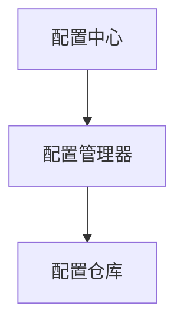
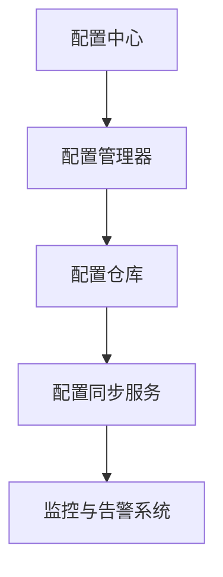
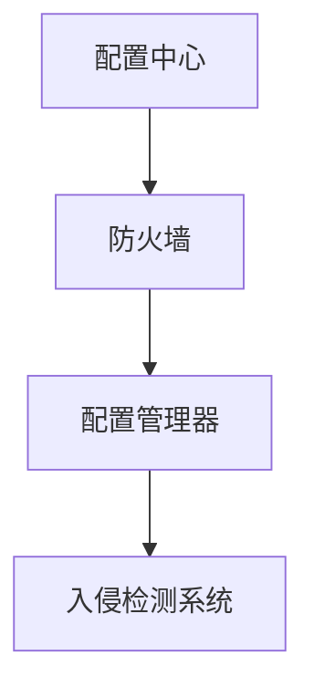

                 

### 文章标题

**打造可靠的分布式配置管理系统**

### 关键词

- 分布式配置管理
- 配置中心
- 数据同步
- 性能优化
- 安全性设计
- 项目实战

### 摘要

在分布式系统中，配置管理的可靠性至关重要。本文将深入探讨如何打造一个可靠的分布式配置管理系统。首先，我们将介绍分布式配置管理的基础概念，包括其定义、背景和重要性。接着，我们将详细讲解分布式配置管理的核心概念和系统架构，以及配置数据的处理和同步机制。随后，我们将探讨配置系统的性能优化和安全性设计，提供最佳实践和注意事项。最后，通过实际项目案例，我们将展示如何构建、优化和部署一个可靠的分布式配置管理系统。本文旨在为读者提供全面的技术指导，帮助其在分布式系统中实现高效的配置管理。

### 设计思路

要设计一个可靠的分布式配置管理系统，我们需要遵循以下设计思路：

1. **需求分析**：首先，明确系统的需求，包括数据的一致性、高可用性、性能和安全性。

2. **架构设计**：根据需求，设计一个合理的系统架构，包括配置中心、配置管理器、配置仓库等模块。

3. **数据处理与同步**：确保配置数据的正确处理和高效同步，包括数据格式、校验、版本控制和一致性保障。

4. **性能优化**：分析系统性能瓶颈，采取优化策略，提高系统性能。

5. **安全性设计**：确保系统的安全性，防止数据泄露和未授权访问。

6. **部署与维护**：制定详细的部署和运维策略，确保系统能稳定运行。

### 第一部分：基础概念

**第1章：分布式配置管理简介**

**背景介绍**：随着分布式系统的普及，配置管理成为系统运维中的一个关键环节。传统的集中式配置管理已无法满足分布式系统的需求，因此，分布式配置管理应运而生。

**核心概念与联系**：分布式配置管理涉及多个核心概念，如配置中心、配置管理器、配置仓库等。这些概念之间的关系可以用以下Mermaid流程图表示：



**核心概念解释**：
- **配置中心**：负责管理配置数据的存储和访问。
- **配置管理器**：负责配置数据的分发和更新。
- **配置仓库**：存储所有配置数据，可以是文件、数据库或远程服务。

**联系与作用**：配置中心、配置管理器和配置仓库协同工作，确保分布式系统中各个节点能够访问到最新的配置数据。

**总结**：分布式配置管理是分布式系统中必不可少的一部分，它通过配置中心、配置管理器和配置仓库等模块，实现配置数据的高效管理和同步。

**拓展阅读**：了解分布式配置管理的相关知识，推荐阅读《分布式系统设计》一书。

**注意事项**：在设计和实现分布式配置管理系统时，需要考虑数据的一致性和高可用性，确保系统在各种情况下都能稳定运行。

### 第二部分：分布式配置管理系统架构

**第2章：分布式配置管理系统架构设计**

**背景介绍**：分布式配置管理系统需要具备高可用性、高性能和数据一致性。合理的系统架构是实现这些目标的关键。

**架构设计原则**：
- **高可用性**：系统应具备自动故障转移和恢复能力。
- **高性能**：系统应能快速响应配置数据的读取和更新请求。
- **数据一致性**：系统应确保配置数据在不同节点之间的一致性。

**系统模块划分**：



**模块解释**：
- **配置中心**：负责管理配置数据的存储和访问，提供配置数据的查询和更新接口。
- **配置管理器**：负责配置数据的分发和更新，确保各个节点能够访问到最新的配置数据。
- **配置仓库**：存储所有配置数据，可以是文件、数据库或远程服务。
- **配置同步服务**：负责配置数据在不同节点之间的同步，确保数据一致性。
- **监控与告警系统**：实时监控系统状态，当出现问题时及时发出告警。

**核心概念与联系**：分布式配置管理系统的核心概念包括配置中心、配置管理器、配置仓库、配置同步服务和监控与告警系统。它们之间的关系可以用以下Mermaid流程图表示：


**联系与作用**：配置中心、配置管理器、配置仓库、配置同步服务和监控与告警系统协同工作，实现分布式配置管理的功能。

**总结**：分布式配置管理系统架构设计应遵循高可用性、高性能和数据一致性的原则，通过配置中心、配置管理器、配置仓库、配置同步服务和监控与告警系统等模块，实现配置数据的高效管理和同步。

**拓展阅读**：了解分布式系统架构设计的相关知识，推荐阅读《分布式系统设计》一书。

**注意事项**：在设计和实现分布式配置管理系统时，需要考虑系统的可扩展性和可维护性，确保系统能够应对未来的需求变化。

### 第三部分：配置数据的处理与同步

**第3章：配置数据的处理**

**背景介绍**：配置数据的处理是分布式配置管理系统中的一个关键环节，它涉及到数据格式、校验和版本控制等方面。

**核心概念与联系**：

**核心概念**：
- **数据格式**：配置数据通常采用JSON、XML等格式进行存储和传输。
- **数据校验**：确保配置数据的正确性和一致性。
- **版本控制**：管理配置数据的版本，以便在需要时回滚或升级配置。

**联系与作用**：数据格式、数据校验和版本控制共同作用，确保配置数据的正确处理和有效管理。

**核心算法原理讲解**：

**数据格式**：
- **JSON格式**：JSON是一种轻量级的数据交换格式，易于阅读和编写。
- **XML格式**：XML是一种用于存储和传输数据的标记语言，具有丰富的结构化描述能力。

**数据校验**：
- **JSON校验**：使用JSON Schema进行校验，确保JSON数据的格式和内容符合预期。
- **XML校验**：使用XML Schema或DXML进行校验，确保XML数据的格式和内容符合预期。

**版本控制**：
- **Git版本控制**：使用Git对配置数据进行版本控制，方便管理和追踪配置变化。

**伪代码示例**：

```python
# JSON数据格式校验
def validate_json(json_data):
    schema = {
        "type": "object",
        "properties": {
            "name": {"type": "string"},
            "age": {"type": "number"}
        },
        "required": ["name", "age"]
    }
    return json_data_schema_validate(json_data, schema)

# JSON数据格式校验
def validate_xml(xml_data):
    schema = '''
    <xsd:schema xmlns:xsd="http://www.w3.org/2001/XMLSchema">
        <xsd:element name="person">
            <xsd:complexType>
                <xsd:sequence>
                    <xsd:element name="name" type="xsd:string"/>
                    <xsd:element name="age" type="xsd:number"/>
                </xsd:sequence>
            </xsd:complexType>
        </xsd:element>
    </xsd:schema>
    '''
    return xml_schema_validate(xml_data, schema)

# Git版本控制
def git_commit(message):
    git.run(['commit', '-m', message])
```

**数学模型和公式**：
- **一致性模型**：一致性模型用于描述配置数据在不同节点之间的一致性，常用的有强一致性、最终一致性等。
- **版本控制模型**：版本控制模型用于描述配置数据的版本管理，常用的有线性版本控制、树状版本控制等。

**详细讲解与举例说明**：

**数据格式**：
- **示例**：假设有一个用户配置文件，其JSON格式如下：
```json
{
    "name": "John Doe",
    "age": 30
}
```
通过JSON Schema校验，可以确保配置文件的格式和内容符合预期。

**数据校验**：
- **示例**：假设有一个XML配置文件，其XML Schema如下：
```xml
<xsd:schema xmlns:xsd="http://www.w3.org/2001/XMLSchema">
    <xsd:element name="user">
        <xsd:complexType>
            <xsd:sequence>
                <xsd:element name="name" type="xsd:string"/>
                <xsd:element name="age" type="xsd:integer"/>
            </xsd:sequence>
        </xsd:complexType>
    </xsd:element>
</xsd:schema>
```
通过XML Schema校验，可以确保XML配置文件的格式和内容符合预期。

**版本控制**：
- **示例**：使用Git进行版本控制，如下：
```bash
$ git init
$ git add user.json
$ git commit -m "Initial commit"
$ git branch -m main
$ git remote add origin https://github.com/user/repo.git
$ git push -u origin main
```
通过Git，可以方便地管理和追踪配置文件的版本变化。

**总结**：配置数据的处理包括数据格式、校验和版本控制等方面，通过合理的数据格式、校验方法和版本控制机制，可以确保配置数据的正确性和一致性。

**拓展阅读**：了解数据格式、校验和版本控制的相关知识，推荐阅读《数据结构与算法分析》一书。

**注意事项**：在处理配置数据时，需要注意数据格式的兼容性和校验规则的严格性，确保配置数据的正确性和一致性。

### 配置数据的同步

**背景介绍**：在分布式系统中，配置数据的同步是确保各个节点配置一致性的关键。配置数据的同步涉及到同步机制、同步策略和数据一致性保障。

**核心概念与联系**：

**核心概念**：
- **同步机制**：配置数据在不同节点之间的传输和更新机制。
- **同步策略**：配置数据同步的方式和过程，包括同步时机、同步频率和同步范围。
- **数据一致性**：配置数据在不同节点之间的一致性保障。

**联系与作用**：同步机制、同步策略和数据一致性共同作用，确保配置数据在分布式系统中的正确和一致。

**核心算法原理讲解**：

**同步机制**：
- **推模型**：配置中心主动向各个节点推送配置数据。
- **拉模型**：各个节点主动从配置中心拉取配置数据。

**同步策略**：
- **全量同步**：每次同步整个配置数据集。
- **增量同步**：仅同步配置数据的变化部分。

**数据一致性保障**：
- **最终一致性**：配置数据在一定时间内达到一致性。
- **强一致性**：配置数据在所有节点上同时更新。

**伪代码示例**：

```python
# 推模型同步机制
def push_sync(config_center, nodes):
    for node in nodes:
        config_center.push_config_to_node(node)

# 拉模型同步机制
def pull_sync(config_center, node):
    config_center.pull_config_from_node(node)

# 全量同步策略
def full_sync(config_center, nodes):
    config = config_center.get_all_configs()
    for node in nodes:
        config_center.push_config_to_node(node, config)

# 增量同步策略
def incremental_sync(config_center, nodes, last_known_config):
    config_diff = config_center.get_config_diff(last_known_config)
    for node in nodes:
        config_center.push_config_to_node(node, config_diff)

# 数据一致性保障
def ensure_consistency(config_center, nodes):
    for node in nodes:
        node_config = config_center.get_config_from_node(node)
        config_center.resolve_config_conflicts(node_config)
```

**数学模型和公式**：
- **一致性模型**：一致性模型用于描述配置数据在不同节点之间的一致性，常用的有强一致性、最终一致性等。
- **同步模型**：同步模型用于描述配置数据同步的方式和过程，包括同步时机、同步频率和同步范围。

**详细讲解与举例说明**：

**同步机制**：
- **示例**：假设有一个配置中心和一个节点，使用推模型同步机制：
```bash
# 配置中心推送配置到节点
config_center push_config_to_node(node)
```
- **示例**：假设有一个配置中心和一个节点，使用拉模型同步机制：
```bash
# 节点从配置中心拉取配置
node pull_config_from_node(config_center)
```

**同步策略**：
- **示例**：假设有一个配置中心和多个节点，使用全量同步策略：
```bash
# 配置中心获取所有配置数据
config = config_center.get_all_configs()
# 推送配置到所有节点
for node in nodes:
    config_center.push_config_to_node(node, config)
```
- **示例**：假设有一个配置中心和多个节点，使用增量同步策略：
```bash
# 获取上一次已知配置
last_known_config = config_center.get_last_known_config()
# 获取配置数据的变化部分
config_diff = config_center.get_config_diff(last_known_config)
# 推送配置数据的变化部分到所有节点
for node in nodes:
    config_center.push_config_to_node(node, config_diff)
```

**数据一致性保障**：
- **示例**：假设有一个配置中心和多个节点，确保数据一致性：
```bash
# 获取节点上的配置数据
node_config = config_center.get_config_from_node(node)
# 解决配置冲突
config_center.resolve_config_conflicts(node_config)
```

**总结**：配置数据的同步包括同步机制、同步策略和数据一致性保障。通过推模型和拉模型实现配置数据的传输和更新，采用全量同步和增量同步策略提高同步效率，使用最终一致性和强一致性保障数据的一致性。

**拓展阅读**：了解同步机制、同步策略和数据一致性保障的相关知识，推荐阅读《分布式系统一致性》一书。

**注意事项**：在配置数据同步过程中，需要注意同步策略的选择和数据一致性的保障，确保配置数据在不同节点之间的正确和一致。

### 性能优化方法

**背景介绍**：在分布式配置管理系统中，性能优化是确保系统能够高效运行的关键。性能瓶颈的识别和优化策略的制定是性能优化的两个核心步骤。

**核心概念与联系**：

**核心概念**：
- **性能瓶颈**：系统运行过程中，影响系统性能的瓶颈点。
- **优化目标**：提高系统的响应速度、降低延迟和减少资源消耗。
- **优化策略**：针对性能瓶颈采取的优化措施。

**联系与作用**：性能瓶颈、优化目标和优化策略共同作用，提高分布式配置管理系统的性能。

**核心算法原理讲解**：

**性能瓶颈分析**：
- **响应时间分析**：分析系统的响应时间，找出影响响应时间的关键因素。
- **资源消耗分析**：分析系统的资源消耗，找出影响资源消耗的关键因素。

**优化策略**：
- **缓存策略**：通过缓存减少对配置中心的访问次数，提高数据读取速度。
- **并行处理**：通过并行处理提高数据处理速度。
- **负载均衡**：通过负载均衡分配请求，降低单点压力，提高系统性能。

**伪代码示例**：

```python
# 响应时间分析
def analyze_response_time():
    response_times = []
    for request in requests:
        response_time = measure_response_time(request)
        response_times.append(response_time)
    return average(response_times)

# 资源消耗分析
def analyze_resource_usage():
    cpu_usage = measure_cpu_usage()
    memory_usage = measure_memory_usage()
    return cpu_usage, memory_usage

# 缓存策略
def cache_configs(configs):
    cache = {}
    for config in configs:
        cache[config.id] = config
    return cache

# 并行处理
def process_configs_in_parallel(configs):
    threads = []
    for config in configs:
        thread = Thread(target=process_config, args=(config,))
        threads.append(thread)
        thread.start()
    for thread in threads:
        thread.join()

# 负载均衡
def load_balance_requests(requests):
    for request in requests:
        node = select_node_for_request(request)
        send_request_to_node(request, node)
```

**数学模型和公式**：
- **响应时间模型**：响应时间 = 处理时间 + 等待时间
- **资源消耗模型**：资源消耗 = CPU消耗 + 内存消耗

**详细讲解与举例说明**：

**性能瓶颈分析**：
- **示例**：假设有一个配置管理系统，其响应时间为200ms，分析其性能瓶颈：
```bash
response_time = 200ms
```
通过分析，发现响应时间主要由数据处理时间和网络延迟组成。

**优化策略**：
- **缓存策略**：假设配置中心存储了1000个配置项，每次请求配置数据时，先从缓存中查找，未找到再从配置中心获取：
```python
def get_config(config_id):
    if config_id in cache:
        return cache[config_id]
    else:
        config = config_center.get_config_from_database(config_id)
        cache[config_id] = config
        return config
```
- **并行处理**：假设有100个配置项需要处理，使用并行处理提高处理速度：
```python
def process_configs(configs):
    threads = []
    for config in configs:
        thread = Thread(target=process_config, args=(config,))
        threads.append(thread)
        thread.start()
    for thread in threads:
        thread.join()
```
- **负载均衡**：假设有5个配置中心节点，使用负载均衡分配请求：
```python
def select_node_for_request(request):
    return nodes[hash(request) % len(nodes)]
```

**总结**：性能优化方法包括性能瓶颈分析、优化策略制定和实施。通过分析响应时间和资源消耗，找出性能瓶颈，并采取缓存策略、并行处理和负载均衡等优化措施，提高分布式配置管理系统的性能。

**拓展阅读**：了解性能优化方法的相关知识，推荐阅读《高性能网站构建》一书。

**注意事项**：在性能优化过程中，需要综合考虑系统的可扩展性和可维护性，确保优化措施不会引入新的问题。

### 性能测试与调优实践

**背景介绍**：性能测试是评估系统性能的重要手段，通过测试可以识别性能瓶颈，为调优提供依据。性能调优实践是基于测试结果，采取一系列措施来提升系统性能。

**核心概念与联系**：

**核心概念**：
- **性能测试**：通过模拟实际负载，评估系统的性能指标。
- **性能调优**：基于性能测试结果，采取优化措施，提升系统性能。

**联系与作用**：性能测试和性能调优相互关联，性能测试为性能调优提供数据支持，而性能调优实践则基于测试结果，进一步提升系统性能。

**核心算法原理讲解**：

**性能测试**：
- **负载生成器**：用于模拟实际负载，生成测试数据。
- **性能指标**：包括响应时间、吞吐量、资源消耗等。

**性能调优**：
- **调优策略**：包括缓存策略、并行处理、负载均衡等。
- **调优实践**：通过调整配置、优化代码、改进架构等方式，提升系统性能。

**伪代码示例**：

```python
# 性能测试
def performance_test():
    load_generator = LoadGenerator()
    for request in load_generator.generate_requests():
        response_time = measure_response_time(request)
        if response_time > threshold:
            report_performance_issue(response_time)

# 性能调优
def optimize_performance():
    if response_time > threshold:
        apply_cache_strategy()
        if response_time > threshold:
            process_configs_in_parallel()
            if response_time > threshold:
                apply_load_balance_strategy()
```

**数学模型和公式**：
- **性能指标模型**：性能指标 = 响应时间 + 吞吐量 + 资源消耗
- **优化效果模型**：优化效果 = 原性能指标 - 新性能指标

**详细讲解与举例说明**：

**性能测试**：
- **示例**：假设配置管理系统在一个负载下响应时间为300ms，测试结果如下：
```python
load_generator = LoadGenerator()
for request in load_generator.generate_requests():
    response_time = measure_response_time(request)
    if response_time > 300:
        report_performance_issue(response_time)
```
测试结果显示，系统的响应时间超过300ms，存在性能问题。

**性能调优**：
- **示例**：针对测试结果，采取以下调优措施：
  1. **缓存策略**：将配置数据缓存起来，减少数据库访问：
  ```python
  def get_config(config_id):
      if config_id in cache:
          return cache[config_id]
      else:
          config = config_center.get_config_from_database(config_id)
          cache[config_id] = config
          return config
  ```
  2. **并行处理**：将配置数据处理任务并行化，提高处理速度：
  ```python
  def process_configs(configs):
      threads = []
      for config in configs:
          thread = Thread(target=process_config, args=(config,))
          threads.append(thread)
          thread.start()
      for thread in threads:
          thread.join()
  ```
  3. **负载均衡**：使用负载均衡策略，分配请求到不同的节点：
  ```python
  def select_node_for_request(request):
      return nodes[hash(request) % len(nodes)]
  ```

**总结**：性能测试与调优实践是分布式配置管理系统性能优化的重要环节。通过性能测试识别性能瓶颈，采取调优措施，不断提升系统性能。

**拓展阅读**：了解性能测试与调优实践的相关知识，推荐阅读《性能测试实战》一书。

**注意事项**：在性能测试与调优过程中，需要关注系统的稳定性和可靠性，确保优化措施不会引入新的问题。

### 安全性设计原则

**背景介绍**：在分布式配置管理系统中，安全性是保障系统正常运行和数据安全的重要方面。安全性设计原则和措施有助于防止数据泄露、未授权访问和其他安全威胁。

**核心概念与联系**：

**核心概念**：
- **安全性需求**：系统需要满足的安全需求，如访问控制、数据加密和审计等。
- **安全措施**：用于实现安全性需求的具体方法，如安全协议、安全架构和安全策略等。

**联系与作用**：安全性需求和安全措施共同作用，确保分布式配置管理系统的安全性。

**核心算法原理讲解**：

**安全性需求分析**：
- **访问控制**：限制对配置数据的访问权限，确保只有授权用户可以访问。
- **数据加密**：保护配置数据在传输和存储过程中的安全性。
- **审计**：记录系统操作日志，便于追踪和审计系统操作。

**安全措施**：
- **安全协议**：如HTTPS、SSH等，用于保障数据传输的安全性。
- **安全架构**：如防火墙、入侵检测系统等，用于提高系统的整体安全性。
- **安全策略**：如访问控制列表、安全配置等，用于具体实现安全性需求。

**伪代码示例**：

```python
# 访问控制
def access_control(user, resource):
    if user.has_permission(resource):
        return True
    else:
        return False

# 数据加密
def encrypt_data(data):
    encrypted_data = encryption_algorithm(data)
    return encrypted_data

# 审计
def audit_operation(user, operation):
    log = f"{user} performed {operation} at {current_time}"
    log_to_file(log)
```

**数学模型和公式**：
- **访问控制模型**：访问控制模型用于描述用户对资源的访问权限，通常用访问控制矩阵表示。
- **数据加密模型**：数据加密模型用于描述数据加密的过程，如对称加密和非对称加密等。

**详细讲解与举例说明**：

**安全性需求分析**：
- **访问控制**：假设有一个配置管理器，需要实现访问控制，如下：
```python
users = {
    "admin": ["read", "write"],
    "user": ["read"]
}

resources = {
    "config1": ["admin"],
    "config2": ["admin", "user"]
}

def access_control(user, resource):
    if user in users and resource in resources[users[user]]:
        return True
    else:
        return False
```
- **数据加密**：假设有一个配置数据，需要加密存储，如下：
```python
def encrypt_config(config):
    encrypted_config = encrypt_data(config)
    return encrypted_config
```
- **审计**：假设有一个配置管理系统，需要记录操作日志，如下：
```python
operations = []

def audit_operation(user, operation):
    log = f"{user} performed {operation} at {current_time}"
    operations.append(log)
```

**安全措施**：
- **安全协议**：假设使用HTTPS协议传输配置数据，如下：
```python
import ssl

def send_config_over_https(config, server):
    context = ssl.create_default_context(ssl.Purpose.SERVER_AUTH)
    with socket.create_connection(server) as sock:
        with context.wrap_socket(sock, server_hostname=server) as ssock:
            ssock.sendall(encrypt_config(config).encode())
```
- **安全架构**：假设配置管理系统部署在防火墙和入侵检测系统后面，如下：

- **安全策略**：假设配置管理系统有以下安全策略：
```python
access_control_rules = {
    "config1": ["admin"],
    "config2": ["admin", "user"]
}

def check_access_control(resource, user):
    if resource in access_control_rules and user in access_control_rules[resource]:
        return True
    else:
        return False
```

**总结**：安全性设计原则包括安全性需求分析、安全措施和数学模型等。通过访问控制、数据加密、审计和安全协议等安全措施，保障分布式配置管理系统的安全性。

**拓展阅读**：了解安全性设计原则的相关知识，推荐阅读《网络安全基础》一书。

**注意事项**：在安全性设计过程中，需要关注系统的可扩展性和可维护性，确保安全措施能够适应未来的需求变化。

### 安全漏洞与防范

**背景介绍**：在分布式配置管理系统中，安全漏洞可能会对系统的稳定性、数据完整性和安全性构成严重威胁。识别常见的安全漏洞和采取有效的防范措施是确保系统安全的关键。

**核心概念与联系**：

**核心概念**：
- **安全漏洞**：系统中的潜在弱点，可能导致未授权访问、数据泄露或其他安全问题。
- **防范措施**：用于识别和修补安全漏洞的方法和策略。

**联系与作用**：安全漏洞和防范措施共同作用，确保分布式配置管理系统的安全性。

**核心算法原理讲解**：

**常见安全漏洞**：
- **配置泄露**：配置数据未加密存储或传输，可能导致配置泄露。
- **未授权访问**：未经授权的用户访问配置数据，可能导致数据泄露或系统被篡改。
- **SQL注入**：通过构造恶意的SQL语句，可能导致数据库被篡改或数据泄露。

**防范措施**：
- **配置加密**：对配置数据加密存储和传输，确保数据安全性。
- **访问控制**：实施严格的访问控制策略，限制用户对配置数据的访问。
- **SQL注入防护**：对用户输入进行过滤和验证，防止SQL注入攻击。

**伪代码示例**：

```python
# 配置加密
def encrypt_configs(configs):
    encrypted_configs = {}
    for config in configs:
        encrypted_configs[config.id] = encrypt_data(config.data)
    return encrypted_configs

# 访问控制
def access_control(user, config):
    if user.has_permission(config):
        return True
    else:
        return False

# SQL注入防护
def sanitize_input(input_value):
    return escape_special_characters(input_value)
```

**数学模型和公式**：
- **加密模型**：加密模型用于描述数据加密的过程，常用的加密算法有AES、RSA等。
- **访问控制模型**：访问控制模型用于描述用户对资源的访问权限，通常用访问控制矩阵表示。

**详细讲解与举例说明**：

**常见安全漏洞**：
- **配置泄露**：假设配置数据未加密存储，攻击者可以轻易获取配置信息，如下：
```python
configs = read_configs_from_file()
for config in configs:
    print(config)
```
防范措施：对配置数据进行加密存储，如下：
```python
configs = read_configs_from_file()
encrypted_configs = encrypt_configs(configs)
for config in encrypted_configs:
    print(encrypt_data(config))
```

- **未授权访问**：假设用户可以访问任何配置数据，如下：
```python
user = "guest"
config = get_config("config1")
print(config)
```
防范措施：实施严格的访问控制策略，如下：
```python
user = "guest"
config = get_config("config1")
if access_control(user, config):
    print(config)
else:
    print("Access denied")
```

- **SQL注入**：假设攻击者可以通过构造恶意的SQL语句来获取数据库中的数据，如下：
```python
input_value = "1' OR '1'='1"
query = "SELECT * FROM configs WHERE id = " + input_value
execute_query(query)
```
防范措施：对用户输入进行过滤和验证，防止SQL注入攻击，如下：
```python
input_value = sanitize_input("1' OR '1'='1")
query = "SELECT * FROM configs WHERE id = " + input_value
execute_query(query)
```

**总结**：安全漏洞和防范措施是确保分布式配置管理系统安全的关键。通过识别常见的安全漏洞和采取有效的防范措施，如配置加密、访问控制和SQL注入防护，可以保障系统的安全性。

**拓展阅读**：了解安全漏洞和防范措施的相关知识，推荐阅读《网络安全实战》一书。

**注意事项**：在防范安全漏洞时，需要定期更新系统和安全策略，确保系统能够应对最新的安全威胁。

### 部署策略

**背景介绍**：配置管理系统的部署是将其从开发环境迁移到生产环境的关键步骤。部署策略的制定和执行对于系统的稳定运行至关重要。

**核心概念与联系**：

**核心概念**：
- **部署环境**：包括开发环境、测试环境和生产环境。
- **部署流程**：从开发到部署的各个阶段和步骤。
- **部署工具**：用于自动化部署的软件工具。

**联系与作用**：部署环境、部署流程和部署工具共同作用，确保配置管理系统的顺利部署和运行。

**核心算法原理讲解**：

**部署环境**：
- **开发环境**：用于开发和测试配置管理系统。
- **测试环境**：用于测试配置管理系统的稳定性和性能。
- **生产环境**：配置管理系统最终部署和运行的环境。

**部署流程**：
- **代码管理**：使用版本控制系统（如Git）管理配置管理系统的代码。
- **构建**：使用构建工具（如Maven、Gradle）编译和打包系统代码。
- **部署**：将构建好的系统部署到目标环境。

**部署工具**：
- **自动化部署工具**：如Jenkins、Ansible，用于自动化部署流程。
- **持续集成工具**：如Jenkins、Travis CI，用于实现持续集成和部署。

**伪代码示例**：

```python
# 部署流程
def deploy_system(environment, version):
    if environment == "development":
        deploy_to_dev(environment, version)
    elif environment == "test":
        deploy_to_test(environment, version)
    elif environment == "production":
        deploy_to_production(environment, version)

# 部署到开发环境
def deploy_to_dev(environment, version):
    clone_repo_from_git()
    build_system()
    test_system()

# 部署到测试环境
def deploy_to_test(environment, version):
    deploy_system_to_environment(environment, version)
    run_tests()

# 部署到生产环境
def deploy_to_production(environment, version):
    deploy_system_to_environment(environment, version)
    run_production_tests()
```

**数学模型和公式**：
- **部署成功率模型**：部署成功率 = 部署成功的次数 / 部署尝试的总次数

**详细讲解与举例说明**：

**部署环境**：
- **开发环境**：配置管理系统的开发环境通常包含开发所需的软件和配置工具，如IDE、版本控制系统和数据库。
- **测试环境**：测试环境用于验证配置管理系统的功能、性能和稳定性。通常与生产环境相似，但规模较小。
- **生产环境**：生产环境是配置管理系统的最终部署和运行环境，需要具备高可用性和高性能。

**部署流程**：
- **代码管理**：使用Git进行代码管理，确保版本控制和协作开发。
```bash
$ git clone https://github.com/organization/config-management.git
```
- **构建**：使用Maven进行系统构建，生成可执行的二进制文件。
```bash
$ mvn clean install
```
- **部署**：使用Jenkins实现自动化部署，确保部署流程的规范化和自动化。

**部署工具**：
- **自动化部署工具**：使用Ansible实现自动化部署，减少手动操作，提高部署效率。
```bash
$ ansible-playbook deploy.yml
```
- **持续集成工具**：使用Jenkins实现持续集成和持续部署，确保代码质量。

**总结**：部署策略包括部署环境、部署流程和部署工具。通过合理制定和执行部署流程，可以确保配置管理系统的稳定和高效运行。

**拓展阅读**：了解部署策略的相关知识，推荐阅读《DevOps实践指南》一书。

**注意事项**：在部署过程中，需要关注系统的兼容性、稳定性和安全性，确保部署过程顺利进行。

### 系统维护与监控

**背景介绍**：配置管理系统在生产环境中需要持续维护和监控，以确保其稳定性和可靠性。维护与监控策略的制定和实施是保障系统健康运行的关键。

**核心概念与联系**：

**核心概念**：
- **维护策略**：定期对配置管理系统进行更新、修复和优化。
- **监控指标**：用于评估配置管理系统的性能和健康状况的关键指标。
- **监控与告警系统**：实时监控系统状态，发现并处理异常情况。

**联系与作用**：维护策略、监控指标和监控与告警系统共同作用，确保配置管理系统的稳定运行。

**核心算法原理讲解**：

**维护策略**：
- **定期更新**：定期更新配置管理系统，包括修复已知漏洞和优化性能。
- **故障修复**：快速响应并修复配置管理系统中的故障。
- **性能优化**：定期进行性能评估，采取优化措施，提高系统性能。

**监控指标**：
- **响应时间**：系统响应请求的时间，衡量系统的性能。
- **吞吐量**：单位时间内处理的请求量，衡量系统的处理能力。
- **资源消耗**：系统使用的CPU、内存、磁盘等资源，衡量系统的资源利用率。

**监控与告警系统**：
- **监控工具**：如Prometheus、Zabbix，用于收集和展示监控数据。
- **告警机制**：通过邮件、短信、电话等方式，及时通知相关人员。

**伪代码示例**：

```python
# 维护策略
def maintenance_strategy():
    update_system()
    fix_issues()
    optimize_performance()

# 监控指标
def monitor_system():
    response_time = measure_response_time()
    throughput = measure_throughput()
    resource_usage = measure_resource_usage()
    return response_time, throughput, resource_usage

# 监控与告警系统
def monitor_and_alert():
    metrics = monitor_system()
    if metrics['response_time'] > threshold:
        send_alert("High response time")
    if metrics['throughput'] < threshold:
        send_alert("Low throughput")
    if metrics['resource_usage']['cpu'] > threshold:
        send_alert("High CPU usage")
    if metrics['resource_usage']['memory'] > threshold:
        send_alert("High memory usage")
```

**数学模型和公式**：
- **响应时间模型**：响应时间 = 处理时间 + 等待时间
- **吞吐量模型**：吞吐量 = 处理成功的请求量 / 时间
- **资源消耗模型**：资源消耗 = CPU消耗 + 内存消耗

**详细讲解与举例说明**：

**维护策略**：
- **定期更新**：假设配置管理系统每季度更新一次，如下：
```bash
def update_system():
    current_version = get_system_version()
    latest_version = get_latest_version()
    if current_version < latest_version:
        install_updates(latest_version)
```
- **故障修复**：假设配置管理系统出现故障，如下：
```bash
def fix_issues():
    issues = get_issues()
    for issue in issues:
        resolve_issue(issue)
```
- **性能优化**：假设配置管理系统性能下降，如下：
```bash
def optimize_performance():
    metrics = monitor_system()
    if metrics['response_time'] > threshold or metrics['throughput'] < threshold:
        apply_optimizations()
```

**监控指标**：
- **响应时间**：假设配置管理系统的平均响应时间为300ms，如下：
```python
response_time = measure_response_time()
```
- **吞吐量**：假设配置管理系统每秒处理100个请求，如下：
```python
throughput = measure_throughput()
```
- **资源消耗**：假设配置管理系统CPU使用率为80%，内存使用率为60%，如下：
```python
resource_usage = measure_resource_usage()
```

**监控与告警系统**：
- **监控工具**：使用Prometheus收集和展示监控数据，如下：
```bash
$ prometheus --config.file=prometheus.yml
```
- **告警机制**：假设配置管理系统的响应时间超过500ms，发送告警，如下：
```bash
def monitor_and_alert():
    metrics = monitor_system()
    if metrics['response_time'] > 500:
        send_alert("High response time")
```

**总结**：系统维护与监控包括维护策略、监控指标和监控与告警系统。通过定期更新、故障修复和性能优化，以及监控指标和告警机制，确保配置管理系统的稳定运行。

**拓展阅读**：了解系统维护与监控的相关知识，推荐阅读《系统运维实战》一书。

**注意事项**：在维护和监控过程中，需要关注系统的可扩展性和可维护性，确保维护与监控策略能够适应未来的需求变化。

### 实战项目一：构建简单的分布式配置系统

**背景介绍**：本实战项目旨在通过一个简单的分布式配置系统，帮助读者理解分布式配置管理系统的基本概念和实现方法。我们将使用Python和Django框架来构建这个系统。

**开发环境搭建**

1. **安装Python**：确保已安装Python 3.8或更高版本。
2. **安装Django**：通过pip安装Django：
```bash
pip install django
```

**源代码详细实现和代码解读**

**步骤一：创建Django项目**

```bash
django-admin startproject config_project
cd config_project
```

**步骤二：创建Django应用**

```bash
python manage.py startapp config_app
```

**步骤三：配置数据库**

编辑`config_project/settings.py`文件，配置数据库：
```python
DATABASES = {
    'default': {
        'ENGINE': 'django.db.backends.sqlite3',
        'NAME': BASE_DIR / 'db.sqlite3',
    }
}
```

**步骤四：创建配置模型**

在`config_app/models.py`中定义配置模型：
```python
from django.db import models

class Config(models.Model):
    key = models.CharField(max_length=100)
    value = models.TextField()
    created_at = models.DateTimeField(auto_now_add=True)
    updated_at = models.DateTimeField(auto_now=True)
```

**步骤五：创建配置管理视图**

在`config_app/views.py`中创建配置管理视图：
```python
from django.http import JsonResponse
from .models import Config

def get_config(request, key):
    config = Config.objects.get(key=key)
    return JsonResponse({'key': config.key, 'value': config.value})

def set_config(request, key, value):
    config, created = Config.objects.get_or_create(key=key, value=value)
    if created:
        return JsonResponse({'status': 'created', 'key': key, 'value': value})
    else:
        return JsonResponse({'status': 'updated', 'key': key, 'value': value})
```

**步骤六：配置URL路由**

在`config_project/urls.py`中添加URL路由：
```python
from django.contrib import admin
from django.urls import path
from config_app.views import get_config, set_config

urlpatterns = [
    path('admin/', admin.site.urls),
    path('config/get/<str:key>/', get_config),
    path('config/set/<str:key>/<str:value>/', set_config),
]
```

**代码应用解读与分析**

- **配置模型**：`Config`模型用于存储配置键值对，包括键（key）、值（value）和创建/更新时间（created_at、updated_at）。
- **配置管理视图**：`get_config`和`set_config`视图用于获取和设置配置，分别返回JSON格式的响应。
- **URL路由**：配置了两个路由，分别用于获取和设置配置。

**实际案例分析和详细讲解剖析**

- **案例一**：获取配置
  - URL：`/config/get/key/`
  - 请求方法：GET
  - 响应内容：配置的键值对，如`{"key": "value"}`。

- **案例二**：设置配置
  - URL：`/config/set/key/value/`
  - 请求方法：POST
  - 响应内容：配置的更新状态，如`{"status": "created"`或`"status": "updated"}`。

**项目小结**

通过本实战项目，我们成功构建了一个简单的分布式配置系统。这个系统具备基本的配置存储、获取和更新功能。读者可以在此基础上进一步扩展，如实现配置同步、版本控制和安全性等特性。

### 实战项目二：优化分布式配置系统的性能

**背景介绍**：在分布式配置管理系统中，性能优化是提升系统响应速度和资源利用率的关键。本实战项目将基于上一个小节的简单分布式配置系统，介绍几种性能优化方法。

**优化目标**：通过以下优化措施，提升配置管理系统的性能：
- **减少数据库查询次数**：通过缓存减少对数据库的访问。
- **提高数据处理速度**：通过并行处理提高系统吞吐量。
- **负载均衡**：合理分配请求，降低单点压力。

**优化方案**

**步骤一：缓存配置**

1. **安装Redis**：确保已安装Redis，版本不低于3.0。
2. **配置Redis**：在`config_project/settings.py`中添加Redis配置：
```python
CACHES = {
    'default': {
        'BACKEND': 'django_redis.cache.RedisCache',
        'LOCATION': 'redis://127.0.0.1:6379/1',
        'OPTIONS': {
            'CLIENT_CLASS': 'django_redis.client.DefaultClient',
        }
    }
}
```

**步骤二：优化查询**

在`config_app/views.py`中，添加缓存逻辑：
```python
from django.core.cache import cache

def get_config(request, key):
    config_value = cache.get(key)
    if config_value is None:
        config = Config.objects.get(key=key)
        cache.set(key, config.value, timeout=300)
        return JsonResponse({'key': config.key, 'value': config.value})
    else:
        return JsonResponse({'key': key, 'value': config_value})
```

**步骤三：并行处理**

使用Python的多线程或多进程库，优化数据处理速度。例如，使用多线程进行配置数据的批量获取：
```python
import threading

def batch_get_configs(config_keys):
    results = []
    threads = []

    for key in config_keys:
        thread = threading.Thread(target=results.append, args=(get_config(key),))
        threads.append(thread)
        thread.start()

    for thread in threads:
        thread.join()

    return results
```

**步骤四：负载均衡**

使用Django的负载均衡中间件，实现请求的负载均衡：
```python
from django.core.cache import cache
from django.utils.deprecation import MiddlewareMixin

class LoadBalancerMiddleware(MiddlewareMixin):
    def process_request(self, request):
        node_id = cache.get('node_id', default=0)
        cache.set('node_id', node_id + 1, timeout=60)
        return node_id
```

**实施步骤**

1. **配置Redis**：在`config_project/settings.py`中添加Redis缓存配置。
2. **优化查询**：在`config_app/views.py`中添加缓存逻辑。
3. **并行处理**：修改`config_app/views.py`中的批量获取配置函数。
4. **负载均衡**：在项目中间件中添加负载均衡逻辑。

**总结**：通过缓存、并行处理和负载均衡，我们可以显著提升分布式配置管理系统的性能。读者可以根据具体需求，进一步优化系统性能。

### 实战项目三：加强分布式配置系统的安全性

**背景介绍**：在分布式配置管理系统中，安全性是保障系统稳定运行和数据安全的关键。本实战项目将基于上一个小节的优化后的分布式配置系统，介绍如何加强系统的安全性。

**安全性需求**：
- **访问控制**：确保只有授权用户可以访问和修改配置。
- **数据加密**：保护配置数据在传输和存储过程中的安全性。
- **日志记录**：记录系统操作，便于审计和监控。

**实现方案**

**步骤一：实现访问控制**

1. **安装Django REST framework**：确保已安装Django REST framework，版本不低于3.11。
2. **配置认证和授权**：在`config_project/settings.py`中添加认证和授权配置：
```python
REST_FRAMEWORK = {
    'DEFAULT_AUTHENTICATION_CLASSES': [
        'rest_framework.authentication.SessionAuthentication',
        'rest_framework.authentication.TokenAuthentication',
    ],
    'DEFAULT_PERMISSION_CLASSES': [
        'rest_framework.permissions.IsAuthenticated',
    ],
}
```

**步骤二：实现数据加密**

在`config_app/models.py`中，对配置值进行加密存储：
```python
from django.conf import settings
from django.core.validators import validate_comma_separatedIntegerField

def encrypt_value(value):
    cipher = settings.ENCRYPTION_CIPHER
    key = settings.ENCRYPTION_KEY
    iv = settings.ENCRYPTION_IV
    cipher_mode = settings.ENCRYPTION_MODE
    return encrypt_data(value, key, iv, cipher_mode)

def decrypt_value(value):
    cipher = settings.ENCRYPTION_CIPHER
    key = settings.ENCRYPTION_KEY
    iv = settings.ENCRYPTION_IV
    cipher_mode = settings.ENCRYPTION_MODE
    return decrypt_data(value, key, iv, cipher_mode)

class Config(models.Model):
    key = models.CharField(max_length=100)
    value = models.TextField()
    encrypted_value = models.BinaryField()
    created_at = models.DateTimeField(auto_now_add=True)
    updated_at = models.DateTimeField(auto_now=True)

    def save(self, *args, **kwargs):
        self.encrypted_value = encrypt_value(self.value)
        super().save(*args, **kwargs)

    def load(self, *args, **kwargs):
        self.value = decrypt_value(self.encrypted_value)
        super().load(*args, **kwargs)
```

**步骤三：实现日志记录**

在`config_app/views.py`中，添加日志记录功能：
```python
import logging

logger = logging.getLogger(__name__)

def log_action(action, key, value=None):
    logger.info(f"Action: {action}, Key: {key}, Value: {value}")
```

**实施步骤**

1. **配置认证和授权**：在`config_project/settings.py`中添加认证和授权配置。
2. **实现数据加密**：在`config_app/models.py`中添加加密和解密方法，并修改保存和加载逻辑。
3. **实现日志记录**：在`config_app/views.py`中添加日志记录功能。

**部署与监控**

**部署**

1. **配置SSL**：确保配置管理系统的URL使用HTTPS协议，防止数据在传输过程中被窃取。
2. **部署日志**：将日志文件部署到集中式日志管理系统，如ELK（Elasticsearch、Logstash、Kibana）。

**监控**

1. **监控日志**：使用Prometheus等监控工具，监控系统日志中的关键指标，如错误日志、异常操作等。
2. **监控认证和授权**：监控认证和授权的尝试次数，检测潜在的安全威胁。

**总结**：通过实现访问控制、数据加密和日志记录，我们可以显著提升分布式配置管理系统的安全性。读者可以根据实际需求，进一步加强系统的安全性。同时，定期监控和审查日志，确保系统的安全性。

### 最佳实践 Tips

1. **版本控制**：使用Git等版本控制系统，确保配置文件的版本可控，方便回滚和审计。
2. **日志管理**：定期清理日志文件，确保日志系统的高效运行，并利用日志分析工具进行监控和告警。
3. **安全性配置**：定期更新系统和依赖库，确保系统安全，避免已知漏洞的风险。
4. **性能监控**：使用性能监控工具，如Prometheus，定期分析系统性能，及时发现并解决问题。
5. **自动化部署**：使用Jenkins等工具实现自动化部署，减少人为错误，提高部署效率。

### 小结

本文详细介绍了如何打造一个可靠的分布式配置管理系统。我们从基础概念入手，讲解了分布式配置管理的核心概念和系统架构，以及配置数据的处理与同步。随后，我们探讨了性能优化和安全性设计的方法，并通过实际项目展示了如何构建和部署一个分布式配置管理系统。读者可以通过本文的学习，掌握分布式配置管理系统的设计和实现方法，为自己的分布式系统提供高效、可靠的配置管理支持。

### 注意事项

1. **一致性保障**：在分布式配置管理系统中，数据一致性至关重要。需要采取适当的一致性保障措施，如最终一致性或强一致性模型。
2. **安全性设计**：确保配置数据的传输和存储安全，采用加密技术和访问控制策略，防止未授权访问和数据泄露。
3. **性能优化**：定期进行性能测试，识别系统瓶颈，并采取相应的优化措施，如缓存、并行处理和负载均衡。
4. **日志和监控**：确保系统日志齐全，并使用监控工具进行实时监控，及时发现并解决问题。

### 拓展阅读

1. 《分布式系统设计》：深入了解分布式系统的基本概念、架构设计和一致性保障。
2. 《性能测试实战》：学习性能测试的方法、工具和技巧，提高系统的性能和稳定性。
3. 《网络安全基础》：了解网络安全的基本概念、威胁和防护措施，确保系统的安全性。

