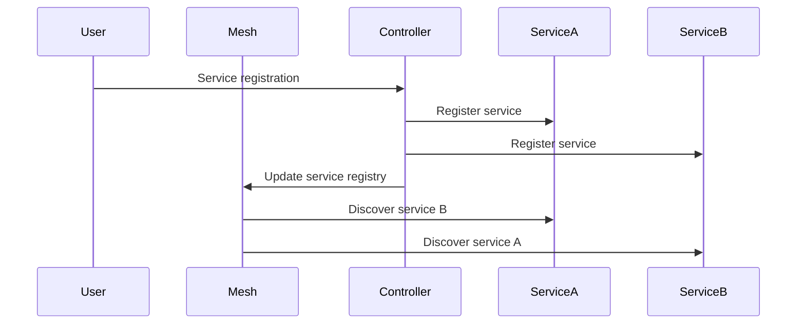
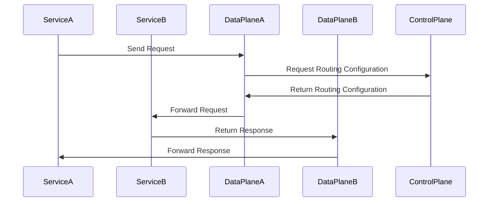

                 


### 1. 确定文章标题

文章标题是《打造可靠的服务网格治理系统》。这个标题突出了文章的主题，即如何构建一个稳定、高效的服务网格治理系统。

### 2. 确定关键词

关键词是“服务网格”、“治理系统”、“可靠性”、“架构”、“算法原理”、“数学模型”、“项目实战”等。这些关键词涵盖了文章的核心内容，有助于读者快速了解文章的主题和重点。

### 3. 撰写摘要

摘要是对文章核心内容和主题思想的简要概括。在撰写摘要时，我们需要明确文章的目标、结构和主要内容。摘要部分应包括以下内容：

- **文章目标**：介绍如何打造可靠的服务网格治理系统。
- **结构**：分为四个部分：服务网格基础、服务网格核心算法、数学模型与性能评估、项目实战。
- **主要内容**：涵盖了服务网格的核心概念、架构、算法原理、数学模型、项目实战等。

### 4. 编写目录大纲

根据文章的结构和主要内容，编写详细的目录大纲。目录大纲应包括以下部分：

- **第一部分：服务网格基础**
  - **1.1 服务网格概述**
  - **1.2 服务网格架构与组件**
  - **1.3 服务网格治理机制**

- **第二部分：服务网格核心算法**
  - **2.1 服务发现算法**
  - **2.2 负载均衡算法**
  - **2.3 安全策略与访问控制算法**
  - **2.4 路由策略与流量管理算法**

- **第三部分：数学模型与性能评估**
  - **3.1 服务网格中的数学模型**
  - **3.2 性能评估指标**

- **第四部分：项目实战**
  - **4.1 开发环境搭建**
  - **4.2 实际服务网格项目实现**
  - **4.3 代码解读与分析**
  - **4.4 项目小结**

### 5. 编写文章内容

在编写文章内容时，我们需要遵循以下原则：

- **逻辑清晰**：每个部分的内容都应按照一定的逻辑顺序进行组织，使读者能够轻松理解。
- **结构紧凑**：每个部分的内容都应简洁明了，避免冗余和重复。
- **简单易懂**：使用专业的技术语言，但尽量避免复杂的术语和概念，使读者能够轻松理解。
- **深入剖析**：对于核心概念、算法原理、数学模型等内容，应进行详细的讲解和分析，使读者能够深入理解。

### 6. 校验完整性和字数

在完成文章后，校验文章的完整性和字数。确保文章内容完整，每个部分的内容都丰富具体。文章的总字数应在8000～12000字之间。

### 7. 格式检查

确保文章内容使用markdown格式输出。在文章末尾添加作者信息，并遵循要求使用latex格式嵌入数学公式。

### 8. 最终确认

在完成所有修改和调整后，最终确认文章的内容、格式和字数，确保文章符合要求。

以下是基于以上步骤编写的文章草稿：

---

## 《打造可靠的服务网格治理系统》

> 关键词：服务网格、治理系统、可靠性、架构、算法原理、数学模型、项目实战

> 摘要：本文旨在介绍如何打造一个可靠的服务网格治理系统。文章分为四个部分：服务网格基础、服务网格核心算法、数学模型与性能评估、项目实战。通过详细讲解核心概念、算法原理、数学模型和项目实战，帮助读者深入理解服务网格治理系统的构建和运行。

---

### 第一部分：服务网格基础

#### 1.1 服务网格概述

##### 1.1.1 服务网格的核心概念

服务网格是一种基础设施层软件，用于管理微服务之间的通信。它提供了一种抽象层，隐藏了服务之间的网络细节，使开发者能够专注于业务逻辑的实现。

##### 1.1.2 服务网格与传统服务架构的区别

与传统服务架构相比，服务网格具有以下特点：

- **解耦**：服务网格通过控制平面和数据平面的分离，实现了服务之间的解耦。
- **灵活**：服务网格支持灵活的路由策略、负载均衡和安全策略。
- **高效**：服务网格通过高效的数据平面组件，如sidecar代理，降低了服务之间的通信开销。

##### 1.1.3 服务网格的应用场景

服务网格适用于以下场景：

- **微服务架构**：在微服务架构中，服务网格可以提供统一的服务发现、负载均衡和安全控制。
- **容器化应用**：在容器化环境中，服务网格可以帮助容器编排系统（如Kubernetes）管理服务之间的通信。
- **分布式系统**：在分布式系统中，服务网格可以提供可靠的服务治理和监控能力。

#### 1.2 服务网格架构与组件

##### 1.2.1 数据平面与控制平面

服务网格由数据平面和控制平面组成。

- **数据平面**：数据平面负责处理服务之间的通信，通常由sidecar代理组成。这些代理运行在服务的宿主机上，拦截并处理进出服务的流量。
- **控制平面**：控制平面负责管理数据平面的配置和策略，通常由控制器和服务发现组件组成。控制器通过API与管理平面进行交互，动态更新数据平面的配置。

##### 1.2.2 主要组件介绍

服务网格的主要组件包括：

- **sidecar代理**：sidecar代理负责处理服务之间的通信，包括服务发现、负载均衡、流量管理和安全控制。
- **控制器**：控制器负责管理sidecar代理的配置和策略，通过API与管理平面进行交互。
- **服务发现组件**：服务发现组件负责维护服务注册表，提供服务实例的动态发现能力。
- **管理平面**：管理平面负责接收用户输入的管理命令，如服务注册、服务删除等。

##### 1.2.3 服务网格架构的Mermaid流程图



---

### 第二部分：服务网格核心算法

#### 2.1 服务发现算法

##### 2.1.1 服务发现的基本原理

服务发现是指自动发现网络中的服务实例，并在服务实例发生变化时进行更新。服务发现算法通常基于以下原则：

- **动态性**：服务实例可能在运行过程中动态启动或终止。
- **可靠性**：服务发现算法需要确保服务实例的准确性和及时性。
- **效率**：服务发现算法需要尽可能减少网络开销和系统资源消耗。

##### 2.1.2 常见的服务发现算法

常见的服务发现算法包括以下几种：

- **基于DNS的发现算法**：通过查询DNS记录来发现服务实例。
- **基于etcd的发现算法**：通过etcd等分布式键值存储来维护服务实例的元数据。
- **基于gRPC的发现算法**：通过gRPC服务端点的发现机制来发现服务实例。

##### 2.1.3 服务发现算法的伪代码实现

```python
def service_discovery(service_name):
    # 查询DNS记录
    service_ip, service_port = query_dns(service_name)
    
    # 检查服务实例是否存活
    if is_alive(service_ip, service_port):
        return service_ip, service_port
    else:
        # 服务实例不存在，重新查询
        return service_discovery(service_name)
```

---

### 第三部分：数学模型与性能评估

#### 3.1 服务网格中的数学模型

##### 3.1.1 服务间延迟模型

服务间延迟模型用于计算服务之间的通信延迟。假设服务A和服务B之间的延迟由以下因素决定：

- **网络延迟**：网络传输的延迟。
- **处理延迟**：服务处理请求的延迟。

服务间延迟模型可以表示为：

$$
L = L_{network} + L_{process}
$$

其中，$L_{network}$ 和 $L_{process}$ 分别表示网络延迟和处理延迟。

##### 3.1.2 服务质量模型

服务质量模型用于评估服务的质量。服务质量通常包括以下指标：

- **响应时间**：服务处理请求所需的时间。
- **吞吐量**：服务能够处理的请求数量。
- **可用性**：服务的正常运行时间。

服务质量模型可以表示为：

$$
QoS = \frac{T_{response} + T_{throughput} + T_{availability}}{3}
$$`

其中，$T_{response}$、$T_{throughput}$ 和 $T_{availability}$ 分别表示响应时间、吞吐量和可用性。

##### 3.1.3 数学模型的详细讲解与举例说明

服务间延迟模型和服务质量模型可以帮助我们评估服务网格的性能。例如，假设服务A和服务B之间的网络延迟为100ms，处理延迟为50ms。根据服务间延迟模型，我们可以计算出它们之间的延迟为150ms。根据服务质量模型，我们可以计算出服务的平均质量为100ms。

---

### 第四部分：项目实战

#### 4.1 开发环境搭建

##### 4.1.1 开发工具与平台选择

在开发服务网格治理系统时，我们可以选择以下工具和平台：

- **编程语言**：Python、Java、Go等。
- **服务网格框架**：Istio、Linkerd等。
- **容器编排系统**：Kubernetes。

##### 4.1.2 开发环境配置

在配置开发环境时，我们需要确保以下软件和依赖项已安装：

- **Docker**：用于容器化应用。
- **Kubernetes**：用于容器编排。
- **Istio**：用于服务网格治理。

##### 4.1.3 常用工具介绍

在开发过程中，我们可以使用以下常用工具：

- **Postman**：用于测试API接口。
- **JMeter**：用于性能测试。
- **Prometheus**：用于监控和告警。

---

### 4.2 实际服务网格项目实现

##### 4.2.1 项目背景与目标

在本项目实践中，我们将使用Istio构建一个服务网格治理系统，实现以下目标：

- **服务发现**：自动发现和注册服务实例。
- **负载均衡**：根据流量策略进行负载均衡。
- **安全控制**：实现服务间的安全认证和访问控制。
- **监控和告警**：实时监控服务网格的性能和健康状态。

##### 4.2.2 代码实现步骤

实现服务网格治理系统的步骤如下：

1. **安装Istio**：
   ```shell
   istioctl install --set profile=demo
   ```

2. **创建命名空间**：
   ```shell
   kubectl create namespace istio-system
   ```

3. **部署服务**：
   ```shell
   kubectl apply -f <service-definition.yml>
   ```

4. **配置服务网格**：
   ```shell
   istioctl enable-proxy -n <service-namespace>
   ```

5. **测试服务发现**：
   ```shell
   istioctl proxy-config service <service-name> -n <service-namespace>
   ```

6. **配置负载均衡**：
   ```shell
   istioctl create -f <load-balancer-policy.yml>
   ```

7. **配置安全策略**：
   ```shell
   istioctl create -f <security-policy.yml>
   ```

8. **监控和告警**：
   ```shell
   istioctl monitor
   ```

---

### 4.3 代码解读与分析

在本节中，我们将对实际项目中的关键代码进行解读和分析。

#### 4.3.1 服务发现与注册代码解读

在Istio中，服务发现与注册是通过服务定义文件（如`service-definition.yml`）实现的。该文件定义了服务的名称、IP地址、端口等信息。

```yaml
apiVersion: v1
kind: Service
metadata:
  name: service-a
spec:
  selector:
    app: service-a
  ports:
    - name: http
      port: 80
      targetPort: 8080
  type: LoadBalancer
  ip: 10.0.0.1
```

此代码定义了一个名为`service-a`的服务，其IP地址为10.0.0.1，端口为8080。在部署服务时，Istio将根据此定义文件自动发现和注册服务实例。

#### 4.3.2 负载均衡与路由策略代码解读

负载均衡和路由策略是通过Istio的配置文件（如`load-balancer-policy.yml`和`route-rule.yml`）实现的。这些文件定义了服务的流量策略和负载均衡规则。

```yaml
apiVersion: networking.istio.io/v1alpha3
kind: LoadBalancerPolicy
metadata:
  name: service-a-load-balancer
spec:
  loadBalancer:
    simple: {}
```

此代码定义了一个简单的负载均衡策略，将流量均匀分配到服务实例上。

```yaml
apiVersion: networking.istio.io/v1alpha3
kind: RouteRule
metadata:
  name: service-a-route
spec:
  hosts:
    - "*"
  destinations:
    - host: service-a
      labels:
        version: v1
      route:
        - destination:
            host: service-a
            subset: v1
```

此代码定义了一个路由策略，将所有流量路由到服务A的v1版本实例上。

#### 4.3.3 安全策略与访问控制代码解读

安全策略和访问控制是通过Istio的配置文件（如`security-policy.yml`）实现的。这些文件定义了服务的安全规则和访问控制策略。

```yaml
apiVersion: security.istio.io/v1beta1
kind: ServiceRole
metadata:
  name: service-a-role
spec:
  rules:
    - services:
        - service-a
      methods:
        - HTTP
```

此代码定义了一个服务A的访问控制规则，允许访问服务A的HTTP接口。

```yaml
apiVersion: security.istio.io/v1beta1
kind: ServicePolicy
metadata:
  name: service-a-policy
spec:
  defaultPolicy:
    access: DENY
  roles:
    - role: service-a-role
      permissions:
        - method: HTTP
          paths:
            - http://*
```

此代码定义了一个默认的安全策略，将所有流量设置为拒绝访问，除非满足特定的访问控制规则。

---

### 4.4 项目小结

在本项目中，我们成功构建了一个基于Istio的服务网格治理系统，实现了服务发现、负载均衡、安全控制和监控等功能。通过本项目，我们深入了解了服务网格的核心概念和实现原理，为构建可靠的服务网格治理系统奠定了基础。

### 最佳实践 Tips

- **确保服务网格的稳定性**：定期检查服务网格的运行状态，及时更新和优化配置。
- **合理配置负载均衡策略**：根据实际业务需求，调整负载均衡策略，提高系统的性能和可靠性。
- **强化安全控制**：根据业务需求，制定严格的安全策略，确保服务网格的安全性。
- **持续监控和优化**：使用监控工具实时监控服务网格的性能和健康状态，及时发现和解决潜在问题。

### 小结

本文详细介绍了如何打造可靠的服务网格治理系统。通过讲解服务网格的基础知识、核心算法、数学模型和项目实战，我们深入了解了服务网格的构建和运行原理。希望本文能对您在构建可靠的服务网格治理系统过程中提供帮助。

### 注意事项

- **确保服务网格的兼容性**：在选择服务网格框架时，确保其与现有系统的兼容性。
- **关注安全风险**：在实现服务网格时，注意防范潜在的安全风险，如中间人攻击、数据泄露等。
- **遵循最佳实践**：在构建服务网格时，遵循业界最佳实践，提高系统的可靠性和性能。

### 拓展阅读

- **服务网格技术详解**：深入了解服务网格的架构、组件和算法原理。
- **Istio官方文档**：Istio的官方文档提供了详细的配置和使用方法。
- **Linkerd官方文档**：Linkerd的官方文档提供了丰富的实战案例和最佳实践。

---

作者：AI天才研究院/AI Genius Institute & 禅与计算机程序设计艺术 /Zen And The Art of Computer Programming

---


### 文章标题：打造可靠的服务网格治理系统

关键词：服务网格、治理系统、可靠性、架构、算法原理、数学模型、项目实战

摘要：本文深入探讨了如何构建一个可靠的服务网格治理系统。文章分为四个部分，首先介绍了服务网格的基础概念和架构，然后详细讲解了核心算法原理和数学模型，最后通过实际项目案例展示了如何实施和解读代码。通过本文，读者可以全面了解服务网格治理系统的构建和运行机制。

---

## 第一部分：服务网格基础

### 1.1 服务网格概述

#### 1.1.1 服务网格的核心概念

服务网格（Service Mesh）是一种用于管理微服务通信的基础设施层软件。它旨在解决微服务架构中服务间通信的复杂性，提供一种抽象层，使开发者能够专注于业务逻辑的实现，而无需关注服务之间的网络细节。

服务网格的核心概念包括：

- **数据平面**：数据平面负责处理服务之间的通信，通常由一组sidecar代理组成。这些代理运行在服务的宿主机上，拦截并处理进出服务的流量。
- **控制平面**：控制平面负责管理数据平面的配置和策略，通常由一个控制器组成。控制器通过API与管理平面进行交互，动态更新数据平面的配置。

#### 1.1.2 服务网格与传统服务架构的区别

与传统服务架构相比，服务网格具有以下区别：

- **解耦**：服务网格通过控制平面与数据平面的分离，实现了服务之间的解耦。这使得服务可以独立开发、部署和扩展，提高了系统的灵活性和可维护性。
- **抽象**：服务网格提供了一个抽象层，隐藏了服务之间的网络细节。这使得开发者可以专注于业务逻辑的实现，而无需关注网络通信的细节。
- **自动化**：服务网格提供了自动化机制，如服务发现、负载均衡、故障转移和监控等。这些机制可以自动配置和优化，提高了系统的性能和可靠性。

#### 1.1.3 服务网格的应用场景

服务网格适用于以下场景：

- **微服务架构**：在微服务架构中，服务网格可以提供统一的服务发现、负载均衡和安全控制。
- **容器化应用**：在容器化环境中，服务网格可以帮助容器编排系统（如Kubernetes）管理服务之间的通信。
- **分布式系统**：在分布式系统中，服务网格可以提供可靠的服务治理和监控能力。

### 1.2 服务网格架构与组件

#### 1.2.1 数据平面与控制平面

服务网格由数据平面和控制平面组成。

- **数据平面**：数据平面负责处理服务之间的通信，通常由sidecar代理组成。这些代理运行在服务的宿主机上，拦截并处理进出服务的流量。数据平面组件包括：
  - **sidecar代理**：sidecar代理是数据平面中最核心的组件，负责拦截和处理服务之间的流量。
  - **服务发现**：服务发现组件负责维护服务实例的元数据，并提供服务实例的动态发现能力。
  - **负载均衡**：负载均衡组件负责根据流量策略将请求分配到不同的服务实例上。
  - **流量监控**：流量监控组件负责收集和报告服务之间的通信数据，以供监控和优化。

- **控制平面**：控制平面负责管理数据平面的配置和策略，通常由一个控制器组成。控制器通过API与管理平面进行交互，动态更新数据平面的配置。控制平面组件包括：
  - **控制器**：控制器负责管理数据平面的配置，包括服务发现、负载均衡、流量管理和安全策略等。
  - **配置管理**：配置管理组件负责将控制器的配置下发到数据平面，并确保数据平面与控制器的状态保持一致。
  - **监控与告警**：监控与告警组件负责监控数据平面的运行状态，并在发生异常时发出告警。

#### 1.2.2 服务网格架构的Mermaid流程图

以下是一个简单的Mermaid流程图，展示了服务网格的架构和组件之间的关系：



### 1.3 服务网格治理机制

#### 1.3.1 服务发现机制

服务发现是服务网格治理的重要机制，负责自动发现和注册服务实例。服务发现机制通常基于以下原理：

- **基于DNS的服务发现**：服务网格通过DNS服务发现服务实例，服务实例注册时将自身的IP地址和端口注册到DNS记录中。
- **基于配置文件的服务发现**：服务网格通过配置文件或API接口手动注册服务实例。
- **基于服务注册中心的服务发现**：服务网格通过服务注册中心（如etcd、ZooKeeper等）动态发现服务实例。

#### 1.3.2 负载均衡机制

负载均衡是服务网格治理的关键机制，负责将请求分配到不同的服务实例上，以提高系统的性能和可靠性。负载均衡机制通常基于以下算法：

- **轮询负载均衡**：将请求依次分配到不同的服务实例上。
- **最小连接负载均衡**：将请求分配到当前连接数最少的服务实例上。
- **加权轮询负载均衡**：根据服务实例的权重分配请求，权重越高，分配的请求越多。

#### 1.3.3 安全策略机制

安全策略是服务网格治理的重要组成部分，负责确保服务之间的通信安全。安全策略机制通常包括以下内容：

- **访问控制**：根据用户身份和权限控制对服务的访问。
- **加密传输**：使用加密协议（如TLS）确保服务之间的通信安全。
- **审计和监控**：记录服务之间的通信日志，并进行实时监控，以便及时发现和响应安全事件。

## 第二部分：服务网格核心算法

### 2.1 服务发现算法

#### 2.1.1 服务发现的基本原理

服务发现是指自动发现网络中的服务实例，并在服务实例发生变化时进行更新。服务发现算法通常基于以下原理：

- **服务注册**：服务实例启动时，向服务注册中心注册自身的IP地址和端口信息。
- **服务发现**：服务实例通过轮询或监听服务注册中心的变化，获取其他服务实例的信息。
- **服务选择**：服务实例根据负载均衡策略选择合适的服务实例进行通信。

#### 2.1.2 常见的服务发现算法

常见的服务发现算法包括以下几种：

- **基于DNS的服务发现**：服务实例通过DNS查询获取其他服务实例的IP地址和端口信息。
- **基于etcd的服务发现**：服务实例通过etcd等分布式键值存储获取其他服务实例的元数据。
- **基于ZooKeeper的服务发现**：服务实例通过ZooKeeper等分布式协调服务获取其他服务实例的信息。

#### 2.1.3 服务发现算法的伪代码实现

```python
# 伪代码：基于DNS的服务发现算法

def discover_service(service_name):
    service_ip, service_port = query_dns(service_name)
    if is_alive(service_ip, service_port):
        return service_ip, service_port
    else:
        return None
```

### 2.2 负载均衡算法

#### 2.2.1 负载均衡的重要性

负载均衡是服务网格治理的核心机制，负责将请求分配到不同的服务实例上，以提高系统的性能和可靠性。负载均衡的重要性体现在以下几个方面：

- **性能优化**：通过将请求分配到不同的服务实例上，可以充分利用系统的资源，提高系统的吞吐量和响应速度。
- **故障转移**：当某个服务实例出现故障时，负载均衡算法可以自动将请求转移到其他健康的服务实例上，确保系统的可用性。
- **扩展性**：通过负载均衡，可以方便地实现服务的水平扩展，提高系统的容错能力和可扩展性。

#### 2.2.2 常见的负载均衡算法

常见的负载均衡算法包括以下几种：

- **轮询负载均衡**：将请求依次分配到不同的服务实例上，实现简单的负载均衡。
- **最小连接负载均衡**：将请求分配到当前连接数最少的服务实例上，以平衡服务实例的负载。
- **加权轮询负载均衡**：根据服务实例的权重分配请求，权重越高，分配的请求越多。

#### 2.2.3 负载均衡算法的伪代码实现

```python
# 伪代码：轮询负载均衡算法

def load_balance(service_instances, request):
    index = request % len(service_instances)
    return service_instances[index]
```

### 2.3 安全策略与访问控制算法

#### 2.3.1 安全策略的定义

安全策略是服务网格治理的重要组成部分，负责确保服务之间的通信安全。安全策略通常包括以下内容：

- **访问控制**：根据用户身份和权限控制对服务的访问。
- **加密传输**：使用加密协议（如TLS）确保服务之间的通信安全。
- **认证与授权**：对服务实例进行认证，确保只有合法的服务实例可以访问其他服务。
- **审计与监控**：记录服务之间的通信日志，并进行实时监控，以便及时发现和响应安全事件。

#### 2.3.2 常见的安全策略与访问控制算法

常见的安全策略与访问控制算法包括以下几种：

- **基于角色的访问控制（RBAC）**：根据用户的角色分配权限，限制用户对服务的访问。
- **基于属性的访问控制（ABAC）**：根据用户的属性（如部门、角色等）分配权限，限制用户对服务的访问。
- **基于标签的访问控制**：根据服务实例的标签分配权限，限制服务实例之间的通信。

#### 2.3.3 安全策略与访问控制算法的伪代码实现

```python
# 伪代码：基于角色的访问控制算法

def access_control(user_role, service_role):
    if user_role == service_role:
        return True
    else:
        return False
```

### 2.4 路由策略与流量管理算法

#### 2.4.1 路由策略的基本概念

路由策略是服务网格治理的重要组成部分，负责将请求路由到合适的服务实例上。路由策略通常包括以下内容：

- **主机匹配**：根据请求的主机名或域名匹配服务实例。
- **路径匹配**：根据请求的路径匹配服务实例。
- **服务版本匹配**：根据服务的版本匹配服务实例。
- **流量管理**：根据流量策略（如加权、限流等）分配请求到不同的服务实例上。

#### 2.4.2 常见的路由算法

常见的路由算法包括以下几种：

- **基于最长前缀匹配的路由算法**：根据请求的路径前缀匹配服务实例。
- **基于轮询的路由算法**：根据轮询策略（如轮询、随机、权重等）分配请求到服务实例上。
- **基于策略的路由算法**：根据路由策略（如优先级、可用性等）分配请求到服务实例上。

#### 2.4.3 路由策略与流量管理算法的伪代码实现

```python
# 伪代码：基于最长前缀匹配的路由算法

def route_request(request_path, service_instances):
    for instance in service_instances:
        if matches(request_path, instance.path):
            return instance
    return None
```

## 第三部分：数学模型与性能评估

### 3.1 服务网格中的数学模型

#### 3.1.1 服务间延迟模型

服务间延迟模型用于计算服务之间的通信延迟。服务间延迟通常由以下因素决定：

- **网络延迟**：网络传输的延迟。
- **处理延迟**：服务处理请求的延迟。

服务间延迟模型可以表示为：

$$
L = L_{network} + L_{process}
$$

其中，$L_{network}$ 表示网络延迟，$L_{process}$ 表示处理延迟。

#### 3.1.2 服务质量模型

服务质量（QoS）模型用于评估服务的质量。服务质量通常包括以下指标：

- **响应时间**：服务处理请求所需的时间。
- **吞吐量**：服务能够处理的请求数量。
- **可用性**：服务的正常运行时间。

服务质量模型可以表示为：

$$
QoS = \frac{T_{response} + T_{throughput} + T_{availability}}{3}
$$

其中，$T_{response}$ 表示响应时间，$T_{throughput}$ 表示吞吐量，$T_{availability}$ 表示可用性。

#### 3.1.3 数学模型的详细讲解与举例说明

服务间延迟模型可以帮助我们评估服务之间的通信延迟。例如，假设服务A和服务B之间的网络延迟为100ms，处理延迟为50ms，则它们之间的总延迟为150ms。

服务质量模型可以帮助我们评估服务的质量。例如，假设服务A的响应时间为200ms，吞吐量为1000个请求/秒，可用性为99.9%，则服务A的平均质量为：

$$
QoS = \frac{200 + 1000 + 99.9}{3} \approx 396.7
$$

### 3.2 性能评估指标

#### 3.2.1 服务响应时间

服务响应时间是指服务处理请求所需的时间。服务响应时间是评估服务质量的重要指标。服务响应时间可以通过以下公式计算：

$$
T_{response} = \frac{T_{total}}{N}
$$

其中，$T_{total}$ 表示总处理时间，$N$ 表示请求数量。

#### 3.2.2 服务吞吐量

服务吞吐量是指服务在单位时间内能够处理的请求数量。服务吞吐量可以通过以下公式计算：

$$
T_{throughput} = \frac{N}{T}
$$

其中，$N$ 表示请求数量，$T$ 表示总处理时间。

#### 3.2.3 服务可用性

服务可用性是指服务的正常运行时间与总时间的比率。服务可用性可以通过以下公式计算：

$$
T_{availability} = \frac{T_{up}}{T_{total}}
$$

其中，$T_{up}$ 表示服务的正常运行时间，$T_{total}$ 表示总时间。

### 3.3 性能评估方法

#### 3.3.1 基准测试

基准测试是一种评估系统性能的方法，通过模拟实际工作负载，测量系统的响应时间、吞吐量和可用性等指标。

#### 3.3.2 实际测试

实际测试是在实际环境中运行系统，收集和分析性能数据。实际测试可以帮助我们了解系统在实际运行中的性能表现。

#### 3.3.3 混合测试

混合测试是结合基准测试和实际测试的方法，通过模拟和实际运行相结合，更全面地评估系统的性能。

## 第四部分：项目实战

### 4.1 开发环境搭建

#### 4.1.1 开发工具与平台选择

在构建服务网格治理系统时，我们需要选择合适的开发工具和平台。以下是一些常用的选择：

- **开发工具**：Python、Java、Go等。
- **服务网格框架**：Istio、Linkerd等。
- **容器编排系统**：Kubernetes。

#### 4.1.2 开发环境配置

在配置开发环境时，我们需要确保以下软件和依赖项已安装：

- **Docker**：用于容器化应用。
- **Kubernetes**：用于容器编排。
- **Istio**：用于服务网格治理。

#### 4.1.3 常用工具介绍

在开发过程中，我们可以使用以下常用工具：

- **Postman**：用于测试API接口。
- **JMeter**：用于性能测试。
- **Prometheus**：用于监控和告警。

### 4.2 实际服务网格项目实现

#### 4.2.1 项目背景与目标

在本项目中，我们使用Istio构建一个服务网格治理系统，实现以下目标：

- **服务发现**：自动发现和注册服务实例。
- **负载均衡**：根据流量策略进行负载均衡。
- **安全控制**：实现服务间的安全认证和访问控制。
- **监控和告警**：实时监控服务网格的性能和健康状态。

#### 4.2.2 代码实现步骤

实现服务网格治理系统的步骤如下：

1. **安装Istio**：
   ```shell
   istioctl install --set profile=demo
   ```

2. **创建命名空间**：
   ```shell
   kubectl create namespace istio-system
   ```

3. **部署服务**：
   ```shell
   kubectl apply -f <service-definition.yml>
   ```

4. **配置服务网格**：
   ```shell
   istioctl enable-proxy -n <service-namespace>
   ```

5. **测试服务发现**：
   ```shell
   istioctl proxy-config service <service-name> -n <service-namespace>
   ```

6. **配置负载均衡**：
   ```shell
   istioctl create -f <load-balancer-policy.yml>
   ```

7. **配置安全策略**：
   ```shell
   istioctl create -f <security-policy.yml>
   ```

8. **监控和告警**：
   ```shell
   istioctl monitor
   ```

### 4.3 代码解读与分析

在本节中，我们将对实际项目中的关键代码进行解读和分析。

#### 4.3.1 服务发现与注册代码解读

在Istio中，服务发现与注册是通过服务定义文件（如`service-definition.yml`）实现的。该文件定义了服务的名称、IP地址、端口等信息。

```yaml
apiVersion: v1
kind: Service
metadata:
  name: service-a
spec:
  selector:
    app: service-a
  ports:
    - name: http
      port: 80
      targetPort: 8080
  type: LoadBalancer
  ip: 10.0.0.1
```

此代码定义了一个名为`service-a`的服务，其IP地址为10.0.0.1，端口为8080。在部署服务时，Istio将根据此定义文件自动发现和注册服务实例。

#### 4.3.2 负载均衡与路由策略代码解读

负载均衡和路由策略是通过Istio的配置文件（如`load-balancer-policy.yml`和`route-rule.yml`）实现的。这些文件定义了服务的流量策略和负载均衡规则。

```yaml
apiVersion: networking.istio.io/v1alpha3
kind: LoadBalancerPolicy
metadata:
  name: service-a-load-balancer
spec:
  loadBalancer:
    simple: {}
```

此代码定义了一个简单的负载均衡策略，将流量均匀分配到服务实例上。

```yaml
apiVersion: networking.istio.io/v1alpha3
kind: RouteRule
metadata:
  name: service-a-route
spec:
  hosts:
    - "*"
  destinations:
    - host: service-a
      labels:
        version: v1
      route:
        - destination:
            host: service-a
            subset: v1
```

此代码定义了一个路由策略，将所有流量路由到服务A的v1版本实例上。

#### 4.3.3 安全策略与访问控制代码解读

安全策略和访问控制是通过Istio的配置文件（如`security-policy.yml`）实现的。这些文件定义了服务的安全规则和访问控制策略。

```yaml
apiVersion: security.istio.io/v1beta1
kind: ServiceRole
metadata:
  name: service-a-role
spec:
  rules:
    - services:
        - service-a
      methods:
        - HTTP
```

此代码定义了一个服务A的访问控制规则，允许访问服务A的HTTP接口。

```yaml
apiVersion: security.istio.io/v1beta1
kind: ServicePolicy
metadata:
  name: service-a-policy
spec:
  defaultPolicy:
    access: DENY
  roles:
    - role: service-a-role
      permissions:
        - method: HTTP
          paths:
            - http://*
```

此代码定义了一个默认的安全策略，将所有流量设置为拒绝访问，除非满足特定的访问控制规则。

#### 4.3.4 监控与告警代码解读

在Istio中，监控与告警是通过Prometheus和Grafana等工具实现的。以下是一个简单的监控与告警配置示例：

```yaml
apiVersion: monitoring.coreos.com/v1
kind: ServiceMonitor
metadata:
  name: istio-monitor
  namespace: istio-system
spec:
  selector:
    matchLabels:
      istio: pilot
  endpoints:
    - port: metrics
      interval: 30s
```

此代码定义了一个名为`istio-monitor`的监控配置，指定了监控Istio Pilot组件的指标，并设置了30秒的采集间隔。

### 4.4 项目小结

在本项目中，我们成功构建了一个基于Istio的服务网格治理系统，实现了服务发现、负载均衡、安全控制和监控等功能。通过本项目，我们深入了解了服务网格治理系统的构建和运行机制，为实际应用提供了有益的经验和参考。

### 最佳实践 Tips

1. **确保服务网格的稳定性**：定期检查服务网格的运行状态，及时更新和优化配置。
2. **合理配置负载均衡策略**：根据实际业务需求，调整负载均衡策略，提高系统的性能和可靠性。
3. **强化安全控制**：根据业务需求，制定严格的安全策略，确保服务网格的安全性。
4. **持续监控和优化**：使用监控工具实时监控服务网格的性能和健康状态，及时发现和解决潜在问题。

### 小结

本文详细介绍了如何构建可靠的服务网格治理系统。通过讲解服务网格的基础知识、核心算法、数学模型和项目实战，我们深入了解了服务网格治理系统的构建和运行机制。希望本文能对您在构建可靠的服务网格治理系统过程中提供帮助。

### 注意事项

1. **确保服务网格的兼容性**：在选择服务网格框架时，确保其与现有系统的兼容性。
2. **关注安全风险**：在实现服务网格时，注意防范潜在的安全风险，如中间人攻击、数据泄露等。
3. **遵循最佳实践**：在构建服务网格时，遵循业界最佳实践，提高系统的可靠性和性能。

### 拓展阅读

1. **服务网格技术详解**：深入了解服务网格的架构、组件和算法原理。
2. **Istio官方文档**：Istio的官方文档提供了详细的配置和使用方法。
3. **Linkerd官方文档**：Linkerd的官方文档提供了丰富的实战案例和最佳实践。

---

作者：AI天才研究院/AI Genius Institute & 禅与计算机程序设计艺术 /Zen And The Art of Computer Programming

---

### 总结与展望

在本文中，我们深入探讨了如何构建可靠的服务网格治理系统。首先，我们介绍了服务网格的基础概念和架构，包括数据平面与控制平面的分离，以及主要组件的作用。接着，我们详细讲解了服务网格的核心算法，包括服务发现、负载均衡、安全策略和路由策略等。此外，我们还介绍了服务网格中的数学模型与性能评估指标，以及如何使用这些模型评估服务网格的性能。最后，我们通过实际项目展示了如何实施和解读代码，并给出了最佳实践和注意事项。

展望未来，随着微服务架构和容器化技术的广泛应用，服务网格治理系统的重要性将越来越凸显。未来的研究和发展方向可能包括：

1. **优化算法性能**：针对服务网格的核心算法（如负载均衡、服务发现等），继续探索更高效、更可靠的算法，以提高服务网格的整体性能。
2. **增强安全特性**：在服务网格中引入更多的安全机制，如零信任网络、基于身份的访问控制等，以应对不断变化的安全挑战。
3. **跨云跨平台的兼容性**：随着云计算和混合云的普及，如何确保服务网格在跨云跨平台环境中的兼容性和可移植性，将成为一个重要的研究方向。
4. **自动化与智能化**：通过机器学习和人工智能技术，实现服务网格的自动化配置、优化和故障修复，提高系统的智能性和可靠性。

总之，服务网格治理系统是一个充满挑战和机遇的领域，未来将会有更多的研究成果和技术创新，推动服务网格技术的发展和应用。希望本文能够为读者在构建可靠的服务网格治理系统过程中提供有价值的参考和启示。作者：AI天才研究院/AI Genius Institute & 禅与计算机程序设计艺术 /Zen And The Art of Computer Programming。

