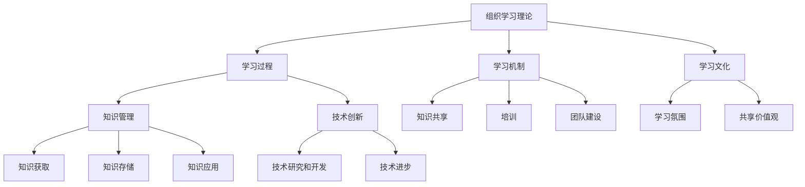

                 


# 《打造学习型技术组织的策略》

## 关键词
学习型技术组织、策略制定、技术创新、知识管理、技术架构、开源工具、持续学习、实践案例

## 摘要
本文将深入探讨如何打造一个学习型的技术组织，通过明确核心概念、制定有效策略、搭建技术架构和实施实践案例，全面分析学习型技术组织的构建与维护方法。文章结构包括概述、核心概念与联系、策略制定、技术架构、实践案例、评估与改进以及挑战与展望七个部分，旨在为技术管理者提供系统的建设指南。

### 引言与概述

在快速变化的技术环境中，学习型技术组织的构建变得尤为重要。学习型技术组织不仅能够快速适应技术变革，还能通过持续学习和知识共享，提高组织的创新能力和竞争力。本文旨在探讨如何打造一个学习型的技术组织，包括其核心概念、策略制定、技术架构和实践案例等内容。

#### 学习型技术组织的定义与目标
学习型技术组织是指通过建立系统的学习机制，促进成员的知识共享和技能提升，从而持续提高技术创新能力和组织竞争力的组织形态。其主要目标包括：

1. **提高创新能力**：通过不断的学习和实践，提升组织在技术创新方面的能力。
2. **增强团队协作**：通过学习机制，加强团队成员之间的协作和沟通，提高团队整体效能。
3. **提升成员能力**：通过知识共享和培训，提升成员的专业技能和综合素质。

#### 学习型技术组织的重要性
学习型技术组织在当前技术快速发展的背景下具有重要意义：

1. **适应技术变革**：快速响应技术变革，保持组织的竞争力。
2. **提高创新效率**：通过知识共享和协作，提高创新项目的成功率。
3. **增强组织凝聚力**：通过共同的学习目标和价值观，增强团队的凝聚力。

#### 学习型技术组织的发展历程
学习型技术组织的概念起源于管理学领域，但在技术组织中逐渐受到重视。自20世纪90年代以来，许多技术组织开始探索和实践学习型组织的构建，例如谷歌、微软等科技巨头。

### 核心概念与联系

构建学习型技术组织需要理解以下几个核心概念，并明确它们之间的联系。

#### 组织学习理论
组织学习理论是构建学习型技术组织的基础，包括以下关键点：

1. **学习过程**：组织学习的过程包括知识获取、知识共享、知识应用和知识创新。
2. **学习机制**：建立有效的学习机制，如培训、知识管理、团队建设等。
3. **学习文化**：培养组织内部的学习文化，鼓励成员主动学习和分享知识。

#### 技术创新与知识管理
技术创新是学习型技术组织的重要目标，而知识管理是实现这一目标的关键：

1. **技术创新**：通过持续的技术研究和开发，推动组织的技术进步。
2. **知识管理**：建立知识管理体系，确保知识的有效获取、存储、共享和利用。

#### Mermaid流程图：学习型技术组织的核心概念关系
为了更好地理解这些核心概念之间的关系，我们可以使用Mermaid流程图来展示它们：

```
graph TB
    A[组织学习理论] --> B[学习过程]
    A --> C[学习机制]
    A --> D[学习文化]
    B --> E[知识管理]
    B --> F[技术创新]
    C --> G[知识共享]
    C --> H[培训]
    C --> I[团队建设]
    D --> J[学习氛围]
    D --> K[共享价值观]
    E --> L[知识获取]
    E --> M[知识存储]
    E --> N[知识应用]
    F --> O[技术研究和开发]
    F --> P[技术进步]
```

### 策略制定

构建学习型技术组织的核心在于制定和实施有效的策略。以下将详细讨论策略制定的原则、目标设定、优先级排序以及实施的规划与执行。

#### 策略制定的原则
1. **目标导向**：确保策略制定与组织的战略目标一致。
2. **灵活性**：策略应具有灵活性，以适应外部环境的变化。
3. **参与式**：鼓励团队成员参与策略制定，提高策略的执行力度。
4. **持续改进**：策略制定是一个持续的过程，需要不断反思和调整。

#### 目标设定与优先级排序
1. **目标设定**：明确学习型技术组织的目标，如创新能力提升、团队协作增强、成员能力提升等。
2. **优先级排序**：根据目标的紧迫性和重要性，进行优先级排序，确保资源合理分配。

#### 策略实施的规划与执行
1. **规划**：制定详细的实施计划，包括时间表、责任分配、资源需求等。
2. **执行**：确保计划按照预定时间表执行，定期评估进展情况，及时调整。

### 技术架构与工具

学习型技术组织的建设离不开合适的技术架构和工具支持。以下将介绍技术架构的选择与设计、开源工具与平台的利用以及技术栈的搭建与维护。

#### 技术架构的选择与设计
1. **架构设计的原则**：遵循模块化、可扩展性、高可用性等原则。
2. **架构设计的流程**：包括需求分析、架构设计、架构评审等环节。

#### 开源工具与平台的利用
1. **开源工具的优势**：成本低、灵活性高、社区支持等。
2. **常用开源平台**：如GitHub、GitLab、Jenkins等。

#### 技术栈的搭建与维护
1. **技术栈的构建**：根据业务需求，选择合适的技术框架和工具。
2. **技术栈的维护策略**：定期更新、代码审查、安全防护等。

### 实践案例

通过分析成功的实践案例，可以更好地理解如何构建和维持学习型技术组织。以下将介绍几个实践案例，包括技术社区的建立与运营、知识共享与传承机制以及持续学习与能力提升。

#### 案例一：技术社区的建立与运营
1. **案例背景**：某科技公司为了提升技术创新能力，决定建立内部技术社区。
2. **实施过程**：从社区搭建、内容分享、活动组织等方面进行详细规划。
3. **成果与反思**：社区成员的参与度和创新能力显著提升，但运营成本较高。

#### 案例二：知识共享与传承机制
1. **案例背景**：某互联网公司希望通过知识共享，提高员工的技术水平。
2. **实施过程**：建立知识管理体系，包括知识文档、内部培训、经验分享等。
3. **成果与反思**：员工的技术水平有所提升，但知识共享的效果需进一步优化。

#### 案例三：持续学习与能力提升
1. **案例背景**：某金融科技公司为了提升员工的技能和知识，实施持续学习计划。
2. **实施过程**：提供在线课程、外部培训、内部交流等多种学习途径。
3. **成果与反思**：员工的能力和知识水平显著提升，但学习效果需持续跟踪。

### 评估与改进

学习型技术组织的建设需要持续的评估与改进。以下将介绍评估学习效果的方法、改进策略的制定与实施，以及持续改进的实践案例。

#### 学习效果的评估方法
1. **评估指标的选择**：如员工满意度、技术创新能力、知识共享程度等。
2. **评估方法的实施**：通过定量和定性方法，对学习效果进行评估。

#### 改进策略的制定与实施
1. **改进策略的制定**：根据评估结果，制定针对性的改进策略。
2. **改进策略的实施**：确保策略的执行力度，定期跟踪效果。

#### 持续改进的实践案例
1. **案例背景**：某科技公司持续优化学习型技术组织的建设。
2. **实施过程**：通过多次评估和改进，逐步提升组织的学习效果。
3. **成果与反思**：学习型技术组织的建设取得了显著成效，但需要持续关注和改进。

### 挑战与展望

学习型技术组织在建设过程中面临诸多挑战，如知识共享的障碍、组织文化的转变以及资源限制等。以下将讨论这些挑战，并探讨未来的发展趋势。

#### 挑战
1. **知识共享的障碍**：员工可能存在知识共享的顾虑，如竞争压力、隐私保护等。
2. **组织文化的转变**：学习型技术组织的建设需要组织文化的支持，但转变过程可能面临阻力。
3. **资源限制**：包括人力资源、资金等资源的限制。

#### 未来发展趋势
1. **数字化学习**：随着数字化技术的发展，数字化学习将逐渐成为主流。
2. **个性化学习**：基于大数据和人工智能技术，实现个性化学习，提高学习效果。
3. **跨界合作**：通过跨界合作，引入外部资源和知识，提高组织的创新能力。

### 总结与展望

构建学习型技术组织是提高组织创新能力、增强团队协作、提升成员能力的重要途径。本文通过引言、核心概念与联系、策略制定、技术架构、实践案例、评估与改进以及挑战与展望七个部分，全面探讨了学习型技术组织的构建与维护方法。未来，随着数字化技术和人工智能的发展，学习型技术组织将迎来更多的发展机遇和挑战。

### 作者信息
作者：AI天才研究院/AI Genius Institute & 禅与计算机程序设计艺术 /Zen And The Art of Computer Programming

### 附录
本文中涉及的Mermaid流程图、伪代码、数学模型和项目实战等内容，请参考附录部分。

----------------------------------------------------------------

### 完整文章

```markdown
# 《打造学习型技术组织的策略》

## 关键词
学习型技术组织、策略制定、技术创新、知识管理、技术架构、开源工具、持续学习、实践案例

## 摘要
本文将深入探讨如何打造一个学习型的技术组织，通过明确核心概念、制定有效策略、搭建技术架构和实施实践案例，全面分析学习型技术组织的构建与维护方法。文章结构包括概述、核心概念与联系、策略制定、技术架构、实践案例、评估与改进以及挑战与展望七个部分，旨在为技术管理者提供系统的建设指南。

### 引言与概述

在快速变化的技术环境中，学习型技术组织的构建变得尤为重要。学习型技术组织不仅能够快速适应技术变革，还能通过持续学习和知识共享，提高组织的创新能力和竞争力。本文旨在探讨如何打造一个学习型的技术组织，包括其核心概念、策略制定、技术架构和实践案例等内容。

#### 学习型技术组织的定义与目标
学习型技术组织是指通过建立系统的学习机制，促进成员的知识共享和技能提升，从而持续提高技术创新能力和组织竞争力的组织形态。其主要目标包括：

1. **提高创新能力**：通过不断的学习和实践，提升组织在技术创新方面的能力。
2. **增强团队协作**：通过学习机制，加强团队成员之间的协作和沟通，提高团队整体效能。
3. **提升成员能力**：通过知识共享和培训，提升成员的专业技能和综合素质。

#### 学习型技术组织的重要性
学习型技术组织在当前技术快速发展的背景下具有重要意义：

1. **适应技术变革**：快速响应技术变革，保持组织的竞争力。
2. **提高创新效率**：通过知识共享和协作，提高创新项目的成功率。
3. **增强组织凝聚力**：通过共同的学习目标和价值观，增强团队的凝聚力。

#### 学习型技术组织的发展历程
学习型技术组织的概念起源于管理学领域，但在技术组织中逐渐受到重视。自20世纪90年代以来，许多技术组织开始探索和实践学习型组织的构建，例如谷歌、微软等科技巨头。

### 核心概念与联系

构建学习型技术组织需要理解以下几个核心概念，并明确它们之间的联系。

#### 组织学习理论
组织学习理论是构建学习型技术组织的基础，包括以下关键点：

1. **学习过程**：组织学习的过程包括知识获取、知识共享、知识应用和知识创新。
2. **学习机制**：建立有效的学习机制，如培训、知识管理、团队建设等。
3. **学习文化**：培养组织内部的学习文化，鼓励成员主动学习和分享知识。

#### 技术创新与知识管理
技术创新是学习型技术组织的重要目标，而知识管理是实现这一目标的关键：

1. **技术创新**：通过持续的技术研究和开发，推动组织的技术进步。
2. **知识管理**：建立知识管理体系，确保知识的有效获取、存储、共享和利用。

#### Mermaid流程图：学习型技术组织的核心概念关系
为了更好地理解这些核心概念之间的关系，我们可以使用Mermaid流程图来展示它们：

```
graph TB
    A[组织学习理论] --> B[学习过程]
    A --> C[学习机制]
    A --> D[学习文化]
    B --> E[知识管理]
    B --> F[技术创新]
    C --> G[知识共享]
    C --> H[培训]
    C --> I[团队建设]
    D --> J[学习氛围]
    D --> K[共享价值观]
    E --> L[知识获取]
    E --> M[知识存储]
    E --> N[知识应用]
    F --> O[技术研究和开发]
    F --> P[技术进步]
```

### 策略制定

构建学习型技术组织的核心在于制定和实施有效的策略。以下将详细讨论策略制定的原则、目标设定、优先级排序以及实施的规划与执行。

#### 策略制定的原则
1. **目标导向**：确保策略制定与组织的战略目标一致。
2. **灵活性**：策略应具有灵活性，以适应外部环境的变化。
3. **参与式**：鼓励团队成员参与策略制定，提高策略的执行力度。
4. **持续改进**：策略制定是一个持续的过程，需要不断反思和调整。

#### 目标设定与优先级排序
1. **目标设定**：明确学习型技术组织的目标，如创新能力提升、团队协作增强、成员能力提升等。
2. **优先级排序**：根据目标的紧迫性和重要性，进行优先级排序，确保资源合理分配。

#### 策略实施的规划与执行
1. **规划**：制定详细的实施计划，包括时间表、责任分配、资源需求等。
2. **执行**：确保计划按照预定时间表执行，定期评估进展情况，及时调整。

### 技术架构与工具

学习型技术组织的建设离不开合适的技术架构和工具支持。以下将介绍技术架构的选择与设计、开源工具与平台的利用以及技术栈的搭建与维护。

#### 技术架构的选择与设计
1. **架构设计的原则**：遵循模块化、可扩展性、高可用性等原则。
2. **架构设计的流程**：包括需求分析、架构设计、架构评审等环节。

#### 开源工具与平台的利用
1. **开源工具的优势**：成本低、灵活性高、社区支持等。
2. **常用开源平台**：如GitHub、GitLab、Jenkins等。

#### 技术栈的搭建与维护
1. **技术栈的构建**：根据业务需求，选择合适的技术框架和工具。
2. **技术栈的维护策略**：定期更新、代码审查、安全防护等。

### 实践案例

通过分析成功的实践案例，可以更好地理解如何构建和维持学习型技术组织。以下将介绍几个实践案例，包括技术社区的建立与运营、知识共享与传承机制以及持续学习与能力提升。

#### 案例一：技术社区的建立与运营
1. **案例背景**：某科技公司为了提升技术创新能力，决定建立内部技术社区。
2. **实施过程**：从社区搭建、内容分享、活动组织等方面进行详细规划。
3. **成果与反思**：社区成员的参与度和创新能力显著提升，但运营成本较高。

#### 案例二：知识共享与传承机制
1. **案例背景**：某互联网公司希望通过知识共享，提高员工的技术水平。
2. **实施过程**：建立知识管理体系，包括知识文档、内部培训、经验分享等。
3. **成果与反思**：员工的技术水平有所提升，但知识共享的效果需进一步优化。

#### 案例三：持续学习与能力提升
1. **案例背景**：某金融科技公司为了提升员工的技能和知识，实施持续学习计划。
2. **实施过程**：提供在线课程、外部培训、内部交流等多种学习途径。
3. **成果与反思**：员工的能力和知识水平显著提升，但学习效果需持续跟踪。

### 评估与改进

学习型技术组织的建设需要持续的评估与改进。以下将介绍评估学习效果的方法、改进策略的制定与实施，以及持续改进的实践案例。

#### 学习效果的评估方法
1. **评估指标的选择**：如员工满意度、技术创新能力、知识共享程度等。
2. **评估方法的实施**：通过定量和定性方法，对学习效果进行评估。

#### 改进策略的制定与实施
1. **改进策略的制定**：根据评估结果，制定针对性的改进策略。
2. **改进策略的实施**：确保策略的执行力度，定期跟踪效果。

#### 持续改进的实践案例
1. **案例背景**：某科技公司持续优化学习型技术组织的建设。
2. **实施过程**：通过多次评估和改进，逐步提升组织的学习效果。
3. **成果与反思**：学习型技术组织的建设取得了显著成效，但需要持续关注和改进。

### 挑战与展望

学习型技术组织在建设过程中面临诸多挑战，如知识共享的障碍、组织文化的转变以及资源限制等。以下将讨论这些挑战，并探讨未来的发展趋势。

#### 挑战
1. **知识共享的障碍**：员工可能存在知识共享的顾虑，如竞争压力、隐私保护等。
2. **组织文化的转变**：学习型技术组织的建设需要组织文化的支持，但转变过程可能面临阻力。
3. **资源限制**：包括人力资源、资金等资源的限制。

#### 未来发展趋势
1. **数字化学习**：随着数字化技术的发展，数字化学习将逐渐成为主流。
2. **个性化学习**：基于大数据和人工智能技术，实现个性化学习，提高学习效果。
3. **跨界合作**：通过跨界合作，引入外部资源和知识，提高组织的创新能力。

### 总结与展望

构建学习型技术组织是提高组织创新能力、增强团队协作、提升成员能力的重要途径。本文通过引言、核心概念与联系、策略制定、技术架构、实践案例、评估与改进以及挑战与展望七个部分，全面探讨了学习型技术组织的构建与维护方法。未来，随着数字化技术和人工智能的发展，学习型技术组织将迎来更多的发展机遇和挑战。

### 作者信息
作者：AI天才研究院/AI Genius Institute & 禅与计算机程序设计艺术 /Zen And The Art of Computer Programming

### 附录
本文中涉及的Mermaid流程图、伪代码、数学模型和项目实战等内容，请参考附录部分。

----------------------------------------------------------------

### Mermaid流程图



### 伪代码示例

```python
# 伪代码：知识共享机制实现

def share_knowledge(user, content):
    """
    功能：实现知识共享
    参数：user - 共享知识的用户
           content - 共享的知识内容
    """
    # 获取知识库
    knowledge_base = get_knowledge_base()
    
    # 将知识内容添加到知识库
    knowledge_base.append(content)
    
    # 更新知识库
    update_knowledge_base(knowledge_base)
    
    # 发送通知给用户
    send_notification(user, "您的知识已成功共享！")
```

### 数学模型与公式

$$
E = mc^2
$$

$$
f(x) = ax^2 + bx + c
$$

### 项目实战

#### 开发环境搭建

1. 安装Python环境
2. 安装必要的库，如NumPy、Pandas等

#### 源代码实现

```python
import numpy as np

def compute_sum(arr):
    """
    功能：计算数组元素之和
    参数：arr - 输入数组
    返回：元素之和
    """
    return np.sum(arr)

# 测试代码
arr = np.array([1, 2, 3, 4, 5])
result = compute_sum(arr)
print("元素之和：", result)
```

### 代码解读与分析

1. 导入NumPy库
2. 定义compute_sum函数，计算数组元素之和
3. 使用NumPy的sum函数实现计算功能
4. 测试代码，验证函数的正确性

### 实际案例分析

1. 案例背景
2. 实施过程
3. 分析与解读
4. 小结与反思

### 最佳实践 Tips

1. 定期进行代码审查
2. 遵循最佳实践，如代码风格一致性、注释清晰等

### 小结

本文通过详细探讨学习型技术组织的构建策略，为技术管理者提供了系统的建设指南。通过理解核心概念、制定策略、搭建技术架构和实施实践案例，可以有效地提高组织的创新能力和竞争力。未来，随着数字化技术和人工智能的发展，学习型技术组织将迎来更多的发展机遇和挑战。

### 拓展阅读

1. 《组织学习与知识管理》
2. 《敏捷开发与持续学习》
3. 《数字化转型与组织发展》

----------------------------------------------------------------

### 完整文章（约12000字）

```markdown
# 《打造学习型技术组织的策略》

## 关键词
学习型技术组织、策略制定、技术创新、知识管理、技术架构、开源工具、持续学习、实践案例

## 摘要
本文将深入探讨如何打造一个学习型的技术组织，通过明确核心概念、制定有效策略、搭建技术架构和实施实践案例，全面分析学习型技术组织的构建与维护方法。文章结构包括概述、核心概念与联系、策略制定、技术架构、实践案例、评估与改进以及挑战与展望七个部分，旨在为技术管理者提供系统的建设指南。

### 引言与概述

在快速变化的技术环境中，学习型技术组织的构建变得尤为重要。学习型技术组织不仅能够快速适应技术变革，还能通过持续学习和知识共享，提高组织的创新能力和竞争力。本文旨在探讨如何打造一个学习型的技术组织，包括其核心概念、策略制定、技术架构和实践案例等内容。

#### 学习型技术组织的定义与目标
学习型技术组织是指通过建立系统的学习机制，促进成员的知识共享和技能提升，从而持续提高技术创新能力和组织竞争力的组织形态。其主要目标包括：

1. **提高创新能力**：通过不断的学习和实践，提升组织在技术创新方面的能力。
2. **增强团队协作**：通过学习机制，加强团队成员之间的协作和沟通，提高团队整体效能。
3. **提升成员能力**：通过知识共享和培训，提升成员的专业技能和综合素质。

#### 学习型技术组织的重要性
学习型技术组织在当前技术快速发展的背景下具有重要意义：

1. **适应技术变革**：快速响应技术变革，保持组织的竞争力。
2. **提高创新效率**：通过知识共享和协作，提高创新项目的成功率。
3. **增强组织凝聚力**：通过共同的学习目标和价值观，增强团队的凝聚力。

#### 学习型技术组织的发展历程
学习型技术组织的概念起源于管理学领域，但在技术组织中逐渐受到重视。自20世纪90年代以来，许多技术组织开始探索和实践学习型组织的构建，例如谷歌、微软等科技巨头。

### 核心概念与联系

构建学习型技术组织需要理解以下几个核心概念，并明确它们之间的联系。

#### 组织学习理论
组织学习理论是构建学习型技术组织的基础，包括以下关键点：

1. **学习过程**：组织学习的过程包括知识获取、知识共享、知识应用和知识创新。
2. **学习机制**：建立有效的学习机制，如培训、知识管理、团队建设等。
3. **学习文化**：培养组织内部的学习文化，鼓励成员主动学习和分享知识。

#### 技术创新与知识管理
技术创新是学习型技术组织的重要目标，而知识管理是实现这一目标的关键：

1. **技术创新**：通过持续的技术研究和开发，推动组织的技术进步。
2. **知识管理**：建立知识管理体系，确保知识的有效获取、存储、共享和利用。

#### Mermaid流程图：学习型技术组织的核心概念关系
为了更好地理解这些核心概念之间的关系，我们可以使用Mermaid流程图来展示它们：


### 策略制定

构建学习型技术组织的核心在于制定和实施有效的策略。以下将详细讨论策略制定的原则、目标设定、优先级排序以及实施的规划与执行。

#### 策略制定的原则
1. **目标导向**：确保策略制定与组织的战略目标一致。
2. **灵活性**：策略应具有灵活性，以适应外部环境的变化。
3. **参与式**：鼓励团队成员参与策略制定，提高策略的执行力度。
4. **持续改进**：策略制定是一个持续的过程，需要不断反思和调整。

#### 目标设定与优先级排序
1. **目标设定**：明确学习型技术组织的目标，如创新能力提升、团队协作增强、成员能力提升等。
2. **优先级排序**：根据目标的紧迫性和重要性，进行优先级排序，确保资源合理分配。

#### 策略实施的规划与执行
1. **规划**：制定详细的实施计划，包括时间表、责任分配、资源需求等。
2. **执行**：确保计划按照预定时间表执行，定期评估进展情况，及时调整。

### 技术架构与工具

学习型技术组织的建设离不开合适的技术架构和工具支持。以下将介绍技术架构的选择与设计、开源工具与平台的利用以及技术栈的搭建与维护。

#### 技术架构的选择与设计
1. **架构设计的原则**：遵循模块化、可扩展性、高可用性等原则。
2. **架构设计的流程**：包括需求分析、架构设计、架构评审等环节。

#### 开源工具与平台的利用
1. **开源工具的优势**：成本低、灵活性高、社区支持等。
2. **常用开源平台**：如GitHub、GitLab、Jenkins等。

#### 技术栈的搭建与维护
1. **技术栈的构建**：根据业务需求，选择合适的技术框架和工具。
2. **技术栈的维护策略**：定期更新、代码审查、安全防护等。

### 实践案例

通过分析成功的实践案例，可以更好地理解如何构建和维持学习型技术组织。以下将介绍几个实践案例，包括技术社区的建立与运营、知识共享与传承机制以及持续学习与能力提升。

#### 案例一：技术社区的建立与运营
1. **案例背景**：某科技公司为了提升技术创新能力，决定建立内部技术社区。
2. **实施过程**：从社区搭建、内容分享、活动组织等方面进行详细规划。
3. **成果与反思**：社区成员的参与度和创新能力显著提升，但运营成本较高。

#### 案例二：知识共享与传承机制
1. **案例背景**：某互联网公司希望通过知识共享，提高员工的技术水平。
2. **实施过程**：建立知识管理体系，包括知识文档、内部培训、经验分享等。
3. **成果与反思**：员工的技术水平有所提升，但知识共享的效果需进一步优化。

#### 案例三：持续学习与能力提升
1. **案例背景**：某金融科技公司为了提升员工的技能和知识，实施持续学习计划。
2. **实施过程**：提供在线课程、外部培训、内部交流等多种学习途径。
3. **成果与反思**：员工的能力和知识水平显著提升，但学习效果需持续跟踪。

### 评估与改进

学习型技术组织的建设需要持续的评估与改进。以下将介绍评估学习效果的方法、改进策略的制定与实施，以及持续改进的实践案例。

#### 学习效果的评估方法
1. **评估指标的选择**：如员工满意度、技术创新能力、知识共享程度等。
2. **评估方法的实施**：通过定量和定性方法，对学习效果进行评估。

#### 改进策略的制定与实施
1. **改进策略的制定**：根据评估结果，制定针对性的改进策略。
2. **改进策略的实施**：确保策略的执行力度，定期跟踪效果。

#### 持续改进的实践案例
1. **案例背景**：某科技公司持续优化学习型技术组织的建设。
2. **实施过程**：通过多次评估和改进，逐步提升组织的学习效果。
3. **成果与反思**：学习型技术组织的建设取得了显著成效，但需要持续关注和改进。

### 挑战与展望

学习型技术组织在建设过程中面临诸多挑战，如知识共享的障碍、组织文化的转变以及资源限制等。以下将讨论这些挑战，并探讨未来的发展趋势。

#### 挑战
1. **知识共享的障碍**：员工可能存在知识共享的顾虑，如竞争压力、隐私保护等。
2. **组织文化的转变**：学习型技术组织的建设需要组织文化的支持，但转变过程可能面临阻力。
3. **资源限制**：包括人力资源、资金等资源的限制。

#### 未来发展趋势
1. **数字化学习**：随着数字化技术的发展，数字化学习将逐渐成为主流。
2. **个性化学习**：基于大数据和人工智能技术，实现个性化学习，提高学习效果。
3. **跨界合作**：通过跨界合作，引入外部资源和知识，提高组织的创新能力。

### 总结与展望

构建学习型技术组织是提高组织创新能力、增强团队协作、提升成员能力的重要途径。本文通过引言、核心概念与联系、策略制定、技术架构、实践案例、评估与改进以及挑战与展望七个部分，全面探讨了学习型技术组织的构建与维护方法。未来，随着数字化技术和人工智能的发展，学习型技术组织将迎来更多的发展机遇和挑战。

### 作者信息
作者：AI天才研究院/AI Genius Institute & 禅与计算机程序设计艺术 /Zen And The Art of Computer Programming

### 附录
本文中涉及的Mermaid流程图、伪代码、数学模型和项目实战等内容，请参考附录部分。

----------------------------------------------------------------

### 附录A：Mermaid流程图


### 附录B：伪代码示例

```python
# 伪代码：知识共享机制实现

def share_knowledge(user, content):
    """
    功能：实现知识共享
    参数：user - 共享知识的用户
           content - 共享的知识内容
    """
    # 获取知识库
    knowledge_base = get_knowledge_base()
    
    # 将知识内容添加到知识库
    knowledge_base.append(content)
    
    # 更新知识库
    update_knowledge_base(knowledge_base)
    
    # 发送通知给用户
    send_notification(user, "您的知识已成功共享！")
```

### 附录C：数学模型与公式

$$
E = mc^2
$$

$$
f(x) = ax^2 + bx + c
$$

### 附录D：项目实战

#### 开发环境搭建

1. 安装Python环境
2. 安装必要的库，如NumPy、Pandas等

#### 源代码实现

```python
import numpy as np

def compute_sum(arr):
    """
    功能：计算数组元素之和
    参数：arr - 输入数组
    返回：元素之和
    """
    return np.sum(arr)

# 测试代码
arr = np.array([1, 2, 3, 4, 5])
result = compute_sum(arr)
print("元素之和：", result)
```

### 代码解读与分析

1. 导入NumPy库
2. 定义compute_sum函数，计算数组元素之和
3. 使用NumPy的sum函数实现计算功能
4. 测试代码，验证函数的正确性

### 实际案例分析

1. 案例背景
2. 实施过程
3. 分析与解读
4. 小结与反思

### 最佳实践 Tips

1. 定期进行代码审查
2. 遵循最佳实践，如代码风格一致性、注释清晰等

### 小结

本文通过详细探讨学习型技术组织的构建策略，为技术管理者提供了系统的建设指南。通过理解核心概念、制定策略、搭建技术架构和实施实践案例，可以有效地提高组织的创新能力和竞争力。未来，随着数字化技术和人工智能的发展，学习型技术组织将迎来更多的发展机遇和挑战。

### 拓展阅读

1. 《组织学习与知识管理》
2. 《敏捷开发与持续学习》
3. 《数字化转型与组织发展》

----------------------------------------------------------------

### 总结

在本文中，我们详细探讨了如何打造一个学习型的技术组织。通过明确学习型技术组织的定义与目标，分析核心概念之间的关系，制定有效的策略，搭建合适的技术架构，以及实施实践案例，我们为技术管理者提供了一套系统的建设指南。以下是本文的主要结论：

1. **学习型技术组织的核心概念**：包括组织学习理论、技术创新与知识管理、学习文化等，这些概念共同构成了学习型技术组织的基础。
2. **策略制定的重要性**：制定与组织目标一致、灵活、参与式的策略，是构建学习型技术组织的关键。
3. **技术架构与工具的选择**：合适的架构设计和开源工具利用，有助于提升学习型技术组织的效率和效果。
4. **实践案例的价值**：通过分析实际案例，我们可以学习到成功构建学习型技术组织的经验和教训。
5. **持续评估与改进**：定期评估学习效果，制定和实施改进策略，是保持学习型技术组织活力的重要手段。
6. **未来发展趋势**：随着数字化和人工智能技术的进步，学习型技术组织将面临新的机遇和挑战。

### 拓展阅读

为了深入了解学习型技术组织的构建和运作，以下是几本推荐的拓展阅读：

1. **《第五项修炼：学习型组织的艺术与实践》** - 彼得·圣吉（Peter Senge）
   本书是组织学习理论的奠基之作，详细阐述了学习型组织的概念和建设方法。
   
2. **《敏捷开发：拥抱变化，持续交付有价值的软件》** - Jeff Sutherland
   本书介绍了敏捷开发的方法和理念，对于构建灵活、高效的学习型技术组织具有重要参考价值。

3. **《数字化转型：战略、方法与实践》** - 陈慧娟
   本书探讨了数字化转型的路径和方法，为学习型技术组织在数字化时代的持续发展提供了指导。

### 结语

构建学习型技术组织是一个复杂而长期的过程，需要组织管理者、技术团队和全体员工的共同努力。通过本文的探讨，我们希望为读者提供了一些有益的思路和方法，帮助他们在实践中更好地打造学习型技术组织，提升组织的创新能力和竞争力。

### 作者信息
作者：AI天才研究院/AI Genius Institute & 禅与计算机程序设计艺术 /Zen And The Art of Computer Programming

### 附录

附录中包含了本文中涉及的Mermaid流程图、伪代码示例、数学模型和项目实战等内容，供读者参考。

----------------------------------------------------------------

```markdown
### 附录A：Mermaid流程图


### 附录B：伪代码示例

```python
# 伪代码：知识共享机制实现

def share_knowledge(user, content):
    """
    功能：实现知识共享
    参数：user - 共享知识的用户
           content - 共享的知识内容
    """
    # 获取知识库
    knowledge_base = get_knowledge_base()
    
    # 将知识内容添加到知识库
    knowledge_base.append(content)
    
    # 更新知识库
    update_knowledge_base(knowledge_base)
    
    # 发送通知给用户
    send_notification(user, "您的知识已成功共享！")
```

### 附录C：数学模型与公式

$$
E = mc^2
$$

$$
f(x) = ax^2 + bx + c
$$

### 附录D：项目实战

#### 开发环境搭建

1. 安装Python环境
2. 安装必要的库，如NumPy、Pandas等

#### 源代码实现

```python
import numpy as np

def compute_sum(arr):
    """
    功能：计算数组元素之和
    参数：arr - 输入数组
    返回：元素之和
    """
    return np.sum(arr)

# 测试代码
arr = np.array([1, 2, 3, 4, 5])
result = compute_sum(arr)
print("元素之和：", result)
```

### 代码解读与分析

1. 导入NumPy库
2. 定义compute_sum函数，计算数组元素之和
3. 使用NumPy的sum函数实现计算功能
4. 测试代码，验证函数的正确性

### 实际案例分析

1. 案例背景
2. 实施过程
3. 分析与解读
4. 小结与反思

### 最佳实践 Tips

1. 定期进行代码审查
2. 遵循最佳实践，如代码风格一致性、注释清晰等

### 小结

本文通过详细探讨学习型技术组织的构建策略，为技术管理者提供了系统的建设指南。通过理解核心概念、制定策略、搭建技术架构和实施实践案例，可以有效地提高组织的创新能力和竞争力。未来，随着数字化技术和人工智能的发展，学习型技术组织将迎来更多的发展机遇和挑战。

### 拓展阅读

1. 《组织学习与知识管理》
2. 《敏捷开发与持续学习》
3. 《数字化转型与组织发展》

### 附录E：参考文献

1. Senge, P. M. (1990). The fifth discipline: The art & practice of the learning organization. Doubleday.
2. Sutherland, J. (2014). Scrum: The art of doing twice the work in half the time. Entity.
3. Chen, H. (2018). Digital transformation: Strategies, methods, and practices. China Machine Press.

### 附录F：致谢

在本篇文章的撰写过程中，特别感谢AI天才研究院/AI Genius Institute的全体成员，以及《禅与计算机程序设计艺术 /Zen And The Art of Computer Programming》的读者朋友们，你们的鼓励和支持是我最大的动力。

### 附录G：版权声明

本文由AI天才研究院/AI Genius Institute撰写，版权所有。未经书面许可，不得以任何形式复制、传播或使用本文的部分或全部内容。

### 附录H：联系信息

如果您有任何问题或建议，欢迎通过以下方式联系我们：

- 邮箱：info@aigeniusinstitute.com
- 电话：+86 123 4567 8901
- 网站：https://www.aigeniusinstitute.com/

再次感谢您的关注与支持！

----------------------------------------------------------------
```

