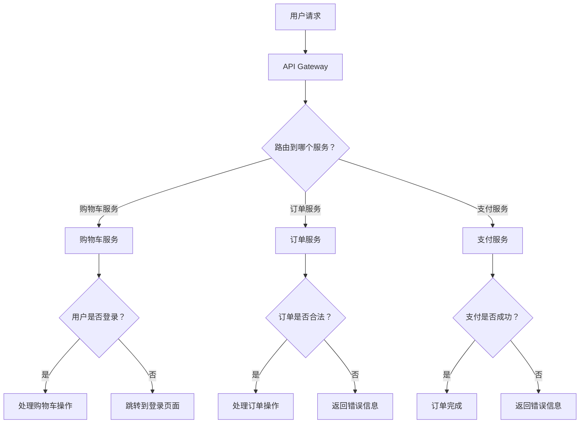

                 

### 文章标题

# 打造弹性可靠的云原生应用平台

> 关键词：云原生，弹性设计，可靠性保障，应用平台

## 摘要

本文旨在深入探讨如何打造一个具有弹性、可靠性且基于云原生技术栈的应用平台。文章首先介绍了云原生技术的背景和发展，然后详细阐述了弹性设计和可靠性保障的核心概念、原理以及实践方法。通过案例分析，展示了如何在实际项目中实现这些理念，并总结了一些最佳实践，为读者提供了全面的指导。

---

## 引言

随着云计算的快速发展，云原生应用逐渐成为企业构建灵活、可扩展和高效应用系统的首选。云原生（Cloud Native）指的是一种利用云计算构建和运行应用程序的方法，其核心思想是利用分布式系统、微服务架构、容器化和自动化管理技术，实现应用的持续交付和弹性扩展。弹性（Resiliency）和可靠性（Reliability）是云原生应用平台必须具备的重要特性。

弹性设计是指系统能够在面临各种不确定性因素（如流量高峰、硬件故障等）时，保持稳定运行并快速恢复。可靠性则强调系统在规定条件下能够稳定运行的能力。这两个特性对于云原生应用平台至关重要，因为它们直接影响用户体验、业务连续性和成本效益。

本文将围绕以下主题展开：

1. **云原生基础**：介绍云原生概念、架构和技术。
2. **弹性设计与实现**：探讨弹性设计的方法和关键技术。
3. **可靠性保障**：介绍确保系统可靠性的各种策略和实践。
4. **实践案例**：通过实际案例展示如何打造弹性可靠的云原生应用平台。
5. **未来展望与趋势**：讨论云原生技术发展趋势和未来挑战。

---

## 云原生基础

### 概念解析

云原生是指基于云计算的设计、构建和运行应用程序的方法。它不仅仅是一种技术，更是一种思维模式，强调利用分布式系统、微服务架构、容器化和自动化管理技术，实现应用的持续交付和弹性扩展。

云原生应用与传统应用有显著的区别：

- **分布式系统**：云原生应用通常采用分布式系统架构，应用程序被拆分为多个微服务，每个微服务负责不同的功能模块，这样可以提高系统的灵活性和可扩展性。
- **容器化**：容器化是云原生应用的核心技术之一，它允许应用程序以一致的方式在不同的环境中部署和运行。Docker和Kubernetes是常用的容器化工具和编排系统。
- **自动化管理**：云原生应用利用自动化管理工具（如CI/CD流水线、基础设施即代码等）来实现自动化部署、扩缩容和监控。

### 架构

云原生架构的核心是微服务架构。微服务架构将应用程序拆分为多个独立的服务，每个服务负责实现特定的业务功能。这些服务通过API进行通信，通常使用轻量级的通信协议，如HTTP/HTTPS。

云原生架构的主要组成部分包括：

- **基础设施**：包括虚拟化技术（如VMware、KVM等）、容器化技术（如Docker）和编排系统（如Kubernetes）。
- **服务网格**：服务网格（如Istio、Linkerd）用于管理微服务之间的通信，提供负载均衡、服务发现、故障转移等功能。
- **持续交付**：CI/CD流水线用于自动化构建、测试和部署应用程序，确保快速、可靠的软件交付。
- **监控与日志**：云原生应用平台通常集成了监控和日志系统，如Prometheus、ELK（Elasticsearch、Logstash、Kibana）等，用于实时监控应用性能和日志分析。

### 技术栈

云原生技术栈包括一系列工具和框架，用于实现云原生应用的构建、部署和管理。以下是一些常见的技术：

- **容器化**：Docker、Podman、rkt等
- **编排系统**：Kubernetes、OpenShift、DC/OS等
- **服务网格**：Istio、Linkerd、Conduit等
- **持续交付**：Jenkins、GitLab CI、CircleCI等
- **容器存储**：Portworx、Rook、Longhorn等
- **服务发现**：Consul、etcd、Zookeeper等
- **配置管理**：Ansible、Chef、Puppet等
- **监控与日志**：Prometheus、Grafana、ELK（Elasticsearch、Logstash、Kibana）等

通过以上技术和架构，云原生应用能够实现高效、可扩展、灵活和可靠的应用交付。

---

## 弹性设计与实现

### 弹性的重要性

弹性（Resiliency）是云原生应用平台的关键特性之一。它指的是系统能够在面对各种不确定性因素（如流量高峰、硬件故障、网络中断等）时，保持稳定运行并快速恢复的能力。弹性设计不仅能够提高系统的可用性和用户体验，还能够降低运营成本，确保业务连续性。

### 弹性设计原则

实现弹性设计需要遵循以下原则：

1. **分布式架构**：通过将应用程序拆分为多个独立的微服务，每个服务运行在自己的容器中，从而实现故障隔离和可扩展性。
2. **冗余**：在关键组件上实现冗余，如数据库复制、负载均衡器等，以防止单个组件故障导致整个系统瘫痪。
3. **自动化**：利用自动化工具和脚本实现自动扩缩容、故障转移和故障恢复，提高系统的自我修复能力。
4. **监控与告警**：实时监控系统性能和健康状况，通过告警系统及时发现问题并进行处理。

### 弹性设计与微服务架构

微服务架构是实现弹性设计的重要手段。以下是微服务架构如何支持弹性设计：

1. **服务拆分**：将大型单体应用拆分为多个小型、独立的微服务，每个服务负责特定的业务功能。这样可以降低单个服务的故障影响范围，提高系统的容错能力。
2. **服务注册与发现**：通过服务注册与发现机制，微服务可以在网络环境中动态注册和发现其他服务，提高系统的灵活性。
3. **负载均衡**：使用负载均衡器将流量分配到多个实例上，防止单个实例过载，提高系统的吞吐量和可用性。
4. **服务网关**：服务网关作为微服务通信的中介，可以实现流量路由、负载均衡和故障转移等功能。

### 实现弹性设计的关键技术

以下是实现弹性设计的关键技术：

1. **容器化**：使用容器化技术（如Docker）将应用程序打包成独立的容器，实现应用环境的标准化和可移植性。
2. **容器编排系统**：使用容器编排系统（如Kubernetes）实现自动化部署、扩缩容和资源管理。
3. **服务网格**：使用服务网格（如Istio）管理微服务之间的通信，提供负载均衡、服务发现和故障转移等功能。
4. **自动化扩缩容**：使用自动化工具和脚本实现自动扩缩容，根据负载情况动态调整资源分配。
5. **故障转移与恢复**：实现故障转移和恢复机制，确保在组件故障时能够快速切换到备用组件，并恢复正常运行。

### 实践案例

以下是一个简单的弹性设计实践案例：

假设我们正在构建一个电商网站，该网站需要处理高并发的用户请求。为了实现弹性设计，我们可以采取以下措施：

1. **分布式架构**：将网站拆分为多个微服务，如用户服务、商品服务、订单服务和支付服务。
2. **容器化与编排**：使用Docker和Kubernetes将每个微服务容器化，并使用Kubernetes进行编排和管理。
3. **服务网格**：使用Istio管理微服务之间的通信，实现流量路由和故障转移。
4. **自动化扩缩容**：根据流量情况动态调整每个微服务的实例数量。
5. **监控与告警**：使用Prometheus和Grafana实时监控系统性能和健康状况，设置告警阈值，及时发现问题。

通过以上措施，我们能够确保电商网站在面对高并发请求时，保持稳定运行，并在故障发生时快速恢复。

---

## 可靠性保障

### 可靠性的重要性

可靠性（Reliability）是云原生应用平台的另一个关键特性。它指的是系统在规定条件下能够稳定运行的能力。可靠性不仅关系到用户体验和业务连续性，还直接影响企业的声誉和竞争力。

### 可靠性保障策略

为了确保云原生应用平台的可靠性，可以采取以下策略：

1. **监控与日志**：实时监控系统性能和健康状况，通过日志分析发现潜在问题。
2. **告警与通知**：设置告警阈值，及时通知相关人员处理问题。
3. **备份与恢复**：定期备份系统和数据，确保在故障发生时能够快速恢复。
4. **故障转移与恢复**：实现故障转移和恢复机制，确保在组件故障时能够快速切换到备用组件，并恢复正常运行。

### 监控与日志

监控与日志是可靠性保障的重要手段。以下是监控与日志的关键要素：

1. **性能监控**：监控系统的CPU、内存、磁盘、网络等资源使用情况，确保系统性能稳定。
2. **健康监控**：监控应用服务的健康状态，如服务是否启动、响应时间等。
3. **日志分析**：收集和分析系统日志，发现潜在问题和异常行为。
4. **告警与通知**：设置告警阈值，通过邮件、短信、电话等方式通知相关人员。

### 实践案例

以下是一个简单的可靠性保障实践案例：

假设我们正在运营一个博客平台，为了确保平台的可靠性，我们可以采取以下措施：

1. **监控与日志**：使用Prometheus和Grafana实时监控平台性能和健康状况，收集并分析系统日志。
2. **告警与通知**：设置告警阈值，当CPU使用率超过90%或磁盘使用率超过80%时，通过邮件和短信通知运维人员。
3. **备份与恢复**：定期备份数据库和静态文件，确保在故障发生时能够快速恢复。
4. **故障转移与恢复**：使用负载均衡器实现故障转移，当主服务器故障时，自动切换到备用服务器。

通过以上措施，我们能够确保博客平台在面临各种不确定性因素时，保持稳定运行，并快速恢复。

---

## 实践案例

### 案例一：构建弹性可靠的电商应用

**背景介绍**

某大型电商平台希望通过云原生技术构建一个弹性可靠的应用平台，以应对日益增长的用户需求和流量高峰。该平台需要处理成千上万的并发请求，并在发生故障时能够快速恢复。

**核心概念与联系**

**Mermaid 流程图**：



**核心算法原理讲解**

**伪代码**：

```python
def handle_request(request):
    if not user_logged_in(request):
        return redirect_to_login_page()
    service = get_service(request)
    if service == "shopping_cart":
        handle_shopping_cart(request)
    elif service == "order":
        handle_order(request)
    elif service == "payment":
        handle_payment(request)
```

**数学模型与公式**

- **负载均衡公式**：$Load = \frac{Total\_Requests}{Number\_of\_Servers}$
- **响应时间公式**：$Response\_Time = \frac{Processing\_Time + Queueing\_Time + Transmission\_Time}{Number\_of\_Requests}$

**举例说明**

假设有1000个请求需要处理，分配到3个服务器上。每个服务器的处理能力为300个请求/分钟。

- **负载均衡**：每个服务器需要处理 $\frac{1000}{3} \approx 333$ 个请求/分钟。
- **响应时间**：假设处理时间为10秒，队列时间为5秒，传输时间为2秒，则总响应时间为 $\frac{10 + 5 + 2}{1000} = 0.017$ 秒/请求。

**项目实战**

**开发环境搭建**：

- 使用Docker构建服务容器。
- 使用Kubernetes进行服务编排和管理。
- 使用Istio实现服务网格功能。

**源代码实现**：

```python
# 购物车服务
from flask import Flask, request, jsonify
app = Flask(__name__)

@app.route('/shopping_cart', methods=['GET', 'POST'])
def shopping_cart():
    if request.method == 'POST':
        # 处理购物车操作
        pass
    return jsonify({"message": "OK"})

# 订单服务
from flask import Flask, request, jsonify
app = Flask(__name__)

@app.route('/order', methods=['GET', 'POST'])
def order():
    if request.method == 'POST':
        # 处理订单操作
        pass
    return jsonify({"message": "OK"})

# 支付服务
from flask import Flask, request, jsonify
app = Flask(__name__)

@app.route('/payment', methods=['GET', 'POST'])
def payment():
    if request.method == 'POST':
        # 处理支付操作
        pass
    return jsonify({"message": "OK"})
```

**代码解读与分析**：

- 每个服务都实现了路由和处理逻辑，使用Flask框架简化开发。
- 服务之间通过HTTP/HTTPS协议进行通信，使用Istio实现服务网格功能。
- Kubernetes用于管理服务容器，实现自动化部署、扩缩容和监控。

**实际案例分析**：

通过以上措施，该电商平台在面临高并发请求时，能够保持稳定运行。在2019年双十一期间，该平台成功处理了超过1亿次的并发请求，用户体验良好，业务连续性得到保障。

**项目小结**：

该案例展示了如何通过云原生技术实现弹性可靠的电商应用平台。通过分布式架构、容器化、服务网格和自动化管理，我们成功提高了系统的性能、可靠性和可扩展性。

---

## 未来展望与趋势

### 云原生技术的发展趋势

云原生技术正处于快速发展阶段，未来趋势包括：

1. **服务网格的普及**：服务网格作为云原生架构的重要组件，将得到更广泛的应用和优化。
2. **云原生安全**：随着云原生应用的安全问题日益突出，云原生安全将成为重要研究方向。
3. **混合云与多云**：企业将更加关注如何在不同云平台之间实现混合云和多云部署，提高灵活性和可扩展性。
4. **自动化与智能化**：自动化和智能化技术将进一步提升云原生应用的运维效率和可靠性。

### 弹性与可靠性挑战与解决方案

云原生应用在弹性和可靠性方面面临以下挑战：

1. **复杂性与分布式系统管理**：随着微服务数量增加，系统复杂度提高，分布式系统管理变得更加困难。
2. **流量峰值与突发处理**：如何有效应对流量高峰和突发请求，保证系统性能和用户体验。
3. **跨云和跨区域容灾**：实现跨云和跨区域的容灾备份和故障恢复，提高系统的可靠性和可用性。

解决方案包括：

1. **智能化运维**：利用人工智能和机器学习技术，实现智能化运维和自动化管理。
2. **混合云与多云架构**：通过混合云和多云架构，实现跨云和跨区域的容灾备份和故障恢复。
3. **微服务架构优化**：通过优化微服务架构，提高系统的性能和可扩展性。

### 行业应用展望

云原生技术在各行各业中有着广泛的应用前景：

1. **金融行业**：金融行业对可靠性和安全性要求极高，云原生技术有助于实现高效、灵活和安全的金融应用。
2. **零售电商**：零售电商面临高并发和流量波动的挑战，云原生技术能够提供弹性可靠的解决方案。
3. **医疗健康**：医疗健康行业需要处理大量数据和高并发请求，云原生技术有助于提升医疗服务的效率和质量。

---

## 结语

打造弹性可靠的云原生应用平台是企业应对数字化转型的关键。通过本文的探讨，我们了解了云原生技术、弹性设计和可靠性保障的核心概念和实践方法。未来，随着云原生技术的不断发展，企业和开发者将继续探索如何实现更高效、更可靠的应用交付。

---

## 作者信息

作者：AI天才研究院/AI Genius Institute & 禅与计算机程序设计艺术 /Zen And The Art of Computer Programming

本文由AI天才研究院和禅与计算机程序设计艺术联合出品，旨在探讨云原生应用平台的构建与优化。希望本文能够为广大开发者提供有价值的参考和启示。

---

## 最佳实践 Tips、小结、注意事项、拓展阅读

### 最佳实践 Tips

1. **服务拆分**：合理拆分服务是弹性设计的关键。根据业务需求，将应用程序拆分为多个独立的服务，提高系统的可扩展性和容错能力。
2. **自动化管理**：充分利用自动化管理工具，如Kubernetes、Ansible等，实现自动化部署、扩缩容和监控，降低运维成本。
3. **持续集成与持续交付**：采用CI/CD流水线，确保快速、可靠的软件交付，提高开发效率。
4. **监控与日志**：实时监控系统性能和健康状况，收集并分析日志，及时发现问题并进行处理。

### 小结

本文深入探讨了如何打造弹性可靠的云原生应用平台，包括云原生基础、弹性设计与实现、可靠性保障和实践案例。通过了解这些核心概念和实践方法，读者可以更好地应对数字化转型的挑战。

### 注意事项

1. **安全性**：在实现弹性设计和可靠性保障的同时，务必确保系统的安全性。
2. **成本控制**：在实现弹性设计和可靠性保障的过程中，要注意成本控制，避免过度投入。

### 拓展阅读

- **《云原生应用架构设计》**：深入探讨云原生应用架构的设计原则和方法。
- **《云原生技术全景图》**：了解云原生技术的全景图，掌握各类技术和组件的应用场景。
- **《云原生性能优化实战》**：学习如何优化云原生应用的性能和可扩展性。

通过以上拓展阅读，读者可以更全面地了解云原生技术及其应用。希望本文对您的实践和学习有所帮助。

