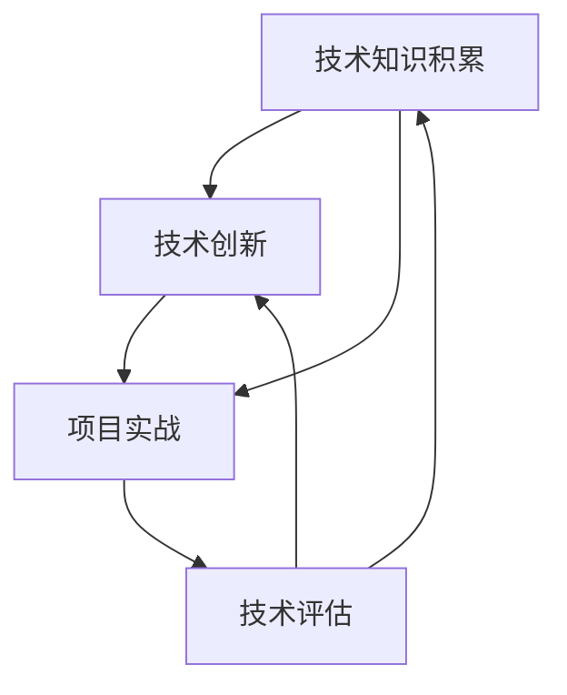
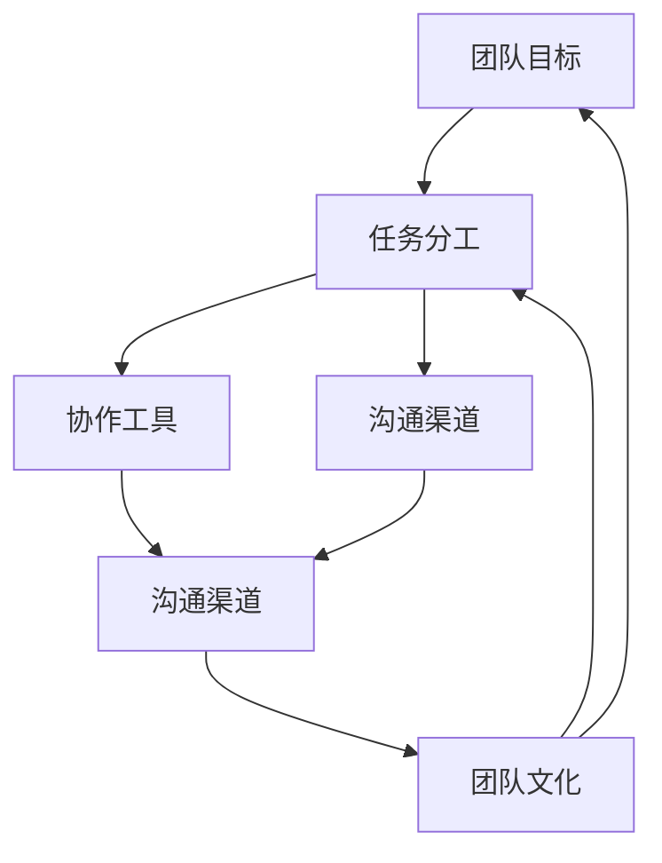

                 

### 引言

在现代信息技术飞速发展的背景下，技术团队作为企业创新和竞争力的重要组成部分，其核心竞争力成为了决定企业成败的关键因素。打造技术团队核心竞争力不仅关乎团队的技术实力，更关乎团队的整体协作、项目管理、持续学习和文化氛围。因此，深入探讨如何打造技术团队核心竞争力，具有重要的现实意义。

首先，技术团队核心竞争力指的是团队在技术、管理和创新能力等方面的综合实力，它决定了团队在市场上的竞争力、项目的成功率和企业的发展潜力。核心竞争力不仅仅是技术层面的，还包括团队协作、沟通能力、项目管理能力等多个方面。

其次，技术团队的核心竞争力对企业的重要性不可忽视。一个具备强大核心竞争力的技术团队，能够迅速响应市场变化，高效完成项目，提升企业市场份额和品牌价值。同时，强大的核心竞争力还能够吸引和留住优秀人才，形成良性的发展循环。

本文将围绕技术团队核心竞争力这一主题，系统探讨以下几个方面：

1. **技术能力提升**：通过技术学习和创新，不断提升团队的技术水平。
2. **团队协作与沟通**：探讨团队协作和沟通的重要性，以及如何提升团队协作效率。
3. **项目管理**：介绍项目管理的方法和技巧，包括需求分析、时间管理、风险评估等。
4. **持续学习与成长**：讨论如何保持团队持续学习和成长，提升团队整体素质。
5. **案例分析与实施策略**：通过实际案例分享，分析成功提升技术团队核心竞争力的关键因素，并给出具体实施策略和建议。

希望通过本文的讨论，能够为技术团队领导者、项目经理和技术负责人提供一些有益的思路和方法，助力他们打造出具备强大核心竞争力的技术团队。

### 技术能力提升

技术能力是技术团队的核心竞争力之一，也是团队在市场竞争中立于不败之地的关键。提升技术能力不仅需要团队成员具备扎实的技术基础，更需要不断学习和创新。以下将探讨如何通过技术学习和创新提升团队的技术能力。

#### 技术学习的路径与方法

1. **技术知识的积累与更新**

技术知识的积累是提升技术能力的基础。团队成员应通过阅读技术书籍、参加技术会议、关注技术博客和论坛等方式，不断积累最新的技术知识。同时，技术知识的更新也非常重要，团队成员需要定期学习新技术，以保持知识的时效性。

2. **技术创新的探索与实践**

技术创新是提升技术能力的有效途径。团队成员应积极参与技术研究和创新项目，通过实践探索新的技术解决方案。在探索过程中，可以借鉴业界最佳实践，同时结合团队的实际需求，进行创新和改进。

3. **技术发展趋势与未来展望**

了解技术发展趋势和未来发展方向，有助于团队成员提前布局，抢占技术制高点。团队成员可以通过参加行业研讨会、技术沙龙等活动，了解行业前沿技术，把握技术发展趋势。

#### 技术能力评估与提升策略

1. **技术能力评估框架**

为了有效提升技术能力，首先需要建立一套技术能力评估框架。评估框架应包括技术知识、创新能力、项目经验等多个方面。通过定期的评估，可以了解团队成员的技术能力现状，找出短板，并有针对性地进行提升。

2. **技术能力提升策略**

- **定期培训与学习**：组织定期的内部培训，邀请技术专家进行授课，提升团队成员的技术水平。
- **项目实战**：通过实际项目锻炼，提升团队成员的技术能力和实战经验。
- **技术交流与分享**：鼓励团队成员参加技术交流会议，分享技术心得，互相学习，共同进步。
- **激励机制**：设立技术能力提升的激励机制，鼓励团队成员积极参与技术学习和创新，提高整体技术能力。

#### 技术团队能力建设案例分析

1. **案例背景**

某互联网公司拥有一支技术团队，主要从事云计算和大数据领域的开发工作。随着业务的发展，公司需要对技术团队进行升级和优化，以提升技术竞争力。

2. **实施过程**

- **技术知识积累**：公司定期组织技术培训，邀请业内专家进行授课，同时鼓励团队成员参加外部技术交流活动。
- **技术创新实践**：公司成立创新实验室，鼓励团队成员参与技术创新项目，探索新的技术解决方案。
- **项目实战**：公司安排团队成员参与多个大型项目，通过实际项目锻炼提升技术水平。
- **技术评估与反馈**：公司定期对团队成员进行技术能力评估，根据评估结果制定个性化的提升计划。

3. **成果与启示**

通过一系列措施，该公司技术团队的技术能力得到了显著提升，项目完成质量和效率也得到了提高。这一案例表明，通过系统化的技术学习、创新实践和科学的管理，技术团队能力建设是可行的，并能够取得显著成效。

总之，技术能力提升是打造技术团队核心竞争力的关键环节。通过不断学习和创新，技术团队能够不断适应市场变化，保持技术领先地位。同时，科学的管理和激励机制也是确保技术能力持续提升的重要保障。

#### 核心概念与联系

在讨论技术能力提升的过程中，几个核心概念相互联系，形成了技术团队提升能力的整体架构。为了更好地理解这些概念，我们使用Mermaid流程图来展示它们之间的关系。

首先，定义以下核心概念：

- **技术知识积累**：指团队成员通过学习获得的新知识。
- **技术创新**：在现有知识基础上，进行创新性的研究和应用。
- **项目实战**：通过参与实际项目，将知识和技术应用到实践中。
- **技术评估**：定期对团队成员的技术能力进行评估，找出提升方向。

以下是展示这些概念相互关系的Mermaid流程图：



- **技术知识积累**是提升技术能力的基石，通过持续学习和知识更新，团队成员不断丰富自己的知识库。
- **技术创新**则是在知识积累的基础上，通过研究和实验，探索新的解决方案和技术方向。
- **项目实战**是将创新成果应用到实际项目中，通过实践检验和优化技术。
- **技术评估**则是通过定期评估，了解团队成员的技术水平，发现不足，并制定相应的提升计划。

这个流程图清晰地展示了技术团队提升技术能力的路径，各个环节相互联系，形成一个闭合的循环系统。通过这样的架构，技术团队能够实现知识的积累、创新和实践，不断提升整体技术能力。

#### 核心算法原理讲解

在技术能力提升的过程中，核心算法原理的理解和掌握至关重要。以下将使用伪代码详细阐述一些关键技术算法的原理，并解释其在技术团队中的应用。

1. **排序算法：快速排序**

快速排序是一种高效的排序算法，其基本原理是通过一趟排序将待排序的记录分割成独立的两部分，其中一部分记录的关键字均比另一部分的关键字小，然后分别对这两部分记录继续进行排序，以达到整个序列有序。

伪代码如下：

```plaintext
快速排序(A[0...n-1]):
    如果 n <= 1，则结束
    选取A[n-1]为基准元素
    i = 0, j = n-2
    循环：
        从右向左扫描，找到第一个小于基准的元素，交换到i位置
        i = i + 1
        从左向右扫描，找到第一个大于基准的元素，交换到j位置
        j = j - 1
        如果i <= j，则循环继续
    交换A[i]和基准元素
    调用快速排序(A[0...i-1])
    调用快速排序(A[i+1...n-1])
```

在技术团队中，快速排序算法可以用于数据分析和数据处理任务，帮助团队快速、高效地处理大量数据，从而为后续的数据挖掘和决策提供支持。

2. **图算法：Dijkstra算法**

Dijkstra算法是一种用于计算图中两点之间最短路径的算法。其基本原理是从一个起始顶点开始，逐步扩展到其他顶点，每次扩展都会更新当前到达每个顶点的最短路径。

伪代码如下：

```plaintext
Dijkstra(G, s):
    初始化：
        对于每个顶点v：
            dist[v] = ∞
            visited[v] = false
        dist[s] = 0
        将s加入优先队列Q
    当Q非空时：
        取出优先队列Q中的顶点u
        标记u为已访问
        对于u的每个邻居v：
            如果v未被访问：
                优先队列Q中的dist[v]更新为dist[u] + weight(u, v)
                将v加入优先队列Q
```

在技术团队中，Dijkstra算法可以用于网络路径规划、推荐系统等领域。通过计算两点之间的最短路径，团队可以优化系统的性能，提高用户体验。

3. **机器学习：线性回归**

线性回归是一种用于预测数值变量的统计方法，其基本原理是通过找到自变量和因变量之间的线性关系，从而预测新的数据点。

伪代码如下：

```plaintext
线性回归(X, y):
    计算X的均值x̄和y的均值ȳ
    计算X和y的协方差矩阵Sxx和Sxy
    计算X的逆矩阵X−1
    β = X−1 * Sxy
    预测值ŷ = β * X
```

在技术团队中，线性回归可以用于数据分析、预测模型等领域。通过建立自变量和因变量之间的线性关系，团队可以更准确地预测未来趋势，为业务决策提供数据支持。

#### 数学模型和公式

在技术能力提升的过程中，数学模型和公式的理解与应用同样至关重要。以下将详细讲解一些关键技术算法中的数学模型和公式，并给出举例说明。

1. **支持向量机（SVM）**

支持向量机是一种常用的机器学习分类算法，其基本数学模型是寻找一个最优的超平面，将不同类别的数据点分开。SVM的数学模型可以表示为：

$$
\text{maximize} \ \frac{1}{2} ||w||^2
$$

subject to

$$
y_i (w \cdot x_i + b) \geq 1
$$

其中，$w$ 是权重向量，$x_i$ 是训练数据点，$y_i$ 是对应的数据点标签（+1或-1），$b$ 是偏置项。

举例说明：

假设我们有一个简单的二分类问题，数据点 $x_1 = [1, 0]$ 和 $x_2 = [0, 1]$，标签分别为 +1 和 -1。通过求解上述优化问题，可以得到最优的权重向量 $w = [0.5, 0.5]$ 和偏置项 $b = 0$，从而构建一个分类器。

2. **线性回归**

线性回归是一种用于预测数值变量的统计方法，其数学模型可以表示为：

$$
y = \beta_0 + \beta_1 x + \epsilon
$$

其中，$y$ 是因变量，$x$ 是自变量，$\beta_0$ 和 $\beta_1$ 是模型的参数，$\epsilon$ 是误差项。

举例说明：

假设我们有一个线性回归模型，用于预测房价。根据数据，我们得到以下模型：

$$
房价 = 1000 + 0.2 \times 面积
$$

这意味着，每增加一个平方米的面积，房价将增加200元。

3. **PageRank算法**

PageRank是一种用于网页排序的算法，其基本原理是计算每个网页的重要性。PageRank的数学模型可以表示为：

$$
PR(A) = (1-d) + d \cdot \left( \frac{PR(T1)}{C(T1)} + \frac{PR(T2)}{C(T2)} + ... + \frac{PR(Tn)}{C(Tn)} \right)
$$

其中，$PR(A)$ 是网页A的PageRank值，$d$ 是阻尼系数（通常取0.85），$C(Ti)$ 是指向网页Ti的链接数量。

举例说明：

假设有两个网页A和B，A有10个指向它的链接，B有5个指向它的链接。根据PageRank算法，可以计算出A的PageRank值为0.85 * (1/10 + 1/5 + 1/5 + 1/5 + 1/5) = 0.85 * 0.2 = 0.17，B的PageRank值为0.85 * (1/10 + 1/5 + 1/5 + 1/5 + 1/5) = 0.85 * 0.2 = 0.17。这表明A和B的重要性相当。

通过上述数学模型和公式的讲解，可以看出数学在技术能力提升中的重要作用。掌握这些模型和公式，技术团队能够更深入地理解算法原理，从而更好地应用于实际项目中，提升整体技术能力。

### 团队协作与沟通

在技术团队的日常工作中，团队协作和沟通起到了至关重要的作用。一个高效的团队不仅需要拥有强大的技术实力，还需要成员之间的紧密合作和有效沟通。以下将探讨团队协作和沟通的重要性，以及如何提升团队协作效率。

#### 团队协作的重要性

1. **提高工作效率**：通过团队协作，可以充分利用团队成员的专业知识和技能，将复杂任务分解为若干子任务，从而提高整体工作效率。

2. **优化资源利用**：团队协作有助于优化资源分配，确保团队成员在正确的方向上投入精力，避免资源的浪费。

3. **提升决策质量**：团队协作能够汇集不同成员的智慧和经验，优化决策过程，提高决策质量和准确性。

4. **促进知识共享**：团队协作有助于知识共享和技能传承，促进团队成员之间的相互学习和成长。

5. **增强团队凝聚力**：良好的团队协作和沟通能够增强团队成员之间的信任和默契，提高团队凝聚力。

#### 团队协作的具体方法

1. **明确目标和任务分工**：团队协作的基础是明确的目标和清晰的分工。在项目启动时，项目经理应与团队成员共同制定项目目标和任务分工，确保每个成员都清楚自己的职责和任务。

2. **定期团队会议**：定期召开团队会议是确保团队协作的重要手段。团队会议应包括进度汇报、问题讨论和决策制定等内容，有助于团队成员及时沟通和协调。

3. **协作工具的使用**：利用协作工具（如Trello、JIRA等）可以有效地跟踪项目进度、任务分配和问题反馈，提高团队协作效率。

4. **跨部门沟通**：技术团队通常需要与其他部门（如产品、设计、市场等）紧密合作。跨部门沟通的有效性直接影响到项目的成功。项目经理应积极与其他部门建立良好的沟通渠道，确保信息的及时传递和问题的快速解决。

5. **团队文化建设**：团队文化是团队协作和沟通的重要保障。通过建立积极、开放和包容的团队文化，可以增强团队成员之间的信任和合作意愿，提高团队协作效率。

#### 提升团队协作效率的具体实践

1. **敏捷开发**：敏捷开发是一种以人为核心、迭代和协作的开发方法。通过短周期迭代、持续反馈和灵活调整，敏捷开发能够提高团队协作效率，快速响应需求变化。

2. **知识共享平台**：建立内部的知识共享平台，鼓励团队成员分享技术文档、经验总结和最佳实践，提高知识的传播和应用效率。

3. **绩效评估**：通过绩效评估机制，对团队成员的协作表现进行评估和反馈，激励成员积极参与团队协作，提升整体效率。

4. **培训和辅导**：定期组织团队协作和沟通的培训，提高团队成员的协作技能和沟通能力。对于新成员，进行一对一的辅导和培训，帮助其更快融入团队。

#### 案例分析

1. **案例背景**

某互联网公司拥有一支由前端、后端和测试团队组成的技术团队。在项目实施过程中，团队成员发现协作不畅，导致项目进度滞后，质量下降。

2. **问题分析**

- 团队成员任务分工不明确，导致工作重叠和效率低下。
- 定期团队会议缺乏有效的议程和决策机制，问题讨论和决策制定耗时较长。
- 沟通工具使用不统一，信息传递不畅。
- 团队文化缺乏开放和包容，部分成员沟通不畅，影响协作效率。

3. **改进措施**

- 重新明确团队成员的任务分工，确保每个成员的职责清晰。
- 制定详细的团队会议议程，确保会议高效进行。
- 推广统一沟通工具的使用，提高信息传递效率。
- 建立开放、包容的团队文化，鼓励成员积极沟通和合作。
- 定期组织培训和辅导，提高团队成员的协作技能和沟通能力。

4. **成果与启示**

通过一系列改进措施，该公司技术团队的协作效率得到了显著提升，项目进度和质量也得到了明显改善。这一案例表明，通过科学的团队协作和沟通管理，技术团队能够更高效地完成项目，提升整体竞争力。

总之，团队协作和沟通是技术团队不可或缺的组成部分。通过明确目标和任务分工、定期会议、协作工具的使用、跨部门沟通和团队文化建设等方法，技术团队能够提高协作效率，实现项目的成功。同时，科学的管理和激励机制也是确保团队协作和沟通持续优化的重要保障。

#### 核心概念与联系

在探讨团队协作和沟通的过程中，几个核心概念相互联系，形成了团队协作与沟通的整体架构。为了更好地理解这些概念，我们使用Mermaid流程图来展示它们之间的关系。

首先，定义以下核心概念：

- **团队目标**：团队共同追求的最终成果。
- **任务分工**：团队成员各自负责的工作内容。
- **协作工具**：用于团队协作的工具和技术。
- **沟通渠道**：团队成员之间交流信息的途径。
- **团队文化**：团队共同遵守的价值观和行为准则。

以下是展示这些概念相互关系的Mermaid流程图：



- **团队目标**是团队协作的出发点，所有成员围绕共同的目标努力。
- **任务分工**确保每个成员明确自己的职责，避免工作重叠和冲突。
- **协作工具**和**沟通渠道**是团队协作和沟通的重要手段，帮助成员高效地完成工作任务和交流信息。
- **团队文化**则是团队协作和沟通的基石，通过共同的价值观和行为准则，增强团队成员之间的信任和合作意愿。

这个流程图清晰地展示了团队协作和沟通的整体架构，各个环节相互联系，形成一个协同工作的系统。通过这样的架构，技术团队能够高效协作，实现共同目标。

#### 团队协作与沟通技巧

在技术团队的日常工作中，高效的团队协作和良好的沟通是确保项目顺利进行和团队持续发展的关键。以下将详细讲解一些团队协作与沟通的技巧，帮助团队成员在协作过程中更加高效和愉快。

1. **明确目标与分工**

- **制定明确的目标**：在项目启动之初，项目经理应与团队成员共同制定明确的项目目标，确保每个成员都清楚团队要达成的最终成果。
- **细化任务分工**：根据团队成员的技能和特长，合理分配任务，确保每个成员都有明确的职责和任务目标。

2. **定期团队会议**

- **制定会议议程**：在召开团队会议前，制定详细的会议议程，包括会议目的、议题和预计时间，确保会议高效进行。
- **积极发言与反馈**：鼓励团队成员在会议上积极发言，提出自己的观点和建议，同时也对其他成员的意见给予积极的反馈。

3. **使用协作工具**

- **选择合适的协作工具**：根据团队的具体需求，选择合适的协作工具（如Trello、JIRA、Slack等），以便于任务分配、进度跟踪和问题反馈。
- **统一协作工具的使用**：确保团队成员统一使用同一协作工具，避免信息传递不畅和任务管理的混乱。

4. **建立沟通渠道**

- **设置多样化的沟通渠道**：通过团队会议、即时通讯工具、邮件和电话等多种方式，建立多样化的沟通渠道，确保信息的及时传递。
- **明确沟通规则**：制定明确的沟通规则，包括沟通频率、反馈机制和优先级，确保沟通的高效和有序。

5. **建立团队文化**

- **营造开放和包容的文化氛围**：鼓励团队成员开放交流，尊重不同的观点和意见，形成包容、互助的团队文化。
- **重视团队建设活动**：定期组织团队建设活动，增强团队成员之间的信任和默契，提升团队凝聚力。

6. **有效倾听与表达**

- **积极倾听**：在沟通过程中，要注重倾听对方的意见和需求，避免打断对方，确保理解对方的真实意图。
- **清晰表达**：在表达自己的观点时，要尽量清晰、简洁，避免使用模糊或歧义的表述。

7. **冲突管理**

- **正视冲突**：在团队协作过程中，冲突是难以避免的。团队领导者应正视冲突，及时处理，避免冲突扩大化。
- **寻求共识**：在处理冲突时，应寻求双方都能接受的解决方案，确保团队的整体利益。

8. **持续反馈与改进**

- **定期反馈**：通过定期反馈，及时了解团队成员的工作进展和问题，提供有针对性的建议和支持。
- **持续改进**：根据反馈结果，不断调整团队协作和沟通策略，优化团队工作流程，提升整体效率。

通过以上团队协作与沟通技巧的运用，技术团队能够更高效地完成项目任务，增强团队凝聚力，提升整体竞争力。同时，这些技巧也为团队成员提供了一个良好的工作氛围，促进了团队成员之间的相互学习和成长。

### 项目管理

在技术团队的日常工作中，项目管理扮演着至关重要的角色。有效的项目管理不仅能够确保项目按时交付，还能够提高项目质量，降低项目风险。以下将介绍项目管理的基础知识，包括需求分析、时间管理、风险评估等方法和技巧。

#### 需求分析

1. **需求识别**：项目启动之初，项目经理需要与客户和利益相关者进行沟通，识别项目的需求。需求识别的目的是明确项目要解决什么问题，满足哪些用户需求。

2. **需求分类**：根据需求的性质，可以将需求分为功能需求、性能需求、安全需求等。功能需求是指系统应提供的基本功能；性能需求是指系统应达到的性能指标；安全需求是指系统应具备的安全特性。

3. **需求文档**：需求文档是需求分析的重要成果，它详细描述了项目的需求，为后续的项目实施提供了依据。需求文档应包括需求概述、功能需求、性能需求、安全需求等部分。

4. **需求验证**：在项目实施过程中，需要对需求进行验证，确保需求是可实现的，且与客户期望一致。需求验证可以通过评审、测试等方式进行。

#### 时间管理

1. **项目规划**：项目规划是时间管理的第一步，它包括项目范围规划、进度规划、资源规划等。项目规划的目标是确定项目的整体时间和资源需求。

2. **工作分解结构（WBS）**：工作分解结构是一种将项目任务分解为更小、更易于管理的子任务的方法。通过WBS，可以明确每个任务的负责人和截止时间。

3. **进度跟踪**：进度跟踪是确保项目按时完成的重要手段。项目经理需要定期检查项目的实际进度与计划进度是否一致，发现偏差时及时进行调整。

4. **风险管理**：在项目规划阶段，需要对项目可能面临的风险进行识别和评估。常见的风险包括时间风险、成本风险、技术风险等。针对识别出的风险，需要制定相应的应对策略。

5. **变更管理**：在项目实施过程中，可能会出现需求变更、资源调整等情况。变更管理是确保变更能够被有效管理和控制的过程。项目经理需要制定变更管理流程，确保变更的透明和可控。

#### 时间管理技巧

1. **优先级排序**：在任务分配和进度安排时，要明确任务的优先级，优先完成高优先级任务。可以使用“四象限法则”进行任务优先级排序，将任务分为紧急重要、紧急不重要、不紧急重要、不紧急不重要四个象限。

2. **时间块管理**：将工作时间划分为不同的时间块，为每个时间块分配特定的任务。这样可以提高工作效率，减少任务切换带来的时间浪费。

3. **定期的进度报告**：定期向团队成员和利益相关者报告项目进度，确保所有相关人员都对项目的进展有清晰的了解。

4. **时间追踪工具**：使用时间追踪工具（如Toggl、Harvest等）记录工作时间，帮助项目经理分析项目进度和资源利用率。

#### 风险评估

1. **风险识别**：在项目启动之初，项目经理需要与团队成员一起识别项目可能面临的风险。风险识别可以通过头脑风暴、专家访谈等方式进行。

2. **风险评估**：对识别出的风险进行评估，确定每个风险的可能性和影响程度。风险评估可以使用定性或定量的方法。

3. **风险应对策略**：根据风险评估结果，制定相应的风险应对策略。常见的风险应对策略包括风险回避、风险减轻、风险接受等。

4. **风险监控**：在项目实施过程中，持续监控风险，及时发现新的风险和变化。项目经理需要定期更新风险登记册，记录风险的变化和应对措施。

#### 实际应用

1. **开发一个电商平台**：

   - **需求分析**：识别客户需求，确定电商平台的功能需求（如商品展示、购物车、订单处理等）和性能需求（如响应速度、并发处理能力等）。
   - **项目规划**：制定项目范围、进度计划、资源计划等。
   - **进度跟踪**：通过每日站会、周报等方式跟踪项目进度，确保按时交付。
   - **风险管理**：识别和评估项目风险，如技术风险（如技术架构选择不当）、时间风险（如项目延期）等，并制定相应的应对策略。

2. **组织一个大型技术会议**：

   - **需求分析**：明确会议的目标、参与者、议程等内容。
   - **项目规划**：制定会议的时间、地点、参会人员、演讲嘉宾、宣传计划等。
   - **进度跟踪**：确保会议的各项准备工作按时完成，如场地预订、演讲稿准备、宣传材料制作等。
   - **风险管理**：识别和评估会议可能面临的风险，如参会人员迟到、设备故障等，并制定相应的应对措施。

通过以上方法和技巧，技术团队能够更有效地管理项目，确保项目按时交付、质量达标。同时，科学的项目管理也是提升团队核心竞争力的关键因素之一。

### 项目管理实战

在实际项目中，项目管理的方法和技巧对于项目的成功至关重要。以下将结合实际案例，详细讲解开发环境和源代码的搭建，源代码的实现与解读，以及项目总结和小结。

#### 案例背景

某互联网公司计划开发一款基于云计算的电商平台，旨在为用户提供便捷的购物体验。该项目涉及到前后端开发、数据库设计和云计算服务的集成，技术复杂度高，项目周期紧。

#### 开发环境搭建

1. **技术选型**：

   - **前端**：采用React.js框架，配合Webpack进行模块化打包。
   - **后端**：使用Spring Boot构建RESTful API，数据库采用MySQL。
   - **云计算**：使用AWS EC2进行服务器部署，结合S3存储用户数据。

2. **开发环境配置**：

   - **前端开发**：配置了Node.js、npm和React的运行环境，安装了Webpack和相关插件。
   - **后端开发**：配置了Java开发环境（如IntelliJ IDEA），安装了Spring Boot和MySQL驱动。
   - **云计算**：配置了AWS CLI，使用AWS管理台配置了EC2实例和S3存储桶。

3. **源代码管理**：

   - 使用Git进行源代码管理，每个成员都有自己的分支，定期合并代码。

#### 源代码实现与解读

1. **后端API实现**：

   - **用户注册与登录**：

     ```java
     @RestController
     public class UserController {
         @Autowired
         private UserRepository userRepository;
         
         @PostMapping("/register")
         public ResponseEntity<?> registerUser(@RequestBody User user) {
             // 注册逻辑
         }
         
         @PostMapping("/login")
         public ResponseEntity<?> authenticateUser(@RequestBody LoginRequest loginRequest) {
             // 登录逻辑
         }
     }
     ```

     解读：上述代码实现了用户注册和登录功能，通过Spring Boot的注解@RestController将UserController类定义为RESTful API控制器。在registerUser方法中，接收用户提交的注册信息，并进行存储。在authenticateUser方法中，接收登录请求，验证用户身份。

   - **商品展示**：

     ```java
     @RestController
     public class ProductController {
         @Autowired
         private ProductRepository productRepository;
         
         @GetMapping("/products")
         public List<Product> getAllProducts() {
             // 查询所有商品逻辑
         }
     }
     ```

     解读：上述代码实现了商品展示功能，ProductController类通过注解@RestController定义为一个RESTful API控制器。在getAllProducts方法中，从数据库中查询所有商品，并返回给前端。

2. **前端实现**：

   - **用户注册页面**：

     ```jsx
     function RegisterForm() {
         const [username, setUsername] = useState('');
         const [password, setPassword] = useState('');

         const handleSubmit = (e) => {
             e.preventDefault();
             // 注册请求逻辑
         };

         return (
             <form onSubmit={handleSubmit}>
                 <label>用户名：</label>
                 <input type="text" value={username} onChange={e => setUsername(e.target.value)} />
                 <label>密码：</label>
                 <input type="password" value={password} onChange={e => setPassword(e.target.value)} />
                 <button type="submit">注册</button>
             </form>
         );
     }
     ```

     解读：上述React组件实现了用户注册页面的表单逻辑。通过useState钩子管理用户名和密码的状态，在表单提交时，调用handleSubmit函数发送注册请求。

3. **集成与测试**：

   - 前后端代码通过RESTful API进行集成，使用Postman工具进行接口测试，确保各个功能模块正常工作。

#### 项目总结与小结

1. **项目成果**：

   - 成功搭建了一个基于云计算的电商平台，提供了用户注册、登录、商品展示等基本功能。
   - 采用了React.js和Spring Boot等主流技术框架，保证了项目的可扩展性和稳定性。

2. **经验与教训**：

   - **经验**：

     - 早期技术选型对项目的成功至关重要，需要充分评估技术方案的优劣。

     - 使用Git进行源代码管理，有助于团队成员之间的协作和代码版本控制。

     - 通过Postman等工具进行接口测试，可以及时发现和修复问题，确保系统稳定性。

   - **教训**：

     - 项目初期对时间预估不足，导致项目进度紧张。在未来的项目中，需要更科学地评估项目周期和资源需求。

     - 需求变更频繁，对项目进度造成了一定影响。在未来的项目中，需要更加严格的需求管理和变更控制。

3. **最佳实践**：

   - **需求管理**：在项目启动之初，进行详细的需求分析和需求文档编写，确保需求明确和稳定。

   - **进度跟踪**：定期召开团队会议，汇报项目进度，及时发现和解决问题。

   - **风险管理**：识别项目风险，制定相应的风险应对策略，并持续监控风险的变化。

通过本次项目实战，技术团队能够更好地理解项目管理的实际应用，提高项目交付的质量和效率。同时，通过总结和反思，团队能够不断优化项目管理的方法和流程，为未来项目的成功奠定坚实基础。

### 持续学习与成长

在技术快速发展的今天，技术团队要想保持竞争力，持续学习和成长至关重要。这不仅关系到团队成员个人的职业发展，也直接影响团队的长期稳定和业务创新能力。以下将探讨如何保持技术团队的持续学习和成长。

#### 持续学习的意义与挑战

1. **意义**：

   - **提高个人技能**：持续学习是提高个人技能和知识储备的重要途径。通过学习新技术、新方法，团队成员能够不断提升自己的技术水平，适应不断变化的市场需求。
   - **增强团队竞争力**：技术团队的持续学习有助于增强团队的整体实力和创新能力，从而在市场竞争中保持领先地位。
   - **促进职业发展**：持续学习能够帮助团队成员在职业生涯中不断晋升，实现更高的职业目标。

2. **挑战**：

   - **时间管理**：团队成员通常工作繁忙，学习时间有限，如何在有限的时间内进行有效学习，是一个挑战。
   - **信息过载**：技术领域的信息量巨大，如何筛选出有价值的学习资源，避免信息过载，是一个难题。
   - **学习效果评估**：持续学习需要确保学习效果，如何评估学习成果，也是一个需要解决的问题。

#### 持续学习的方法与实践

1. **制定学习计划**：

   - **目标明确**：根据个人和团队的发展需求，明确学习目标，制定详细的学习计划。
   - **时间安排**：合理安排学习时间，确保每天或每周有固定的时间进行学习。

2. **多渠道学习**：

   - **在线课程**：利用Coursera、edX等在线教育平台，学习最新技术课程，掌握前沿知识。
   - **技术书籍**：阅读经典和技术前沿的书籍，加深对技术原理的理解。
   - **技术社区**：参与技术论坛、博客、GitHub等平台，与他人交流学习心得，分享技术经验。

3. **实践应用**：

   - **项目实践**：通过参与实际项目，将所学知识应用到实践中，提升解决问题的能力。
   - **技术分享**：定期组织技术分享会，团队成员分享学习心得和实践经验，促进知识传播。

4. **反馈与调整**：

   - **学习反馈**：定期对学习效果进行评估和反馈，了解自己的学习成效，及时调整学习计划。
   - **持续改进**：根据反馈结果，不断优化学习方法，提高学习效率。

#### 技术团队的成长路径

1. **基础知识储备**：

   - **掌握核心编程语言**：熟悉至少一门编程语言（如Java、Python、JavaScript等），掌握基础编程语法和算法。
   - **了解数据结构和算法**：掌握基本的数据结构和算法，如数组、链表、树、图、排序算法等。

2. **技术领域拓展**：

   - **了解技术发展趋势**：关注技术领域的最新动态，如云计算、大数据、人工智能等。
   - **深入学习特定技术**：选择一个或多个技术方向进行深入学习，如Web开发、移动应用开发、云计算服务等。

3. **项目管理能力**：

   - **掌握项目管理知识**：学习项目管理的基本原理和方法，如Scrum、Kanban等。
   - **提升沟通协作能力**：增强沟通协作能力，提高团队工作效率。

4. **持续创新**：

   - **参与技术创新项目**：积极参与技术创新项目，探索新的技术解决方案。
   - **培养创新思维**：通过阅读创新书籍、参加创新培训等，培养创新思维和创新能力。

#### 成长案例分析

1. **案例背景**：

   某互联网公司技术团队在成立之初，团队成员技术水平参差不齐，且缺乏系统的学习计划。随着公司业务的快速发展，团队意识到持续学习和成长的重要性。

2. **实施过程**：

   - **制定学习计划**：团队制定了详细的学习计划，包括技术基础、技术领域拓展、项目实践和项目管理等多个方面。
   - **多渠道学习**：团队成员通过在线课程、技术书籍、技术社区等多种渠道进行学习。
   - **实践应用**：团队成员积极参与公司内部项目，将所学知识应用到实际工作中。
   - **技术分享**：定期组织技术分享会，团队成员分享学习心得和实践经验。

3. **成果与启示**：

   通过一系列的学习和成长措施，该技术团队的整体技术水平得到了显著提升，项目交付质量和效率也有了明显提高。团队成员在职业生涯中也实现了更好的发展，一些成员晋升为技术经理或架构师。

总之，持续学习与成长是技术团队保持核心竞争力的关键。通过制定学习计划、多渠道学习、实践应用和反馈调整等方法，技术团队能够不断提升自身的技术能力和创新能力，实现长远发展。

### 案例分析与实施策略

在技术团队核心竞争力的提升过程中，实际案例的分享和实施策略的分析至关重要。通过分析成功的案例和失败的教训，可以更好地理解提升技术团队核心竞争力的关键因素，从而制定出更有效的实施策略。

#### 成功案例分享

1. **案例背景**：

   某大型互联网公司拥有一个由300多名技术人员组成的技术团队，主要从事云计算、大数据和人工智能领域的研发工作。该公司在技术市场竞争激烈，需要不断提升团队核心竞争力以保持竞争优势。

2. **成功因素**：

   - **技术创新**：公司鼓励技术创新，建立了创新实验室，支持团队成员参与前沿技术的探索和应用。通过技术创新，团队开发出了多项具有竞争力的技术产品，如高性能数据处理平台和智能推荐系统。
   - **人才培养**：公司实施了系统化的人才培养计划，包括内部培训、外部培训和导师制。通过定期的技术培训和项目实践，团队成员的技术能力和项目经验得到了显著提升。
   - **团队协作**：公司注重团队协作，推行敏捷开发方法，通过每日站会、迭代评审等方式，确保团队成员之间的沟通畅通和任务协同。此外，公司还建立了跨部门的协作机制，与产品、设计和市场团队紧密合作，确保项目的高效推进。
   - **文化建设**：公司营造了开放、包容、学习的团队文化，鼓励团队成员分享知识和经验，互相帮助和成长。通过团队建设活动和知识分享平台，团队成员之间的信任和合作意愿得到了增强。

3. **实施策略**：

   - **技术创新激励**：公司设立技术创新基金，支持团队成员参与技术研究和创新项目。对于成功的技术创新，给予奖励和晋升机会。
   - **人才培养机制**：建立完善的培训体系，包括技术培训、项目指导和经验分享等。鼓励团队成员参加外部培训和认证，提升专业技能。
   - **敏捷开发实践**：推行敏捷开发方法，通过每日站会、迭代评审等方式，确保团队成员之间的沟通畅通和任务协同。
   - **团队文化建设**：定期组织团队建设活动和知识分享会，鼓励团队成员分享知识和经验，增强团队凝聚力。

#### 失败案例分析

1. **案例背景**：

   某中型互联网公司技术团队在扩展业务时，由于缺乏科学的管理和有效的协作，导致项目进度滞后、质量问题频发，最终影响了公司的市场声誉。

2. **失败原因**：

   - **缺乏明确的目标和分工**：项目启动时，团队成员对项目目标和任务分工不明确，导致工作重叠和效率低下。
   - **沟通不畅**：团队成员之间的沟通不畅，信息传递不及时，导致任务进展缓慢，问题无法及时解决。
   - **缺乏有效的项目管理**：项目缺乏科学的项目管理方法和工具，导致项目进度无法得到有效监控和调整。
   - **团队文化不良**：团队内部缺乏积极、开放的文化氛围，成员之间的信任和合作意愿不高。

3. **改进措施**：

   - **明确目标和分工**：在项目启动之初，明确项目目标和任务分工，确保每个成员都清楚自己的职责和任务。
   - **加强沟通与协作**：建立多样化的沟通渠道，确保团队成员之间的信息传递畅通，定期召开团队会议，讨论项目进展和问题。
   - **实施科学的项目管理**：引入项目管理工具和方法，如敏捷开发、时间管理工具等，确保项目进度和质量得到有效控制。
   - **营造积极文化氛围**：建立开放、包容、学习的团队文化，鼓励团队成员积极沟通和合作，增强团队凝聚力。

#### 案例启示与借鉴

1. **成功案例启示**：

   成功案例表明，技术创新、人才培养、团队协作和文化建设是提升技术团队核心竞争力的重要因素。通过技术创新，团队能够保持技术领先地位；通过人才培养，团队能够不断提升整体实力；通过团队协作，团队能够高效完成项目任务；通过文化建设，团队能够增强成员之间的信任和合作意愿。

2. **失败案例教训**：

   失败案例提醒我们，缺乏明确的目标和分工、沟通不畅、缺乏有效的项目管理和不良的团队文化都是影响技术团队核心竞争力的重要因素。在项目实施过程中，必须重视这些问题，并采取有效的措施进行改进。

3. **借鉴与实施**：

   企业和团队可以借鉴成功案例的经验，结合自身实际情况，制定具体的实施策略。例如：

   - **制定明确的计划**：在项目启动之初，明确项目目标和任务分工，确保团队成员了解自己的职责和任务。
   - **加强团队协作**：引入敏捷开发方法，建立多样化的沟通渠道，确保团队成员之间的信息传递畅通。
   - **推行人才培养计划**：建立系统化的培训体系，支持团队成员参加外部培训和认证，提升专业技能。
   - **营造积极文化氛围**：通过团队建设活动和知识分享平台，增强团队成员之间的信任和合作意愿。

通过成功案例和失败教训的借鉴，技术团队可以更好地提升核心竞争力，实现可持续发展。

### 实施策略与建议

在综合了前述的技术能力提升、团队协作与沟通、项目管理、持续学习与成长等多个方面的探讨后，我们可以得出一系列具体的实施策略和建议，以帮助技术团队打造和提升核心竞争力。

#### 实施策略

1. **技术能力提升**：

   - **定期培训与学习**：组织定期的内部培训，邀请行业专家进行授课，覆盖最新技术趋势和实战经验。同时，鼓励团队成员参加外部技术会议和培训班。
   - **技术创新机制**：建立技术创新实验室，鼓励团队成员提出创新项目，并给予资金和资源支持。通过创新项目，实践新技术和应用。
   - **技术能力评估**：定期对团队成员进行技术能力评估，识别短板，提供个性化培训计划。

2. **团队协作与沟通**：

   - **协作工具使用**：推广使用协作工具，如Trello、JIRA、Slack等，确保任务分配、进度跟踪和问题反馈的高效。
   - **团队会议管理**：建立定期的团队会议机制，包括每日站会、周会和月会，确保信息传递和问题解决。
   - **跨部门协作**：建立跨部门沟通机制，确保技术团队与其他部门（如产品、设计、市场等）的信息畅通，提高项目协同效率。

3. **项目管理**：

   - **项目管理培训**：对项目经理和团队成员进行项目管理培训，掌握项目管理的基本原理和方法，如敏捷开发、风险管理等。
   - **工具与方法应用**：采用项目管理工具，如Microsoft Project、JIRA等，确保项目进度的可视化和可控性。
   - **需求管理**：加强需求管理，确保需求明确和稳定，避免需求变更带来的风险。

4. **持续学习与成长**：

   - **知识共享平台**：建立内部的知识共享平台，鼓励团队成员分享技术文档、经验总结和最佳实践。
   - **学习激励机制**：设立学习激励机制，对参与学习和培训表现优秀的团队成员给予奖励和晋升机会。
   - **创新文化培养**：营造开放、包容的学习文化，鼓励团队成员勇于尝试新事物，不断创新。

#### 具体建议

1. **制定详细的实施计划**：

   - 根据技术团队的具体情况，制定详细的实施计划，明确每个阶段的目标和任务，确保各项工作有序推进。
   - 计划应包括时间表、责任分配、资源和预算等，确保实施过程的透明和可追踪。

2. **建立反馈机制**：

   - 定期收集团队成员的反馈，了解实施过程中的问题和挑战，及时进行调整和优化。
   - 建立问题反馈渠道，鼓励团队成员提出意见和建议，为团队改进提供参考。

3. **加强领导力**：

   - 领导者应具备技术远见和领导能力，能够带领团队迎接挑战，实现目标。
   - 领导者应积极支持和激励团队成员，为团队成员提供成长和发展的机会。

4. **优化团队结构**：

   - 根据项目需求和技术特点，优化团队结构，确保团队成员的技能和经验与项目需求相匹配。
   - 建立灵活的团队组织形式，如跨功能团队、项目团队等，提高团队的灵活性和响应速度。

通过上述实施策略和具体建议，技术团队能够系统化、科学化地提升自身核心竞争力，确保在激烈的市场竞争中立于不败之地。

### 总结与展望

通过对技术团队核心竞争力各个方面的深入探讨，我们可以得出以下结论：技术团队的核心竞争力不仅是技术能力的体现，更是团队协作、项目管理和持续学习的综合反映。为了打造强大的技术团队，企业需要采取系统化、科学化的策略和措施。

**总结**：

1. **技术能力提升**：通过定期培训、技术创新和实践应用，不断提升团队的技术水平。
2. **团队协作与沟通**：利用协作工具、定期会议和跨部门沟通，确保团队高效协作和问题解决。
3. **项目管理**：采用科学的项目管理方法和工具，确保项目进度和质量。
4. **持续学习与成长**：建立知识共享平台、激励机制和积极的文化氛围，推动团队成员持续学习和成长。

**展望**：

未来，技术团队的发展将更加依赖于技术趋势的快速响应和创新能力。企业应关注以下几个方向：

1. **数字化转型**：随着数字化转型的推进，技术团队需要具备更全面的技术能力和业务理解，以支持业务转型和创新发展。
2. **人工智能与大数据**：人工智能和大数据技术的发展将深刻改变技术团队的工作模式，提升自动化和智能化的水平。
3. **敏捷开发与DevOps**：敏捷开发和DevOps理念的普及将进一步提高技术团队的响应速度和交付质量。
4. **团队文化建设**：积极、开放、包容的团队文化将成为技术团队持续发展的基石。

**未来趋势**：

- **自动化与智能化**：通过自动化工具和人工智能技术，提高开发和运维的效率。
- **云计算与边缘计算**：云计算和边缘计算的融合将提供更加灵活和高效的服务模式。
- **网络安全**：随着数字化进程的加快，网络安全将成为技术团队不可忽视的重要方面。

**结语**：

技术团队的核心竞争力是企业在激烈的市场竞争中脱颖而出的关键。通过不断学习和实践，企业可以打造出具备强大核心竞争力的技术团队，为企业的长期发展奠定坚实基础。在未来的发展中，技术团队需要紧跟技术趋势，持续创新，以适应不断变化的市场需求。作者：AI天才研究院/AI Genius Institute & 禅与计算机程序设计艺术 /Zen And The Art of Computer Programming。

