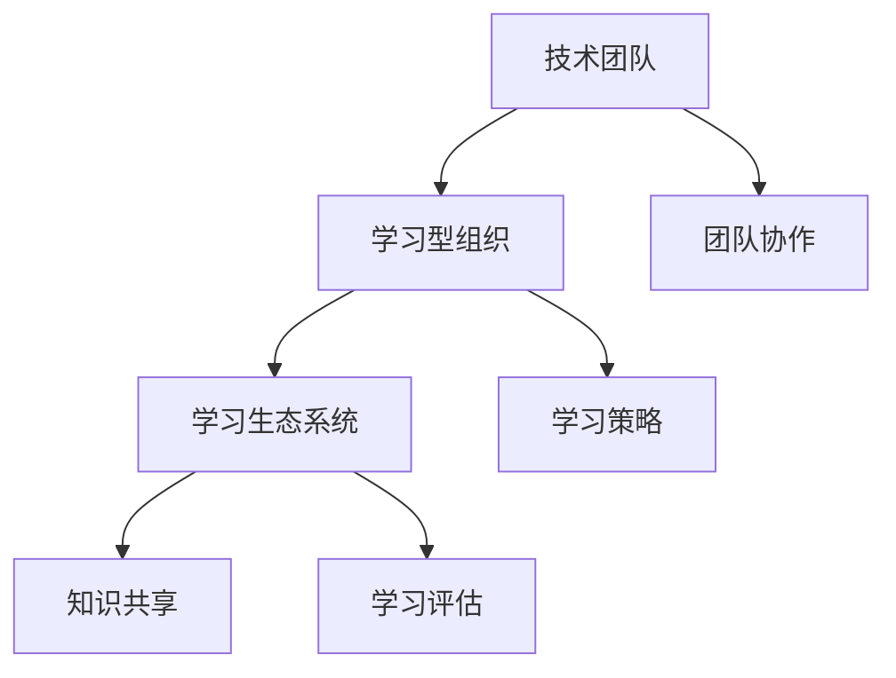

                 

## 文章标题：打造技术团队的学习生态系统

### 关键词：技术团队、学习生态系统、知识共享、学习评估、团队协作

#### 摘要：
在当今快速发展的技术环境中，构建一个高效、可持续发展的技术团队显得尤为重要。本文将深入探讨如何打造一个学习生态系统，以提升技术团队的整体能力。我们将从理论基础、核心概念、算法原理、数学模型以及项目实战等多个角度，详细讲解技术团队学习的策略与方法，帮助读者构建一个富有创新力和协作精神的技术团队。

----------------------------------------------------------------

### 第1章：引言与核心概念

#### 1.1 技术团队与学习生态系统概述

随着信息技术的飞速发展，技术团队的作用和影响力日益显著。技术团队不仅是企业创新的核心力量，也是推动企业持续发展的重要动力。一个高效的技术团队应当具备以下特点：

1. **专业技能**：团队成员应具备扎实的技术功底和广泛的知识储备。
2. **团队协作**：团队成员之间应具备良好的沟通能力和协作精神。
3. **持续学习**：团队成员应具备持续学习和自我提升的能力。

然而，仅有专业技能和团队协作还不足以构建一个高效的技术团队。一个学习生态系统是实现技术团队持续发展的关键。学习生态系统是指一个支持团队学习和知识共享的环境，它包括以下几个核心组成部分：

1. **知识共享**：通过多种方式促进团队成员之间的知识交流与共享。
2. **学习评估**：对团队成员的学习效果进行科学、客观的评估，以便及时调整学习策略。
3. **团队协作**：构建一个协作高效、信息流畅的团队工作环境。

#### 1.2 核心概念与联系

为了更好地理解学习生态系统在技术团队中的作用，我们可以通过Mermaid流程图来展示这些核心概念及其相互关系：

在上述流程图中，我们可以看到：

- 技术团队作为基础，通过学习型组织向学习生态系统过渡。
- 学习生态系统包括知识共享和学习评估，这两个部分共同构成了一个支持团队持续学习与发展的环境。
- 学习策略和学习评估相辅相成，前者指导学习过程，后者评估学习效果。

#### 1.3 学习型组织的特征与建设

学习型组织是指一种通过持续学习来提升组织整体能力和适应环境变化的组织形态。一个典型的学习型组织具备以下特征：

1. **开放性**：鼓励成员分享知识，形成良好的知识共享氛围。
2. **反馈机制**：建立有效的反馈机制，帮助成员了解自己的学习效果。
3. **共同愿景**：团队成员共同追求组织愿景，形成合力。
4. **自主性**：成员在组织内具备一定的自主学习和决策权。

要建设一个学习型组织，企业可以采取以下策略：

1. **文化塑造**：通过企业文化传递学习的重要性，营造浓厚的学习氛围。
2. **学习资源**：提供丰富的学习资源，包括书籍、培训课程、在线学习平台等。
3. **激励机制**：建立与学习成效挂钩的激励机制，激发成员的学习积极性。
4. **团队建设**：通过团队活动促进成员之间的交流与合作，提升团队凝聚力。

### 第2章：技术团队建设理论基础

#### 2.1 技术团队的角色与职责

技术团队在企业中扮演着至关重要的角色。其主要职责包括：

1. **技术研发**：负责企业新技术的研发和现有技术的改进。
2. **项目实施**：参与企业项目的实施和项目管理。
3. **技术支持**：为其他部门提供技术支持和咨询服务。
4. **团队协作**：促进团队内部的知识共享和协作。

在技术团队中，每个成员都有明确的职责分工。一般来说，团队成员可分为以下几类：

1. **技术专家**：负责关键技术的研发和应用。
2. **项目经理**：负责项目的整体规划和实施。
3. **产品经理**：负责产品的规划和需求分析。
4. **测试工程师**：负责软件的测试和质量保证。

#### 2.2 技术知识管理与分类

技术知识管理是技术团队建设的重要组成部分。一个高效的技术知识管理体系可以帮助团队更好地掌握和利用已有知识，提高工作效率。技术知识管理包括以下几个方面：

1. **知识收集**：从各种渠道收集技术知识，包括内部文档、外部资料、专家经验等。
2. **知识整理**：对收集到的知识进行分类、整理和归档。
3. **知识共享**：通过多种方式促进团队成员之间的知识共享。
4. **知识更新**：定期更新知识库，保持知识的时效性和准确性。

技术知识分类是实现知识管理的关键。常用的分类方法包括：

1. **按技术领域分类**：根据技术领域的不同，将知识分为前端技术、后端技术、数据库技术等。
2. **按知识层级分类**：根据知识的重要性和难易程度，将知识分为基础知识、高级知识、核心知识等。
3. **按使用频率分类**：根据知识的使用频率，将知识分为常用知识、备用知识、备用备用知识等。

#### 2.3 技术团队协作原理与实践

技术团队的协作效率直接影响项目的成功与否。要实现高效协作，团队需要遵循以下原则：

1. **明确分工**：每个团队成员都应明确自己的职责和任务，确保项目顺利进行。
2. **有效沟通**：建立良好的沟通渠道，确保团队成员之间的信息畅通。
3. **协同工作**：充分利用团队协作工具，实现团队成员之间的协同工作。
4. **定期反馈**：定期进行项目进展汇报和团队内部反馈，及时解决问题。

在实际操作中，技术团队可以采用以下协作方法：

1. **每日站会**：每天召开简短的站会，汇总当天的进展和遇到的问题，确保团队目标一致。
2. **迭代开发**：采用敏捷开发方法，将项目分为多个迭代进行，每个迭代结束后进行总结和调整。
3. **代码审查**：在代码提交前进行代码审查，确保代码质量和可维护性。
4. **知识共享**：定期组织内部技术分享会，促进团队成员之间的知识交流。

### 第3章：技术团队学习策略与方法

#### 3.1 学习型组织建设策略

建设学习型组织是提升技术团队整体能力的关键。以下是一些建设学习型组织的策略：

1. **文化塑造**：通过企业文化的传递，强调学习的重要性，培养团队成员的学习意识。
2. **激励机制**：建立与学习成效挂钩的激励机制，激发成员的学习积极性。
3. **学习资源**：提供丰富的学习资源，包括书籍、培训课程、在线学习平台等，满足团队成员的不同学习需求。
4. **学习平台**：搭建学习平台，实现团队成员之间的在线交流和知识共享。
5. **领导支持**：高层领导对学习型组织的建设给予充分支持和关注，为团队提供必要的资源和环境。

#### 3.2 技术知识共享与传播的方法

技术知识共享与传播是技术团队学习的重要环节。以下是一些有效的方法：

1. **内部培训**：定期组织内部培训，让团队成员分享自己的知识和经验。
2. **技术分享会**：定期举办技术分享会，邀请外部专家或团队成员分享前沿技术和实战经验。
3. **文档编写**：鼓励团队成员编写技术文档，记录项目经验和心得体会。
4. **在线交流**：利用在线交流工具，实现团队成员之间的实时沟通和知识共享。
5. **代码贡献**：鼓励团队成员参与开源项目，通过代码贡献积累经验，提升个人能力。

#### 3.3 技术团队协作的生态系统建设

技术团队协作的生态系统建设是提升团队协作效率的关键。以下是一些建设协作生态系统的策略：

1. **团队架构**：构建合理的团队架构，明确团队职责和角色，确保团队成员能够高效协作。
2. **沟通渠道**：建立多样化的沟通渠道，如邮件、即时通讯工具、视频会议等，确保团队成员之间的信息畅通。
3. **协作工具**：选择合适的协作工具，如项目管理软件、版本控制工具、团队沟通工具等，提高团队协作效率。
4. **知识库**：建立团队知识库，收集、整理和分享团队成员的经验和知识，为团队协作提供支持。
5. **团队文化**：培养良好的团队文化，鼓励团队成员相互支持、相互学习，提升团队凝聚力。

### 第4章：技术团队学习评估与改进

#### 4.1 学习效果评估指标

为了评估技术团队的学习效果，我们可以采用以下指标：

1. **知识掌握度**：通过测试、考核等方式评估团队成员对知识的掌握程度。
2. **项目完成率**：统计团队在项目实施过程中完成的任务数量和质量。
3. **知识贡献度**：评估团队成员在知识共享中的贡献程度，如文档编写、代码贡献等。
4. **学习积极性**：通过调查、反馈等方式了解团队成员的学习态度和积极性。

#### 4.2 学习评估方法

学习评估方法可以分为以下几种：

1. **定量评估**：采用量化指标进行评估，如测试成绩、项目完成度等。
2. **定性评估**：通过访谈、观察等方式收集团队成员的反馈，了解他们的学习体验和感受。
3. **综合评估**：结合定量评估和定性评估，综合评估团队的学习效果。

#### 4.3 学习改进策略

基于学习评估结果，技术团队可以采取以下改进策略：

1. **针对性培训**：根据评估结果，为团队成员提供有针对性的培训，提升其知识水平和技能。
2. **优化知识共享机制**：完善知识共享平台和流程，提高知识传播效率。
3. **调整团队架构**：根据团队需求和项目特点，优化团队架构，提升团队协作效率。
4. **激励政策**：调整与学习成效挂钩的激励政策，激发团队成员的学习积极性。

### 第5章：项目实战

#### 5.1 项目背景与目标

本项目旨在为企业内部的技术团队构建一个学习生态系统，提升团队的整体能力。项目目标包括：

1. **提高团队成员的专业技能**：通过培训、知识分享等方式，提升团队成员的技术水平和解决问题的能力。
2. **促进知识共享**：建立有效的知识共享平台，实现团队成员之间的知识交流与共享。
3. **提升团队协作效率**：优化团队架构和工作流程，提高团队协作效率。
4. **建立学习评估机制**：对团队成员的学习效果进行科学、客观的评估，以便及时调整学习策略。

#### 5.2 项目实施步骤

项目实施分为以下几个阶段：

1. **需求分析**：与企业管理层和团队成员沟通，了解他们的需求和期望。
2. **系统设计**：根据需求分析结果，设计学习生态系统的整体架构和技术方案。
3. **系统开发**：按照设计方案，进行学习平台的开发，包括前端界面、后端服务、数据库等。
4. **测试与部署**：进行系统测试，确保系统的稳定性和可靠性，然后进行部署。
5. **培训与推广**：组织团队成员进行培训，帮助他们熟悉和掌握新系统，并推广系统的使用。

#### 5.3 项目中遇到的问题及解决方案

在项目实施过程中，我们遇到了以下问题：

1. **知识共享不畅**：由于团队成员分散在不同地区，导致知识共享不畅。
   - **解决方案**：建立在线知识共享平台，利用即时通讯工具和视频会议系统，实现团队成员之间的实时沟通和知识共享。

2. **学习评估困难**：如何科学、客观地评估团队成员的学习效果是一个挑战。
   - **解决方案**：采用定量和定性相结合的评估方法，设计一套学习效果评估体系，包括知识掌握度、项目完成率、知识贡献度等指标。

3. **团队协作效率低**：由于工作流程和协作工具的不合理，导致团队协作效率低。
   - **解决方案**：优化团队架构和工作流程，引入项目管理工具和版本控制工具，提高团队协作效率。

#### 5.4 项目评估与改进

在项目实施结束后，我们对学习生态系统进行了全面评估。评估结果显示：

1. **学习积极性提升**：团队成员的学习积极性明显提高，知识共享平台的使用率也显著上升。
2. **知识掌握度提升**：通过定期的培训和知识分享，团队成员的知识掌握度得到明显提升。
3. **团队协作效率提高**：优化后的团队架构和工作流程，使得团队协作效率显著提高。
4. **学习效果评估体系有效**：通过学习效果评估体系，我们能够及时了解团队成员的学习情况，为后续的学习策略调整提供了有力支持。

根据评估结果，我们对学习生态系统进行了持续改进：

1. **增强培训内容**：根据团队成员的需求，增加培训内容的多样性，提高培训效果。
2. **优化知识共享平台**：改进知识共享平台的功能，提高知识检索和分享的效率。
3. **完善学习评估体系**：进一步完善学习评估体系，使其更加科学、客观，为团队成员的学习提供更有针对性的支持。

### 最佳实践 tips、小结、注意事项、拓展阅读

#### 最佳实践 tips

1. **制定学习计划**：根据团队和成员的实际情况，制定合理的学习计划，确保学习目标的实现。
2. **鼓励知识分享**：建立激励机制，鼓励团队成员积极参与知识分享，提升团队整体知识水平。
3. **定期进行评估**：定期对团队成员的学习效果进行评估，及时发现和解决问题。

#### 小结

本文从多个角度探讨了如何打造技术团队的学习生态系统，包括理论基础、核心概念、算法原理、数学模型以及项目实战。通过构建一个高效的学习生态系统，技术团队能够不断提升自身能力，实现可持续发展。

#### 注意事项

1. **确保团队成员的参与度**：学习生态系统的建设需要团队成员的积极参与，否则将难以取得预期效果。
2. **持续优化学习系统**：学习生态系统不是一成不变的，需要根据实际情况不断优化和改进。

#### 拓展阅读

1. 《敏捷开发实践指南》
2. 《知识管理：理论与实践》
3. 《团队协作：打造高效团队的五大原则》

### 作者信息

作者：AI天才研究院/AI Genius Institute & 禅与计算机程序设计艺术 /Zen And The Art of Computer Programming

