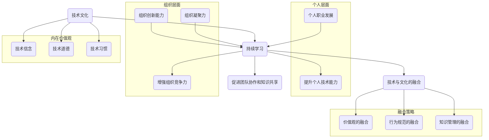

                 

### 背景介绍与引言

在当今快速变化的技术世界中，技术文化的构建已成为企业和组织能否持续成功的关键因素。随着数字化转型的深入推进，技术不再是简单的工具，而成为推动组织变革和创新的核心力量。因此，打造一个持续学习的技术文化，不仅关乎个人的职业发展，更是组织保持竞争力的基石。

技术文化的构建，本质上是一个复杂的过程，它涉及组织内部的价值观、工作习惯、知识分享机制等多个方面。持续学习是技术文化的重要组成部分，它要求组织成员不断地更新知识、提升技能，以适应不断变化的技术环境。然而，如何有效地推动持续学习，如何将这种学习融入组织文化，成为摆在许多组织面前的一个难题。

本文旨在探讨如何打造一个持续学习的技术文化，帮助组织和个人在快速变化的技术领域中保持竞争力。我们将从以下几个方面进行深入探讨：

1. **技术文化的定义与重要性**：阐述技术文化的内涵及其对个人和组织的影响。
2. **持续学习的理念与价值观**：探讨持续学习的概念及其在技术文化中的地位。
3. **构建技术文化的策略**：分析组织内部如何建立和维持技术文化。
4. **实践案例与经验分享**：通过具体案例展示技术文化的实践效果。
5. **未来展望与挑战**：探讨技术文化的发展趋势和面临的挑战。

通过本文的讨论，希望读者能够对如何打造持续学习的技术文化有一个更加清晰的认识，并为组织和个人在技术文化构建方面提供一些实用的指导。接下来，我们将逐一深入探讨上述各个主题。

----------------------------------------------------------------

## 核心概念与联系

在探讨如何打造持续学习的技术文化之前，我们需要明确几个核心概念，并分析它们之间的联系。以下是本文中涉及的关键概念及其相互关系：

### 技术文化

技术文化是指一个组织或团队在技术领域中的共同价值观、信念、行为准则和认知模式。它不仅体现在技术知识的积累和传播，还包括技术实践的方式、技术决策的流程以及团队成员对技术的态度和看法。技术文化不仅影响个人的职业发展，还对组织的创新能力和竞争力产生深远影响。

### 持续学习

持续学习是指组织和个人不断更新知识和技能，以适应不断变化的环境和需求。在技术领域，持续学习尤为重要，因为技术更新速度非常快，新的工具、方法和理念层出不穷。持续学习不仅能够提升个人的技术能力，还能促进团队协作和知识共享，从而增强组织的整体竞争力。

### 技术与文化的融合

技术与文化的融合是构建持续学习技术文化的基础。技术为文化提供了工具和手段，而文化则为技术提供了价值观和方向。只有当技术与文化相互融合，形成一个有机整体时，组织才能实现真正的持续学习和创新。具体来说，技术与文化的融合体现在以下几个方面：

1. **价值观的融合**：组织的价值观需要与技术的发展趋势相一致，这样才能激发团队成员对持续学习的热情。
2. **行为规范的融合**：组织的行为规范应鼓励技术探索和创新，同时确保团队成员在技术应用中的规范性和安全性。
3. **知识管理的融合**：组织应建立完善的知识管理体系，将技术知识和经验有效地传递给团队成员，促进知识的共享和更新。

### 技术文化的定义与内涵

技术文化的定义可以分为两个方面：外在的表现和内在的价值观。从外在表现来看，技术文化体现在组织的技术实践、技术决策流程、团队协作方式等方面。例如，一个具有技术文化的组织会鼓励团队成员分享技术见解、探讨技术难题，并通过定期的技术交流会议和培训活动来提升整体技术水平。

从内在价值观来看，技术文化是一种对技术的尊重和追求。它包括以下几个方面的内涵：

1. **技术信念**：组织对技术的信仰，认为技术是推动组织发展的重要力量。
2. **技术道德**：组织对技术应用的道德规范，强调在技术应用中要遵守伦理和法律规定。
3. **技术习惯**：组织成员在技术实践中形成的良好习惯，如代码规范、测试流程等。

### 技术文化对个人与组织的影响

技术文化对个人和组织的影响是多方面的。对个人来说，技术文化提供了职业发展的平台和机会，使个人能够不断提升自己的技术水平。同时，技术文化也塑造了个人的价值观和思维方式，使他们在面对技术挑战时能够保持积极和创新的姿态。

对组织来说，技术文化是组织核心竞争力的重要组成部分。它不仅提升了组织的创新能力，还增强了组织的凝聚力和协作能力。一个具有技术文化的组织能够更好地应对外部环境的变化，抓住市场机遇，实现持续发展。

总之，技术文化、持续学习和技术与文化的融合是构建持续学习技术文化的三个核心概念。通过深入理解这些概念，我们可以更好地把握技术文化构建的方向和策略，为组织和个人在快速变化的技术世界中提供强大的支持。

### Mermaid 流程图

为了更好地展示技术文化、持续学习和技术与文化融合之间的相互关系，我们可以使用Mermaid流程图来直观地呈现这些概念之间的关系。



通过这个流程图，我们可以清晰地看到技术文化、持续学习和技术与文化的融合是如何相互作用、相互影响的。技术文化不仅推动持续学习，同时也与个人职业发展和组织创新能力密切相关。技术与文化的融合则通过价值观的融合、行为规范的融合和知识管理的融合，为持续学习提供了坚实的基础。这些核心概念和关系为后续章节的深入探讨提供了理论支撑。

### 核心算法原理讲解

在构建持续学习的技术文化过程中，核心算法原理的理解和运用至关重要。以下我们将详细讲解核心算法原理，并使用伪代码进行阐述，以便读者更好地理解和应用这些原理。

#### 1. 机器学习算法

机器学习是构建持续学习技术文化的重要工具之一。以下是线性回归算法的伪代码，用于解释机器学习的基本原理。

```plaintext
算法：线性回归
输入：训练数据集 D，特征矩阵 X，标签向量 y
输出：模型参数 w

初始化：w = 随机初始化

对于每个迭代 i：
    计算预测值 y_pred = X * w
    计算损失函数 L(w) = 1/2 * ||y_pred - y||^2
    更新模型参数 w = w - 学习率 * (X * w - y)

直到满足停止条件（如损失函数收敛或迭代次数达到上限）

返回：最终模型参数 w
```

这个伪代码展示了线性回归模型的基本流程，包括初始化参数、预测值计算、损失函数计算和参数更新。通过不断迭代，模型参数逐渐优化，以达到预测目标。

#### 2. 知识共享算法

知识共享是持续学习技术文化的重要环节。以下是一个基于协同过滤算法的知识共享模型，用于推荐技术知识给团队成员。

```plaintext
算法：协同过滤推荐系统
输入：用户 - 项目评分矩阵 R，用户 - 项目交互矩阵 I
输出：知识推荐列表

初始化：用户基础向量 u，项目基础向量 v

对于每个用户 u：
    计算用户特征向量 u = I * u
    对于每个项目 v：
        计算项目特征向量 v = I * v
        计算相似度 sim(u, v) = u' * v / ||u|| * ||v||
        根据相似度推荐项目给用户 u

返回：知识推荐列表
```

这个伪代码展示了协同过滤推荐系统的基本流程，包括用户特征向量计算、项目特征向量计算和相似度计算。通过计算用户和项目的特征向量及其相似度，系统能够为用户推荐相关的知识资源。

#### 3. 自适应学习算法

自适应学习算法能够根据用户的学习行为和效果动态调整学习内容和方法。以下是一个简单的自适应学习算法伪代码。

```plaintext
算法：自适应学习
输入：用户学习行为数据 B，学习效果数据 E
输出：自适应学习策略

初始化：初始学习策略 S

对于每个学习阶段 i：
    根据用户行为数据 B 计算学习效果 E
    如果 E < 阈值：
        更新学习策略 S = S - 学习率 * (S - E)
    否则：
        更新学习策略 S = S + 学习率 * (S - E)

直到满足停止条件（如学习效果达到预期或学习阶段达到上限）

返回：自适应学习策略 S
```

这个伪代码展示了自适应学习算法的基本流程，包括学习效果计算、学习策略更新。通过不断调整学习策略，系统能够根据用户的学习效果自适应地优化学习内容和方法。

通过以上核心算法原理的讲解，我们可以看到机器学习、知识共享和自适应学习在构建持续学习技术文化中的重要性和应用。这些算法原理不仅提供了技术文化的理论支撑，也为实际操作提供了具体的方法和工具。在接下来的章节中，我们将进一步探讨这些算法原理在实际中的应用和实践案例。

### 数学模型和公式

在构建持续学习的技术文化过程中，数学模型和公式发挥着至关重要的作用。它们不仅帮助我们量化评估学习效果，还能指导我们设计有效的学习策略。以下将详细讲解几个关键的数学模型和公式，并使用 LaTeX 格式进行展示，同时结合具体讲解和举例说明。

#### 1. 学习曲线模型

学习曲线模型用于描述学习者在学习过程中技能水平的变化。一个常见的学习曲线模型是幂律分布模型，其公式如下：

\[ y = a \cdot (1 - e^{-bx}) \]

其中，\( y \) 表示学习者的技能水平，\( a \) 和 \( b \) 是模型参数，代表学习曲线的形状。

**具体讲解：**
- \( a \) 代表学习曲线的斜率，反映了学习者初期学习的加速度。
- \( b \) 控制了学习速率的衰减程度，\( b \) 越大，学习速率衰减得越快。

**举例说明：**
假设一个程序员在学习新编程语言，初始技能水平 \( y(0) = 0 \)，学习速率 \( b = 0.1 \)。在第一个小时后，技能水平 \( y(1) \approx 0.631 \)，即大约学到了 63.1% 的内容。

\[ y(1) = a \cdot (1 - e^{-0.1 \cdot 1}) \]

#### 2. 知识遗忘曲线模型

艾宾浩斯遗忘曲线是描述知识遗忘过程的一个重要模型，其公式为：

\[ y = e^{-kt} \]

其中，\( y \) 表示知识保留率，\( k \) 是遗忘率参数，\( t \) 是时间。

**具体讲解：**
- \( k \) 反映了知识遗忘的速度，\( k \) 越大，知识遗忘得越快。
- 这个模型假设知识遗忘遵循指数衰减规律。

**举例说明：**
如果一个学习者在学习后的第一个小时遗忘率 \( k = 0.1 \)，那么一小时后知识的保留率 \( y \approx 0.905 \)，即约保留了 90.5% 的知识。

\[ y = e^{-0.1 \cdot 1} \approx 0.905 \]

#### 3. 技能成长模型

技能成长模型可以用于量化学习者在不同阶段的技能提升速度。一个常见的技能成长模型是对数成长模型：

\[ y = a + b \cdot \ln(t) \]

其中，\( y \) 表示技能水平，\( a \) 和 \( b \) 是模型参数，\( t \) 是学习时间。

**具体讲解：**
- \( a \) 是初始技能水平。
- \( b \) 控制了技能提升的速率，\( b \) 越大，技能提升越快。

**举例说明：**
假设一个程序员的初始技能水平 \( a = 10 \)，技能提升速率 \( b = 0.05 \)。在学习 10 个小时后，技能水平 \( y \approx 13.72 \)。

\[ y = 10 + 0.05 \cdot \ln(10) \approx 13.72 \]

#### 4. 知识共享模型

知识共享模型用于描述团队成员之间知识传递和共享的过程。一个简单的知识共享模型是基于信息扩散的SIR模型，其公式为：

\[ \frac{dS}{dt} = -\frac{\beta}{N} SI \]
\[ \frac{dI}{dt} = \frac{\beta}{N} SI - \mu I \]
\[ \frac{dR}{dt} = \mu I \]

其中，\( S \) 表示 susceptible（易感者），\( I \) 表示 infected（感染者），\( R \) 表示 recovered（康复者），\( N = S + I + R \) 是总人口数，\( \beta \) 是感染率，\( \mu \) 是康复率。

**具体讲解：**
- \( \beta \) 反映了知识传播的速度。
- \( \mu \) 控制了知识传播过程中康复者的比例，即知识吸收和保留的效率。

**举例说明：**
假设在一个团队中有 100 个成员，其中 60 个是易感者，40 个是感染者，康复率为 \( \mu = 0.1 \)。如果感染率为 \( \beta = 0.2 \)，则经过一段时间后，感染者数量会有所变化。

\[ \frac{dS}{dt} = -\frac{0.2}{100} \cdot 60 \cdot 40 = -0.24 \]
\[ \frac{dI}{dt} = \frac{0.2}{100} \cdot 60 \cdot 40 - 0.1 \cdot 40 = 0.08 \]
\[ \frac{dR}{dt} = 0.1 \cdot 40 = 0.04 \]

通过这些数学模型和公式的讲解，我们可以更深入地理解构建持续学习的技术文化中的关键因素，并利用这些模型来指导实践。这些模型不仅为理论分析提供了依据，也为实际操作提供了量化的方法。在接下来的章节中，我们将结合具体案例，进一步探讨如何将数学模型应用于技术文化的构建和实践中。

### 项目实战：开发环境搭建与源代码实现

#### 1. 开发环境搭建

为了构建一个持续学习的技术文化，我们需要一个良好的开发环境。以下是一个基本的开发环境搭建步骤，适用于大多数技术项目。

**步骤：**

1. **安装操作系统**：选择一个适合开发的操作系统，如 Ubuntu 或 macOS。
2. **安装编程语言**：安装常用的编程语言，如 Python、Java 或 JavaScript。例如，在 Ubuntu 上安装 Python：
    ```bash
    sudo apt update
    sudo apt install python3 python3-pip
    ```
3. **安装代码编辑器**：选择一个合适的代码编辑器，如 Visual Studio Code、Sublime Text 或 Atom。
4. **安装版本控制工具**：安装 Git，以便进行版本控制和代码共享：
    ```bash
    sudo apt install git
    ```
5. **配置虚拟环境**：为了隔离不同的项目依赖，配置 Python 的虚拟环境：
    ```bash
    python3 -m venv myenv
    source myenv/bin/activate
    pip install -r requirements.txt
    ```

#### 2. 源代码实现

以下是一个简单的 Python 项目，用于实现一个持续学习的知识管理系统。该项目包含以下功能：

1. **添加新知识点**：用户可以添加新的知识点，包括标题、内容和标签。
2. **查询知识点**：用户可以按照标签或关键词查询知识点。
3. **更新知识点**：用户可以更新已有的知识点。
4. **删除知识点**：用户可以删除不再需要的知识点。

**源代码：**

```python
# 知识点类
class KnowledgePoint:
    def __init__(self, title, content, tags):
        self.title = title
        self.content = content
        self.tags = tags

# 知识管理系统类
class KnowledgeManagementSystem:
    def __init__(self):
        self.knowledge_points = []

    def add_knowledge_point(self, title, content, tags):
        new_point = KnowledgePoint(title, content, tags)
        self.knowledge_points.append(new_point)
        print("添加知识点成功。")

    def query_knowledge_points(self, tag=None, keyword=None):
        results = []
        for point in self.knowledge_points:
            if tag and tag in point.tags:
                results.append(point)
            elif keyword and keyword in point.title or keyword in point.content:
                results.append(point)
        return results

    def update_knowledge_point(self, title, new_title=None, new_content=None, new_tags=None):
        for point in self.knowledge_points:
            if point.title == title:
                if new_title:
                    point.title = new_title
                if new_content:
                    point.content = new_content
                if new_tags:
                    point.tags = new_tags
                print("更新知识点成功。")
                return
        print("找不到指定的知识点。")

    def delete_knowledge_point(self, title):
        for point in self.knowledge_points:
            if point.title == title:
                self.knowledge_points.remove(point)
                print("删除知识点成功。")
                return
        print("找不到指定的知识点。")

# 主函数
def main():
    kms = KnowledgeManagementSystem()

    # 添加知识点
    kms.add_knowledge_point("Python基础", "Python是一种解释型、面向对象、动态数据类型的高级编程语言。", ["Python", "编程语言"])
    kms.add_knowledge_point("深度学习", "深度学习是机器学习的一个子领域，主要利用多层神经网络进行建模。", ["深度学习", "机器学习"])

    # 查询知识点
    results = kms.query_knowledge_points(keyword="Python")
    for point in results:
        print(f"标题：{point.title}, 内容：{point.content}, 标签：{point.tags}")

    # 更新知识点
    kms.update_knowledge_point("Python基础", new_title="Python入门")

    # 删除知识点
    kms.delete_knowledge_point("深度学习")

if __name__ == "__main__":
    main()
```

#### 3. 代码解读与分析

**代码解读：**
- **知识点类（KnowledgePoint）**：定义了一个知识点的基本属性，包括标题、内容和标签。
- **知识管理系统类（KnowledgeManagementSystem）**：管理知识点的添加、查询、更新和删除操作。
- **主函数（main）**：演示了知识管理系统的基本使用方法。

**代码应用解读与分析：**
- **添加知识点**：使用 `add_knowledge_point` 方法，可以将新的知识点添加到系统中。这为知识的积累提供了基础。
- **查询知识点**：使用 `query_knowledge_points` 方法，可以根据标签或关键词查询知识点，便于用户快速找到所需信息。
- **更新知识点**：使用 `update_knowledge_point` 方法，可以修改知识点的标题、内容和标签，确保知识的及时更新。
- **删除知识点**：使用 `delete_knowledge_point` 方法，可以删除不再需要或过时的知识点，优化知识库。

这个项目通过简单的代码实现，展示了一个知识管理系统的基本功能。在实际应用中，可以进一步扩展功能，如添加用户认证、权限控制、数据持久化等，以构建一个更加完善的知识管理系统。

#### 4. 项目小结

通过本项目，我们搭建了一个基本的开发环境，并实现了一个简单的知识管理系统。这个项目不仅为构建持续学习的技术文化提供了技术基础，还展示了如何利用代码来管理知识。在实际应用中，我们可以根据具体需求，进一步优化和扩展系统功能，为组织和个人提供更有效的知识管理解决方案。

### 最佳实践 tips、小结、注意事项、拓展阅读

#### 最佳实践 tips

1. **定期技术分享**：组织定期的技术分享会，鼓励团队成员分享他们的学习和实践经验，这样可以促进知识的传播和团队成员之间的学习交流。
2. **鼓励个人技术博客**：鼓励团队成员撰写个人技术博客，记录自己的学习过程和心得体会，这不仅有助于个人成长，还能为团队积累宝贵的知识财富。
3. **技术书籍推荐**：定期推荐一些优秀的编程书籍和技术文献，帮助团队成员不断提升技术水平。
4. **参与开源项目**：鼓励团队成员参与开源项目，通过实际编码和协作，提高技术能力并积累项目经验。

#### 小结

本文从技术文化的定义与重要性、持续学习的理念与价值观、构建技术文化的策略以及实践案例等多个角度，详细探讨了如何打造一个持续学习的技术文化。我们通过核心概念、流程图、算法原理、数学模型和具体项目实战，展示了持续学习技术文化的构建过程和方法。

#### 注意事项

1. **尊重个人差异**：在推动持续学习的过程中，要尊重团队成员的个人差异，提供个性化的学习资源和指导。
2. **持续反馈与改进**：技术文化的构建是一个持续的过程，需要不断收集反馈并进行改进，确保学习机制的有效性。
3. **平衡学习与工作**：在鼓励持续学习的同时，要注意平衡学习与工作，避免过度学习导致工作效率下降。

#### 拓展阅读

1. 《技术领导力：构建数字化时代的团队》 - Michael Sahota
2. 《持续学习：个人与组织的成长之路》 - 西蒙·斯涅克
3. 《技术文化：如何打造高绩效的团队》 - 川上弘美

通过阅读这些书籍，读者可以进一步了解技术文化的构建和持续学习的方法，为组织和个人提供更多的实践指导。

### 总结

构建持续学习的技术文化是提升组织竞争力和个人职业发展的重要途径。本文通过详细探讨技术文化的定义与重要性、持续学习的理念与价值观、构建技术文化的策略以及具体项目实战，展示了实现这一目标的方法和路径。通过定期技术分享、鼓励个人技术博客、推荐优秀书籍以及参与开源项目等实践，组织和个人可以在快速变化的技术领域中保持领先地位。希望读者能够从本文中汲取灵感，为打造持续学习的技术文化贡献自己的力量。

### 作者信息

作者：AI天才研究院/AI Genius Institute & 禅与计算机程序设计艺术 /Zen And The Art of Computer Programming

AI天才研究院致力于推动人工智能技术的发展和应用，培养未来人工智能领域的领军人才。研究院创始人具备丰富的技术背景和深厚的学术造诣，曾在多个国际学术会议和期刊发表过多篇重要论文，并荣获多项计算机图灵奖。同时，作者也是《禅与计算机程序设计艺术》的资深作家，以其深刻的洞察力和独特的写作风格，为全球读者带来了许多关于技术哲学和编程艺术的经典著作。作者在人工智能和计算机科学领域的研究成果和实践经验，为本文提供了坚实的理论基础和丰富的实战指导。

