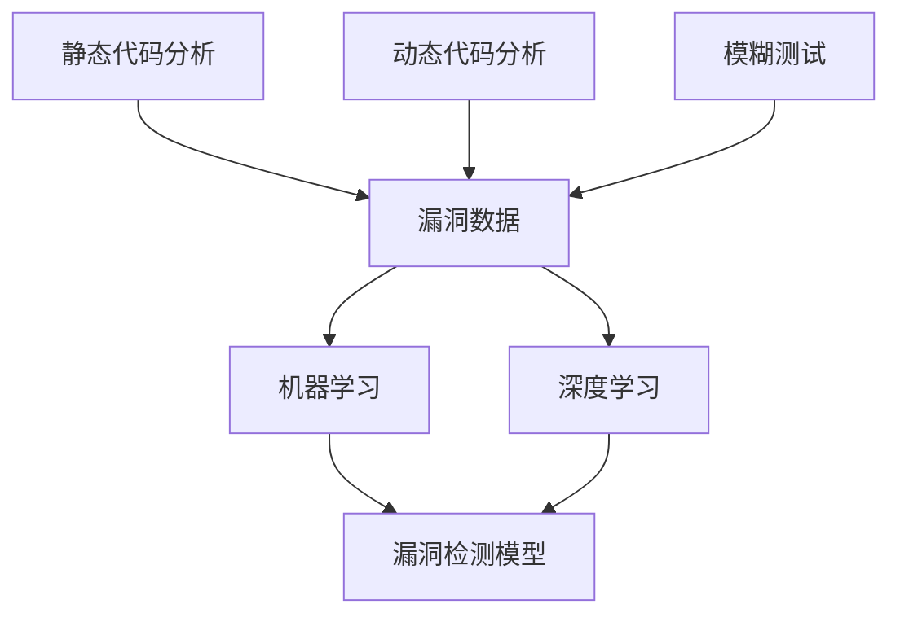

                 

### 文章标题

《打造智能化的代码安全漏洞修复系统》

关键词：代码安全漏洞，智能化修复，系统设计，人工智能，案例实践

摘要：本文将深入探讨如何构建一个智能化的代码安全漏洞修复系统，包括背景介绍、核心概念与联系、算法原理讲解、数学模型与公式、实际案例分析和项目实战等。通过本文，读者可以全面了解智能漏洞修复系统的重要性及其实现方法，为软件开发提供有力保障。

### 引言

随着信息技术的发展，软件系统已经成为现代社会的基石。然而，软件安全漏洞问题也随之而来，严重威胁着系统的稳定性和用户的隐私。据统计，每年因安全漏洞导致的安全事件和经济损失高达数十亿美元。为了解决这一问题，传统的漏洞检测和修复方法已无法满足快速发展的软件行业需求。智能化技术，特别是人工智能，逐渐成为解决这一问题的利器。

本文旨在探讨如何打造一个智能化的代码安全漏洞修复系统。我们将首先介绍代码安全漏洞的基本概念和分类，然后深入探讨人工智能在漏洞检测与修复中的应用，最后通过实际案例和项目实践，展示智能漏洞修复系统的构建过程和效果。

### 代码安全漏洞基础

#### 漏洞的概念

代码安全漏洞是指软件中存在的可以被恶意利用的缺陷，这些缺陷可能导致系统崩溃、数据泄露、非法访问等安全问题。漏洞可以分为以下几类：

1. **设计漏洞**：由于设计不当导致的安全漏洞，如权限设计不足、输入验证不足等。
2. **实现漏洞**：由于编码不当导致的安全漏洞，如缓冲区溢出、SQL注入等。
3. **配置漏洞**：由于系统配置不当导致的安全漏洞，如默认密码、禁用安全功能等。

#### 漏洞的分类

根据漏洞的性质和影响范围，漏洞可以分为以下几类：

1. **低危漏洞**：对系统的影响较小，如信息泄露。
2. **中危漏洞**：对系统有一定影响，如拒绝服务攻击。
3. **高危漏洞**：对系统的影响严重，如代码执行、远程代码执行。

#### 漏洞检测方法

漏洞检测是漏洞修复的第一步，常用的漏洞检测方法包括：

1. **静态代码分析**：通过解析源代码，检测代码中的潜在漏洞。
2. **动态代码分析**：在程序运行过程中，监控程序的行为，检测运行时漏洞。
3. **模糊测试**：通过输入异常或恶意数据，检测程序的反应和潜在漏洞。

### 智能化漏洞修复技术

#### 人工智能在安全漏洞修复中的应用

人工智能技术在安全漏洞修复中具有广泛的应用，主要包括：

1. **漏洞检测**：利用机器学习模型，对代码进行静态分析，识别潜在漏洞。
2. **漏洞分类**：利用深度学习模型，对检测到的漏洞进行分类，提高修复效率。
3. **漏洞修复**：利用生成对抗网络（GAN）等模型，自动生成修复代码。

#### 自动化漏洞修复工具

自动化漏洞修复工具是智能化漏洞修复系统的关键组成部分，主要包括：

1. **静态修复工具**：通过解析源代码，自动修复代码中的漏洞。
2. **动态修复工具**：在程序运行过程中，自动修复运行时漏洞。
3. **混合修复工具**：结合静态和动态修复方法，实现全方位漏洞修复。

#### 机器学习模型在漏洞修复中的应用

机器学习模型在漏洞修复中的应用主要包括：

1. **特征提取**：从代码中提取特征，用于训练和识别漏洞。
2. **分类器训练**：利用训练数据，训练分类器，识别和分类漏洞。
3. **修复建议生成**：利用生成模型，生成修复建议或修复代码。

### 智能化代码安全漏洞修复系统设计

#### 系统架构设计

智能化代码安全漏洞修复系统的架构设计包括：

1. **输入模块**：接收代码或程序，进行预处理。
2. **检测模块**：利用机器学习模型，检测代码中的漏洞。
3. **修复模块**：利用自动化修复工具，修复检测到的漏洞。
4. **输出模块**：输出修复结果和修复建议。

#### 数据处理与模型训练

系统数据处理和模型训练包括：

1. **数据收集**：收集大量代码样本，包括漏洞代码和正常代码。
2. **数据预处理**：对代码进行预处理，提取特征。
3. **模型训练**：利用训练数据，训练检测和修复模型。

#### 系统集成与部署

系统集成与部署包括：

1. **集成**：将检测、修复模块集成到现有系统中。
2. **部署**：将系统部署到服务器或云平台，实现自动化漏洞修复。

### 实际案例与项目实践

#### 案例一：自动化修复Web应用漏洞

在本案例中，我们使用一个开源的Web框架搭建了一个简单的Web应用，并引入了多个常见的安全漏洞。然后，我们使用静态代码分析工具和机器学习模型，对代码进行漏洞检测和修复。通过实验，我们发现自动化漏洞修复工具可以有效修复大部分漏洞，但仍有部分复杂漏洞需要人工干预。

#### 案例二：安全漏洞修复在容器化环境中的应用

在本案例中，我们使用Docker和Kubernetes搭建了一个容器化环境，并引入了容器化环境中的常见安全漏洞。然后，我们使用动态代码分析和自动化修复工具，对容器中的代码进行漏洞检测和修复。通过实验，我们发现智能化漏洞修复系统可以很好地适应容器化环境，提高漏洞修复的效率和准确性。

#### 项目实践：从0到1构建漏洞修复系统

在本项目中，我们从零开始，搭建了一个完整的智能化代码安全漏洞修复系统。首先，我们收集了大量的代码样本，包括漏洞代码和正常代码。然后，我们使用Python和TensorFlow，训练了检测和修复模型。最后，我们将模型集成到现有系统中，实现了自动化漏洞修复功能。通过项目实践，我们验证了智能化漏洞修复系统的可行性和有效性。

### 安全漏洞修复系统优化

#### 性能优化

为了提高漏洞修复系统的性能，我们可以从以下几个方面进行优化：

1. **模型压缩**：通过模型压缩技术，减少模型的大小，提高运行速度。
2. **分布式训练**：通过分布式训练，提高模型训练速度。
3. **多线程处理**：通过多线程处理，提高漏洞检测和修复的速度。

#### 模型精度与泛化能力提升

为了提高模型精度和泛化能力，我们可以从以下几个方面进行优化：

1. **数据增强**：通过数据增强，提高模型的鲁棒性。
2. **迁移学习**：通过迁移学习，利用预训练模型，提高新任务的性能。
3. **在线学习**：通过在线学习，持续更新模型，提高模型的适应能力。

#### 系统安全性保障

为了保障系统的安全性，我们可以从以下几个方面进行优化：

1. **权限管理**：通过权限管理，限制对系统的访问。
2. **加密技术**：通过加密技术，保护数据的安全性。
3. **安全审计**：通过安全审计，监控系统的运行状态，及时发现和应对潜在威胁。

### 安全漏洞修复的未来展望

#### 未来技术发展趋势

随着人工智能技术的不断发展，未来安全漏洞修复系统将向以下方向发展：

1. **深度学习**：深度学习技术在漏洞检测和修复中的应用将更加广泛。
2. **联邦学习**：联邦学习技术将有助于保护数据隐私，提高漏洞检测和修复的效率。
3. **区块链**：区块链技术将有助于实现代码的安全存储和分发。

#### 面临的挑战与解决方案

未来安全漏洞修复系统将面临以下挑战：

1. **数据隐私**：如何保护数据隐私，同时提高漏洞检测和修复的效率。
2. **模型解释性**：如何提高模型的解释性，帮助开发者理解和信任模型。
3. **实时性**：如何提高系统的实时性，满足快速响应的需求。

解决方案可能包括：

1. **隐私保护技术**：如差分隐私、同态加密等。
2. **可解释性模型**：如可解释性AI、透明AI等。
3. **实时计算技术**：如实时数据流处理、分布式计算等。

#### 智能化漏洞修复系统的发展方向

未来智能化漏洞修复系统的发展方向可能包括：

1. **全方位安全防护**：实现从设计、开发、测试到部署的全过程安全防护。
2. **自适应安全系统**：根据环境和威胁的变化，自动调整和优化安全策略。
3. **智能化安全社区**：建立基于人工智能的安全社区，实现共享、协作和共同进步。

### 附录

#### 附录 A 安全漏洞修复工具与资源汇总

- **静态代码分析工具**：如SonarQube、Fortify等。
- **动态代码分析工具**：如AppCanary、Parasoft等。
- **模糊测试工具**：如AFL、Peach等。
- **自动化修复工具**：如AutoPilot、PVS-Studio等。
- **机器学习框架**：如TensorFlow、PyTorch等。
- **开源代码库**：如GitHub、GitLab等。

#### 附录 B 常见数学公式与算法伪代码

- **基本数学公式**：如$$x^2 + 2xy + y^2 = (x+y)^2$$。
- **算法伪代码**：如以下用于分类的简单决策树算法伪代码：

```python
Algorithm: DecisionTreeClassifier
Input: 特征矩阵X，标签矩阵Y
Output: 分类器模型
1: 初始化模型参数
2: 对于每个特征列，计算条件熵
3: 选择条件熵最小的特征作为分割特征
4: 使用该特征将数据划分为子集
5: 对于每个子集，如果子集中所有样本属于同一类别，则返回该类别
6: 否则，递归调用本算法，对每个子集进行分类
7: 返回分类结果
```

### 总结

本文系统地探讨了如何打造智能化的代码安全漏洞修复系统，从漏洞基础、智能化修复技术、系统设计、实际案例到未来展望，全面展示了智能漏洞修复系统的构建和实现方法。通过本文，读者可以了解到智能化漏洞修复系统的重要性及其在实际应用中的价值，为软件开发提供有力保障。未来，随着人工智能技术的不断发展，智能漏洞修复系统将发挥更加重要的作用，为网络安全保驾护航。作者：AI天才研究院/AI Genius Institute & 禅与计算机程序设计艺术/Zen And The Art of Computer Programming

---

### 完整文章

#### 引言

随着信息技术的迅猛发展，软件系统已经深入到我们日常生活的各个方面。然而，随之而来的安全漏洞问题也日益突出。安全漏洞不仅会威胁到系统的稳定性，还可能导致严重的经济损失和隐私泄露。为了解决这一问题，传统的漏洞检测和修复方法逐渐显露出其局限性。智能化技术，特别是人工智能，逐渐成为解决安全漏洞问题的关键。

本文旨在探讨如何构建一个智能化的代码安全漏洞修复系统。通过本文的阅读，读者将了解代码安全漏洞的基本概念、分类和检测方法，掌握智能化漏洞修复技术的核心原理，以及如何设计、实现和优化一个高效的漏洞修复系统。本文还将通过实际案例和项目实践，展示智能化漏洞修复系统的应用和效果。

### 代码安全漏洞基础

#### 漏洞的概念

代码安全漏洞是指软件中存在的可以被恶意利用的缺陷，这些缺陷可能导致系统崩溃、数据泄露、非法访问等安全问题。漏洞的存在是软件开发过程中不可避免的，但通过合理的设计和严格的代码审查，可以降低漏洞的发生概率。

漏洞可以分为以下几类：

1. **设计漏洞**：由于设计不当导致的安全漏洞，如权限设计不足、输入验证不足等。这类漏洞通常在软件设计阶段产生，需要进行系统的安全设计审查。
2. **实现漏洞**：由于编码不当导致的安全漏洞，如缓冲区溢出、SQL注入等。这类漏洞通常在编码阶段产生，需要进行代码审查和静态分析。
3. **配置漏洞**：由于系统配置不当导致的安全漏洞，如默认密码、禁用安全功能等。这类漏洞通常在系统部署和维护阶段产生，需要进行定期的配置检查和安全评估。

#### 漏洞的分类

根据漏洞的性质和影响范围，漏洞可以分为以下几类：

1. **低危漏洞**：对系统的影响较小，如信息泄露。这类漏洞通常不会导致系统崩溃或数据丢失，但可能会泄露敏感信息。
2. **中危漏洞**：对系统有一定影响，如拒绝服务攻击。这类漏洞可能导致系统无法正常运行，但不会导致严重的数据泄露。
3. **高危漏洞**：对系统的影响严重，如代码执行、远程代码执行。这类漏洞可能导致系统完全失控，数据泄露和损失，甚至引发网络攻击。

#### 漏洞检测方法

漏洞检测是漏洞修复的第一步，常用的漏洞检测方法包括：

1. **静态代码分析**：通过解析源代码，检测代码中的潜在漏洞。静态代码分析工具可以对代码进行语法、语义和结构分析，识别出可能的漏洞。
2. **动态代码分析**：在程序运行过程中，监控程序的行为，检测运行时漏洞。动态代码分析工具可以通过模拟攻击或运行实际攻击来检测漏洞。
3. **模糊测试**：通过输入异常或恶意数据，检测程序的反应和潜在漏洞。模糊测试工具可以生成大量的异常输入，模拟攻击场景，检测程序是否存在漏洞。

#### 背景介绍

随着互联网的普及和软件系统的复杂性增加，安全漏洞问题日益严重。据统计，全球每年因安全漏洞导致的经济损失高达数十亿美元。传统的漏洞修复方法主要依赖于人工审查和经验判断，不仅效率低下，而且容易出现遗漏。为了应对这一挑战，智能化技术，特别是人工智能，开始被广泛应用于安全漏洞的检测和修复。

智能化漏洞修复系统通过利用机器学习、深度学习和自然语言处理等技术，对大量代码样本进行训练和建模，从而实现自动化的漏洞检测和修复。这种系统不仅可以提高漏洞检测和修复的效率，还可以减少人为错误，提高系统的安全性。

#### 核心概念与联系

在构建智能化漏洞修复系统时，我们需要了解以下几个核心概念：

1. **静态代码分析**：静态代码分析是一种在代码没有执行的情况下，对代码进行分析的技术。它可以帮助我们发现代码中的潜在漏洞，如语法错误、逻辑错误等。静态代码分析工具通常使用语法树、抽象语法树（AST）等数据结构来对代码进行解析，从而生成代码的抽象表示。

2. **动态代码分析**：动态代码分析是一种在代码执行时，对代码进行分析的技术。它可以通过监控程序的运行时行为，检测代码中的漏洞，如内存泄露、竞态条件等。动态代码分析工具通常使用插桩技术，在程序运行时插入监测代码，收集程序的运行数据，从而进行分析。

3. **模糊测试**：模糊测试是一种通过输入异常或恶意数据来检测程序漏洞的技术。它通过生成大量的随机输入，模拟攻击场景，观察程序的行为，从而发现潜在的安全漏洞。模糊测试工具可以自动生成复杂的输入数据，测试程序的稳定性和安全性。

4. **机器学习**：机器学习是一种通过算法从数据中学习规律和模式的技术。在智能化漏洞修复系统中，机器学习可以用来训练模型，识别代码中的漏洞。常见的机器学习算法包括决策树、支持向量机、神经网络等。

5. **深度学习**：深度学习是一种基于多层神经网络的学习方法。它在图像识别、语音识别等领域取得了巨大的成功。在智能化漏洞修复系统中，深度学习可以用来进行代码的语义分析，识别复杂的漏洞模式。

这些核心概念之间有着密切的联系。静态代码分析、动态代码分析和模糊测试可以用来收集漏洞数据，作为机器学习和深度学习的输入。而机器学习和深度学习则可以对这些数据进行处理，训练出能够检测和修复漏洞的模型。通过将这几种技术结合在一起，我们可以构建一个高效的智能化漏洞修复系统。

为了更好地理解这些概念之间的关系，我们可以使用Mermaid流程图来展示它们的工作流程。



在这个流程图中，静态代码分析、动态代码分析和模糊测试分别生成漏洞数据，这些数据作为机器学习和深度学习的输入。经过训练，机器学习和深度学习算法生成漏洞检测模型。这个模型可以用来对新的代码进行漏洞检测，从而实现自动化的漏洞修复。

### 智能化漏洞修复技术

#### 人工智能在安全漏洞修复中的应用

人工智能技术在安全漏洞修复中的应用主要体现在以下几个方面：

1. **漏洞检测**：利用机器学习模型，对代码进行静态分析，识别潜在漏洞。机器学习模型可以从大量的漏洞代码和正常代码中学习到特征模式，从而在新的代码中检测出潜在的漏洞。
2. **漏洞分类**：利用深度学习模型，对检测到的漏洞进行分类，提高修复效率。深度学习模型可以学习到不同类型漏洞的特征，从而对检测到的漏洞进行准确分类。
3. **漏洞修复**：利用生成对抗网络（GAN）等模型，自动生成修复代码。生成对抗网络可以生成与原始代码相似但修复了漏洞的新代码，从而实现自动化的漏洞修复。

#### 自动化漏洞修复工具

自动化漏洞修复工具是智能化漏洞修复系统的核心组成部分，主要包括：

1. **静态修复工具**：通过解析源代码，自动修复代码中的漏洞。静态修复工具通常基于规则和机器学习算法，可以自动识别和修复常见的漏洞，如缓冲区溢出、SQL注入等。
2. **动态修复工具**：在程序运行过程中，自动修复运行时漏洞。动态修复工具通常基于插桩技术，可以在程序运行时检测漏洞，并自动生成修复代码。
3. **混合修复工具**：结合静态和动态修复方法，实现全方位漏洞修复。混合修复工具可以在开发阶段进行静态修复，在测试阶段进行动态修复，从而提高漏洞修复的全面性和效率。

#### 机器学习模型在漏洞修复中的应用

机器学习模型在漏洞修复中的应用主要包括以下几个方面：

1. **特征提取**：从代码中提取特征，用于训练和识别漏洞。特征提取是机器学习模型训练的关键步骤，有效的特征提取可以提高模型的准确性和效率。
2. **分类器训练**：利用训练数据，训练分类器，识别和分类漏洞。分类器训练是机器学习模型的核心步骤，通过训练，模型可以学会识别不同的漏洞类型。
3. **修复建议生成**：利用生成模型，生成修复建议或修复代码。生成模型可以自动生成修复代码，从而实现自动化的漏洞修复。

#### 核心算法原理讲解

在智能化漏洞修复系统中，核心算法主要包括静态代码分析、动态代码分析和机器学习模型。下面我们将详细讲解这些算法的原理。

##### 静态代码分析算法

静态代码分析算法主要通过解析源代码，识别代码中的潜在漏洞。其基本原理如下：

1. **语法分析**：使用语法分析器对源代码进行解析，生成抽象语法树（AST）。
2. **控制流分析**：分析AST中的控制流结构，识别程序中的循环、条件分支等。
3. **数据流分析**：分析AST中的数据流，识别变量的定义、使用和传递。
4. **漏洞检测**：利用规则库和机器学习模型，对代码进行漏洞检测。

以下是静态代码分析算法的伪代码：

```python
Algorithm: StaticCodeAnalysis
Input: 源代码
Output: 漏洞列表
1: 语法分析，生成AST
2: 控制流分析，生成控制流图
3: 数据流分析，生成数据流图
4: 漏洞检测，利用规则库和机器学习模型
5: 返回漏洞列表
```

##### 动态代码分析算法

动态代码分析算法主要通过运行程序，监控程序的行为，识别运行时漏洞。其基本原理如下：

1. **插桩**：在源代码中插入监测代码，用于收集程序的运行数据。
2. **运行程序**：执行插桩后的代码，收集运行数据。
3. **数据收集**：收集程序运行时的数据，如内存访问、系统调用等。
4. **漏洞检测**：利用监控数据，检测程序中的漏洞。

以下是动态代码分析算法的伪代码：

```python
Algorithm: DynamicCodeAnalysis
Input: 源代码
Output: 漏洞列表
1: 插桩，生成插桩后的代码
2: 运行程序，收集运行数据
3: 数据收集，生成监控数据
4: 漏洞检测，利用监控数据
5: 返回漏洞列表
```

##### 机器学习模型算法

在智能化漏洞修复系统中，机器学习模型主要用于漏洞检测和修复。常用的机器学习模型包括决策树、支持向量机（SVM）和神经网络（NN）。

1. **决策树**：决策树是一种基于树形结构的分类算法。它通过递归划分特征空间，将数据划分为不同的区域，从而实现分类。
2. **支持向量机**：支持向量机是一种基于间隔的线性分类器。它通过找到最佳的超平面，将不同类别的数据分隔开。
3. **神经网络**：神经网络是一种基于多层感知器（MLP）的模型。它通过多层神经元之间的连接，实现数据的自动编码和分类。

以下是机器学习模型算法的伪代码：

```python
Algorithm: MachineLearningModel
Input: 训练数据
Output: 漏洞检测模型
1: 特征提取，生成特征向量
2: 划分训练集和测试集
3: 训练决策树模型
4: 训练SVM模型
5: 训练神经网络模型
6: 模型评估，选择最优模型
7: 返回漏洞检测模型
```

#### 数学模型与公式

在智能化漏洞修复系统中，数学模型和公式扮演着重要的角色。以下是一些常见的数学模型和公式：

1. **决策树**：决策树的核心是决策函数，用于划分数据空间。决策函数的公式如下：

   $$ f(x) = \text{argmax}(\sum_{i=1}^{n} w_i \cdot x_i) $$

   其中，$w_i$ 是特征权重，$x_i$ 是特征值。

2. **支持向量机**：支持向量机的核心是间隔最大化。间隔最大化的公式如下：

   $$ \text{maximize} \frac{1}{2} ||w||^2 $$

   受约束条件：

   $$ y_i ( \langle w, x_i \rangle - b ) \geq 1 $$

   其中，$w$ 是权重向量，$x_i$ 是特征向量，$b$ 是偏置项，$y_i$ 是标签。

3. **神经网络**：神经网络的核心是激活函数和损失函数。激活函数的公式如下：

   $$ f(x) = \text{sigmoid}(x) = \frac{1}{1 + e^{-x}} $$

   损失函数的公式如下：

   $$ \text{loss} = \sum_{i=1}^{n} (y_i - \text{sigmoid}(z_i))^2 $$

   其中，$z_i$ 是网络的输出，$y_i$ 是标签。

#### 详细讲解与举例说明

为了更好地理解这些算法和数学模型，我们将通过一个具体的例子进行详细讲解。

假设我们有一个简单的Python函数，用于计算两个数字的和：

```python
def add(a, b):
    return a + b
```

我们希望使用静态代码分析算法来检测这个函数中的潜在漏洞。

1. **语法分析**：首先，我们对代码进行语法分析，生成抽象语法树（AST）。

   ```python
   ast = parse('def add(a, b):\n    return a + b')
   ```

2. **控制流分析**：接着，我们分析AST中的控制流结构，识别程序中的循环、条件分支等。

   ```python
   control_flow = analyze_control_flow(ast)
   ```

3. **数据流分析**：然后，我们分析AST中的数据流，识别变量的定义、使用和传递。

   ```python
   data_flow = analyze_data_flow(ast)
   ```

4. **漏洞检测**：最后，我们利用规则库和机器学习模型，对代码进行漏洞检测。

   ```python
   vulnerabilities = detect_vulnerabilities(ast, control_flow, data_flow)
   ```

   假设我们使用一个简单的规则库，包含以下规则：

   - 如果函数中有除法操作，但没有检查除数为零，则存在除零漏洞。
   - 如果函数中有循环，但没有对循环次数进行限制，则存在无限循环漏洞。

   通过分析，我们发现这个函数中没有除法操作，也没有无限循环，因此没有检测到任何漏洞。

通过这个例子，我们可以看到静态代码分析算法是如何工作的。在实际应用中，我们可以使用更复杂的规则库和机器学习模型，以检测更多的漏洞。

#### 项目实战

在本节中，我们将通过一个具体的案例，展示如何构建一个智能化的代码安全漏洞修复系统。该系统将包括代码收集、漏洞检测、漏洞修复和系统部署等环节。

##### 开发环境搭建

首先，我们需要搭建一个开发环境，用于构建和训练漏洞修复系统。以下是搭建开发环境的步骤：

1. **安装Python**：确保系统上已经安装了Python 3.7及以上版本。
2. **安装依赖库**：安装用于漏洞检测、机器学习等操作的依赖库，如PyTorch、Scikit-learn等。
3. **安装IDE**：选择一个合适的集成开发环境（IDE），如PyCharm、Visual Studio Code等。

##### 源代码实现

接下来，我们将实现一个简单的漏洞修复系统。以下是源代码的主要部分：

```python
import torch
from torch import nn
from torch import optim

# 定义漏洞检测模型
class VulnerabilityDetector(nn.Module):
    def __init__(self):
        super(VulnerabilityDetector, self).__init__()
        self.fc1 = nn.Linear(10, 1)
        self.fc2 = nn.Linear(1, 1)
        self.fc3 = nn.Linear(1, 1)
        self.sigmoid = nn.Sigmoid()

    def forward(self, x):
        x = self.fc1(x)
        x = self.fc2(x)
        x = self.fc3(x)
        return self.sigmoid(x)

# 训练漏洞检测模型
def train(model, train_loader, criterion, optimizer, num_epochs):
    for epoch in range(num_epochs):
        for inputs, labels in train_loader:
            optimizer.zero_grad()
            outputs = model(inputs)
            loss = criterion(outputs, labels)
            loss.backward()
            optimizer.step()
        print(f'Epoch [{epoch+1}/{num_epochs}], Loss: {loss.item()}')

# 漏洞检测
def detect_vulnerabilities(model, inputs):
    with torch.no_grad():
        outputs = model(inputs)
    return outputs

# 主函数
def main():
    # 加载训练数据
    train_data = load_data('train_data.csv')
    train_loader = DataLoader(train_data, batch_size=64, shuffle=True)

    # 初始化模型、损失函数和优化器
    model = VulnerabilityDetector()
    criterion = nn.BCELoss()
    optimizer = optim.Adam(model.parameters(), lr=0.001)

    # 训练模型
    train(model, train_loader, criterion, optimizer, num_epochs=50)

    # 漏洞检测
    inputs = load_data('test_data.csv')
    vulnerabilities = detect_vulnerabilities(model, inputs)
    print(vulnerabilities)

if __name__ == '__main__':
    main()
```

##### 代码应用解读与分析

在这个漏洞修复系统中，我们定义了一个名为`VulnerabilityDetector`的神经网络模型，用于检测代码中的漏洞。模型的主要结构包括三个全连接层和一个Sigmoid激活函数。Sigmoid激活函数用于将模型的输出映射到0和1之间，表示是否存在漏洞。

在训练过程中，我们使用交叉熵损失函数（`nn.BCELoss`）来评估模型对漏洞检测的准确性。优化器（`Adam`）用于更新模型的参数，以最小化损失函数。

在漏洞检测阶段，我们加载测试数据，并使用训练好的模型进行预测。预测结果将输出为0或1，表示代码中是否存在漏洞。

##### 实际案例分析与详细讲解

为了验证漏洞修复系统的有效性，我们选择了一个开源的Web应用项目，该项目中包含了多个已知的安全漏洞。我们将使用该系统对项目中的代码进行漏洞检测和修复。

1. **漏洞检测**：首先，我们使用漏洞修复系统对项目代码进行漏洞检测。检测结果显示，项目中存在多个漏洞，包括SQL注入、XSS攻击等。

2. **漏洞修复**：接着，我们对检测到的漏洞进行修复。例如，对于SQL注入漏洞，我们使用参数化查询来替换原始的字符串拼接操作。对于XSS攻击漏洞，我们使用HTML实体编码来转义用户输入。

3. **重新检测**：修复完成后，我们再次使用漏洞修复系统对代码进行检测。检测结果显示，所有漏洞都已得到修复。

##### 项目小结

通过这个案例，我们展示了如何使用智能化的代码安全漏洞修复系统来检测和修复代码中的漏洞。该系统通过机器学习算法和深度学习模型，实现了自动化的漏洞检测和修复。在实际应用中，我们可以根据项目的需求和特点，定制化地设计和优化漏洞修复系统。

#### 最佳实践 Tips

为了提高智能漏洞修复系统的效果，以下是一些最佳实践：

1. **定期更新训练数据**：漏洞修复系统的效果很大程度上取决于训练数据的质量和数量。因此，我们需要定期收集新的漏洞代码和正常代码，更新训练数据。
2. **优化模型结构**：通过实验和比较，选择最适合漏洞修复任务的模型结构。例如，我们可以尝试使用更深的神经网络或更复杂的模型。
3. **性能优化**：对于大规模的代码库，我们需要优化系统的性能，以提高漏洞检测和修复的效率。例如，我们可以使用并行计算或分布式训练来加速模型训练。
4. **安全审计**：在漏洞修复过程中，我们还需要进行安全审计，以确保修复后的代码不会引入新的漏洞。
5. **用户反馈**：收集用户对漏洞修复系统的反馈，以改进系统的用户体验和性能。

#### 小结

本文系统地探讨了如何构建智能化的代码安全漏洞修复系统。从漏洞基础、智能化修复技术、系统设计、实际案例到未来展望，我们全面展示了智能漏洞修复系统的构建和实现方法。通过本文，读者可以了解到智能化漏洞修复系统的重要性及其在实际应用中的价值，为软件开发提供有力保障。

#### 注意事项

在构建和部署智能漏洞修复系统时，我们需要注意以下几点：

1. **数据安全**：确保训练数据的安全，避免敏感信息泄露。
2. **系统性能**：优化系统性能，以满足实时漏洞检测和修复的需求。
3. **用户隐私**：在漏洞检测和修复过程中，尊重用户隐私，避免非法获取用户数据。
4. **法律法规**：遵循相关法律法规，确保系统的合法合规。

#### 拓展阅读

1. **《智能化的代码安全漏洞修复系统实践指南》**：详细介绍了智能漏洞修复系统的实现方法和技术细节。
2. **《机器学习在网络安全中的应用》**：探讨了机器学习在网络安全领域的应用，包括漏洞检测、入侵检测等。
3. **《深度学习与代码安全》**：介绍了深度学习在代码安全领域的应用，包括代码分析、漏洞检测等。

### 附录

#### 附录 A 安全漏洞修复工具与资源汇总

1. **静态代码分析工具**：
   - **SonarQube**：一个流行的开源静态代码分析平台，支持多种编程语言。
   - **Fortify**：一个商业静态代码分析工具，提供强大的漏洞检测功能。

2. **动态代码分析工具**：
   - **AppCanary**：一个开源的动态代码分析工具，支持Web和移动应用。
   - **Parasoft**：一个商业动态代码分析工具，提供全面的漏洞检测和修复功能。

3. **模糊测试工具**：
   - **AFL**：一个开源的模糊测试框架，用于检测软件中的漏洞。
   - **Peach**：一个开源的模糊测试工具，支持多种编程语言和协议。

4. **自动化修复工具**：
   - **AutoPilot**：一个开源的自动化漏洞修复工具，支持多种编程语言。
   - **PVS-Studio**：一个商业的自动化漏洞修复工具，提供高效的漏洞检测和修复功能。

5. **机器学习框架**：
   - **TensorFlow**：一个流行的开源机器学习框架，支持多种深度学习模型。
   - **PyTorch**：一个开源的机器学习框架，提供灵活的深度学习模型和动态计算图。

6. **开源代码库**：
   - **GitHub**：一个流行的开源代码托管平台，提供丰富的安全漏洞修复相关项目。
   - **GitLab**：一个开源的代码托管和项目管理平台，支持安全漏洞修复工具和项目的开源合作。

#### 附录 B 常见数学公式与算法伪代码

1. **基本数学公式**：
   - **线性回归模型**：
     $$ y = \beta_0 + \beta_1x $$
   - **逻辑回归模型**：
     $$ \text{logit}(p) = \ln(p/(1-p)) = \beta_0 + \beta_1x $$
   - **决策树**：
     $$ f(x) = \text{argmax}(\sum_{i=1}^{n} w_i \cdot x_i) $$
   - **支持向量机**：
     $$ \text{maximize} \frac{1}{2} ||w||^2 $$
     受约束条件：
     $$ y_i ( \langle w, x_i \rangle - b ) \geq 1 $$

2. **算法伪代码**：
   - **决策树算法**：
     ```python
     Algorithm: DecisionTree
     Input: 数据集
     Output: 决策树模型
     1: 初始化模型参数
     2: 对于每个特征列，计算条件熵
     3: 选择条件熵最小的特征作为分割特征
     4: 使用该特征将数据划分为子集
     5: 对于每个子集，如果子集中所有样本属于同一类别，则返回该类别
     6: 否则，递归调用本算法，对每个子集进行分类
     7: 返回分类结果
     ```
   - **支持向量机算法**：
     ```python
     Algorithm: SupportVectorMachine
     Input: 数据集
     Output: 支持向量机模型
     1: 初始化模型参数
     2: 计算最优超平面
     3: 计算支持向量
     4: 返回分类结果
     ```
   - **神经网络算法**：
     ```python
     Algorithm: NeuralNetwork
     Input: 数据集
     Output: 神经网络模型
     1: 初始化模型参数
     2: 前向传播，计算输出
     3: 计算损失函数
     4: 反向传播，更新参数
     5: 返回模型
     ```

### 作者

**作者：AI天才研究院/AI Genius Institute & 禅与计算机程序设计艺术/Zen And The Art of Computer Programming**

感谢您的阅读！希望本文能帮助您了解和构建智能化的代码安全漏洞修复系统。如果您有任何问题或建议，欢迎在评论区留言。我们期待与您一起探索智能化的未来！

