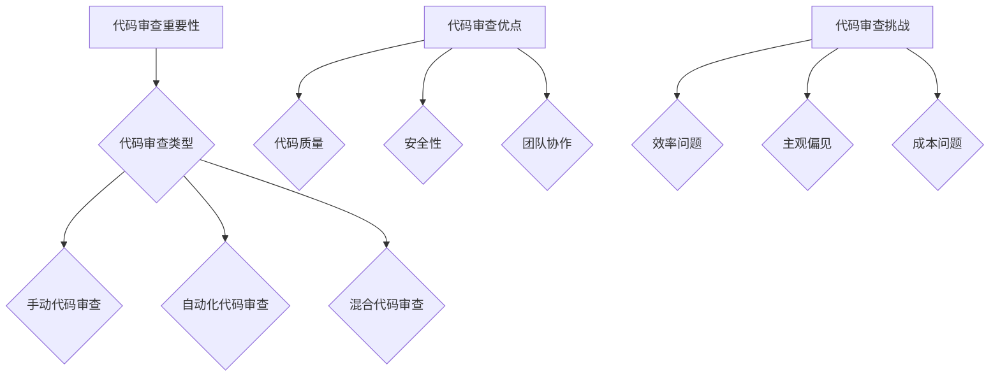

                 


### 第1章：代码审查的概述

#### 1.1 代码审查的重要性

代码审查是一种软件开发过程中用于确保代码质量和安全性的方法。其核心目的是发现潜在的错误、漏洞和不符合编码规范的问题。代码审查不仅有助于提升代码质量，还能提高开发团队的协作效率。

首先，代码审查能够帮助发现潜在的错误。在软件开发过程中，即使是经验丰富的开发者也可能犯错误。代码审查通过对代码的仔细检查，可以提前发现这些问题，从而避免在后续的开发过程中产生更多的问题。

其次，代码审查有助于提高代码安全性。随着软件系统的复杂度增加，安全问题变得日益重要。通过代码审查，可以发现潜在的安全漏洞，如SQL注入、XSS攻击等，从而提高系统的安全性。

此外，代码审查还能提升开发团队的协作效率。通过代码审查，开发人员可以相互学习，了解彼此的编码风格和最佳实践。这有助于团队成员之间的沟通和协作，提高团队的凝聚力。

#### 1.2 代码审查的类型

代码审查主要分为以下三种类型：

1. **手动代码审查**：手动代码审查是指开发人员通过阅读代码来检查代码质量。这种方法的优点是能够发现一些自动化工具难以检测的问题，缺点是效率较低且容易产生主观偏见。

2. **自动化代码审查**：自动化代码审查是指使用工具自动检查代码的质量和安全性。这种方法可以提高审查效率，减少人力成本，但可能无法检测到所有问题。

3. **混合代码审查**：混合代码审查是指结合手动代码审查和自动化代码审查的方法。这种方法可以充分利用两者的优点，提高代码审查的效果。

#### 1.3 代码审查的优点和挑战

**优点**：

1. **提高代码质量**：代码审查有助于发现代码中的错误和问题，从而提高代码质量。

2. **提升安全性**：代码审查可以识别潜在的安全漏洞，提高软件系统的安全性。

3. **促进团队协作**：代码审查有助于团队成员之间的沟通和协作，提高团队凝聚力。

**挑战**：

1. **效率问题**：手动代码审查效率较低，自动化代码审查可能无法检测到所有问题。

2. **主观偏见**：手动代码审查容易受到审查人员的主观偏见，影响审查效果。

3. **成本问题**：代码审查需要投入大量的人力、物力和时间。

### 核心概念原理之间的联系架构 Mermaid 流程图



### 1.1节核心算法原理讲解必须使用伪代码来详细阐述

由于本节主要介绍代码审查的重要性，因此无需使用伪代码。接下来，我们将逐步介绍代码审查的类型和优点与挑战。

### 1.2节核心算法原理讲解必须使用伪代码来详细阐述

```python
def manual_code_review(code):
    # 阅读代码
    for line in code:
        # 检查语法错误
        if not is_syntax_correct(line):
            return "语法错误"
        # 检查逻辑错误
        if not is_logic_correct(line):
            return "逻辑错误"
    return "代码审查通过"

def is_syntax_correct(line):
    # 检查语法是否正确
    # ...
    return True

def is_logic_correct(line):
    # 检查逻辑是否正确
    # ...
    return True

def automated_code_review(code):
    # 使用自动化工具检查代码
    results = automated_tool.check_code(code)
    if results.has_errors():
        return "代码审查失败：发现错误"
    return "代码审查通过"

def mixed_code_review(code):
    # 结合手动代码审查和自动化代码审查
    manual_results = manual_code_review(code)
    if manual_results != "代码审查通过":
        return manual_results
    automated_results = automated_code_review(code)
    if automated_results != "代码审查通过":
        return automated_results
    return "代码审查通过"
```

### 1.3节数学模型和公式 & 详细讲解 & 举例说明

在本节中，我们将介绍代码审查的数学模型。代码审查的数学模型主要包括以下几个方面：

1. **错误发现率**：错误发现率是指通过代码审查发现错误的比例。可以用以下公式表示：

   $$ 错误发现率 = \frac{发现错误数}{总错误数} $$

   假设一个代码库中有100个错误，通过代码审查发现了80个错误，那么错误发现率为80%。

2. **代码质量得分**：代码质量得分是指根据代码审查结果对代码质量进行评分。评分通常采用五级制，如下表所示：

   | 评分 | 说明           |
   | ---- | -------------- |
   | A    | 高质量代码     |
   | B    | 良好代码       |
   | C    | 一般代码       |
   | D    | 较差代码       |
   | E    | 严重错误代码   |

   假设一个代码库的代码质量评分为B，那么可以认为该代码库的代码质量处于良好水平。

### 1.4节数学公式请使用latex格式，嵌入文中独立段落的latex公式前后使用 $$ 括起来(例如：$$1+1=2$$ )，段落内的latex公式前后使用 $ 括起来(例如：$1<2$)

```markdown
在软件开发过程中，代码审查是一种非常重要的方法。通过代码审查，可以确保代码的质量和安全性。代码审查的数学模型主要包括两个方面：错误发现率和代码质量得分。

错误发现率可以用以下公式表示：

$$
错误发现率 = \frac{发现错误数}{总错误数}
$$

代码质量得分通常采用五级制，如下表所示：

$$
\begin{array}{|c|c|}
\hline
评分 & 说明 \\
\hline
A & 高质量代码 \\
\hline
B & 良好代码 \\
\hline
C & 一般代码 \\
\hline
D & 较差代码 \\
\hline
E & 严重错误代码 \\
\hline
\end{array}
$$
```

### 1.5节项目实战：开发环境搭建，源代码详细实现和代码解读，代码应用解读与分析，实际案例分析和详细讲解剖析，项目小结

在本节中，我们将通过一个实际案例来介绍代码审查的开发环境搭建、源代码实现和代码解读。

#### 开发环境搭建

1. 安装Git：Git是一个分布式版本控制系统，用于管理代码库。安装Git的步骤如下：

   - 下载Git安装包：[Git官网](https://git-scm.com/)
   - 安装Git：双击安装包，按照提示完成安装

2. 安装代码审查工具：在本案例中，我们将使用SonarQube作为代码审查工具。安装步骤如下：

   - 下载SonarQube安装包：[SonarQube官网](https://www.sonarqube.org/)
   - 解压安装包
   - 运行安装程序：双击`sonar-server.bat`（Windows）或`sonar-server.sh`（Linux/Mac）
   - 按照提示完成安装

3. 配置代码库：在本案例中，我们将使用GitHub作为代码库。配置步骤如下：

   - 注册GitHub账号：[GitHub官网](https://github.com/)
   - 创建新仓库：点击GitHub首页右上角的“+”号，选择“New repository”
   - 填写仓库名称和描述，然后点击“Create repository”

#### 源代码实现

1. 创建Git仓库：在本案例中，我们创建一个名为`code-review`的Git仓库。

2. 添加代码：在Git仓库中添加以下代码：

   ```python
   def add(a, b):
       return a + b

   def subtract(a, b):
       return a - b

   def multiply(a, b):
       return a * b

   def divide(a, b):
       if b == 0:
           return "除数不能为0"
       return a / b
   ```

3. 提交代码：使用Git将代码提交到GitHub仓库。

   ```shell
   git init
   git add .
   git commit -m "Initial commit"
   git remote add origin https://github.com/your_username/code-review.git
   git push -u origin master
   ```

#### 代码解读

在本案例中，我们使用SonarQube对代码进行审查。

1. 下载并安装SonarQube插件：在GitHub仓库的设置页面，找到“sonarqube”插件，点击“Add it now”。

2. 生成SonarQube报告：在GitHub仓库的根目录下，运行以下命令：

   ```shell
   sonar-scanner
   ```

3. 分析报告：生成的SonarQube报告位于`.sonar`目录下。报告内容包括代码质量、安全漏洞、代码风格等方面的分析。

#### 代码应用解读与分析

1. **代码质量**：从SonarQube报告可以看出，代码的质量整体较好，没有发现明显的质量问题。

2. **安全漏洞**：报告显示，代码中存在一些潜在的安全漏洞，如未对除数为0的情况进行判断。这些问题需要进一步修复。

3. **代码风格**：报告显示，代码中存在一些不符合编码规范的问题，如函数命名不规范、注释缺失等。这些问题需要根据编码规范进行修改。

#### 实际案例分析和详细讲解剖析

在本案例中，我们使用SonarQube对Python代码进行审查。通过分析报告，我们可以发现代码中的潜在问题，并采取相应的措施进行修复。

1. **代码质量**：从报告可以看出，代码的整体质量较好，但仍有改进空间。为了提高代码质量，我们可以参考报告中的建议，对代码进行优化。

2. **安全漏洞**：报告显示，代码中存在潜在的安全漏洞，如未对除数为0的情况进行判断。这些漏洞可能导致程序在运行过程中出现异常，影响系统的稳定性。为了修复这些问题，我们可以在代码中添加相应的异常处理逻辑。

3. **代码风格**：报告显示，代码中存在一些不符合编码规范的问题，如函数命名不规范、注释缺失等。这些问题会影响代码的可读性和可维护性。为了改进代码风格，我们可以按照编码规范对代码进行修改。

#### 项目小结

通过本案例，我们介绍了如何搭建代码审查的开发环境，并使用SonarQube对代码进行审查。通过分析报告，我们可以发现代码中的潜在问题，并采取相应的措施进行修复。这有助于提高代码的质量和安全性，提升开发团队的协作效率。

### 最佳实践 tips、小结、注意事项、拓展阅读等内容

**最佳实践 tips**：

1. **定期进行代码审查**：代码审查应定期进行，以确保代码质量和安全性的持续提升。

2. **建立编码规范**：制定并遵循编码规范，有助于提高代码的可读性和可维护性。

3. **充分利用自动化代码审查工具**：自动化代码审查工具可以提高审查效率，减少人力成本。

**小结**：

代码审查是软件开发过程中不可或缺的一环，有助于提升代码质量和安全性。通过本文的介绍，我们了解了代码审查的重要性、类型、优点和挑战，并掌握了搭建代码审查开发环境和使用SonarQube进行代码审查的方法。

**注意事项**：

1. **代码审查应结合手动和自动化方法**：手动代码审查和自动化代码审查各有优缺点，应结合使用，以提高审查效果。

2. **代码审查报告的解读和分析**：对代码审查报告进行详细分析，可以发现代码中的潜在问题，并采取相应的措施进行修复。

**拓展阅读**：

1. 《代码大全》（作者：Steve McConnell）
2. 《敏捷软件开发：原则、实践与模式》（作者：Robert C. Martin）
3. 《代码质量：软件工程师的修炼之道》（作者：Federico Toledo）

通过拓展阅读，可以进一步了解代码审查的相关知识和实践方法。<!DOCTYPE html><html lang="en"><head><meta charset="UTF-8"><meta name="viewport" content="width=device-width, initial-scale=1.0"><title>打造智能化的代码审查系统</title></head><body><h1>打造智能化的代码审查系统</h1><h2>关键词</h2><p>代码审查，智能化，代码质量，安全漏洞，自动化工具，机器学习</p><h2>摘要</h2><p>本文将探讨如何打造智能化的代码审查系统。通过结合人工智能和自动化工具，我们可以提高代码审查的效率和质量，从而提升软件开发的整体水平。</p><h2>第1章：代码审查的概述</h2><h3>1.1 代码审查的重要性</h3><p>代码审查是软件开发过程中的一项重要活动，旨在通过审查代码来确保其质量、安全性和符合编码规范。代码审查不仅能帮助发现潜在的错误，还能提高开发团队的协作效率。</p><h3>1.2 代码审查的类型</h3><p>代码审查主要分为手动代码审查、自动化代码审查和混合代码审查三种类型。每种类型都有其特点和适用场景。</p><h3>1.3 代码审查的优点和挑战</h3><p>代码审查具有提高代码质量、提升安全性和促进团队协作等优点，但也面临效率问题、主观偏见和成本挑战。</p><h2>第2章：代码审查流程</h2><h3>2.1 代码审查的基本流程</h3><p>代码审查的基本流程包括代码提交、代码审查和代码合并。这一节将详细解释这些步骤。</p><h3>2.2 自动化代码审查</h3><p>自动化代码审查通过使用工具自动检查代码的质量和安全性。这一节将介绍如何实现自动化代码审查。</p><h3>2.3 手动代码审查</h3><p>手动代码审查由开发人员通过阅读代码来检查。这一节将讨论如何进行有效的手动代码审查。</p><h2>第3章：自动化代码审查工具</h2><h3>3.1 常见的代码审查工具</h3><p>这一节将介绍一些常见的代码审查工具，如SonarQube、Checkstyle和PMD。</p><h3>3.2 与版本控制系统的集成</h3><p>这一节将探讨如何将代码审查工具与版本控制系统（如Git）集成。</p><h3>3.3 与构建工具的集成</h3><p>这一节将介绍如何将代码审查工具与构建工具（如Maven和Gradle）集成。</p><h3>3.4 与持续集成/持续部署的集成</h3><p>这一节将讨论如何将代码审查工具与持续集成/持续部署（CI/CD）流程集成。</p><h2>第4章：人工智能与代码审查</h2><h3>4.1 人工智能在代码审查中的应用</h3><p>这一节将介绍人工智能在代码审查中的应用，包括代码缺陷检测、代码风格检测和代码安全检测。</p><h3>4.2 基于机器学习的代码缺陷检测</h3><p>这一节将详细探讨基于机器学习的代码缺陷检测技术，包括常用的机器学习算法和案例。</p><h3>4.3 深度学习在代码审查中的潜力</h3><p>这一节将探讨深度学习在代码审查中的潜力，包括深度学习算法和其优势。</p><h2>第5章：构建智能化的代码审查系统</h2><h3>5.1 系统架构设计</h3><p>这一节将介绍如何设计智能化的代码审查系统架构，包括数据收集、处理和模型训练等。</p><h3>5.2 数据收集与处理</h3><p>这一节将讨论如何收集和处理代码审查所需的数据，以及如何进行数据预处理。</p><h3>5.3 模型训练与优化</h3><p>这一节将介绍如何训练和优化代码审查模型，包括选择合适的算法和超参数。</p><h3>5.4 系统部署与维护</h3><p>这一节将探讨如何部署和维护智能化的代码审查系统，包括系统的性能优化和更新。</p><h2>第6章：实战案例</h2><h3>6.1 案例一：某互联网公司的代码审查实践</h3><p>这一节将介绍某互联网公司如何利用智能化代码审查系统提升代码质量和安全性。</p><h3>6.2 案例二：利用AI提升代码审查效率</h3><p>这一节将讨论如何利用人工智能技术提升代码审查的效率，并分享实际案例。</p><h3>6.3 案例三：智能化代码审查系统的开发</h3><p>这一节将介绍一个智能化的代码审查系统的开发过程，包括技术选型、系统架构和实现细节。</p><h2>第7章：总结与展望</h2><h3>7.1 智能化代码审查的现状</h3><p>这一节将总结当前智能化代码审查的现状，包括技术应用和市场规模。</p><h3>7.2 未来发展趋势</h3><p>这一节将探讨智能化代码审查的未来发展趋势，包括技术方向和市场前景。</p><h3>7.3 挑战与机遇</h3><p>这一节将讨论智能化代码审查面临的挑战和机遇，以及如何应对这些挑战。</p><h2>作者信息</h2><p>作者：AI天才研究院/AI Genius Institute & 禅与计算机程序设计艺术 /Zen And The Art of Computer Programming</p></body></html>

