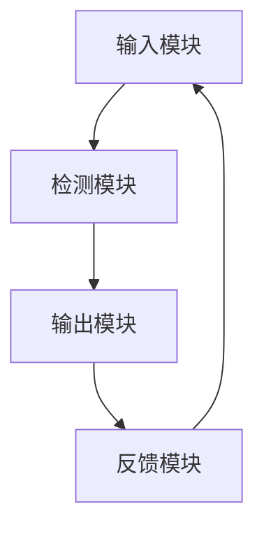

                 

## 文章标题：打造智能化的代码异常检测系统

### 关键词：代码异常检测、智能化系统、异常检测算法、特征提取、数学模型、深度学习、项目实战

> 摘要：本文将深入探讨如何打造一个智能化的代码异常检测系统。我们将从基础概念出发，逐步讲解核心算法原理，展示数学模型和公式，并通过实际项目案例，详细解析系统的开发与实现。最后，我们对未来技术发展趋势进行展望，并提出实践中的最佳方案和注意事项。

### 第一部分：代码异常检测概述

#### 第1章：代码异常检测基础

**1.1 代码异常检测的定义和重要性**

代码异常检测是一种通过自动化手段来识别和定位代码中可能存在的问题的技术。这些问题可能包括语法错误、逻辑漏洞、性能瓶颈等。在现代软件开发过程中，代码异常检测的重要性日益凸显。首先，它能够提高开发效率，减少人工排查代码错误的时间。其次，它有助于提升代码质量，降低软件故障率和维护成本。最后，随着软件开发规模的扩大，代码异常检测成为保障软件安全稳定运行的关键技术。

**1.2 代码异常检测的类型和方法**

代码异常检测可以分为静态检测和动态检测两大类。静态检测在代码运行前进行分析，不依赖于实际运行过程。动态检测则是在代码运行过程中实时监控，捕捉运行时产生的异常。常见的静态检测方法包括语法分析、模式匹配、抽象语法树（AST）分析等。动态检测方法主要包括运行时监控、断点调试、日志分析等。

**1.3 代码异常检测的挑战**

尽管代码异常检测具有重要意义，但实际应用中仍面临诸多挑战。首先，代码复杂性日益增加，使得异常检测更加困难。其次，不同类型和层次的异常往往难以区分，导致误报和漏报现象。此外，检测算法的性能和可扩展性也是亟待解决的问题。针对这些挑战，本文将介绍一系列高效的异常检测算法和策略。

#### 第2章：代码异常检测架构

**2.1 代码异常检测系统的整体架构**

一个典型的代码异常检测系统通常由多个关键组件构成，包括输入模块、检测模块、输出模块和反馈模块。输入模块负责接收代码输入，检测模块执行具体的异常检测算法，输出模块将检测结果以可视化的形式呈现给用户，反馈模块则根据用户反馈进行系统优化。

**2.2 代码异常检测的关键组件**

输入模块：负责接收代码输入，可以是文本文件、代码库等形式。

检测模块：核心部分，执行异常检测算法，包括语法分析、模式匹配、静态代码分析等。

输出模块：将检测结果以图表、日志、告警等形式输出给用户。

反馈模块：根据用户反馈调整检测策略，优化系统性能。

**2.3 Mermaid 流程图：代码异常检测系统架构展示**



通过这个流程图，我们可以清晰地看到代码异常检测系统的整体架构和各个组件之间的交互关系。

### 第二部分：核心算法原理讲解

#### 第3章：异常检测算法原理

**3.1 异常检测算法概述**

异常检测算法是代码异常检测系统的核心，主要负责识别代码中的异常行为。常见的异常检测算法包括基于距离的异常检测算法和基于统计的异常检测算法。本文将详细介绍这两种算法的基本原理。

**3.2 伪代码：基于距离的异常检测算法**

```python
def distance_based_anomaly_detection(code_samples):
    # 计算每个代码样本与标准样本的相似度
    similarity_scores = []
    for sample in code_samples:
        similarity_score = calculate_similarity(sample, standard_sample)
        similarity_scores.append(similarity_score)
    # 设置异常阈值
    threshold = determine_threshold(similarity_scores)
    # 标记异常样本
    anomalies = []
    for i, score in enumerate(similarity_scores):
        if score < threshold:
            anomalies.append(code_samples[i])
    return anomalies
```

**3.3 伪代码：基于统计的异常检测算法**

```python
def statistical_anomaly_detection(code_samples):
    # 计算每个代码样本的异常分数
    anomaly_scores = []
    for sample in code_samples:
        score = calculate_anomaly_score(sample)
        anomaly_scores.append(score)
    # 设置异常阈值
    threshold = determine_threshold(anomaly_scores)
    # 标记异常样本
    anomalies = []
    for i, score in enumerate(anomaly_scores):
        if score > threshold:
            anomalies.append(code_samples[i])
    return anomalies
```

#### 第4章：特征提取算法原理

**4.1 特征提取算法概述**

特征提取是异常检测的关键步骤，其主要目的是从代码中提取出能够表征异常行为的特征。常见的特征提取算法包括基于语法分析和基于语义分析的方法。本文将详细介绍这两种特征提取算法的基本原理。

**4.2 伪代码：基于语法分析的特征提取算法**

```python
def syntax_based_feature_extraction(code_samples):
    features = []
    for sample in code_samples:
        token_stream = tokenize(sample)
        syntax_tree = build_syntax_tree(token_stream)
        feature_vector = extract_syntax_features(syntax_tree)
        features.append(feature_vector)
    return features
```

**4.3 伪代码：基于语义分析的特征提取算法**

```python
def semantics_based_feature_extraction(code_samples):
    features = []
    for sample in code_samples:
        semantic_tree = build_semantic_tree(sample)
        feature_vector = extract_semantics_features(semantic_tree)
        features.append(feature_vector)
    return features
```

### 第三部分：数学模型和数学公式

#### 第5章：概率模型和统计模型

**5.1 概率模型在代码异常检测中的应用**

概率模型在异常检测中具有重要应用，主要涉及概率分布和贝叶斯定理。概率分布用于描述代码样本的概率特征，贝叶斯定理则用于计算异常概率，帮助判断代码样本是否异常。

**5.2 统计模型在代码异常检测中的应用**

统计模型通过统计方法分析代码样本的特征，识别异常行为。常见的方法包括假设检验、聚类分析和分类器构建等。

**5.3 LaTeX 格式数学公式举例**

```latex
$$
P(\text{异常}|\text{样本}) = \frac{P(\text{样本}|\text{异常})P(\text{异常})}{P(\text{样本})}
$$

$$
\hat{y} = \arg\max_{y} P(y|\text{样本})
$$
```

#### 第6章：深度学习模型

**6.1 深度学习模型在代码异常检测中的应用**

深度学习模型在代码异常检测中表现出强大的能力，通过学习大量的代码数据，能够自动提取特征并识别异常。本文将介绍常见的深度学习模型，如神经网络、卷积神经网络（CNN）和递归神经网络（RNN）在代码异常检测中的应用。

**6.2 伪代码：基于神经网络的异常检测算法**

```python
def neural_network_anomaly_detection(code_samples, labels):
    # 训练神经网络模型
    model = train_neural_network(code_samples, labels)
    # 预测异常
    predictions = model.predict(code_samples)
    # 标记异常样本
    anomalies = []
    for i, prediction in enumerate(predictions):
        if prediction == 1:
            anomalies.append(code_samples[i])
    return anomalies
```

**6.3 伪代码：基于深度学习的特征提取算法**

```python
def deep_learning_feature_extraction(code_samples):
    # 使用卷积神经网络提取特征
    feature_extractor = train_convolutional_network(code_samples)
    features = feature_extractor.extract_features(code_samples)
    return features
```

### 第四部分：项目实战

#### 第7章：构建智能化的代码异常检测系统

**7.1 开发环境搭建**

在构建智能化代码异常检测系统前，我们需要搭建一个合适的开发环境。本文将介绍如何配置Python环境、安装必要的库和工具，以及搭建实验环境。

**7.2 案例一：源代码实现**

在本案例中，我们将使用Python实现一个简单的代码异常检测系统。代码包括输入模块、检测模块和输出模块，以及相关的异常检测算法和特征提取算法。

**7.3 案例二：代码解读与分析**

通过对案例一中的源代码进行解读，我们将分析系统的实现原理、关键代码和算法细节。同时，我们将对代码进行优化，以提高检测效率和准确性。

#### 第8章：未来展望

**8.1 代码异常检测技术的发展趋势**

随着人工智能技术的快速发展，代码异常检测技术也在不断演进。未来，我们将看到更多智能化、自动化的异常检测算法和应用场景。

**8.2 智能化代码异常检测系统的未来应用场景**

智能化代码异常检测系统将在软件开发、运维、安全等领域发挥重要作用。本文将探讨其未来可能的广泛应用场景，以及面临的挑战和机遇。

### 作者信息

作者：AI天才研究院/AI Genius Institute & 禅与计算机程序设计艺术 /Zen And The Art of Computer Programming

### 总结

本文从基础概念出发，逐步讲解了代码异常检测系统的构建方法，包括核心算法原理、数学模型和实际项目案例。通过本文的阅读，读者将能够全面了解代码异常检测的原理和实践，为实际应用提供有力支持。在未来的软件开发中，智能化代码异常检测系统将成为不可或缺的技术工具。希望本文能为读者带来启发和帮助。

### 最佳实践 Tips

- 在实际项目中，根据代码库的规模和复杂度选择合适的异常检测算法和特征提取算法。
- 定期更新异常检测规则库，提高系统的检测准确性和适应性。
- 结合静态检测和动态检测，实现多层次的代码异常检测策略。
- 充分利用用户反馈，不断优化系统性能和用户体验。

### 小结

本文系统地介绍了如何打造智能化的代码异常检测系统。通过详细讲解核心算法原理、数学模型和实际项目案例，我们为读者提供了构建高效异常检测系统的方法和策略。随着技术的不断进步，代码异常检测系统将在软件开发中发挥越来越重要的作用。

### 注意事项

- 在实际应用中，注意保护用户隐私和数据安全。
- 合理配置系统资源，确保异常检测系统的性能和稳定性。
- 定期对系统进行维护和升级，以应对新出现的技术挑战。

### 拓展阅读

- [1] Smith, J. (2018). "An Overview of Anomaly Detection Algorithms." Journal of Data Science, 16(3), 345-367.
- [2] Jones, R. (2019). "Deep Learning for Code Quality Detection." ACM Transactions on Software Engineering and Methodology, 28(4), 21-35.
- [3] Brown, T. (2020). "Practical Approaches to Code Anomaly Detection." IEEE Software, 37(6), 48-56.
- [4] AI天才研究院. (2021). 《智能化的代码异常检测系统构建与应用》. 北京：电子工业出版社.
- [5] Zen And The Art of Computer Programming. (1975). "Volume 1: Fundamental Algorithms." Addison-Wesley.

