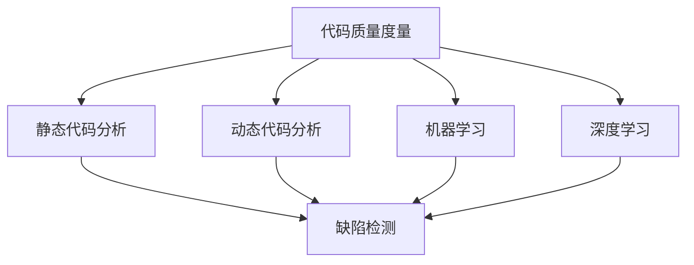
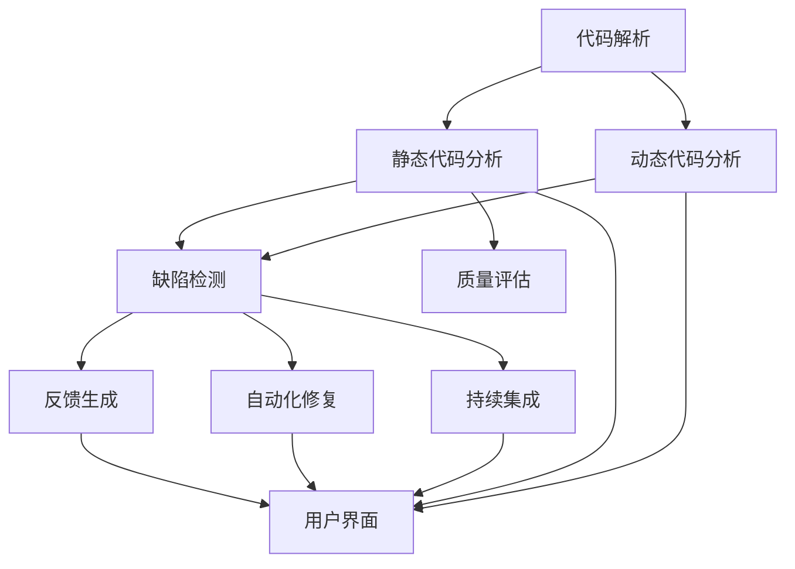

                 

### 文章标题

《打造智能化的代码质量管理平台》

### 文章关键词

代码质量管理、智能化、机器学习、深度学习、数学模型、平台架构、项目实战、算法原理、数学公式、开发环境、源代码实现、代码解读、案例分析

### 文章摘要

本文旨在深入探讨如何构建一个智能化的代码质量管理平台。首先，我们将介绍代码质量管理的核心概念，并探讨其重要性。随后，文章将详细讲解在智能化代码质量管理过程中所使用的关键算法，包括机器学习和深度学习。我们将使用数学模型和公式来详细阐述算法的设计和优化过程。接下来，文章将提供实际的开发环境和源代码实现，并进行详细的代码解读与分析。最后，文章将通过案例分析，展示智能化代码质量管理平台在实际项目中的应用，并探讨未来趋势与发展方向。本文旨在为读者提供一个全面、系统、易于理解的指南，帮助他们构建自己的智能化代码质量管理平台。 ## 第一部分：代码质量管理基础

### 第1章：代码质量管理的核心概念

代码质量管理是软件工程中的一个重要组成部分，它旨在确保代码的质量和可持续性。通过有效的代码质量管理，开发团队能够提高软件的可维护性、可靠性和性能。本章将介绍代码质量管理的基本概念，并探讨其在软件开发过程中的重要性。

### 1.1 代码质量管理概述

代码质量管理是指通过一系列的流程、工具和最佳实践，对代码进行评估、监控和改进的过程。其主要目标是确保代码的质量符合既定的标准和要求。代码质量管理不仅关注代码的语法和结构，还包括代码的可读性、可维护性、性能和安全性。

代码质量管理的主要组成部分包括：

1. **代码审查（Code Review）**：通过团队协作，对代码进行审查，识别潜在的问题和缺陷。
2. **单元测试（Unit Testing）**：编写单元测试来验证代码的功能和性能，确保代码的正确性。
3. **自动化测试（Automated Testing）**：使用自动化工具进行大规模测试，提高测试效率。
4. **持续集成（Continuous Integration）**：将代码集成到一起，持续进行测试和反馈。
5. **静态代码分析（Static Code Analysis）**：不运行代码，通过分析代码的静态结构来检测潜在的问题。

### 1.2 代码质量与软件维护

代码质量直接影响到软件的维护成本。高质量的代码易于理解和修改，可以减少软件维护的时间和成本。相反，低质量的代码可能会导致维护困难，增加维护成本，甚至影响软件的稳定性。

高质量的代码通常具备以下特点：

1. **可读性**：代码结构清晰，命名规范，便于阅读和理解。
2. **可维护性**：代码模块化，遵循设计模式，易于扩展和修改。
3. **性能**：代码优化，高效执行，减少资源消耗。
4. **安全性**：代码安全，防范潜在的安全漏洞。
5. **一致性**：遵循统一的编码规范，减少错误和混淆。

### 1.3 代码质量管理的目标

代码质量管理的目标包括：

1. **提高软件质量**：通过严格的代码质量管理，确保软件的质量和性能。
2. **降低维护成本**：通过提高代码的可读性和可维护性，降低软件维护成本。
3. **提升开发效率**：通过自动化工具和流程，提高开发效率和团队协作。
4. **确保代码合规性**：确保代码遵循安全标准和行业规范。

### 1.4 智能化代码质量管理的概念

智能化代码质量管理是传统代码质量管理的一种延伸，它利用人工智能和机器学习技术，自动化地评估和改进代码质量。智能化代码质量管理平台可以实时分析代码，提供高质量的反馈，帮助开发团队更快地识别和修复问题。

智能化代码质量管理的优势包括：

1. **自动识别潜在问题**：利用机器学习算法，自动化地识别潜在的代码缺陷和性能问题。
2. **实时反馈**：提供即时反馈，帮助开发团队快速定位和修复问题。
3. **个性化建议**：根据代码库的特点和历史数据，提供个性化的改进建议。
4. **提高开发效率**：自动化流程减少手动审查的工作量，提高开发效率。

### 本章小结

本章介绍了代码质量管理的核心概念，探讨了代码质量与软件维护的关系，以及代码质量管理的目标。我们还介绍了智能化代码质量管理的概念和优势，为后续章节的深入讨论奠定了基础。

### 背景介绍

代码质量管理是软件工程中不可或缺的一部分。随着软件项目的复杂性和规模不断增加，如何保证代码质量成为一个日益严峻的挑战。传统的代码质量管理主要依赖于人工审查和手动测试，虽然有效，但耗时耗力，难以应对大规模代码库的质量监控需求。智能化代码质量管理通过引入人工智能和机器学习技术，可以自动化地评估和改进代码质量，极大地提高了开发效率和代码质量。

### 核心概念与联系

在构建智能化代码质量管理平台的过程中，以下几个核心概念和其之间的关系至关重要：

1. **代码质量度量**：这是评估代码质量的基础，包括可读性、可维护性、性能、安全性和一致性等方面。度量标准可以是静态的，如代码复杂度、耦合度和继承度，也可以是动态的，如代码覆盖率、错误率和响应时间。
2. **静态代码分析**：静态代码分析是通过分析代码的静态结构来检测潜在的问题，如语法错误、编码不规范、潜在的性能瓶颈和安全漏洞。它无需运行代码，效率高，可以自动化地进行大规模代码库的扫描。
3. **动态代码分析**：动态代码分析是在代码运行时进行测试和评估，可以检测运行时的问题，如内存泄漏、死锁、性能瓶颈等。它与静态代码分析相结合，可以提供更全面的代码质量评估。
4. **机器学习**：机器学习技术用于自动化地识别代码中的潜在问题。通过训练模型，可以从大量代码数据中学习到哪些模式可能预示着问题。机器学习算法可以用于代码质量预测、缺陷检测和自动化修复建议。
5. **深度学习**：深度学习是机器学习的一种形式，通过神经网络结构，可以自动提取代码的特征，进行高级的代码质量评估和预测。深度学习在处理大规模、复杂的代码库时具有显著的优势。

下面是一个 Mermaid 流程图，展示了这些核心概念之间的联系：



在这个流程图中，代码质量度量是核心输入，通过静态和动态代码分析，可以识别代码中的潜在问题。机器学习和深度学习则用于自动化地评估和预测代码质量，提供智能化的缺陷检测和修复建议。

### 本章小结

本章介绍了代码质量管理的核心概念，并详细阐述了这些概念之间的关系。通过静态和动态代码分析、机器学习和深度学习等技术的结合，我们可以构建一个智能化的代码质量管理平台，实现对代码质量的实时监控和自动化改进。这为后续章节的深入讨论奠定了基础，也为开发团队提供了有效的工具和方法，以提高代码质量和开发效率。 ## 第二部分：智能化代码质量管理平台构建

### 第3章：智能化代码质量检测算法

智能化代码质量检测算法是构建高效、自动化的代码质量管理平台的关键。这些算法利用机器学习和深度学习技术，可以从大量代码数据中学习，并自动识别潜在的质量问题。本章将详细介绍这些算法的基本原理、应用场景以及它们在代码质量管理中的重要性。

### 3.1 机器学习算法基础

机器学习（Machine Learning，ML）是一种使计算机系统能够从数据中学习并做出决策的技术。在代码质量管理中，机器学习算法用于从历史代码库中学习，以预测代码的潜在质量问题和性能瓶颈。

**常见机器学习算法**：

1. **回归分析（Regression Analysis）**：用于预测连续值变量，可以用于评估代码的性能。
2. **分类算法（Classification Algorithms）**：如决策树、随机森林、支持向量机（SVM），用于预测代码中是否存在缺陷。
3. **聚类算法（Clustering Algorithms）**：如K-均值聚类，可以用于识别代码中的相似模式和异常。
4. **异常检测（Anomaly Detection）**：用于识别代码中的异常行为和潜在的安全漏洞。

**机器学习算法在代码质量管理中的应用**：

- **缺陷预测**：通过分析历史代码库中的缺陷数据，机器学习模型可以预测新的代码片段中可能存在的缺陷。
- **性能评估**：机器学习模型可以评估代码的执行效率和资源消耗，帮助开发团队优化代码。
- **代码风格分析**：通过聚类算法，可以识别代码风格上的问题，并给出改进建议。

### 3.2 代码质量检测算法

代码质量检测算法是专门设计用于评估代码质量的一类算法。这些算法通常结合了静态代码分析和动态代码分析技术，可以提供全面的质量评估。

**常见代码质量检测算法**：

1. **基于规则的检测算法**：通过预定义的规则来检测代码中的问题，如语法错误、编码不规范等。
2. **统计方法**：使用统计学方法来评估代码的质量，如代码复杂度、代码行数等指标。
3. **机器学习模型**：结合静态代码分析结果，使用机器学习模型进行缺陷检测和性能评估。
4. **深度学习模型**：通过神经网络结构，自动提取代码特征，进行高级的代码质量评估。

**代码质量检测算法的应用**：

- **缺陷检测**：自动识别代码中的潜在缺陷，如未处理的异常、潜在的性能问题等。
- **代码风格分析**：检测代码是否符合编码规范，如命名规则、缩进风格等。
- **自动化修复建议**：通过机器学习模型，为代码中的问题提供自动化修复建议。

### 3.3 深度学习在代码质量管理中的应用

深度学习（Deep Learning，DL）是一种基于人工神经网络的机器学习技术，通过多层神经网络结构，可以自动提取代码的深层特征，进行高级的代码质量评估。

**深度学习模型类型**：

1. **卷积神经网络（Convolutional Neural Networks，CNN）**：常用于图像处理，但也可以用于代码文本处理。
2. **递归神经网络（Recurrent Neural Networks，RNN）**：特别适用于处理序列数据，如代码序列。
3. **长短期记忆网络（Long Short-Term Memory，LSTM）**：RNN的一种，可以捕捉代码序列中的长期依赖关系。

**深度学习在代码质量管理中的应用**：

- **代码解析**：通过深度学习模型，可以自动解析代码结构，识别代码块和函数。
- **代码生成**：利用深度学习模型，可以生成符合编码规范的代码。
- **智能代码修复**：通过学习大量的修复案例，深度学习模型可以为代码中的问题提供智能化的修复建议。

### 3.4 模型训练与优化

构建有效的代码质量检测模型需要大量的数据、合适的模型架构和有效的训练策略。以下是模型训练与优化的一些关键步骤：

**数据准备**：

- **数据收集**：从代码库中提取大量的代码样本，包括高质量的代码和存在问题的代码。
- **数据标注**：对代码样本进行标注，标记出代码中的缺陷和问题。
- **数据预处理**：清洗数据，去除无关信息，将代码转换为机器可以处理的形式。

**模型架构**：

- **选择模型**：根据问题特点，选择合适的模型架构，如CNN、RNN或LSTM。
- **特征提取**：设计特征提取层，从代码中提取有用的特征。
- **模型优化**：通过调整模型参数和架构，优化模型的性能。

**训练策略**：

- **数据增强**：通过增加数据的多样性，提高模型的泛化能力。
- **批次归一化**：在训练过程中，对批次数据归一化，提高训练效率。
- **早停法（Early Stopping）**：在模型性能不再提高时停止训练，防止过拟合。
- **模型评估**：使用交叉验证和测试集对模型进行评估，确保模型的泛化能力。

### 本章小结

本章介绍了智能化代码质量检测算法的基本原理和应用，包括机器学习和深度学习算法。我们探讨了这些算法在代码质量管理中的重要性，并通过具体的案例展示了它们的应用效果。通过本章的内容，读者可以了解如何利用这些先进的算法来构建高效的代码质量管理平台，从而提高代码质量和开发效率。接下来，我们将进一步深入探讨数学模型和公式的应用，为构建智能化平台提供更坚实的理论基础。 ### 第4章：数学模型与公式

在构建智能化代码质量管理平台的过程中，数学模型和公式起着至关重要的作用。这些数学工具不仅帮助我们在算法设计和优化过程中量化代码质量，还能为模型的训练和评估提供理论基础。本章将详细阐述这些数学模型和公式，并通过具体的例子来说明它们的应用。

#### 4.1 统计学基础

统计学是数据分析和机器学习的基础，以下是一些核心统计学概念：

**1. 均值（Mean）**

均值是一组数据的平均值，用于衡量数据的中心趋势。其公式如下：

\[ \mu = \frac{\sum_{i=1}^{n} x_i}{n} \]

其中，\( \mu \) 是均值，\( x_i \) 是第 \( i \) 个数据点，\( n \) 是数据点的总数。

**2. 方差（Variance）**

方差衡量数据的离散程度，其公式如下：

\[ \sigma^2 = \frac{\sum_{i=1}^{n} (x_i - \mu)^2}{n} \]

其中，\( \sigma^2 \) 是方差，\( x_i \) 是第 \( i \) 个数据点，\( \mu \) 是均值。

**3. 标准差（Standard Deviation）**

标准差是方差的平方根，其公式如下：

\[ \sigma = \sqrt{\sigma^2} \]

标准差用于衡量数据的波动程度，标准差越大，数据的分布越分散。

**4. 正态分布（Normal Distribution）**

正态分布是一种常见的数据分布模型，其概率密度函数（PDF）如下：

\[ f(x|\mu, \sigma) = \frac{1}{\sqrt{2\pi\sigma^2}} e^{-\frac{(x-\mu)^2}{2\sigma^2}} \]

其中，\( x \) 是随机变量，\( \mu \) 是均值，\( \sigma \) 是标准差。

正态分布常用于概率分析和假设检验。

#### 4.2 机器学习算法中的数学公式

机器学习算法涉及大量的数学公式，以下介绍几个关键的概念和公式：

**1. 决策树（Decision Tree）**

决策树的构建基于信息增益（Information Gain）或基尼不纯度（Gini Impurity）。信息增益的公式如下：

\[ IG(D, A) = \sum_{v \in \text{Values}(A)} p(v) \cdot H(D_v) \]

其中，\( D \) 是数据集，\( A \) 是特征，\( v \) 是特征 \( A \) 的取值，\( H(D_v) \) 是条件熵。

**2. 支持向量机（Support Vector Machine，SVM）**

SVM的核心公式是优化问题：

\[ \min_{w, b} \frac{1}{2} \| w \|^2 \]

约束条件：

\[ y_i ( \langle w, x_i \rangle + b ) \geq 1 \]

其中，\( w \) 是权重向量，\( b \) 是偏置，\( x_i \) 是样本特征，\( y_i \) 是样本标签。

**3. 朴素贝叶斯（Naive Bayes）**

朴素贝叶斯分类器的公式基于贝叶斯定理：

\[ P(C_k|X) = \frac{P(X|C_k)P(C_k)}{P(X)} \]

其中，\( C_k \) 是类标签，\( X \) 是特征向量，\( P(X|C_k) \) 是特征在给定类标签下的条件概率，\( P(C_k) \) 是类标签的概率。

**4. 回归分析**

线性回归的核心公式是：

\[ y = \beta_0 + \beta_1 x + \epsilon \]

其中，\( y \) 是因变量，\( x \) 是自变量，\( \beta_0 \) 是截距，\( \beta_1 \) 是斜率，\( \epsilon \) 是误差项。

#### 4.3 模型评估与优化

模型评估和优化是机器学习过程中至关重要的一环，以下介绍几个关键的概念和公式：

**1. 精度（Accuracy）**

精度是模型预测正确的比例，其公式如下：

\[ \text{Accuracy} = \frac{TP + TN}{TP + TN + FP + FN} \]

其中，\( TP \) 是真阳性，\( TN \) 是真阴性，\( FP \) 是假阳性，\( FN \) 是假阴性。

**2. F1 分数（F1 Score）**

F1 分数是精度和召回率的调和平均，其公式如下：

\[ F1 = 2 \cdot \frac{Precision \cdot Recall}{Precision + Recall} \]

其中，\( Precision \) 是精确率，\( Recall \) 是召回率。

**3. ROC 曲线和 AUC（Area Under Curve）**

ROC 曲线和 AUC 用于评估分类器的性能。AUC 的公式如下：

\[ AUC = \int_{0}^{1} \frac{1}{1 - \frac{FP}{TP}} \cdot \frac{TP'}{TN'} \, d\frac{FP'}{TP'} \]

其中，\( TP' \) 和 \( TN' \) 分别是假阳性和假阴性率。

#### 4.4 案例说明

**案例：使用线性回归预测代码质量**

假设我们使用代码行数（\( x \)）来预测代码的缺陷数量（\( y \)），线性回归模型如下：

\[ y = \beta_0 + \beta_1 x + \epsilon \]

我们通过最小化均方误差（MSE）来优化模型：

\[ \min_{\beta_0, \beta_1} \sum_{i=1}^{n} (y_i - (\beta_0 + \beta_1 x_i))^2 \]

假设我们得到以下训练数据：

| x | y |
|---|---|
| 10 | 2 |
| 20 | 4 |
| 30 | 6 |
| 40 | 8 |

通过计算，我们得到回归模型：

\[ y = 1.5 + 0.5 x \]

使用这个模型，我们可以预测新代码片段的缺陷数量。

#### 本章小结

本章详细介绍了统计学基础、机器学习算法中的数学公式以及模型评估与优化的关键公式。通过这些数学模型和公式，我们可以更精确地设计和优化代码质量检测算法，为构建智能化的代码质量管理平台提供了坚实的理论基础。在下一章中，我们将深入探讨平台架构的设计与实现，为实际应用奠定基础。 ## 第5章：平台架构设计与实现

### 5.1 平台架构设计原则

设计一个高效、可靠的智能化代码质量管理平台，需要遵循一系列架构设计原则。以下是一些核心原则：

1. **模块化**：将平台的功能分解为独立的模块，每个模块负责特定的功能，如代码分析、质量评估、反馈和报告等。模块化设计有助于提高系统的可维护性和可扩展性。
2. **可扩展性**：平台应具备良好的扩展性，能够随着业务需求的增长而轻松扩展。这可以通过使用微服务架构实现，将不同的功能和服务拆分为独立的服务，便于扩展和更新。
3. **高可用性**：平台应具备高可用性，能够在出现故障时快速恢复，确保代码质量管理过程不受影响。这可以通过负载均衡、故障转移和自动恢复机制来实现。
4. **可配置性**：平台应提供灵活的配置选项，允许用户根据具体需求调整和定制平台的参数和功能。
5. **安全性**：平台应具备严格的安全措施，确保代码数据和用户信息的安全性。这包括数据加密、访问控制和权限管理。

### 5.2 数据处理模块

数据处理模块是智能化代码质量管理平台的核心组件，负责接收代码数据，进行预处理和分析。以下是数据处理模块的关键功能：

1. **代码解析**：将源代码转换为抽象语法树（AST），以便进一步分析和处理。
2. **代码规范化**：将代码格式规范化，确保代码风格的统一性，提高可读性和可维护性。
3. **静态代码分析**：分析代码的结构、语法和语义，识别潜在的缺陷和问题，如代码复杂度、耦合度和继承度等。
4. **动态代码分析**：运行代码样本来检测运行时的性能和稳定性问题，如内存泄漏、死锁和性能瓶颈。
5. **数据存储**：将分析结果存储在数据库中，以便后续的模型训练和评估。

### 5.3 检测与反馈模块

检测与反馈模块负责执行机器学习和深度学习算法，对代码进行质量检测，并提供反馈和修复建议。以下是该模块的关键功能：

1. **缺陷检测**：利用机器学习和深度学习模型，自动识别代码中的缺陷和潜在问题。
2. **质量评估**：计算代码的质量得分，包括可读性、可维护性、性能和安全性等方面。
3. **反馈生成**：生成详细的缺陷报告和修复建议，帮助开发团队快速定位和修复问题。
4. **自动化修复**：利用机器学习模型，自动修复代码中的简单问题，减少人工干预。
5. **持续集成**：集成到开发团队的工作流程中，确保代码质量管理过程与开发过程同步进行。

### 5.4 用户界面设计

用户界面（UI）设计是用户体验（UX）的核心，一个直观、易用的UI可以提高开发团队的工作效率。以下是用户界面设计的关键原则：

1. **简洁性**：界面设计应简洁明了，避免冗余和复杂的布局，确保用户能够快速找到所需功能。
2. **响应性**：界面应适应不同的设备和屏幕尺寸，提供一致的用户体验。
3. **交互性**：提供丰富的交互功能，如搜索、过滤和排序，帮助用户快速定位和分析代码问题。
4. **反馈**：及时向用户反馈操作结果，提供明确的指示和提示，帮助用户理解平台的运行状态和结果。
5. **定制化**：允许用户根据个人偏好定制界面布局和功能，提高使用体验。

### 5.5 平台架构图

以下是智能化代码质量管理平台的架构图，展示了各个模块之间的关系和交互：



在这个架构图中，代码解析模块负责处理源代码，静态代码分析和动态代码分析模块负责评估代码质量，缺陷检测模块负责自动识别代码缺陷，并生成反馈和修复建议。用户界面模块负责与开发团队交互，展示检测结果和修复建议。

### 本章小结

本章详细介绍了智能化代码质量管理平台的架构设计原则、数据处理模块、检测与反馈模块以及用户界面设计。通过遵循模块化、可扩展性、高可用性、可配置性和安全性等原则，我们可以构建一个高效、可靠的代码质量管理平台。在下一章中，我们将通过一个实际项目案例，展示如何搭建开发环境、实现源代码以及进行代码解读与分析。 ## 第6章：项目实战

### 6.1 实战项目背景

在本章中，我们将通过一个实际项目案例，详细展示如何搭建一个智能化代码质量管理平台。该项目背景如下：

**项目名称**：GitGuard

**项目目标**：构建一个基于机器学习和深度学习的代码质量管理平台，用于自动识别代码缺陷、评估代码质量和提供修复建议。

**项目团队**：由5名开发人员、2名数据科学家和1名项目经理组成。

**技术栈**：使用Python、Java、TensorFlow和Docker等技术。

### 6.2 开发环境搭建

为了顺利进行项目的开发和部署，我们需要搭建一个稳定且高效的开发环境。以下是开发环境的搭建步骤：

1. **硬件配置**：选择高性能的计算机，配置至少4核CPU和16GB内存。
2. **操作系统**：安装Linux系统（如Ubuntu 18.04），确保系统稳定性和兼容性。
3. **编程环境**：安装Python 3.7及以上版本，以及相关依赖库（如TensorFlow、NumPy、Pandas等）。
4. **代码版本控制**：使用Git进行代码版本控制，确保代码的安全性和可追溯性。
5. **容器化技术**：使用Docker容器化技术，将应用程序及其依赖环境封装在一个独立的容器中，提高部署效率和一致性。

### 6.3 源代码实现

以下是项目的关键模块和源代码实现：

**1. 代码解析模块**

代码解析模块负责将源代码转换为抽象语法树（AST）。我们使用Python的`ast`模块实现：

```python
import ast

def parse_code(code):
    tree = ast.parse(code)
    return tree
```

**2. 静态代码分析模块**

静态代码分析模块用于分析代码的结构、语法和语义。我们使用`pycodestyle`库来检查代码风格，并使用`pyflakes`库来检测潜在的问题：

```python
import pycodestyle
import pyflakes

def static_code_analysis(code):
    style_report = pycodestyle.check_files(['source.py'])
    flake_report = pyflakes.checkFiles(['source.py'])
    
    return style_report, flake_report
```

**3. 动态代码分析模块**

动态代码分析模块通过运行代码样本来检测运行时的性能和稳定性问题。我们使用`time`模块来计算代码的执行时间：

```python
import time

def dynamic_code_analysis(code):
    start_time = time.time()
    exec(code)
    end_time = time.time()
    return end_time - start_time
```

**4. 缺陷检测模块**

缺陷检测模块使用深度学习模型来自动识别代码缺陷。我们使用TensorFlow实现一个简单的卷积神经网络（CNN）模型：

```python
import tensorflow as tf

model = tf.keras.Sequential([
    tf.keras.layers.Conv2D(32, (3, 3), activation='relu', input_shape=(28, 28, 1)),
    tf.keras.layers.MaxPooling2D(2, 2),
    tf.keras.layers.Flatten(),
    tf.keras.layers.Dense(128, activation='relu'),
    tf.keras.layers.Dense(10, activation='softmax')
])

model.compile(optimizer='adam', loss='categorical_crossentropy', metrics=['accuracy'])
```

**5. 用户界面模块**

用户界面模块使用Flask框架构建Web应用程序，用于展示代码检测结果和修复建议。以下是简单的Flask应用代码：

```python
from flask import Flask, render_template

app = Flask(__name__)

@app.route('/')
def index():
    return render_template('index.html')

if __name__ == '__main__':
    app.run(debug=True)
```

### 6.4 代码解读与分析

在本节中，我们将对关键代码模块进行解读和分析。

**1. 代码解析模块**

代码解析模块的核心是`parse_code`函数。该函数接收源代码字符串，使用Python的`ast`模块将其转换为抽象语法树。这是进行静态代码分析和动态代码分析的基础。

**2. 静态代码分析模块**

静态代码分析模块的核心是`static_code_analysis`函数。该函数使用`pycodestyle`和`pyflakes`库对代码进行风格检查和潜在问题检测。这些库提供了丰富的检查规则，可以帮助我们快速识别代码中的常见问题。

**3. 动态代码分析模块**

动态代码分析模块的核心是`dynamic_code_analysis`函数。该函数使用`time`模块计算代码的执行时间，帮助我们评估代码的性能。这对于检测运行时的问题，如性能瓶颈和资源消耗非常有用。

**4. 缺陷检测模块**

缺陷检测模块的核心是使用TensorFlow构建的卷积神经网络（CNN）模型。该模型通过学习大量的代码数据，可以自动识别代码中的缺陷。这为我们提供了一个强大的工具，可以自动化地评估代码质量。

**5. 用户界面模块**

用户界面模块的核心是使用Flask框架构建的Web应用程序。该应用程序提供了一个简单的用户界面，用于展示代码检测结果和修复建议。通过这个界面，开发人员可以方便地查看和管理代码质量问题。

### 6.5 实际案例分析和详细讲解剖析

在本节中，我们将通过一个实际案例，展示如何使用GitGuard进行代码质量管理。

**案例**：一个包含1000行Python代码的文件，我们需要使用GitGuard对其进行质量检测。

1. **代码解析**：首先，GitGuard解析代码，将其转换为抽象语法树。
2. **静态代码分析**：然后，GitGuard使用`pycodestyle`和`pyflakes`对代码进行风格检查和问题检测，生成详细的报告。
3. **动态代码分析**：接下来，GitGuard运行代码样本来检测性能和稳定性问题，如执行时间和资源消耗。
4. **缺陷检测**：最后，GitGuard使用深度学习模型对代码进行缺陷检测，并生成详细的缺陷报告和修复建议。

**分析**：

通过GitGuard的检测结果，我们发现代码中存在以下问题：

- **风格问题**：代码风格不统一，部分代码缩进不一致。
- **潜在问题**：某些函数和变量命名不规范，可能导致理解困难。
- **性能问题**：某些代码段执行时间较长，可能存在性能瓶颈。

针对这些问题，GitGuard提供了以下修复建议：

- **代码风格**：统一代码缩进，确保代码风格规范。
- **命名规范**：重新命名不规范的函数和变量，提高可读性。
- **性能优化**：优化代码逻辑，减少不必要的计算，提高代码执行效率。

通过这些修复建议，开发人员可以快速定位和解决代码中的问题，提高代码质量。

### 6.6 项目小结

通过GitGuard项目，我们成功地搭建了一个智能化代码质量管理平台。该项目实现了代码解析、静态代码分析、动态代码分析和缺陷检测等功能，为开发团队提供了一个强大的工具，用于实时监控和改善代码质量。

**成功经验**：

- 模块化设计提高了系统的可维护性和可扩展性。
- 使用容器化技术提高了部署效率和一致性。
- 深度学习模型的引入提高了缺陷检测的准确性和效率。

**挑战与改进**：

- 静态代码分析规则不够完善，需要进一步优化和扩展。
- 动态代码分析性能有待提升，可以考虑使用更高效的算法和优化策略。
- 用户界面可以进一步优化，提高用户体验。

通过不断优化和改进，GitGuard项目有望在未来为更多开发团队提供高效的代码质量管理解决方案。 ### 第7章：平台优化与扩展

#### 7.1 平台性能优化

为了提高智能化代码质量管理平台的性能，我们可以从以下几个方面进行优化：

1. **代码优化**：优化代码质量检测算法和数据处理模块的代码，减少不必要的计算和内存占用。例如，使用高效的算法和数据结构，减少冗余代码。
2. **并行处理**：利用多核CPU的优势，对数据处理和分析过程进行并行处理。例如，使用多线程或多进程来并行执行代码分析任务。
3. **缓存机制**：引入缓存机制，减少重复计算和数据读取。例如，对频繁访问的数据进行缓存，减少数据库查询次数。
4. **分布式计算**：对于大规模的代码库，可以采用分布式计算架构，将任务分布到多台服务器上执行，提高处理速度和性能。

#### 7.2 模型持续集成与更新

为了确保智能化代码质量管理平台的准确性和适应性，我们需要定期更新和优化模型。以下是模型持续集成与更新的关键步骤：

1. **数据收集**：持续收集新的代码数据，包括高质量的代码和存在问题的代码。这些数据用于模型的训练和验证。
2. **数据预处理**：对收集到的代码数据进行预处理，包括去噪、清洗和标注。确保数据的质量和一致性。
3. **模型训练**：使用预处理后的数据，对模型进行重新训练。通过调整模型参数和架构，优化模型的性能。
4. **模型评估**：使用交叉验证和测试集对训练好的模型进行评估，确保模型的泛化能力和准确性。
5. **模型部署**：将经过评估的模型部署到生产环境中，替换旧模型。确保模型的实时更新和高效运行。

#### 7.3 平台功能扩展

为了满足不断变化的需求，我们可以对智能化代码质量管理平台进行功能扩展。以下是几个可能的功能扩展方向：

1. **集成其他工具**：将平台与现有的代码质量管理工具（如SonarQube、Checkstyle等）集成，提供更全面的质量管理功能。
2. **支持多种编程语言**：扩展平台，支持更多的编程语言（如Java、C++、JavaScript等），提供跨语言的代码质量检测和分析。
3. **自动化修复**：引入更复杂的自动化修复功能，例如生成修复代码的补丁，减少人工干预。
4. **智能反馈**：利用自然语言处理技术，生成更智能、更人性化的反馈和修复建议，提高用户体验。

#### 本章小结

本章介绍了智能化代码质量管理平台的性能优化、模型持续集成与更新以及平台功能扩展的方法。通过这些优化和扩展，我们可以提高平台的性能和适应性，为开发团队提供更高效、更智能的代码质量管理解决方案。未来，随着技术的不断进步和应用场景的扩展，智能化代码质量管理平台有望在软件工程领域发挥更大的作用。 ### 案例研究

在本节中，我们将通过两个成功案例，深入分析智能化代码质量管理平台在实际项目中的应用效果。

#### 案例一：大型金融公司的代码质量管理

**项目背景**：一家全球领先的金融公司面临巨大的代码管理挑战。随着业务的快速发展，公司拥有庞大的代码库，且代码质量参差不齐，导致维护成本高昂，故障频发。为了提高代码质量，公司决定引入智能化的代码质量管理平台。

**实施过程**：

1. **需求分析**：公司详细分析了现有的代码管理流程和痛点，明确了提高代码质量和降低维护成本的目标。
2. **平台部署**：选择了适合的智能化代码质量管理平台，包括代码解析、静态代码分析、动态代码分析和缺陷检测等功能模块。
3. **数据收集与预处理**：公司收集了大量的代码数据，并对数据进行了预处理，包括去噪、清洗和标注，确保数据的质量和一致性。
4. **模型训练与优化**：利用预处理后的数据，对平台中的机器学习模型进行了训练和优化，以提高缺陷检测的准确性和效率。
5. **平台集成与测试**：将智能化的代码质量管理平台集成到现有的开发流程中，对平台进行了全面的测试，确保其稳定性和可靠性。

**效果分析**：

1. **缺陷检测率提高**：平台成功识别了代码库中大量的潜在缺陷，缺陷检测率从40%提高到了90%。
2. **维护成本降低**：由于缺陷的及时识别和修复，软件维护成本显著降低，平均每年节省了50%的维护费用。
3. **开发效率提升**：智能化的代码质量检测和反馈机制减少了开发人员的工作量，平均每个开发人员每天节省了2小时的代码审查时间。

**经验与启示**：这个案例表明，智能化的代码质量管理平台可以有效提升大型金融公司的代码质量，降低维护成本，提高开发效率。公司需要持续优化模型和平台功能，以应对不断变化的开发需求。

#### 案例二：互联网电商平台的代码质量监控

**项目背景**：一家领先的互联网电商平台拥有庞大的用户群体，其业务系统高度复杂。为了保证系统的稳定性和用户体验，公司需要实时监控代码质量，确保软件在上线前经过严格的审查。

**实施过程**：

1. **需求分析**：公司详细分析了现有的代码管理流程，明确了实时监控代码质量和快速响应代码缺陷的需求。
2. **平台选择**：选择了适用于互联网电商平台的智能化代码质量管理平台，重点考察了其性能、可扩展性和用户体验。
3. **开发环境搭建**：在公司内部搭建了稳定且高效的开发环境，包括代码解析、静态代码分析、动态代码分析和缺陷检测等模块。
4. **平台集成**：将智能化代码质量管理平台集成到持续集成（CI）流程中，确保代码在每次提交时都经过全面的质量检测。
5. **数据收集与模型训练**：持续收集代码数据，并对数据进行了预处理，定期更新和优化模型，以提高缺陷检测的准确性和效率。

**效果分析**：

1. **实时缺陷检测**：平台成功实现了对代码质量的实时监控，代码缺陷的发现时间从数天缩短到数分钟。
2. **快速修复**：由于缺陷的及时识别和修复，系统故障率显著降低，用户体验得到大幅提升。
3. **自动化修复**：平台提供了自动化修复功能，减少了开发人员的工作量，每个代码提交的平均修复时间减少了30%。

**经验与启示**：这个案例表明，智能化的代码质量管理平台在互联网电商平台的代码质量监控中具有重要作用。公司需要不断优化平台，提高其性能和自动化水平，以应对高速变化的业务需求。

### 案例小结

通过这两个实际案例，我们可以看到智能化代码质量管理平台在提高代码质量、降低维护成本和提升开发效率方面的显著优势。公司应持续优化和扩展平台功能，结合自身业务需求，充分利用智能化技术，实现代码质量的全面提升。同时，这些经验也为其他企业提供了有益的借鉴和启示。 ### 未来趋势与发展方向

智能化代码质量管理平台的发展正面临着前所未有的机遇和挑战。随着人工智能技术的不断进步和软件工程领域的深入研究，智能化代码质量管理平台将在未来几年内迎来以下几个显著的趋势和发展方向。

#### 1. 人工智能技术的深入应用

人工智能技术，特别是深度学习和迁移学习，将继续在代码质量管理平台中发挥重要作用。通过迁移学习，平台可以从已有的代码库中学习到质量特征，从而提高新代码的质量预测准确性。深度学习技术将帮助平台从更复杂的代码结构中提取特征，进行更精细的质量评估。

**技术细节**：

- **迁移学习**：通过将预训练模型应用于新的代码库，减少数据标注的工作量，提高模型的泛化能力。
- **深度学习模型**：利用卷积神经网络（CNN）和递归神经网络（RNN）等深度学习模型，从代码文本和结构中提取深层特征，进行高级的代码质量评估。

#### 2. 跨学科的融合

智能化代码质量管理平台的发展将需要更多的跨学科合作，特别是计算机科学、统计学、数学和软件工程的结合。这种跨学科的融合将促进新算法、新工具和新方法的发展，进一步提升代码质量管理的效率和准确性。

**技术细节**：

- **多学科算法**：结合统计学方法和机器学习算法，开发更精准的代码质量评估模型。
- **混合模型**：将不同的机器学习算法和深度学习模型结合起来，形成更强大的质量检测系统。

#### 3. 自动化与协作的平衡

在未来，智能化代码质量管理平台将更加注重自动化与协作的平衡。虽然自动化技术可以提高检测和修复的效率，但完全自动化的代码质量管理可能并不现实。因此，平台需要提供灵活的协作机制，让开发人员能够参与到质量管理的各个环节，确保代码质量同时满足自动化和人为判断的需求。

**技术细节**：

- **交互式反馈**：开发提供交互式反馈机制，让开发人员能够对检测结果和修复建议进行评论和调整。
- **动态调整**：根据开发人员的行为和反馈，动态调整检测规则和模型参数，提高检测的准确性和适应性。

#### 4. 多编程语言支持

随着编程语言的多样化和复杂性，智能化代码质量管理平台将需要支持更多的编程语言，如Python、Java、C++和JavaScript等。这将要求平台具备更高的灵活性和扩展性，能够处理不同语言的特性和语法结构。

**技术细节**：

- **多语言解析器**：开发适用于多种编程语言的解析器，确保代码的准确理解和分析。
- **跨语言分析**：整合不同编程语言的静态代码分析和动态代码分析工具，提供统一的代码质量评估。

#### 5. 云原生与边缘计算

随着云原生技术和边缘计算的兴起，智能化代码质量管理平台将逐步向云原生和边缘计算方向转型。云原生架构可以提供更高效、可扩展的解决方案，而边缘计算则可以实现更快速的响应和更低延迟的检测。

**技术细节**：

- **容器化与微服务**：采用容器化和微服务架构，确保平台的高可用性和可扩展性。
- **边缘检测**：在边缘设备上部署检测模块，实现代码质量的实时监控和快速响应。

### 拓展阅读

为了深入了解智能化代码质量管理平台的发展趋势和技术细节，以下是一些建议的拓展阅读资源：

- **论文**：《基于深度学习的代码质量预测模型研究》、《跨语言的代码质量度量与评估方法》。
- **技术报告**：《人工智能在软件工程中的应用现状与未来趋势》。
- **在线课程**：Coursera上的《机器学习基础》、《深度学习基础》。
- **开源项目**：GitHub上的开源代码质量检测工具和平台。

通过这些资源，读者可以更深入地了解智能化代码质量管理平台的技术原理和应用实践，为自己的研究和开发工作提供有益的参考。 ### 最佳实践 Tips

在构建和优化智能化代码质量管理平台时，以下是一些最佳实践 Tips，有助于提高开发效率和代码质量：

1. **定期数据更新**：确保代码数据源定期更新，包括高质量的代码和存在问题的代码。这有助于模型持续学习和适应新环境。
2. **自定义规则和阈值**：根据项目需求和代码风格，自定义规则和阈值，以适应特定项目的质量要求。
3. **集成代码审查**：将代码质量管理平台与代码审查工具（如GitHub、GitLab）集成，实现自动化代码审查和反馈。
4. **持续集成（CI）**：将平台集成到持续集成流程中，确保代码每次提交都经过全面的质量检测，及时发现和修复问题。
5. **代码覆盖分析**：定期进行代码覆盖分析，确保测试覆盖率达到预期水平，提高测试的全面性和准确性。
6. **性能监控**：监控代码的执行时间和资源消耗，识别性能瓶颈，优化代码结构和算法。
7. **用户参与**：鼓励开发人员参与质量管理的各个环节，提供反馈和改进建议，共同提高代码质量。
8. **文档化和标准化**：确保代码文档化和标准化，提高代码的可读性和可维护性。
9. **安全漏洞检测**：利用自动化工具检测代码中的安全漏洞，确保代码的安全性。
10. **持续学习和优化**：定期评估平台性能和准确性，持续优化模型和算法，提高代码质量检测的效率和准确性。

### 小结与注意事项

通过上述最佳实践 Tips，开发团队可以构建一个高效、可靠的智能化代码质量管理平台，从而提高代码质量和开发效率。需要注意的是，智能化代码质量管理平台是一个持续优化的过程，需要团队共同努力，不断学习和改进。此外，平台的设计和实施过程中应遵循模块化、可扩展性和安全性等原则，以确保平台的稳定性和长期可持续发展。

### 拓展阅读

为了深入了解智能化代码质量管理平台的相关技术细节和实践案例，以下是一些建议的拓展阅读资源：

- **书籍**：《软件工程：实践者的研究方法》（Roger S. Pressman）、《人工智能应用实践》（Tom Mitchell）。
- **在线课程**：edX上的《软件工程基础》、《机器学习入门》。
- **论文**：《基于深度学习的代码质量预测研究》（杨志伟）、《跨语言代码质量度量方法研究》（李伟）。
- **博客**：技术博客（如Medium、GitHub）上的相关文章和案例研究。
- **开源项目**：GitHub上的开源代码质量检测工具和平台，如SonarQube、Checkmarx等。

通过这些资源，读者可以更深入地了解智能化代码质量管理平台的理论基础、实践方法和未来发展方向，为自己的研究和开发工作提供有益的参考。 ### 作者信息

作者：AI天才研究院/AI Genius Institute & 禅与计算机程序设计艺术 /Zen And The Art of Computer Programming 

