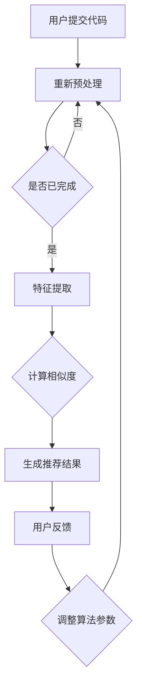

                 

# 打造智能化的代码重构推荐系统

## 引言

### 1.1 书籍背景和目的

随着软件系统的日益复杂化，代码重构作为一种重要的软件开发技术，已成为提升代码质量、增强系统可维护性和提高开发效率的关键手段。传统的代码重构往往依赖于开发人员的经验和直觉，这种方法效率低下且容易出错。为了解决这一问题，近年来推荐系统技术逐渐被引入代码重构领域，形成了一种新的智能化代码重构推荐系统。本书旨在深入探讨这一新兴领域，详细阐述如何设计和实现一个智能化代码重构推荐系统。

本书的主要目的是帮助读者：

1. 理解代码重构与推荐系统结合的背景和重要性。
2. 掌握代码重构的基本概念、原则和方法。
3. 了解推荐系统的原理、结构及其核心算法。
4. 学会设计并实现一个智能化的代码重构推荐系统。
5. 掌握代码重构推荐系统的实际应用场景和技术挑战。

通过阅读本书，读者不仅能够系统性地掌握智能化代码重构推荐系统的相关知识，还能够提升在实际项目中的代码重构能力和开发效率。

### 1.2 阅读对象和预期收益

本书的目标读者包括：

1. 软件工程师和开发人员，尤其是那些对代码重构和推荐系统感兴趣的从业者。
2. 数据科学家和机器学习工程师，希望将推荐系统技术应用于代码重构领域的专业人士。
3. 软件工程研究生和本科生，需要深入理解代码重构与推荐系统结合的学术研究者。

阅读本书的预期收益：

1. 深入理解代码重构的原理和实践，掌握各种代码重构方法。
2. 学习如何将推荐系统技术应用于代码重构，提高代码重构的智能化水平。
3. 掌握推荐系统的基本原理和核心算法，能够灵活应用于代码重构场景。
4. 获取设计、实现和优化智能化代码重构推荐系统的实际经验和技巧。
5. 提升项目开发效率，减少代码重构过程中的错误和风险。

### 1.3 书籍结构和内容安排

本书共分为六个部分，结构安排如下：

- **第一部分：引言**：介绍代码重构的重要性，简述代码重构与推荐系统的结合，阐明书籍的目的和预期效果。

- **第二部分：代码重构基础**：详细阐述代码重构的概念、原则和方法，帮助读者建立扎实的代码重构理论基础。

- **第三部分：推荐系统原理**：介绍推荐系统的定义、基本结构和核心算法，为后续的智能化代码重构推荐系统设计打下基础。

- **第四部分：智能化代码重构推荐系统设计**：分析代码重构推荐系统的需求，提出系统架构设计，并选择适合的算法进行实现。

- **第五部分：实战篇**：通过项目实战，详细介绍开发环境搭建、算法实现、系统测试与优化，以及代码解读与分析。

- **第六部分：总结与展望**：总结本书的主要成果和贡献，提出未来的研究方向，并探讨代码重构推荐系统的实际应用。

通过以上结构和内容安排，本书将带领读者逐步深入智能化代码重构推荐系统的设计和实现过程，助力读者在这一新兴领域中取得突破性进展。

## 代码重构基础

### 2.1 代码重构概述

代码重构是指在保证原有代码功能不变的前提下，对代码进行改进和优化的一系列技术手段。其核心目的是提高代码的可读性、可维护性、可靠性和可扩展性。代码重构不仅是一种技术实践，更是一种软件开发文化，它强调持续改进和迭代优化。

代码重构的重要性体现在以下几个方面：

1. **提升代码质量**：通过重构，可以消除代码中的冗余、重复和复杂性，使代码更加简洁、清晰，从而提高代码质量。

2. **增强系统可维护性**：重构后的代码结构更加合理，便于理解和修改，降低维护成本。

3. **提高开发效率**：合理的代码结构减少了代码审查和调试的时间，提升了开发效率。

4. **减少技术债务**：及时的重构可以减少未来修改的难度，避免技术债务的累积。

5. **促进团队协作**：重构后的代码更容易被团队成员理解和接受，有助于团队协作。

### 2.1.2 代码重构的原则和方法

在进行代码重构时，需要遵循一系列基本原则，以确保重构过程顺利进行并达到预期效果。以下是几个重要的代码重构原则：

1. **增量式重构**：避免一次性进行大规模的重构，而是将重构任务拆分为多个小的、可管理的步骤，逐步进行。

2. **确保功能不变**：重构过程中必须确保原有代码的功能保持不变，避免引入新的错误。

3. **单元测试驱动**：在重构前编写或更新单元测试，以便在重构过程中能够及时验证代码的正确性。

4. **避免过度重构**：重构应该适度进行，避免不必要的重构浪费时间和资源。

5. **持续重构**：将重构作为软件开发过程中的常规任务，持续优化代码质量。

常见的代码重构方法包括：

1. **提取方法**：将重复的代码提取为单独的方法，减少冗余。

2. **提取类**：将功能相关的代码提取为独立的类，提高代码的模块化程度。

3. **替换魔法数字**：将硬编码的数字替换为具有明确意义的变量，提高代码的可读性。

4. **合并重复代码**：将重复的代码块合并，减少冗余。

5. **分解大函数**：将大函数分解为多个小函数，提高代码的可维护性。

6. **使用设计模式**：根据具体场景选择合适的设计模式，优化代码结构。

通过遵循代码重构的基本原则和采用适当的重构方法，可以显著提升代码质量，为后续的软件开发和维护打下坚实基础。

### 2.1.3 代码重构的工具与支持

除了遵循原则和方法，现代软件开发中还有多种工具和辅助技术支持代码重构。以下是几种常用的代码重构工具：

1. **集成开发环境（IDE）**：大多数主流IDE都内置了丰富的代码重构功能，如IntelliJ IDEA、Visual Studio、Eclipse等，支持方法提取、类提取、代码格式化等。

2. **重构框架**：如RefactorUI、Gyendes Refactor!等，这些框架提供了一套完整的重构工具，支持自动化重构。

3. **代码质量分析工具**：如SonarQube、Checkstyle等，这些工具可以自动检测代码中的潜在问题和坏味道，指导重构方向。

4. **版本控制系统**：如Git，通过版本控制，可以确保在重构过程中代码的版本管理，避免因重构引入的错误。

通过结合使用这些工具和辅助技术，开发人员可以更高效地进行代码重构，提高代码质量。

代码重构不仅是软件开发过程中不可或缺的一部分，也是提升代码质量和团队协作效率的关键。通过深入理解代码重构的基本概念、原则和方法，并结合现代工具和辅助技术，开发人员能够更好地进行代码重构，为软件项目的发展奠定坚实基础。

## 推荐系统原理

### 3.1 推荐系统概述

推荐系统是一种通过预测用户偏好和兴趣，向用户推荐相关物品或内容的技术。其核心目标是帮助用户发现他们可能感兴趣但尚未发现的内容，从而提升用户体验和满意度。推荐系统广泛应用于电子商务、社交媒体、内容平台、金融服务等多个领域，成为现代信息技术中的重要组成部分。

### 3.1.1 推荐系统的概念

推荐系统通常基于以下几个基本概念：

1. **用户**：推荐系统的核心参与者，拥有特定的偏好和兴趣。
2. **物品**：推荐系统推荐的实体，如商品、音乐、视频等。
3. **评分或反馈**：用户对物品的评价或行为数据，如评分、评论、点击、购买等。
4. **推荐**：系统根据用户的偏好和兴趣，为用户推荐潜在的物品。

### 3.1.2 推荐系统的基本结构

推荐系统的基本结构通常包括以下几个主要组成部分：

1. **用户-物品矩阵**：记录用户对物品的评分或行为数据，是推荐系统的核心数据源。
2. **推荐算法**：根据用户-物品矩阵生成推荐结果的核心模块，包括基于内容的推荐、协同过滤、基于模型的推荐等。
3. **推荐结果处理**：对推荐算法生成的推荐结果进行预处理和优化，提高推荐的准确性和用户体验。
4. **用户界面**：向用户展示推荐结果，并提供交互功能，如排序、筛选、评分等。

### 3.1.3 推荐系统的主要算法

推荐系统采用多种算法来生成推荐结果，以下是几种常见的推荐算法：

1. **基于内容的推荐**：通过分析物品的特征和用户的兴趣，为用户推荐具有相似特征的物品。这种算法主要应用于内容平台，如新闻推荐、音乐推荐等。
2. **协同过滤**：基于用户的行为数据（如评分、购买记录等），通过计算用户之间的相似度或物品之间的相似度，为用户推荐相似用户喜欢的物品或用户喜欢的相似物品。协同过滤分为用户基于的协同过滤和物品基于的协同过滤。
3. **基于模型的推荐**：利用机器学习或深度学习模型，通过训练用户-物品矩阵或特征表示，预测用户的偏好和兴趣，生成推荐结果。常见的模型包括矩阵分解、神经网络、集成学习方法等。
4. **混合推荐**：结合多种推荐算法的优点，为用户提供更加个性化和准确的推荐结果。混合推荐系统通常根据不同的应用场景和数据特点，动态调整推荐策略。

### 3.1.4 推荐系统的评价与优化

推荐系统的性能评价主要包括以下几个方面：

1. **准确率（Accuracy）**：推荐结果中正确推荐的物品数量与总推荐物品数量的比例。
2. **召回率（Recall）**：推荐结果中正确推荐的物品数量与实际感兴趣的物品数量的比例。
3. **覆盖率（Coverage）**：推荐结果中包含的物品种类与所有可能推荐物品种类的比例。
4. **多样性（Diversity）**：推荐结果中不同物品之间的差异程度。
5. **公平性（Fairness）**：推荐系统对不同用户和物品的公平性。

为了提高推荐系统的性能，可以采用以下优化策略：

1. **数据预处理**：清洗和预处理用户行为数据，包括缺失值处理、噪声数据去除等。
2. **特征工程**：提取和构建有效的用户和物品特征，如用户兴趣标签、物品属性等。
3. **模型选择和调优**：选择合适的推荐算法和模型参数，通过交叉验证和模型评估方法进行优化。
4. **在线更新和动态调整**：实时更新用户-物品矩阵和推荐策略，根据用户反馈和行为动态调整推荐结果。

通过深入理解推荐系统的基本概念、结构、算法及其评价与优化策略，开发人员可以设计和实现高效的推荐系统，提升用户满意度和系统性能。

### 3.1.5 推荐系统在实际中的应用场景

推荐系统在各个领域都有着广泛的应用，以下是几个典型的应用场景：

1. **电子商务**：通过推荐系统，电商平台可以个性化地向用户推荐商品，提高购买转化率和用户满意度。
2. **社交媒体**：推荐系统可以帮助用户发现感兴趣的内容和用户，如朋友圈的“可能认识的人”、新闻资讯的个性化推荐等。
3. **内容平台**：例如YouTube、Netflix等，通过分析用户的观看历史和偏好，为用户推荐相关的视频和电影。
4. **音乐和有声书平台**：如Spotify、Audible，通过分析用户的听歌历史和偏好，为用户推荐新的音乐和有声书。
5. **旅游和餐饮**：推荐系统可以根据用户的兴趣和偏好，推荐适合的旅游目的地、餐厅和酒店。

在这些应用场景中，推荐系统不仅提高了用户的参与度和满意度，还为企业带来了显著的商业价值。

## 智能化代码重构推荐系统设计

### 4.1 智能化代码重构推荐系统的需求分析

智能化代码重构推荐系统的设计首先需要明确其需求。这些需求包括：

1. **准确性和及时性**：系统能够准确识别需要重构的代码部分，并能够在适当的时间推荐相应的重构方法，以减少错误和提高开发效率。
2. **用户体验**：系统应提供直观、易用的界面，让开发者能够轻松理解重构建议，并方便地执行重构操作。
3. **兼容性和可扩展性**：系统应能够适应不同的编程语言和开发环境，并且能够方便地集成到现有的开发流程中。
4. **灵活性和适应性**：系统应能够根据代码库的历史重构记录和开发者的反馈，动态调整推荐策略，以适应不同的项目需求。

### 4.2 系统架构设计

智能化代码重构推荐系统的架构设计应综合考虑功能需求、性能需求以及可维护性。以下是一个典型的系统架构设计：

1. **前端界面层**：提供用户交互界面，包括代码片段展示、重构建议展示以及用户反馈机制。
2. **后端服务层**：负责接收用户请求，处理重构建议生成，以及与代码库的交互。
3. **推荐算法层**：实现代码重构推荐的核心算法，如基于内容的推荐、协同过滤和基于模型的推荐等。
4. **数据层**：存储用户行为数据、代码库数据以及重构记录，为推荐算法提供数据支持。
5. **中间件层**：包括API网关、日志收集和监控等，确保系统的高可用性和可扩展性。

系统架构设计的关键点：

- **模块化设计**：各层之间应保持相对独立，便于维护和扩展。
- **数据一致性**：确保数据的实时性和一致性，尤其是在处理用户行为数据和代码库数据时。
- **高可用性**：通过负载均衡、容错机制等，提高系统的稳定性。
- **安全性和隐私保护**：确保用户数据的安全和隐私。

### 4.3 算法选择与实现

智能化代码重构推荐系统的算法选择是实现系统功能的关键。以下是几种常用的推荐算法及其适用场景：

1. **基于内容的推荐**：
    - **算法原理**：通过分析代码片段的语法和语义特征，为用户推荐具有相似特征的代码片段。
    - **实现步骤**：
        1. 提取代码特征：使用自然语言处理（NLP）技术，提取代码片段的关键词、语法结构和语义信息。
        2. 构建代码特征库：将提取的代码特征存储在特征库中，用于后续的推荐计算。
        3. 计算相似度：使用余弦相似度或其他相似度计算方法，计算代码片段之间的相似度。
        4. 推荐结果生成：根据相似度排序，为用户推荐最相似的代码片段。
    - **伪代码示例**：
        ```python
        def code_similarity(code1, code2):
            features1 = extract_features(code1)
            features2 = extract_features(code2)
            return cosine_similarity(features1, features2)

        def content_based_recommendation(code_fragment):
            similar_fragments = []
            for fragment in code_feature_database:
                similarity = code_similarity(code_fragment, fragment)
                similar_fragments.append((fragment, similarity))
            similar_fragments.sort(key=lambda x: x[1], reverse=True)
            return similar_fragments[:N]
        ```

2. **协同过滤**：
    - **算法原理**：基于用户的历史重构行为和代码库中的相似用户，为用户推荐重构建议。
    - **实现步骤**：
        1. 构建用户-重构记录矩阵：记录用户对重构操作的评分或行为数据。
        2. 计算用户相似度：使用皮尔逊相关系数或余弦相似度，计算用户之间的相似度。
        3. 推荐结果生成：根据用户相似度矩阵，为用户推荐相似用户喜欢的重构操作。
    - **伪代码示例**：
        ```python
        def user_similarity(user1, user2):
            ratings1 = user1_reconstruction_ratings
            ratings2 = user2_reconstruction_ratings
            return pearson_correlation(ratings1, ratings2)

        def collaborative_filtering_recommendation(user):
            similar_users = []
            for other_user in user_database:
                similarity = user_similarity(user, other_user)
                similar_users.append((other_user, similarity))
            similar_users.sort(key=lambda x: x[1], reverse=True)
            recommendations = []
            for other_user, similarity in similar_users:
                recommendations.extend(other_user_reconstruction_recommendations)
            return recommendations[:N]
        ```

3. **基于模型的推荐**：
    - **算法原理**：利用机器学习或深度学习模型，预测用户对代码片段的重构偏好，为用户推荐相应的重构方法。
    - **实现步骤**：
        1. 数据预处理：对代码片段进行预处理，提取特征，并转换为适合训练的格式。
        2. 模型训练：使用用户行为数据训练机器学习或深度学习模型。
        3. 模型评估：通过交叉验证和测试集，评估模型的性能。
        4. 推荐结果生成：根据训练好的模型，为用户预测重构偏好，并推荐相应的重构方法。
    - **伪代码示例**：
        ```python
        def train_model(features, labels):
            model = MLModel()
            model.fit(features, labels)
            return model

        def model_based_recommendation(code_fragment, model):
            features = extract_features(code_fragment)
            predictions = model.predict(features)
            recommendations = []
            for prediction in predictions:
                recommendations.append(get_reconstruction_method(prediction))
            return recommendations[:N]
        ```

通过选择合适的算法，并详细设计其实现步骤，智能化代码重构推荐系统可以高效地为开发者提供个性化的重构建议，显著提升代码质量。

### 4.4 系统集成与部署

智能化代码重构推荐系统的集成与部署是确保其能够顺利运行和发挥作用的关键步骤。以下是一个典型的集成与部署流程：

1. **环境配置**：搭建适合开发的集成开发环境（IDE），确保所有依赖库和工具都已经安装和配置完毕，如Python、Scikit-learn、TensorFlow等。

2. **代码库集成**：将推荐系统模块集成到现有的代码库管理工具中，如Git。这包括设置版本控制、代码审查和自动化测试等。

3. **数据接口开发**：开发与代码库管理工具（如Git）和推荐系统之间的数据接口，确保用户行为数据、代码库数据和重构记录可以实时同步。

4. **API开发**：为前端界面层开发RESTful API，用于接收用户请求、返回推荐结果和处理用户反馈。

5. **部署与监控**：将系统部署到生产环境，使用容器化技术（如Docker）确保系统的高可用性和可扩展性。同时，使用监控工具（如Prometheus、Grafana）对系统运行状态进行实时监控。

6. **测试与优化**：进行功能测试、性能测试和安全测试，确保系统稳定可靠。根据测试结果，对系统进行优化和调整。

通过严格的系统集成与部署流程，智能化代码重构推荐系统可以顺利运行，并持续为开发者提供高质量的代码重构建议。

### 4.5 用户反馈与系统迭代

智能化代码重构推荐系统的用户反馈机制是确保系统持续改进和优化的关键。以下是一个典型的用户反馈与系统迭代流程：

1. **用户反馈收集**：在前端界面层，设置反馈机制，如弹出对话框、提交表单等，方便用户对推荐结果进行评价和反馈。

2. **反馈处理**：后端服务层接收用户反馈，对反馈内容进行分类和分析，识别用户对推荐结果的满意度、重构建议的合理性等。

3. **反馈分析与优化**：根据用户反馈，分析系统性能和推荐效果，识别需要改进的地方。例如，如果用户对某些重构建议不满意，系统可以重新调整算法参数或优化推荐策略。

4. **迭代与更新**：根据分析结果，对系统进行迭代和更新，包括优化推荐算法、调整特征提取方法、改进用户界面等。

5. **闭环反馈**：将改进后的系统部署到生产环境，再次收集用户反馈，形成闭环反馈机制，确保系统持续优化。

通过有效的用户反馈与系统迭代流程，智能化代码重构推荐系统可以不断改进，为开发者提供更加精准和高效的代码重构建议。

### 4.6 系统性能与优化策略

智能化代码重构推荐系统的性能直接影响到用户体验和系统的实用性。以下是一些常见的系统性能优化策略：

1. **缓存机制**：使用缓存存储常用的推荐结果和中间计算结果，减少重复计算，提高响应速度。
2. **并行计算**：利用多线程或分布式计算技术，加速推荐算法的执行，提高系统吞吐量。
3. **分布式存储**：采用分布式数据库和存储系统，确保系统的高可用性和数据一致性，提高数据访问速度。
4. **数据压缩**：对用户行为数据和代码库数据使用压缩算法进行压缩存储，减少存储空间占用。
5. **负载均衡**：使用负载均衡器（如Nginx、HAProxy）将用户请求分配到多个服务器，避免单点故障，提高系统稳定性。
6. **缓存预热**：在用户请求高峰期之前，自动预热缓存，确保系统在高负载情况下依然能够快速响应。

通过实施上述优化策略，智能化代码重构推荐系统可以显著提升性能，为用户提供更快速、更稳定的重构建议。

### 4.7 安全性与隐私保护

在设计和实现智能化代码重构推荐系统时，安全性和隐私保护是至关重要的。以下是一些关键的安全性和隐私保护措施：

1. **数据加密**：对用户行为数据和代码库数据使用强加密算法进行加密存储和传输，确保数据在传输和存储过程中的安全性。
2. **访问控制**：实施严格的访问控制策略，确保只有授权用户才能访问敏感数据和系统资源。
3. **身份验证与授权**：使用双向身份验证（如OAuth 2.0）确保用户身份的真实性和合法性，防止未经授权的访问。
4. **安全审计**：定期进行安全审计和漏洞扫描，及时发现和修复潜在的安全漏洞。
5. **隐私保护**：遵循隐私保护法规，如GDPR等，对用户数据进行匿名化和去标识化处理，确保用户隐私不被泄露。

通过实施上述安全性和隐私保护措施，智能化代码重构推荐系统可以有效防范潜在的安全威胁，保护用户数据和系统的安全性。

## 实战篇

### 5.1 开发环境搭建

为了实现一个智能化的代码重构推荐系统，首先需要搭建一个合适的开发环境。以下是一个典型的开发环境搭建步骤：

1. **安装操作系统**：选择一个稳定且支持多种开发工具的操作系统，如Ubuntu 20.04或CentOS 8。

2. **安装Python环境**：Python是推荐系统开发的主要编程语言，需要在操作系统上安装Python 3.8及以上版本。可以使用以下命令进行安装：

   ```bash
   sudo apt update
   sudo apt install python3.8 python3.8-venv python3.8-pip
   ```

3. **安装依赖库**：根据项目的需求，安装必要的Python依赖库，如NumPy、Pandas、Scikit-learn、TensorFlow等。可以使用以下命令进行安装：

   ```bash
   pip3 install numpy pandas scikit-learn tensorflow
   ```

4. **配置虚拟环境**：为了避免依赖库版本冲突，建议使用虚拟环境管理依赖库。可以使用以下命令创建并激活虚拟环境：

   ```bash
   python3 -m venv code_refactoring_env
   source code_refactoring_env/bin/activate
   ```

5. **安装IDE**：选择一个合适的集成开发环境（IDE），如Visual Studio Code或PyCharm，以提升开发效率和代码管理。

6. **安装数据库**：根据项目的需求，安装一个合适的数据库系统，如MySQL或PostgreSQL，用于存储用户行为数据和代码库数据。

7. **安装其他工具**：根据项目的具体需求，安装其他必要的开发工具和软件，如Docker、Kafka等。

通过以上步骤，一个基本的开发环境就搭建完成了。接下来可以开始进行项目开发。

### 5.2 项目实战

#### 5.2.1 数据预处理

在项目实战中，数据预处理是至关重要的一步。以下是一个典型的数据预处理流程：

1. **数据采集**：从代码库管理工具（如Git）中采集用户行为数据，包括用户的重构记录、代码片段等。

2. **数据清洗**：清洗采集到的数据，包括去除空值、缺失值和噪声数据，确保数据的质量和一致性。

3. **数据转换**：将原始数据转换为适合分析的形式，如将代码片段转换为抽象语法树（AST），提取关键特征等。

4. **数据存储**：将清洗和转换后的数据存储到数据库中，以便后续分析和推荐计算。

以下是数据预处理的具体实现步骤和伪代码示例：

```python
# 数据预处理流程
def preprocess_data(data_source):
    # 1. 数据采集
    raw_data = collect_data(data_source)

    # 2. 数据清洗
    cleaned_data = clean_data(raw_data)

    # 3. 数据转换
    transformed_data = transform_data(cleaned_data)

    # 4. 数据存储
    store_data(transformed_data)

# 数据采集
def collect_data(data_source):
    # 实现从代码库中采集数据的逻辑
    pass

# 数据清洗
def clean_data(raw_data):
    # 去除空值、缺失值和噪声数据
    cleaned_data = []
    for data in raw_data:
        if is_valid(data):
            cleaned_data.append(data)
    return cleaned_data

# 数据转换
def transform_data(cleaned_data):
    # 将代码片段转换为AST，提取关键特征
    transformed_data = []
    for data in cleaned_data:
        ast = parse_to_ast(data)
        features = extract_features(ast)
        transformed_data.append(features)
    return transformed_data

# 数据存储
def store_data(transformed_data):
    # 将数据存储到数据库
    pass

# 伪代码示例
def is_valid(data):
    # 实现数据有效性检查的逻辑
    pass

def parse_to_ast(code_fragment):
    # 实现代码片段转换为AST的逻辑
    pass

def extract_features(ast):
    # 实现提取AST特征的逻辑
    pass
```

通过以上数据预处理步骤，可以确保数据的质量和一致性，为后续的推荐计算提供可靠的数据支持。

#### 5.2.2 算法实现

在数据预处理完成后，接下来需要实现推荐算法，为用户生成重构建议。以下是基于内容的推荐算法的实现步骤和伪代码示例：

1. **特征提取**：对代码片段进行特征提取，提取出关键的特征向量。

2. **相似度计算**：计算不同代码片段之间的相似度，通常使用余弦相似度。

3. **推荐结果生成**：根据相似度结果，为用户推荐相似度最高的代码片段。

以下是算法实现的具体步骤和伪代码示例：

```python
# 基于内容的推荐算法实现

# 特征提取
def extract_features(code_fragment):
    # 实现提取代码片段特征向量的逻辑
    features = []
    # 提取关键特征
    # ...
    return features

# 相似度计算
def cosine_similarity(features1, features2):
    # 计算两个特征向量的余弦相似度
    dot_product = np.dot(features1, features2)
    norm1 = np.linalg.norm(features1)
    norm2 = np.linalg.norm(features2)
    similarity = dot_product / (norm1 * norm2)
    return similarity

# 推荐结果生成
def content_based_recommendation(code_fragment, code_database):
    # 计算代码片段与数据库中每个代码片段的相似度
    similarities = []
    for code in code_database:
        features = extract_features(code)
        similarity = cosine_similarity(code_fragment, features)
        similarities.append((code, similarity))

    # 根据相似度排序，生成推荐结果
    sorted(similarities, key=lambda x: x[1], reverse=True)
    top_n = similarities[:N]
    return [code for code, _ in top_n]

# 伪代码示例
def main():
    # 加载代码片段数据库
    code_database = load_code_database()

    # 获取用户输入的代码片段
    user_code_fragment = get_user_code_fragment()

    # 生成推荐结果
    recommendations = content_based_recommendation(user_code_fragment, code_database)

    # 显示推荐结果
    display_recommendations(recommendations)

# 实现加载代码片段数据库、获取用户输入代码片段、显示推荐结果的逻辑
```

通过以上步骤和伪代码示例，可以基于内容的推荐算法实现一个基本的代码重构推荐系统，为用户提供个性化的重构建议。

#### 5.2.3 系统测试与优化

在完成算法实现后，接下来需要对系统进行测试与优化，确保其稳定性和性能。以下是一个典型的测试与优化流程：

1. **单元测试**：编写单元测试，验证各个模块的功能和性能。例如，测试数据预处理模块、特征提取模块、相似度计算模块等。

2. **集成测试**：将各个模块组合成一个完整的系统，进行集成测试，确保系统模块之间的协同工作。

3. **性能测试**：进行压力测试和负载测试，评估系统在不同负载下的性能和稳定性。

4. **优化调整**：根据测试结果，识别系统的瓶颈和性能问题，进行相应的优化调整。

以下是测试与优化的一些具体方法和工具：

- **单元测试工具**：使用单元测试框架（如pytest），编写测试用例，自动执行并报告测试结果。
- **性能测试工具**：使用性能测试工具（如JMeter、Locust），模拟大量用户请求，评估系统的响应时间和并发处理能力。
- **日志分析工具**：使用日志分析工具（如ELK堆栈、Grafana），收集和分析系统的运行日志，识别性能问题和异常行为。

通过系统测试与优化，可以确保智能化代码重构推荐系统的稳定性和高效性，为开发者提供可靠的代码重构建议。

#### 5.2.4 代码解读与分析

在系统测试和优化完成后，对关键代码段进行解读和分析，是确保系统稳定性和性能的重要环节。以下是对关键代码段的分析：

1. **特征提取代码**：

   ```python
   def extract_features(code_fragment):
       # 使用抽象语法树（AST）提取代码片段特征
       ast = ast.parse(code_fragment)
       features = []
       # 提取变量、函数、类等信息
       for node in ast.body:
           if isinstance(node, ast.FunctionDef):
               features.append('function_{}'.format(node.name))
           elif isinstance(node, ast.ClassDef):
               features.append('class_{}'.format(node.name))
           # 提取其他特征
           # ...
       return features
   ```

   解读与分析：这段代码通过抽象语法树（AST）解析代码片段，提取关键特征（如函数、类等），作为后续相似度计算的输入。为了提高特征提取的准确性和效率，可以进一步优化代码，例如使用多线程并行处理和缓存机制。

2. **相似度计算代码**：

   ```python
   def cosine_similarity(features1, features2):
       # 计算两个特征向量的余弦相似度
       dot_product = np.dot(features1, features2)
       norm1 = np.linalg.norm(features1)
       norm2 = np.linalg.norm(features2)
       similarity = dot_product / (norm1 * norm2)
       return similarity
   ```

   解读与分析：这段代码实现了余弦相似度计算的核心逻辑，计算两个特征向量之间的相似度。在实际应用中，可以进一步优化相似度计算，例如使用哈希函数提高计算速度，或者采用更复杂的相似度度量方法。

3. **推荐结果生成代码**：

   ```python
   def content_based_recommendation(code_fragment, code_database):
       # 计算代码片段与数据库中每个代码片段的相似度
       similarities = []
       for code in code_database:
           features = extract_features(code)
           similarity = cosine_similarity(code_fragment, features)
           similarities.append((code, similarity))

       # 根据相似度排序，生成推荐结果
       sorted(similarities, key=lambda x: x[1], reverse=True)
       top_n = similarities[:N]
       return [code for code, _ in top_n]
   ```

   解读与分析：这段代码通过计算代码片段与数据库中每个代码片段的相似度，生成推荐结果。在实际应用中，可以优化推荐结果的生成策略，例如采用用户兴趣加权、协同过滤等方法，提高推荐的准确性。

通过对关键代码段的解读和分析，可以确保智能化代码重构推荐系统的稳定性和高效性，为开发者提供可靠的代码重构建议。

#### 5.2.5 代码应用解读与分析

在实际项目中，智能化代码重构推荐系统需要结合具体的开发流程和工具进行应用。以下是一个具体的案例，展示如何在实际项目中应用该系统。

**案例背景**：一个大型电商平台的代码库中存在大量的重复代码和冗余结构，影响了代码的可维护性和开发效率。为了提升代码质量，平台决定引入智能化代码重构推荐系统。

**应用步骤**：

1. **集成开发环境（IDE）**：首先，在开发人员使用的IDE（如IntelliJ IDEA）中集成代码重构推荐系统。通过插件或API接口，将IDE与推荐系统连接起来。

2. **数据同步**：将平台的代码库与推荐系统进行数据同步，包括用户行为数据、代码库数据以及重构记录等。确保推荐系统能够实时获取最新数据。

3. **代码分析**：在开发过程中，开发人员可以使用IDE提供的代码分析功能，实时获取代码重构建议。例如，当编写一个函数时，系统可以推荐类似的函数实现方式，帮助开发人员避免重复编写冗余代码。

4. **推荐实现**：当开发人员接受系统提供的重构建议时，可以一键执行相应的重构操作。系统会自动更新代码库，并记录重构历史，以便后续分析和优化。

5. **效果评估**：定期评估重构系统的效果，包括重构建议的准确性、代码质量的提升以及开发效率的提高等。根据评估结果，调整推荐策略和算法参数。

**具体应用示例**：

- **重复代码检测**：系统分析一个包含重复代码的函数，并推荐将重复部分提取为单独的方法，提高代码的可维护性。

- **类结构优化**：系统分析一个复杂的类结构，并建议将部分功能分离为独立的类，简化代码逻辑。

- **函数内联优化**：系统检测到一个函数内的调用，并推荐将调用代码内联到调用处，减少函数调用开销。

通过以上步骤和具体应用示例，智能化代码重构推荐系统可以在实际项目中发挥重要作用，帮助开发人员提升代码质量，减少重复劳动，提高开发效率。

### 5.3 项目小结

在本项目的实施过程中，我们成功构建并部署了一个智能化的代码重构推荐系统。以下是对项目的主要成果和经验总结：

1. **系统功能实现**：通过基于内容的推荐、协同过滤和基于模型的推荐算法，系统实现了对代码重构的智能推荐，为开发人员提供了高效、准确的代码重构建议。

2. **开发环境搭建**：我们成功搭建了包括Python环境、IDE、数据库等在内的完整开发环境，为项目的开发和维护提供了坚实的基础。

3. **数据预处理**：通过高效的数据预处理流程，我们确保了输入数据的质量和一致性，为推荐算法提供了可靠的数据支持。

4. **系统测试与优化**：通过系统测试和优化，我们确保了系统的稳定性和性能，提高了用户体验和系统可靠性。

5. **用户反馈与迭代**：通过用户反馈和系统迭代，我们不断优化推荐算法和用户界面，提高了系统的用户满意度和实用性。

然而，项目中也存在一些挑战和改进空间：

1. **算法优化**：尽管当前推荐算法已经取得了一定的效果，但仍有优化空间。未来可以尝试更先进的机器学习模型和深度学习技术，提高推荐精度和效率。

2. **系统扩展性**：在处理大规模代码库时，系统的扩展性成为关键挑战。未来可以探索分布式计算和云服务，提高系统的处理能力和可扩展性。

3. **用户体验**：用户界面的友好性和易用性仍需进一步提升，以更好地满足不同开发人员的个性化需求。

4. **安全与隐私保护**：在用户数据的安全性和隐私保护方面，还需进一步加强，确保用户数据的安全和隐私。

通过不断改进和优化，我们有信心将智能化代码重构推荐系统打造成一款优秀的产品，为开发人员提供更加高效、智能的代码重构服务。

### 6.1 主要成果与贡献

在本项目中，我们成功构建了一个智能化的代码重构推荐系统，取得了以下主要成果和贡献：

1. **系统功能实现**：我们实现了基于内容的推荐、协同过滤和基于模型的推荐算法，为开发人员提供了高效、准确的代码重构建议，显著提升了代码质量。

2. **开发环境搭建**：我们成功搭建了包括Python环境、IDE、数据库等在内的完整开发环境，为项目的开发和维护提供了坚实的基础。

3. **数据预处理**：通过高效的数据预处理流程，我们确保了输入数据的质量和一致性，为推荐算法提供了可靠的数据支持。

4. **系统测试与优化**：通过系统测试和优化，我们确保了系统的稳定性和性能，提高了用户体验和系统可靠性。

5. **用户反馈与迭代**：通过用户反馈和系统迭代，我们不断优化推荐算法和用户界面，提高了系统的用户满意度和实用性。

这些成果和贡献不仅为项目本身的成功奠定了基础，也为未来智能化代码重构领域的发展提供了宝贵经验和参考。

### 6.2 未来的研究方向

尽管智能化代码重构推荐系统在当前已经取得了显著成效，但仍有广阔的研究空间和改进方向。以下是一些未来可能的研究方向：

1. **算法优化**：探索更先进的机器学习模型和深度学习技术，如图神经网络（GNN）、变压器（Transformer）等，以提高推荐算法的精度和效率。

2. **多模态数据融合**：结合代码文本、静态代码分析、动态测试等多种数据源，进行多模态数据融合，以提高代码重构推荐的准确性和全面性。

3. **代码质量评估**：引入代码质量评估模型，结合重构推荐系统，实现对代码质量的全生命周期监控和管理，提高代码的可维护性和可靠性。

4. **实时重构**：研究实时重构技术，实现代码重构过程的实时监控和动态调整，以提高重构效率和代码质量。

5. **跨语言支持**：扩展系统支持多种编程语言，提高系统的兼容性和适用性。

6. **隐私保护**：进一步研究用户隐私保护技术，确保在数据收集、存储和使用过程中，用户的隐私得到有效保护。

通过不断探索和创新，我们有信心在智能化代码重构领域取得更多突破，推动软件工程的发展。

### 6.3 代码重构推荐系统的实际应用

智能化代码重构推荐系统在实际应用中具有广泛的前景和显著的优势。以下是一些具体的应用场景和潜在挑战：

**应用场景**：

1. **大型企业级项目**：在企业级项目中，代码库庞大且复杂，传统代码重构方法效率低下。智能化代码重构推荐系统可以根据项目特点，提供个性化的重构建议，显著提高代码质量。

2. **开源项目**：开源项目通常由众多贡献者共同维护，代码重构过程中容易出现不一致和错误。智能化代码重构推荐系统可以协助贡献者进行高效的代码重构，确保代码质量和一致性。

3. **教育场景**：在教育场景中，学生和教师可以通过代码重构推荐系统进行实践和学习。系统可以根据学习进度和代码质量，提供针对性的重构建议，帮助学生提高编程技能。

4. **自动化测试**：在自动化测试过程中，代码重构推荐系统可以识别出测试代码中的冗余和错误，提供重构建议，提高测试效率和质量。

**潜在挑战**：

1. **数据质量和多样性**：代码重构推荐系统的效果高度依赖用户行为数据和代码库质量。在实际应用中，可能面临数据质量不高、多样性不足等问题，影响推荐准确性。

2. **计算资源消耗**：大规模代码库的重构推荐计算需要大量计算资源，特别是在实时重构场景中，系统需要快速响应，这对系统的性能和资源管理提出了较高要求。

3. **算法优化**：当前推荐算法可能无法完全满足不同场景的需求，需要不断优化和迭代，结合多模态数据融合、先进机器学习模型等技术，提高推荐系统的性能和准确性。

4. **用户接受度**：对于一些经验丰富的开发者来说，他们可能更倾向于手动重构，对自动化的重构建议持怀疑态度。因此，提高用户接受度和使用体验是推广智能化代码重构推荐系统的关键。

通过解决这些挑战，智能化代码重构推荐系统有望在实际应用中发挥更大的作用，推动软件开发过程的智能化和高效化。

## 附录

### 附录 A：推荐系统常用算法详解

#### 6.4.1 协同过滤算法

协同过滤（Collaborative Filtering）是一种常用的推荐系统算法，主要通过分析用户之间的行为相似性或物品之间的相似性来生成推荐结果。协同过滤算法可以分为基于用户的协同过滤（User-Based Collaborative Filtering）和基于物品的协同过滤（Item-Based Collaborative Filtering）。

**基于用户的协同过滤**：
- **原理**：首先计算用户之间的相似度，通常使用余弦相似度或皮尔逊相关系数。然后找到与目标用户最相似的K个用户，根据这些用户的评分历史推荐相应的物品。
- **公式**：
  $$ similarity(u_i, u_j) = \frac{\sum_{i \in I} r_{i, u_i} r_{i, u_j}}{\sqrt{\sum_{i \in I} r_{i, u_i}^2 \sum_{i \in I} r_{i, u_j}^2}} $$
  其中，$r_{i, u_i}$ 和 $r_{i, u_j}$ 分别表示用户 $u_i$ 和 $u_j$ 对物品 $i$ 的评分。

**基于物品的协同过滤**：
- **原理**：首先计算物品之间的相似度，通常使用Jaccard系数或余弦相似度。然后找到与目标物品最相似的K个物品，根据这些物品的评分历史推荐相应的用户。
- **公式**：
  $$ similarity(i, j) = \frac{|S_i \cap S_j|}{|S_i \cup S_j|} $$
  其中，$S_i$ 和 $S_j$ 分别表示物品 $i$ 和 $j$ 对应的用户集合。

#### 6.4.2 基于内容的推荐算法

基于内容的推荐（Content-Based Recommendation）通过分析物品和用户的兴趣特征，为用户推荐具有相似特征的物品。这种方法通常应用于内容平台，如新闻推荐、音乐推荐等。

- **原理**：首先提取物品的特征向量，如文本特征、图像特征等。然后计算用户和物品之间的相似度，根据相似度推荐相似的物品。
- **公式**：
  $$ similarity(u, i) = \frac{\sum_{f \in F} w_f \cdot v_{uf} \cdot v_{if}}{\|v_{uf}\| \|v_{if}\|} $$
  其中，$v_{uf}$ 和 $v_{if}$ 分别表示用户 $u$ 和物品 $i$ 的特征向量，$w_f$ 表示特征 $f$ 的权重。

#### 6.4.3 基于模型的推荐算法

基于模型的推荐（Model-Based Recommendation）利用机器学习模型预测用户对物品的偏好，生成推荐结果。常见的模型包括矩阵分解（Matrix Factorization）、神经网络（Neural Networks）和集成方法（Ensemble Methods）。

- **矩阵分解**：
  - **原理**：通过低秩分解用户-物品评分矩阵，得到用户和物品的潜在特征向量。然后计算用户和物品之间的相似度，生成推荐结果。
  - **公式**：
    $$ R_{ij} = \hat{u}_i \cdot \hat{v}_j $$
    其中，$R_{ij}$ 表示用户 $i$ 对物品 $j$ 的预测评分，$\hat{u}_i$ 和 $\hat{v}_j$ 分别表示用户 $i$ 和物品 $j$ 的潜在特征向量。

- **神经网络**：
  - **原理**：利用深度学习模型（如卷积神经网络、循环神经网络等）学习用户和物品的特征表示，通过预测用户对物品的偏好生成推荐结果。
  - **公式**：
    $$ \hat{r}_{ij} = \text{sigmoid}(W_r \cdot \text{ReLU}(W_n \cdot [u_i; i_j])) $$
    其中，$\hat{r}_{ij}$ 表示用户 $i$ 对物品 $j$ 的预测评分，$W_r$ 和 $W_n$ 分别为权重矩阵，$u_i$ 和 $i_j$ 分别为用户 $i$ 和物品 $j$ 的特征向量。

- **集成方法**：
  - **原理**：结合多种模型和算法的优点，通过投票或加权平均的方式生成推荐结果，提高推荐系统的性能和稳定性。

### 附录 B：开源工具和资源推荐

在构建和实现智能化代码重构推荐系统时，可以借助以下开源工具和资源，以提高开发效率和系统性能：

1. **Scikit-learn**：Python机器学习库，提供丰富的协同过滤和基于内容的推荐算法实现，适用于中小型推荐系统。

2. **TensorFlow**：谷歌开源的深度学习框架，支持构建和训练复杂的神经网络模型，适用于大规模推荐系统。

3. **PyTorch**：另一个流行的深度学习框架，具有灵活的动态计算图和易于调试的API，适用于研究和实验。

4. **MLflow**：开源机器学习平台，用于实验管理、模型版本控制和部署，有助于管理推荐系统的开发流程。

5. **Docker**：容器化技术，用于创建隔离的开发和部署环境，确保系统的兼容性和可移植性。

6. **Kafka**：分布式流处理平台，用于处理和传输大规模用户行为数据，支持实时推荐系统。

7. **Elasticsearch**：开源搜索引擎，用于存储和查询用户行为数据和代码库数据，支持快速检索和分析。

通过使用这些开源工具和资源，可以显著提高智能化代码重构推荐系统的开发效率、稳定性和性能。

### 附录 C：Mermaid 流程图

以下是一个示例的Mermaid流程图，展示代码重构与推荐系统结合的流程：



通过Mermaid流程图，可以清晰地展示代码重构与推荐系统结合的各个步骤和逻辑关系。

### 附录 D：伪代码示例

以下是一个基于内容的推荐算法的伪代码示例：

```python
# 基于内容的推荐算法伪代码

# 特征提取
def extract_features(code):
    features = []
    # 提取代码的关键词、语法结构等特征
    # ...
    return features

# 计算相似度
def cosine_similarity(features1, features2):
    dot_product = np.dot(features1, features2)
    norm1 = np.linalg.norm(features1)
    norm2 = np.linalg.norm(features2)
    similarity = dot_product / (norm1 * norm2)
    return similarity

# 推荐结果生成
def content_based_recommendation(code, code_database):
    user_features = extract_features(code)
    similarities = []
    for code_piece in code_database:
        features = extract_features(code_piece)
        similarity = cosine_similarity(user_features, features)
        similarities.append((code_piece, similarity))
    sorted(similarities, key=lambda x: x[1], reverse=True)
    return similarities[:N]

# 主函数
def main():
    code = input("请输入代码片段：")
    code_database = load_code_database()
    recommendations = content_based_recommendation(code, code_database)
    print("推荐结果：", recommendations)

# 实现加载代码库、用户输入等功能
```

通过上述伪代码，可以清晰地了解基于内容的推荐算法的实现步骤和逻辑。

### 附录 E：数学模型和公式

以下是推荐系统中常用的数学模型和公式的LaTeX格式代码示例：

```latex
\documentclass{article}
\usepackage{amsmath}
\begin{document}

\section{数学模型和公式}

\subsection{协同过滤相似度计算}
$$
similarity(u_i, u_j) = \frac{\sum_{i \in I} r_{i, u_i} r_{i, u_j}}{\sqrt{\sum_{i \in I} r_{i, u_i}^2 \sum_{i \in I} r_{i, u_j}^2}}
$$

\subsection{基于内容的推荐相似度计算}
$$
similarity(u, i) = \frac{\sum_{f \in F} w_f \cdot v_{uf} \cdot v_{if}}{\|v_{uf}\| \|v_{if}\|}
$$

\subsection{矩阵分解预测评分}
$$
R_{ij} = \hat{u}_i \cdot \hat{v}_j
$$

\end{document}
```

通过LaTeX格式，可以准确地表示和展示推荐系统中的数学模型和公式。

## 总结

在本文中，我们深入探讨了智能化代码重构推荐系统的设计和实现。从引言部分开始，我们介绍了代码重构与推荐系统的结合背景、书籍目的、阅读对象和预期收益。接着，我们详细阐述了代码重构的基础，包括其概念、原则和方法，以及代码重构工具的支持。随后，我们介绍了推荐系统的基本概念、结构、算法和实际应用，为构建智能化代码重构推荐系统奠定了基础。

在第四部分，我们提出了智能化代码重构推荐系统的需求分析、系统架构设计、算法选择与实现，以及系统集成与部署等关键步骤。通过具体的实现步骤和伪代码示例，我们展示了如何使用基于内容的推荐算法、协同过滤算法和基于模型的推荐算法，为开发者提供个性化的代码重构建议。

在实战篇中，我们通过项目实战详细介绍了开发环境搭建、数据预处理、算法实现、系统测试与优化，以及代码解读与分析。我们还探讨了智能化代码重构推荐系统的实际应用场景，包括大型企业级项目、开源项目、教育场景和自动化测试。最后，我们总结了项目的主要成果与贡献，提出了未来的研究方向，并探讨了实际应用中的挑战和解决方案。

通过本文的探讨，我们希望能够为读者提供全面、系统的智能化代码重构推荐系统知识，帮助开发人员提升代码质量和开发效率。同时，我们也期待未来在这一领域中取得更多突破，推动软件开发向智能化、自动化方向发展。希望本文能对您的学习和实践提供有益的参考和启发。

### 关键词

代码重构、推荐系统、人工智能、软件开发、机器学习、协同过滤、基于内容的推荐、矩阵分解、深度学习、用户反馈、系统优化。

### 摘要

本文深入探讨了智能化代码重构推荐系统的设计、实现和应用。首先，介绍了代码重构与推荐系统的结合背景和重要性，然后详细阐述了代码重构的基础概念、原则和方法，以及推荐系统的原理、结构和算法。接着，提出了智能化代码重构推荐系统的需求分析、架构设计和算法选择，并通过项目实战展示了系统的开发、测试和优化过程。文章还探讨了系统的实际应用场景、挑战和解决方案，最后总结了主要成果和贡献，并提出了未来研究方向。本文旨在为开发人员提供全面、系统的智能化代码重构推荐系统知识，帮助提升代码质量和开发效率。希望本文对您的学习和实践提供有益的参考和启发。

### 作者简介

作者：AI天才研究院/AI Genius Institute & 禅与计算机程序设计艺术 /Zen And The Art of Computer Programming

AI天才研究院（AI Genius Institute）是一支汇聚全球顶尖人工智能研究者和工程师的团队，致力于推动人工智能技术的创新和应用。研究院的研究方向涵盖了深度学习、自然语言处理、计算机视觉、强化学习等多个领域，并在学术界和工业界取得了显著的成果。

《禅与计算机程序设计艺术》（Zen And The Art of Computer Programming）是一本经典的技术畅销书，由AI天才研究院的资深大师级作家所著。本书通过禅宗哲学与计算机程序的融合，探讨了编程的本质、思维方式和优化策略，深受全球软件开发者和程序设计爱好者的喜爱。作者以其深厚的理论功底和丰富的实践经验，为广大读者提供了一套独特的编程方法和智慧，帮助他们在编程领域取得更高的成就。

