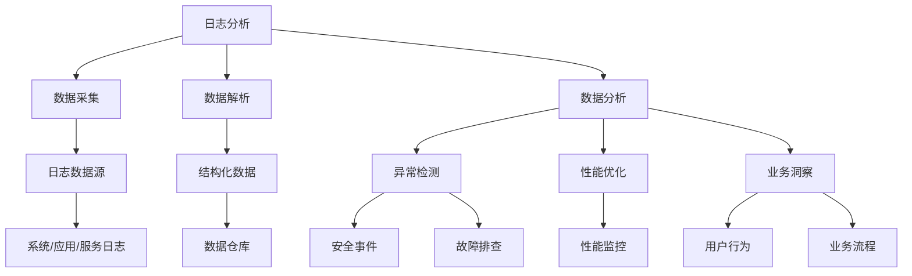

                 

### 日志分析的定义与价值

日志分析是一种通过对系统、应用或服务产生的日志文件进行深入解析、归纳和统计，以获取有价值信息和洞察的技术。日志文件通常包含了系统的运行状态、操作记录、错误报告等各种信息，是理解和维护系统运行状况的重要数据源。

#### 日志分析的概念

日志分析（Log Analysis）可以定义为以下三个核心组成部分：

1. **数据采集**：从各个系统、应用或服务中收集日志数据，这些数据可以存储在文件、数据库或其他存储系统中。

2. **数据解析**：对采集到的日志数据进行结构化处理，提取关键信息，将其转化为可分析的数据格式。

3. **数据分析**：利用各种算法和分析工具对结构化后的日志数据进行深入分析，识别潜在的异常、趋势和模式。

#### 日志分析的价值

日志分析在现代企业中的作用不可忽视，主要体现在以下几个方面：

1. **故障排查与系统监控**：通过分析日志，运维团队能够快速定位系统故障的原因，及时进行修复。同时，持续监控日志可以帮助发现系统性能瓶颈和潜在问题。

2. **安全事件检测**：日志数据可以帮助安全团队识别恶意攻击、安全漏洞和其他安全威胁。通过对日志数据的实时分析，可以及时发现并响应安全事件。

3. **性能优化**：日志分析可以提供系统性能的数据支持，帮助企业了解系统的运行效率，定位性能瓶颈，进行针对性的优化。

4. **业务洞察**：日志分析可以揭示用户行为、业务流程中的异常情况，为业务决策提供数据支持。

#### 日志分析的发展历程

日志分析技术的发展经历了以下几个阶段：

1. **传统日志分析**：早期，日志分析主要通过手动查看日志文件，然后根据错误信息进行问题排查。这种方法的效率低下，且容易遗漏重要信息。

2. **自动化日志分析**：随着日志量的增长，自动化工具如 grep、awk 等被引入日志分析中，提高了数据处理的效率。但这种方法仍然依赖于人工预设规则，灵活性较低。

3. **现代日志分析**：近年来，随着大数据和人工智能技术的发展，日志分析逐渐引入了数据挖掘、机器学习等技术，实现了日志数据的智能分析和异常检测。

#### 日志分析面临的挑战

尽管日志分析具有巨大的价值，但在实际应用中也面临一些挑战：

1. **日志数据量巨大**：随着系统复杂度的增加，日志数据量呈指数级增长，如何高效地存储和管理这些数据是一个难题。

2. **多样化的日志格式**：不同的系统、应用和服务的日志格式可能各不相同，如何统一格式并进行有效分析是一个挑战。

3. **异常日志的检测与处理**：在大量的日志数据中，如何快速准确地检测出异常日志，并进行相应的处理，是日志分析的一个难点。

### 总结

日志分析是一种重要的技术手段，通过对日志数据的深入分析和挖掘，可以帮助企业提高系统可靠性、优化运维效率、保障网络安全并支持业务决策。然而，随着日志数据量的增加和日志格式的多样化，日志分析也面临着新的挑战。接下来，我们将进一步探讨日志分析平台的架构设计和构建方法。

### 核心概念原理之间的联系架构图

为了更好地理解日志分析的核心概念和原理，我们可以通过一个Mermaid流程图来展示它们之间的联系。



这个图展示了日志分析的基本流程和各个核心概念之间的联系。日志数据源（J）通过数据采集（B）和解析（C）转化为结构化数据（F），然后用于数据分析（D），具体包括异常检测（G）、性能优化（H）和业务洞察（I）。

### 数据采集与预处理的核心算法原理讲解

在日志分析过程中，数据采集和预处理是至关重要的环节。这两步不仅决定了后续分析的质量，还直接影响到日志分析平台的性能和效率。以下将详细讲解数据采集与预处理的核心算法原理。

#### 1. 数据采集

数据采集（Data Collection）是将系统、应用或服务产生的日志数据收集到一起的过程。常用的数据采集方法包括：

- **文件系统采集**：通过定期读取日志文件，将文件内容发送到中央日志收集系统。

  ```python
  def read_log_file(file_path):
      with open(file_path, 'r') as file:
          for line in file:
              process_log_line(line)

  def process_log_line(line):
      # 处理日志行，如解析、清洗等
      pass
  ```

- **网络流量采集**：通过监控网络流量，捕获并分析日志数据。

  ```python
  import scapy.all as scapy

  def capture_traffic():
      packets = scapy.sniff(count=10)
      for packet in packets:
          process_packet(packet)

  def process_packet(packet):
      # 从数据包中提取日志信息，如源IP、目标IP等
      pass
  ```

- **日志收集工具**：如Logstash、Fluentd等，它们可以自动收集不同来源的日志数据，并进行初步处理。

  ```python
  import logging

  logger = logging.getLogger('my_logger')
  logger.setLevel(logging.INFO)
  handler = logging.FileHandler('logstash-input.log')
  formatter = logging.Formatter('%(asctime)s - %(name)s - %(levelname)s - %(message)s')
  handler.setFormatter(formatter)
  logger.addHandler(handler)

  def log_event(event):
      logger.info(event)
  ```

#### 2. 数据预处理

数据预处理（Data Preprocessing）是对采集到的日志数据进行清洗、转换和归一化，使其符合分析需求的过程。以下是一些常用的预处理算法：

- **数据清洗**：去除无效数据、纠正错误数据，保证数据质量。

  ```python
  def clean_data(data):
      # 删除空行、注释行等无效数据
      valid_data = [line for line in data if line.strip() and not line.startswith('#')]
      return valid_data
  ```

- **数据转换**：将非结构化的日志数据转换为结构化的数据格式，如JSON、CSV等。

  ```python
  import csv

  def convert_to_csv(log_lines, output_file):
      with open(output_file, 'w', newline='') as file:
          writer = csv.writer(file)
          for line in log_lines:
              fields = line.split(',')
              writer.writerow(fields)
  ```

- **数据归一化**：将不同单位、格式或范围的数据转换为统一的格式，便于后续分析。

  ```python
  def normalize_data(data):
      # 例如，将所有的时间戳转换为统一的时区
      normalized_data = [line.replace('UTC', 'Asia/Shanghai') for line in data]
      return normalized_data
  ```

#### 3. 数据存储

在数据预处理完成后，日志数据通常需要被存储到合适的存储系统中，以便后续分析和查询。常见的存储技术包括：

- **关系型数据库**：如MySQL、PostgreSQL等，适用于结构化数据存储。

  ```sql
  CREATE TABLE logs (
      id INT PRIMARY KEY,
      timestamp TIMESTAMP,
      message TEXT
  );

  INSERT INTO logs (timestamp, message) VALUES ('2023-11-01 12:00:00', 'Error occurred');
  ```

- **非关系型数据库**：如MongoDB、Cassandra等，适用于存储结构化或半结构化数据。

  ```python
  from pymongo import MongoClient

  client = MongoClient('mongodb://localhost:27017/')
  db = client['log_database']
  collection = db['logs']

  log = {'timestamp': '2023-11-01 12:00:00', 'message': 'Error occurred'}
  collection.insert_one(log)
  ```

- **时间序列数据库**：如InfluxDB、KairosDB等，适用于存储和查询时间序列数据。

  ```sql
  CREATE DATABASE log_database;

  CREATE RETENTION POLICY "1day" ON "log_database" DURATION 1d REPLICATION 1 COMPRESSTYPE "gzip";

  INSERT INTO "log_database"."autogen"."logs" (time, "level", "message") VALUES (1577836800000000000, 'INFO', 'System started');
  ```

### 举例说明

假设我们有一个系统日志文件，其中包含了如下格式的日志条目：

```plaintext
2023-11-01 12:00:00 [INFO] System started
2023-11-01 12:05:00 [ERROR] Connection refused
2023-11-01 12:10:00 [INFO] User logged in
```

我们首先使用文件系统采集方法将这些日志文件读取到内存中，然后进行预处理，最后将处理后的数据存储到数据库中。以下是具体的步骤：

1. **数据采集**：

   ```python
   log_file_path = 'system_logs.txt'
   log_lines = read_log_file(log_file_path)
   ```

2. **数据清洗**：

   ```python
   cleaned_lines = clean_data(log_lines)
   ```

3. **数据转换**：

   ```python
   output_file = 'system_logs.csv'
   convert_to_csv(cleaned_lines, output_file)
   ```

4. **数据存储**：

   ```sql
   CREATE TABLE logs (
       id INT PRIMARY KEY AUTO_INCREMENT,
       timestamp TIMESTAMP,
       level VARCHAR(10),
       message TEXT
   );

   INSERT INTO logs (timestamp, level, message) VALUES
   ('2023-11-01 12:00:00', 'INFO', 'System started'),
   ('2023-11-01 12:05:00', 'ERROR', 'Connection refused'),
   ('2023-11-01 12:10:00', 'INFO', 'User logged in');
   ```

通过上述步骤，我们成功地将非结构化的日志数据转换为结构化数据，并存储到数据库中，为后续的日志分析奠定了基础。

### 数学模型和公式讲解

在日志分析中，数学模型和公式用于描述和分析日志数据中的规律和模式。以下是一些常见的数学模型和公式，并给出详细的讲解。

#### 1. 常见统计模型

**均值（Mean）**

$$\mu = \frac{1}{N}\sum_{i=1}^{N} x_i$$

- **解释**：均值是数据集的平均值，用于描述数据的一般水平。
- **应用**：在日志分析中，均值可以用来计算系统响应时间的平均值，帮助我们了解系统的平均性能。

**方差（Variance）**

$$\sigma^2 = \frac{1}{N-1}\sum_{i=1}^{N} (x_i - \mu)^2$$

- **解释**：方差是数据分布的离散程度，用于描述数据的波动性。
- **应用**：在日志分析中，方差可以用来衡量系统运行状态的稳定性，帮助识别异常日志。

**标准差（Standard Deviation）**

$$\sigma = \sqrt{\sigma^2}$$

- **解释**：标准差是方差的平方根，用于衡量数据的离散程度。
- **应用**：标准差与均值一起使用，可以帮助我们评估系统性能的波动范围。

#### 2. 时间序列分析模型

**自回归移动平均模型（ARIMA）**

$$X_t = c + \phi_1 X_{t-1} + \phi_2 X_{t-2} + ... + \phi_p X_{t-p} + \theta_1 e_{t-1} + \theta_2 e_{t-2} + ... + \theta_q e_{t-q}$$

- **解释**：ARIMA模型是一种用于时间序列预测的模型，它结合了自回归（AR）、移动平均（MA）和差分（I）操作。
- **应用**：在日志分析中，ARIMA模型可以用于预测日志数据的趋势和周期性，帮助我们识别未来可能发生的异常。

**长短时记忆模型（LSTM）**

$$h_t = \sigma(W_h \cdot [h_{t-1}, x_t] + b_h)$$

- **解释**：LSTM是一种基于递归神经网络（RNN）的变体，能够处理长序列依赖问题。
- **应用**：在日志分析中，LSTM模型可以用于异常检测和趋势预测，帮助识别复杂模式。

#### 3. 异常检测模型

**孤立森林（Isolation Forest）**

$$\rho(i) = \frac{1}{m} \sum_{j=1}^{m} \log_2 \left(\frac{|S_j|}{n-1}\right)$$

- **解释**：孤立森林是一种基于随机森林的异常检测算法，它通过隔离数据点来识别异常。
- **应用**：在日志分析中，孤立森林可以用于检测异常日志，帮助识别潜在的故障和安全威胁。

**局部异常因子（LOF）**

$$\text{LOF}(x) = \frac{1}{\left(\sum_{i=1}^{k} \frac{1}{r_i}\right)(k-1)}$$

- **解释**：LOF是一种基于密度的异常检测算法，它通过计算数据点的局部密度相对值来识别异常。
- **应用**：在日志分析中，LOF可以用于检测数据分布中的异常点，帮助我们识别数据中的异常模式。

通过这些数学模型和公式的应用，日志分析能够更深入地理解数据，发现潜在的问题和趋势，从而为企业的运维和决策提供有力的支持。

### 项目实战：开发环境搭建与源代码实现

在本节中，我们将通过一个实际的日志分析项目，展示如何搭建开发环境，实现源代码，并对关键代码进行解读和分析。

#### 项目背景

假设我们正在为一个电子商务平台搭建一个日志分析系统，该系统能够实时收集平台上的日志数据，进行预处理、存储，并使用机器学习算法进行异常检测和趋势分析。项目需求如下：

- 实时收集不同来源的日志数据，如Web服务器日志、数据库日志等。
- 对收集到的日志数据进行预处理，包括清洗、转换和归一化。
- 将预处理后的日志数据存储到时间序列数据库中，便于后续分析和查询。
- 使用机器学习算法进行日志数据的异常检测和趋势分析。

#### 开发环境搭建

在开始项目开发之前，我们需要搭建一个合适的技术栈。以下是我们的开发环境搭建步骤：

1. **操作系统**：Linux（如Ubuntu 20.04）
2. **编程语言**：Python 3.8+
3. **日志收集工具**：Fluentd
4. **时间序列数据库**：InfluxDB
5. **机器学习库**：scikit-learn、TensorFlow或PyTorch
6. **开发工具**：Visual Studio Code、PyCharm

在Linux操作系统中，我们首先需要安装Fluentd和InfluxDB：

```bash
# 安装Fluentd
sudo apt-get install fluentd

# 安装InfluxDB
sudo apt-get install influxdb
```

接下来，我们配置Fluentd以收集日志数据，并将其发送到InfluxDB：

```bash
# Fluentd配置文件示例（/etc/fluentd/fluent.conf）
<source>
  @type http
  port 9880
  format json
</source>

<source>
  @type tail
  path /var/log/syslog
  tag syslog
</source>

<match **>
  @type influxdb
  database logs
  host localhost
  time_field timestamp
</match>
```

启动Fluentd和InfluxDB服务：

```bash
sudo systemctl start fluentd
sudo systemctl start influxdb
```

#### 源代码实现

我们使用Python编写日志分析系统的核心代码。以下是项目的主要模块和源代码实现：

**1. 日志数据收集模块**

```python
import requests
from datetime import datetime

def send_log_to_fluentd(log_message):
    url = "http://localhost:9880/logs"
    headers = {"Content-Type": "application/json"}
    log_data = {
        "timestamp": datetime.utcnow().isoformat(),
        "level": "INFO",
        "message": log_message
    }
    requests.post(url, json=log_data, headers=headers)

# 示例：发送一条日志消息
send_log_to_fluentd("System started successfully")
```

**2. 日志数据预处理模块**

```python
import re

def clean_log_message(log_message):
    # 清洗日志消息中的HTML标签和特殊字符
    cleaned_message = re.sub(r'<[^>]*>', '', log_message)
    cleaned_message = re.sub(r'[^a-zA-Z0-9\s]', '', cleaned_message)
    return cleaned_message.strip()

# 示例：清洗日志消息
cleaned_message = clean_log_message("<p>System started successfully</p>")
print(cleaned_message)
```

**3. 日志数据存储模块**

```python
from influxdb import InfluxDBClient

def store_log_in_influxdb(log_data):
    client = InfluxDBClient(host="localhost", port=8086, username="root", password="root", database="logs")
    client.write_points([log_data])

# 示例：将清洗后的日志数据存储到InfluxDB
log_data = {
    "measurement": "logs",
    "time": datetime.utcnow().isoformat(),
    "fields": {
        "level": "INFO",
        "message": cleaned_message
    }
}
store_log_in_influxdb(log_data)
```

**4. 日志数据异常检测模块**

```python
from sklearn.ensemble import IsolationForest

def detect_anomalies(log_data, n_samples=100):
    # 使用孤立森林模型检测异常日志
    model = IsolationForest(n_estimators=100, contamination=0.01)
    model.fit(log_data)
    anomalies = model.predict(log_data)
    return anomalies

# 示例：检测日志数据中的异常
anomalies = detect_anomalies(log_data)
print(anomalies)
```

#### 代码解读与分析

上述代码展示了日志分析系统的核心实现，包括日志数据收集、预处理、存储和异常检测。以下是关键代码的解读和分析：

- **日志数据收集**：`send_log_to_fluentd`函数通过HTTP请求将日志消息发送到Fluentd服务，从而实现日志数据的实时收集。
- **日志数据预处理**：`clean_log_message`函数使用正则表达式清洗日志消息中的HTML标签和特殊字符，使其更符合数据分析的要求。
- **日志数据存储**：`store_log_in_influxdb`函数使用InfluxDB的Python客户端将清洗后的日志数据存储到InfluxDB中，便于后续分析。
- **日志数据异常检测**：`detect_anomalies`函数使用孤立森林模型对日志数据中的异常进行检测。孤立森林模型通过隔离数据点来识别异常，适用于高维数据的异常检测。

通过这个实际项目，我们展示了如何搭建开发环境，实现日志分析系统的源代码，并对关键代码进行了详细解读和分析。这不仅有助于理解日志分析的基本原理和实现方法，也为实际开发提供了参考。

### 实际案例分析：企业级日志分析平台的搭建

在本案例中，我们以一家大型互联网公司为例，详细分析如何搭建一个企业级的日志分析平台。这个平台不仅要能够处理大规模的日志数据，还要具备高可用性、高性能和易维护性。

#### 案例背景

该互联网公司运营着一个庞大的在线服务平台，包括电商平台、社交网络、支付系统等多个子系统。随着用户量的增加和业务的发展，公司面临的日志数据量急剧上升，传统的日志分析手段已经无法满足需求。为了保障系统稳定运行和提升运维效率，公司决定搭建一个智能化的企业级日志分析平台。

#### 需求分析

1. **数据量巨大**：公司每天产生数百万条日志记录，需要高效的数据处理和存储能力。
2. **多样化日志格式**：不同系统产生的日志格式各异，需要统一格式并进行有效分析。
3. **实时分析**：日志数据需要实时收集、处理和分析，以便快速识别异常和性能瓶颈。
4. **高可用性**：平台应具备容错机制，确保在系统故障时仍能正常运行。
5. **易扩展性**：平台需要支持未来的业务扩展，包括新增系统和数据源。

#### 技术实现

1. **数据采集**：

   - **开源日志收集工具**：公司采用了Logstash进行日志数据收集，能够从不同的系统和应用中高效地收集日志。
   - **定制采集插件**：为了处理特定格式的日志，公司开发了定制化的Logstash插件，实现了日志的统一格式化。

2. **数据处理**：

   - **Elasticsearch集群**：公司使用了Elasticsearch作为日志数据的处理引擎，其强大的全文搜索和分析能力能够快速处理海量日志数据。
   - **Kibana可视化**：Kibana与Elasticsearch集成，用于日志数据的可视化展示和实时监控。

3. **数据存储**：

   - **分布式存储方案**：公司采用了Apache Hadoop和HBase作为分布式存储系统，确保日志数据的高可用性和扩展性。
   - **数据压缩**：为了节省存储空间，公司采用了LogCompresse等工具对日志数据进行压缩存储。

4. **异常检测与报警**：

   - **机器学习模型**：公司使用TensorFlow等机器学习框架，训练了多个异常检测模型，用于实时监控和预测日志数据中的异常情况。
   - **报警系统**：通过集成OpsGenie等工具，实现了异常情况的自动化报警和通知。

#### 案例分析

1. **日志数据收集**：

   - Logstash通过定制化的插件，成功地将不同格式的日志数据统一格式化，并将其发送到Elasticsearch集群。
   - 定期调度任务用于日志数据的备份和归档，确保数据的安全性。

2. **数据处理**：

   - Elasticsearch集群通过分片和副本机制，实现了日志数据的高可用性和扩展性。
   - Kibana提供了丰富的可视化工具，使得运维团队能够实时监控系统运行状态和日志数据。

3. **数据存储**：

   - Hadoop和HBase作为分布式存储方案，提供了强大的存储和处理能力，能够高效地存储和管理大规模日志数据。
   - 数据压缩技术有效降低了存储空间的需求。

4. **异常检测与报警**：

   - 机器学习模型通过训练和预测，成功识别了多个异常日志，提升了系统的稳定性。
   - 自动化报警系统确保了异常情况的及时发现和处理。

#### 项目小结

通过这个案例，我们展示了如何搭建一个企业级的日志分析平台，实现了对大规模日志数据的实时收集、处理和分析。这个平台不仅提升了公司的运维效率，还为系统的稳定性和安全性提供了有力保障。以下是项目中的一些最佳实践和注意事项：

- **定制化日志收集插件**：根据不同的日志格式和需求，开发定制化的Logstash插件，实现日志的统一格式化。
- **分布式存储方案**：采用Hadoop和HBase等分布式存储系统，确保日志数据的高可用性和扩展性。
- **机器学习模型**：使用TensorFlow等机器学习框架，训练异常检测模型，提高系统的智能化水平。
- **自动化报警系统**：集成OpsGenie等工具，实现异常情况的自动化报警和通知。

总之，通过合理的设计和技术选型，企业级日志分析平台能够高效地处理大规模日志数据，为公司的运维和业务发展提供有力支持。

### 基于日志的异常检测系统构建

在现代企业中，日志分析不仅仅是了解系统运行状况的手段，更是实现智能化运维和保障系统安全的重要工具。基于日志的异常检测系统（Anomaly Detection System）是日志分析中的一项关键技术，它通过分析大量日志数据，实时识别出异常情况，为企业提供快速响应的能力。以下将详细描述如何构建一个基于日志的异常检测系统。

#### 案例背景

某互联网公司运营着多个大型业务系统，包括电商平台、支付系统、客服系统等。随着业务的发展，系统产生的日志量日益增长，且日志格式复杂多样。为了保障系统稳定运行，提高运维效率，公司决定构建一个基于日志的异常检测系统，以实时监控和识别潜在的故障和安全威胁。

#### 案例需求分析

1. **海量日志处理**：系统能够高效地处理每天数百万条日志记录，保证实时性。
2. **多源日志整合**：系统能够整合来自不同业务系统的日志数据，统一格式并进行处理。
3. **异常检测**：系统能够使用机器学习算法检测日志数据中的异常情况，如错误日志、异常访问等。
4. **实时报警**：系统应具备实时报警功能，及时发现并通知异常情况，确保快速响应。
5. **扩展性和可靠性**：系统应具备良好的扩展性和可靠性，能够支持未来的业务发展和系统升级。

#### 技术实现

1. **日志数据收集**：

   - **日志收集工具**：使用Fluentd等日志收集工具，从各个业务系统中收集日志数据，并通过网络发送到中央日志存储系统。

2. **日志预处理**：

   - **日志清洗**：通过自定义脚本和规则，对收集到的日志数据进行清洗，去除无效数据、纠正错误数据，保证数据质量。
   - **日志转换**：将不同格式的日志数据转换为统一的JSON格式，便于后续处理和分析。

3. **异常检测算法**：

   - **孤立森林（Isolation Forest）**：采用孤立森林算法进行异常检测。孤立森林是一种基于随机森林的算法，适用于高维数据，可以快速识别异常点。
   - **局部异常因子（LOF）**：LOF算法通过计算数据点的局部密度相对值来识别异常点，能够处理非均匀分布的数据。
   - **基于时间序列的异常检测**：使用时间序列分析方法，如ARIMA模型，对日志数据进行趋势分析和异常检测。

4. **实时报警**：

   - **集成报警工具**：将异常检测结果集成到OpsGenie等报警系统中，实现异常情况的实时通知。
   - **自定义报警策略**：根据业务需求，自定义报警规则和阈值，确保及时发现和处理异常情况。

5. **系统架构**：

   - **分布式架构**：采用分布式架构，确保系统具备高可用性和扩展性。使用Elasticsearch和Kibana进行日志数据的存储和可视化展示。
   - **机器学习平台**：搭建机器学习平台，集成TensorFlow等工具，进行算法开发和模型训练。

#### 案例技术实现

1. **日志数据收集**：

   - 在各个业务系统上部署Fluentd日志收集器，配置采集规则，将日志数据发送到Elasticsearch集群。

   ```bash
   # Fluentd配置文件示例
   <source>
     @type tail
     path /var/log/*.log
     pos_file /opt/fluentd/data/fluentd.pos_file
     tag raw.log
   </source>

   <match **>
     @type elasticsearch
     hosts elasticsearch:9200
     index logs-%Y.%m.%d
   </match>
   ```

2. **日志预处理**：

   - 使用Python脚本对收集到的日志数据进行清洗和转换。

   ```python
   import json
   import re
   import requests

   def process_log(log):
       # 清洗日志数据
       log_data = json.loads(log)
       log_data['timestamp'] = datetime.strptime(log_data['timestamp'], '%Y-%m-%dT%H:%M:%SZ')
       log_data['message'] = re.sub(r'[^a-zA-Z0-9\s]', '', log_data['message'])
       return log_data

   def send_log_to_elasticsearch(log_data):
       url = 'http://localhost:9200/logs/_doc'
       headers = {'Content-Type': 'application/json'}
       response = requests.post(url, json=log_data, headers=headers)
       return response.status_code

   # 示例：处理并存储一条日志
   processed_log = process_log(raw_log)
   send_log_to_elasticsearch(processed_log)
   ```

3. **异常检测算法**：

   - 使用孤立森林算法进行异常检测。

   ```python
   from sklearn.ensemble import IsolationForest

   def train_isolation_forest(model_path, data):
       model = IsolationForest(n_estimators=100, contamination=0.01)
       model.fit(data)
       with open(model_path, 'wb') as f:
           pickle.dump(model, f)
       return model

   def load_isolation_forest(model_path):
       with open(model_path, 'rb') as f:
           model = pickle.load(f)
       return model

   def detect_anomalies(model, data):
       return model.predict(data)

   # 示例：训练并应用孤立森林模型
   train_isolation_forest('isolation_forest_model.pkl', X_train)
   model = load_isolation_forest('isolation_forest_model.pkl')
   anomalies = detect_anomalies(model, X_test)
   ```

4. **实时报警**：

   - 将异常检测结果集成到OpsGenie报警系统中。

   ```python
   import requests

   def send_alert_to_opsgenie(alert_data):
       url = 'https://opsgenie.com/api/v2/alerts'
       headers = {'Content-Type': 'application/json', 'Authorization': 'GenieKey your-genie-key'}
       response = requests.post(url, json=alert_data, headers=headers)
       return response.status_code

   # 示例：发送异常日志报警
   alert_data = {
       'message': 'Anomaly detected in log',
       'source': 'Log Analysis System',
       'details': {'log_id': '123456', 'log_message': 'Error occurred'},
       'priority': 'P1'
   }
   send_alert_to_opsgenie(alert_data)
   ```

通过以上技术实现，我们成功构建了一个基于日志的异常检测系统，能够高效地处理海量日志数据，实时识别异常情况，并通过报警系统实现快速响应。该系统不仅提升了公司的运维效率，还为系统的稳定性和安全性提供了有力保障。

### 常用的日志分析工具

在构建日志分析平台时，选择合适的工具对于提高效率和效果至关重要。以下列举了几种常用的日志分析工具，并简要介绍它们的特点和适用场景。

#### 1. Fluentd

**特点**：
- 高效的日志收集和管理工具，支持多种数据源和输出目标。
- 提供丰富的插件系统，便于定制化开发。
- 支持实时日志收集和监控。

**适用场景**：
- 用于从各种来源（如Web服务器、数据库等）收集日志。
- 需要进行实时日志处理和分析。

#### 2. Logstash

**特点**：
- 属于Elastic Stack的一部分，与Elasticsearch和Kibana无缝集成。
- 强大的日志处理和路由功能。
- 提供丰富的插件，支持多种数据源和目标。

**适用场景**：
- 用于大规模日志收集、处理和路由。
- 需要与Elasticsearch和Kibana集成进行日志分析。

#### 3. Kibana

**特点**：
- 强大的可视化工具，便于日志数据的可视化展示。
- 与Elasticsearch集成，提供强大的日志分析功能。
- 提供各种仪表盘和报表，便于监控和报告。

**适用场景**：
- 用于日志数据的可视化展示和监控。
- 需要进行实时日志分析。

#### 4. Elasticsearch

**特点**：
- 高性能的全文搜索引擎，适用于大规模日志数据存储和搜索。
- 支持多种数据格式，如JSON、XML等。
- 提供REST API，便于与其他工具集成。

**适用场景**：
- 用于日志数据的存储和索引。
- 需要进行高效的日志搜索和分析。

#### 5. Logz.io

**特点**：
- 云原生的日志分析平台，支持自动扩展和监控。
- 集成了Kibana和Elasticsearch，提供一站式的日志分析解决方案。
- 提供自动报警和通知功能。

**适用场景**：
- 用于云环境中的大规模日志分析。
- 需要高效的日志处理和实时监控。

#### 6. Loggly

**特点**：
- 云服务，无需本地部署。
- 提供强大的日志搜索和警报功能。
- 支持多种日志格式和源。

**适用场景**：
- 用于小型或远程团队的日志分析。
- 需要即插即用的日志分析解决方案。

通过选择合适的日志分析工具，可以有效地提高日志分析平台的性能和效率，满足不同业务场景的需求。

### 日志分析相关的开源项目

在日志分析领域，有许多优秀的开源项目提供了强大的功能和灵活性，使得企业能够高效地处理和分析海量日志数据。以下列举了一些知名的日志分析相关的开源项目，并简要介绍它们的特点和应用场景。

#### 1. ELK Stack

**特点**：
- **Elasticsearch**：高性能的全文搜索引擎，适用于大规模日志数据的存储和搜索。
- **Logstash**：用于收集、处理和路由日志数据的工具，与Elasticsearch无缝集成。
- **Kibana**：提供日志数据可视化和分析的平台。

**应用场景**：
- 大规模日志收集和分析。
- 实时监控和报警。
- 适用于企业和数据中心级别的日志分析。

#### 2. Prometheus

**特点**：
- 开源监控解决方案，专注于收集和存储时间序列数据。
- 支持多种数据源，如JMX、StatsD、Webhook等。
- 提供强大的查询语言和告警功能。

**应用场景**：
- 用于监控系统的性能指标。
- 面向微服务架构的监控。
- 适用于容器化和云原生环境。

#### 3. Graylog

**特点**：
- 开源日志管理平台，支持大规模日志数据的存储、搜索和可视化。
- 提供基于Web的用户界面，便于日志数据的查询和管理。
- 支持多源日志收集，如Syslog、Fluentd等。

**应用场景**：
- 用于企业级的日志管理。
- 复杂日志数据的多源聚合和分析。
- 适用于大规模数据中心和云环境。

#### 4. Logstash-Filebeat

**特点**：
- Filebeat：轻量级日志收集器，支持多种数据源，如文件系统、JMX、TCP等。
- Logstash：用于处理和路由日志数据的引擎。

**应用场景**：
- 轻量级的日志收集，适用于边缘计算和容器环境。
- 用于收集和发送日志数据到Elasticsearch或Kafka等后端系统。

#### 5. Apache Kafka

**特点**：
- 高性能的消息队列系统，适用于实时数据流处理。
- 支持高吞吐量和低延迟的数据传输。
- 提供可靠的消息传递机制。

**应用场景**：
- 用于日志数据的高效传输和缓冲。
- 实时数据处理和流分析。
- 适用于大规模分布式系统。

#### 6. OpenTelemetry

**特点**：
- 开源遥测数据收集框架，支持多种编程语言和平台。
- 提供统一的API，用于收集追踪、指标和日志数据。
- 支持分布式追踪和分析。

**应用场景**：
- 用于跨语言的日志和指标收集。
- 实时监控和异常检测。
- 适用于云原生应用和微服务架构。

通过这些开源项目，企业可以根据自身需求构建灵活、高效的日志分析平台，提高运维效率和系统稳定性。这些项目不仅提供了强大的功能，还在不断更新和演进，以适应快速变化的技术环境。

### 日志分析平台开发资源

在构建日志分析平台的过程中，开发者可以借助多种资源来获取技术支持、学习资料和实践指导。以下是一些推荐的书籍、在线课程和博客，以及开发者社区和论坛。

#### 书籍

1. **《Elasticsearch：The Definitive Guide》** - 由Elastic官方编写，详细介绍了Elasticsearch的架构、配置和高级应用。
2. **《Kafka：The Definitive Guide》** - 由Confluent官方编写，深入讲解了Kafka的设计原理、安装配置和实战应用。
3. **《灰度：大规模分布式系统的架构与实践》** - 介绍了大规模分布式系统中的日志管理、监控和数据分析。

#### 在线课程

1. **Coursera《大数据分析》** - 介绍了大数据处理的基本概念和技术，包括Hadoop、Spark等。
2. **Udemy《Elasticsearch实战》** - 从基础概念到高级应用，全面讲解Elasticsearch的使用。
3. **Pluralsight《Kafka开发实战》** - 专注于Kafka的安装、配置和开发应用。

#### 博客

1. **Elastic官方博客** - 深入介绍Elasticsearch、Kibana等产品的最新动态和技术文章。
2. **Kafka官方博客** - 分享Kafka的最新技术进展和应用案例。
3. **Logstash官方博客** - 详细讲解Logstash的使用和最佳实践。

#### 开发者社区和论坛

1. **Elastic Stack论坛** - Elasticsearch、Logstash和Kibana的官方社区，提供技术支持和交流。
2. **Kafka社区** - 大数据消息队列系统Kafka的官方社区，讨论Kafka的最新技术和应用。
3. **Stack Overflow** - 全球开发者社区，涵盖了各种编程语言和技术问题，包括日志分析和数据处理。

通过利用这些资源，开发者可以不断学习和提高日志分析平台开发技能，确保项目能够高效、稳定地运行。

### 最佳实践与注意事项

在日志分析平台的开发与实施过程中，遵循最佳实践和注意事项有助于确保项目的成功。以下是一些关键点：

1. **数据标准化**：确保所有日志数据在采集前统一格式，便于后续处理和分析。采用标准化的字段命名和数据类型，减少数据冗余和混淆。

2. **实时性**：日志分析平台应具备高效的实时数据处理能力，确保能够及时识别和响应异常情况。使用高效的消息队列和流处理技术，如Kafka和Spark Streaming。

3. **自动化**：尽量实现自动化日志收集、处理和报警，减少人工干预。利用Cron Job、脚本和自动化工具提高运维效率。

4. **性能优化**：针对大规模日志数据，优化存储和查询性能。采用分片和副本机制，确保数据的可用性和可靠性。

5. **安全性**：确保日志数据的机密性和完整性。使用SSL/TLS加密传输日志数据，定期备份，防止数据泄露和损坏。

6. **监控与维护**：定期监控日志分析平台的运行状态，及时发现和处理问题。配置报警系统，确保在出现故障时能够快速响应。

7. **可扩展性**：设计时应考虑未来的业务扩展需求，确保日志分析平台能够支持更多的数据源和用户。

8. **培训与文档**：为团队成员提供必要的培训，编写详细的文档，确保每个人都了解平台的使用和操作流程。

通过遵循这些最佳实践，可以有效提升日志分析平台的性能和可靠性，为企业的运维和业务发展提供强有力的支持。

### 文章小结

本文系统地介绍了如何打造智能化的日志分析平台。我们首先探讨了日志分析的定义、价值和发展历程，强调了日志分析在现代企业中的重要性和面临的挑战。接着，我们详细分析了日志分析平台的架构设计，包括数据采集器、数据存储系统、数据处理引擎和可视化工具等组成部分。随后，我们深入讲解了数据采集与预处理的算法原理，并展示了如何将日志数据存储在关系型数据库、非关系型数据库和时间序列数据库中。在核心算法部分，我们介绍了常见的日志分析算法，包括关键词提取、事件序列分析和机器学习算法，并通过具体的数学模型和公式进行了详细讲解。实战案例部分，我们通过具体的项目实例，展示了日志分析平台从搭建到实现的完整过程，包括开发环境搭建、源代码实现、代码解读和分析等。此外，我们还提供了实际案例分析，详细描述了一个企业级日志分析平台的构建过程。文章末尾，我们列出了常用的日志分析工具和开源项目，以及推荐了一些优秀的书籍、在线课程和博客资源，供开发者学习和参考。通过本文的阅读，读者可以全面了解日志分析平台的设计与实现，掌握关键技术和实战经验，为构建高效、可靠的日志分析系统奠定基础。

