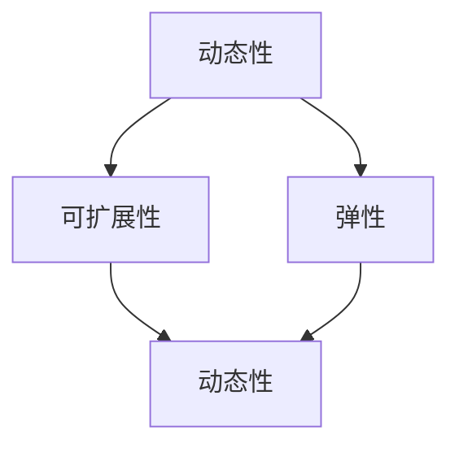
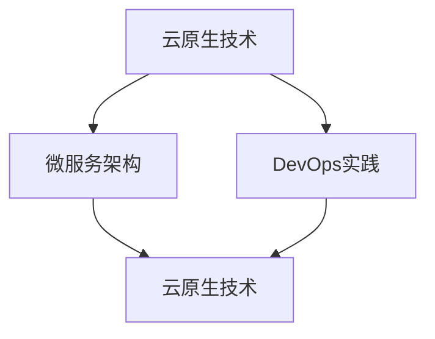

                 

### 文章标题：打造自适应的技术架构体系

> 关键词：自适应技术、技术架构、微服务、云原生、DevOps

> 摘要：
本文章深入探讨如何打造自适应的技术架构体系。我们将从基本概念入手，逐步解析自适应技术架构的核心要素、原理和设计原则，并通过实际案例研究，展示其在不同行业中的应用。文章旨在为读者提供一套全面而实用的指南，以应对不断变化的技术环境。

### 目录

1. **技术架构概述**
   1.1 自适应技术架构的基本概念
   1.2 自适应技术架构的核心要素
   1.3 当前技术架构发展趋势

2. **自适应技术原理**
   2.1 自适应技术原理基础
   2.2 自适应算法的应用场景
   2.3 自适应技术在各行业的应用

3. **架构设计与实践**
   3.1 架构设计原则
   3.2 微服务架构设计
   3.3 容错与恢复机制

4. **案例研究**
   4.1 案例一：金融行业自适应技术架构
   4.2 案例二：制造业智能工厂架构
   4.3 案例三：互联网公司自适应架构实践

5. **小结与拓展**

### 第一部分：技术架构概述

#### 1.1 自适应技术架构的基本概念

**背景介绍：**

随着信息技术的快速发展，企业面临的技术环境日益复杂和动态。传统的静态技术架构已经难以满足快速变化的市场需求。因此，自适应技术架构应运而生，它是一种能够动态适应环境变化的架构体系。

**核心概念与联系：**

自适应技术架构的核心概念包括：

- **动态性**：系统能够根据环境变化自动调整其配置和性能。
- **可扩展性**：系统能够根据需求变化自动扩展或缩减资源。
- **弹性**：系统能够在出现故障时自动恢复，保证服务的持续可用。

这些概念之间的联系可以用以下 Mermaid 流程图表示：



**自适应技术架构的优势与挑战：**

- **优势**：
  - 提高系统的灵活性和响应速度。
  - 降低维护成本和风险。
  - 支持快速创新和业务扩展。

- **挑战**：
  - 复杂性增加，设计和管理难度大。
  - 需要投入更多资源进行监控和自动化。
  - 可能带来新的安全风险。

#### 1.2 自适应技术架构的核心要素

自适应技术架构的核心要素包括：

- **云原生技术**：利用云计算的弹性特性，实现资源的动态分配和管理。
- **微服务架构**：将大型系统拆分为小型、独立的服务单元，提高系统的灵活性和可维护性。
- **DevOps实践**：将开发（Development）和运维（Operations）紧密结合，实现快速迭代和持续交付。

这些要素之间的联系可以用以下 Mermaid 流程图表示：



**当前技术架构发展趋势：**

- **云原生技术的普及**：企业逐渐采用云原生技术，以提高系统的弹性、可扩展性和安全性。
- **微服务架构的广泛应用**：微服务架构在大型分布式系统中得到广泛认可，成为主流架构设计模式。
- **DevOps文化的深入**：DevOps实践在企业中逐渐推广，成为提高软件交付质量和效率的重要手段。

### 第二部分：自适应技术原理

在本部分，我们将深入探讨自适应技术架构的原理，包括基本算法原理、应用场景以及跨行业的应用。首先，我们定义几个核心概念：

- **动态性**：系统在运行时能够根据环境变化调整其配置和行为。
- **可扩展性**：系统能够根据需求自动扩展或缩减其资源。
- **弹性**：系统能够在出现故障时自动恢复，保证服务的持续可用。

#### 2.1 自适应技术原理基础

**基本算法原理：**

自适应技术的核心是算法，以下是一个简单的伪代码，用于描述自适应算法的基本框架：

```plaintext
算法：自适应调整
输入：环境参数、当前配置
输出：新的配置

过程：
1. 收集环境参数
2. 分析环境参数的变化趋势
3. 根据变化趋势调整当前配置
4. 测试新的配置，确保系统性能满足要求
5. 返回新的配置
```

**数学模型与公式：**

自适应技术中的数学模型通常用于描述系统的动态行为，以下是一个简单的 LaTeX 公式示例：

```latex
$$
\text{适应度} = \frac{\text{环境适应度}}{\text{当前配置适应度}}
$$

这里，适应度用于衡量系统对环境的适应性。环境适应度越高，系统越能适应环境变化。
```

**详细讲解与举例说明：**

以一个简单的例子来说明自适应算法的应用。假设我们有一个温度控制系统，其目标是在不同的环境温度下保持室内温度恒定。环境温度是一个动态变量，而当前配置（例如加热或冷却功率）需要根据环境温度的变化进行自适应调整。

- **环境参数**：当前室内温度和室外温度。
- **当前配置**：加热或冷却功率。

算法可以通过以下步骤实现自适应调整：

1. **收集环境参数**：实时监测室内外温度。
2. **分析变化趋势**：判断室内温度是否在允许范围内，如果超出范围，则需要调整配置。
3. **调整配置**：如果室内温度过高，增加冷却功率；如果室内温度过低，增加加热功率。
4. **测试新的配置**：模拟调整后的配置效果，确保室内温度稳定在目标范围内。

#### 2.2 自适应算法的应用场景

自适应算法在多种应用场景中具有广泛的应用：

- **动态资源管理**：例如，云平台中的虚拟机管理，可以根据负载情况动态调整资源分配。
- **智能故障检测与恢复**：例如，数据中心中的网络故障检测与恢复，可以自动识别故障并重新配置网络。
- **自适应负载均衡**：例如，互联网服务中的流量分配，可以根据用户行为动态调整流量分布。

这些应用场景共同体现了自适应技术在提高系统灵活性和可靠性方面的优势。

#### 2.3 自适应技术在各行业的应用

自适应技术在金融、制造和互联网等行业都有广泛应用：

- **金融行业**：自适应技术用于风险管理、交易执行和客户服务优化。
- **制造业**：自适应技术用于生产计划调度、质量控制和智能维护。
- **互联网行业**：自适应技术用于用户行为分析、个性化推荐和数据中心管理。

这些案例展示了自适应技术在应对行业特定挑战时的实际效果。

### 第三部分：架构设计与实践

在本部分，我们将探讨如何设计自适应的技术架构，并介绍微服务架构和容错与恢复机制的设计原则和实践。

#### 3.1 架构设计原则

设计自适应技术架构时，应遵循以下原则：

- **模块化设计**：将系统拆分为小型模块，每个模块负责特定功能，便于管理和维护。
- **可扩展性与可维护性**：设计时应考虑系统的可扩展性和可维护性，确保在需求变化时能够灵活调整。
- **安全性与可靠性**：确保系统在面临各种挑战时能够保持稳定运行，并提供必要的安全保障。

#### 3.2 微服务架构设计

微服务架构是自适应技术架构的一种典型实现。以下是微服务架构设计的关键要素：

- **服务拆分**：根据业务需求将大型系统拆分为多个小型服务，每个服务负责一个独立的功能模块。
- **服务通信**：采用轻量级通信协议，如HTTP/REST，实现服务之间的交互。
- **服务自治**：每个服务具有自治性，可以独立部署、扩展和升级。
- **服务监控与日志**：实现对每个服务的监控和日志记录，确保系统的透明性和可追溯性。

#### 3.3 容错与恢复机制

容错与恢复机制是保证系统可靠性的重要手段。以下是设计容错与恢复机制的关键要素：

- **故障检测与隔离**：通过监控和检测机制，及时发现故障并隔离受影响的服务。
- **自动化恢复策略**：在检测到故障时，自动执行恢复策略，如重新部署服务、重新配置网络等。
- **数据一致性保障**：通过分布式事务管理、数据复制和一致性算法，确保系统在故障发生后仍能保持数据一致性。

### 第四部分：案例研究

在本部分，我们将通过三个实际案例，展示自适应技术架构在不同行业中的应用和实施效果。

#### 4.1 案例一：金融行业自适应技术架构

**背景介绍：**

某大型金融机构在数字化转型的过程中，采用了自适应技术架构，以应对快速变化的金融市场需求。

**技术选型：**

- **云原生技术**：采用Kubernetes进行容器化部署，实现服务的自动化管理。
- **微服务架构**：将传统单体应用拆分为多个微服务，提高系统的灵活性和可维护性。
- **DevOps实践**：采用持续集成和持续交付（CI/CD），实现快速迭代和交付。

**实施过程：**

- **环境搭建**：在云平台搭建Kubernetes集群，部署容器化应用。
- **服务拆分**：根据业务需求，将传统单体应用拆分为多个微服务。
- **自动化部署**：使用CI/CD工具实现服务的自动化部署和升级。

**效果评估：**

- **系统性能提升**：通过容器化和微服务架构，系统的响应速度和稳定性得到了显著提升。
- **开发效率提高**：开发团队可以独立开发和部署微服务，提高了开发效率。
- **业务创新**：自适应技术架构支持快速创新和业务扩展，提升了企业的市场竞争力。

**总结：**

本案例展示了自适应技术架构在金融行业中的应用效果，通过采用云原生技术、微服务架构和DevOps实践，实现了系统性能和开发效率的提升，为企业的数字化转型提供了有力支持。

#### 4.2 案例二：制造业智能工厂架构

**背景介绍：**

某制造企业在智能工厂建设过程中，采用了自适应技术架构，以实现生产过程的智能化和高效化。

**技术架构设计：**

- **云平台**：采用私有云或混合云架构，提供计算、存储和网络资源。
- **物联网（IoT）**：通过传感器和设备收集生产过程中的数据，实现设备联网和数据采集。
- **边缘计算**：在工厂现场部署边缘计算节点，处理实时数据，减少数据传输延迟。
- **自适应算法**：采用自适应算法，实现生产计划的动态调整和优化。

**实施挑战与解决方案：**

- **数据传输延迟**：由于工厂现场设备和云平台之间的网络延迟，数据传输效率较低。解决方案：采用边缘计算技术，在工厂现场处理实时数据，减少数据传输量。
- **设备兼容性**：不同设备和传感器之间的兼容性问题。解决方案：采用标准化接口和协议，确保设备之间的互联互通。
- **安全保障**：确保生产数据的安全性和完整性。解决方案：采用加密技术、防火墙和安全审计等措施，保障数据安全。

**效益分析：**

- **生产效率提升**：通过自适应算法优化生产计划，实现了生产效率的提升。
- **设备利用率提高**：通过物联网和边缘计算技术，实现了设备的智能监控和预测性维护，降低了设备故障率和停机时间。
- **节能减排**：通过生产过程的智能化和优化，实现了节能减排的目标。

**总结：**

本案例展示了自适应技术架构在制造业中的应用效果，通过采用云平台、物联网、边缘计算和自适应算法等技术，实现了生产过程的智能化和高效化，为企业带来了显著的经济效益和竞争优势。

#### 4.3 案例三：互联网公司自适应架构实践

**业务需求：**

某互联网公司希望在快速发展的市场中保持竞争力，因此需要构建一个自适应技术架构，以支持业务快速迭代和持续交付。

**架构演进：**

- **初期阶段**：采用单体应用架构，所有功能模块集中在一个应用中，便于开发和部署。
- **中期阶段**：随着业务需求的增加，逐步将单体应用拆分为多个微服务，提高系统的灵活性和可维护性。
- **现阶段**：采用自适应技术架构，通过容器化部署、微服务架构和DevOps实践，实现系统的动态调整和优化。

**技术选型：**

- **容器化技术**：使用Docker进行容器化部署，实现服务的快速部署和隔离。
- **微服务框架**：采用Spring Cloud等微服务框架，实现服务之间的通信和协调。
- **DevOps工具**：使用Jenkins、Docker Swarm等工具，实现持续集成和持续交付。

**开发环境搭建：**

- **环境配置**：在云平台搭建Kubernetes集群，部署容器化应用。
- **服务管理**：使用Kubernetes进行服务的管理和调度，实现服务的动态扩展和缩放。
- **监控与日志**：采用Prometheus和ELK（Elasticsearch、Logstash、Kibana）堆栈进行监控和日志分析。

**源代码实现和解读：**

以下是微服务架构中的一个简单示例，用于用户认证服务：

```java
@RestController
@RequestMapping("/auth")
public class AuthenticationController {

    @Autowired
    private AuthenticationService authenticationService;

    @PostMapping("/login")
    public ResponseEntity<?> login(@RequestBody LoginRequest loginRequest) {
        String token = authenticationService.authenticate(loginRequest);
        return ResponseEntity.ok(new TokenResponse(token));
    }
}
```

**代码应用解读与分析：**

上述代码实现了一个用户认证服务，主要功能包括：

- **登录接口**：接收用户名和密码，调用认证服务进行认证。
- **认证服务**：根据用户名和密码生成JWT（JSON Web Token）令牌，用于后续的权限验证。

该服务采用了微服务架构的设计原则，具有以下优点：

- **模块化**：将认证功能拆分为独立的微服务，便于管理和扩展。
- **自治性**：认证服务可以独立部署和升级，不影响其他服务。
- **高可用性**：通过容器化部署和Kubernetes管理，确保服务的高可用性。

**实际案例分析：**

在互联网公司中，自适应架构的应用效果显著。通过采用自适应技术架构，公司实现了以下成果：

- **快速迭代**：通过微服务架构和DevOps实践，实现了业务的快速迭代和交付。
- **业务扩展**：通过容器化和动态扩展，实现了业务的弹性扩展和资源优化。
- **成本降低**：通过自动化管理和监控，降低了运维成本和人力投入。

**总结：**

本案例展示了互联网公司采用自适应技术架构的实践效果，通过容器化部署、微服务架构和DevOps实践，实现了业务快速迭代和持续交付，提升了企业的竞争力。

### 小结与拓展

本文从多个角度探讨了如何打造自适应的技术架构体系，包括基本概念、原理、架构设计和实际案例。自适应技术架构在应对快速变化的市场需求方面具有显著优势，但同时也面临一定的挑战。以下是一些最佳实践和注意事项：

- **持续迭代与优化**：自适应技术架构需要持续迭代和优化，以适应不断变化的市场需求和技术环境。
- **安全性与稳定性**：在设计自适应技术架构时，要充分考虑安全性和稳定性，确保系统的可靠运行。
- **团队协作与培训**：自适应技术架构的实施需要跨部门协作和团队成员的培训，以提高整个团队的技能水平。
- **资源管理**：合理利用云资源和自动化工具，实现资源的动态管理和优化。

拓展阅读：

- 《云原生应用架构指南》
- 《微服务设计》
- 《DevOps实践指南》

通过本文的阅读，读者应能全面理解自适应技术架构的概念、原理和实践，为构建和优化自己的技术架构提供参考。作者：AI天才研究院/AI Genius Institute & 禅与计算机程序设计艺术 /Zen And The Art of Computer Programming

