                 


### 第1章 引言

## 1.1 分布式数据库系统的背景与重要性

分布式数据库系统（Distributed Database System，简称DDS）是数据库系统发展的重要方向之一。随着互联网的飞速发展和大数据时代的到来，数据量呈爆炸式增长，传统的集中式数据库系统在处理大规模数据时遇到了性能瓶颈。分布式数据库系统通过将数据分布存储在多个节点上，能够实现数据的水平扩展，提高系统的处理能力和性能。

#### 1.1.1 分布式数据库系统的起源

分布式数据库系统的概念最早可以追溯到20世纪70年代。当时，随着计算机网络的普及，研究人员开始探讨如何将多个数据库系统通过网络连接起来，实现数据共享和分布式处理。1978年，IBM公司提出了分布式数据库系统的概念，并发布了相关的研究报告。随后，分布式数据库系统逐渐成为数据库领域的研究热点。

#### 1.1.2 分布式数据库系统的优势

分布式数据库系统相较于集中式数据库系统具有以下优势：

1. **高可用性**：分布式数据库系统通过冗余设计，可以在单个节点故障时保证系统的持续运行，提高系统的可靠性。
2. **高性能**：分布式数据库系统可以通过并行处理，提高数据访问速度，满足大规模数据处理的性能需求。
3. **可扩展性**：分布式数据库系统可以通过水平扩展，满足数据量持续增长的需求，系统性能随数据量增长而线性提升。
4. **分布式事务处理**：分布式数据库系统支持分布式事务，能够在多个节点之间协调数据一致性。

#### 1.1.3 分布式数据库系统的应用场景

分布式数据库系统广泛应用于互联网公司、金融行业、物联网等领域，以下是一些典型的应用场景：

1. **互联网公司**：如电商、社交媒体、在线游戏等，需要处理海量用户数据，分布式数据库系统能够提供高性能的数据访问和处理能力。
2. **金融行业**：如银行、保险、证券等，需要保证金融交易的数据一致性，分布式数据库系统能够提供高可用性和高性能的金融交易处理能力。
3. **物联网**：如智能家居、智能交通等，需要处理海量传感器数据和实时数据处理，分布式数据库系统能够提供高效的数据存储和处理能力。

## 1.2 分布式数据库系统的挑战

尽管分布式数据库系统具有诸多优势，但其设计和实现过程中仍面临一系列挑战。

#### 1.2.1 数据一致性

分布式数据库系统需要保证多个节点之间的数据一致性。在分布式环境下，数据的一致性保证变得更加复杂，需要解决数据副本同步、网络延迟等问题。

#### 1.2.2 数据分区与分配

分布式数据库系统需要将数据分布存储在多个节点上，如何合理地进行数据分区与分配，以提高系统的性能和可扩展性，是一个关键问题。

#### 1.2.3 数据库性能优化

分布式数据库系统的性能优化涉及到查询优化、数据传输优化、分布式事务处理等方面，需要综合考虑各种优化策略，以提高系统的整体性能。

#### 1.2.4 数据冗余与存储空间

分布式数据库系统需要解决数据冗余和存储空间管理的问题。合理的数据冗余策略可以提供系统的可用性，但过度的数据冗余会增加存储空间的消耗。

## 1.3 高性能分布式数据库系统的特点

高性能分布式数据库系统具有以下特点：

#### 1.3.1 一致性与可用性

高性能分布式数据库系统需要在一致性和可用性之间做出权衡。常见的策略有强一致性、最终一致性和部分一致性。

#### 1.3.2 扩展性与弹性

高性能分布式数据库系统需要支持水平扩展，以适应数据量的增长。同时，系统需要具有弹性，能够在节点故障时自动恢复。

#### 1.3.3 高性能与低延迟

高性能分布式数据库系统需要具备高效的查询处理能力和低延迟的数据访问能力，以满足大规模数据处理的性能需求。

### 关键词
- 分布式数据库系统
- 高可用性
- 性能优化
- 数据一致性
- 扩展性
- 弹性

### 摘要
本文将介绍分布式数据库系统的背景与重要性、面临的挑战以及高性能分布式数据库系统的特点。通过对分布式数据库系统的基础、数据存储技术、分布式计算与协调、高可用性与性能优化等方面的详细探讨，帮助读者深入理解分布式数据库系统的设计与实现，掌握高性能分布式数据库系统的构建方法。

---

接下来，我们将进入第2章，详细探讨分布式数据库系统的基础，包括分布式数据库系统架构概述、数据分片与分配策略、分布式一致性模型等内容。我们将逐步分析这些核心概念，并给出相应的 Mermaid 流程图和伪代码。

### 第2章 分布式数据库系统基础

分布式数据库系统的基础是构建高性能分布式数据库系统的基石。本章将深入探讨分布式数据库系统架构、数据分片与分配策略以及分布式一致性模型，旨在为读者提供全面的理解和实际操作指导。

## 2.1 分布式数据库系统架构概述

分布式数据库系统由多个节点组成，每个节点负责存储和管理一部分数据。分布式数据库系统架构的关键组成部分包括：

- **数据节点**：存储数据的物理设备，可以是单个服务器或多个服务器组成的集群。
- **协调节点**：负责协调分布式事务、数据一致性等任务的节点。
- **客户端**：与分布式数据库系统交互的客户端应用程序。

### 分布式数据库系统与传统数据库系统的区别

与传统的集中式数据库系统相比，分布式数据库系统具有以下特点：

- **数据分布**：分布式数据库系统将数据分布存储在多个节点上，提高了系统的性能和可扩展性。
- **一致性**：分布式数据库系统需要在多个节点之间保持数据一致性，具有更高的复杂性。
- **容错性**：分布式数据库系统通过冗余设计提高了系统的容错性，单个节点的故障不会影响系统的整体运行。

### 分布式数据库系统的基本组成部分

分布式数据库系统的基本组成部分包括：

1. **数据存储层**：负责存储和管理数据的物理存储结构，包括文件系统、数据库引擎等。
2. **数据访问层**：提供数据的查询、更新等操作接口，包括SQL接口、RESTful API等。
3. **分布式协调层**：负责分布式事务处理、数据一致性维护等任务，包括分布式锁、分布式事务管理器等。

### 数据分片与分配策略

数据分片与分配策略是分布式数据库系统的核心组成部分，直接影响到系统的性能和可扩展性。

#### 2.2.1 数据分片原理

数据分片是指将大规模数据集划分为多个较小数据集的过程。数据分片有以下几种方式：

1. **水平分片**：将数据集按照某个属性或键划分为多个子集，每个子集存储在一个节点上。
2. **垂直分片**：将数据集按照字段划分为多个子集，每个子集存储在一个节点上。

#### 2.2.2 数据分配策略

数据分配是指将数据分片分配到不同节点的过程。数据分配有以下几种策略：

1. **哈希分配**：使用哈希函数将数据分片分配到节点，保证数据分片的均匀分布。
2. **范围分配**：根据数据分片的属性或键值范围，将数据分片分配到节点。
3. **列表分配**：将数据分片按照预定义的列表分配到节点。

#### 数据分片与分配的协同策略

数据分片与分配的协同策略是指如何协调数据分片和分配的过程，以优化系统的性能和可扩展性。以下是一些常用的协同策略：

1. **分片键选择**：选择合适的分片键可以提高数据分片的均匀性，降低热点问题。
2. **负载均衡**：通过负载均衡算法，合理分配数据分片到节点，避免节点负载不均。
3. **动态分片**：支持动态添加或删除节点，实现数据分片和节点的动态调整。

### 2.3 分布式一致性模型

分布式一致性模型是指分布式数据库系统如何保证多个节点之间的数据一致性。常见的一致性模型包括：

1. **强一致性**：所有读写操作必须同步到所有节点，保证数据一致性。缺点是性能较低。
2. **最终一致性**：读写操作不必立即同步到所有节点，而是在一定时间后达到一致性。优点是性能较高。
3. **部分一致性**：部分读写操作不需要保证一致性，适用于对一致性要求不高的场景。

### 分布式一致性模型关系架构 Mermaid 流程图

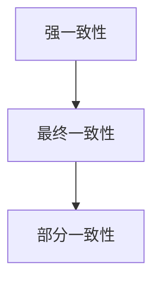

### 分布式一致性模型 Mermaid 流程图解析

- **强一致性**：强一致性保证所有读写操作同步到所有节点，数据一致性高，但性能较低。
- **最终一致性**：最终一致性允许读写操作不必立即同步到所有节点，性能较高，但数据一致性在一段时间后达到。
- **部分一致性**：部分一致性允许部分读写操作不必保证一致性，适用于对一致性要求不高的场景。

### 伪代码：分布式一致性模型实现

```python
def read_value(key):
    # 读取某个键的值
    value = get_value_from_nodes(key)
    return value

def write_value(key, value):
    # 写入某个键的值
    for node in nodes:
        node.update_value(key, value)
```

### 分布式一致性模型伪代码解析

- `read_value(key)`：读取某个键的值，从所有节点获取值，返回最新的值。
- `write_value(key, value)`：写入某个键的值，将值更新到所有节点。

通过以上内容，我们对分布式数据库系统的基础有了更深入的了解。在下一章中，我们将探讨分布式数据库系统的数据存储技术，包括分布式文件系统和分布式数据库技术，帮助读者掌握分布式数据库系统的实现方法。

---

### 第3章 数据存储技术

数据存储技术是分布式数据库系统的核心组成部分，直接影响到系统的性能和可扩展性。本章将深入探讨分布式文件系统和分布式数据库技术，包括HDFS、HBase、MongoDB和Cassandra等，帮助读者了解如何构建高性能的分布式数据库系统。

## 3.1 分布式文件系统

分布式文件系统是分布式数据库系统的基础，负责存储和管理大规模数据。HDFS（Hadoop Distributed File System）和HBase是基于Hadoop框架的分布式文件系统，具有高性能、高可用性和可扩展性等特点。

### 3.1.1 HDFS

HDFS是Hadoop分布式文件系统的简称，是一种高吞吐量的分布式文件存储系统，能够处理大量小文件和大文件。HDFS的主要组成部分包括：

- **NameNode**：负责管理文件系统的命名空间，维护文件与块的映射关系。
- **DataNode**：负责存储实际数据，响应客户端的读写请求。

### HDFS架构

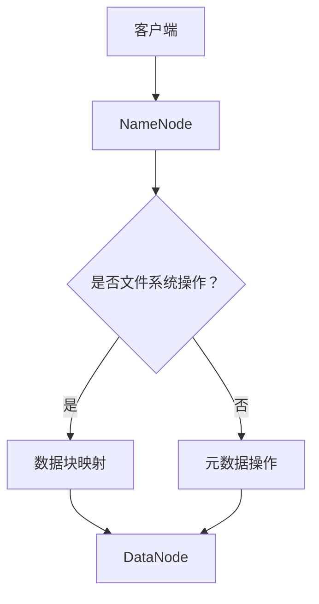

### HDFS数据存储原理

HDFS采用数据分块（Block）存储，每个数据块的大小默认为128MB或256MB。HDFS的数据存储过程如下：

1. **文件写入**：客户端将文件分成若干个数据块，并将这些数据块发送到DataNode上。
2. **数据复制**：HDFS自动将每个数据块复制到多个DataNode上，以提高数据可靠性和访问速度。
3. **文件读取**：客户端从多个DataNode上读取数据块，重构文件。

### HDFS数据读写流程

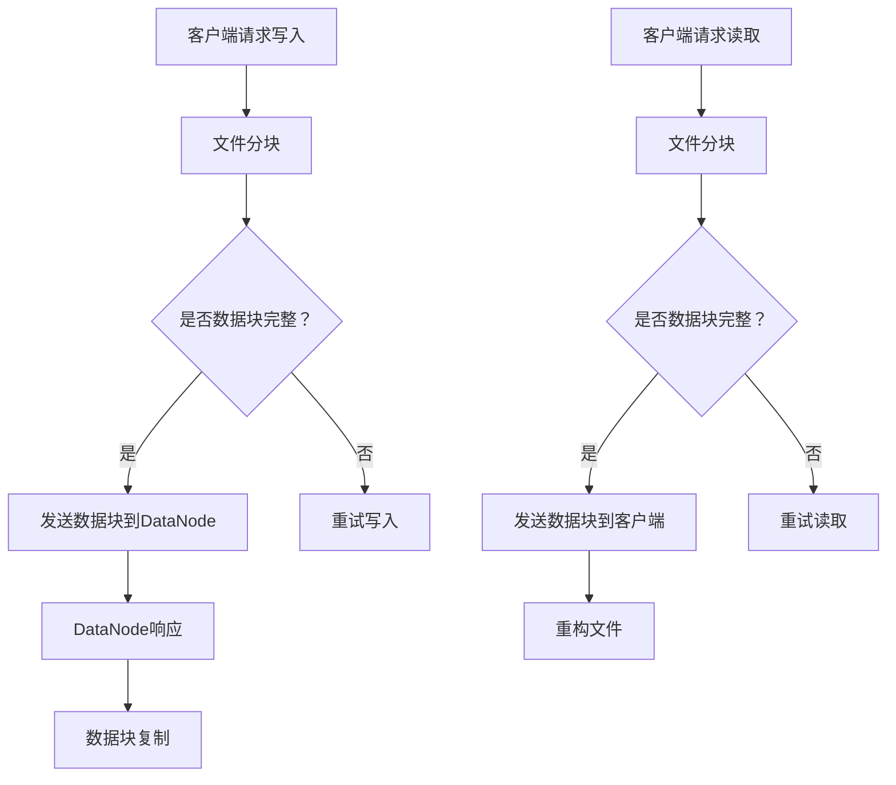

### 3.1.2 HBase

HBase是基于Hadoop的分布式、可扩展的列式存储系统，适用于存储海量稀疏数据集。HBase的主要组成部分包括：

- **Master**：负责管理表、监控RegionServer的状态、执行负载均衡等。
- **RegionServer**：负责存储表的数据，管理Region。
- **Region**：HBase的数据存储单位，包含一系列连续的行。

### HBase架构

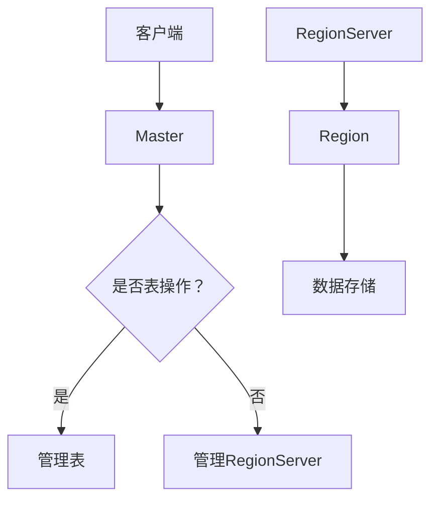

### HBase数据存储原理

HBase采用数据分片存储，每个Region包含一个数据文件（.hfile），存储一系列行的数据。HBase的数据存储过程如下：

1. **文件写入**：客户端将数据行写入RegionServer，数据行存储在内存中的MemStore。
2. **数据持久化**：MemStore中的数据定期刷新到HFile中，实现数据的持久化存储。
3. **文件读取**：客户端从RegionServer读取数据行，通过列族和行键定位数据。

### HBase数据读写流程

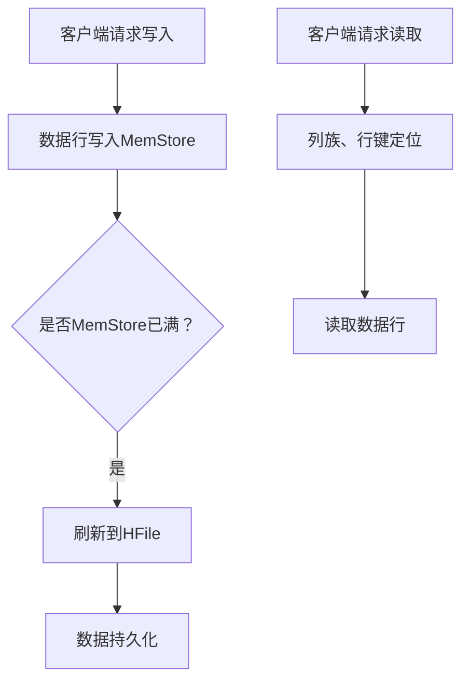

## 3.2 分布式数据库技术

除了分布式文件系统，分布式数据库技术也是构建高性能分布式数据库系统的重要手段。MongoDB和Cassandra是两种常见的分布式数据库技术，具有不同的数据模型和适用场景。

### 3.2.1 MongoDB

MongoDB是一种灵活的、可扩展的文档型数据库，适用于存储复杂、动态的数据结构。MongoDB的主要组成部分包括：

- **mongod**：负责存储数据和处理查询。
- **mongos**：负责路由查询到合适的mongod实例。

### MongoDB架构

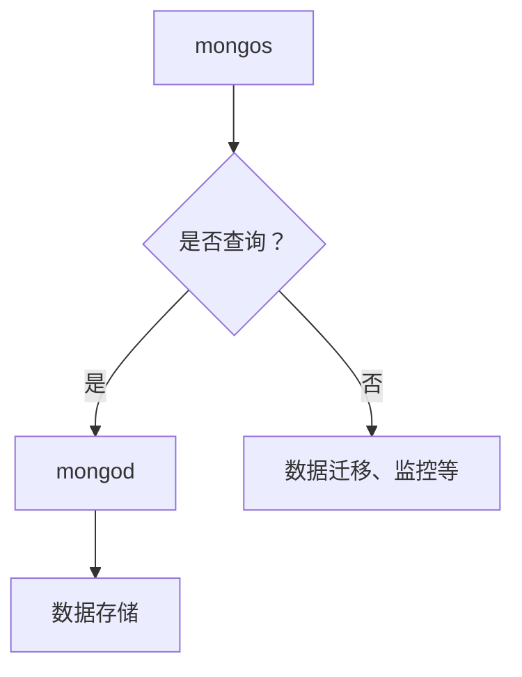

### MongoDB数据存储原理

MongoDB采用文档存储模型，每个文档都是一个JSON对象，包含多个字段和值。MongoDB的数据存储过程如下：

1. **文件写入**：客户端将文档发送到mongod，文档存储在磁盘上的数据文件中。
2. **文件读取**：客户端通过查询条件从mongod中检索文档，返回查询结果。

### MongoDB数据读写流程

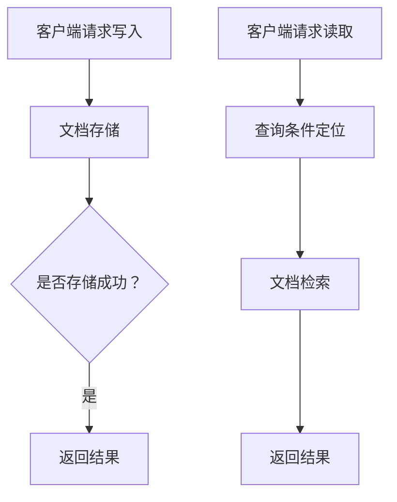

### 3.2.2 Cassandra

Cassandra是一种分布式、高度可扩展的宽列存储系统，适用于处理大量数据和高并发读写场景。Cassandra的主要组成部分包括：

- **Seed Node**：负责初始化Cassandra集群，维护集群状态。
- **Master Node**：负责维护元数据、协调集群操作。
- **Node**：负责存储数据、处理查询。

### Cassandra架构

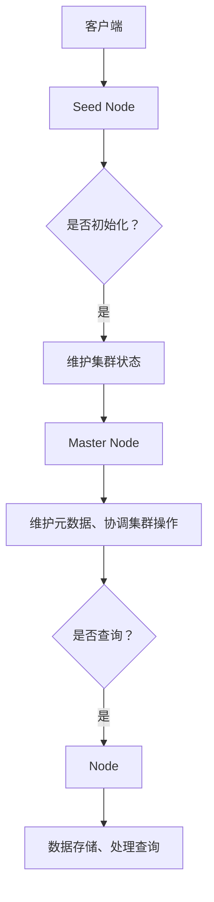

### Cassandra数据存储原理

Cassandra采用数据分片存储，每个分片包含多个数据副本，以提高数据可靠性和访问速度。Cassandra的数据存储过程如下：

1. **文件写入**：客户端将数据发送到Node，Node将数据写入磁盘上的数据文件中。
2. **文件读取**：客户端通过查询条件从Node中检索数据，返回查询结果。

### Cassandra数据读写流程

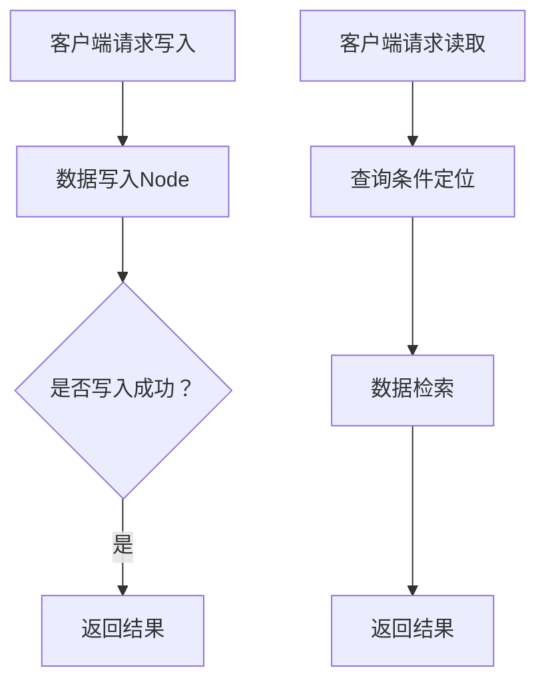

通过以上对分布式文件系统和分布式数据库技术的探讨，我们可以看到分布式数据库系统在数据存储技术上的多样性。在下一章中，我们将进一步探讨分布式计算与协调技术，包括MapReduce、Spark、ZooKeeper和etcd等，帮助读者掌握分布式数据库系统的实现方法。

---

### 第4章 分布式计算与协调

在分布式数据库系统中，分布式计算与协调是保证系统性能和可扩展性的关键。本章将详细介绍分布式计算框架和分布式协调服务，包括MapReduce、Spark、ZooKeeper和etcd等，帮助读者了解如何在分布式环境中高效地进行计算和协调。

## 4.1 分布式计算框架

分布式计算框架是分布式数据库系统的核心组成部分，能够有效地处理大规模数据集。常见的分布式计算框架包括MapReduce和Spark。

### 4.1.1 MapReduce

MapReduce是一种基于Hadoop的分布式计算模型，用于处理大规模数据集。MapReduce的基本概念包括：

- **Map阶段**：将输入数据分成多个小块，对每个小块执行映射（Map）操作，生成中间键值对。
- **Reduce阶段**：将Map阶段的中间键值对合并，执行聚合（Reduce）操作，生成最终的输出结果。

### MapReduce架构

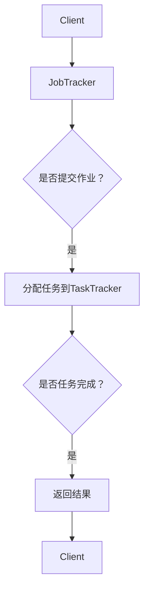

### MapReduce数据计算流程

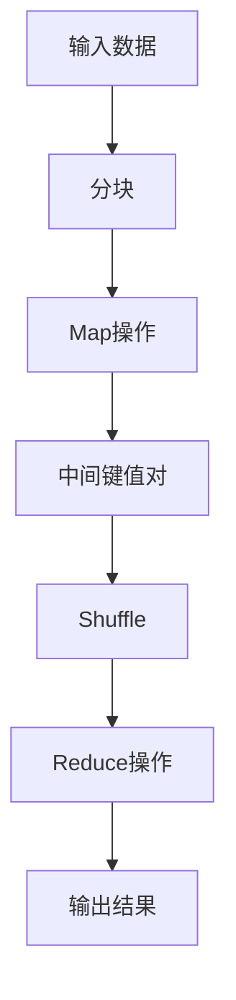

### 4.1.2 Spark

Spark是一种更高效的分布式计算引擎，基于内存计算，能够显著提高计算性能。Spark的核心组件包括：

- **Driver程序**：负责调度任务、监控任务进度。
- **Executor**：负责执行任务，管理内存和资源。
- **Cluster Manager**：负责资源管理和调度。

### Spark架构

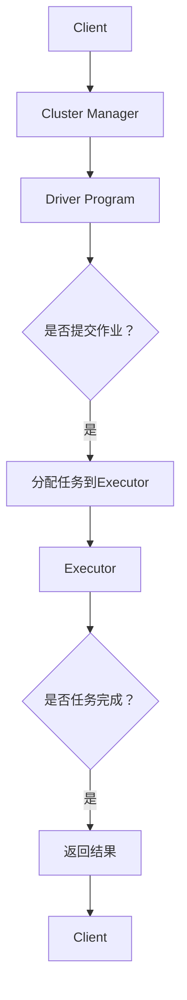

### Spark数据计算流程

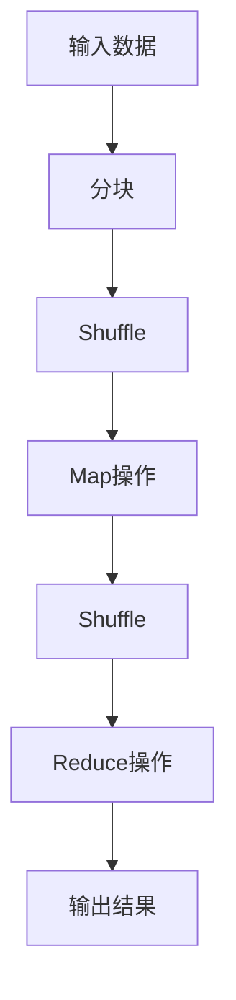

通过MapReduce和Spark，分布式数据库系统可以高效地处理大规模数据集，提高系统的性能。

## 4.2 分布式协调服务

分布式协调服务是分布式数据库系统中的核心组成部分，用于协调分布式节点之间的操作，保证系统的一致性和可靠性。常见的分布式协调服务包括ZooKeeper和etcd。

### 4.2.1 ZooKeeper

ZooKeeper是一种高性能的分布式协调服务，用于维护分布式系统的协调和配置管理。ZooKeeper的核心组件包括：

- **ZooKeeper Server**：负责存储ZooKeeper的数据和状态，处理客户端的请求。
- **ZooKeeper Client**：负责与ZooKeeper Server通信，执行分布式协调操作。

### ZooKeeper架构

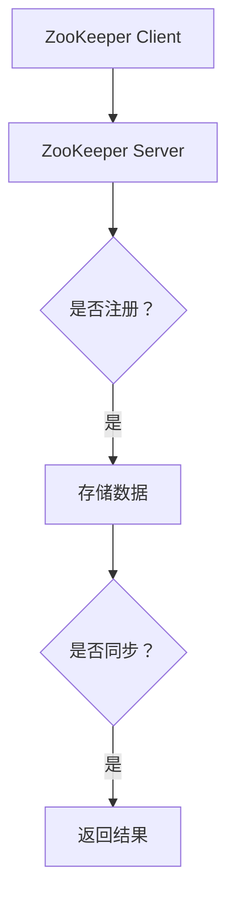

### ZooKeeper数据同步流程

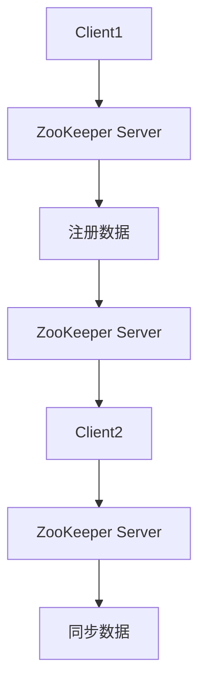

### 4.2.2 etcd

etcd是一种开源的分布式键值存储系统，用于维护分布式系统的配置和服务发现。etcd的核心组件包括：

- **etcd Server**：负责存储数据、处理客户端的请求。
- **etcd Client**：负责与etcd Server通信，执行分布式协调操作。

### etcd架构

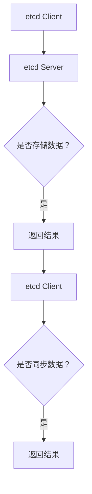

### etcd数据同步流程

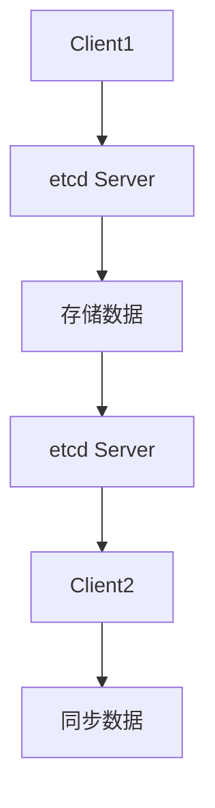

通过ZooKeeper和etcd，分布式数据库系统可以有效地进行分布式协调，保证系统的一致性和可靠性。

### 分布式协调服务关系架构 Mermaid 流程图

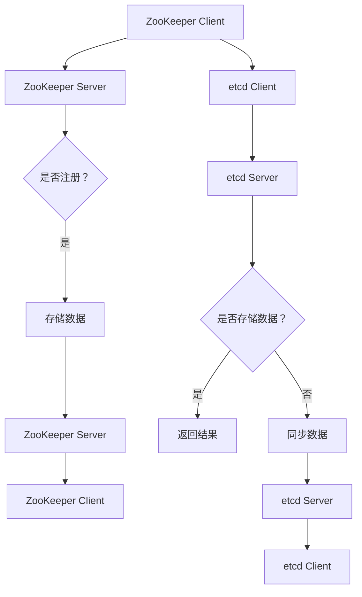

### 分布式协调服务 Mermaid 流程图解析

- **ZooKeeper**：ZooKeeper Client与ZooKeeper Server通信，进行注册和同步数据操作。
- **etcd**：etcd Client与etcd Server通信，进行存储和同步数据操作。

通过以上对分布式计算框架和分布式协调服务的介绍，我们可以看到分布式数据库系统在计算和协调方面的多样性和复杂性。在下一章中，我们将探讨分布式数据库系统的性能优化，帮助读者掌握提高系统性能的方法。

---

### 第5章 高可用性与数据冗余

在分布式数据库系统中，高可用性和数据冗余是确保系统稳定运行和可靠性重要的保障措施。本章将详细介绍高可用性设计、数据冗余策略以及如何实现这些策略，帮助读者理解并掌握分布式数据库系统的高可用性和数据冗余技术。

## 5.1 数据备份与恢复

数据备份与恢复是确保分布式数据库系统数据安全性的关键步骤。数据备份是指将数据库中的数据复制并存储在多个地方，以防止数据丢失或损坏。数据恢复是指当数据库出现故障或数据丢失时，能够从备份中恢复数据。

### 数据备份策略

1. **全量备份**：定期对整个数据库进行备份，包括所有的数据文件和日志文件。优点是恢复速度快，缺点是备份时间较长，存储空间占用较大。
2. **增量备份**：只备份自上次备份以来发生变化的文件。优点是备份时间短，存储空间占用小，缺点是恢复时需要逐步恢复多个增量备份，可能较慢。

### 数据恢复流程

1. **故障检测**：系统监控工具检测到数据库故障或数据丢失。
2. **备份选择**：选择最近的备份进行恢复。
3. **数据恢复**：从备份中恢复数据，覆盖现有的数据库。
4. **测试验证**：恢复后的数据库进行测试，确保数据一致性。

### 数据备份与恢复伪代码

```python
def backup():
    # 备份数据
    backup_data()

def restore():
    # 恢复数据
    select_backup()
    restore_data()
    test_data_consistency()
```

### 5.2 数据冗余策略

数据冗余是指将数据复制存储在多个地方，以提高系统的可靠性和可用性。数据冗余策略可以分为以下两种：

1. **主动冗余**：系统自动将数据复制到多个节点上，确保数据的高可用性。优点是数据可靠性高，缺点是存储空间占用较大。
2. **被动冗余**：当系统检测到某个节点故障时，自动将数据复制到其他节点。优点是存储空间占用较小，缺点是数据可靠性较低。

### 5.2.1 主动冗余

主动冗余策略通过以下步骤实现：

1. **数据复制**：系统自动将数据复制到多个节点上，每个节点都存储一份完整的数据。
2. **负载均衡**：系统根据节点的负载情况，自动调整数据复制策略，确保数据分布均匀。
3. **故障检测**：系统监控工具检测到节点故障时，自动将故障节点上的数据复制到其他节点。

### 5.2.2 被动冗余

被动冗余策略通过以下步骤实现：

1. **初始复制**：系统初始化时，将数据复制到多个节点上。
2. **故障检测**：系统监控工具检测到节点故障时，自动将故障节点上的数据复制到其他节点。
3. **负载均衡**：系统根据节点的负载情况，自动调整数据复制策略，确保数据分布均匀。

### 5.3 高可用性设计

高可用性设计是指通过一系列技术手段，确保分布式数据库系统在发生故障时能够快速恢复，提供持续的服务。以下是一些常见的高可用性设计策略：

1. **主从复制**：通过将数据同步复制到多个从节点，确保主节点故障时，从节点能够自动接替主节点继续提供服务。
2. **负载均衡**：通过负载均衡器，将客户端请求分配到多个节点上，提高系统的处理能力。
3. **故障转移**：当检测到某个节点故障时，自动将故障节点上的数据复制到其他节点，并切换主节点。
4. **自动恢复**：系统自动检测故障，并自动进行恢复，降低人工干预。

### 高可用性设计关系架构 Mermaid 流程图

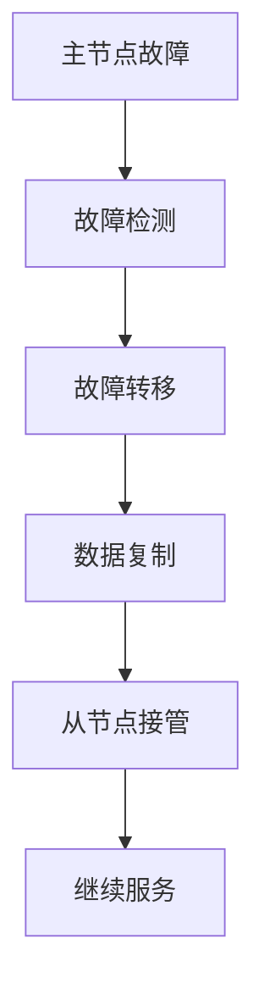

### 高可用性设计 Mermaid 流程图解析

- **主节点故障**：系统检测到主节点故障。
- **故障检测**：系统监控工具检测到主节点故障。
- **故障转移**：系统自动将故障节点上的数据复制到其他节点，并切换主节点。
- **数据复制**：系统将数据从主节点复制到从节点。
- **从节点接管**：从节点接替主节点继续提供服务。
- **继续服务**：系统恢复正常运行。

通过数据备份与恢复、主动冗余、被动冗余以及高可用性设计，分布式数据库系统可以有效地确保数据的安全性和系统的可靠性。在下一章中，我们将探讨性能优化，帮助读者进一步提高系统的性能。

---

### 第6章 性能优化

性能优化是分布式数据库系统设计中的关键环节，它直接影响到系统的响应速度和处理能力。本章将详细介绍分布式数据库系统的性能优化方法，包括查询优化、数据传输优化和分布式事务处理，帮助读者掌握提升系统性能的最佳实践。

## 6.1 查询优化

查询优化是分布式数据库系统性能优化的重要组成部分，通过改进查询执行计划、使用查询缓存等手段，可以提高查询速度和处理效率。

### 6.1.1 查询执行计划

查询执行计划是数据库系统根据查询语句生成的执行步骤序列。优化查询执行计划的核心目标是降低查询的CPU和I/O开销，提高查询效率。以下是一些常见的查询优化策略：

1. **选择合适的数据结构**：根据查询语句的特点，选择合适的数据结构（如B树、哈希表等）存储数据，以提高查询速度。
2. **索引优化**：合理设计索引，减少查询时的磁盘I/O操作，提高查询效率。常见的索引类型包括B树索引、哈希索引和全文索引等。
3. **查询重写**：通过查询重写，将复杂的查询转化为更简单的查询，减少查询的执行时间。例如，将子查询重写为连接查询，减少查询的解析和优化时间。

### 查询执行计划伪代码

```python
def optimize_query(query):
    # 选择合适的数据结构
    data_structure = choose_data_structure(query)

    # 创建索引
    index = create_index(query)

    # 重写查询
    rewritten_query = rewrite_query(query)

    # 执行查询
    result = execute_query(rewritten_query, data_structure, index)
    return result
```

### 6.1.2 查询缓存

查询缓存是提高查询响应速度的有效手段，通过缓存查询结果，减少重复查询的执行次数。以下是一些常见的查询缓存策略：

1. **结果缓存**：将查询结果缓存起来，当相同的查询再次执行时，直接从缓存中获取结果，减少查询执行时间。
2. **时间戳缓存**：根据查询的时间戳，设置缓存的有效期，过期后自动刷新缓存。
3. **命中策略**：根据查询的命中率，选择合适的缓存策略。常见的命中策略包括最久未使用（LFU）和最近最少使用（LRU）等。

### 查询缓存伪代码

```python
def cache_query_result(query, result):
    # 设置缓存有效期
    cache_expiry = set_expiry_time()

    # 将查询结果缓存起来
    cache[query] = (result, cache_expiry)

def query_with_cache(query):
    # 从缓存中获取查询结果
    cached_result = cache.get(query)

    # 如果缓存命中，返回缓存结果
    if cached_result:
        return cached_result[0]

    # 如果缓存未命中，执行查询并缓存结果
    result = optimize_query(query)
    cache_query_result(query, result)
    return result
```

### 6.2 数据传输优化

数据传输优化是提高分布式数据库系统性能的关键环节，通过改进数据传输策略和压缩算法，可以显著降低数据传输延迟和带宽消耗。

### 6.2.1 数据传输策略

1. **批量传输**：将多个数据包合并成一个大数据包传输，减少传输次数，降低网络延迟。
2. **并行传输**：同时传输多个数据包，提高数据传输速度。
3. **优先级传输**：根据数据的重要性和紧急程度，设置不同的传输优先级，确保关键数据优先传输。

### 6.2.2 压缩算法

压缩算法通过减少数据传输的体积，降低带宽消耗和传输时间。以下是一些常见的压缩算法：

1. **LZ77压缩算法**：通过查找重复的数据块，减少数据传输的体积。
2. **LZ78压缩算法**：通过构建字典，将重复的字符串映射为短编码，减少数据传输的体积。
3. **gzip压缩算法**：基于LZ77和LZ78压缩算法，提供高效的压缩和解压性能。

### 数据传输优化伪代码

```python
def compress_data(data):
    # 选择合适的压缩算法
    compression_algorithm = choose_compression_algorithm(data)

    # 压缩数据
    compressed_data = compression_algorithm.compress(data)
    return compressed_data

def decompress_data(compressed_data):
    # 选择合适的压缩算法
    compression_algorithm = choose_compression_algorithm(compressed_data)

    # 解压缩数据
    decompressed_data = compression_algorithm.decompress(compressed_data)
    return decompressed_data
```

### 6.3 分布式事务处理

分布式事务处理是分布式数据库系统的核心功能之一，通过分布式事务管理器，协调多个节点之间的数据操作，确保事务的一致性和原子性。

### 6.3.1 分布式事务管理器

分布式事务管理器负责协调分布式事务，确保事务的一致性和原子性。以下是一些常见的分布式事务管理器：

1. **两阶段提交协议（2PC）**：通过协调者（Coordinator）和参与者（Participant）之间的通信，实现分布式事务的提交和回滚。
2. **多版本并发控制（MVCC）**：通过保存数据的多个版本，实现分布式事务的隔离性和一致性。

### 分布式事务处理伪代码

```python
def begin_transaction():
    # 开始分布式事务
    transaction_id = generate_transaction_id()
    commit_counter = 0
    abort_counter = 0
    return transaction_id, commit_counter, abort_counter

def commit_transaction(transaction_id, commit_counter, abort_counter):
    # 提交分布式事务
    for participant in participants:
        participant.commit(transaction_id, commit_counter, abort_counter)

def abort_transaction(transaction_id, commit_counter, abort_counter):
    # 回滚分布式事务
    for participant in participants:
        participant.abort(transaction_id, commit_counter, abort_counter)
```

通过查询优化、数据传输优化和分布式事务处理，分布式数据库系统可以显著提高性能。在下一章中，我们将探讨分布式数据库系统的安全性与隐私保护，确保数据的安全和合规性。

---

### 第7章 安全性与隐私保护

随着分布式数据库系统在各个行业中的应用越来越广泛，数据的安全性和隐私保护变得尤为重要。本章将探讨分布式数据库系统在数据安全、隐私保护方面的技术手段，包括加密技术、访问控制以及隐私保护方法，以确保数据在分布式环境中的安全性和合规性。

## 7.1 数据安全

数据安全是分布式数据库系统安全性的核心，通过加密技术、访问控制等手段，可以防止数据被未授权访问和篡改。

### 7.1.1 加密技术

加密技术是保护数据安全的重要手段，通过将明文数据转换为密文，确保数据在传输和存储过程中不被窃取或篡改。常见的加密技术包括：

1. **对称加密**：使用相同的密钥进行加密和解密，常见的算法有AES、DES等。
2. **非对称加密**：使用一对密钥进行加密和解密，其中一个密钥用于加密，另一个密钥用于解密，常见的算法有RSA、ECC等。
3. **哈希函数**：用于生成数据的摘要，常见的算法有MD5、SHA等。

### 数据加密流程

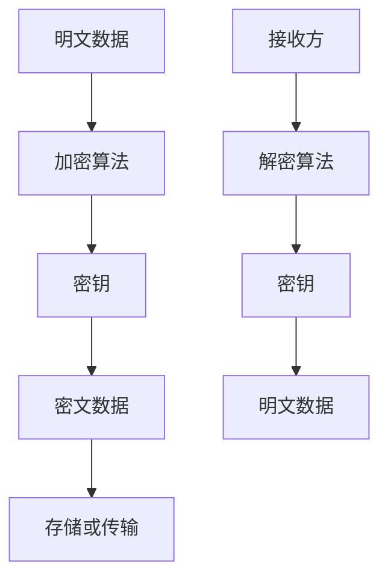

### 7.1.2 访问控制

访问控制是确保数据安全的重要手段，通过限制用户对数据的访问权限，防止数据被未授权的用户访问或篡改。常见的访问控制方法包括：

1. **基于角色的访问控制（RBAC）**：根据用户在系统中的角色，分配不同的访问权限，常见的角色有管理员、普通用户、访客等。
2. **基于属性的访问控制（ABAC）**：根据用户、数据和环境的属性，动态分配访问权限，常见的属性有用户属性、数据属性、环境属性等。

### 数据访问控制流程

```mermaid
graph TD
A[用户请求访问数据] --> B[身份验证]
B --> C[权限验证]
C -->|通过| D[访问数据]
C -->|拒绝| E[拒绝访问]
```

### 7.2 隐私保护

随着数据隐私保护法规的不断完善，分布式数据库系统在处理和分析数据时，需要采取隐私保护措施，确保用户数据的安全和合规性。

### 7.2.1 数据匿名化

数据匿名化是保护用户隐私的重要手段，通过删除或修改数据中的敏感信息，将用户身份信息与数据分离，确保用户隐私不被泄露。常见的数据匿名化方法包括：

1. **泛化**：将数据中的具体值替换为泛化值，例如将具体的年龄值替换为年龄段。
2. **加密**：对数据中的敏感信息进行加密处理，确保数据在存储和传输过程中不被窃取。
3. **混淆**：通过添加噪声或修改数据中的关系，使数据难以被分析和识别。

### 数据匿名化流程

```mermaid
graph TD
A[原始数据] --> B[敏感信息识别]
B --> C[泛化处理]
C --> D[加密处理]
D --> E[混淆处理]
E --> F[匿名化数据]
```

### 7.2.2 隐私计算

隐私计算是一种新兴的数据处理技术，通过在数据处理的各个环节中保护用户隐私，确保数据在分析和共享过程中不被泄露。常见的隐私计算方法包括：

1. **安全多方计算**：通过安全多方计算协议，确保多个参与方在不泄露各自隐私数据的前提下，共同完成数据处理任务。
2. **差分隐私**：在数据处理过程中，引入噪声或随机性，确保数据泄露的风险最小化。
3. **联邦学习**：通过将数据分散存储在多个参与方，共同训练机器学习模型，确保数据在共享过程中不被泄露。

### 隐私计算流程

```mermaid
graph TD
A[多方数据] --> B[安全多方计算]
B --> C[模型训练]
C --> D[模型共享]
D --> E[隐私保护结果]
```

通过数据安全、隐私保护技术的综合运用，分布式数据库系统可以在保证数据安全性和隐私的同时，提供高效的数据处理和分析能力。在下一章中，我们将通过实际案例，探讨分布式数据库系统的应用和实践，帮助读者更好地理解和应用分布式数据库系统。

---

### 第8章 实际案例分析

在本章中，我们将通过两个实际案例，探讨分布式数据库系统在大型电商平台和社交媒体平台中的应用和实践。通过这两个案例，我们将深入分析分布式数据库系统的架构设计、数据存储与查询优化、高可用性与数据冗余等方面的关键技术，以帮助读者更好地理解和应用分布式数据库系统。

## 8.1 案例一：大型电商平台的数据存储与查询优化

### 案例背景

某大型电商平台拥有数亿用户，每天产生的交易数据量巨大。为了满足海量数据的高效处理和查询需求，该平台采用了分布式数据库系统，以实现数据的水平扩展和高性能查询。

### 架构设计

该平台采用了基于Hadoop和Spark的分布式数据库系统，主要包括以下几个关键组件：

1. **HDFS**：用于存储海量数据，保证数据的高可靠性和高效读写。
2. **HBase**：用于存储用户行为数据，提供低延迟的实时查询功能。
3. **MongoDB**：用于存储商品信息和用户评论等非结构化数据。
4. **ZooKeeper**：用于分布式协调，确保系统的一致性和高可用性。
5. **Spark**：用于实时数据分析和处理，提供高性能的数据处理能力。

### 数据存储与查询优化

1. **数据分片与分配策略**：根据数据的特点，将数据分片存储在不同的节点上，实现数据的水平扩展。同时，采用哈希分配策略，确保数据分片的均匀分布，避免热点问题。
2. **查询优化**：针对不同类型的数据和查询需求，采用不同的查询优化策略。例如，对HBase使用索引和批量查询，提高查询效率。对MongoDB使用查询缓存，减少重复查询的执行次数。
3. **数据冗余策略**：通过数据备份和主动冗余，提高数据的安全性和可靠性。同时，针对高频访问的数据，采用缓存技术，提高数据访问速度。

### 高可用性与数据冗余

1. **主从复制**：通过HDFS和HBase的主从复制功能，实现数据的冗余存储，确保系统在单个节点故障时能够自动切换到备用节点，提供持续的服务。
2. **负载均衡**：通过ZooKeeper和负载均衡器，实现分布式节点的负载均衡，确保系统在处理大量并发请求时，性能稳定。

### 项目小结

通过以上关键技术，该大型电商平台实现了海量数据的高效存储、处理和查询，提高了系统的性能和可靠性。同时，通过数据备份和冗余策略，确保了数据的安全性和完整性。

## 8.2 案例二：社交媒体平台的数据冗余与高可用性设计

### 案例背景

某社交媒体平台拥有数亿用户，每天产生大量用户动态、评论和点赞等数据。为了满足海量数据的高效处理和查询需求，该平台采用了分布式数据库系统，以实现数据的水平扩展和高可用性。

### 架构设计

该平台采用了基于Cassandra和etcd的分布式数据库系统，主要包括以下几个关键组件：

1. **Cassandra**：用于存储用户动态、评论等数据，提供高吞吐量的读写性能。
2. **etcd**：用于分布式协调，确保系统的一致性和高可用性。
3. **MongoDB**：用于存储用户个人信息和隐私数据。
4. **Spark**：用于实时数据分析和处理，提供高性能的数据处理能力。

### 数据冗余与高可用性设计

1. **数据冗余策略**：通过Cassandra的数据复制功能，实现数据的多副本存储，确保系统在单个节点故障时能够自动恢复。同时，通过etcd的分布式锁机制，保证数据的一致性。
2. **高可用性设计**：通过Cassandra的主从复制和故障转移机制，确保系统在单个节点故障时能够自动切换到备用节点，提供持续的服务。同时，通过etcd的分布式协调功能，实现分布式节点的负载均衡和故障检测。
3. **数据传输优化**：通过使用批量传输和压缩算法，提高数据传输的速度和效率。

### 项目小结

通过以上关键技术，该社交媒体平台实现了海量数据的高效存储、处理和查询，提高了系统的性能和可靠性。同时，通过数据冗余和高可用性设计，确保了系统在故障情况下能够快速恢复，提供了稳定的服务。

通过以上两个实际案例，我们可以看到分布式数据库系统在大型电商平台和社交媒体平台中的应用和实践，通过数据分片、查询优化、数据冗余和高可用性设计等关键技术，实现了海量数据的高效处理和查询。这些实践经验和关键技术，对于构建高性能分布式数据库系统具有重要的参考价值。

---

### 第9章 未来发展趋势

随着科技的不断进步和大数据时代的到来，分布式数据库系统的发展也在不断演进。本章将探讨分布式数据库系统的未来发展趋势，以及新技术和挑战。

## 9.1 分布式数据库系统的发展趋势

### 1. 混合存储架构

未来分布式数据库系统可能会采用混合存储架构，结合内存、磁盘和闪存等多种存储介质，以实现数据的高性能访问和存储。例如，将热数据存储在内存中，提高查询速度，将冷数据存储在磁盘或闪存中，降低存储成本。

### 2. 自动化运维

随着分布式数据库系统规模的扩大，自动化运维将成为未来的重要趋势。通过自动化工具，实现分布式数据库系统的自动化部署、监控、故障恢复和性能优化，降低运维成本，提高系统的可靠性和稳定性。

### 3. 人工智能与机器学习

人工智能和机器学习技术在分布式数据库系统中的应用将不断深入。例如，通过机器学习算法优化查询计划，提高查询效率；利用人工智能技术进行数据预测和推荐，实现智能数据分析。

### 4. 跨平台集成

未来分布式数据库系统将更加注重跨平台的集成，支持多种编程语言和数据格式，实现与云计算平台、大数据平台和物联网平台的无缝集成，提供统一的数据管理和服务。

## 9.2 新技术展望

### 1. 分布式数据库系统引擎

未来可能会出现更多高性能、可扩展的分布式数据库系统引擎，如分布式关系数据库、分布式文档数据库、分布式图数据库等，以满足不同类型数据和应用场景的需求。

### 2. 分布式事务处理

分布式事务处理技术将继续发展，解决跨多个数据库和存储系统的分布式事务一致性问题，提高系统的可靠性和性能。

### 3. 轻量级分布式数据库系统

随着物联网和边缘计算的发展，轻量级分布式数据库系统将成为重要方向。这类系统具有低资源消耗、高性能和易于部署的特点，适用于边缘设备和移动设备。

## 9.3 挑战

### 1. 数据一致性

随着分布式数据库系统的规模不断扩大，数据一致性问题的复杂性也在增加。如何保证分布式系统中的数据一致性，仍然是一个重要的挑战。

### 2. 性能优化

分布式数据库系统的性能优化是一个复杂的任务，需要综合考虑数据存储、查询优化、网络传输等多个方面，提高系统的整体性能。

### 3. 安全性和隐私保护

随着数据隐私保护法规的不断完善，分布式数据库系统的安全性和隐私保护将面临更大的挑战。如何在保证数据安全的前提下，实现高效的数据处理和分析，是一个亟待解决的问题。

通过本章的探讨，我们可以看到分布式数据库系统在未来的发展趋势、新技术和挑战。随着技术的不断进步，分布式数据库系统将更好地满足大规模数据处理的需求，为各行各业提供强大的数据支持。

### 总结与展望

本文从多个角度详细探讨了分布式数据库系统的设计与实现，包括基础架构、数据存储技术、分布式计算与协调、性能优化、安全性与隐私保护等关键领域。通过实际案例的分析，我们看到了分布式数据库系统在大型电商平台和社交媒体平台等场景中的应用效果。

分布式数据库系统的发展趋势日益明显，未来的技术发展将集中在混合存储架构、自动化运维、人工智能与机器学习、跨平台集成等方面。同时，面临的挑战如数据一致性、性能优化、安全性和隐私保护等，也需要我们持续关注和解决。

对于读者而言，理解分布式数据库系统的核心概念和关键技术是掌握分布式数据库系统设计的关键。通过本文的学习，读者可以系统地了解分布式数据库系统的构建方法，为实际项目中的技术选型和问题解决提供有力支持。

展望未来，分布式数据库系统将在大数据、云计算、物联网等领域发挥越来越重要的作用。本文希望为广大技术爱好者、开发者和研究人员提供有益的参考，助力他们在分布式数据库系统的探索与创新中取得成功。通过不断学习和实践，我们共同推动分布式数据库系统的发展，为数字化时代的数据处理和分析提供强大的技术支持。

---

### 作者信息

作者：AI天才研究院/AI Genius Institute & 禅与计算机程序设计艺术 /Zen And The Art of Computer Programming

AI天才研究院（AI Genius Institute）是一家专注于人工智能、大数据和云计算等前沿技术的研究机构，致力于推动技术创新和应用落地。同时，作者也是《禅与计算机程序设计艺术》（Zen And The Art of Computer Programming）一书的作者，该书被誉为计算机编程领域的经典之作，对全球编程社区产生了深远影响。作者在分布式数据库系统、人工智能和大数据等领域拥有丰富的理论研究和实践经验，为读者提供了全面而深入的技术见解。

