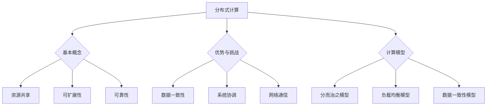
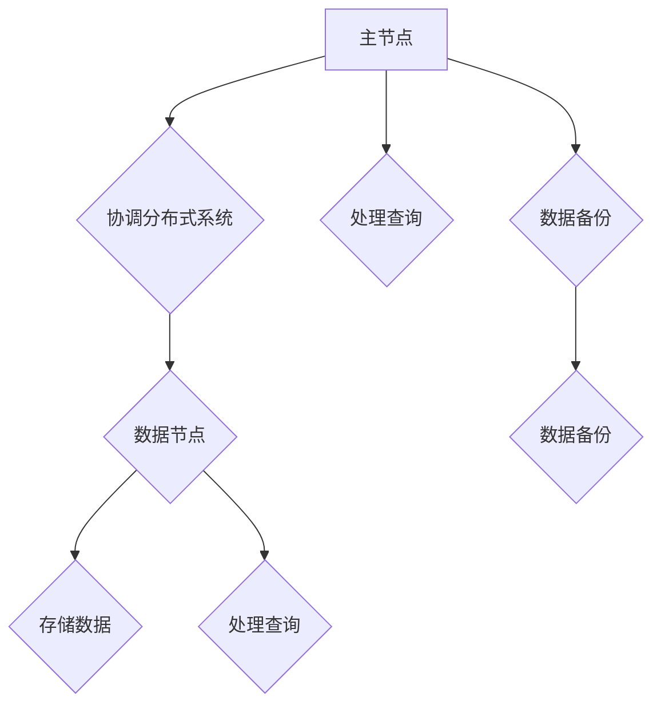

                 


### 文章标题：打造高性能的分布式计算平台

关键词：高性能、分布式计算、平台建设、架构设计、性能优化、安全性、可靠性

摘要：本文旨在探讨如何构建一个高性能的分布式计算平台。我们将从基础概念出发，逐步深入到架构设计、性能优化、安全性保障等关键环节，结合实际案例，为读者提供一套系统的建设指南。

----------------------------------------------------------------

# 《打造高性能的分布式计算平台》

## 摘要

在当今数字化时代，分布式计算平台已成为许多企业的重要基础设施。然而，如何构建一个既高效又可靠的分布式计算平台，仍然是一个复杂且富有挑战性的问题。本文将围绕这个主题，详细探讨高性能分布式计算平台的建设方法，包括核心概念的理解、架构设计、性能优化、安全性保障，以及未来趋势的展望。

## 第1章：分布式计算基础

### 1.1 分布式计算的基本概念

分布式计算是指通过多个计算机节点组成的网络来实现计算任务的方法。它能够充分利用网络中各节点的计算资源，从而提高计算效率和可靠性。

### 1.2 分布式计算的优势与挑战

#### 优势：
- 资源共享：分布式系统能够共享各节点的计算资源，提高资源利用率。
- 可扩展性：分布式系统能够方便地增加或减少节点，以适应负载变化。
- 可靠性：通过冗余设计，分布式系统在部分节点失效时仍能保持正常运行。

#### 挑战：
- 数据一致性：分布式系统中，数据的一致性是一个难题。
- 系统协调：分布式系统中的节点需要协调一致地工作，这增加了复杂性。
- 网络通信：网络延迟和带宽限制可能会影响系统的性能。

### 1.3 分布式计算模型

- **分而治之模型**：将一个大任务分解为多个小任务，由不同节点并行处理，最后汇总结果。
- **负载均衡模型**：通过负载均衡算法，合理分配任务到各个节点，避免某些节点过载。
- **数据一致性模型**：确保分布式系统中数据的一致性和可靠性。

### 1.4 分布式计算的核心概念与联系

为了更好地理解分布式计算，我们需要了解以下几个核心概念，并展示它们之间的联系：

**Mermaid 流程图：**


## 第2章：高性能计算技术

### 2.1 高性能计算概述

高性能计算（HPC）是指使用高性能计算机进行复杂的计算任务。HPC广泛应用于科学计算、工业设计、天气预报等领域。

### 2.2 高性能计算架构

高性能计算架构通常包括以下几个关键部分：

- **计算节点**：提供计算能力的物理或虚拟机。
- **存储系统**：用于存储数据和程序。
- **网络**：连接计算节点和存储系统，实现数据传输。
- **调度系统**：负责任务分配和资源管理。

### 2.3 高性能计算算法

高性能计算通常涉及复杂的算法，例如：

- **并行算法**：将一个大任务分解为多个小任务，在多个节点上同时执行。
- **分布式算法**：在网络中分布式执行，通常涉及通信和同步。

#### 核心算法原理讲解

以下是一个简单的并行算法的伪代码：

```python
// 并行计算任务
for i in 0 to N-1:
  // 分配任务到各个节点
  node = assign_node(i)
  // 在节点上执行任务
  node.execute_task(i)
  
// 汇总结果
for node in nodes:
  result = node.get_result()
  final_result = combine_results(result)
```

## 第3章：分布式计算架构设计

### 3.1 分布式计算架构设计原则

设计分布式计算架构时，需要遵循以下原则：

- **高可用性**：确保系统在节点故障时能够快速恢复。
- **可扩展性**：系统能够随着需求增长而扩展。
- **高性能**：系统在处理大量数据时能够保持高效。
- **安全性**：确保数据的安全性和系统的可靠性。

### 3.2 分布式计算架构案例分析

以一个分布式数据库系统为例，其架构通常包括以下几个部分：

- **主节点**：负责协调分布式系统的运行。
- **数据节点**：存储数据和处理查询。
- **备份节点**：用于数据备份，确保数据安全。

### 3.3 分布式计算架构实现

以下是分布式数据库系统的实现概述：



## 第4章：分布式系统性能优化

### 4.1 性能优化方法

性能优化可以从以下几个方面进行：

- **数据分区**：将数据分布到多个节点，减少单点瓶颈。
- **缓存策略**：利用缓存减少数据库查询次数。
- **负载均衡**：合理分配任务到各个节点。

### 4.2 性能监控与调优

性能监控是性能优化的关键步骤。以下是一些常用的监控工具：

- **Prometheus**：用于监控和告警。
- **Grafana**：用于数据可视化和分析。

### 4.3 性能优化案例

以下是一个分布式缓存系统的性能优化案例：

- **数据分区**：将缓存数据分布在多个节点上。
- **缓存命中率**：提高缓存命中率，减少数据库访问次数。
- **负载均衡**：使用负载均衡器，确保缓存节点的工作负载均衡。

## 第5章：分布式计算平台建设实践

### 5.1 平台建设概述

分布式计算平台建设包括以下几个步骤：

- **需求分析**：明确平台需要支持的功能和性能要求。
- **技术选型**：选择合适的硬件、软件和中间件。
- **平台搭建**：搭建计算节点、存储系统和网络。
- **测试与优化**：对平台进行测试，并进行性能优化。

### 5.2 分布式计算平台技术选型

技术选型需要考虑以下几个方面：

- **计算节点**：选择适合的硬件配置。
- **存储系统**：选择适合的数据存储方案。
- **网络**：选择适合的网络架构。

### 5.3 平台搭建与配置

平台搭建包括以下几个步骤：

- **计算节点搭建**：安装操作系统和必要的软件。
- **存储系统搭建**：配置文件系统，并进行数据分区。
- **网络搭建**：配置网络，确保节点之间的通信。

## 第6章：分布式计算的安全性和可靠性

### 6.1 安全性概述

分布式计算的安全挑战包括：

- **数据安全**：确保数据在传输和存储过程中的安全性。
- **网络安全**：防止网络攻击和数据泄露。

### 6.2 安全性保障措施

以下是一些常用的安全性保障措施：

- **加密**：对数据进行加密，确保数据在传输和存储过程中的安全性。
- **访问控制**：限制对系统和数据的访问。
- **防火墙**：使用防火墙保护网络。

### 6.3 可靠性保障

分布式系统的可靠性保障包括以下几个方面：

- **冗余设计**：通过冗余设计，确保系统在节点故障时能够保持正常运行。
- **故障转移**：实现故障转移，确保系统在节点故障时能够快速切换到其他节点。

## 第7章：未来分布式计算趋势与展望

### 7.1 分布式计算的未来趋势

未来分布式计算将朝着以下几个方向发展：

- **云计算**：云计算将提供更灵活的计算资源，满足企业对计算资源的需求。
- **边缘计算**：随着物联网的发展，边缘计算将逐渐成为分布式计算的重要组成部分。
- **量子计算**：量子计算将带来革命性的计算能力提升。

### 7.2 分布式计算的应用场景

分布式计算将在以下几个应用场景中得到广泛应用：

- **大数据处理**：分布式计算将加速大数据的处理和分析。
- **人工智能**：分布式计算将为人工智能提供强大的计算支持。
- **科学计算**：分布式计算将加速科学计算，推动科学研究的发展。

### 7.3 未来展望

未来分布式计算将面临以下几个挑战：

- **数据隐私**：如何在保障数据隐私的同时，充分利用分布式计算的能力。
- **网络带宽**：随着数据量的增加，网络带宽将成为分布式计算的一个瓶颈。

## 结语

构建高性能的分布式计算平台是一个复杂且富有挑战性的任务。本文从基础概念出发，逐步深入到架构设计、性能优化、安全性保障等关键环节，为读者提供了一套系统的建设指南。随着技术的不断发展，分布式计算将在未来发挥越来越重要的作用。希望本文能对读者在分布式计算平台建设过程中提供一些启示和帮助。

### 作者信息

作者：AI天才研究院/AI Genius Institute & 禅与计算机程序设计艺术 /Zen And The Art of Computer Programming

本文旨在为构建高性能分布式计算平台提供一套系统的建设指南。通过深入探讨分布式计算的基础知识、架构设计、性能优化、安全性保障以及未来趋势，本文希望为读者提供全面的指导和启示。随着技术的不断发展，分布式计算将在未来发挥越来越重要的作用。希望本文能对读者在分布式计算平台建设过程中提供一些启示和帮助。

