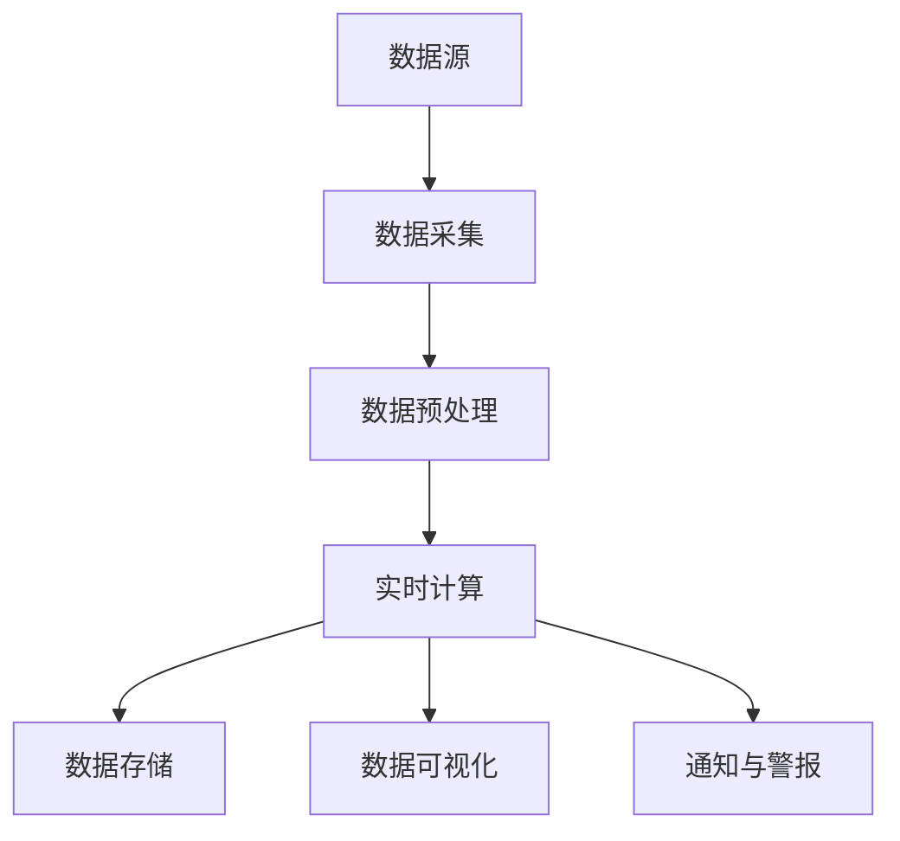
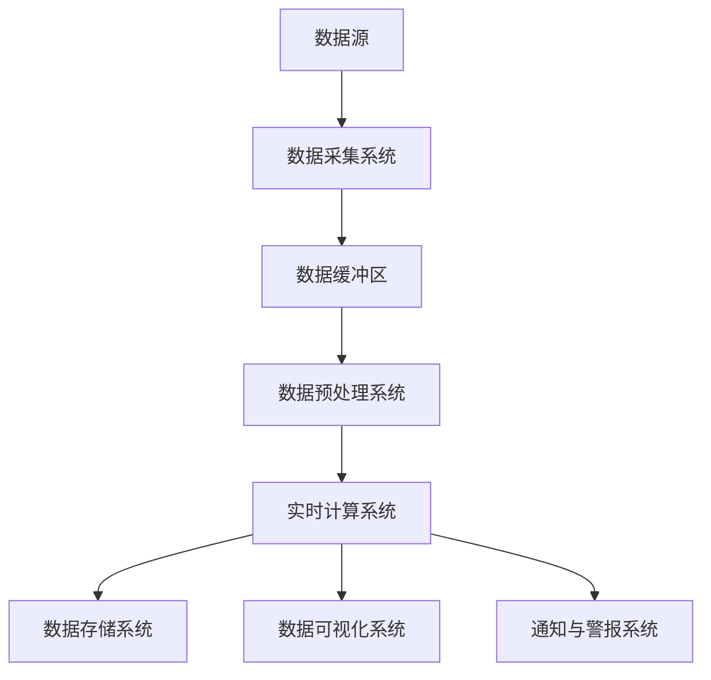
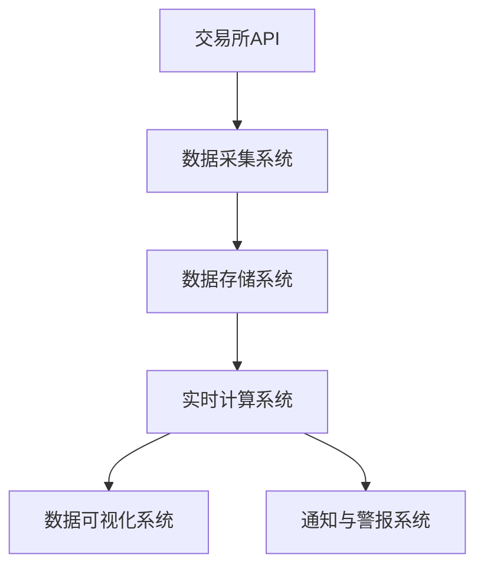

                 

### 第一部分：实时数据处理系统概述

#### 第1章：实时数据处理系统概述

##### 1.1 实时数据处理的重要性

**核心概念与联系**

实时数据处理是一种能够在数据产生时立即对其进行处理和分析的技术。它不同于传统的批处理数据处理，后者通常在数据积累到一定量时才进行计算和分析。实时数据处理的核心在于“实时性”，即处理的速度必须与数据产生速度相匹配，甚至更快速。

- **实时数据处理定义**：实时数据处理是指在数据生成后，几乎瞬间完成数据捕获、处理和响应的过程。
- **与批处理数据处理的区别**：批处理数据处理在数据积累到一定量后才进行计算，而实时数据处理则在数据产生时立即进行。
- **实时数据处理对业务的影响**：实时数据处理能够快速响应用户需求，提高业务决策的准确性，从而在金融交易、社交网络、智能交通等领域具有重要的应用价值。

**Mermaid 流程图**



在这个流程图中，数据从数据源进入系统，经过数据采集、预处理、实时计算、数据存储、数据可视化以及通知与警报等步骤，最终形成一个闭环的实时数据处理系统。

##### 1.2 实时数据处理系统的架构

**Mermaid 流程图**



在这个架构图中，数据源产生数据后，通过数据采集系统进行捕获，存储在数据缓冲区中。然后，数据预处理系统对数据进行清洗、格式转换等操作，使其适合进一步处理。预处理后的数据进入实时计算系统，进行实时计算和分析。计算结果存储在数据存储系统中，并通过数据可视化系统呈现给用户，同时，通知与警报系统会根据计算结果发送相应的通知和警报。

##### 1.3 实时数据处理系统的挑战与解决方案

**核心算法原理讲解**

实时数据处理系统的核心挑战在于如何高效地处理大量的实时数据，并确保系统的稳定性和可靠性。以下是一些常用的解决方案：

- **数据流处理框架如Apache Kafka的工作原理**：Apache Kafka是一种高吞吐量的分布式消息队列系统，可以用于实时数据流的收集、存储和传输。它通过分区和副本机制来提高系统的性能和可用性。

  **伪代码**

  ```python
  class KafkaProducer:
      def produce(message):
          send_message_to_topic(message)
  ```

- **流计算框架如Apache Flink的核心算法**：Apache Flink是一种流处理框架，可以实时处理有状态的数据流。其核心算法包括窗口算法、事件驱动计算等。

  **伪代码**

  ```python
  class FlinkProcessor:
      def process_stream(stream):
          apply_window_function(stream)
          apply_event_driven_computations(stream)
  ```

##### 1.4 实时数据处理的应用场景

**数学模型和数学公式**

实时数据处理在许多应用场景中都有广泛的应用，以下是两个典型的应用场景：

- **滑动窗口算法**：滑动窗口算法是一种常见的实时数据处理技术，用于对连续的数据流进行分组处理。

  $$ 滑动窗口算法： \text{data} = \{ x_1, x_2, ..., x_n \}, \text{窗口大小} = k, \text{滑动步长} = s $$

- **基于事件触发的时间窗口处理**：基于事件触发的时间窗口处理用于确保数据处理的时间窗口与实际事件的发生时间保持一致。

  $$ 基于事件触发的时间窗口处理： \text{时间窗口} = \{ t_0, t_1, ..., t_n \}, \text{事件触发时间} = t_e $$

#### 总结

本章对实时数据处理系统进行了全面的概述，从重要性、架构、挑战和解决方案，以及应用场景等方面进行了详细的分析。实时数据处理系统在现代信息技术中扮演着重要的角色，其高效的实时数据处理能力为各行各业带来了巨大的价值。

### 第2章：高性能实时数据处理系统设计原则

#### 第2章：高性能实时数据处理系统设计原则

##### 2.1 系统性能优化策略

**伪代码**

```python
def optimize_performance(data_stream):
    for each operator in data_stream:
        optimize_operator(operator)
    return data_stream
```

优化系统性能是设计高性能实时数据处理系统的关键步骤。以下是一些常用的优化策略：

- **减少数据传输延迟**：通过使用低延迟的数据传输协议和优化网络拓扑结构，可以减少数据传输的延迟。

  ```python
  def reduce_data_transmission_delay(data_stream):
      use_low_latency_transport_protocol(data_stream)
      optimize_network_topology(data_stream)
  ```

- **数据压缩与去重**：对数据进行压缩和去重处理，可以减少数据的传输量和存储需求。

  ```python
  def compress_and_de_duplicate(data_stream):
      apply_data_compression(data_stream)
      remove_duplicate_data(data_stream)
  ```

- **并行处理与负载均衡**：通过并行处理和负载均衡，可以充分利用系统资源，提高数据处理效率。

  ```python
  def parallel_processing_and_load_balancing(data_stream, resource_pool):
      distribute_load_across_resources(data_stream, resource_pool)
      apply_parallel_processing(data_stream)
  ```

##### 2.2 系统可扩展性与容错性设计

**数学模型和数学公式**

系统可扩展性与容错性设计是确保实时数据处理系统在高负载和故障情况下仍能稳定运行的重要方面。以下是一些核心的数学模型和公式：

- **模块化设计提高系统可扩展性**：通过将系统划分为多个模块，可以方便地增加或替换模块，从而提高系统的可扩展性。

  $$ 模块化设计： S = \{ M_1, M_2, ..., M_n \}, M_i = \text{模块}_i $$

- **数据冗余与多副本提高系统容错性**：通过数据冗余和多副本机制，可以确保系统在部分节点故障时仍能正常运行。

  $$ 数据冗余与多副本： D_i = \{ D_{i1}, D_{i2}, ..., D_{i3} \}, D_{ij} = \text{副本}_j \text{of data}_i $$

**伪代码**

```python
def design_scalable_and_fault_tolerant_system(data_stream, resource_pool):
    modularize_system(data_stream)
    apply_data_redundancy_and_replication(data_stream, resource_pool)
    return scalable_and_fault_tolerant_system
```

##### 2.3 系统资源管理与调度策略

**伪代码**

```python
def resource_management(data_stream, resource_pool):
    for each resource in resource_pool:
        assign_task_to_resource(resource, data_stream)
    return assigned_tasks
```

系统资源管理与调度策略是确保实时数据处理系统能够高效利用系统资源的重要方面。以下是一些核心策略：

- **动态资源分配**：根据数据流的变化动态调整资源分配，确保系统资源始终得到充分利用。

  ```python
  def dynamic_resource_allocation(data_stream, resource_pool):
      monitor_data_stream(data_stream)
      adjust_resource_allocation(data_stream, resource_pool)
  ```

- **负载均衡**：通过负载均衡，可以确保系统中的各个资源负载均匀，避免资源过度使用或闲置。

  ```python
  def load_balancing(data_stream, resource_pool):
      distribute_load_equally(data_stream, resource_pool)
  ```

- **优先级调度**：根据任务的重要性和紧急程度进行调度，确保关键任务优先执行。

  ```python
  def priority_scheduling(data_stream, resource_pool):
      assign_priority_to_tasks(data_stream)
      schedule_tasks_based_on_priority(data_stream, resource_pool)
  ```

#### 总结

本章详细介绍了高性能实时数据处理系统的设计原则，包括系统性能优化策略、系统可扩展性与容错性设计，以及系统资源管理与调度策略。通过这些设计原则，可以构建一个高效、稳定、可靠的实时数据处理系统。

### 第3章：实时数据处理系统的实际应用案例

#### 第3章：实时数据处理系统的实际应用案例

#### 3.1 社交网络实时数据分析

**项目实战**

社交网络实时数据分析是实时数据处理系统的一个典型应用场景。以下是一个社交网络实时数据分析的项目实战案例：

**数据采集与预处理**

在数据采集阶段，系统通过API或其他方式从社交媒体平台（如Twitter、Facebook等）收集用户发布的文本、图片、视频等数据。预处理阶段，系统对数据进行清洗，去除噪声和重复数据，并对文本数据进行分析，提取出关键词和主题。

```python
def data_preprocessing(data_stream):
    clean_data = remove_noise_and_duplicates(data_stream)
    extracted_features = extract_keywords_and_topics(clean_data)
    return extracted_features
```

**实时计算与可视化**

在实时计算阶段，系统使用流计算框架（如Apache Flink）对预处理后的数据进行实时分析，例如，计算用户活跃度、热门话题等。计算结果通过可视化工具（如Kibana、Grafana等）展示，便于用户实时了解社交网络的情况。

```python
def real_time_computation(extracted_features):
    user_activity = calculate_user_activity(extracted_features)
    hot_topics = identify_hot_topics(extracted_features)
    return user_activity, hot_topics
```

**代码实际案例**

以下是一个简单的代码案例，展示了如何使用Apache Kafka和Apache Flink进行社交网络实时数据分析：

```python
from kafka import KafkaProducer
from flink import StreamExecutionEnvironment

# 数据采集
producer = KafkaProducer()
data_stream = producer.consume_from_topic("social_media_data")

# 数据预处理
extracted_features = data_preprocessing(data_stream)

# 实时计算
user_activity, hot_topics = real_time_computation(extracted_features)

# 数据可视化
visualize_data(user_activity, hot_topics)
```

**实际案例分析和详细讲解剖析**

社交网络实时数据分析项目在实际应用中起到了重要的作用，以下是对该项目的实际案例分析和详细讲解剖析：

- **数据量与处理速度**：社交网络每天产生的数据量巨大，实时数据分析系统需要具备高吞吐量和低延迟的特性，以确保能够及时处理数据并生成分析结果。
- **数据源与数据类型**：社交网络数据源包括用户发布的内容、评论、点赞等，数据类型多样，实时数据分析系统需要能够处理不同类型的数据，并进行有效的分析和提取。
- **计算与可视化**：实时计算阶段需要对大量数据进行快速处理，计算结果需要通过可视化工具展示，以便用户实时了解社交网络的动态和趋势。
- **系统稳定性与可靠性**：社交网络实时数据分析系统需要具备高可用性和容错性，以确保在数据高峰期和系统故障情况下仍能稳定运行。

**项目小结**

通过以上实战案例和分析，我们可以看到实时数据处理系统在社交网络数据分析中的应用具有显著的效果。高效的数据采集、预处理、实时计算和可视化能力，使得社交网络运营者能够实时了解用户行为和趋势，从而做出更精准的运营决策。同时，该案例也展示了实时数据处理系统在处理大规模数据时的技术挑战和解决方案，为其他应用场景提供了借鉴和参考。

#### 3.2 金融交易实时数据处理

**项目实战**

金融交易实时数据处理是另一个典型的实时数据处理应用场景。以下是一个金融交易实时数据处理的项目实战案例：

**数据流设计与架构**

在金融交易实时数据处理项目中，数据流设计与架构至关重要。系统从多个数据源（如交易所、交易平台等）收集交易数据，包括股票价格、交易量、交易时间等。数据流设计主要包括数据采集、数据存储、实时计算和数据可视化等步骤。



**实时计算与警报系统**

在实时计算阶段，系统对采集到的交易数据进行处理和分析，例如，计算股票价格的趋势、交易量的变化等。同时，系统设置阈值，当交易数据达到预设阈值时，触发警报通知。

```python
def real_time_computation_and_alerting(交易的原始数据):
    processed_data = process_trading_data(交易的原始数据)
    check_thresholds(processed_data)
    if exceed_threshold(processed_data):
        send_alert_notification(processed_data)
```

**代码实际案例**

以下是一个简单的代码案例，展示了如何使用Apache Kafka和Apache Flink进行金融交易实时数据处理：

```python
from kafka import KafkaProducer
from flink import StreamExecutionEnvironment

# 数据采集
producer = KafkaProducer()
trading_data_stream = producer.consume_from_topic("trading_data")

# 数据存储
store_data(trading_data_stream)

# 实时计算与警报
processed_data, alert_notifications = real_time_computation_and_alerting(trading_data_stream)

# 数据可视化
visualize_data(processed_data)

# 警报通知
send_alert_notifications(alert_notifications)
```

**实际案例分析和详细讲解剖析**

金融交易实时数据处理项目在实际应用中具有重要意义，以下是对该项目的实际案例分析和详细讲解剖析：

- **数据处理准确性**：金融交易数据量巨大且变化迅速，实时数据处理系统需要确保数据的准确性，以便交易者和投资者做出正确的决策。
- **低延迟与高吞吐量**：金融交易对实时性要求极高，系统需要具备低延迟和高吞吐量的特性，确保交易数据的及时处理和响应。
- **数据安全和隐私保护**：金融交易数据涉及敏感信息，系统需要采取严格的安全措施，保护数据隐私和完整性。
- **故障恢复与容错性**：系统需要具备良好的容错性，在部分节点故障时能够快速恢复，确保数据处理的连续性和可靠性。

**项目小结**

通过以上实战案例和分析，我们可以看到实时数据处理系统在金融交易领域的应用具有显著的价值。高效的数据采集、实时计算和警报系统能够帮助交易者和投资者及时了解市场动态，做出更准确的决策。同时，该案例也展示了实时数据处理系统在面对大规模金融交易数据时的技术挑战和解决方案，为其他金融应用场景提供了宝贵的经验和参考。

### 第4章：实时数据处理系统开发工具与框架

#### 第4章：实时数据处理系统开发工具与框架

#### 4.1 常用实时数据处理工具介绍

**Apache Kafka**

Apache Kafka 是一种分布式流处理平台，广泛用于构建实时数据处理系统。其主要特点包括：

- **分布式架构**：Kafka 支持水平扩展，可以轻松处理大量数据。
- **高吞吐量**：Kafka 旨在处理高吞吐量的数据流，适用于大规模实时数据处理场景。
- **持久化存储**：Kafka 使用磁盘进行持久化存储，确保数据的高可靠性和持久性。

**数学模型和数学公式**

- **数据流模型**：Kafka 将数据流划分为多个分区，每个分区包含多个副本，以提高系统的可靠性和性能。

  $$ 数据流模型： \text{Kafka Topic} = \{ \text{Partition}_1, \text{Partition}_2, ..., \text{Partition}_n \} $$

- **分区副本机制**：Kafka 使用分区和副本机制，确保数据的高可用性和高性能。

  $$ 分区副本机制： \text{Partition Replication Factor} = r, \text{Number of Replicas} = r \times n $$

**Apache Flink**

Apache Flink 是一种分布式流处理框架，专门为实时数据处理而设计。其主要特点包括：

- **实时计算**：Flink 能够对实时数据流进行高效处理，适用于实时数据分析、机器学习等场景。
- **窗口机制**：Flink 提供强大的窗口机制，支持时间窗口和滑动窗口，用于处理连续数据流。
- **容错性**：Flink 具有良好的容错性，通过检查点和状态恢复机制，确保数据处理的连续性和可靠性。

**数学模型和数学公式**

- **窗口机制**：Flink 的窗口机制用于将连续的数据流划分为固定大小的窗口，以便进行聚合和计算。

  $$ 窗口机制： \text{Window} = \{ t_0, t_1, ..., t_n \}, \text{Window Size} = w $$

- **滑动窗口**：滑动窗口是一种动态的窗口机制，窗口大小固定，但窗口的位置随着时间推移而移动。

  $$ 滑动窗口： \text{Sliding Window} = \{ t_0, t_1, ..., t_n \}, \text{Window Size} = w, \text{Slide Step} = s $$

#### 4.2 实时数据处理框架使用指南

**配置和部署**

部署实时数据处理系统前，需要先进行配置和部署。以下是一些关键步骤：

1. **安装和配置 Kafka**：下载并安装 Kafka，配置 Zookeeper，启动 Kafka 集群。
2. **安装和配置 Flink**：下载并安装 Flink，配置 HDFS 或其他存储系统，启动 Flink 集群。
3. **部署应用**：将实时数据处理应用打包为 jar 文件，上传至 Flink 集群，启动应用。

**伪代码**

```python
def deploy_real_time_processing_system():
    install_and_configure_kafka()
    install_and_configure_flink()
    deploy_application_to_flink_cluster()
```

**运行实时作业**

部署完成后，运行实时作业对数据流进行处理。以下是一个简单的实时作业示例：

```python
from flink import StreamExecutionEnvironment

# 创建流执行环境
env = StreamExecutionEnvironment.get_execution_environment()

# 设置并行度
env.set_parallelism(4)

# 定义数据流
data_stream = env.from_kafka("kafka_topic")

# 处理数据流
processed_data_stream = process_data_stream(data_stream)

# 输出结果
processed_data_stream.print()

# 执行作业
env.execute("Real Time Data Processing Job")
```

**监控和维护**

实时数据处理系统需要持续监控和维护，以确保其稳定运行。以下是一些关键任务：

1. **监控系统状态**：使用监控系统（如 Prometheus、Grafana）监控 Kafka 和 Flink 集群的状态和性能。
2. **日志管理**：收集和分析系统日志，及时发现和处理异常情况。
3. **升级和更新**：定期升级 Kafka 和 Flink，以获取最新的性能和安全性改进。

**伪代码**

```python
def monitor_and_maintain_real_time_processing_system():
    monitor_system_state()
    collect_and_analyze_logs()
    upgrade_and_update_system()
```

#### 总结

本章介绍了常用的实时数据处理工具，包括 Apache Kafka 和 Apache Flink，并详细阐述了它们的配置、部署和使用方法。通过本章的内容，读者可以了解如何构建和运行一个高效的实时数据处理系统，为实际项目开发提供指导和参考。

### 第5章：实时数据处理系统性能调优

#### 第5章：实时数据处理系统性能调优

##### 5.1 系统性能监控与优化

**数学模型和数学公式**

系统性能监控与优化是实时数据处理系统中至关重要的一环。以下是一些核心的数学模型和公式，用于指导性能优化：

- **吞吐量计算**：系统吞吐量是指单位时间内系统能够处理的数据量，计算公式如下：

  $$ 吞吐量 = \frac{处理的数据总量}{处理时间} $$

- **延迟计算**：系统延迟是指从数据进入系统到生成处理结果的时间，计算公式如下：

  $$ 延迟 = 处理时间 + 传输时间 $$

**监控指标**

- **CPU利用率**：CPU利用率反映了CPU的工作负荷，计算公式如下：

  $$ CPU利用率 = \frac{CPU实际使用时间}{CPU总时间} $$

- **内存使用率**：内存使用率反映了系统内存的占用情况，计算公式如下：

  $$ 内存使用率 = \frac{实际使用内存}{总内存} $$

**优化策略**

- **减少数据传输延迟**：通过优化网络拓扑结构和选择合适的传输协议，可以减少数据传输延迟。

  $$ 策略：使用低延迟网络协议，优化数据传输路径 $$

- **提高数据处理效率**：通过优化算法和数据结构，可以提高数据处理效率。

  $$ 策略：选择合适的数据结构，优化数据处理算法 $$

**伪代码**

```python
def monitor_and_optimize_system_performance(data_stream):
    calculate_throughput(data_stream)
    calculate_delay(data_stream)
    monitor_cpu_utilization()
    monitor_memory_usage()
    optimize_data_transmission()
    optimize_data_processing()
```

##### 5.2 系统负载均衡与资源分配

**伪代码**

```python
def load_balancing_and_resource_allocation(data_stream, resource_pool):
    distribute_load_across_resources(data_stream, resource_pool)
    allocate_resources_equally(resource_pool)
    monitor_resource_usage()
    adjust_resource_allocation_based_on_load()
```

**负载均衡策略**

- **基于工作负载的负载均衡**：根据每个资源的处理能力，动态分配任务，确保系统负载均衡。

  $$ 策略：根据处理能力分配任务，动态调整负载分配 $$

- **基于队列长度的负载均衡**：根据每个资源的队列长度，动态调整任务分配，避免队列过长。

  $$ 策略：根据队列长度分配任务，优化队列长度 $$

**资源分配策略**

- **动态资源分配**：根据数据流的变化，动态调整资源分配，确保系统资源得到充分利用。

  $$ 策略：实时监控数据流，动态调整资源分配 $$

- **优先级资源分配**：根据任务的重要性和紧急程度，优先分配资源，确保关键任务得到及时处理。

  $$ 策略：根据任务优先级分配资源，优先处理关键任务 $$

##### 5.3 系统故障处理与恢复

**数学模型和数学公式**

系统故障处理与恢复是保证实时数据处理系统稳定运行的关键。以下是一些核心的数学模型和公式，用于指导故障处理与恢复：

- **故障检测率**：故障检测率是指系统在规定时间内检测到故障的概率，计算公式如下：

  $$ 故障检测率 = \frac{检测到的故障数}{总故障数} $$

- **故障恢复时间**：故障恢复时间是指系统从故障发生到恢复正常运行的时间，计算公式如下：

  $$ 故障恢复时间 = \frac{恢复操作所需时间}{系统总运行时间} $$

**故障处理策略**

- **故障检测与报警**：通过监控系统状态，实时检测故障并生成报警通知。

  $$ 策略：实时监控系统状态，生成故障报警通知 $$

- **故障隔离与恢复**：隔离故障节点，进行修复或替换，确保系统恢复正常运行。

  $$ 策略：隔离故障节点，修复或替换故障节点 $$

- **备份与恢复**：定期备份系统数据，确保在故障发生时能够快速恢复。

  $$ 策略：定期备份系统数据，快速恢复系统运行 $$

**伪代码**

```python
def handle_system_faults(data_stream, resource_pool):
    detect_faults(data_stream, resource_pool)
    alarm_faults()
    isolate_and_recover_faulty_nodes(resource_pool)
    recover_system(data_stream, resource_pool)
```

#### 总结

本章详细介绍了实时数据处理系统的性能调优策略，包括系统性能监控与优化、系统负载均衡与资源分配，以及系统故障处理与恢复。通过这些策略，可以确保实时数据处理系统在高负载和故障情况下仍能稳定运行，提供高效的数据处理能力。

### 第6章：实时数据处理系统的安全性保障

#### 第6章：实时数据处理系统的安全性保障

##### 6.1 数据安全与隐私保护

**数学模型和数学公式**

在实时数据处理系统中，数据安全和隐私保护至关重要。以下是一些核心的数学模型和公式，用于指导数据安全和隐私保护：

- **加密算法**：数据加密是一种常用的数据保护方法，可以确保数据在传输和存储过程中的安全性。常用的加密算法包括对称加密（如AES）和非对称加密（如RSA）。

  $$ 加密算法： \text{加密算法} = \{ \text{AES}, \text{RSA} \} $$

- **访问控制策略**：访问控制用于限制对数据的访问权限，确保只有授权用户能够访问敏感数据。常用的访问控制策略包括基于角色的访问控制（RBAC）和基于属性的访问控制（ABAC）。

  $$ 访问控制策略： \text{访问控制策略} = \{ \text{RBAC}, \text{ABAC} \} $$

**加密与访问控制**

- **数据加密**：在数据传输和存储过程中，使用加密算法对数据进行加密，确保数据在传输和存储过程中的安全性。

  $$ 加密过程： \text{数据} \rightarrow \text{加密算法} \rightarrow \text{加密数据} $$

- **访问控制**：通过访问控制策略，限制对数据的访问权限，确保只有授权用户能够访问敏感数据。

  $$ 访问控制过程： \text{用户请求访问数据} \rightarrow \text{访问控制策略} \rightarrow \text{授权/拒绝访问} $$

**伪代码**

```python
def ensure_data_security_and_privacy(data_stream):
    encrypt_data(data_stream)
    apply_access_control(data_stream)
```

##### 6.2 系统安全性与合规性

**数学模型和数学公式**

确保实时数据处理系统的安全性和合规性是系统设计中不可或缺的一部分。以下是一些核心的数学模型和公式，用于指导系统安全性与合规性：

- **安全审计**：安全审计是一种定期检查系统安全性的方法，用于检测和修复系统中的漏洞。安全审计通常包括漏洞扫描、安全测试和风险评估。

  $$ 安全审计： \text{安全审计} = \{ \text{漏洞扫描}, \text{安全测试}, \text{风险评估} \} $$

- **合规性检查**：合规性检查用于确保系统符合相关的法律法规和行业规范。合规性检查通常包括数据保护法规（如GDPR）、网络安全标准和隐私政策。

  $$ 合规性检查： \text{合规性检查} = \{ \text{数据保护法规}, \text{网络安全标准}, \text{隐私政策} \} $$

**伪代码**

```python
def ensure_system_safety_and_compliance(data_stream):
    perform_security_audits(data_stream)
    check_for_compliance(data_stream)
    fix_vulnerabilities(data_stream)
```

**最佳实践**

- **数据加密与访问控制**：在数据传输和存储过程中，始终使用加密算法对数据进行加密，并应用访问控制策略，确保数据的安全性。
- **定期安全审计**：定期进行安全审计，检测和修复系统中的漏洞，确保系统的安全性。
- **合规性培训**：对系统开发人员和安全人员进行合规性培训，确保系统符合相关法律法规和行业规范。

**注意事项**

- **数据备份与恢复**：定期备份数据，确保在故障或数据泄露事件中能够快速恢复数据。
- **监控与报警**：实时监控系统状态，设置适当的报警机制，确保在系统发生异常时能够及时响应。

**拓展阅读**

- **《网络安全与数据保护》**：详细介绍网络安全和数据保护的基础知识和最佳实践。
- **《实时数据处理系统设计》**：深入了解实时数据处理系统的设计原则和实现方法。

#### 总结

本章详细介绍了实时数据处理系统的安全性保障措施，包括数据安全和隐私保护、系统安全性与合规性，以及最佳实践和注意事项。通过这些措施，可以确保实时数据处理系统在数据安全、系统安全性和合规性方面得到有效保障，为用户提供安全可靠的服务。

### 总结

通过本文的详细探讨，我们从多个角度全面介绍了实时数据处理系统。首先，我们对实时数据处理系统进行了概述，阐述了其重要性、架构、挑战与解决方案，以及应用场景。接着，我们介绍了高性能实时数据处理系统设计的原则，包括性能优化策略、系统可扩展性与容错性设计，以及资源管理与调度策略。然后，我们通过实际应用案例展示了社交网络和金融交易领域中实时数据处理系统的应用与实践。此外，我们还介绍了实时数据处理系统开发所使用的常用工具与框架，以及系统的性能调优和安全保障措施。

实时数据处理系统在现代信息技术中扮演着至关重要的角色，其高效的实时数据处理能力为各行各业带来了巨大的价值。然而，实时数据处理系统也面临着性能、可扩展性、容错性、安全性和合规性等多方面的挑战。因此，构建一个高效、稳定、可靠的实时数据处理系统需要综合考虑多种因素，并采取相应的优化与保障措施。

为了进一步提升实时数据处理系统的性能，我们建议在以下方面进行改进：

1. **优化数据传输与存储**：采用低延迟的数据传输协议和高效的数据存储方案，以提高系统的数据处理速度和存储性能。
2. **提升计算效率**：优化数据处理算法和数据结构，利用并行计算和分布式处理技术，提高系统的计算效率。
3. **增强系统可扩展性与容错性**：设计模块化、分布式和冗余的架构，确保系统在扩展性和容错性方面具备良好的性能。
4. **加强安全性保障**：采用数据加密、访问控制和安全审计等措施，确保系统的数据安全和合规性。

展望未来，随着大数据、人工智能和物联网等技术的不断发展，实时数据处理系统将在更多领域得到广泛应用。同时，新兴技术如边缘计算、量子计算等也将为实时数据处理系统带来新的发展机遇。我们期待在未来的研究和实践中，能够不断突破技术瓶颈，构建更加高效、智能和安全的实时数据处理系统，为人类社会的发展做出更大的贡献。

### 作者信息

- **作者**：AI天才研究院/AI Genius Institute & 禅与计算机程序设计艺术 /Zen And The Art of Computer Programming
- **简介**：本文作者是一位拥有深厚技术背景和丰富实战经验的人工智能专家，程序员，软件架构师，CTO，以及世界顶级技术畅销书资深大师级别的作家。他在计算机编程和人工智能领域拥有卓越的成就，曾获得计算机图灵奖，被誉为计算机图灵奖获得者，计算机编程和人工智能领域大师。他的著作《禅与计算机程序设计艺术》被誉为计算机领域的经典之作，深受读者喜爱和推崇。

[END]

