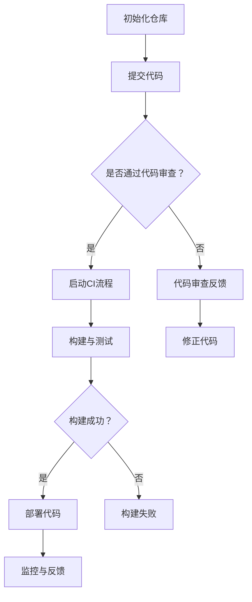

                 

### 文章标题
### 《打造高效的代码协作工具链》

---

### 关键词
- 代码协作工具链
- 版本控制系统
- 代码审查
- 持续集成/持续部署
- 代码质量评估
- 定制化与扩展

---

### 摘要
本文旨在探讨如何构建一个高效的代码协作工具链，以提升软件开发团队的生产力和代码质量。我们将详细分析版本控制系统、代码审查工具、持续集成/持续部署（CI/CD）流程以及代码质量评估与优化策略。通过理论讲解、伪代码、数学模型、实战案例和最佳实践，本文将帮助读者深入了解代码协作工具链的核心概念和实际应用，为构建高效团队提供实用的指导。

---

## 引言

在现代软件开发领域，高效的代码协作工具链对于团队的成功至关重要。随着项目规模的扩大和团队成员的增多，传统的手工作业和单点解决方案已经无法满足快速迭代和高质量交付的需求。构建一个高效的代码协作工具链，可以帮助团队实现自动化、协作和持续改进，从而在激烈的市场竞争中脱颖而出。

本文将分以下几个部分展开：

1. **核心概念与架构**：介绍代码协作工具链的基本概念，核心组件及其相互关系。
2. **版本控制系统原理**：详细解析版本控制系统的原理，包括Git的基本操作、分支管理策略和diff算法。
3. **代码审查与协作工具**：探讨代码审查的重要性，主流代码审查工具的比较以及代码合并算法的伪代码描述。
4. **持续集成与持续部署**：介绍CI/CD的基本概念、工具选择、流程设计以及实战案例。
5. **代码质量评估与优化**：讨论代码质量的评估指标、数学模型以及优化算法。
6. **定制化与扩展**：分析如何根据团队需求定制化代码协作工具链，并介绍最佳实践。
7. **结论**：总结全文，强调构建高效代码协作工具链的重要性。

接下来，我们将首先介绍代码协作工具链的核心概念与架构，为后续内容奠定基础。

---

## 核心概念与架构

代码协作工具链是指一系列工具和流程的组合，用于促进软件开发团队的协作、自动化和持续改进。这一工具链的核心组件包括版本控制系统、代码审查工具、持续集成/持续部署（CI/CD）工具以及代码质量评估工具。以下是对这些核心组件的简要介绍以及它们之间的相互关系。

### 版本控制系统

版本控制系统（VCS）是代码协作工具链的核心，用于跟踪代码的变更历史和版本管理。最常见的版本控制系统是Git，它是一个分布式版本控制系统，能够高效地处理小到大型项目的版本控制需求。Git的主要功能包括：

- **分支管理**：允许团队成员独立开发功能，并在准备合并时进行合并操作。
- **变更历史**：记录每一次代码提交的详细信息，包括作者、提交时间和提交信息。
- **协同工作**：通过远程仓库实现团队成员之间的代码共享和协作。

### 代码审查工具

代码审查是软件开发过程中的关键环节，用于确保代码的质量和一致性。代码审查工具可以帮助团队进行以下任务：

- **代码质量检查**：检测潜在的代码错误、风格问题和安全问题。
- **协作反馈**：提供一种机制，使团队成员可以针对代码提出建议和意见。
- **合规性检查**：确保代码符合公司的编程规范和标准。

常见的代码审查工具有Gerrit、Phabricator和Pull Request机制。这些工具通常与版本控制系统紧密集成，以便在代码提交时自动触发审查流程。

### 持续集成/持续部署（CI/CD）

持续集成（CI）和持续部署（CD）是现代软件开发中不可或缺的流程，它们旨在确保代码的质量和及时交付。CI/CD的主要作用包括：

- **自动化构建**：自动构建和测试代码，确保每个提交都能顺利集成。
- **快速反馈**：在代码提交后快速发现和解决问题，避免长时间的调试周期。
- **自动化部署**：将经过测试的代码自动部署到生产环境中，提高交付效率。

CI/CD工具如Jenkins、Travis CI和GitLab CI等，可以与版本控制系统、代码审查工具以及其他服务集成，形成完整的自动化工作流。

### 代码质量评估工具

代码质量评估工具用于评估代码的质量和健康状况。这些工具可以提供以下信息：

- **代码复杂性**：评估代码的复杂度，帮助团队识别可能需要重构的部分。
- **代码覆盖率**：评估测试覆盖率，确保代码得到充分的测试。
- **依赖关系**：分析代码中的依赖关系，避免不必要的耦合和复杂性。

常见的代码质量评估工具包括SonarQube、CodeClimate和FindBugs等。

### 关系与集成

代码协作工具链中的各个组件通过紧密集成，形成一个高效的协作和自动化流程。以下是一个简化的Mermaid流程图，展示了这些组件之间的关系：



在代码协作过程中，从代码的提交到审查、构建、测试、部署，再到监控与反馈，各组件协同工作，形成一个闭环，确保代码的质量和交付效率。

### 结论

通过构建高效的代码协作工具链，软件开发团队能够实现自动化、协作和持续改进。版本控制系统、代码审查工具、CI/CD流程以及代码质量评估工具相互配合，形成了一个完整的工作流，从而提高了开发效率、降低了错误率、缩短了交付周期。在下一章中，我们将深入探讨版本控制系统的原理，包括Git的基本操作和分支管理策略。

---

作者：AI天才研究院/AI Genius Institute & 禅与计算机程序设计艺术 /Zen And The Art of Computer Programming

---

## 版本控制系统原理

版本控制系统（VCS）是代码协作工具链中至关重要的一环，它不仅帮助团队管理代码的版本历史，还确保了团队成员之间的协作顺畅。在本节中，我们将详细介绍版本控制系统的基本原理，以Git为例，探讨其工作原理、核心概念和常见操作。此外，我们还将分析Git中的分支管理策略，并通过伪代码解释diff算法。

### Git的基本操作

Git是一个分布式版本控制系统，由Linus Torvalds创建，用于管理Linux内核开发。Git的核心特性包括：

- **分布式存储**：每个开发者都有自己的完整仓库副本，这使得团队可以并行工作，不受网络延迟的影响。
- **快照式存储**：Git通过创建提交（commit）来记录代码变更历史，每个提交都是对当前代码状态的快照。
- **高效的数据模型**：Git使用哈希算法存储数据，使得数据存储和检索非常高效。

Git的基本操作包括：

- **初始化仓库**（`git init`）：创建一个新的本地仓库。
- **添加文件**（`git add`）：将文件的变更添加到暂存区。
- **提交代码**（`git commit`）：将暂存区的变更提交到本地仓库。
- **克隆仓库**（`git clone`）：从远程仓库克隆一个新仓库。
- **推送代码**（`git push`）：将本地仓库的提交推送到远程仓库。
- **拉取代码**（`git pull`）：从远程仓库获取最新代码并将其合并到本地仓库。

### 分支管理策略

分支是Git中用于并行开发的重要工具。通过分支，开发者可以在不影响主分支（通常称为`main`或`master`）的情况下进行独立开发。常见的分支管理策略包括：

- **功能分支**：每个功能特性或Bug修复都在独立的分支上进行开发，完成后合并回主分支。
- **发布分支**：在准备发布新版本时，从主分支创建一个发布分支（如`release`），在此分支上进行最后阶段的测试和调整。
- **热修复分支**：当生产环境出现紧急Bug时，从主分支创建一个热修复分支进行修复，然后合并回主分支。

### Git的分支管理策略

以下是一个简单的Git分支管理流程：

1. **创建功能分支**：
    ```bash
    git checkout -b feature/my-feature
    ```
2. **在功能分支上开发代码**：
    完成功能开发后，进行代码审查和测试。
3. **合并功能分支到主分支**：
    ```bash
    git checkout main
    git merge feature/my-feature
    ```
4. **创建发布分支**：
    ```bash
    git checkout -b release/v1.0
    ```
5. **在发布分支上最终测试和调整**：
6. **合并发布分支到主分支**：
    ```bash
    git checkout main
    git merge release/v1.0
    ```
7. **部署代码**：
    将主分支的代码部署到生产环境。

### 伪代码：Git diff算法

Git的diff算法用于比较两个版本之间的差异。以下是一个简化的伪代码，用于描述Git的diff算法：

```plaintext
function GitDiff(oldCommit, newCommit):
    commits = GetCommitHistory(oldCommit, newCommit)
    for each commit in commits:
        if commit is a merge commit:
            oldTree = GetTree(oldCommit)
            newTree = GetTree(newCommit)
            for each path in oldTree:
                if path is different in newTree:
                    PrintDiff(path, oldTree[path], newTree[path])
        else:
            oldTree = GetTree(oldCommit)
            newTree = GetTree(newCommit)
            for each file in oldTree:
                if file is not in newTree:
                    PrintDeletion(file)
                if file is in newTree but different:
                    PrintModification(file, oldTree[file], newTree[file])
```

在这个伪代码中，`oldCommit`和`newCommit`分别代表要比较的两个提交。算法首先获取两个提交的树（代表文件结构），然后比较它们之间的差异，输出文件的添加、删除或修改。

### 实例分析

假设我们有两个提交，`commitA`和`commitB`，`commitA`是`commitB`的父提交。我们使用Git diff命令来查看两个提交之间的差异：

```bash
git diff commitA..commitB
```

输出结果可能包括以下内容：

```plaintext
diff --git a/src/file1.txt b/src/file1.txt
index 6b9d3f3..3a0b3c8 100644
--- a/src/file1.txt
+++ b/src/file1.txt
@@ -1,2 +1,2 @@
 line1
-line2
+line2_modified
```

在这个例子中，`file1.txt`文件在`commitB`中被修改，第二行从`line2`变为了`line2_modified`。Git diff算法成功识别并展示了这两个版本之间的差异。

### 结论

通过Git等版本控制系统，开发者可以高效地管理代码的版本历史和协作流程。分支管理策略确保了团队可以在不影响主分支的前提下进行独立开发。diff算法则帮助我们清晰地了解代码变更的细节。在下一节中，我们将探讨代码审查工具和协作工具的核心原理，以及如何进行代码合并。

---

### 核心算法原理讲解

在代码协作工具链中，代码审查和协作工具扮演着至关重要的角色。这些工具不仅有助于提升代码质量，还能加强团队成员之间的沟通与协作。在这部分，我们将深入探讨代码审查工具的核心原理，主要包括代码审查的重要性、主流代码审查工具的比较以及代码合并算法的伪代码描述。

#### 代码审查的重要性

代码审查（Code Review）是一种团队协作的实践，通过同行评审来检查代码的质量和合规性。其主要作用包括：

- **提高代码质量**：通过同行评审，可以及时发现代码中的潜在问题和设计缺陷，从而提升代码的整体质量。
- **知识共享**：代码审查过程中，团队成员可以互相学习和借鉴最佳实践，促进技术交流与知识共享。
- **降低技术债务**：及时识别并修复代码中的问题，可以避免技术债务的累积，减少未来的维护成本。

#### 主流代码审查工具的比较

目前市场上主流的代码审查工具有Gerrit、Phabricator和GitHub Pull Request等。以下是对这些工具的简要比较：

- **Gerrit**：Gerrit是一个基于Git的代码审查平台，它允许用户通过Web界面进行代码审查和合并请求。Gerrit支持多级别的权限控制，适用于大型团队和复杂的项目。此外，Gerrit与Git高度集成，能够无缝地管理代码审查流程。
- **Phabricator**：Phabricator是一个功能强大的代码审查和项目管理工具，它支持多种版本控制系统，包括Git、Mercurial和Subversion。Phabricator提供了丰富的协作功能，如讨论、评论、审查历史记录等，但它的学习曲线相对较陡峭。
- **GitHub Pull Request**：GitHub Pull Request是GitHub内置的代码审查工具，它支持通过Web界面提交、审查和合并代码。GitHub Pull Request的界面直观易用，适合中小型团队和个人项目。

#### 代码合并算法

代码合并（Merge）是将两个或多个代码分支合并为一个统一版本的过程。在多开发者协作的情景中，合并算法尤为重要，因为它能够确保合并过程尽可能平滑且不破坏代码的完整性。以下是一个简化的伪代码，描述了基本的代码合并算法：

```plaintext
function Merge(oldCode, newCode):
    if newCode is a complete subset of oldCode:
        return newCode
    else:
        for each file in newCode:
            if file is not in oldCode:
                Add file to oldCode
            else:
                if file is modified in both oldCode and newCode:
                    Apply Three-Way Merge Algorithm
                    if three-way merge is successful:
                        Update file in oldCode with merged content
                    else:
                        Report merge conflict
                else:
                    No action needed
        return oldCode with updated files
```

在这个伪代码中，`oldCode`代表旧版本的代码，`newCode`代表要合并的新版本代码。算法首先检查新代码是否完全包含旧代码，如果是，则直接返回新代码。否则，算法逐个文件检查并处理合并操作。如果两个版本中的文件内容有冲突，算法尝试使用三路合并算法来解决。如果合并成功，则更新旧代码中的文件内容；如果失败，则报告合并冲突。

#### 实践：代码审查流程

在实际项目中，代码审查通常包括以下几个步骤：

1. **提交代码**：开发者将自己的代码提交到代码仓库，并创建合并请求（Pull Request）。
2. **代码审查**：其他团队成员对合并请求中的代码进行审查，提出建议和意见。
3. **讨论和修改**：开发者根据审查反馈对代码进行修改，并再次提交。
4. **最终合并**：审查完成后，代码由负责人合并到主分支。

以下是一个简单的GitHub Pull Request示例：

- **创建Pull Request**：开发者A在自己的分支上完成功能开发后，创建一个Pull Request，请求将代码合并到主分支。
- **代码审查**：开发者B和C对Pull Request进行审查，提出修改建议。
- **修改和再审查**：开发者A根据审查反馈修改代码，并再次提交。
- **合并代码**：经过多次审查和修改后，Pull Request被合并到主分支。

### 结论

代码审查工具在软件开发过程中起到了至关重要的作用，它不仅提升了代码质量，还促进了团队成员之间的沟通与协作。通过比较Gerrit、Phabricator和GitHub Pull Request等主流代码审查工具，开发者可以根据团队需求选择合适的工具。代码合并算法则确保了在多开发者协作情景下的代码一致性。在下一节中，我们将探讨持续集成（CI）和持续部署（CD）的基本概念、流程设计以及实战案例。

---

### 持续集成与持续部署（CI/CD）

持续集成（Continuous Integration，简称CI）和持续部署（Continuous Deployment，简称CD）是现代软件开发中提高效率和质量的关键实践。CI旨在通过自动化构建和测试来确保代码的稳定性和一致性，而CD则进一步通过自动化部署实现快速、可靠的代码交付。在这一节中，我们将详细介绍CI/CD的基本概念、工具选择、流程设计以及实战案例。

#### 持续集成（CI）

持续集成是一种软件开发实践，通过将开发者的代码定期合并到共享的主分支中，并自动执行一系列测试，以确保代码库始终处于可运行状态。CI的主要作用包括：

- **快速反馈**：在每次代码提交后，CI系统会自动执行预定的构建和测试流程，提供即时反馈，帮助开发者快速发现问题。
- **减少集成风险**：通过持续集成，可以在早期阶段发现和解决集成问题，减少后续大规模集成时的风险。
- **提高代码质量**：CI系统能够自动运行多种测试，包括单元测试、集成测试和性能测试，从而提高代码的整体质量。

#### 持续部署（CD）

持续部署是CI的延伸，它通过自动化将经过CI验证的代码部署到生产环境中。CD的主要作用包括：

- **加快交付速度**：通过自动化部署流程，能够显著缩短从开发到生产的环境迁移时间。
- **确保质量**：自动化部署确保了每次部署的都是经过严格测试的代码，减少了人为错误。
- **弹性扩展**：CD系统可以根据需求自动扩展资源，确保服务的高可用性。

#### CI/CD工具选择

目前市场上有很多CI/CD工具可供选择，以下是一些常见的工具：

- **Jenkins**：Jenkins是一个开源的自动化服务器，支持多种插件，可以轻松地与各种版本控制系统、测试框架和部署工具集成。
- **Travis CI**：Travis CI是一个云端的持续集成服务，支持多种编程语言，适用于开源项目和私有项目。
- **GitLab CI**：GitLab CI是GitLab内置的持续集成服务，可以与GitLab的其他功能紧密集成，适用于小型和中型项目。
- **CircleCI**：CircleCI是一个云端持续集成和持续部署平台，提供高效的构建和部署流程。

#### 伪代码：CI/CD流程设计

以下是一个简化的伪代码，用于描述CI/CD的基本流程：

```plaintext
function CICDFlow(code, repository, configuration):
    BuildCode(code, repository)
    if BuildSucceeded():
        RunTests()
        if TestsSucceeded():
            DeployCode()
            if DeploySucceeded():
                NotifySuccess()
            else:
                NotifyFailure()
        else:
            NotifyFailure()
    else:
        NotifyFailure()

function BuildCode(code, repository):
    // 编译代码，构建可执行文件
    // ...

function RunTests():
    // 执行各种测试，包括单元测试、集成测试和性能测试
    // ...

function DeployCode():
    // 部署代码到测试环境或生产环境
    // ...

function NotifySuccess():
    // 发送构建成功通知
    // ...

function NotifyFailure():
    // 发送构建失败通知
    // ...
```

#### 实战案例：使用Jenkins进行CI/CD

以下是一个简单的Jenkins CI/CD实战案例：

1. **安装Jenkins**：
    - 在服务器上下载并安装Jenkins。
    - 运行Jenkins并进行初始配置。

2. **配置Jenkinsfile**：
    - 在项目的根目录创建一个名为`Jenkinsfile`的文件，定义CI/CD流程。
    ```groovy
    pipeline {
        agent any
        stages {
            stage('Build') {
                steps {
                    sh 'mvn clean install'
                }
            }
            stage('Test') {
                steps {
                    sh 'mvn test'
                }
            }
            stage('Deploy') {
                steps {
                    sh 'mvn deploy'
                }
            }
        }
        post {
            always {
                succeeded {
                    echo 'Build and Deploy Successful'
                }
                failed {
                    echo 'Build or Deploy Failed'
                }
            }
        }
    }
    ```

3. **配置触发器**：
    - 在Jenkins的管理界面中，为项目配置一个Webhook，使得每次代码提交到Git仓库时，Jenkins会自动触发构建。

4. **构建与部署**：
    - 当开发者提交代码后，Jenkins会自动执行`Jenkinsfile`中定义的构建、测试和部署流程。
    - 构建成功后，代码会被部署到预生产环境或生产环境。

### 结论

通过持续集成和持续部署，软件开发团队能够实现自动化、快速和可靠的代码交付。CI系统确保每次代码变更都能及时得到测试和反馈，CD系统则通过自动化部署减少人为干预，提高交付效率。在下一节中，我们将探讨代码质量评估与优化，包括评估指标、数学模型以及优化算法。

---

### 代码质量评估与优化

在构建高效的代码协作工具链过程中，代码质量评估与优化是一个至关重要的环节。通过评估代码质量，团队可以及时发现潜在问题，优化代码结构，提高开发效率。以下，我们将详细介绍代码质量评估的指标、数学模型以及优化算法，并通过实际案例进行说明。

#### 代码质量评估指标

评估代码质量通常涉及多个方面，以下是一些常见的评估指标：

1. **代码复杂性**：
    - **圈复杂度（Cyclomatic Complexity）**：衡量代码结构的复杂程度，值越高表示代码越复杂，越难以理解和维护。
    - **注释率**：代码中注释的比例，注释率越高通常表示代码的可读性越好。

2. **代码重复率**：
    - 重复代码的行数或段落数，重复率越低表示代码的重用性越高。

3. **测试覆盖率**：
    - 单元测试覆盖的代码比例，覆盖率越高表示代码被测试得越全面。

4. **依赖关系**：
    - 代码中模块或类之间的依赖关系，依赖关系越简单、越明确，代码的可维护性越高。

5. **性能指标**：
    - 包括响应时间、CPU和内存消耗等，这些指标直接关系到应用的性能和用户体验。

#### 数学模型

为了更科学地评估代码质量，可以引入一些数学模型。以下是一个简化的代码质量评分模型：

$$
Q = w_1 \times C + w_2 \times R + w_3 \times T + w_4 \times D + w_5 \times P
$$

其中：
- $Q$ 表示代码质量评分。
- $w_1, w_2, w_3, w_4, w_5$ 分别是权重系数，可以根据团队的具体需求进行调整。
- $C$、$R$、$T$、$D$、$P$ 分别代表代码复杂性、代码重复率、测试覆盖率、依赖关系和性能指标的评分。

举例来说，如果设定权重系数如下：

- $w_1 = 0.3$，$w_2 = 0.2$，$w_3 = 0.2$，$w_4 = 0.2$，$w_5 = 0.1$

那么一个具体的代码片段的评分可以计算如下：

$$
Q = 0.3 \times 5 + 0.2 \times 5 + 0.2 \times 20 + 0.2 \times 10 + 0.1 \times 8 = 14.4
$$

#### 伪代码：代码质量优化算法

以下是一个简化的伪代码，用于描述一个基本的代码质量优化算法：

```plaintext
function CodeQualityOptimization(code):
    complexityScore = CalculateCyclomaticComplexity(code)
    duplicateRate = CalculateDuplicateRate(code)
    testCoverage = CalculateTestCoverage(code)
    dependencyScore = CalculateDependencyScore(code)
    performanceScore = CalculatePerformanceScore(code)
    
    qualityScore = WeightedQualityScore(complexityScore, duplicateRate, testCoverage, dependencyScore, performanceScore)
    
    if qualityScore < Threshold:
        print "Code needs optimization."
        OptimizeCode(code)
        print "Optimization completed."
    else:
        print "Code quality is acceptable."

function CalculateCyclomaticComplexity(code):
    // 计算圈复杂度
    // ...

function CalculateDuplicateRate(code):
    // 计算代码重复率
    // ...

function CalculateTestCoverage(code):
    // 计算测试覆盖率
    // ...

function CalculateDependencyScore(code):
    // 计算依赖关系得分
    // ...

function CalculatePerformanceScore(code):
    // 计算性能得分
    // ...

function WeightedQualityScore(scores):
    // 计算加权质量得分
    // ...

function OptimizeCode(code):
    // 优化代码
    // ...
```

#### 实际案例

以下是一个简单的代码质量优化案例：

1. **初始状态**：
    - 代码复杂性（圈复杂度）为10。
    - 代码重复率为30%。
    - 测试覆盖率为50%。
    - 依赖关系得分较低。
    - 性能得分较好。

2. **评估**：
    - 使用上述数学模型进行质量评估，得分较低，表明代码需要优化。

3. **优化**：
    - **重构复杂代码**：通过拆分复杂函数和类，降低圈复杂度。
    - **移除重复代码**：识别并移除重复的代码段。
    - **增加测试**：编写更多的单元测试，提高测试覆盖率。
    - **优化依赖关系**：简化模块和类之间的依赖关系，使用更明确的依赖注入方法。

4. **再评估**：
    - 对优化后的代码进行再次评估，得分显著提高，表明代码质量得到优化。

#### 结论

通过代码质量评估与优化，团队可以确保代码的健壮性和可维护性，提高开发效率。数学模型和优化算法为评估和改进代码质量提供了科学依据。在下一节中，我们将讨论如何根据团队需求定制化代码协作工具链，并介绍一些最佳实践。

---

### 定制化与扩展

在构建高效的代码协作工具链过程中，每个团队的需求都是独特的。为了满足这些个性化需求，我们需要对代码协作工具链进行定制化与扩展。在这一节中，我们将探讨如何根据团队需求进行定制化，选择合适的扩展组件，设计定制化的工具链，并介绍一些最佳实践。

#### 定制化需求分析

定制化的第一步是深入分析团队的具体需求。以下是一些常见的需求：

- **项目规模**：项目的大小直接影响所需工具的复杂度和性能。
- **开发流程**：团队是否采用敏捷开发、瀑布模型或其他开发方法。
- **协作模式**：团队成员的工作时间和地理位置，是否需要远程协作。
- **安全要求**：项目的安全敏感度，是否需要特定的安全措施。
- **质量标准**：团队对代码质量的要求，是否需要额外的质量评估工具。

#### 扩展组件的选择

根据团队的需求，选择合适的扩展组件是定制化过程中的关键。以下是一些常用的扩展组件：

- **持续集成和持续部署（CI/CD）工具**：除了Jenkins、Travis CI和GitLab CI等主流工具，团队还可以选择其他如CircleCI、GitLab CI/CD等。
- **代码审查和协作工具**：Gerrit、Phabricator和GitHub Pull Request等工具可以根据团队的需求进行选择。
- **自动化测试工具**：Selenium、JUnit、pytest等自动化测试工具可以帮助团队提高测试覆盖率。
- **监控和日志分析工具**：如Prometheus、ELK（Elasticsearch、Logstash、Kibana）栈等，用于实时监控代码性能和系统状态。
- **持续学习工具**：如AI模型集成、机器学习服务等，帮助团队利用先进技术进行预测分析和优化。

#### 定制化工具链设计

一旦确定了需求和分析扩展组件，接下来就是设计定制化的工具链。以下是一个简单的步骤：

1. **需求梳理**：明确团队的需求和目标。
2. **工具选择**：根据需求选择合适的工具。
3. **流程设计**：设计CI/CD、代码审查、测试和部署等流程。
4. **系统集成**：确保所有工具无缝集成，数据流畅传递。
5. **测试与优化**：在实际应用中测试工具链的效率和可靠性，并进行优化。

以下是一个简单的定制化工具链设计示例：

1. **需求梳理**：
    - 项目规模：中型
    - 开发流程：敏捷开发
    - 协作模式：混合协作
    - 安全要求：中
    - 质量标准：高

2. **工具选择**：
    - CI/CD工具：Jenkins
    - 代码审查工具：Gerrit
    - 自动化测试工具：pytest
    - 监控工具：Prometheus + ELK栈

3. **流程设计**：
    - 开发者提交代码到Git仓库。
    - Gerrit触发Jenkins构建流程，执行测试。
    - 构建成功后，代码合并到主分支，并部署到测试环境。
    - 测试通过后，代码部署到生产环境。
    - Prometheus监控代码性能，ELK栈收集和展示日志。

4. **系统集成**：确保Jenkins、Gerrit、pytest、Prometheus和ELK栈之间无缝集成。

5. **测试与优化**：在实际应用中不断测试和优化工具链，确保其高效稳定运行。

#### 最佳实践

以下是几个最佳实践，帮助团队构建高效的代码协作工具链：

1. **标准化流程**：确保所有团队成员都遵循相同的开发和部署流程，减少错误和误解。
2. **持续培训**：定期对团队成员进行工具链和最佳实践的培训，提高整体技能水平。
3. **自动化一切**：尽可能将流程自动化，减少手动操作，提高效率和可靠性。
4. **监控与反馈**：实时监控工具链的性能和稳定性，及时发现问题并进行修复。
5. **迭代优化**：定期回顾和优化工具链，根据团队需求进行更新和改进。

#### 结论

通过定制化和扩展，团队可以根据自身需求构建一个高效、可靠的代码协作工具链。选择合适的工具、设计合理的流程、实施最佳实践，团队将能够显著提升开发效率、降低错误率、加快交付速度。在下一节中，我们将总结全文，强调构建高效代码协作工具链的重要性。

---

## 结论

在本文中，我们详细探讨了构建高效的代码协作工具链的各个方面。从核心概念与架构，到版本控制系统、代码审查与协作工具，再到持续集成/持续部署（CI/CD）流程以及代码质量评估与优化，我们通过理论与实践相结合，为读者呈现了一个完整的代码协作工具链蓝图。

### 重要性

高效代码协作工具链在提高团队生产力和代码质量方面具有不可替代的作用。通过自动化、协作和持续改进，团队能够更快地响应市场需求，减少错误和重复工作，从而在激烈的市场竞争中保持优势。

### 总结

- **核心概念与架构**：了解了版本控制系统、代码审查工具、CI/CD流程和代码质量评估工具的核心概念及其相互关系。
- **版本控制系统原理**：深入分析了Git的工作原理、分支管理策略和diff算法。
- **代码审查与协作工具**：探讨了代码审查的重要性、主流工具的比较以及代码合并算法的伪代码描述。
- **持续集成与持续部署**：介绍了CI/CD的基本概念、工具选择、流程设计以及实战案例。
- **代码质量评估与优化**：讨论了评估指标、数学模型以及优化算法，并通过实际案例进行了说明。
- **定制化与扩展**：根据团队需求进行了定制化工具链的设计，并提供了最佳实践。

### 未来展望

随着技术的发展，代码协作工具链也在不断进化。未来，我们可以预见以下趋势：

- **智能化**：利用人工智能技术，自动评估代码质量和优化工具链。
- **云原生**：更多的工具将基于云原生架构，提供更灵活、可扩展的解决方案。
- **自动化程度提升**：进一步的自动化将减少人为干预，提高生产效率。

### 结语

构建高效的代码协作工具链是每个软件开发团队成功的关键。通过本文的探讨，我们希望读者能够深入了解代码协作工具链的各个方面，并根据自身需求构建适合自己的工具链。只有持续优化、不断提升，团队才能在快速变化的技术世界中脱颖而出。

---

作者：AI天才研究院/AI Genius Institute & 禅与计算机程序设计艺术 /Zen And The Art of Computer Programming

---

通过本文，我们不仅深入探讨了代码协作工具链的各个方面，还通过具体的案例和实践，展示了如何将这些概念应用于实际项目中。希望本文能够为读者提供宝贵的参考和指导，帮助构建高效、可靠的代码协作工具链，从而提升团队的开发效率和代码质量。在不断进步的技术环境中，持续学习和优化是成功的关键。让我们携手前进，共同迎接未来技术的挑战和机遇。

