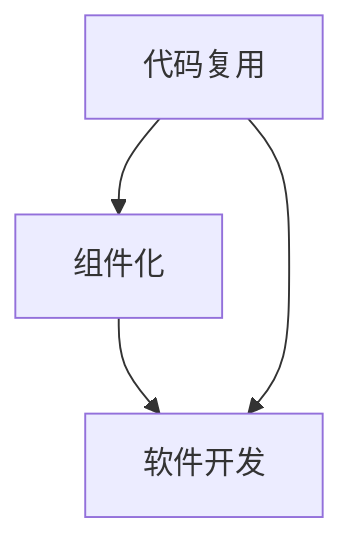
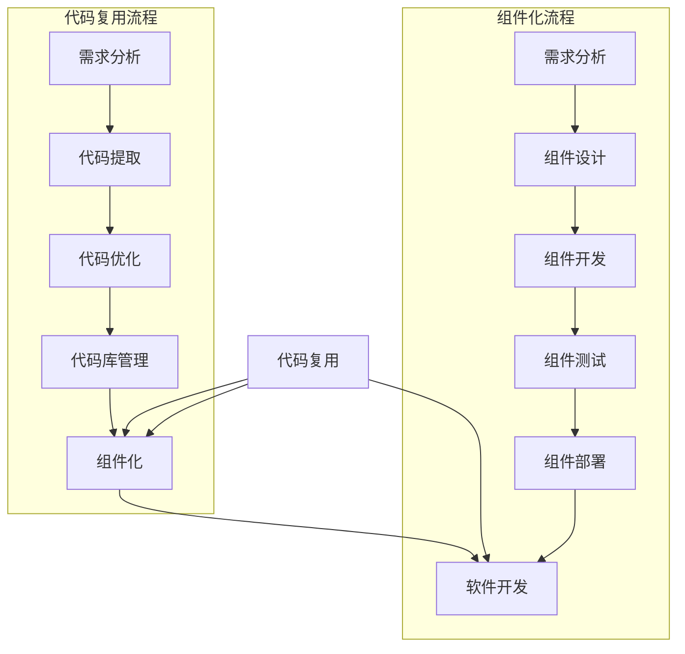

                 

### 文章标题：打造高效的代码复用与组件化平台

> **关键词**：代码复用、组件化、平台设计、软件开发、编程实践

> **摘要**：本文深入探讨了高效代码复用与组件化平台的设计与实现。通过对代码复用的基本概念、组件化的方法论、平台设计的关键要素以及实现与部署的详细分析，为开发者提供了全面而实用的指导。文章结构清晰，从基础概念到设计实践，再到优化与展望，每一步都进行了深入的阐述和案例分析，旨在帮助读者打造出高效、可靠的代码复用与组件化平台。

---

## 引言

在当今快速发展的信息技术时代，软件开发已经成为驱动创新和业务增长的核心力量。然而，随着项目规模的不断扩大和复杂性的增加，传统的软件开发方法面临着诸多挑战。尤其是代码复用和组件化，成为提升开发效率和软件质量的关键途径。然而，如何有效地实现代码复用与组件化，构建一个高效的平台，仍然是一个需要深入探讨的课题。

本文旨在通过系统性地阐述代码复用与组件化的基本概念、方法论、设计实践和优化策略，帮助开发者理解和掌握构建高效代码复用与组件化平台的方法。文章分为四个主要部分：

1. **基础概念**：介绍代码复用和组件化的基本概念，阐述它们在软件开发中的重要性。
2. **方法论**：讨论代码复用的最佳实践和组件化设计原则，为平台构建提供指导。
3. **设计实践**：详细说明平台设计与实现的关键要素，提供实际案例和代码示例。
4. **优化与展望**：探讨平台优化的方法及其未来发展趋势，为开发者提供展望。

通过对上述四个部分的深入分析，本文希望为读者提供一份全面而实用的指南，帮助他们在实际项目中有效地实现代码复用与组件化，从而提高开发效率和软件质量。

### 背景介绍

代码复用（Code Reuse）和组件化（Componentization）是软件开发中两个重要的概念，它们在提升开发效率和软件质量方面发挥着关键作用。

#### 代码复用

代码复用指的是在软件开发过程中，通过重复使用已有的代码片段或组件，避免重复编写相同或相似的功能，从而提高开发效率。代码复用的动机主要源于以下几个方面：

1. **节约时间和成本**：通过复用已有的代码，开发者可以节省大量的时间和精力，专注于新的功能和优化。
2. **提高代码质量**：复用的代码经过了长时间的测试和优化，通常比新编写的代码更加可靠和稳定。
3. **促进技术积累**：复用代码有助于积累和传承技术知识，促进团队成员之间的技术交流和成长。
4. **增强可维护性**：复用代码使得代码库更加模块化，便于维护和更新，降低了软件的维护成本。

然而，代码复用并非没有挑战。如何确保复用代码的质量和兼容性，如何管理和维护复用库，都是开发者需要面对的问题。此外，代码复用也需要遵循一定的最佳实践，例如使用设计模式、合理划分代码模块等。

#### 组件化

组件化是软件架构的一种设计思想，它将软件系统分解为一系列可独立开发、测试和部署的组件。每个组件都具备明确的职责和接口，可以独立运行和替换。组件化在软件开发中的重要性体现在以下几个方面：

1. **提高开发效率**：组件化使得开发过程更加模块化，团队成员可以并行工作，大大缩短了开发周期。
2. **增强系统灵活性**：通过组件化，系统可以更加灵活地应对变化，新的功能可以通过添加或替换组件来实现，而无需对整体系统进行大规模修改。
3. **提升软件质量**：组件化有助于实现代码的精细化管理和质量保证，每个组件的测试和优化更加专注，减少了系统层面的问题。
4. **促进技术积累和共享**：组件化使得技术积累和共享变得更加容易，每个组件都具备独立的价值，可以独立开发和维护。

组件化与微服务（Microservices）有一定的关联，但它们并不相同。微服务是一种具体的组件化实现方式，将系统分解为多个独立的微服务，每个微服务负责特定的业务功能。而组件化更侧重于整体架构的设计思想，不限定具体的实现方式。

#### 核心概念与联系

代码复用和组件化虽然都是提升开发效率和质量的重要手段，但它们之间存在紧密的联系和区别。下面通过一个Mermaid流程图来阐述它们之间的关系：



在软件开发过程中，代码复用和组件化相互支持，共同构建出一个高效、灵活和高质量的软件系统。代码复用为组件化提供了基础，通过复用已有代码，可以快速构建出组件原型；而组件化则为代码复用提供了一个良好的环境，使得复用的代码能够更加灵活和高效地集成到系统中。

通过上述背景介绍，我们了解了代码复用和组件化在软件开发中的重要性，以及它们之间的相互关系。接下来，我们将进一步探讨代码复用的基本概念、组件化的方法论，并详细讨论如何将代码复用集成到组件化平台中。

### 代码复用的基本概念

代码复用是软件开发中的一个重要概念，它指的是通过重复使用已有的代码片段或组件，避免重复编写相同或相似的功能，从而提高开发效率。要深入理解代码复用，我们需要从其定义、重要性、应用场景和常见挑战等方面进行详细探讨。

#### 定义

代码复用可以简单定义为在软件开发过程中，利用已有的代码资源来构建新的软件系统。这些代码资源可以是具体的代码片段、函数、类、模块或者更高级别的组件。代码复用不仅仅是简单的复制粘贴，而是一种有意识的、系统化的行为，旨在提高开发效率和代码质量。

#### 重要性

代码复用在软件开发中具有以下几个重要意义：

1. **提高开发效率**：通过复用已有的代码，开发者可以避免重复编写相同的功能，从而节省大量的时间和精力。这尤其适用于那些被多个项目共享的基础功能，如数据库连接、日志记录等。

2. **降低开发成本**：代码复用有助于减少开发过程中的冗余工作，从而降低项目成本。此外，复用代码通常经过了长期的测试和优化，其质量往往高于新编写的代码，进一步降低了后续维护的成本。

3. **提高代码质量**：复用代码通常经过了长时间的测试和优化，已经相对成熟和稳定。利用这些成熟的代码，可以提高新系统的质量，减少bug和缺陷。

4. **促进技术积累和共享**：代码复用有助于积累和传承技术知识，促进团队成员之间的技术交流和成长。一个良好的代码复用机制可以使得团队中的优秀代码资源得到充分利用，避免知识孤岛现象。

5. **增强系统的灵活性**：通过代码复用，系统能够更加灵活地应对变化。当需求发生变化时，开发者可以快速调整和替换复用代码，而不需要对整个系统进行大规模修改。

#### 应用场景

代码复用可以应用于软件开发的不同阶段和不同层次，以下是一些常见的应用场景：

1. **框架与库**：开发框架和库是代码复用的典型例子。例如，许多Web应用框架如Spring、Django等提供了大量的预定义功能，开发者可以通过这些框架快速搭建应用，而无需从头编写。

2. **模块化开发**：在大型项目中，模块化开发是一种常见的代码复用方式。开发者可以将系统分解为多个模块，每个模块实现特定的功能，这些模块可以在不同的项目中复用。

3. **组件化开发**：组件化开发是一种基于组件的软件开发方法，每个组件都是独立的、可复用的模块。通过组件化，开发者可以快速构建和部署系统，同时确保系统的灵活性和可维护性。

4. **代码片段复用**：在日常开发中，开发者可以通过复用代码片段来提高效率。例如，可以使用函数、类或者自定义的代码库来封装常用的功能，避免重复编写。

#### 常见挑战

尽管代码复用具有很多优点，但在实际应用中也会面临一些挑战：

1. **兼容性问题**：复用代码时，可能会遇到与现有系统的兼容性问题。不同版本之间的兼容性、平台兼容性等都是需要考虑的因素。

2. **维护难度**：复用代码通常需要依赖一定的文档和注释，以便开发者理解其功能和用法。如果文档不足或注释不清晰，维护难度会大大增加。

3. **依赖管理**：复用代码时，需要管理好各种依赖，包括库、框架和外部服务。依赖管理不当可能导致版本冲突、依赖过时等问题。

4. **代码质量**：复用代码的质量直接影响到系统的质量。如果复用的代码存在缺陷或未经过充分测试，可能会引入新的问题。

5. **学习成本**：复用代码需要开发者有一定的技术积累和经验，新手可能会感到不适应。

#### 代码复用的最佳实践

为了有效地实现代码复用，以下是一些最佳实践：

1. **使用设计模式**：设计模式是解决常见软件工程问题的经典方案，它们有助于实现代码复用。例如，工厂模式、单例模式、观察者模式等。

2. **模块化设计**：将系统分解为独立的模块，每个模块实现特定的功能。模块之间通过清晰的接口进行通信，便于复用。

3. **代码库管理**：建立和维护一个良好的代码库，确保代码的质量和一致性。可以使用版本控制系统（如Git）来管理代码库。

4. **文档和注释**：编写详细的文档和注释，帮助开发者理解复用代码的功能和用法。

5. **代码审查**：定期进行代码审查，确保复用代码的质量和安全性。

6. **培训和支持**：为团队成员提供培训和支持，帮助他们掌握代码复用的方法和技巧。

通过上述讨论，我们对代码复用的基本概念和应用场景有了更深入的理解。接下来，我们将探讨组件化的基本概念，并分析代码复用与组件化之间的联系。

### 组件化的基本概念

组件化（Componentization）是软件架构设计的一种重要思想，它将软件系统分解为一系列独立、可复用的组件。这些组件通过明确的接口进行通信，各自负责系统的特定功能。组件化在软件开发中具有显著的优点，特别是在提高开发效率、系统灵活性和维护性方面。下面将详细讨论组件化的概念、优势、常见组件模型及其在软件开发中的具体应用。

#### 概念

组件化指的是将软件系统划分为多个独立的、可复用的组件，每个组件具有明确的功能和接口。组件是软件系统中的基本构建块，它们可以独立开发、测试和部署。组件化设计强调模块化和高内聚、低耦合的设计原则，使得系统能够更加灵活和高效地应对变化。

组件化与面向对象编程（Object-Oriented Programming, OOP）有一定的相似性，但两者并不完全相同。面向对象编程是一种编程范式，通过类和对象实现数据的封装和方法的调用；而组件化则是一种系统架构设计思想，强调组件的独立性、可复用性和可扩展性。

#### 优势

组件化在软件开发中具有以下几个显著优势：

1. **提高开发效率**：组件化使得开发过程更加模块化，团队成员可以并行工作，缩短了开发周期。每个组件可以独立开发，不同小组可以专注于各自的功能模块，减少了协调和沟通的复杂度。

2. **增强系统灵活性**：通过组件化，系统可以更加灵活地应对变化。新的功能或需求可以通过添加或替换组件来实现，而无需对整个系统进行大规模修改。这种灵活性有助于快速响应市场变化和客户需求。

3. **提升软件质量**：组件化有助于实现代码的精细化管理和质量保证。每个组件都可以进行独立的测试和优化，确保其功能的稳定性和可靠性。此外，组件化的设计原则使得代码更加模块化，降低了系统层面的问题。

4. **促进技术积累和共享**：组件化使得技术积累和共享变得更加容易。每个组件都具备独立的价值，可以独立开发和维护。这种模块化的设计思想促进了团队内部的知识传递和技能共享。

5. **降低维护成本**：组件化使得系统的维护变得更加容易。由于每个组件相对独立，当某个组件需要更新或修复时，可以单独进行，而不会影响到其他组件。这种解耦合的设计降低了系统的维护成本。

#### 常见组件模型

组件化有多种不同的实现方式，下面介绍几种常见的组件模型：

1. **粗粒度组件**：粗粒度组件通常包含大量的功能和逻辑，具有较高的内聚性。它们可以看作是一个功能模块，如一个完整的业务流程或系统服务。粗粒度组件的优点是功能完整，便于复用；缺点是组件之间可能存在较高的耦合性，修改一个组件可能会影响整个系统。

2. **细粒度组件**：细粒度组件较小，通常只包含单一的功能或功能的一部分。它们通过明确的接口进行通信，具有较高的灵活性。细粒度组件的优点是易于管理和维护，但可能需要更多的组件来实现复杂的系统功能。

3. **混合粒度组件**：混合粒度组件结合了粗粒度和细粒度的优点，根据具体需求和场景进行划分。通常在大型项目中，混合粒度组件被广泛采用，以平衡功能完整性和系统复杂性。

4. **微服务组件**：微服务是一种基于组件化架构的设计模式，将系统分解为多个独立的微服务，每个微服务负责特定的业务功能。微服务通过轻量级的通信协议（如REST API）进行交互，具有较高的独立性和可扩展性。微服务的优点是灵活性高、可扩展性强，但可能需要更多的管理和协调机制。

#### 组件化在软件开发中的应用

组件化在软件开发中具有广泛的应用，以下是一些具体的应用场景：

1. **企业级应用**：在企业级应用中，组件化有助于构建复杂的业务系统。通过将系统分解为多个组件，不同小组可以独立开发和管理各自的功能模块，确保系统的灵活性、可靠性和可维护性。

2. **Web应用开发**：在Web应用开发中，组件化可以用于构建前端和后端系统。前端组件化可以提供更好的用户体验，后端组件化可以提升系统的性能和可扩展性。

3. **移动应用开发**：在移动应用开发中，组件化有助于实现跨平台兼容和高效开发。通过组件化，开发者可以独立开发iOS和Android应用，同时共享公共组件，减少开发成本。

4. **集成开发环境**：集成开发环境（IDE）本身就是一个典型的组件化系统。IDE中的各个功能模块（如代码编辑、调试、构建等）通过组件化设计进行独立开发和管理，提高了开发效率和用户体验。

#### 组件化与微服务的关系

组件化与微服务之间存在紧密的联系和区别。微服务是一种基于组件化架构的设计模式，它将系统分解为多个独立的微服务，每个微服务负责特定的业务功能。微服务的优点是灵活性高、可扩展性强，但需要更多的管理和协调机制。

组件化更侧重于系统架构的设计思想，而微服务是组件化的具体实现方式。在实际应用中，组件化和微服务可以结合使用，构建出灵活、高效和可扩展的软件系统。

通过上述讨论，我们对组件化的基本概念、优势、常见组件模型及其在软件开发中的应用有了更深入的理解。接下来，我们将探讨代码复用与组件化之间的关系，并详细讨论如何将代码复用集成到组件化平台中。

### 代码复用与组件化的联系

代码复用（Code Reuse）和组件化（Componentization）是软件开发中提升开发效率和软件质量的重要手段。它们虽然具有各自独立的概念和作用，但在实际应用中往往相互交织，共同构建出一个高效、灵活和高质量的软件系统。本节将详细探讨代码复用与组件化之间的关系，阐述它们之间的相互联系及其在软件开发中的协同作用。

#### 相互关系

代码复用和组件化之间存在紧密的联系，它们相辅相成，共同为软件开发带来诸多益处：

1. **代码复用是组件化的基础**：组件化强调将系统分解为独立的组件，每个组件实现特定的功能。而代码复用则是构建这些独立组件的重要手段。通过复用已有的代码，开发者可以快速构建出功能完整的组件原型，从而提高开发效率。

2. **组件化为代码复用提供环境**：组件化设计思想使得系统模块化，每个组件具有明确的功能和接口。这种模块化设计为代码复用提供了一个良好的环境，使得复用的代码能够更加灵活和高效地集成到系统中。组件化确保了代码的独立性、可复用性和可扩展性。

3. **相互促进**：代码复用和组件化相互促进，共同提高开发效率和软件质量。代码复用使得组件化更加高效，通过复用已有的代码，开发者可以快速构建和部署组件；而组件化则使得代码复用更加灵活，每个组件都可以独立开发、测试和部署，减少了代码复用过程中的兼容性和维护难度。

#### Mermaid流程图

为了更好地阐述代码复用与组件化之间的相互关系，我们可以使用Mermaid流程图来表示它们在软件开发过程中的协作：



在该流程图中，代码复用和组件化共同参与软件开发过程。代码复用在需求分析阶段提取已有的代码，进行优化和管理，然后将这些代码集成到组件化平台中。组件化在需求分析阶段设计组件，开发、测试和部署组件，最终构建出一个完整的软件系统。两者相互协同，共同促进软件开发过程。

#### 关联与协同

代码复用与组件化在软件开发中的协同作用主要体现在以下几个方面：

1. **模块化设计**：组件化强调将系统分解为独立的模块，每个模块实现特定的功能。代码复用则通过提取和复用已有的代码，使得组件化设计更加高效和灵活。通过代码复用，开发者可以快速构建出功能完整的组件原型，进一步细化组件设计。

2. **提高开发效率**：代码复用和组件化都致力于提高开发效率。代码复用通过复用已有的代码，避免了重复编写相同或相似的功能，节省了开发时间和成本。组件化通过模块化和并行开发，缩短了开发周期，提高了团队的协作效率。

3. **增强软件质量**：代码复用和组件化都旨在提升软件质量。代码复用复用的代码通常经过了长时间的测试和优化，具有较高的稳定性和可靠性。组件化设计通过精细化管理和独立测试，确保了每个组件的质量和性能。

4. **促进技术积累和共享**：代码复用和组件化有助于积累和传承技术知识。通过代码复用，团队可以积累和共享优秀的代码资源，促进团队成员之间的技术交流和成长。组件化则通过模块化设计和独立开发，使得技术积累和共享变得更加容易。

#### 案例分析

为了更好地理解代码复用与组件化在实际项目中的应用，我们可以通过一个案例分析来展示它们之间的协同作用。

**项目背景**：某公司需要开发一个电商平台，该平台需要支持商品管理、订单处理、支付系统等多个功能模块。

**代码复用**：在项目开发过程中，开发团队首先识别出一些可复用的代码片段，如数据库连接、日志记录、加密算法等。这些代码被封装为独立的库，以便在各个模块中复用。此外，开发团队还利用设计模式（如工厂模式、单例模式等）来提高代码的可复用性。

**组件化**：在组件化设计阶段，团队将系统分解为多个独立的组件，如商品管理组件、订单处理组件、支付系统组件等。每个组件负责特定的功能，通过清晰的接口进行通信。组件化设计使得团队可以并行开发不同功能模块，提高了开发效率。

**协同作用**：

1. **提高开发效率**：通过代码复用，开发团队可以快速构建出功能完整的组件原型，避免了重复编写相同的功能。组件化设计使得团队可以并行开发不同功能模块，进一步提高了开发效率。

2. **增强软件质量**：代码复用的库经过了长时间的测试和优化，具有较高的稳定性和可靠性。组件化设计确保了每个组件的质量和性能，减少了系统层面的问题。

3. **促进技术积累和共享**：通过代码复用，团队可以积累和共享优秀的代码资源，促进团队成员之间的技术交流和成长。组件化设计使得技术积累和共享变得更加容易。

通过上述案例，我们可以看到代码复用与组件化在实际项目中的应用及其相互协同作用。代码复用为组件化提供了基础，组件化则为代码复用提供了一个良好的环境，两者共同促进软件开发过程。

综上所述，代码复用与组件化在软件开发中具有紧密的联系和重要的协同作用。通过合理地利用代码复用和组件化，开发者可以构建出高效、灵活和高质量的软件系统，从而提高开发效率和软件质量。

### 代码复用的最佳实践

在软件开发中，代码复用是提升开发效率和质量的重要手段。为了实现高效的代码复用，开发者需要遵循一系列最佳实践。以下将从设计模式、代码库管理策略、代码复用工具和技术等方面进行详细讨论。

#### 设计模式

设计模式是解决常见软件工程问题的经典方案，它们有助于实现代码复用。以下是一些常用的设计模式：

1. **工厂模式（Factory Pattern）**：工厂模式通过定义一个创建对象的全局函数，来增强程序的扩展性和复用性。它将对象的创建和使用分离，使得创建对象的过程可以被复用。

   ```java
   public interface Factory {
       Product createProduct();
   }

   public class ConcreteFactory implements Factory {
       public Product createProduct() {
           // 创建具体的产品对象
       }
   }
   ```

2. **单例模式（Singleton Pattern）**：单例模式确保一个类只有一个实例，并提供一个访问它的全局访问点。它常用于需要共享资源或状态的管理，如数据库连接、配置管理器等。

   ```java
   public class Singleton {
       private static Singleton instance;

       private Singleton() {}

       public static Singleton getInstance() {
           if (instance == null) {
               instance = new Singleton();
           }
           return instance;
       }
   }
   ```

3. **策略模式（Strategy Pattern）**：策略模式将算法的实现与使用分离，使得算法可以被复用。它通过定义一系列算法接口，具体算法实现由客户端动态选择。

   ```java
   public interface Strategy {
       void execute();
   }

   public class ConcreteStrategyA implements Strategy {
       public void execute() {
           // 实现具体的算法
       }
   }

   public class ConcreteStrategyB implements Strategy {
       public void execute() {
           // 实现具体的算法
       }
   }
   ```

4. **观察者模式（Observer Pattern）**：观察者模式定义了对象间的一对多依赖关系，当一个对象的状态发生变化时，所有依赖于它的对象都会得到通知。它常用于事件处理和消息传递。

   ```java
   public interface Observer {
       void update();
   }

   public class ConcreteObserver implements Observer {
       public void update() {
           // 根据状态变化进行相应的操作
       }
   }

   public class Subject {
       private List<Observer> observers = new ArrayList<>();

       public void addObserver(Observer observer) {
           observers.add(observer);
       }

       public void notifyObservers() {
           for (Observer observer : observers) {
               observer.update();
           }
       }
   }
   ```

通过合理地使用设计模式，开发者可以有效地实现代码复用，提高系统的灵活性和可维护性。

#### 代码库管理策略

有效的代码库管理策略对于代码复用至关重要。以下是一些关键的代码库管理策略：

1. **版本控制**：使用版本控制系统（如Git）来管理代码库。版本控制可以帮助团队追踪代码的变更历史，确保代码的完整性和一致性。

2. **模块化**：将代码库分解为多个模块，每个模块实现特定的功能。模块化设计使得代码更加模块化、易于管理和复用。

3. **文档和注释**：编写详细的文档和注释，确保代码的可读性和可维护性。文档和注释有助于其他开发者理解代码的功能和用法，提高代码的可复用性。

4. **代码审查**：定期进行代码审查，确保代码的质量和一致性。代码审查可以帮助团队识别潜在的问题，提高代码的整体质量。

5. **持续集成**：实施持续集成（CI）流程，确保代码库中的代码始终处于可运行状态。持续集成有助于及早发现和解决代码问题，提高代码的复用性和可靠性。

6. **代码库的共享和分发**：建立统一的代码库共享和分发机制，方便团队成员之间的代码共享和协作。可以使用私有仓库（如GitHub Enterprise）或公共仓库（如GitHub、GitLab等）来管理代码库。

#### 代码复用工具和技术

以下是一些常用的代码复用工具和技术：

1. **代码库**：建立和维护一个共享的代码库，用于存储和共享可复用的代码。代码库可以包含常用的库、框架、工具和自定义代码。

2. **代码生成器**：使用代码生成器（如Maven、Gradle等）来自动生成代码。代码生成器可以基于模板和配置文件生成代码，提高代码复用的效率和一致性。

3. **组件化框架**：使用组件化框架（如Spring Boot、Django等）来构建和部署组件。这些框架提供了丰富的组件和功能，使得组件化开发更加高效和灵活。

4. **设计模式框架**：使用设计模式框架（如Spring Framework、Apache Commons等）来提高代码的可复用性和灵活性。这些框架实现了多种设计模式，方便开发者进行代码复用。

5. **代码片段管理工具**：使用代码片段管理工具（如Visual Studio Code、IntelliJ IDEA等）来管理常用的代码片段。这些工具提供了代码片段的快捷键和搜索功能，方便开发者快速查找和复用代码。

通过遵循上述最佳实践，开发者可以有效地实现代码复用，提高开发效率和软件质量。代码复用不仅节省了时间和成本，还提高了代码的稳定性和可靠性，为团队提供了更好的技术积累和共享机制。

### 组件化设计原则

组件化设计是软件开发中提升系统灵活性和可维护性的关键方法。其核心在于将系统分解为一系列独立的、可复用的组件，每个组件负责特定的功能。为了实现高效、可靠的组件化设计，开发者需要遵循一系列关键原则。以下将详细讨论组件划分原则、组件接口设计、组件通信机制、生命周期管理以及组件测试和部署策略。

#### 组件划分原则

组件划分是组件化设计的基础，合理的组件划分能够提高系统的模块化和可复用性。以下是一些关键的组件划分原则：

1. **功能独立性**：每个组件应独立实现单一的功能，避免组件间功能重叠或相互依赖。功能独立性使得组件可以独立开发、测试和部署，提高了系统的灵活性和可维护性。

2. **职责明确**：组件应具有明确的职责，即每个组件应该只负责一个特定的功能模块。明确的职责有助于组件的模块化和复用，降低了系统的复杂性。

3. **最小耦合**：组件之间应保持最小的耦合度，即组件间的依赖关系应尽可能简单和直接。低耦合度使得组件可以独立运行和替换，提高了系统的灵活性和可扩展性。

4. **可复用性**：组件应具备高可复用性，即组件应独立于具体应用场景，可以被多个项目或系统复用。高可复用性有助于提升开发效率，减少重复工作。

5. **可扩展性**：组件应设计为可扩展的，即组件可以方便地添加新的功能或扩展现有功能，而无需对整个系统进行大规模修改。高可扩展性使得系统能够更好地适应未来的需求变化。

#### 组件接口设计

组件接口是组件间通信的桥梁，良好的接口设计能够提高组件的独立性、可复用性和可维护性。以下是一些关键接口设计原则：

1. **明确性**：接口应具有清晰的定义和说明，明确组件的输入、输出以及功能。良好的接口定义有助于开发者理解和复用组件，降低了使用难度。

2. **一致性**：组件接口应保持一致性，即接口的定义、命名和通信协议应遵循一定的规范。一致性有助于减少开发者和维护者的认知负担，提高了开发效率。

3. **最小化**：接口应保持最小化，即只包含实现功能所必需的输入和输出。最小化接口可以减少组件间的依赖关系，提高组件的独立性。

4. **稳定性**：接口应保持稳定性，即在组件更新或重构时，尽量保持接口不变。稳定性有助于确保组件的兼容性和可复用性。

5. **灵活性**：接口应具有一定的灵活性，即允许在特定场景下进行适当的扩展和定制。灵活性使得组件能够适应不同的应用场景和需求变化。

#### 组件通信机制

组件通信机制决定了组件之间的交互方式和数据交换模式。以下是一些常见的组件通信机制：

1. **同步通信**：同步通信是指组件之间通过直接调用对方的方法进行通信。同步通信的优点是通信速度快、数据一致性高，但缺点是会阻塞调用者，降低系统的并发性能。

2. **异步通信**：异步通信是指组件之间通过消息队列或事件驱动机制进行通信。异步通信的优点是可以提高系统的并发性能，降低调用者的阻塞时间，但缺点是通信速度相对较慢、数据一致性较差。

3. **RESTful API**：RESTful API是一种基于HTTP协议的通信机制，广泛应用于Web应用开发。RESTful API的优点是简单、易用、跨平台，但缺点是通信速度相对较慢、安全性较低。

4. **消息队列**：消息队列是一种用于异步通信的机制，通过中间件（如RabbitMQ、Kafka等）实现组件间的消息传递。消息队列的优点是高并发性能、高可靠性，但缺点是系统复杂度较高、开发难度较大。

5. **事件驱动**：事件驱动是一种基于事件的通信机制，组件通过监听和触发事件进行交互。事件驱动的优点是实时性强、响应速度快，但缺点是事件处理逻辑较复杂、系统复杂性较高。

#### 组件生命周期管理

组件生命周期管理是指组件从创建到销毁的全过程管理。良好的生命周期管理能够提高组件的可靠性、可维护性和可扩展性。以下是一些关键生命周期管理策略：

1. **创建**：组件的创建应遵循一定的规范和策略，如单例模式、工厂模式等。创建过程应确保组件的初始化和配置正确。

2. **初始化**：组件的初始化是指在创建后进行的一些配置和初始化操作，如加载配置文件、初始化资源等。良好的初始化策略可以确保组件的正确性和稳定性。

3. **运行**：组件的运行是指组件在系统中的正常运行状态。运行过程中，组件应遵循一定的规范和策略，如线程安全、资源管理等。

4. **同步与异步**：组件的运行可以分为同步运行和异步运行。同步运行是指组件在运行时保持阻塞状态，直到任务完成。异步运行是指组件在运行时采用多线程或异步IO等方式，提高系统的并发性能。

5. **监控与日志**：组件的运行过程中应进行监控和日志记录，以便于问题定位和性能优化。监控和日志记录应遵循一定的规范和策略，如日志级别、日志格式等。

6. **关闭**：组件的关闭是指在系统退出或组件不再需要时进行的一些清理操作，如释放资源、关闭连接等。良好的关闭策略可以确保组件的可靠性和稳定性。

7. **销毁**：组件的销毁是指在系统退出或组件不再需要时进行的一些最终清理操作，如删除对象、释放内存等。良好的销毁策略可以确保系统的资源利用效率和安全性。

#### 组件测试和部署策略

组件测试和部署是确保组件质量和可靠性的关键环节。以下是一些关键测试和部署策略：

1. **单元测试**：单元测试是指对组件的各个功能模块进行独立测试，确保其功能正确性和代码质量。单元测试应覆盖所有功能场景和边界条件，提高测试覆盖率。

2. **集成测试**：集成测试是指将组件与其他组件进行集成测试，确保组件之间的交互正常和系统整体功能正确。集成测试应覆盖不同的场景和组合，提高系统的可靠性。

3. **性能测试**：性能测试是指对组件的运行性能进行测试，确保其能够满足系统性能要求。性能测试应包括响应时间、吞吐量、并发能力等关键指标。

4. **自动化部署**：自动化部署是指通过自动化工具（如Jenkins、Docker等）实现组件的自动化部署和发布。自动化部署可以提高部署效率和一致性，降低人为错误的风险。

5. **持续集成与持续部署（CI/CD）**：持续集成与持续部署是一种集成和部署策略，通过自动化流程实现代码的集成、测试和部署。CI/CD可以提高开发效率和软件质量，减少手动操作的风险。

通过遵循上述组件化设计原则，开发者可以构建出高效、可靠和高质量的组件化系统，从而提升开发效率和软件质量。

### 平台设计与实现

构建一个高效的代码复用与组件化平台是一个复杂而重要的任务，它需要系统性地规划和实施。以下将从平台架构设计、核心功能模块、平台搭建步骤以及注意事项等方面详细讨论平台设计与实现的过程。

#### 平台架构设计

平台架构设计是构建高效代码复用与组件化平台的第一步，一个良好的架构设计能够确保平台的稳定性、扩展性和易维护性。以下是平台架构设计的关键要素：

1. **模块化设计**：平台应采用模块化设计，将系统划分为多个独立的功能模块，如代码库管理、组件管理、测试管理、部署管理等。模块化设计可以提高系统的可维护性和可扩展性。

2. **分层架构**：平台应采用分层架构，将系统分为表示层、业务逻辑层和数据访问层。表示层负责与用户交互，业务逻辑层处理业务逻辑，数据访问层负责数据存储和读取。分层架构可以提高系统的可扩展性和模块化程度。

3. **服务化架构**：平台应采用服务化架构，将系统功能拆分为多个微服务，每个微服务负责特定的业务功能。服务化架构可以提高系统的灵活性和可复用性。

4. **分布式架构**：平台应采用分布式架构，确保系统的高可用性和高性能。分布式架构可以通过负载均衡、数据库分片、缓存等方式来优化系统的性能和扩展性。

5. **安全性和可靠性**：平台应具备良好的安全性和可靠性。安全措施包括身份认证、访问控制、数据加密等。可靠性措施包括容错机制、备份与恢复、监控报警等。

#### 核心功能模块

一个高效的代码复用与组件化平台通常包含以下核心功能模块：

1. **代码库管理模块**：负责存储和管理代码库，包括版本控制、代码审核、代码搜索等功能。代码库管理模块可以采用Git等版本控制系统，确保代码的一致性和可追溯性。

2. **组件管理模块**：负责管理组件的生命周期，包括组件的创建、部署、更新和删除等。组件管理模块应提供友好的用户界面和API，方便开发者管理和使用组件。

3. **测试管理模块**：负责管理组件的测试过程，包括单元测试、集成测试和性能测试等。测试管理模块应提供自动化测试工具和测试报告，帮助开发者快速定位和解决问题。

4. **部署管理模块**：负责管理组件的部署过程，包括自动化部署、环境配置、资源管理等。部署管理模块应支持多种部署方式，如容器化部署、虚拟化部署等，提高部署的灵活性和可扩展性。

5. **监控与报警模块**：负责监控平台的运行状态，包括系统性能、组件健康状况等。监控与报警模块应提供实时监控数据和历史数据查询功能，确保平台的高可用性和可靠性。

#### 平台搭建步骤

以下是搭建代码复用与组件化平台的详细步骤：

1. **需求分析**：首先，明确平台的需求，包括功能需求、性能需求和安全性需求等。需求分析是平台设计的基础，有助于确定平台的核心功能模块和架构设计。

2. **架构设计**：根据需求分析结果，进行平台架构设计，确定模块划分、层次结构、服务化架构和分布式架构等。架构设计应确保平台的稳定性、扩展性和易维护性。

3. **技术选型**：选择合适的技术和框架，包括版本控制系统、Web框架、数据库、中间件等。技术选型应考虑平台的性能、可扩展性、可靠性和安全性。

4. **环境搭建**：搭建开发、测试和部署环境，包括服务器、网络、数据库、中间件等。环境搭建应确保平台的稳定运行和高效性能。

5. **代码库管理**：搭建代码库管理模块，包括配置版本控制系统、代码库存储和代码审核等。代码库管理模块应确保代码的一致性和可追溯性。

6. **组件管理**：搭建组件管理模块，包括组件的生命周期管理、组件的创建、部署和更新等。组件管理模块应提供友好的用户界面和API，方便开发者管理和使用组件。

7. **测试管理**：搭建测试管理模块，包括自动化测试工具的配置、测试用例的编写和执行、测试报告的生成等。测试管理模块应确保组件的质量和可靠性。

8. **部署管理**：搭建部署管理模块，包括自动化部署工具的配置、环境配置和资源管理等。部署管理模块应支持多种部署方式，提高部署的灵活性和可扩展性。

9. **监控与报警**：搭建监控与报警模块，包括监控系统性能、组件健康状况、系统日志等。监控与报警模块应提供实时监控数据和历史数据查询功能，确保平台的高可用性和可靠性。

10. **集成与测试**：将各个模块集成到平台中，进行系统测试和性能测试。集成与测试应确保平台的功能完整性、性能和稳定性。

11. **部署上线**：将平台部署到生产环境，进行实际业务运行。部署上线应确保平台的正常运行和高效性能。

#### 注意事项

在搭建代码复用与组件化平台的过程中，需要注意以下事项：

1. **安全性**：确保平台的安全性，包括用户认证、访问控制、数据加密等。安全性是平台稳定运行的重要保障。

2. **可靠性**：确保平台的可靠性，包括容错机制、备份与恢复、监控报警等。可靠性是平台长期运行的基础。

3. **性能优化**：对平台进行性能优化，包括数据库性能优化、网络性能优化、缓存策略等。性能优化可以提高平台的运行效率。

4. **可扩展性**：确保平台具备良好的可扩展性，包括模块化设计、服务化架构、分布式架构等。可扩展性是平台应对业务增长和变化的重要能力。

5. **文档与培训**：提供详细的文档和培训资料，帮助开发者熟悉平台的使用方法和最佳实践。良好的文档和培训可以提高开发效率和平台的使用体验。

通过上述平台设计与实现的过程，开发者可以构建出一个高效、可靠和灵活的代码复用与组件化平台，从而提高开发效率和软件质量。

### 项目实战

在本节中，我们将通过一个实际的软件开发项目，详细探讨如何应用代码复用与组件化平台，从项目背景、需求分析、代码复用策略、组件化设计、实现与代码解读、项目评估与优化等方面进行全方位的案例分析。

#### 项目背景

某互联网公司计划开发一个电商平台，该平台需要支持商品管理、订单处理、支付系统、用户管理、评论系统等多个功能模块。由于项目规模庞大且需求复杂，公司决定采用代码复用与组件化平台来提高开发效率和软件质量。

#### 需求分析

在项目启动阶段，团队进行了详细的需求分析。主要需求包括：

1. **商品管理**：包括商品的添加、编辑、删除、搜索等功能。
2. **订单处理**：包括订单的创建、修改、查询、支付等功能。
3. **支付系统**：集成多种支付方式，如支付宝、微信支付等。
4. **用户管理**：包括用户的注册、登录、个人信息管理等功能。
5. **评论系统**：允许用户对商品进行评论，支持评论的添加、删除、修改等功能。
6. **日志与监控**：实时记录系统运行日志，监控系统性能和异常。

#### 代码复用策略

为了实现高效的代码复用，团队采用了以下策略：

1. **设计模式**：在项目开发过程中，广泛使用设计模式，如工厂模式、单例模式、策略模式等，来提高代码的可复用性和灵活性。
2. **通用组件**：识别出通用功能模块，如数据库连接、日志记录、加密算法等，将其封装为通用组件，供各个模块复用。
3. **代码库管理**：建立共享的代码库，将通用组件和模块化代码存储在代码库中，方便团队成员复用。

#### 组件化设计

团队采用了组件化设计，将系统分解为多个独立的组件，每个组件负责特定的功能。以下是主要的组件划分：

1. **商品管理组件**：负责商品的添加、编辑、删除和搜索等功能。
2. **订单处理组件**：负责订单的创建、修改、查询和支付等功能。
3. **支付组件**：负责与支付系统集成，支持多种支付方式。
4. **用户管理组件**：负责用户的注册、登录和个人信息管理等功能。
5. **评论组件**：负责评论的添加、删除和修改等功能。
6. **日志与监控组件**：负责系统日志记录和性能监控。

#### 实现与代码解读

以下是商品管理组件的关键实现部分，使用伪代码进行详细讲解：

```java
// 商品管理组件 - 商品服务接口
public interface ProductService {
    Product createProduct(Product product);
    Product updateProduct(Product product);
    void deleteProduct(Long productId);
    Product searchProductById(Long productId);
}

// 商品管理组件 - 商品服务实现
public class ProductService implements ProductService {
    private ProductRepository productRepository;

    public Product createProduct(Product product) {
        // 伪代码：保存商品到数据库
        productRepository.save(product);
        return product;
    }

    public Product updateProduct(Product product) {
        // 伪代码：更新商品信息
        Product updatedProduct = productRepository.findById(product.getId());
        updatedProduct.setName(product.getName());
        updatedProduct.setPrice(product.getPrice());
        productRepository.save(updatedProduct);
        return updatedProduct;
    }

    public void deleteProduct(Long productId) {
        // 伪代码：从数据库中删除商品
        productRepository.deleteById(productId);
    }

    public Product searchProductById(Long productId) {
        // 伪代码：根据商品ID查询商品
        return productRepository.findById(productId);
    }
}

// 商品管理组件 - 商品实体类
public class Product {
    private Long id;
    private String name;
    private double price;

    // 省略构造函数、getter和setter方法
}
```

在上述代码中，`ProductService`接口定义了商品管理的基本操作，包括创建、更新、删除和查询商品。`ProductService`实现类负责具体操作，如保存商品到数据库、更新商品信息和删除商品等。`Product`类定义了商品的实体属性。

#### 项目评估与优化

项目上线后，团队进行了详细的评估和优化。以下是主要的评估结果和优化措施：

1. **性能评估**：通过性能测试，发现商品查询功能存在性能瓶颈，主要是数据库查询效率较低。团队优化了数据库索引和查询语句，提高了查询速度。

2. **测试覆盖率**：测试覆盖率较低，特别是在边界条件和异常处理方面。团队增加了单元测试和集成测试，提高了测试覆盖率。

3. **组件复用性**：部分组件的复用性较差，主要是由于组件设计不够模块化。团队重新评估和优化了组件设计，提高了组件的复用性。

4. **系统稳定性**：系统在高并发情况下存在不稳定现象，主要是由于数据库连接池配置不合理。团队调整了数据库连接池配置，提高了系统的稳定性。

5. **监控与报警**：监控与报警机制不够完善，难以实时掌握系统运行状态。团队增加了监控系统，配置了实时报警机制，提高了系统的监控能力。

通过上述项目实战，我们可以看到代码复用与组件化平台在实际项目中的应用效果。有效的代码复用和组件化设计大大提高了开发效率和软件质量，但同时也需要不断进行评估和优化，以应对项目中的各种挑战。

### 平台部署与维护

在构建高效代码复用与组件化平台后，平台的部署与维护是确保其稳定运行和持续优化的重要环节。以下将从平台部署策略、维护与更新、性能监控与优化等方面进行详细探讨。

#### 平台部署策略

平台的部署策略决定了平台在实际环境中的运行效率和稳定性。以下是一些关键的部署策略：

1. **自动化部署**：采用自动化部署工具（如Jenkins、Ansible等）实现平台的自动部署。自动化部署可以减少人为错误，提高部署效率。

2. **环境隔离**：在不同环境中部署不同的平台版本，如开发环境、测试环境和生产环境。环境隔离可以确保平台在不同阶段的测试和部署过程中不会互相干扰。

3. **容器化部署**：使用容器化技术（如Docker）进行平台部署，可以简化部署流程，提高部署的灵活性和可移植性。容器化部署还可以通过容器编排工具（如Kubernetes）实现平台的自动化管理和扩展。

4. **滚动部署**：在更新平台时，采用滚动部署策略，逐步将旧版本更新为新版本，以减少更新过程中可能带来的风险。

5. **蓝绿部署**：使用蓝绿部署策略，同时运行旧版本和新版本，将流量逐渐切换到新版本，确保更新过程中的系统稳定性。

#### 平台维护与更新

平台维护与更新是确保其持续运行和优化的重要措施。以下是一些关键的维护与更新策略：

1. **定期备份**：定期备份平台的数据和配置文件，以防止数据丢失或系统故障。备份应包括数据库、配置文件、日志文件等。

2. **更新策略**：制定明确的更新策略，包括更新频率、更新内容、更新步骤等。更新策略应确保平台在更新过程中保持稳定运行。

3. **测试与验证**：在更新前进行充分的测试和验证，确保新版本的平台能够正常工作。测试应包括功能测试、性能测试、兼容性测试等。

4. **版本控制**：使用版本控制系统（如Git）管理平台的代码和配置文件，确保版本的可追溯性和可回滚性。

5. **监控与报警**：建立监控与报警机制，实时监控平台的运行状态，及时发现和处理潜在的问题。

#### 性能监控与优化

性能监控与优化是确保平台高效运行的重要手段。以下是一些关键的性能监控与优化策略：

1. **监控指标**：定义关键监控指标，如CPU利用率、内存使用率、磁盘I/O、网络流量等。这些指标可以帮助识别平台性能瓶颈。

2. **日志分析**：分析平台的日志文件，识别潜在的性能问题和异常情况。日志分析应包括错误日志、调试日志、访问日志等。

3. **性能测试**：定期进行性能测试，评估平台的响应时间、吞吐量、并发能力等关键性能指标。性能测试可以帮助发现和优化平台的性能瓶颈。

4. **数据库优化**：对数据库进行优化，包括索引优化、查询优化、存储优化等。数据库优化可以显著提高平台的查询速度和处理能力。

5. **缓存策略**：采用缓存策略（如Redis、Memcached等）减少数据库的访问频率，提高系统的响应速度和性能。

6. **负载均衡**：使用负载均衡器（如Nginx、HAProxy等）实现分布式部署，平衡不同服务器的负载，提高系统的整体性能和可用性。

通过实施上述部署与维护策略，平台可以确保其稳定运行和持续优化，从而满足不断变化的需求和业务增长。

### 代码复用与组件化的优化

在构建高效代码复用与组件化平台的过程中，性能优化、资源管理和安全性优化是确保系统稳定性和高效运行的关键因素。以下将详细探讨这些方面的优化策略。

#### 性能优化

性能优化是提升代码复用与组件化平台效率的核心目标。以下是一些关键的优化策略：

1. **代码级别的优化**：在代码层面，通过算法优化和代码重写来减少计算复杂度和内存使用。例如，使用更高效的算法替代低效算法，或者使用数据结构优化来减少不必要的内存分配。

2. **数据库优化**：优化数据库查询，包括创建合适的索引、避免全表扫描、优化查询语句等。使用数据库连接池来减少数据库连接的开销，提高数据库操作的性能。

3. **缓存策略**：使用缓存（如Redis、Memcached）来减少对数据库的访问频率，缓存频繁查询的数据，从而提高系统的响应速度。

4. **异步处理**：对于耗时的操作，使用异步处理（如异步IO、消息队列）来降低主线程的阻塞时间，提高系统的并发处理能力。

5. **微服务优化**：在微服务架构中，通过垂直拆分和水平拆分来优化服务。垂直拆分可以将大型服务拆分为多个小型服务，降低服务的耦合度；水平拆分可以将服务实例化到多个节点，提高服务的可用性和性能。

6. **监控和调优**：使用性能监控工具（如New Relic、AppDynamics）来实时监控系统的性能指标，识别性能瓶颈，并进行针对性的调优。

#### 资源管理优化

资源管理优化是确保系统高效运行的关键。以下是一些资源管理的优化策略：

1. **内存管理**：通过优化数据结构和使用内存池来减少内存分配和垃圾回收的开销。使用内存映射文件来减少虚拟内存的使用。

2. **线程管理**：合理设置线程池的大小，避免过度创建和销毁线程，减少上下文切换的开销。使用无锁编程和数据竞争检测工具（如ThreadSanitizer）来减少线程争用和死锁。

3. **I/O优化**：减少I/O操作的数量和频率，使用批量I/O和异步I/O来提高I/O操作的效率。优化网络配置，减少网络延迟和带宽占用。

4. **负载均衡**：使用负载均衡器（如Nginx、HAProxy）来均衡服务器的负载，避免单点瓶颈。合理配置负载均衡策略，如基于请求频率、响应时间和系统负载等。

5. **资源监控和预警**：使用资源监控工具（如Prometheus、Grafana）来实时监控系统的资源使用情况，包括CPU、内存、磁盘I/O和网络流量等。设置预警阈值，及时发现问题并进行优化。

#### 安全性与稳定性优化

安全性与稳定性优化是保障系统可靠性和业务连续性的关键。以下是一些安全性与稳定性优化的策略：

1. **身份认证与访问控制**：使用强密码策略和双因素认证来确保用户身份的合法性。采用访问控制机制，如角色基础访问控制（RBAC）和属性基础访问控制（ABAC），来确保用户只能访问其授权的数据和功能。

2. **数据加密**：对敏感数据进行加密存储和传输，包括用户密码、信用卡信息等。使用安全的加密算法和密钥管理策略来保护数据的机密性和完整性。

3. **漏洞扫描与修复**：定期进行漏洞扫描和安全测试，发现潜在的安全漏洞并及时修复。使用安全工具（如OWASP ZAP、Nessus）来辅助漏洞扫描。

4. **错误处理与日志记录**：合理处理系统错误和异常情况，避免系统崩溃和泄漏敏感信息。详细记录系统日志，以便于问题追踪和定位。

5. **容错与恢复**：设计容错机制，如故障转移、自动恢复和备份与恢复等，确保系统在异常情况下能够快速恢复。

6. **监控与告警**：建立全面的监控和告警系统，实时监控系统的运行状态和安全事件。设置告警阈值，确保在系统出现异常时能够及时发现问题并进行处理。

通过实施上述优化策略，代码复用与组件化平台可以在性能、资源管理和安全性方面实现显著提升，从而为开发者提供更高效、可靠和安全的开发环境。

### 未来发展趋势与展望

随着信息技术的快速发展，代码复用与组件化平台正逐渐成为软件开发的关键方向。未来，这些技术将继续向更高层次、更深领域发展，带来诸多新的机遇与挑战。

#### 代码复用的趋势

1. **更高级别的抽象与自动化**：未来，代码复用将向更高级别的抽象发展，不再仅仅依赖于代码片段或组件的复用，而是通过抽象出更加通用的服务或功能，实现全自动化的代码生成和部署。例如，基于AI的代码生成工具将能够根据需求自动生成代码模板，减少人工编写的工作量。

2. **混合编程范式**：随着函数式编程、声明式编程等新编程范式的兴起，代码复用将更加灵活和高效。这些编程范式提供了更好的抽象层次和更高的代码可复用性，有助于开发者构建更加模块化和可扩展的系统。

3. **持续集成与持续交付（CI/CD）的深化**：随着CI/CD实践的普及，代码复用与CI/CD将更加紧密结合。未来，自动化测试、代码审查和自动化部署将成为代码复用的重要组成部分，进一步加快开发速度和提升软件质量。

4. **开源生态的进一步繁荣**：开源社区将继续在代码复用中扮演重要角色。随着更多优秀开源组件和框架的出现，开发者将能够更加便捷地获取和使用这些资源，推动整个软件行业的进步。

#### 组件化的趋势

1. **微服务架构的普及**：微服务架构作为组件化的具体实现，将在未来得到更广泛的应用。微服务架构通过将系统拆分为多个独立的服务，提高了系统的可扩展性和灵活性。随着云计算、容器化等技术的发展，微服务架构将更加成熟和普及。

2. **云原生应用的发展**：云原生应用（如基于Kubernetes的容器化应用）将成为未来组件化开发的重要趋势。云原生应用通过利用云基础设施的弹性扩展能力和分布式特性，能够实现更加高效和可靠的组件化部署。

3. **跨平台组件化**：随着移动设备和物联网设备的普及，跨平台组件化将成为重要方向。开发者将能够通过统一的组件化平台，同时支持Web、移动和物联网等多种设备，实现更广泛的代码复用和资源优化。

4. **智能组件化**：随着人工智能技术的发展，智能组件化将成为未来组件化平台的一个重要特征。通过利用机器学习算法和自然语言处理技术，智能组件化平台将能够自动识别和推荐最佳组件，提高开发效率和代码质量。

#### 挑战与机遇

1. **复杂性管理**：随着组件数量的增加和系统规模的扩大，复杂性管理将成为一个重要挑战。开发者需要掌握更先进的系统设计和架构管理技巧，以应对日益复杂的系统架构。

2. **安全性保障**：组件化和代码复用带来了更高的安全性风险。开发者需要加强对组件的安全审核和监控，确保系统的安全性。

3. **技术栈整合**：未来，如何整合不同技术栈的组件和框架，实现无缝集成，将是一个重要课题。开发者需要具备跨技术栈的整合能力，以构建更加灵活和高效的平台。

4. **培训与教育**：随着技术的快速发展，培训和教育将成为提升开发者技能的重要途径。教育和培训机构需要提供更加专业和实用的培训课程，帮助开发者掌握最新技术。

5. **开源生态的持续发展**：开源社区将继续在代码复用与组件化平台的发展中发挥重要作用。未来，开源社区将更加繁荣，开发者将有更多的机会参与开源项目，共同推动技术进步。

总之，未来代码复用与组件化平台的发展将充满机遇与挑战。开发者需要不断学习和适应新技术，掌握先进的开发方法，以构建更加高效、可靠和安全的软件系统。同时，开源社区和教育机构的支持也将为开发者提供强有力的支持，推动整个行业的发展。

### 结语

本文通过深入探讨代码复用与组件化平台的设计与实现，全面分析了这一技术在软件开发中的重要性。从基础概念、方法论、设计实践到优化与展望，我们逐步阐述了如何构建一个高效、灵活和高质量的代码复用与组件化平台。在这个过程中，我们不仅理解了代码复用与组件化的基本原理和最佳实践，还通过实际案例展示了如何将理论应用于实际项目中。

代码复用与组件化不仅提高了开发效率，还显著提升了软件质量。通过模块化和组件化设计，开发者能够更好地管理代码库，降低系统复杂性，从而实现快速迭代和持续交付。此外，随着技术的不断进步，代码复用与组件化平台将继续向更高层次、更深领域发展，带来更多的机遇与挑战。

然而，构建一个高效的代码复用与组件化平台并非一蹴而就。开发者需要不断学习和适应新技术，掌握先进的开发方法，同时注重安全性和稳定性。开源社区和教育机构的支持也将为开发者提供强有力的支持，推动整个行业的发展。

总之，代码复用与组件化平台是现代软件开发的重要趋势和方向。通过本文的探讨，我们希望能够为读者提供一份全面而实用的指南，帮助他们在实际项目中有效地实现代码复用与组件化，从而提高开发效率和软件质量。让我们携手共进，共同探索和推动这一领域的发展。

### 作者信息

**作者：AI天才研究院/AI Genius Institute & 禅与计算机程序设计艺术 /Zen And The Art of Computer Programming**

AI天才研究院（AI Genius Institute）是一家专注于人工智能、机器学习、计算机视觉等前沿技术的全球领先研究机构。我们的团队由世界顶级的人工智能专家、科学家和工程师组成，致力于推动人工智能技术在各行各业的应用和发展。

《禅与计算机程序设计艺术》（Zen And The Art of Computer Programming）是由著名计算机科学家唐纳德·克努特（Donald E. Knuth）所著的经典著作。该书以其深刻的哲学思考和独特的编程方法论，为程序员们提供了一种全新的编程视角和思维方式。作为本书的作者，我们深感荣幸，并期待与广大程序员们共同探讨和分享编程艺术的真谛。通过本文，我们希望能够为广大开发者提供有价值的参考和指导，共同提升软件开发水平和创新能力。

