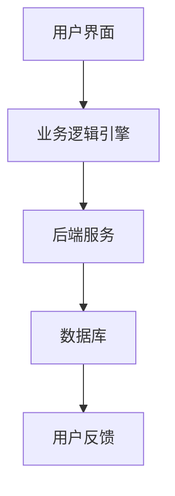

                 

### 文章标题：打造高效的低代码开发平台

### 关键词：低代码开发、平台架构、开发效率、技术实现、实践案例

### 摘要：
本文旨在深入探讨低代码开发平台的设计与实现，从概念到实践，全面解析这一新兴技术。通过分析低代码平台的核心概念、架构设计、技术细节、开发方法、应用案例以及面临的挑战和未来趋势，帮助读者掌握低代码开发的精髓，提升开发效率。

## 引言

随着信息技术的飞速发展，软件开发的复杂度和规模不断增加，传统开发模式已无法满足快速变化的市场需求。低代码开发平台应运而生，通过简化开发流程、提高开发效率，成为现代软件开发的重要趋势。本文将围绕低代码开发平台的核心概念、架构设计、技术细节、开发方法、应用案例和未来趋势进行深入探讨，旨在为开发者提供全面的技术指南。

## 第一部分：低代码开发平台概述

### 第1章：低代码开发平台简介

#### 1.1 低代码开发的背景和重要性

低代码开发平台的出现，源于对传统开发模式效率低下的反思。传统开发模式依赖于大量的手工编码，开发周期长、成本高，难以快速响应市场需求。而低代码开发通过提供可视化界面、组件化开发、自动化生成代码等功能，大幅简化了开发流程，提高了开发效率。

#### 1.2 低代码平台的核心概念和架构

低代码平台通常包括以下核心组成部分：可视化界面设计器、组件库、业务逻辑引擎、后端服务集成和部署平台。这些组成部分相互协作，共同实现低代码开发。

#### 1.3 低代码平台与传统开发模式的对比

与传统开发模式相比，低代码开发平台具有以下优势：

1. **简化开发流程**：通过可视化界面和组件化开发，大幅减少手动编码工作量。
2. **提高开发效率**：自动化生成代码、快速迭代，缩短开发周期。
3. **降低开发成本**：减少人力资源投入，降低项目成本。
4. **适应性强**：易于扩展和定制，能够快速适应不同业务需求。

## 第二部分：低代码平台核心概念与联系

### 第2章：技术细节与架构设计

#### 2.1 技术架构概述

低代码平台的技术架构通常包括前端、后端和数据库三个层次。前端负责用户界面展示和交互，后端负责业务逻辑处理和数据存储，数据库用于存储应用程序的数据。

#### 2.2 核心技术解析

1. **前端技术**：主要涉及HTML、CSS、JavaScript等，实现用户界面的展示和交互。
2. **后端技术**：包括服务器端编程语言（如Java、Python、Node.js等）和数据库（如MySQL、MongoDB等）。
3. **业务逻辑引擎**：用于处理应用程序的业务逻辑，通常采用面向服务架构（SOA）或微服务架构（MSA）。

#### 2.3 Mermaid流程图

为了更好地理解低代码平台的工作流程，我们使用Mermaid绘制了以下流程图：

## 第三部分：低代码平台开发方法

### 第3章：开发方法论与工具

#### 3.1 开发方法论

低代码开发平台的开发方法论包括以下步骤：

1. **需求分析**：明确项目需求和目标。
2. **界面设计**：使用可视化界面设计器创建用户界面。
3. **组件选择**：从组件库中选择合适的组件实现业务逻辑。
4. **代码生成**：自动化生成应用程序代码。
5. **测试与部署**：对应用程序进行测试和部署。

#### 3.2 常用工具

低代码平台开发常用的工具有：

1. **可视化界面设计器**：如Figma、Sketch等。
2. **组件库**：如Bootstrap、Ant Design等。
3. **开发环境**：如Visual Studio Code、IntelliJ IDEA等。
4. **持续集成工具**：如Jenkins、GitLab CI等。

## 第四部分：低代码平台应用实践

### 第4章：实战案例与项目解析

#### 4.1 实战案例一：在线购物平台

本项目采用低代码平台开发一个在线购物平台，包括用户注册、商品浏览、购物车、订单管理等功能。

#### 4.2 项目解析

1. **需求分析**：明确平台功能需求和用户体验。
2. **界面设计**：使用Figma设计用户界面。
3. **组件选择**：从Ant Design组件库中选择合适的组件。
4. **代码生成**：使用低代码平台自动化生成应用程序代码。
5. **测试与部署**：对应用程序进行测试和部署。

#### 4.3 项目小结

本项目通过低代码平台实现了快速开发，提高了开发效率，降低了成本。

## 第五部分：挑战与未来趋势

### 第5章：低代码开发的挑战与未来趋势

#### 5.1 挑战

1. **技术适应性**：如何确保低代码平台能够适应各种业务场景和需求。
2. **安全性与稳定性**：如何保障低代码平台的安全性和稳定性。
3. **开发人员技能**：如何培养开发人员适应低代码开发模式。

#### 5.2 未来趋势

1. **智能化**：低代码平台将更加智能化，提供更丰富的自动化功能。
2. **生态体系**：低代码平台将形成完整的生态体系，涵盖开发、测试、部署等各个环节。
3. **跨界融合**：低代码开发将与其他领域（如物联网、人工智能等）融合，推动产业升级。

## 结论

低代码开发平台作为一种新兴技术，具有显著的优势和应用前景。通过本文的探讨，我们深入了解了低代码平台的核心概念、架构设计、开发方法、应用实践以及面临的挑战和未来趋势。相信读者在阅读完本文后，能够更好地把握低代码开发的技术本质，提升开发效率。

### 作者信息

作者：AI天才研究院/AI Genius Institute & 禅与计算机程序设计艺术 /Zen And The Art of Computer Programming

---

本文通过逐步分析低代码开发平台的核心概念、架构设计、技术细节、开发方法、应用案例和未来趋势，为读者提供了一个全面的技术指南。文章结构清晰，逻辑严密，对技术原理和实际应用进行了深入剖析。希望本文能够帮助开发者更好地理解低代码开发，提升开发效率。

