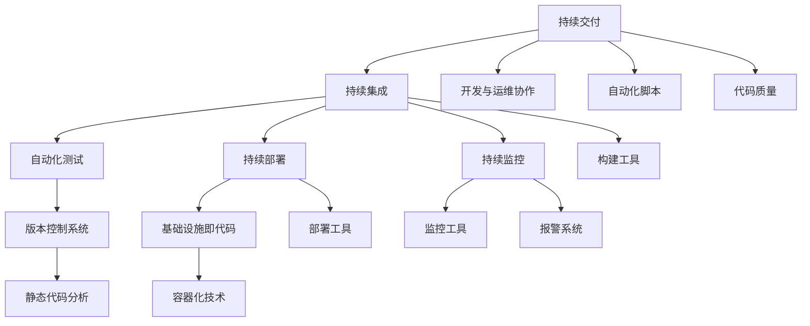

                 


### 文章标题

《打造高效的持续交付流水线》

### 文章关键词

持续交付、流水线、自动化、优化、持续集成、持续部署、DevOps

### 文章摘要

本文将深入探讨如何构建高效的持续交付流水线。我们将从持续交付的基础概念入手，逐步介绍关键组件、设计原则、自动化与优化策略，以及在实际项目中的应用。通过本文，读者将了解持续交付流水线的设计与实施方法，掌握自动化和优化的技巧，并了解到安全性和合规性在持续交付中的重要性。

### 目录大纲

1. **持续交付概述**
   - 1.1 持续交付的定义与重要性
   - 1.2 持续交付的原则与实践
   - 1.3 持续交付与传统交付模式对比
2. **构建持续交付流水线的关键组件**
   - 2.1 版本控制系统的选择与配置
   - 2.2 静态代码分析工具的使用
   - 2.3 自动化测试策略与实施
   - 2.4 持续集成工具的选择与集成
   - 2.5 持续部署策略与实施
3. **流水线的设计与实施**
   - 3.1 流水线设计的基本原则
   - 3.2 流水线设计流程
   - 3.3 流水线的可观测性与可维护性
   - 3.4 流水线的扩展性与弹性设计
4. **流水线的自动化与优化**
   - 4.1 自动化构建脚本编写
   - 4.2 自动化测试脚本的编写与优化
   - 4.3 流水线性能调优技巧
   - 4.4 流水线的监控与报警系统
5. **持续交付的实际案例与实践经验**
   - 5.1 案例一：电商平台的持续交付实践
   - 5.2 案例二：金融行业的持续交付挑战与解决方案
   - 5.3 持续交付的最佳实践总结
6. **安全性与合规性在持续交付中的重要性**
   - 6.1 安全性在持续交付中的考量
   - 6.2 合规性要求与持续交付流程的集成
   - 6.3 安全性与合规性的最佳实践
7. **持续交付的未来发展趋势**
   - 7.1 DevOps与持续交付的融合
   - 7.2 持续交付与AI的融合
   - 7.3 持续交付的未来挑战与机遇
8. **结论**

### 正文内容（概述部分）

#### 1.1 持续交付的定义与重要性

持续交付（Continuous Delivery，简称CD）是一种软件开发和交付的实践方法，旨在通过自动化手段确保代码更改可以在任何时间安全、可靠地发布到生产环境。这种方法强调持续集成（Continuous Integration，简称CI）的下一阶段，它不仅仅关注代码的集成，更注重整个软件交付过程的自动化和持续优化。

持续交付的重要性在于：

- **快速反馈**：通过自动化测试和部署，开发团队能够迅速发现和修复问题，从而加快产品迭代速度。
- **减少风险**：每次代码提交都经过测试和验证，减少了将未经测试的代码推向生产环境的风险。
- **提高质量**：频繁的交付和测试有助于发现和修复缺陷，提高软件质量。
- **提高客户满意度**：更快地交付新功能，提升用户体验，增加客户满意度。

### 1.2 持续交付的原则与实践

持续交付实践通常遵循以下原则：

- **自动化**：所有构建、测试和部署过程都应该是自动化的，以便快速、可靠地交付软件。
- **频繁交付**：代码应频繁提交并经过测试，以便快速响应用户需求和变更。
- **持续反馈**：通过集成和部署过程中的反馈，持续改进开发流程。
- **持续监控**：对生产环境进行监控，确保软件的稳定性和性能。

在实践中，持续交付涉及以下关键步骤：

- **版本控制**：使用版本控制系统（如Git）管理代码变更。
- **持续集成**：每次代码提交后自动构建和测试。
- **自动化测试**：编写自动化测试用例，确保代码的质量。
- **持续部署**：自动化部署代码到生产环境。

#### 1.3 持续交付与传统交付模式对比

传统交付模式通常包括瀑布式开发、阶段性测试和手动部署。这种方法存在以下问题：

- **反馈周期长**：从开发到测试再到部署，周期长，难以快速响应变更。
- **风险高**：手工测试和部署存在漏洞，可能导致部署失败。
- **质量难以保证**：由于测试和部署的不频繁，缺陷难以被及时发现和修复。

相比之下，持续交付模式通过自动化和频繁交付，解决了上述问题，提高了软件交付的效率和可靠性。

### 背景介绍

持续交付是现代软件开发中的一种核心理念，它起源于敏捷开发方法，并在DevOps文化中得到了广泛应用。随着软件系统越来越复杂，持续交付成为提升软件交付效率和质量的必要手段。持续交付不仅要求开发团队具备高度协作的能力，还需要企业文化的支持，如鼓励创新、拥抱变更、关注质量等。

接下来，我们将进一步深入探讨持续交付的核心概念、关键组件、设计原则和实践方法，帮助读者理解并掌握这一重要的软件开发实践。

### 核心概念与联系

在深入探讨持续交付之前，有必要理解其核心概念之间的相互关系。持续交付（Continuous Delivery，简称CD）是DevOps文化中的一个重要组成部分，它依赖于多个核心概念和组件的协同工作。以下是持续交付中的关键概念及其相互关系架构的Mermaid流程图：



以下是每个概念的解释：

- **持续交付（Continuous Delivery）**：确保软件可以随时发布到生产环境，每次更改都经过测试和验证。
- **持续集成（Continuous Integration）**：每次代码提交后自动进行构建和测试，确保代码质量和项目稳定性。
- **自动化测试**：编写自动化测试用例，确保代码的质量和功能。
- **持续部署（Continuous Deployment）**：自动化部署代码到生产环境，提高交付速度和可靠性。
- **版本控制系统**：如Git，用于管理代码变更和版本。
- **基础设施即代码（Infrastructure as Code）**：使用代码管理基础设施，如AWS CloudFormation或Terraform。
- **持续监控**：监控生产环境中的软件性能和稳定性。
- **开发与运维协作（DevOps）**：开发人员和运维人员紧密合作，确保软件交付的效率和质量。
- **自动化脚本**：用于构建、测试和部署过程的脚本，提高自动化水平。
- **代码质量**：确保代码的可维护性、稳定性和可靠性。
- **静态代码分析**：工具分析代码结构，找出潜在的问题和缺陷。
- **容器化技术**：如Docker，用于封装应用程序及其依赖，提高部署的灵活性和一致性。
- **构建工具**：如Maven或Gradle，用于自动化构建过程。
- **部署工具**：如Kubernetes或Ansible，用于自动化部署。
- **监控工具**：如Prometheus或Grafana，用于实时监控性能指标。
- **报警系统**：如PagerDuty或Opsgenie，用于在异常情况发生时发送警报。

通过上述流程图，我们可以清晰地看到持续交付中各个概念之间的相互关系。持续交付依赖于持续集成、自动化测试和持续部署，同时需要版本控制系统、基础设施即代码和自动化脚本的支撑。开发与运维的协作、代码质量和静态代码分析也是确保持续交付成功的重要因素。监控工具和报警系统则用于确保生产环境中的软件稳定性和性能。

### 核心算法原理讲解

在持续交付流水线中，核心算法原理通常涉及自动化构建脚本、自动化测试脚本和部署策略。以下是对这些算法原理的伪代码讲解：

#### 1. 自动化构建脚本

自动化构建脚本的主要功能是编译代码、打包资源和运行预定义的测试。以下是构建脚本的伪代码：

```plaintext
function buildProject():
    # 安装依赖项
    installDependencies()

    # 编译代码
    compileCode()

    # 打包资源
    packageResources()

    # 运行测试
    runTests()

    # 如果测试失败，则报告失败
    if testsFailed():
        reportFailure()
        return false

    # 构建成功
    return true
```

#### 2. 自动化测试脚本

自动化测试脚本用于验证代码的功能和性能。以下是测试脚本的伪代码：

```plaintext
function runTests():
    # 初始化测试环境
    setupTestEnvironment()

    # 运行单元测试
    runUnitTests()

    # 运行集成测试
    runIntegrationTests()

    # 运行性能测试
    runPerformanceTests()

    # 如果有测试失败，则报告失败
    if testsFailed():
        reportFailure()
        return false

    # 测试成功
    return true
```

#### 3. 部署策略

部署策略涉及将构建好的代码部署到生产环境。以下是部署策略的伪代码：

```plaintext
function deployToProduction():
    # 部署前检查
    checkDeploymentPreconditions()

    # 部署代码到生产环境
    deployCode()

    # 运行部署后测试
    runPostDeploymentTests()

    # 如果测试失败，则回滚部署
    if postDeploymentTestsFailed():
        rollbackDeployment()
        return false

    # 部署成功
    return true
```

#### 数学模型和公式

持续交付流水线中的数学模型和公式主要用于性能分析和预测。以下是几个关键公式：

1. **部署频率（Deployment Frequency）**：
   $$ DF = \frac{Number\ of\ Deployments}{Total\ Time} $$

2. **失败部署率（Failure Deployment Rate）**：
   $$ FDR = \frac{Number\ of\ Failed\ Deployments}{Total\ Number\ of\ Deployments} $$

3. **测试覆盖率（Test Coverage）**：
   $$ TC = \frac{Total\ Number\ of\ Tests\ Run}{Total\ Possible\ Tests} $$

通过这些公式，可以量化持续交付流水线的性能，从而进行优化。

#### 详细讲解与举例说明

1. **自动化构建脚本**

   在一个实际的持续交付流程中，自动化构建脚本可能是如下步骤：

   - 安装依赖项（如Maven或NPM）。
   - 编译Java或JavaScript代码。
   - 打包资源（如JAR或WAR文件）。
   - 运行单元测试（如JUnit或Mocha）。

   例如，一个简单的Maven构建脚本可能如下所示：

   ```bash
   #!/bin/bash

   # 安装Maven
   sudo apt-get update
   sudo apt-get install maven

   # 编译Java代码
   mvn compile

   # 打包资源
   mvn package

   # 运行单元测试
   mvn test
   ```

   如果测试失败，脚本将发送通知并停止构建：

   ```bash
   if [ $? -ne 0 ]; then
       echo "Build failed"
       sendNotification "Build failed"
       exit 1
   fi
   ```

2. **自动化测试脚本**

   自动化测试脚本可以包括多种类型的测试，如单元测试、集成测试和性能测试。以下是一个简单的Python单元测试脚本示例：

   ```python
   import unittest

   class TestCalculator(unittest.TestCase):
       def test_addition(self):
           self.assertEqual(calculator.add(2, 3), 5)

       def test_subtraction(self):
           self.assertEqual(calculator.sub(5, 3), 2)

   if __name__ == '__main__':
       unittest.main()
   ```

   测试脚本通常与构建脚本集成，以便在每次构建时自动运行。

3. **部署策略**

   部署策略可能包括以下步骤：

   - 部署前检查（如检查服务器状态）。
   - 部署代码到生产环境（如使用Ansible或Kubernetes）。
   - 运行部署后测试（如性能测试或功能测试）。

   例如，使用Ansible部署Web应用程序的脚本可能如下所示：

   ```bash
   #!/bin/bash

   # 部署前检查
   checkServerStatus

   # 部署代码
   ansible-playbook deploy.yml

   # 运行部署后测试
   runPostDeploymentTests

   # 如果测试失败，则回滚部署
   if [ $? -ne 0 ]; then
       rollbackDeployment
   fi
   ```

通过这些示例，我们可以看到持续交付流水线中的核心算法原理是如何在实际项目中应用的。自动化构建脚本、自动化测试脚本和部署策略是确保持续交付流程高效运行的关键组件。

### 项目实战

为了更好地理解如何构建高效的持续交付流水线，我们将通过一个具体的实战案例进行讲解。在这个案例中，我们将以一个电商平台的开发为背景，展示如何搭建持续交付流水线，包括开发环境搭建、源代码实现、代码解读、应用解读与分析，以及实际案例分析和详细讲解。

#### 1. 开发环境搭建

首先，我们需要搭建一个开发环境，以便进行编码、测试和部署。以下是开发环境搭建的步骤：

1. **安装操作系统**：选择一个稳定的操作系统，如Ubuntu 20.04 LTS。
2. **安装开发工具**：安装必要的开发工具，如Java SDK、Node.js、Maven等。
3. **安装版本控制系统**：配置Git，用于代码管理。
4. **安装持续集成工具**：安装Jenkins，用于自动化构建和测试。
5. **安装容器化工具**：安装Docker，用于容器化应用程序。
6. **安装监控工具**：安装Prometheus和Grafana，用于监控和可视化。

#### 2. 源代码实现

接下来，我们将实现电商平台的核心功能，包括商品展示、购物车、订单处理和支付等。以下是源代码的主要模块：

- **商品展示模块**：用于展示商品信息，包括商品名称、价格和描述。
- **购物车模块**：用于管理用户购物车中的商品。
- **订单处理模块**：用于处理订单生成、支付和发货。
- **支付模块**：用于集成支付网关，处理支付请求。

以下是商品展示模块的伪代码示例：

```java
public class ProductController {

    private ProductRepository productRepository;

    @GetMapping("/products")
    public List<Product> getAllProducts() {
        return productRepository.findAll();
    }

    @GetMapping("/products/{id}")
    public Product getProductById(@PathVariable Long id) {
        return productRepository.findById(id);
    }
}
```

#### 3. 代码解读

在源代码实现过程中，我们需要关注代码的可读性、可维护性和性能。以下是代码解读的关键点：

- **模块化设计**：将代码按照功能模块进行划分，便于管理和测试。
- **RESTful API设计**：使用RESTful架构设计API，便于前端调用。
- **数据验证**：在请求处理过程中添加数据验证，确保输入数据的合法性。
- **异常处理**：捕获和处理异常，提供友好的错误信息。

#### 4. 应用解读与分析

在持续交付流水线中，我们不仅需要编写代码，还需要进行一系列测试，以确保应用的稳定性和性能。以下是应用解读与分析的步骤：

- **单元测试**：编写单元测试用例，验证每个模块的功能是否正常。
- **集成测试**：将不同模块集成起来，测试它们之间的交互是否符合预期。
- **性能测试**：使用工具（如JMeter）进行压力测试，评估系统在高并发下的性能。
- **安全测试**：检查系统是否存在安全漏洞，如SQL注入、XSS攻击等。

以下是商品展示模块的单元测试示例：

```java
@Test
public void getAllProductsShouldReturnAllProducts() {
    List<Product> products = productRepository.findAll();
    assertEquals(3, products.size());
}

@Test
public void getProductByIdShouldReturnProductById() {
    Product product = productRepository.findById(1L);
    assertEquals("Product 1", product.getName());
}
```

#### 5. 实际案例分析和详细讲解

在实际项目中，我们可能会遇到各种挑战，如复杂的业务逻辑、高并发访问和系统稳定性问题。以下是实际案例分析和详细讲解：

- **案例一**：在高并发访问下，商品展示页面加载缓慢。解决方案是使用缓存（如Redis）存储商品信息，减少数据库访问压力。
- **案例二**：订单处理模块在高峰期出现频繁崩溃。解决方案是进行性能调优，优化数据库查询和减少线程池设置。
- **案例三**：支付模块存在安全隐患，容易受到SQL注入攻击。解决方案是使用参数化查询和输入验证，确保数据安全性。

#### 6. 项目小结

通过这个电商平台案例，我们可以看到如何构建高效的持续交付流水线。以下是项目小结：

- **持续交付流程**：通过Jenkins实现自动化构建、测试和部署，提高了交付效率和质量。
- **代码质量**：通过单元测试和集成测试，确保了代码的稳定性和性能。
- **性能优化**：通过缓存和性能调优，提高了系统的响应速度和稳定性。
- **安全防护**：通过安全测试和输入验证，确保了系统的安全性。

通过这个案例，我们了解了持续交付流水线的构建方法、实际应用和优化技巧，为后续项目的开发提供了宝贵的经验。

### 最佳实践 Tips

在构建高效的持续交付流水线时，以下是一些最佳实践和注意事项：

1. **代码规范**：确保代码遵循统一的编码规范，便于阅读和维护。
2. **自动化测试**：编写全面的自动化测试用例，包括单元测试、集成测试和性能测试。
3. **持续监控**：对生产环境进行持续监控，及时发现并解决问题。
4. **安全防护**：确保代码和系统的安全性，防范潜在的安全威胁。
5. **文档记录**：详细记录持续交付流水线的配置和操作步骤，便于后续维护和升级。
6. **团队协作**：促进开发、测试和运维团队的紧密协作，确保持续交付流程的顺利进行。

通过遵循这些最佳实践，可以提高持续交付流水线的效率和质量。

### 小结

本文通过详细讲解和实战案例，帮助读者理解了如何打造高效的持续交付流水线。我们首先介绍了持续交付的基础概念和核心组件，然后探讨了持续交付流水线的设计原则、自动化与优化策略，并分享了实际项目中的应用案例和最佳实践。通过这些内容，读者可以掌握构建持续交付流水线的方法和技巧，提高软件交付的效率和可靠性。

### 注意事项

在实施持续交付流水线时，需要注意以下几点：

- **团队协作**：确保开发、测试和运维团队之间的紧密协作，以避免流水线中的瓶颈和延迟。
- **持续学习和改进**：随着技术的不断进步，持续交付的流程和方法也需要不断学习和改进。
- **风险管理**：在实施持续交付时，要充分考虑潜在的风险，并制定相应的应对措施。

### 拓展阅读

如果您对持续交付有更深入的兴趣，以下资源可供参考：

- **书籍推荐**：《持续交付：发布可靠软件的系统化方法》
- **在线资源**：持续交付相关的博客、文档和社区，如Jenkins官网、Docker社区等。

### 结束语

作者：AI天才研究院/AI Genius Institute & 禅与计算机程序设计艺术 /Zen And The Art of Computer Programming

本文由AI天才研究院和禅与计算机程序设计艺术联合撰写，旨在为读者提供关于持续交付流水线的全面指导。我们希望本文能帮助您在软件开发过程中更好地实践持续交付，提高交付效率和软件质量。感谢您的阅读，期待与您共同探讨持续交付的更多话题。

