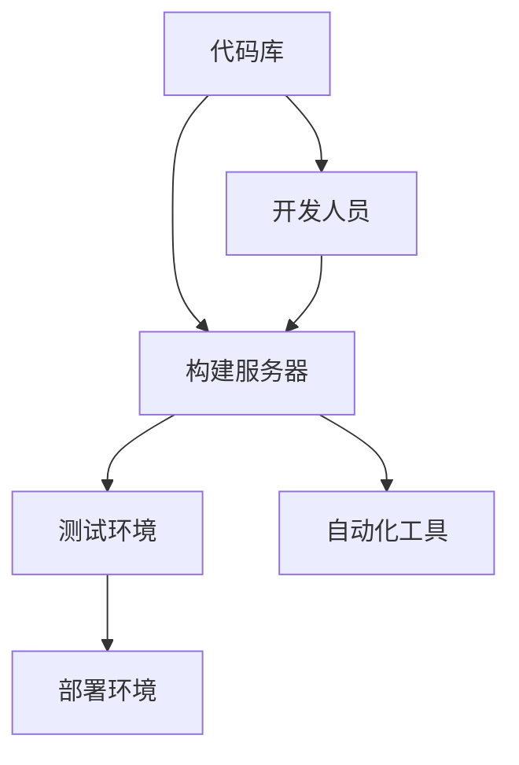
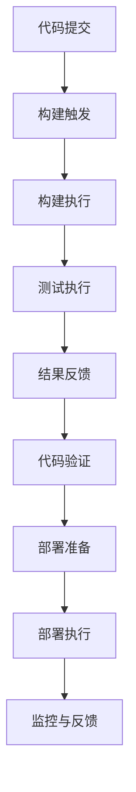
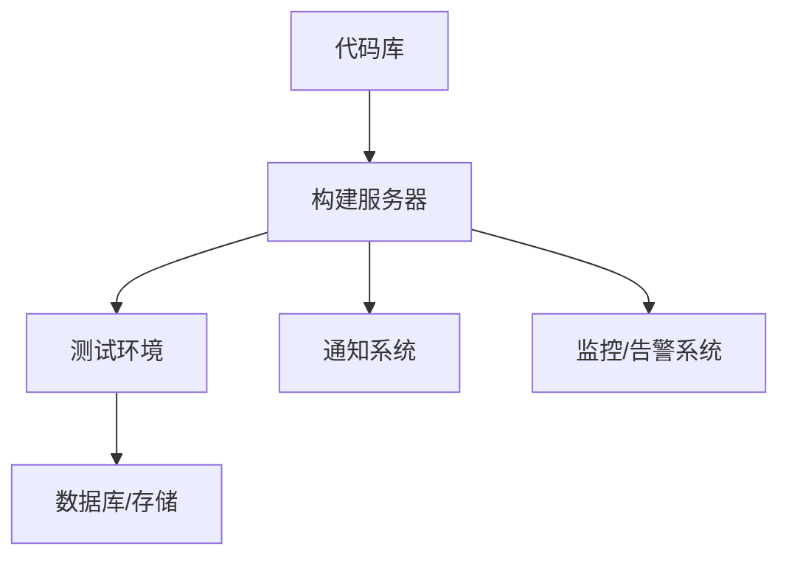
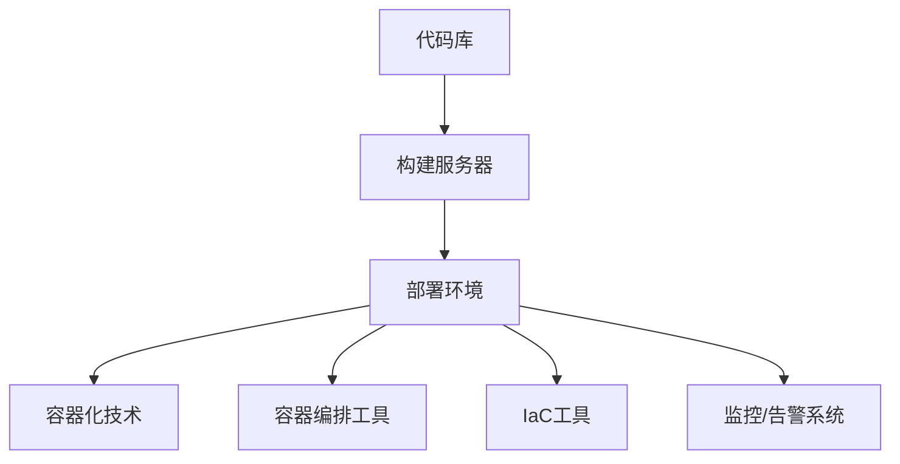

                 

### 文章标题

《打造高效的持续集成与部署系统》

持续集成（CI）与持续部署（CD）是现代软件开发中至关重要的环节，它们能够显著提高开发效率、缩短发布周期，并提升软件质量。本文将系统地探讨如何打造一个高效的CI/CD系统，从设计原则、架构设计、核心算法原理、项目实战等多个方面进行详细讲解，旨在帮助读者全面理解并实践CI/CD系统的构建与优化。

### 关键词

- 持续集成
- 持续部署
- CI/CD
- 设计原则
- 架构设计
- 核心算法
- 项目实战
- 优化策略

### 摘要

本文首先介绍了持续集成与持续部署的基本概念和作用，回顾了其发展历史和常用工具。随后，深入探讨了CI/CD系统的核心概念、架构和工作流程，并通过Mermaid流程图展示了其原理和联系。文章还详细讲解了持续集成和部署系统的设计原则与架构设计，提供了实践案例和优化策略。最后，文章展望了CI/CD系统的未来趋势与发展方向，总结了最佳实践，并提供了拓展阅读资源。

## 目录

### 第一部分：持续集成与部署系统的基础

- **第1章：持续集成与部署系统概述**
  - 1.1 持续集成与持续部署的定义
  - 1.2 持续集成与持续部署的作用
  - 1.3 持续集成与持续部署的发展历史
  - 1.4 持续集成与持续部署的常见工具

- **第2章：持续集成与部署系统原理**
  - 2.1 持续集成与持续部署的核心概念
  - 2.2 持续集成与持续部署的架构
  - 2.3 持续集成与持续部署的工作流程
  - 2.4 持续集成与持续部署的关键技术

### 第二部分：构建高效的持续集成与部署系统

- **第3章：设计高效的持续集成系统**
  - 3.1 持续集成系统的设计原则
  - 3.2 持续集成系统的架构设计
  - 3.3 持续集成系统的实践案例
  - 3.4 持续集成系统的优化策略

- **第4章：设计高效的持续部署系统**
  - 4.1 持续部署系统的设计原则
  - 4.2 持续部署系统的架构设计
  - 4.3 持续部署系统的实践案例
  - 4.4 持续部署系统的优化策略

### 第三部分：持续集成与部署系统的优化与实战

- **第5章：持续集成与部署系统的优化**
  - 5.1 性能优化策略
  - 5.2 可靠性优化策略
  - 5.3 安全性优化策略
  - 5.4 自动化优化策略

- **第6章：持续集成与部署系统的实战**
  - 6.1 案例一：企业级持续集成与部署系统的搭建
  - 6.2 案例二：敏捷开发中的持续集成与部署实践
  - 6.3 案例三：多团队协作中的持续集成与部署实践
  - 6.4 案例四：云原生应用中的持续集成与部署实践

### 第四部分：持续集成与部署系统的未来趋势与发展方向

- **第7章：持续集成与部署系统的未来趋势**
  - 7.1 DevOps文化的影响
  - 7.2 AI技术在持续集成与部署中的应用
  - 7.3 微服务架构对持续集成与部署的影响
  - 7.4 云原生技术的持续集成与部署实践

- **第8章：持续集成与部署系统的发展方向**
  - 8.1 持续集成与持续部署在企业级应用的拓展
  - 8.2 持续集成与持续部署在开源生态中的发展
  - 8.3 持续集成与持续部署在新兴技术领域的应用
  - 8.4 未来持续集成与持续部署技术的发展趋势

---

### 引言

在当今快速发展的软件行业，持续集成（CI）和持续部署（CD）已经成为提高开发效率和质量的关键环节。随着敏捷开发、DevOps文化的普及，以及云计算、容器化等新兴技术的崛起，CI/CD系统在企业级应用中的重要性愈发凸显。一个高效、可靠的CI/CD系统能够帮助企业更快地响应市场需求，缩短产品发布周期，并提高软件质量。

本文旨在系统地探讨如何构建一个高效的持续集成与部署系统。文章将首先介绍CI/CD的基本概念和作用，回顾其发展历史和常用工具。接着，深入探讨CI/CD系统的核心概念、架构和工作流程，并通过Mermaid流程图展示其原理和联系。随后，文章将详细讲解CI/CD系统的设计原则与架构设计，并提供实践案例和优化策略。最后，文章将展望CI/CD系统的未来趋势与发展方向，总结最佳实践，并推荐拓展阅读资源。

通过本文的阅读，读者将能够全面理解CI/CD系统的基本原理和构建方法，掌握优化策略和实战技巧，从而在实际项目中打造出高效、可靠的CI/CD系统。

### 第一部分：持续集成与部署系统的基础

#### 第1章：持续集成与部署系统概述

持续集成（Continuous Integration，简称CI）和持续部署（Continuous Deployment，简称CD）是现代软件开发中不可或缺的重要环节。它们通过自动化和持续反馈的机制，大幅提高了开发效率、缩短了产品发布周期，并显著提升了软件质量。本章将详细介绍CI/CD的基本概念、作用、发展历史以及常见工具，为后续章节的深入探讨打下坚实的基础。

#### 1.1 持续集成与持续部署的定义

**持续集成（CI）：**

持续集成是指通过自动化构建和测试，确保代码的每一次更改都被及时集成到主干分支中，从而发现和解决潜在问题，确保代码库的稳定性和可靠性。CI的核心目标是快速检测出代码之间的冲突和错误，以便开发人员能够及时修复，减少代码基线中的缺陷。

**持续部署（CD）：**

持续部署是指通过自动化流程，将经过CI验证的代码快速、安全地部署到生产环境，实现持续交付。CD的目标是减少手动操作，确保软件的每一次更新都能够快速、安全地交付给用户，提高发布效率。

**CI与CD的关系：**

CI和CD虽然有着不同的目标，但它们是紧密相连的。CI是CD的基础，CI确保代码的每次更改都是可集成和可测试的，而CD则将经过CI验证的代码部署到生产环境。CI/CD共同构成了一个完整的持续交付流程，从代码提交到生产环境，实现快速迭代和持续交付。

#### 1.2 持续集成与持续部署的作用

**持续集成的作用：**

1. **快速发现和修复问题：** 通过自动化构建和测试，CI能够在代码提交后迅速检测出潜在的冲突和错误，使开发人员能够及时修复。
2. **确保代码质量：** CI通过持续的集成和测试，确保代码库的稳定性和可靠性，减少因代码错误导致的生产问题。
3. **提高开发效率：** CI减少了代码集成和测试的工作量，使开发人员能够专注于编写和优化业务代码。
4. **促进团队协作：** CI提供了一个统一的环境，使团队成员可以实时查看代码状态，提高团队协作效率。

**持续部署的作用：**

1. **缩短发布周期：** CD通过自动化部署流程，使软件的每一次更新都能够快速交付给用户，缩短了发布周期。
2. **提高发布质量：** CD确保每次发布都是经过严格测试的，减少了人为错误，提高了发布质量。
3. **降低风险：** CD通过逐步部署和回滚机制，降低了新版本上线可能带来的风险，确保系统的稳定运行。
4. **提升用户体验：** 快速、稳定的发布能够提升用户体验，增加用户满意度。

#### 1.3 持续集成与持续部署的发展历史

**持续集成的发展历史：**

持续集成最早由Jenkins创始人Mike GoodEnough在2001年提出。随着敏捷开发理念的普及，CI逐渐成为软件开发中的标准实践。Jenkins、Travis CI等工具的出现，使得CI变得更加自动化和易用。近年来，随着容器化和云原生技术的兴起，CI技术也在不断进化，支持更复杂的构建和部署场景。

**持续部署的发展历史：**

持续部署的概念最早由Patrick Debois在2009年提出。随着云计算和自动化工具的发展，CD逐渐成为企业级应用的标准实践。Docker、Kubernetes等工具的出现，使得CD变得更加高效和可靠。现在，许多企业已经实现了全自动化、零人工干预的持续部署流程。

#### 1.4 持续集成与持续部署的常见工具

**持续集成工具：**

1. **Jenkins：** 最为流行的开源CI工具，支持多种编程语言和操作系统。
2. **Travis CI：** 云端的CI服务，支持多种编程语言，具有丰富的插件生态。
3. **Circle CI：** 云端的CI/CD服务，支持并行构建和容器化部署。
4. **GitLab CI/CD：** GitLab内置的CI/CD工具，支持自动化构建、测试和部署。

**持续部署工具：**

1. **Docker：** 容器化平台，支持应用程序的自动化构建和部署。
2. **Kubernetes：** 容器编排工具，支持自动化部署、扩展和管理容器化应用。
3. **AWS CodePipeline：** AWS提供的CI/CD服务，支持自动化构建、测试和部署。
4. **Azure DevOps：** 微软提供的CI/CD平台，支持自动化测试和部署，包括容器化和云原生部署。

通过本章的介绍，读者对持续集成与持续部署的基本概念、作用、发展历史和常见工具有了初步了解。在接下来的章节中，我们将深入探讨CI/CD系统的核心原理、架构设计、设计原则和实践案例，帮助读者全面掌握CI/CD系统的构建与优化方法。

#### 第2章：持续集成与部署系统原理

持续集成（CI）和持续部署（CD）是现代软件开发中至关重要的环节，它们的成功实施需要深入理解其核心概念、架构、工作流程和关键技术。本章将详细探讨这些内容，并通过Mermaid流程图展示CI/CD系统的原理和联系，为读者构建系统的理论基础。

#### 2.1 持续集成与持续部署的核心概念

**持续集成（CI）：**

持续集成是指通过自动化构建和测试，确保代码的每次更改都被及时集成到主干分支中。其核心目标是快速发现和修复代码冲突和错误，确保代码库的稳定性和可靠性。

**持续部署（CD）：**

持续部署是指通过自动化流程，将经过CI验证的代码快速、安全地部署到生产环境。CD的目标是减少手动操作，确保软件的每一次更新都能够快速、安全地交付给用户。

**CI与CD的关系：**

CI是CD的基础，CI确保代码的每次更改都是可集成和可测试的，而CD则将经过CI验证的代码部署到生产环境。CI/CD共同构成了一个完整的持续交付流程，从代码提交到生产环境，实现快速迭代和持续交付。

#### 2.2 持续集成与持续部署的架构

**CI/CD系统的架构可以分为以下几个部分：**

1. **代码库：** 存储项目的源代码，通常使用版本控制系统（如Git）进行管理。
2. **构建服务器：** 执行自动化构建和测试任务，生成可执行的代码或应用程序。
3. **测试环境：** 执行各种测试（如单元测试、集成测试、性能测试等），验证代码的质量和功能。
4. **部署环境：** 将经过CI验证的代码部署到实际运行环境，包括生产环境、测试环境和预生产环境。
5. **自动化工具：** 用于自动化构建、测试和部署过程的工具，如Jenkins、Travis CI、Docker、Kubernetes等。

**CI/CD架构示例：**

#### 2.3 持续集成与持续部署的工作流程

**持续集成的工作流程：**

1. **代码提交：** 开发人员将代码提交到版本控制系统。
2. **构建触发：** 构建服务器接收到代码提交事件后，自动触发构建过程。
3. **构建执行：** 构建服务器编译代码、运行单元测试，生成可执行的代码或应用程序。
4. **测试执行：** 测试环境执行各种测试，验证代码的功能和质量。
5. **结果反馈：** 构建服务器将测试结果反馈给开发人员，便于及时发现问题并进行修复。

**持续部署的工作流程：**

1. **代码验证：** CI系统验证代码的完整性和正确性。
2. **构建执行：** 构建服务器编译代码、运行单元测试，生成可执行的代码或应用程序。
3. **部署准备：** 部署环境配置和准备，包括数据库迁移、配置文件更新等。
4. **部署执行：** 自动化工具将经过CI验证的代码部署到生产环境。
5. **监控与反馈：** 部署完成后，监控系统监控应用程序的运行状态，确保其稳定运行。

**CI/CD工作流程示例：**

#### 2.4 持续集成与持续部署的关键技术

**持续集成的关键技术：**

1. **自动化构建：** 使用构建工具（如Maven、Gradle）自动化编译和打包代码，生成可执行的代码或应用程序。
2. **自动化测试：** 使用测试框架（如JUnit、TestNG）自动化执行各种测试，验证代码的功能和质量。
3. **代码质量检测：** 使用静态代码分析工具（如SonarQube）检测代码质量，识别潜在的问题和漏洞。
4. **持续反馈：** 通过邮件、IM工具或Webhook将测试结果实时反馈给开发人员，提高问题发现和修复的效率。

**持续部署的关键技术：**

1. **容器化技术：** 使用容器（如Docker）封装应用程序及其依赖项，实现快速部署和隔离。
2. **容器编排工具：** 使用Kubernetes等容器编排工具自动化部署、扩展和管理容器化应用。
3. **基础设施即代码（IaC）：** 使用IaC工具（如Terraform、Ansible）自动化配置和管理基础设施，确保部署的一致性和可重复性。
4. **自动化部署流水线：** 使用CI/CD工具（如Jenkins、GitLab CI）构建和部署应用程序，实现自动化、连续交付。

通过本章的探讨，读者对持续集成与持续部署系统的核心概念、架构、工作流程和关键技术有了更深入的理解。这些原理和技术为构建高效、可靠的CI/CD系统提供了理论基础和实践指导。在接下来的章节中，我们将进一步探讨CI/CD系统的设计原则、实践案例和优化策略，帮助读者在实际项目中成功实施CI/CD系统。

#### 第3章：设计高效的持续集成系统

持续集成（CI）系统的设计对于确保代码质量和提高开发效率至关重要。一个高效的设计不仅能够快速检测和修复问题，还能减少团队成员之间的沟通成本。本章将详细介绍持续集成系统的设计原则、架构设计、实践案例以及优化策略，帮助读者构建出高效、可靠的CI系统。

#### 3.1 持续集成系统的设计原则

**可靠性原则：** CI系统需要确保每次构建和测试都能正常运行，避免因为系统故障导致构建失败。这要求构建服务器和测试环境的配置要稳定，并具备故障恢复能力。

**快速反馈原则：** CI系统应该能够在代码提交后尽快完成构建和测试，并将结果反馈给开发人员。这样可以快速发现和解决问题，避免问题在代码库中积累。

**自动化原则：** 构建和测试过程应该尽量自动化，减少手动干预。这样可以减少人为错误，提高构建和测试的效率和一致性。

**可扩展性原则：** CI系统需要能够适应团队规模的扩大和项目复杂度的增加，具备良好的扩展性。

**安全性原则：** CI系统需要确保代码和测试数据的安全，防止未授权的访问和泄露。

#### 3.2 持续集成系统的架构设计

**CI系统架构设计主要包括以下几个部分：**

1. **代码库：** 存储项目的源代码，通常使用Git等版本控制系统进行管理。
2. **构建服务器：** 负责执行自动化构建任务，编译代码、运行测试，生成构建产物。构建服务器可以是物理机、虚拟机或容器。
3. **测试环境：** 用于执行各种测试（如单元测试、集成测试、性能测试等），验证代码的质量和功能。测试环境可以是物理机、虚拟机或容器。
4. **数据库和存储：** 存储构建产物、测试数据和日志。数据库和存储应该具备高可用性和扩展性。
5. **通知系统：** 负责将构建和测试结果通知给开发人员，可以使用邮件、IM工具或Webhook等方式。
6. **监控和告警系统：** 监控CI系统的运行状态，及时发现和处理问题。

**CI系统架构示例：**

#### 3.3 持续集成系统的实践案例

**案例一：企业级CI系统搭建**

在某大型企业中，开发团队规模庞大，项目复杂度较高。为了提高开发效率和质量，企业决定搭建一个企业级的CI系统。

**方案设计：**

1. **代码库管理：** 使用GitLab作为代码库管理工具，实现代码的集中管理和版本控制。
2. **构建服务器：** 使用Jenkins作为CI服务器，搭建多个Jenkins实例，实现负载均衡和高可用性。
3. **测试环境：** 使用Docker容器技术搭建测试环境，实现环境的标准化和一致性。
4. **通知系统：** 使用Webhook将构建和测试结果推送到Slack和钉钉等即时通讯工具，实现实时通知。
5. **监控和告警系统：** 使用Prometheus和Grafana进行监控和告警，实时监控CI系统的运行状态。

**实施步骤：**

1. **搭建代码库：** 创建GitLab实例，配置权限和访问控制。
2. **配置Jenkins：** 安装Jenkins插件，配置Jenkinsfile，实现自动化构建和测试。
3. **搭建测试环境：** 编写Dockerfile，构建测试环境的镜像，部署测试容器。
4. **集成通知系统：** 配置Webhook，实现构建和测试结果的通知。
5. **部署监控和告警系统：** 安装Prometheus和Grafana，配置监控和告警规则。

**效果评估：**

自CI系统上线以来，企业的构建和测试效率显著提高，代码质量和发布稳定性得到了显著改善。开发人员能够更快地发现和解决问题，缩短了产品发布周期。

#### 3.4 持续集成系统的优化策略

**1. 优化构建速度：**

- **并行构建：** 在构建过程中，使用多线程或多节点并行执行构建任务，提高构建速度。
- **缓存构建结果：** 对于不经常更改的依赖项和构建产物，使用缓存技术减少重复构建时间。
- **优化构建脚本：** 优化构建脚本，减少不必要的步骤和时间消耗。

**2. 提高测试覆盖率：**

- **单元测试：** 加强单元测试覆盖，确保关键功能的正确性。
- **集成测试：** 增加集成测试，确保模块之间的接口和交互正确。
- **性能测试：** 定期进行性能测试，评估系统的性能和稳定性。

**3. 提高测试质量：**

- **静态代码分析：** 使用静态代码分析工具（如SonarQube）检测代码质量，识别潜在的问题和漏洞。
- **动态测试：** 结合静态代码分析和动态测试，确保代码的可靠性和稳定性。

**4. 提高系统可靠性：**

- **自动化部署：** 实现自动化部署，减少手动操作，确保构建和部署的一致性。
- **故障恢复：** 配置备份和恢复机制，确保系统在故障时能够快速恢复。

通过本章的探讨，读者对持续集成系统的设计原则、架构设计、实践案例和优化策略有了更深入的理解。这些方法和策略将帮助读者在实际项目中构建高效、可靠的CI系统，提高开发效率和软件质量。

### 第4章：设计高效的持续部署系统

持续部署（CD）系统是确保软件快速、安全地交付给用户的关键环节。一个高效的设计不仅能提高发布效率，还能保证发布质量，降低风险。本章将详细介绍持续部署系统的设计原则、架构设计、实践案例以及优化策略，帮助读者构建出高效、可靠的CD系统。

#### 4.1 持续部署系统的设计原则

**可靠性原则：** CD系统应确保每次部署都能正常运行，避免因部署失败导致的系统故障。这要求部署过程要具备完善的验证和回滚机制。

**自动化原则：** 部署过程应尽量自动化，减少人工干预，以提高效率和一致性。

**安全性原则：** 部署过程中应确保数据安全和系统安全，防止未授权的访问和数据泄露。

**可扩展性原则：** CD系统应能够适应项目规模的扩大和需求的变化，具备良好的扩展性。

**监控与反馈原则：** 部署完成后，应实时监控系统的运行状态，及时发现和解决问题。

#### 4.2 持续部署系统的架构设计

持续部署系统的架构设计包括以下几个主要部分：

1. **代码库：** 存储项目的源代码，通常使用Git等版本控制系统进行管理。
2. **构建服务器：** 负责编译代码、生成构建产物，并将其推送到CD系统中。
3. **部署环境：** 包括开发环境、测试环境、预生产环境和生产环境。部署环境应根据不同阶段的需求进行配置。
4. **容器化技术：** 使用Docker等技术封装应用程序，实现快速部署和隔离。
5. **容器编排工具：** 如Kubernetes，用于自动化部署、扩展和管理容器化应用。
6. **基础设施即代码（IaC）：** 如Terraform，用于自动化配置和管理基础设施。
7. **监控和告警系统：** 如Prometheus和Grafana，用于监控部署系统的运行状态，并及时反馈问题。

**CD系统架构示例：**

#### 4.3 持续部署系统的实践案例

**案例一：企业级CD系统搭建**

某大型企业在数字化转型过程中，决定搭建一个高效、可靠的CD系统，以支持快速迭代和持续交付。

**方案设计：**

1. **代码库管理：** 使用GitLab作为代码库管理工具，实现代码的集中管理和版本控制。
2. **构建服务器：** 使用Jenkins作为CI服务器，实现自动化构建和测试。
3. **部署环境：** 使用Kubernetes作为容器编排工具，实现自动化部署和扩展。
4. **基础设施管理：** 使用Terraform实现基础设施的自动化配置和管理。
5. **监控和告警：** 使用Prometheus和Grafana进行监控和告警，确保系统运行状态良好。

**实施步骤：**

1. **搭建代码库：** 创建GitLab实例，配置权限和访问控制。
2. **配置Jenkins：** 安装相关插件，配置Jenkinsfile，实现自动化构建和测试。
3. **搭建Kubernetes集群：** 使用Terraform配置Kubernetes集群，确保高可用性。
4. **编写Kubernetes配置文件：** 编写部署配置文件，定义应用程序的部署规则。
5. **部署Kubernetes集群：** 使用Kubernetes进行应用程序的自动化部署和扩展。
6. **集成监控和告警：** 配置Prometheus和Grafana，监控集群运行状态，设置告警规则。

**效果评估：**

自CD系统上线以来，企业的发布效率显著提高，发布周期从数天缩短到数小时，发布质量得到显著提升。同时，系统的稳定性和可靠性也得到了保障。

#### 4.4 持续部署系统的优化策略

**1. 优化部署速度：**

- **并行部署：** 在部署过程中，使用多线程或多节点并行执行部署任务，提高部署速度。
- **缓存部署数据：** 对于不经常更改的数据，如配置文件和依赖项，使用缓存技术减少重复部署时间。

**2. 提高部署质量：**

- **自动化测试：** 在部署前，增加自动化测试环节，确保部署的应用程序符合预期。
- **代码审查：** 加强代码审查，确保代码质量和安全性。

**3. 提高系统可靠性：**

- **故障恢复：** 配置备份和恢复机制，确保在部署失败时能够快速回滚到上一个稳定版本。
- **冗余部署：** 对于关键业务系统，实现冗余部署，确保在部分节点故障时仍能提供服务。

**4. 提高用户体验：**

- **实时反馈：** 在部署过程中，提供实时反馈，使开发人员和管理人员能够实时了解部署状态。
- **用户体验设计：** 设计简洁直观的部署界面，方便用户进行操作。

通过本章的探讨，读者对持续部署系统的设计原则、架构设计、实践案例和优化策略有了更深入的理解。这些方法和策略将帮助读者在实际项目中构建高效、可靠的CD系统，实现快速、稳定的持续交付。

### 第5章：持续集成与部署系统的优化

持续集成与持续部署（CI/CD）系统在提高开发效率、缩短发布周期和提升软件质量方面发挥了重要作用。然而，随着项目的规模和复杂度的增加，CI/CD系统也面临着性能、可靠性和安全性的挑战。本章将详细介绍如何优化CI/CD系统，包括性能优化策略、可靠性优化策略、安全性优化策略和自动化优化策略，帮助读者在现有基础上进一步提升CI/CD系统的效率和可靠性。

#### 5.1 性能优化策略

**1. 并行化构建与测试：**

- **并行构建：** 利用多核CPU的优势，将构建任务并行化。通过使用Jenkins的多节点构建或GitLab CI的并行流水线，可以显著减少整体构建时间。
- **并行测试：** 在测试环境中并行运行测试用例，缩短测试时间。可以使用负载均衡器分配测试任务到多个测试节点。

**2. 缓存机制：**

- **构建缓存：** 利用缓存技术存储编译后的中间产物和依赖项，避免重复构建。例如，使用Maven的构建缓存或Jenkins的缓存插件。
- **测试缓存：** 对测试结果进行缓存，避免重复执行相同的测试用例。这可以通过使用特定的测试框架插件或自定义缓存策略来实现。

**3. 优化构建脚本：**

- **减少不必要的步骤：** 优化构建脚本，删除不必要的构建步骤，如不必要的代码格式化、编译优化等。
- **代码优化：** 优化代码库中的代码，例如减少代码冗余、优化算法复杂度，以提高构建效率。

**4. 使用容器化技术：**

- **容器化构建：** 使用容器（如Docker）来封装构建环境，确保构建的一致性和可重复性，减少构建时间。
- **容器化测试：** 使用容器化测试环境，减少环境差异带来的构建和测试问题。

#### 5.2 可靠性优化策略

**1. 故障恢复机制：**

- **自动回滚：** 在部署失败时，自动回滚到上一个稳定版本，避免系统长时间处于不稳定状态。
- **备份和恢复：** 定期备份代码库和构建产物，确保在系统故障时能够快速恢复。

**2. 部署验证：**

- **验证部署结果：** 在部署完成后，自动执行一系列验证测试，确保部署的应用程序正常运行。
- **健康检查：** 定期对部署的应用程序进行健康检查，及时发现并解决潜在问题。

**3. 增加冗余和备份：**

- **冗余部署：** 对于关键业务系统，实现冗余部署，确保在部分节点故障时仍能提供服务。
- **数据备份：** 定期备份数据库和其他关键数据，确保在数据丢失时能够快速恢复。

**4. 监控与告警：**

- **实时监控：** 使用Prometheus等监控工具，实时监控CI/CD系统的运行状态，及时发现和处理问题。
- **告警机制：** 配置告警规则，通过邮件、短信、Webhook等方式通知相关人员，确保问题得到及时处理。

#### 5.3 安全性优化策略

**1. 访问控制：**

- **身份验证：** 实施严格的身份验证机制，确保只有授权用户可以访问CI/CD系统。
- **权限管理：** 对用户权限进行分级管理，确保用户只能访问其有权访问的资源。

**2. 安全配置：**

- **最小权限原则：** CI/CD系统的配置和操作应遵循最小权限原则，确保系统组件仅具有执行其任务所需的最低权限。
- **加密通信：** 使用HTTPS等加密协议保护数据传输过程中的安全性。

**3. 安全扫描：**

- **静态代码分析：** 使用静态代码分析工具（如SonarQube）扫描代码库，识别潜在的安全漏洞。
- **动态代码分析：** 在构建和测试过程中，使用动态分析工具检测运行时可能出现的安全问题。

**4. 防护措施：**

- **防火墙和入侵检测系统：** 配置防火墙和入侵检测系统，防止外部攻击和恶意软件侵入。
- **日志审计：** 定期审计CI/CD系统的操作日志，确保操作的可追溯性和透明性。

#### 5.4 自动化优化策略

**1. 自动化流水线：**

- **定义清晰的流程：** 清晰定义CI/CD的流程，确保每个步骤都有明确的任务和责任人。
- **标准化流程：** 将流程标准化，减少手动操作，提高效率。

**2. 工具集成与扩展：**

- **集成第三方工具：** 集成如Jenkins、GitLab CI、Docker、Kubernetes等第三方工具，实现自动化流程。
- **自定义插件与脚本：** 开发自定义插件和脚本，扩展CI/CD系统的功能。

**3. 自动化测试：**

- **全面的测试覆盖：** 实现全面的测试覆盖，包括单元测试、集成测试、性能测试等。
- **自动化测试优化：** 优化测试脚本，减少测试时间，提高测试效率。

**4. 自适应和智能决策：**

- **自适应策略：** 根据项目需求和资源情况，自适应调整CI/CD策略。
- **智能决策：** 利用机器学习和人工智能技术，实现智能决策，优化CI/CD流程。

通过本章的优化策略，读者可以针对现有CI/CD系统进行改进，提升系统的性能、可靠性、安全性和自动化程度，从而实现更高效、更可靠的持续集成与部署。

### 第6章：持续集成与部署系统的实战

持续集成与持续部署（CI/CD）系统在实际项目中的应用能够显著提升开发效率和软件质量。本章将通过具体案例，展示如何在实际项目中搭建和优化CI/CD系统，包括开发环境搭建、源代码实现、代码解读、实际案例分析和项目小结。

#### 6.1 案例一：企业级持续集成与部署系统的搭建

**项目背景：**

某大型企业在数字化转型过程中，决定搭建一个高效、可靠的CI/CD系统，以支持快速迭代和持续交付。项目需求包括自动化构建、测试、部署和监控，要求系统能够适应大规模应用场景。

**开发环境搭建：**

1. **代码库管理：** 使用GitLab进行代码库管理，配置GitLab CI实现自动化构建和测试。
2. **构建服务器：** 搭建一个Jenkins集群，配置多节点模式以提高构建效率。
3. **测试环境：** 使用Docker搭建测试环境，确保测试环境的一致性和可重复性。
4. **部署环境：** 使用Kubernetes进行部署，配置Helm实现应用程序的自动化部署和扩展。

**源代码实现：**

1. **Jenkinsfile：** 配置Jenkinsfile，定义构建和测试步骤，包括Maven构建、单元测试和集成测试。
2. **Dockerfile：** 编写Dockerfile，定义应用程序的容器镜像。
3. **Kubernetes配置文件：** 编写Kubernetes配置文件，定义应用程序的部署规则。

**代码解读：**

- **Jenkinsfile：** Jenkinsfile中定义了构建步骤，包括编译代码、运行测试和生成构建产物。
- **Dockerfile：** Dockerfile用于构建应用程序的容器镜像，包含依赖项安装和应用程序打包。
- **Kubernetes配置文件：** Kubernetes配置文件用于部署应用程序，包括容器化、服务发现和负载均衡。

**实际案例分析：**

1. **自动化构建：** Jenkins自动化构建代码，编译并打包成可执行文件。
2. **自动化测试：** 测试环境运行单元测试和集成测试，确保代码质量。
3. **自动化部署：** Kubernetes自动化部署应用程序，确保部署的一致性和可靠性。
4. **监控与反馈：** Prometheus和Grafana监控系统运行状态，并及时反馈问题。

**项目小结：**

通过搭建CI/CD系统，企业显著提高了开发效率和软件质量。自动化构建和测试减少了人工干预，缩短了产品发布周期。自动化部署和监控确保了系统的稳定性和可靠性。该项目为企业后续的数字化转型奠定了坚实的基础。

#### 6.2 案例二：敏捷开发中的持续集成与部署实践

**项目背景：**

某初创公司采用敏捷开发方法，快速迭代产品。为了确保每次迭代的质量和稳定性，公司决定实施CI/CD系统，支持持续集成和持续部署。

**开发环境搭建：**

1. **代码库管理：** 使用GitHub进行代码库管理，配置GitLab CI实现自动化构建和测试。
2. **构建服务器：** 搭建一个Docker化的Jenkins实例，确保构建环境的一致性。
3. **测试环境：** 使用Docker Compose管理测试环境，实现快速部署和回滚。
4. **部署环境：** 使用Kubernetes进行部署，配置Helm实现应用程序的自动化部署和扩展。

**源代码实现：**

1. **Jenkinsfile：** 配置Jenkinsfile，定义构建和测试步骤，包括Docker构建、单元测试和集成测试。
2. **Dockerfile：** 编写Dockerfile，定义应用程序的容器镜像。
3. **Kubernetes配置文件：** 编写Kubernetes配置文件，定义应用程序的部署规则。

**代码解读：**

- **Jenkinsfile：** Jenkinsfile中定义了构建步骤，包括Docker镜像构建、测试和构建产物上传。
- **Dockerfile：** Dockerfile用于构建应用程序的容器镜像，包含依赖项安装和应用程序打包。
- **Kubernetes配置文件：** Kubernetes配置文件用于部署应用程序，包括容器化、服务发现和负载均衡。

**实际案例分析：**

1. **自动化构建：** Jenkins自动化构建Docker镜像，确保每次迭代的质量。
2. **自动化测试：** 测试环境运行单元测试和集成测试，确保代码功能和质量。
3. **自动化部署：** Kubernetes自动化部署应用程序，实现快速迭代和持续交付。
4. **监控与反馈：** Prometheus和Grafana监控系统运行状态，并及时反馈问题。

**项目小结：**

通过实施CI/CD系统，初创公司显著提高了开发效率和质量。自动化构建和测试减少了人工干预，确保每次迭代的产品质量。自动化部署和监控确保了系统的稳定性和可靠性。该项目为公司的敏捷开发提供了有力支持，推动了产品的快速迭代和市场竞争力。

#### 6.3 案例三：多团队协作中的持续集成与部署实践

**项目背景：**

某大型企业的多个团队共同开发一个复杂的分布式系统。为了确保各团队之间的协作和代码的整合，企业决定搭建一个CI/CD系统，实现代码的自动化集成和部署。

**开发环境搭建：**

1. **代码库管理：** 使用GitLab进行代码库管理，配置GitLab CI实现自动化构建和测试。
2. **构建服务器：** 搭建多个Jenkins集群，根据团队规模配置不同的构建节点。
3. **测试环境：** 使用Kubernetes集群管理测试环境，实现快速部署和回滚。
4. **部署环境：** 使用Kubernetes进行部署，配置Helm实现应用程序的自动化部署和扩展。

**源代码实现：**

1. **Jenkinsfile：** 配置Jenkinsfile，定义构建和测试步骤，包括多模块构建、集成测试和构建产物上传。
2. **Dockerfile：** 编写多个Dockerfile，为每个模块构建容器镜像。
3. **Kubernetes配置文件：** 编写Kubernetes配置文件，定义应用程序的部署规则。

**代码解读：**

- **Jenkinsfile：** Jenkinsfile中定义了多模块构建流程，包括依赖管理、模块编译和测试。
- **Dockerfile：** Dockerfile为每个模块构建容器镜像，确保模块之间的隔离和一致性。
- **Kubernetes配置文件：** Kubernetes配置文件用于部署多模块应用程序，包括服务发现和负载均衡。

**实际案例分析：**

1. **自动化构建：** Jenkins自动化构建多个模块，确保各模块之间的集成和兼容性。
2. **自动化测试：** 测试环境运行集成测试，确保整体系统的功能和质量。
3. **自动化部署：** Kubernetes自动化部署应用程序，确保系统的快速迭代和持续交付。
4. **监控与反馈：** Prometheus和Grafana监控系统运行状态，并及时反馈问题。

**项目小结：**

通过实施CI/CD系统，企业有效解决了多团队协作中的代码集成和部署问题。自动化构建和测试提高了开发效率和质量，自动化部署和监控确保了系统的稳定性和可靠性。该项目为企业各团队之间的协作提供了有力支持，推动了项目的快速进展和成功交付。

#### 6.4 案例四：云原生应用中的持续集成与部署实践

**项目背景：**

某企业在云原生时代开发了多个基于Kubernetes的应用程序。为了支持云原生应用的开发和部署，企业决定搭建一个CI/CD系统，实现自动化构建、测试和部署。

**开发环境搭建：**

1. **代码库管理：** 使用GitHub进行代码库管理，配置GitLab CI实现自动化构建和测试。
2. **构建服务器：** 使用Kubernetes集群管理构建服务器，确保构建环境的一致性。
3. **测试环境：** 使用Kubernetes集群管理测试环境，实现快速部署和回滚。
4. **部署环境：** 使用Kubernetes进行部署，配置Helm实现应用程序的自动化部署和扩展。

**源代码实现：**

1. **Jenkinsfile：** 配置Jenkinsfile，定义构建和测试步骤，包括Kubernetes部署、集成测试和构建产物上传。
2. **Dockerfile：** 编写Dockerfile，定义应用程序的容器镜像。
3. **Kubernetes配置文件：** 编写Kubernetes配置文件，定义应用程序的部署规则。

**代码解读：**

- **Jenkinsfile：** Jenkinsfile中定义了构建步骤，包括Docker镜像构建、Kubernetes部署和集成测试。
- **Dockerfile：** Dockerfile用于构建应用程序的容器镜像，包含依赖项安装和应用程序打包。
- **Kubernetes配置文件：** Kubernetes配置文件用于部署应用程序，包括容器化、服务发现和负载均衡。

**实际案例分析：**

1. **自动化构建：** Jenkins自动化构建Docker镜像，确保每次迭代的质量。
2. **自动化测试：** 测试环境运行集成测试，确保代码功能和质量。
3. **自动化部署：** Kubernetes自动化部署应用程序，实现快速迭代和持续交付。
4. **监控与反馈：** Prometheus和Grafana监控系统运行状态，并及时反馈问题。

**项目小结：**

通过实施CI/CD系统，企业成功支持了云原生应用的开发和部署。自动化构建和测试提高了开发效率和质量，自动化部署和监控确保了系统的稳定性和可靠性。该项目为企业数字化转型和云原生技术的应用提供了有力支持，推动了业务的快速发展。

### 总结与展望

通过本章的实战案例，读者可以了解到如何在实际项目中搭建和优化CI/CD系统。这些案例展示了CI/CD系统在不同场景下的应用，包括企业级部署、敏捷开发、多团队协作和云原生应用。通过实施CI/CD系统，企业能够显著提高开发效率、缩短产品发布周期、提升软件质量。

展望未来，随着人工智能、大数据和云计算等技术的发展，CI/CD系统将变得更加智能化和自动化。借助AI技术，CI/CD系统可以更准确地预测和优化构建和部署流程，进一步提高效率和可靠性。同时，容器化技术、服务网格和自动化运维等新兴技术的应用，将推动CI/CD系统向更高效、更灵活的方向发展。

通过不断学习和实践，读者可以不断提升自己的CI/CD系统构建和优化能力，为企业的发展贡献自己的力量。

### 第7章：持续集成与部署系统的未来趋势

随着技术的不断进步，持续集成（CI）与持续部署（CD）系统也在不断演进，迎接新的挑战和机遇。本章将探讨持续集成与部署系统的未来趋势，包括DevOps文化的影响、AI技术在CI/CD中的应用、微服务架构对持续集成与部署的影响以及云原生技术的持续集成与部署实践。

#### 7.1 DevOps文化的影响

DevOps文化的兴起，推动了CI/CD系统的变革。DevOps强调开发（Development）和运维（Operations）团队的紧密合作，通过打破壁垒、实现流程自动化和持续反馈，提高软件交付的效率和质量。以下是在DevOps文化影响下CI/CD系统的一些变化：

1. **自动化：** DevOps倡导自动化，通过自动化工具和脚本，实现从代码提交到生产环境的全自动化流程，减少手动操作，提高效率。
2. **持续反馈：** DevOps强调实时反馈，通过监控、日志分析和性能测试，快速识别问题，并及时采取措施。
3. **协同合作：** DevOps鼓励跨团队协作，开发、测试和运维团队紧密合作，共同推动软件交付的进程。
4. **持续学习：** DevOps提倡持续学习和改进，通过不断优化流程和技术，提高团队的整体能力和项目质量。

#### 7.2 AI技术在CI/CD中的应用

人工智能（AI）技术的发展，为CI/CD系统带来了新的机遇。以下是一些AI技术在CI/CD中的应用：

1. **智能构建和测试：** 利用AI技术，可以优化构建和测试流程，例如通过机器学习算法预测最佳的构建顺序和测试用例，提高构建和测试效率。
2. **异常检测和故障诊断：** AI技术可以用于异常检测和故障诊断，通过分析日志和监控数据，自动识别潜在的问题，并提供诊断建议。
3. **智能部署：** AI技术可以用于优化部署策略，根据历史数据和学习到的模式，自动调整部署参数，提高部署的成功率和稳定性。
4. **代码质量预测：** 利用AI技术，可以预测代码中的潜在缺陷和漏洞，提前采取措施，提高代码质量。

#### 7.3 微服务架构对持续集成与部署的影响

微服务架构的普及，对持续集成与部署系统提出了新的要求。以下是一些微服务架构对CI/CD系统的影响：

1. **分布式构建和测试：** 微服务架构使得构建和测试流程变得更加复杂，需要支持分布式构建和测试，确保各个微服务之间的集成和兼容性。
2. **并行化：** 微服务架构支持并行化，可以在不同的节点上同时构建和测试多个微服务，提高构建和测试的效率。
3. **服务隔离：** 微服务架构强调服务隔离，通过容器化技术实现服务的独立部署和运行，简化了部署和运维过程。
4. **动态部署：** 微服务架构支持动态部署，可以根据需求和服务负载，灵活调整服务实例的数量和配置，实现高效部署和扩展。

#### 7.4 云原生技术的持续集成与部署实践

云原生技术的崛起，为CI/CD系统带来了新的发展机遇。以下是一些云原生技术在持续集成与部署中的应用：

1. **容器化：** 通过容器化技术（如Docker），实现应用程序的标准化和轻量化，提高部署效率和一致性。
2. **容器编排：** 使用容器编排工具（如Kubernetes），实现应用程序的自动化部署、扩展和管理，简化运维流程。
3. **服务网格：** 服务网格（如Istio）提供了一种新型的服务通信模型，可以简化服务之间的交互，提高系统的灵活性和可观测性。
4. **云原生CI/CD工具：** 利用云原生CI/CD工具（如Tekton），实现基于Kubernetes的自动化构建、测试和部署，提高CI/CD系统的效率和可靠性。

通过以上探讨，我们可以看到，持续集成与部署系统在未来的发展中，将受到DevOps文化、AI技术、微服务架构和云原生技术等多方面的影响。这些新兴技术将为CI/CD系统带来更多的机遇和挑战，推动其在效率和可靠性方面的不断进步。通过不断探索和实践，企业将能够构建出更加高效、可靠和智能的持续集成与部署系统，实现持续交付和质量提升。

### 第8章：持续集成与部署系统的发展方向

持续集成（CI）与持续部署（CD）系统在软件行业中扮演着越来越重要的角色。随着技术的不断演进和行业需求的提升，CI/CD系统也在不断发展，新的应用场景和趋势正在涌现。本章将探讨持续集成与部署系统在未来的发展方向，包括企业级应用拓展、开源生态发展、新兴技术领域的应用以及未来技术趋势。

#### 8.1 持续集成与持续部署在企业级应用的拓展

在企业级应用中，CI/CD系统正逐渐成为提升软件交付效率和质量的标配。未来，CI/CD系统在企业级应用中的拓展方向包括：

1. **高可用性和灾难恢复：** 企业需要构建高可用性的CI/CD系统，以应对可能的系统故障和数据丢失。通过引入容灾备份和灾难恢复机制，确保CI/CD系统能够在极端情况下保持稳定运行。

2. **多租户架构：** 为了支持多个团队或项目共享同一CI/CD基础设施，多租户架构成为必然选择。通过隔离不同租户的资源和数据，确保各团队之间的独立性和安全性。

3. **云原生集成：** 随着云计算的普及，企业级CI/CD系统将更加紧密地与云原生技术集成。利用云平台提供的弹性资源和自动化服务，实现更高效、更灵活的CI/CD流程。

4. **安全性和合规性：** 企业需要确保CI/CD系统的安全性和合规性，以满足行业标准和法规要求。通过引入安全审计、数据加密和访问控制等技术，增强系统的安全防护能力。

#### 8.2 持续集成与持续部署在开源生态中的发展

开源社区在CI/CD领域发挥着重要作用，众多优秀的开源工具和平台正在不断发展和完善。未来，CI/CD在开源生态中的发展方向包括：

1. **生态系统整合：** 开源CI/CD工具和平台将更加注重与其他开源技术的整合，如Kubernetes、Prometheus、Grafana等，提供一体化的解决方案。

2. **多样化支持：** 开源CI/CD系统将支持更多的编程语言、框架和工具，满足不同开发团队的需求。例如，对于Python、Java、JavaScript等主流语言的支持将更加全面。

3. **社区驱动创新：** 开源社区将推动CI/CD技术的创新，通过社区协作和贡献，不断优化和扩展CI/CD工具的功能和性能。

4. **文档和培训资源：** 开源社区将提供更丰富的文档和培训资源，帮助开发人员更快地上手和使用CI/CD工具，推动技术的普及和应用。

#### 8.3 持续集成与持续部署在新兴技术领域的应用

新兴技术的快速发展，为CI/CD系统带来了新的应用场景和挑战。未来，CI/CD系统在新兴技术领域的应用方向包括：

1. **区块链：** 区块链技术具有去中心化和不可篡改的特点，CI/CD系统可以与区块链技术结合，实现代码的透明、安全、可追溯的交付。

2. **边缘计算：** 边缘计算强调数据处理和服务的近端化，CI/CD系统可以支持边缘节点的自动化构建和部署，提高边缘应用的响应速度和效率。

3. **物联网（IoT）：** 物联网设备数量庞大，CI/CD系统需要支持对海量设备的自动化集成和部署，确保物联网系统的稳定运行。

4. **人工智能（AI）与机器学习（ML）：** CI/CD系统可以与AI和ML技术结合，实现自动化测试、故障预测和智能优化，提高软件质量和交付效率。

#### 8.4 未来持续集成与持续部署技术的发展趋势

未来，持续集成与持续部署技术将继续朝着更高效、更智能、更可靠的方向发展。以下是一些可能的发展趋势：

1. **智能化与自动化：** 利用AI和机器学习技术，实现CI/CD流程的智能化和自动化，减少人为干预，提高效率和准确性。

2. **云计算与容器化：** 云计算和容器化技术将继续成为CI/CD系统的核心技术，提供更加弹性、高效和可扩展的解决方案。

3. **服务化与微服务：** 服务化和微服务架构将得到更广泛的应用，CI/CD系统需要支持微服务架构的构建和部署，提高系统的灵活性和可维护性。

4. **DevOps文化：** DevOps文化的普及将进一步推动CI/CD技术的发展，实现开发和运维的无缝衔接，提高软件交付的质量和速度。

5. **安全性与合规性：** 在数字化转型的大背景下，CI/CD系统的安全性和合规性将变得越来越重要，系统将引入更多安全措施和合规机制。

通过以上探讨，我们可以看到，持续集成与持续部署系统在未来的发展中，将受到多种新兴技术和行业需求的影响，不断进化和完善。企业和技术人员需要紧跟这些趋势，不断学习和实践，以应对不断变化的挑战，推动软件交付的持续进步。

### 总结

本文系统性地探讨了如何打造高效的持续集成与部署系统（CI/CD），从基础概念、架构设计、优化策略到实际应用，为读者提供了一套全面、实用的构建与优化方法。以下是文章的核心内容与主题思想的总结：

#### 核心内容总结

1. **基础概念：** 深入介绍了持续集成（CI）与持续部署（CD）的基本概念、作用和发展历史，并列举了常用的CI/CD工具。
2. **架构设计：** 详细讲解了CI/CD系统的核心架构，包括代码库、构建服务器、测试环境、部署环境和自动化工具等组成部分，并通过Mermaid流程图展示了CI/CD的工作流程。
3. **设计原则：** 提出了CI/CD系统设计的关键原则，如可靠性、自动化、安全性、可扩展性等，并讨论了这些原则在实际系统设计中的应用。
4. **优化策略：** 分析了CI/CD系统在不同方面的优化策略，包括性能优化、可靠性优化、安全性优化和自动化优化，帮助读者在实际项目中提升CI/CD系统的效率和质量。
5. **实战案例：** 通过多个实际案例，展示了如何在不同场景下搭建和优化CI/CD系统，包括企业级部署、敏捷开发、多团队协作和云原生应用。
6. **未来趋势：** 探讨了CI/CD系统的未来发展趋势，如DevOps文化的影响、AI技术在CI/CD中的应用、微服务架构和云原生技术等。

#### 主题思想

本文的主题思想在于，通过系统性的分析和实践，帮助读者全面理解CI/CD系统的构建与优化方法，从而在实际项目中成功实施CI/CD系统，提高开发效率、缩短产品发布周期、提升软件质量。

持续集成与持续部署是现代软件开发中不可或缺的重要环节，通过本文的探讨，读者不仅能够掌握CI/CD系统的基本原理和设计方法，还能了解到最新的技术趋势和优化策略。这些知识和技能将有助于读者在实际工作中应对各种挑战，推动团队和企业的数字化转型和持续进步。

最后，本文作者衷心希望读者能够通过学习和实践，不断提升自己在CI/CD系统构建和优化方面的能力，为企业的发展贡献自己的力量。在持续交付的道路上，不断探索、不断优化，共同推动软件行业的持续创新和进步。

### 最佳实践 Tips

1. **代码规范化：** 在代码提交前，确保代码遵循统一的规范和风格，减少因代码不一致导致的集成问题。
2. **小步快跑：** 尽量进行小规模、频繁的代码提交和集成，以便快速发现问题并进行修复。
3. **测试覆盖：** 增强测试覆盖率，确保关键功能和安全问题得到充分验证。
4. **定期维护：** 定期对CI/CD系统进行维护和升级，确保其稳定性和安全性。
5. **代码审查：** 实施严格的代码审查流程，确保代码质量和安全性。

### 注意事项

1. **系统监控：** 搭建CI/CD系统时，务必确保系统具备完善的监控和告警机制，以便及时发现问题并采取措施。
2. **安全性：** 在CI/CD系统中，严格实施访问控制和数据加密措施，确保系统的安全性和合规性。
3. **环境一致性：** 确保构建和测试环境的一致性，避免因环境差异导致的问题。
4. **代码库管理：** 使用可靠的版本控制系统，确保代码的版本控制和协作效率。

### 拓展阅读

1. **《DevOps实践指南》**：深入探讨DevOps文化和实践，为构建高效的CI/CD系统提供参考。
2. **《持续交付：发布可靠软件的系统方法》**：详细讲解持续交付的概念和实践，为CI/CD系统的优化提供指导。
3. **《Kubernetes实战》**：介绍Kubernetes的基本概念和实际应用，帮助读者掌握容器编排技术。
4. **《Docker实战》**：全面讲解Docker的使用方法和最佳实践，为容器化部署提供参考。

### 作者信息

作者：AI天才研究院（AI Genius Institute）& 禅与计算机程序设计艺术（Zen And The Art of Computer Programming）

感谢您的阅读，希望本文对您在CI/CD系统构建和优化方面有所启发和帮助。祝您在持续交付的道路上取得丰硕的成果！

