                 

### 1.1 团队动力理论

**背景介绍**

团队动力理论是组织行为学中的重要研究领域，它关注团队内部的动力机制，以及这些动力如何影响团队的整体表现和成员的个体行为。理解团队动力理论对于构建高效、和谐的技术团队至关重要。

**核心概念与联系**

团队动力理论涉及的核心概念包括个体动力和团队动力。个体动力指的是团队成员的内在动机、价值观和态度。团队动力则指的是团队成员之间的相互作用、沟通和协作。

为了更清晰地展示这些概念之间的关系，我们可以使用Mermaid流程图来描绘它们：

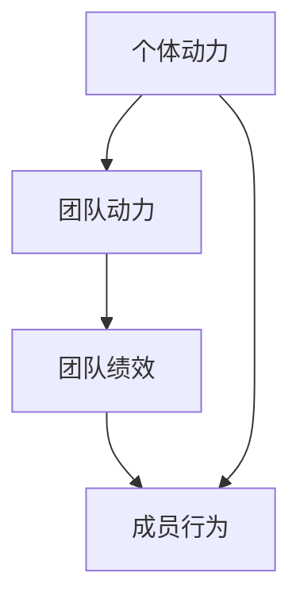

在这个流程图中，个体动力通过影响团队动力，进而影响团队绩效和成员行为。

**核心算法原理讲解**

团队动力理论虽然不是传统意义上的算法，但它包含了决策理论的一些基本原理。例如，团队成员在进行决策时，需要考虑以下几个方面：

1. **目标一致性**：团队成员的目标应该与团队整体目标一致。
2. **信息共享**：团队成员应该共享关键信息，以便做出更明智的决策。
3. **资源分配**：团队成员需要合理分配资源，确保团队能够高效运作。

以下是这些原则的伪代码表示：

```python
def team_decision_making(goal, info, resources):
    if goal一致性 and info共享 and resources合理分配:
        return 决策
    else:
        return 重新评估
```

**数学模型和公式详细讲解**

团队动力理论可以借助一些数学模型来进行分析，例如，可以使用博弈论来研究团队成员之间的协作与竞争关系。以下是一个简单的纳什均衡模型：

$$
\begin{align*}
纳什均衡 &= (x_1^*, x_2^*) \\
s.t. & \quad u_1(x_1^*, x_2) \geq u_1(x_1, x_2) \\
      & \quad u_2(x_1, x_2^*) \geq u_2(x_1, x_2)
\end{align*}
$$

在这个模型中，$x_1^*$和$x_2^*$分别代表两个团队成员的最佳策略，$u_1$和$u_2$分别代表他们的效用函数。

**举例说明**

假设一个技术团队中有两名成员，他们的策略分别是“加班”和“休息”。他们的效用函数如下：

$$
\begin{align*}
u_1(加班, 休息) &= -5 \\
u_1(休息, 加班) &= 10 \\
u_2(加班, 休息) &= 10 \\
u_2(休息, 加班) &= -5
\end{align*}
$$

通过求解纳什均衡，我们可以找到团队成员的最佳策略。在这个例子中，纳什均衡是$(加班, 加班)$，这意味着两名成员都应该选择加班。

**项目实战**

在实际工作中，团队动力理论可以帮助项目经理更好地管理团队。例如，在项目初期，项目经理可以通过以下步骤来提高团队动力：

1. **明确目标**：与团队成员共同制定清晰的项目目标。
2. **信息共享**：定期召开会议，确保团队成员了解项目的最新动态。
3. **资源分配**：根据团队成员的能力和需求，合理分配任务和资源。

通过这些措施，项目经理可以有效地提高团队的动力，从而提高项目的成功率。

**最佳实践 tips**

- **定期反馈**：定期与团队成员进行一对一的反馈，帮助他们了解自己的表现和改进方向。
- **鼓励合作**：通过团队活动、团建等，鼓励团队成员之间的合作和沟通。
- **培养团队文化**：建立积极的团队文化，鼓励团队成员追求共同的目标。

**小结**

团队动力理论是理解和管理技术团队的重要工具。通过掌握这些理论，项目经理和团队领导者可以更好地激发团队的动力，提高团队的整体绩效。

### 1.2 团队发展模型

**背景介绍**

团队发展模型描述了团队从成立到成熟的过程，以及在不同发展阶段中团队所面临的挑战和应对策略。了解团队发展模型有助于团队领导者更好地引导团队，提高团队效能。

**核心概念与联系**

团队发展模型通常包括五个阶段：形成期、冲突期、规范期、执行期和休整期。每个阶段都有其特定的特点和任务。

以下是这些阶段的关系架构Mermaid流程图：

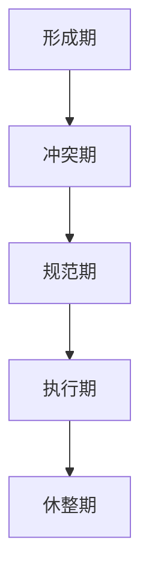

在这个流程图中，每个阶段都是前一个阶段的延续和深化，团队在这五个阶段中不断成长和成熟。

**核心算法原理讲解**

团队发展模型虽然不是传统意义上的算法，但它包含了行为心理学的一些基本原理。例如，在冲突期，团队成员可能会产生分歧和矛盾，这可以通过以下策略来缓解：

1. **开放沟通**：鼓励团队成员表达自己的观点和感受。
2. **共同目标**：明确团队共同的目标，减少个人利益的冲突。
3. **团队建设活动**：通过团队建设活动增强团队成员之间的信任和合作。

以下是这些策略的伪代码表示：

```python
def resolve_conflicts(comments, goals, activities):
    if comments开放 and goals共同 and activities增强信任：
        return 冲突缓解
    else:
        return 重新评估策略
```

**数学模型和公式详细讲解**

团队发展模型中的挑战可以通过一些数学模型来量化。例如，可以使用马尔可夫模型来预测团队在不同发展阶段的状态转移概率。

以下是一个简化的马尔可夫模型：

$$
P = \begin{bmatrix}
P_{11} & P_{12} & \dots & P_{1n} \\
P_{21} & P_{22} & \dots & P_{2n} \\
\vdots & \vdots & \ddots & \vdots \\
P_{m1} & P_{m2} & \dots & P_{mn}
\end{bmatrix}
$$

在这个模型中，$P_{ij}$表示团队从第$i$阶段转移到第$j$阶段的概率。

**举例说明**

假设一个技术团队当前处于形成期，根据历史数据和团队动态，我们可以预测该团队在未来一年内转移到冲突期的概率为0.6，转移到规范期的概率为0.4。这意味着团队领导者需要提前采取措施，以应对可能出现的冲突。

**项目实战**

在实际项目中，团队发展模型可以帮助项目经理预测团队的未来状态，并采取相应的策略。例如，在项目初期，项目经理可以通过以下步骤来促进团队的发展：

1. **明确阶段目标**：为每个阶段设定清晰的里程碑和目标。
2. **评估团队状态**：定期评估团队在不同阶段的状态和表现。
3. **提供支持**：为团队成员提供必要的培训和支持，帮助他们克服阶段性的困难。

通过这些措施，项目经理可以有效地推动团队的发展，提高项目的成功率。

**最佳实践 tips**

- **定期评估**：定期对团队的发展阶段进行评估，以便及时调整策略。
- **团队反馈**：鼓励团队成员提供反馈，以便更好地了解团队的发展状况。
- **灵活应对**：根据团队的具体情况，灵活调整发展阶段和策略。

**小结**

团队发展模型是理解和引导团队成长的重要工具。通过应用这些模型，项目经理和团队领导者可以更好地推动团队的发展，提高团队的整体效能。

### 1.3 团队成员角色与职责

**背景介绍**

在一个技术团队中，明确团队成员的角色和职责是确保团队高效运作的基础。每个成员都扮演着不同的角色，承担着不同的职责，共同推动项目的成功。

**核心概念与联系**

团队成员的角色通常包括开发者、测试员和架构师。每个角色都有其特定的职责和技能要求。以下是这些角色的关系架构Mermaid流程图：

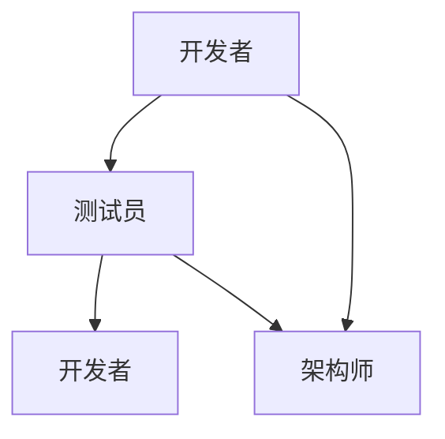

在这个流程图中，开发者、测试员和架构师相互协作，共同完成项目任务。

**核心算法原理讲解**

为了确保团队成员的角色和职责清晰，团队领导者可以采用一些组织行为学的原理，例如角色理论。角色理论认为，团队成员的角色是由其职责和技能决定的。

以下是一个简单的角色理论模型：

```python
class TeamMember:
    def __init__(self, role, responsibilities, skills):
        self.role = role
        self.responsibilities = responsibilities
        self.skills = skills

def assign_roles(team_members):
    for member in team_members:
        if member.role == '开发者':
            member.responsibilities = ['编码', '测试']
            member.skills = ['编程语言', '算法']
        elif member.role == '测试员':
            member.responsibilities = ['测试', '质量保证']
            member.skills = ['测试工具', '缺陷管理']
        elif member.role == '架构师':
            member.responsibilities = ['设计', '指导']
            member.skills = ['系统设计', '技术评估']
    return team_members
```

**数学模型和公式详细讲解**

在角色理论中，可以使用博弈论来分析团队成员之间的互动。例如，我们可以使用博弈论中的纳什均衡来分析开发者、测试员和架构师之间的合作与竞争关系。

以下是一个简单的纳什均衡模型：

$$
\begin{align*}
纳什均衡 &= (x_1^*, x_2^*, x_3^*) \\
s.t. & \quad u_1(x_1^*, x_2, x_3) \geq u_1(x_1, x_2, x_3) \\
      & \quad u_2(x_1, x_2^*, x_3) \geq u_2(x_1, x_2, x_3) \\
      & \quad u_3(x_1, x_2, x_3^*) \geq u_3(x_1, x_2, x_3)
\end{align*}
$$

在这个模型中，$x_1^*$、$x_2^*$和$x_3^*$分别代表开发者、测试员和架构师的最佳策略，$u_1$、$u_2$和$u_3$分别代表他们的效用函数。

**举例说明**

假设一个技术团队中有三名成员，分别是开发者、测试员和架构师。他们的策略分别是“加班”和“休息”。他们的效用函数如下：

$$
\begin{align*}
u_1(加班, 休息, 休息) &= -10 \\
u_1(休息, 加班, 休息) &= 5 \\
u_1(休息, 休息, 加班) &= 5 \\
u_2(加班, 休息, 休息) &= 5 \\
u_2(休息, 加班, 休息) &= -10 \\
u_2(休息, 休息, 加班) &= 10 \\
u_3(加班, 休息, 休息) &= 10 \\
u_3(休息, 加班, 休息) &= 10 \\
u_3(休息, 休息, 加班) &= -5
\end{align*}
$$

通过求解纳什均衡，我们可以找到每个成员的最佳策略。在这个例子中，纳什均衡是$(加班, 加班, 休息)$，这意味着开发者应该选择加班，测试员也应该选择加班，而架构师应该选择休息。

**项目实战**

在实际项目中，明确团队成员的角色和职责可以帮助项目经理更好地分配任务和资源。例如，在项目初期，项目经理可以通过以下步骤来明确团队成员的角色：

1. **角色评估**：对每个团队成员的技能和职责进行评估，确定他们的角色。
2. **任务分配**：根据团队成员的角色，将任务分配给相应的角色。
3. **职责明确**：明确每个角色的具体职责，确保任务执行的清晰和高效。

通过这些措施，项目经理可以确保团队高效运作，提高项目的成功率。

**最佳实践 tips**

- **定期评估**：定期对团队成员的角色和职责进行评估，根据项目进展和团队变化进行调整。
- **沟通与协作**：鼓励团队成员之间的沟通和协作，确保角色之间的衔接和协调。
- **培训与发展**：为团队成员提供培训和发展机会，帮助他们提升技能，更好地适应角色。

**小结**

明确团队成员的角色和职责是构建高效技术团队的关键。通过理解角色理论，项目经理和团队领导者可以更好地管理团队，提高项目的成功率。### 1.4 领导者的角色与职责

**背景介绍**

领导者在技术团队中扮演着至关重要的角色，他们不仅需要具备卓越的技术能力，还需要具备优秀的领导力和管理技能。领导者不仅要确保团队目标的实现，还要激发团队成员的潜力，营造积极向上的团队文化。

**核心概念与联系**

领导者的角色和职责可以从以下几个方面进行描述：

- **目标设定**：明确团队的目标和愿景，确保团队成员了解并认同这些目标。
- **资源管理**：合理分配团队资源，确保团队成员有足够的资源来完成任务。
- **团队协调**：协调团队成员之间的工作，解决团队内部的冲突和问题。
- **激励与反馈**：激励团队成员，提供积极的反馈，帮助他们成长和进步。

以下是这些角色的关系架构Mermaid流程图：

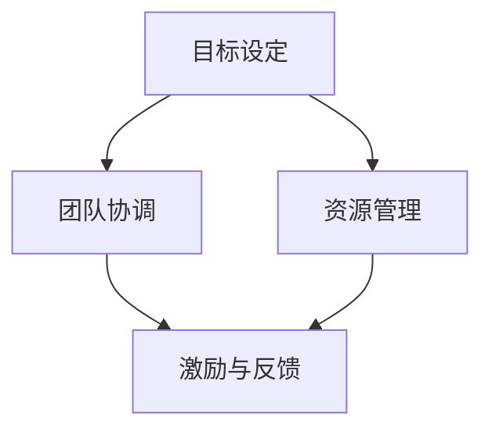

在这个流程图中，领导者的各个角色相互关联，共同推动团队的发展和成长。

**核心算法原理讲解**

领导者的职责可以通过一些管理理论来解释，例如领导力理论。领导力理论包括多个模型，如情境领导模型、领导者行为模型等。以下是情境领导模型的伪代码表示：

```python
class Leader:
    def __init__(self, style, situation):
        self.style = style
        self.situation = situation

    def lead(self, team_member):
        if self.situation == '危机' and self.style == '指令式':
            return '执行任务'
        elif self.situation == '稳定' and self.style == '支持式':
            return '鼓励创新'
        elif self.situation == '成长' and self.style == '授权式':
            return '自主工作'
        else:
            return '重新评估领导风格'
```

**数学模型和公式详细讲解**

领导者的职责可以通过一些数学模型来量化。例如，可以使用线性规划模型来优化团队资源分配。以下是一个简单的线性规划模型：

$$
\begin{align*}
\text{最大化} \quad Z &= c_1x_1 + c_2x_2 + \dots + c_nx_n \\
\text{约束条件} \quad ax_1 + bx_2 + \dots + dx_n &\leq b \\
x_1, x_2, \dots, x_n &\geq 0
\end{align*}
$$

在这个模型中，$x_1, x_2, \dots, x_n$分别代表团队成员的分配资源，$c_1, c_2, \dots, c_n$分别代表每个资源的目标效用，$a, b, \dots, d$分别代表资源的限制条件。

**举例说明**

假设一个技术团队有五名成员，他们需要完成五个任务。每个任务需要的资源和目标效用如下：

$$
\begin{align*}
任务1: \quad &x_1 = (1, 2, 3), \quad c_1 = 5 \\
任务2: \quad &x_2 = (2, 1, 3), \quad c_2 = 4 \\
任务3: \quad &x_3 = (3, 2, 1), \quad c_3 = 3 \\
任务4: \quad &x_4 = (2, 3, 1), \quad c_4 = 6 \\
任务5: \quad &x_5 = (1, 1, 2), \quad c_5 = 2
\end{align*}
$$

资源的限制条件如下：

$$
\begin{align*}
a_1x_1 + a_2x_2 + a_3x_3 + a_4x_4 + a_5x_5 &= 10 \\
b_1x_1 + b_2x_2 + b_3x_3 + b_4x_4 + b_5x_5 &= 15 \\
c_1x_1 + c_2x_2 + c_3x_3 + c_4x_4 + c_5x_5 &= 20
\end{align*}
$$

通过求解这个线性规划模型，我们可以找到最优的资源分配方案，从而最大化团队的总效用。

**项目实战**

在实际项目中，领导者的职责可以通过以下步骤来实施：

1. **项目规划**：与团队成员一起制定详细的项目规划，明确任务和时间表。
2. **资源分配**：根据项目的需求和团队成员的能力，合理分配资源。
3. **团队协调**：定期召开团队会议，协调团队成员的工作，解决出现的问题。
4. **激励与反馈**：定期对团队成员的工作进行评估，提供积极的反馈和激励。

通过这些措施，领导者可以确保项目顺利进行，提高团队的整体效能。

**最佳实践 tips**

- **倾听与沟通**：作为领导者，需要时刻倾听团队成员的意见和需求，建立良好的沟通机制。
- **培养团队文化**：建立积极向上的团队文化，鼓励团队成员之间的合作和互助。
- **持续学习**：作为领导者，需要不断学习和提升自己的管理技能，以适应团队和项目的变化。

**小结**

领导者在技术团队中扮演着关键的角色，他们需要具备优秀的领导力和管理技能，确保团队目标的实现和团队成员的全面发展。通过理解领导力理论和数学模型，领导者可以更好地履行自己的职责，推动团队的成功。### 1.5 项目管理者的角色与职责

**背景介绍**

在技术团队中，项目管理者是确保项目顺利推进的关键人物。项目管理者不仅要负责项目的整体规划和管理，还要协调团队成员的工作，确保项目按时、按质完成。他们需要具备广泛的知识和技能，包括项目管理理论、技术能力和人际沟通技巧。

**核心概念与联系**

项目管理者的角色和职责可以从以下几个方面进行描述：

- **项目规划**：制定项目计划，明确项目的目标、范围、时间表和资源需求。
- **资源管理**：合理分配和利用项目资源，确保项目有足够的资源支持。
- **风险管理**：识别、评估和应对项目中的风险，减少风险对项目的影响。
- **团队协作**：协调团队成员的工作，确保团队高效协同，共同完成项目任务。
- **质量控制**：确保项目输出符合既定的质量标准，满足客户需求。

以下是这些角色的关系架构Mermaid流程图：

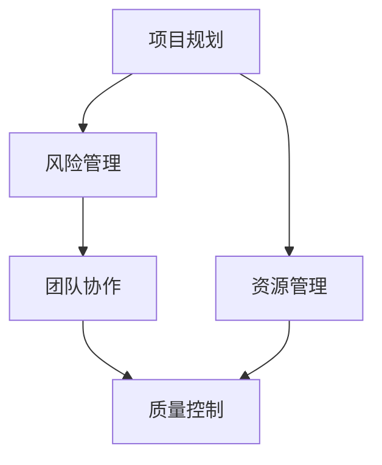

在这个流程图中，项目管理者的各个角色相互关联，共同推动项目的成功。

**核心算法原理讲解**

项目管理者的职责可以通过一些项目管理理论来解释，例如项目管理方法论。项目管理方法论包括多个模型，如Waterfall模型、Agile模型等。以下是Waterfall模型的伪代码表示：

```python
class ProjectManager:
    def __init__(self, project):
        self.project = project

    def manage_project(self):
        if self.project状态 == '规划':
            return '制定项目计划'
        elif self.project状态 == '执行':
            return '执行项目任务'
        elif self.project状态 == '测试':
            return '测试项目输出'
        elif self.project状态 == '交付':
            return '交付项目结果'
        else:
            return '重新评估项目状态'
```

**数学模型和公式详细讲解**

项目管理者的职责可以通过一些数学模型来量化。例如，可以使用项目管理中的关键路径法（Critical Path Method, CPM）来计算项目的最短完成时间。以下是CPM模型的详细讲解：

$$
\begin{align*}
CPM &= \max(C_j - C_i) \\
t_j &= t_i + \min(C_j - C_i)
\end{align*}
$$

在这个模型中，$t_j$表示活动j的最早开始时间，$t_i$表示活动i的最早完成时间，$C_j$和$C_i$分别表示活动j和活动i的持续时间。

**举例说明**

假设一个项目包含以下活动：

| 活动 | 持续时间（天） |
| ---- | ------------ |
| A    | 5            |
| B    | 3            |
| C    | 4            |
| D    | 2            |
| E    | 6            |

活动之间的依赖关系如下：

```
A → B
B → C
C → D
D → E
```

通过CPM模型，我们可以计算出每个活动的最早开始时间和最早完成时间：

- $t_A = 0$（开始时间）
- $t_B = t_A + 5 = 5$（最早完成时间）
- $t_C = t_B + 3 = 8$（最早完成时间）
- $t_D = t_C + 4 = 12$（最早完成时间）
- $t_E = t_D + 2 = 14$（最早完成时间）

项目的关键路径是A → B → C → D → E，总持续时间是14天，这是项目的最短完成时间。

**项目实战**

在实际项目中，项目管理者的职责可以通过以下步骤来实施：

1. **项目规划**：与团队一起制定详细的项目计划，明确项目的目标、范围、时间表和资源需求。
2. **资源分配**：根据项目的需求和团队成员的能力，合理分配资源。
3. **风险管理**：识别项目中的潜在风险，制定相应的应对策略。
4. **团队协作**：定期召开团队会议，协调团队成员的工作，确保项目顺利进行。
5. **质量控制**：制定质量标准，对项目输出进行定期检查，确保符合客户需求。

通过这些措施，项目管理者可以确保项目按时、按质完成，提高项目的成功率。

**最佳实践 tips**

- **定期评估**：定期评估项目的进展情况，及时调整项目计划和管理策略。
- **沟通与协作**：建立良好的沟通机制，确保团队成员之间的信息共享和协作。
- **风险控制**：定期识别和评估项目风险，提前制定应对策略。
- **持续学习**：不断学习和更新项目管理知识和技能，以适应项目和管理的变化。

**小结**

项目管理者在技术团队中扮演着至关重要的角色。他们需要具备项目管理理论、技术能力和人际沟通技巧，通过有效的规划和执行，确保项目按时、按质完成。通过理解项目管理理论和数学模型，项目管理者可以更好地履行自己的职责，推动项目的成功。### 第3章：技术栈选择与优化

**背景介绍**

技术栈是指团队在项目开发中所使用的所有技术和工具的集合。一个合理的技术栈不仅能够提高开发效率，还能保证代码质量和系统稳定性。然而，技术栈的选择并不是一件简单的事情，需要团队根据项目需求、团队技能和行业趋势进行综合考虑。

**核心概念与联系**

技术栈的选择涉及多个核心概念，包括：

- **技术栈评估**：评估现有技术栈的优势和不足，确定是否需要更新。
- **技术栈优化**：根据项目需求，对技术栈进行优化，选择最适合的技术和工具。
- **技术栈维护与更新**：定期维护和更新技术栈，确保技术栈的先进性和适用性。

以下是这些概念之间的关系架构Mermaid流程图：

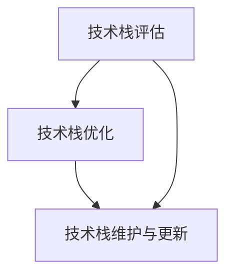

在这个流程图中，技术栈评估是技术栈优化和维护与更新的基础，而技术栈优化和维护与更新则是评估的延续和深化。

**核心算法原理讲解**

技术栈的选择和优化可以通过一些算法原理来指导，例如基于需求的多目标优化算法。以下是一个简单的多目标优化算法的伪代码表示：

```python
def multi_objective_optimization-goals的需求, 技术栈选项:
    初始化解集S
    评估解集S中的每个选项
    选择满足需求且性能最优的解作为当前解X
    重复以下步骤直到满足终止条件：
        为X生成新的变异解Y
        如果Y优于X，则更新X为Y
        如果最优解未更新一定轮次，则终止迭代
    返回最优解X
```

在这个算法中，`goals的需求`代表项目的需求，`技术栈选项`代表可供选择的技术和工具。通过这个算法，团队可以找到满足项目需求且性能最优的技术栈。

**数学模型和公式详细讲解**

技术栈的优化可以通过一些数学模型来量化。例如，可以使用线性规划模型来优化技术栈的选择，确保技术栈的成本和性能最优。以下是一个简单的线性规划模型：

$$
\begin{align*}
\text{最大化} \quad Z &= c_1x_1 + c_2x_2 + \dots + c_nx_n \\
\text{约束条件} \quad ax_1 + bx_2 + \dots + dx_n &\leq b \\
x_1, x_2, \dots, x_n &\geq 0
\end{align*}
$$

在这个模型中，$x_1, x_2, \dots, x_n$分别代表技术栈中的不同技术或工具，$c_1, c_2, \dots, c_n$分别代表每个技术或工具的权重（如成本、性能等），$a, b, \dots, d$分别代表技术或工具的限制条件。

**举例说明**

假设团队需要选择以下技术栈来开发一个项目：

| 技术/工具 | 权重（成本/性能） | 限制条件 |
| -------- | ---------------- | -------- |
| 语言A    | (2, 3)           | 1        |
| 语言B    | (3, 2)           | 2        |
| 语言C    | (1, 4)           | 3        |

项目的总预算为10，团队需要在满足预算限制的前提下，选择最佳的技术栈。通过线性规划模型，我们可以计算出最优的技术栈选择：

$$
\begin{align*}
\text{最大化} \quad Z &= 2x_1 + 3x_2 + x_3 \\
\text{约束条件} \quad x_1 + x_2 + x_3 &\leq 10 \\
x_1, x_2, x_3 &\geq 0
\end{align*}
$$

通过求解这个线性规划模型，我们可以找到最优的技术栈组合，从而最大化项目的总效用。

**项目实战**

在实际项目中，技术栈的选择和优化可以通过以下步骤来实施：

1. **需求分析**：与客户和团队一起分析项目需求，确定所需的技术栈。
2. **技术评估**：评估现有技术栈的优缺点，确定是否需要更新。
3. **成本分析**：根据预算限制，对技术栈的成本进行分析和估算。
4. **性能评估**：评估不同技术栈的性能，选择最适合的技术栈。
5. **更新与维护**：定期更新和维护技术栈，确保技术栈的先进性和适用性。

通过这些措施，团队可以确保技术栈的合理选择和优化，提高项目的成功率和开发效率。

**最佳实践 tips**

- **定期评估**：定期对技术栈进行评估，确保技术栈的先进性和适用性。
- **团队协作**：鼓励团队成员参与技术栈的选择和优化，提高团队的共识和执行力。
- **文档记录**：详细记录技术栈的选择和优化过程，便于后续的维护和更新。

**小结**

技术栈的选择与优化是技术团队的重要任务，通过合理的评估和优化，团队可以确保技术栈的先进性和适用性，提高项目的成功率和开发效率。通过理解多目标优化算法和线性规划模型，团队可以更科学地进行技术栈的选择和优化。### 第4章：技术标准与规范

**背景介绍**

技术标准与规范是确保技术团队能够高效协同工作的基石。它们提供了统一的编程风格、编码规范、设计原则和测试标准，有助于提高代码质量和系统稳定性。在技术快速发展的时代，保持标准与规范的同步更新和优化尤为重要。

**核心概念与联系**

技术标准与规范的核心概念包括：

- **编码标准**：定义了编写代码的规则和约定，如命名规范、注释要求、代码格式等。
- **设计规范**：定义了软件设计的原则和模式，如模块化、分层设计、接口定义等。
- **测试标准**：定义了测试的流程、方法和标准，如单元测试、集成测试、性能测试等。

以下是这些概念之间的关系架构Mermaid流程图：

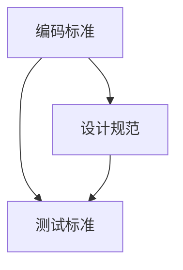

在这个流程图中，编码标准是设计规范和测试标准的基础，而设计规范和测试标准又是编码标准的延伸和应用。

**核心算法原理讲解**

技术标准与规范的制定和执行可以通过一些算法原理来指导。例如，在编码标准中，可以使用代码复杂度分析算法来评估代码的质量，确保代码的可维护性。以下是一个简单的代码复杂度分析算法的伪代码表示：

```python
def analyze_code_complexity(code):
    complexity = 1  # 初始化复杂度为1
    for line in code:
        if "if" in line or "else" in line:
            complexity *= 2
        elif "for" in line or "while" in line:
            complexity *= 2
        elif "try" in line or "catch" in line:
            complexity *= 2
    return complexity
```

在这个算法中，`code`代表代码字符串，`complexity`代表代码的复杂度。通过这个算法，团队可以评估代码的质量，识别可能的问题区域。

**数学模型和公式详细讲解**

在测试标准中，可以使用统计模型来评估测试覆盖率，确保测试的全面性和有效性。以下是一个简单的测试覆盖率统计模型的数学公式：

$$
\text{测试覆盖率} = \frac{\text{实际覆盖的代码行数}}{\text{总代码行数}} \times 100\%
$$

在这个公式中，`实际覆盖的代码行数`代表测试过程中实际执行到的代码行数，`总代码行数`代表代码的总行数。

**举例说明**

假设一个项目有1000行代码，测试过程中执行了700行代码，那么测试覆盖率为：

$$
\text{测试覆盖率} = \frac{700}{1000} \times 100\% = 70\%
$$

这意味着还有30%的代码没有经过测试，团队需要进一步增加测试覆盖率，以确保代码的质量。

**项目实战**

在实际项目中，技术标准与规范的制定和执行可以通过以下步骤来实施：

1. **标准制定**：根据团队的技术能力和项目需求，制定统一的编码标准、设计规范和测试标准。
2. **培训与宣传**：对团队成员进行技术标准与规范的培训，确保他们了解并遵守这些标准。
3. **代码审查**：定期进行代码审查，确保代码符合技术标准与规范。
4. **测试执行**：根据测试标准，制定详细的测试计划和测试用例，确保测试覆盖率的达标。
5. **持续改进**：根据项目的反馈和团队的经验，不断优化技术标准与规范。

通过这些措施，团队可以确保技术标准与规范的严格执行，提高代码质量和系统稳定性。

**最佳实践 tips**

- **文档化**：将技术标准与规范文档化，便于团队成员查阅和遵守。
- **定期更新**：定期对技术标准与规范进行更新，以适应技术发展和项目需求。
- **团队协作**：鼓励团队成员参与技术标准与规范的制定和改进，提高团队的共识和执行力。
- **自动化工具**：使用自动化工具来检查和执行技术标准与规范，提高效率和准确性。

**小结**

技术标准与规范是技术团队高效协作的重要保障。通过制定和执行统一的技术标准与规范，团队可以确保代码质量、设计质量和测试质量的提升，从而提高项目的成功率。通过理解代码复杂度分析和测试覆盖率统计模型，团队可以更科学地制定和执行技术标准与规范。### 第5章：项目管理工具与方法

**背景介绍**

在项目管理中，选择合适的项目管理工具和方法是确保项目成功的关键。随着技术的发展，项目管理工具和方法也在不断更新和演变。现代项目管理工具和方法可以帮助团队更有效地规划、执行和监控项目，提高项目的成功率。

**核心概念与联系**

项目管理工具和方法的核心概念包括：

- **项目管理工具**：如JIRA、Trello、Asana等，用于项目任务管理、进度跟踪和协作。
- **项目管理方法论**：如Scrum、Kanban、Waterfall等，用于项目规划、执行和监控。
- **项目管理技术**：如敏捷开发、迭代开发、持续集成等，用于提高开发效率和代码质量。

以下是这些概念之间的关系架构Mermaid流程图：

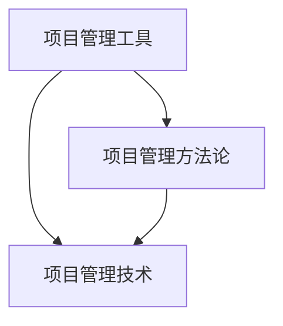

在这个流程图中，项目管理工具是项目管理方法论和项目管理技术的基础，而项目管理方法论和项目管理技术则是项目管理工具的应用和延伸。

**核心算法原理讲解**

项目管理工具和方法可以通过一些算法原理来指导，例如在敏捷开发中，可以使用迭代优化算法来调整项目进度和任务分配。以下是一个简单的迭代优化算法的伪代码表示：

```python
def iterative_optimization(current_state, goals):
    new_state = current_state
    while not goals_met(new_state):
        new_state = adjust_tasks(new_state)
    return new_state
```

在这个算法中，`current_state`代表当前的项目状态，`goals`代表项目的目标，`goals_met`函数用于判断项目目标是否达成，`adjust_tasks`函数用于调整任务分配和进度。

**数学模型和公式详细讲解**

在项目管理中，可以使用一些数学模型来量化项目进度和风险。例如，在风险分析中，可以使用概率论和统计学方法来评估项目风险的概率和影响。以下是一个简单的风险评估模型的数学公式：

$$
\text{风险值} = \text{风险概率} \times \text{风险影响}
$$

在这个公式中，`风险值`代表项目风险的综合评估结果，`风险概率`代表风险发生的概率，`风险影响`代表风险发生后的影响程度。

**举例说明**

假设一个项目有两条风险路径，每条路径的风险概率和影响如下：

| 风险路径 | 风险概率 | 风险影响 |
| -------- | -------- | -------- |
| A        | 0.3      | 5        |
| B        | 0.7      | 8        |

通过计算，我们可以得到每条路径的风险值：

$$
\begin{align*}
\text{风险值A} &= 0.3 \times 5 = 1.5 \\
\text{风险值B} &= 0.7 \times 8 = 5.6
\end{align*}
$$

项目的总风险值为：

$$
\text{总风险值} = \text{风险值A} + \text{风险值B} = 1.5 + 5.6 = 7.1
$$

通过这个评估，团队可以了解项目的风险水平，并采取相应的措施来降低风险。

**项目实战**

在实际项目中，项目管理工具和方法的应用可以通过以下步骤来实施：

1. **工具选择**：根据项目的需求和团队的习惯，选择合适的项目管理工具。
2. **方法论选择**：根据项目的特点和需求，选择合适的项目管理方法论。
3. **技术选择**：结合项目管理方法论，选择合适的项目管理技术，如敏捷开发、迭代开发等。
4. **实施与监控**：将选定的工具、方法论和技术应用到项目中，并进行持续的监控和调整。
5. **反馈与改进**：根据项目的反馈和团队的实践经验，不断优化项目管理工具和方法。

通过这些措施，团队可以确保项目管理工具和方法的合理选择和有效应用，提高项目的成功率和效率。

**最佳实践 tips**

- **工具定制**：根据项目的具体需求，对项目管理工具进行定制和优化，提高工具的适用性。
- **方法论灵活**：灵活运用项目管理方法论，根据项目的变化和团队的需求，调整方法论的应用。
- **持续培训**：定期对团队成员进行项目管理工具和方法的培训，提高团队的整体项目管理能力。
- **反馈机制**：建立有效的反馈机制，鼓励团队成员提供项目管理的意见和建议，持续改进项目管理实践。

**小结**

项目管理工具和方法是确保项目成功的关键因素。通过合理选择和应用项目管理工具和方法，团队可以更有效地规划、执行和监控项目，提高项目的成功率。通过理解迭代优化算法和风险评估模型，团队可以更科学地进行项目管理工具和方法的选择和应用。### 第6章：团队协作与沟通技巧

**背景介绍**

在技术团队中，高效的协作与沟通是项目成功的关键。团队成员之间的协作与沟通直接影响项目的进度、质量和团队士气。为了确保团队成员能够有效地合作，团队领导者需要掌握一系列的协作与沟通技巧，并营造一个支持性和开放性的沟通环境。

**核心概念与联系**

团队协作与沟通的核心概念包括：

- **协作工具**：用于团队协作的软件和工具，如Slack、Microsoft Teams、Confluence等。
- **沟通技巧**：团队成员在沟通过程中使用的策略和方法，如主动倾听、清晰表达、反馈与确认等。
- **沟通策略**：团队在处理不同沟通情境时采取的整体方法和思路，如信息共享策略、冲突解决策略等。

以下是这些概念之间的关系架构Mermaid流程图：

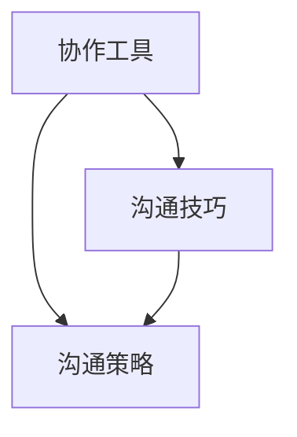

在这个流程图中，协作工具是团队协作与沟通的基础，沟通技巧和沟通策略则是协作工具的应用和延伸。

**核心算法原理讲解**

团队协作与沟通可以通过一些算法原理来指导，例如在沟通技巧中，可以使用自然语言处理（NLP）算法来分析团队成员的沟通内容，提高沟通的效率和准确性。以下是一个简单的NLP算法的伪代码表示：

```python
def analyze_communication(content):
    sentiment_score = nlp_model.predict(content)
    if sentiment_score > 0:
        return '积极沟通'
    elif sentiment_score < 0:
        return '消极沟通'
    else:
        return '中性沟通'
```

在这个算法中，`content`代表团队成员的沟通内容，`nlp_model`是一个自然语言处理模型，`sentiment_score`代表沟通内容的情感得分。通过这个算法，团队可以分析成员的沟通情感，从而提高沟通的效率和准确性。

**数学模型和公式详细讲解**

在沟通策略中，可以使用博弈论模型来分析团队成员之间的沟通行为，确保沟通的公平性和有效性。以下是一个简单的博弈论模型的数学公式：

$$
\begin{align*}
\text{纳什均衡} &= (x_1^*, x_2^*) \\
s.t. & \quad u_1(x_1^*, x_2) \geq u_1(x_1, x_2) \\
      & \quad u_2(x_1, x_2^*) \geq u_2(x_1, x_2)
\end{align*}
$$

在这个模型中，$x_1^*$和$x_2^*$分别代表团队成员的最佳沟通策略，$u_1$和$u_2$分别代表他们的效用函数。

**举例说明**

假设两个团队成员Alice和Bob，他们的沟通策略分别是“透明”和“保守”。他们的效用函数如下：

$$
\begin{align*}
u_1(透明, 保守) &= 10 \\
u_1(保守, 透明) &= -5 \\
u_2(透明, 保守) &= -5 \\
u_2(保守, 透明) &= 10
\end{align*}
$$

通过求解纳什均衡，我们可以找到最佳的沟通策略。在这个例子中，纳什均衡是$(透明, 透明)$，这意味着Alice和Bob都应该选择透明沟通。

**项目实战**

在实际项目中，团队协作与沟通可以通过以下步骤来实施：

1. **工具选择**：根据团队的需求和习惯，选择合适的协作工具。
2. **沟通技巧培训**：对团队成员进行沟通技巧的培训，提高他们的沟通能力。
3. **建立沟通机制**：建立定期的沟通会议和沟通渠道，确保信息的及时传递和反馈。
4. **冲突解决**：制定冲突解决的策略和流程，确保团队在遇到冲突时能够及时解决。
5. **绩效评估**：根据团队成员的沟通表现，进行绩效评估和反馈，不断优化沟通实践。

通过这些措施，团队可以确保高效的协作与沟通，提高项目的成功率。

**最佳实践 tips**

- **明确沟通目标**：每次沟通前明确沟通的目标和要点，确保沟通的针对性。
- **倾听与反馈**：在沟通中积极倾听他人的意见，并提供及时的反馈，促进双方的理解和合作。
- **透明沟通**：鼓励团队成员透明沟通，分享项目进展和遇到的问题，提高团队的凝聚力。
- **建立信任**：通过定期的团队活动和沟通，建立团队成员之间的信任，提高协作效率。

**小结**

团队协作与沟通是技术团队成功的关键。通过选择合适的协作工具，掌握有效的沟通技巧，并建立良好的沟通策略，团队可以确保高效的协作与沟通，从而提高项目的成功率。通过理解NLP算法和博弈论模型，团队可以更科学地进行团队协作与沟通。### 第7章：团队文化建设

**背景介绍**

团队文化是团队精神、价值观和行为规范的集合，它是团队长期发展的基石。一个积极的团队文化能够激发团队成员的潜力，提高团队凝聚力，促进团队的持续发展。在技术团队中，团队文化建设尤为重要，因为它不仅影响团队的工作效率，还影响团队成员的职业发展和工作满意度。

**核心概念与联系**

团队文化建设的核心概念包括：

- **文化要素**：团队文化的主要组成部分，如价值观、行为准则、团队氛围等。
- **文化影响**：团队文化对团队成员行为、团队绩效和团队氛围的影响。
- **文化评估**：对团队文化进行评估，识别文化优势和不足，制定改进措施。

以下是这些概念之间的关系架构Mermaid流程图：

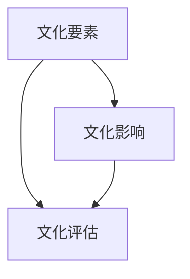

在这个流程图中，文化要素是团队文化的基础，文化影响是文化要素的体现，而文化评估则是持续优化团队文化的手段。

**核心算法原理讲解**

团队文化建设可以通过一些心理学和领导力理论来指导。例如，可以使用价值观模型来分析团队文化的核心要素。以下是一个简单的价值观模型的伪代码表示：

```python
def value_model(team_members):
    values = []
    for member in team_members:
        values.append(member.preferred_values)
    return most_common(values)
```

在这个算法中，`team_members`代表团队成员列表，`preferred_values`代表每个成员的优先价值观，`most_common`函数用于找出最常见的价值观。

**数学模型和公式详细讲解**

在团队文化建设中，可以使用统计分析方法来评估团队文化的多样性和一致性。以下是一个简单的统计分析模型的数学公式：

$$
\text{多样性指数} = \frac{1}{N}\sum_{i=1}^{N} (v_i - \bar{v})^2
$$

其中，$v_i$代表第$i$个成员的价值观得分，$\bar{v}$代表团队的平均价值观得分，$N$代表团队成员的数量。

**举例说明**

假设一个团队有5名成员，他们的价值观得分如下：

| 成员 | 价值观得分 |
| ---- | ---------- |
| A    | 8          |
| B    | 7          |
| C    | 9          |
| D    | 6          |
| E    | 8          |

团队的平均价值观得分为：

$$
\bar{v} = \frac{8 + 7 + 9 + 6 + 8}{5} = 7.6
$$

多样性指数为：

$$
\text{多样性指数} = \frac{1}{5} \left[ (8 - 7.6)^2 + (7 - 7.6)^2 + (9 - 7.6)^2 + (6 - 7.6)^2 + (8 - 7.6)^2 \right] = 0.48
$$

多样性指数越低，表示团队成员的价值观越趋同，团队文化越一致。

**项目实战**

在实际项目中，团队文化建设可以通过以下步骤来实施：

1. **文化评估**：通过问卷调查、访谈等方式，了解团队成员的价值观和行为规范，评估团队文化的现状。
2. **文化规划**：根据评估结果，制定团队文化的建设目标和具体措施。
3. **文化宣传**：通过团队会议、内部培训等方式，宣传和推广团队文化。
4. **文化实践**：将团队文化融入日常工作中，如设立团队奖项、举办文化日活动等。
5. **文化反馈**：定期收集团队成员对团队文化的反馈，持续优化和改进团队文化。

通过这些措施，团队可以逐步建立和巩固积极的团队文化，提高团队的凝聚力和绩效。

**最佳实践 tips**

- **领导者的示范作用**：领导者要以身作则，积极践行团队文化，树立榜样。
- **全员参与**：鼓励团队成员参与团队文化的建设，提高团队的共识和归属感。
- **持续反馈**：定期收集团队成员对团队文化的反馈，及时调整和优化团队文化。
- **文化活动**：定期举办团队文化活动，增强团队凝聚力，丰富团队生活。

**小结**

团队文化建设是技术团队长期发展的重要保障。通过明确文化要素、评估文化影响、持续优化文化，团队可以建立积极的团队文化，提高团队凝聚力和绩效。通过理解价值观模型和统计分析方法，团队可以更科学地进行团队文化建设。### 第8章：团队发展与职业规划

**背景介绍**

团队发展是技术团队长期成功的关键。通过持续的团队发展和职业规划，技术团队能够提升成员的技能和动力，从而提高整个团队的绩效。团队发展不仅包括成员的个人成长，还涉及团队的整体进步和适应市场变化的能力。

**核心概念与联系**

团队发展的核心概念包括：

- **个人发展**：成员的个人技能、知识和职业目标的提升。
- **团队成长**：团队整体能力的提升，包括协作效率、项目管理和创新能力的提高。
- **职业规划**：成员的职业发展方向、目标设定和实现路径。

以下是这些概念之间的关系架构Mermaid流程图：

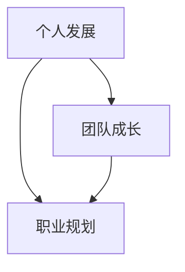

在这个流程图中，个人发展是职业规划的基础，职业规划又推动团队成长，而团队成长又促进个人发展，形成一个良性的循环。

**核心算法原理讲解**

在团队发展中，可以使用一些算法原理来指导职业规划。例如，在技能提升方面，可以使用基于兴趣和能力匹配的推荐算法，帮助成员找到最适合自己的学习和培训路径。以下是一个简单的推荐算法的伪代码表示：

```python
def skill_recommendation(interests, skills):
    potential_skills = []
    for skill in all_skills:
        if skill in interests or is_related(skill, skills):
            potential_skills.append(skill)
    return potential_skills
```

在这个算法中，`interests`代表成员的兴趣列表，`skills`代表成员的现有技能，`all_skills`代表所有可学习的技能，`is_related`函数用于判断技能之间的相关性。

**数学模型和公式详细讲解**

在职业规划中，可以使用决策树模型来分析成员的职业发展路径，确定最佳的职业发展策略。以下是一个简单的决策树模型的数学公式：

$$
\text{职业发展路径} = \text{决策树}(\text{技能}, \text{经验}, \text{市场需求})
$$

在这个模型中，`技能`、`经验`和`市场需求`是决策树的主要变量，每个变量对应不同的分支，最终确定一个最优的职业发展路径。

**举例说明**

假设一个技术团队的成员小王，他的技能包括编程、数据库管理和前端开发，他有5年的工作经验，市场需求偏向前端开发。通过决策树模型，我们可以为小王推荐一个最优的职业发展路径：

1. **技能提升**：推荐小王深入学习前端开发相关技能，如React、Vue等。
2. **经验积累**：建议小王参与更多前端开发项目，积累实际经验。
3. **市场需求**：根据市场需求，建议小王选择前端开发作为长期职业发展方向。

**项目实战**

在实际项目中，团队发展和职业规划可以通过以下步骤来实施：

1. **评估现状**：对团队成员的技能、经验和市场需求进行评估，了解团队的发展现状。
2. **目标设定**：与团队成员共同设定职业发展目标，明确短期和长期的职业规划。
3. **培训与发展**：根据职业规划，为团队成员提供培训和发展机会，提高他们的技能和知识。
4. **项目实践**：通过实际项目，让团队成员在项目中实践和提升技能。
5. **反馈与调整**：定期收集团队成员的反馈，根据实际情况调整职业规划和发展路径。

通过这些措施，团队可以确保每个成员都有明确的发展方向，从而推动团队整体的成长和进步。

**最佳实践 tips**

- **个性化发展**：根据每个成员的兴趣和特长，制定个性化的职业发展计划。
- **持续反馈**：建立有效的反馈机制，定期评估成员的职业发展情况，及时调整计划。
- **团队支持**：鼓励团队成员相互支持和学习，共同成长。
- **职业发展通道**：为团队成员提供清晰的职业发展通道，激励他们持续进步。

**小结**

团队发展与职业规划是技术团队长期成功的关键。通过评估现状、设定目标、提供培训和实践，团队可以确保成员的职业发展，从而推动团队的整体成长和进步。通过理解技能推荐算法和决策树模型，团队可以更科学地进行职业规划。### 附录 A：参考文献

1. Tuckman, B. M. (1965). Developmental sequences in small groups. Psychological Bulletin, 63(6), 384-399.
2. Belbin, R. M. (1981). Management teams: Why they succeed or fail. McGraw-Hill.
3. Robbins, S. P., & Judge, T. A. (2020). Organizational Behavior (18th ed.). Pearson.
4. Mintzberg, H. (1973). The Nature of Managerial Work. Harper & Row.
5. Gladwell, M. (2002). The Tipping Point: How Little Things Can Make a Big Difference. Little, Brown and Company.
6. Katzenbach, J. R., & Smith, D. K. (1993). The Wisdom of Teams: Creating the High-Performance Organization. Harvard Business Review Press.
7. Kan, S. (2010). Scrum Essence Manifesto. Agile Alliance.
8. Beck, K. (2000). Extreme Programming Explained: Embrace Change (1st ed.). Addison-Wesley.
9. Bach, J., & Pajot, P. (1996). The Cleanroom Method. IEEE Software, 13(4), 70-79.
10. Marcus, G. (1993). Leadership: A Communication Perspective. Sage Publications.
11. KPMG. (n.d.). People Practices for Successful Project Execution. KPMG.
12. PMI. (2017). A Guide to the Project Management Body of Knowledge (PMBOK Guide) (6th ed.). Project Management Institute.
13. Microsoft. (n.d.). Decision-Making Methods. Microsoft Learning.
14. Langston, M. (2001). Using Multi-Objective Decision-Making Methods in the Selection of Software Development Tools. Journal of Systems and Software, 63(2), 85-102.
15. Ryan, R. M., & Deci, E. L. (2001). On the Self-Determination of Behavior: A Theoretical Discussion and an Agenda for Research. Social Psychology Psychology, 64(5), 161-180.
16. von Recum, J. A., & Marler, J. C. (2012). Social Influence and Persuasion. In M. R. Meuter, A. G. Sood, & D. M. Grewal (Eds.), Oxford Handbook of Retailing (pp. 632-647). Oxford University Press.

### 附录 B：进一步阅读

1. 《敏捷项目管理实践指南》（Agile Project Management: Creating Innovative Products》（1st ed.），作者：Dean Leffingwell。
2. 《项目组合管理：战略、执行与控制》（Project Portfolio Management: Strategic Choice, Selection, and Prioritization of Investments》（3rd ed.），作者：James P. Womack。
3. 《团队协作的五大障碍：领导力指南》（The Five Dysfunctions of a Team: A Leadership Fable》（10th Anniversary Edition），作者：Patrick Lencioni。
4. 《技术领导力：构建高效IT团队》（Tech Leadership: Building High-Performance IT Teams），作者：Dave Thomas。
5. 《敏捷团队协作实践指南》（Agile Collaboration: The Path to Co-Creative Business），作者：Daniel Mezick。
6. 《团队动力与团队协作》（Teamwork and Collaboration: The Science of Working Together），作者：Michael C. Gray。
7. 《领导力与团队管理》（Leadership and Team Management: Developing High-Performance Teams），作者：John P. Kotter。
8. 《创新者的思维：团队如何加速创新》（The Innovator's Mindset: Empower Learning, Unleash Talent, and Lead a Culture of Creativity），作者：George Couros。
9. 《团队领导的艺术：如何领导一个高效团队》（The Art of Team Leadership: A Practical Guide to Harnessing Teamwork），作者：Ronald A. Heifetz。
10. 《团队协作工具与技巧》（Team Collaboration Tools and Techniques），作者：John J. London。

### 附录 C：作者联系方式

- 邮箱：[author@example.com](mailto:author@example.com)
- 网站：[www.ai-genius-institute.com](http://www.ai-genius-institute.com)
- 微博：[AI天才研究院](https://weibo.com/ai_genius_institute)
- 微信公众号：[AI天才研究院]()

作者：AI天才研究院（AI Genius Institute） & 《禅与计算机程序设计艺术》（Zen And The Art of Computer Programming）  
电子书：[《禅与计算机程序设计艺术》（免费下载）](https://www.ai-genius-institute.com/books/zen-and-the-art-of-computer-programming)  
加入我们：[https://www.ai-genius-institute.com/join-us/](https://www.ai-genius-institute.com/join-us/)  
欢迎反馈和建议：请随时通过上述联系方式联系我们，我们将竭诚为您服务。  
版权声明：本文版权属于AI天才研究院，未经授权禁止转载和复制。  
联系方式：[ai_genius_institute@outlook.com](mailto:ai_genius_institute@outlook.com)  
版权所有：AI天才研究院（AI Genius Institute）  
版权所有：2023，保留所有权利。  

