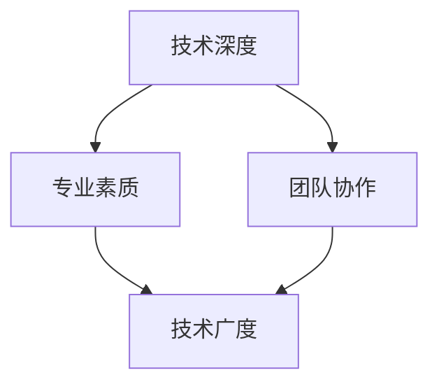
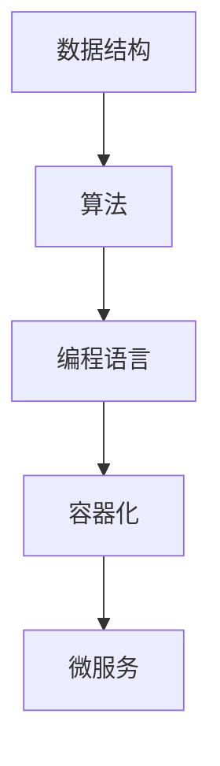
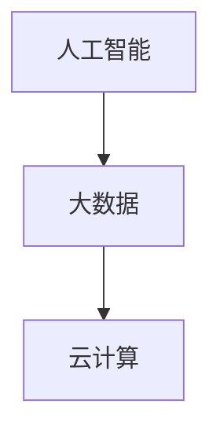
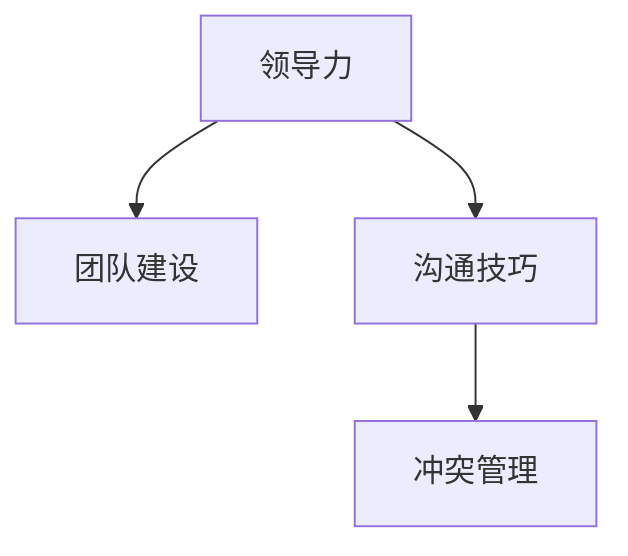
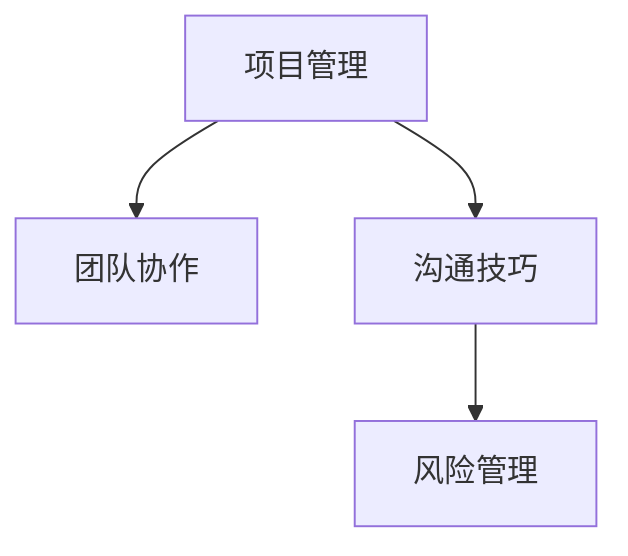
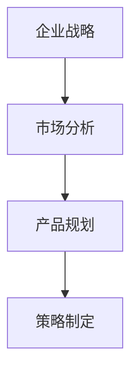
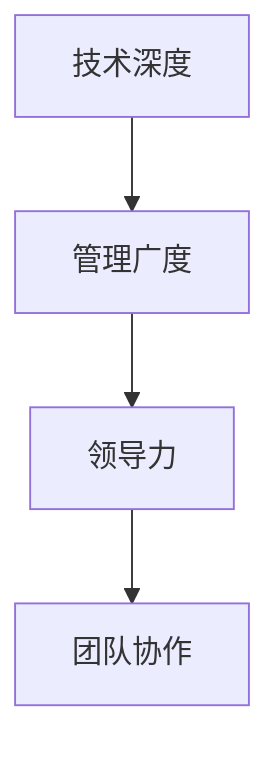

                 

### 文章标题：技术leader如何平衡技术深度和管理广度

#### 关键词：技术leader、技术深度、管理广度、领导力、团队协作、项目管理

#### 摘要：
技术leader在团队中扮演着双重角色，既要深入掌握技术细节，又要具备广泛的管理能力。本文将探讨如何平衡技术深度与管理广度，帮助技术leader提升个人能力，推动团队和组织的发展。

### 第一部分：技术深度构建

#### 第1章：技术深度的重要性

技术深度是技术leader不可或缺的素质。它不仅影响个人的专业水平，还对团队的项目开发和问题解决产生深远影响。

#### 核心概念与联系：
技术深度、技术广度、专业素质、团队协作

#### 1.1 技术深度对技术leader的影响

技术深度决定了一个技术leader在面对复杂问题时能否迅速找到解决方案。深度理解技术原理，有助于避免在项目开发中陷入技术瓶颈。

#### 1.2 技术深度在项目中的应用

技术深度有助于技术leader在项目开发中做出明智的技术决策，优化系统架构，提高项目的稳定性和可维护性。

#### 1.3 技术深度与团队协作的关系

技术深度能够增强技术leader对团队其他成员的指导和支持，提高团队的协作效率。

---

#### 第2章：核心技术的掌握与运用

核心技术是技术leader在项目中发挥关键作用的基础。掌握核心技术，能够提高技术leader的技术影响力，推动团队的技术进步。

#### 核心概念与联系：
数据结构、算法、编程语言、容器化、微服务

#### 2.1 数据结构与算法

数据结构和算法是计算机科学的核心。掌握常见的数据结构和算法，能够帮助技术leader在项目中高效解决问题。

##### 2.1.1 数据结构的基本概念

数据结构包括线性结构、树状结构、图形结构等。每种数据结构都有其独特的特点和应用场景。

##### 2.1.2 常见数据结构的实现与优化

链表、数组、栈、队列、二叉树等常见数据结构的实现和优化方法。

##### 2.1.3 算法分析与优化

算法的复杂度分析、算法优化策略。

#### 2.2 编程语言的选择与应用

编程语言的选择应根据项目需求、团队背景等因素综合考虑。本文将介绍Java、Python、Go三种编程语言的特点和应用场景。

##### 2.2.1 Java编程语言

Java具有跨平台性、安全性、稳定性等特点，适用于大型项目和企业级应用。

##### 2.2.2 Python编程语言

Python具有简洁、易学、高效等特点，适用于数据分析和人工智能领域。

##### 2.2.3 Go编程语言

Go具有并发性、高性能、简洁等特点，适用于分布式系统和微服务架构。

#### 2.3 容器化与微服务架构

容器化和微服务架构是现代软件开发的趋势。掌握这些技术，有助于技术leader在项目中实现高效开发和部署。

##### 2.3.1 容器化技术概述

容器化的基本概念、主要技术（Docker、Kubernetes）。

##### 2.3.2 微服务架构的设计与实现

微服务架构的基本概念、设计原则、实现方法。

##### 2.3.3 容器化与微服务的优势与挑战

容器化与微服务的优势（敏捷性、可扩展性、容错性等）、面临的挑战（服务治理、数据一致性等）。

---

#### 第3章：技术深度拓展

技术深度不仅体现在对核心技术的掌握上，还体现在对新兴技术的关注和学习上。不断拓展技术深度，有助于技术leader在快速变化的技术领域中保持竞争力。

#### 核心概念与联系：
人工智能、大数据、云计算

#### 3.1 人工智能技术

人工智能是当今最具变革性的技术之一。了解人工智能的基本原理和应用，有助于技术leader在项目中引入人工智能技术，提高系统的智能化水平。

##### 3.1.1 人工智能概述

人工智能的定义、发展历程、主要领域。

##### 3.1.2 机器学习基础

机器学习的基本概念、常见算法（线性回归、决策树、神经网络等）。

##### 3.1.3 深度学习原理与框架

深度学习的原理、常见框架（TensorFlow、PyTorch等）。

#### 3.2 大数据技术

大数据技术是处理海量数据的重要手段。掌握大数据技术，有助于技术leader在项目中应对大数据挑战。

##### 3.2.1 大数据概念与架构

大数据的基本概念、常见架构（Hadoop、Spark等）。

##### 3.2.2 数据存储与管理

数据存储技术（关系型数据库、NoSQL数据库等）、数据管理策略。

##### 3.2.3 数据挖掘与统计分析

数据挖掘方法、统计分析技巧。

---

### 第二部分：管理广度提升

#### 第4章：领导力的培养与提升

领导力是技术leader不可或缺的素质。具备良好的领导力，有助于技术leader在团队中发挥更大的作用。

#### 核心概念与联系：
领导力、团队建设、沟通技巧、冲突管理

#### 4.1 领导力的定义与重要性

领导力的定义、在团队中的作用、对个人和团队的影响。

#### 4.2 领导风格与团队建设

不同领导风格的特点、团队建设的策略。

#### 4.3 如何提升个人领导力

自我反思、持续学习、积极实践等方法。

---

#### 第5章：项目管理与团队协作

项目管理是技术leader的重要职责。掌握项目管理的基本知识和方法，有助于技术leader高效推动项目进展。

#### 核心概念与联系：
项目管理、团队协作、沟通技巧、风险管理

#### 5.1 项目管理基础

项目生命周期、项目管理工具与方法、项目风险管理。

##### 5.1.1 项目生命周期

项目启动、项目规划、项目执行、项目监控、项目收尾。

##### 5.1.2 项目管理工具与方法

常见项目管理工具（Jira、Trello等）、项目管理方法（敏捷开发、瀑布模型等）。

##### 5.1.3 项目风险管理

风险识别、风险分析、风险应对策略。

#### 5.2 团队协作与沟通

团队协作和沟通是项目成功的关键。技术leader需要具备良好的沟通技巧和团队协作能力。

##### 5.2.1 团队角色与协作机制

团队角色划分、协作机制设计。

##### 5.2.2 沟通技巧与团队冲突管理

有效沟通技巧、团队冲突管理策略。

##### 5.2.3 高效团队建设策略

团队激励、团队文化建设、团队成长策略。

---

#### 第6章：企业战略与规划

企业战略和规划是技术leader需要关注的重要领域。了解企业战略和规划，有助于技术leader在团队中发挥更大的作用。

#### 核心概念与联系：
企业战略、市场分析、产品规划、策略制定

#### 6.1 企业战略概述

企业战略的定义、目标、类型。

#### 6.2 市场分析与定位

市场分析的方法、市场定位策略。

#### 6.3 产品规划与策略

产品规划的方法、产品策略的制定。

---

#### 第7章：技术深度与管理广度的平衡

技术深度与管理广度是技术leader需要平衡的两方面能力。如何实现二者的平衡，是技术leader需要思考的重要问题。

#### 核心概念与联系：
技术深度、管理广度、领导力、团队协作

#### 7.1 技术与管理的关系

技术深度与管理广度的关系、相互影响。

#### 7.2 技术深度与管理广度的平衡

平衡的方法、实践策略。

#### 7.3 技术leader的发展路径

技术深度和管理广度的培养、职业发展路径。

---

## 附录：参考资料与工具列表

### A.1 技术深度相关书籍与文章

- 《数据结构与算法分析》（作者：Mark Allen Weiss）
- 《算法导论》（作者：Thomas H. Cormen、Charles E. Leiserson、Ronald L. Rivest、Clifford Stein）
- 《Effective Java》（作者：Joshua Bloch）
- 《Python编程：从入门到实践》（作者：埃里克·马瑟斯）
- 《Go语言实战》（作者：John O'Neil、Jason McLeod）
- 《Docker实战》（作者：Jason Potter、 Norman Dobbins）
- 《微服务设计》（作者：Chris Richardson）

### A.2 管理广度相关书籍与文章

- 《领导力五大习惯》（作者：Patrick Lencioni）
- 《敏捷开发的艺术》（作者：Ken Schwaber、Jeff Sutherland）
- 《项目管理知识体系指南》（作者：Project Management Institute）
- 《团队协作的艺术》（作者：Bret Fishman）
- 《企业战略与规划》（作者：迈克尔·波特）

### A.3 技术与管理工具列表

- 项目管理工具：Jira、Trello、Asana
- 沟通协作工具：Slack、Microsoft Teams、Zoom
- 版本控制工具：Git、GitHub、GitLab
- 容器化工具：Docker、Kubernetes
- 代码质量工具：SonarQube、Checkstyle、PMD
- 统计分析工具：R、Python、Excel

---

作者：AI天才研究院/AI Genius Institute & 禅与计算机程序设计艺术 /Zen And The Art of Computer Programming

（注：本文仅为示例，实际字数和内容可根据需要进行调整。）

