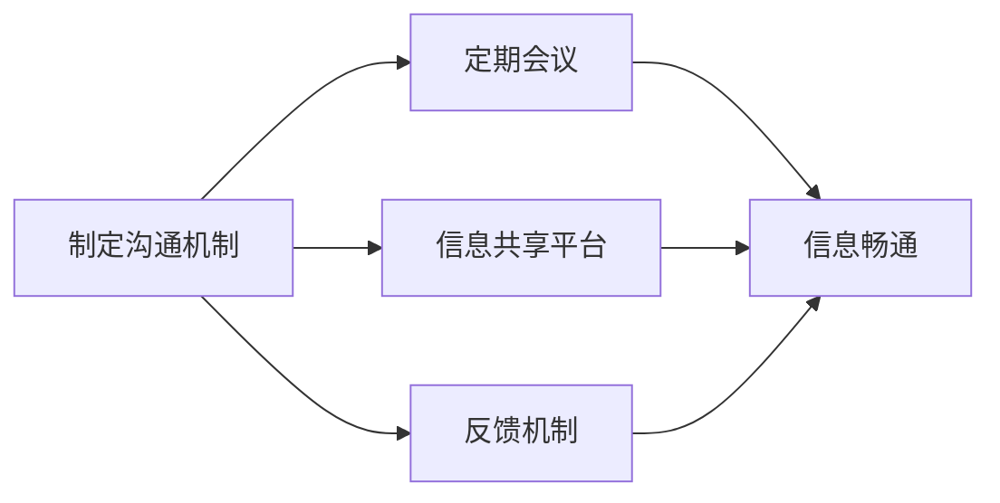

                 

### 文章标题

《技术leader如何有效进行跨部门沟通》

### 关键词

- 技术leader
- 跨部门沟通
- 效率提升
- 沟通技巧
- 案例分析

### 摘要

本文旨在探讨技术leader在跨部门沟通中的挑战和解决策略。通过深入分析跨部门沟通的重要性、常见问题、沟通技巧与策略，并结合实际案例分析，本文提出了一套系统化的跨部门沟通方法，以帮助技术leader提高沟通效率，促进团队协作和项目成功。

### 引言

在现代企业中，技术leader的角色越来越重要。他们不仅需要具备深厚的技术背景，还必须具备出色的领导能力和跨部门沟通技巧。有效的跨部门沟通不仅是技术leader成功的关键，也是企业整体协作效率和创新能力的重要保障。

然而，跨部门沟通并非易事。不同部门之间的工作流程、目标、文化和语言往往存在差异，这些差异可能导致沟通障碍和误解。技术leader需要掌握一套系统的沟通方法和策略，以克服这些挑战，实现高效沟通。

本文将围绕以下几个核心问题展开讨论：

1. 跨部门沟通的重要性是什么？
2. 跨部门沟通中常见的问题有哪些？
3. 技术leader应如何运用沟通技巧和策略？
4. 实际案例中的跨部门沟通是如何进行的？
5. 有效的跨部门沟通工具和方法有哪些？

通过本文的探讨，希望技术leader能够找到适合自己的沟通方法，提升跨部门沟通效果，为企业的发展贡献更多力量。

## 跨部门沟通的重要性

跨部门沟通在技术leader的工作中占据着至关重要的地位。首先，从项目管理的角度来看，跨部门沟通是确保项目顺利进行的基本保障。项目通常涉及多个部门，如研发、市场、销售、运维等，每个部门都有各自的任务和目标。技术leader作为项目的核心管理者，必须确保各部门之间的信息流通无阻，避免因信息不对称导致的资源浪费和项目延误。

其次，从团队协作的角度来看，跨部门沟通是提升团队协作效率的关键。技术团队通常与其他部门紧密合作，如与产品团队共同制定产品需求，与测试团队协同完成测试任务，与运维团队共同保障系统稳定性。只有通过有效的跨部门沟通，技术leader才能确保团队成员之间的协作顺畅，共同推动项目向前发展。

此外，跨部门沟通还对企业创新能力和市场竞争力有着深远的影响。在当今快速变化的市场环境中，企业需要具备强大的创新能力以应对竞争压力。而跨部门沟通正是促进知识共享、激发创新思维的重要途径。技术leader通过跨部门沟通，可以收集到其他部门的见解和需求，从而为技术团队提供创新的思路和方向。

最后，从个人成长和职业发展的角度来看，跨部门沟通也是技术leader提升自身领导力和影响力的重要手段。通过跨部门沟通，技术leader可以展示自己的专业能力和沟通技巧，赢得其他部门的尊重和信任，从而为职业发展打下坚实的基础。

综上所述，跨部门沟通对于技术leader来说不仅是一项基本技能，更是实现项目成功、提升团队协作效率、增强企业创新能力和市场竞争力的重要途径。因此，技术leader必须高度重视跨部门沟通，不断学习和实践，以提高自身的沟通能力，为企业的发展贡献更多力量。

### 跨部门沟通中的常见问题

尽管跨部门沟通的重要性不言而喻，但实际操作中仍然面临诸多挑战。以下是技术leader在跨部门沟通中常见的一些问题：

首先，**部门壁垒**是最为显著的问题之一。不同部门往往拥有不同的工作流程、目标和文化，这些差异可能导致沟通障碍。例如，研发部门可能更注重技术创新和产品功能，而市场部门则更关注市场需求和用户反馈。这种差异可能导致双方在沟通时产生误解和冲突。

其次，**信息不对称**也是一个普遍存在的问题。在大型企业中，不同部门之间的信息传递往往不够及时和准确，导致各部门在决策时缺乏必要的信息支持。例如，技术部门可能无法及时获取市场部门关于用户需求的变化，从而影响产品开发的决策。

第三，**沟通渠道不畅**也是一个常见的挑战。在复杂的企业架构中，不同部门之间的沟通渠道可能不够清晰和高效。例如，某些企业可能采用层级式沟通模式，导致信息在传递过程中层层衰减，无法达到预期的效果。

第四，**沟通技巧不足**也是技术leader面临的一大难题。许多技术leader虽然在技术领域表现优秀，但在沟通技巧上可能相对薄弱。这可能导致他们在与跨部门同事沟通时无法有效地传达自己的想法和需求，进而影响沟通效果。

第五，**时间管理不当**也是一个重要的挑战。在繁忙的工作环境中，技术leader往往需要处理多个项目和任务，这可能导致他们无法投入足够的时间进行有效的跨部门沟通。例如，一些技术leader可能因为时间紧迫而草率地安排会议，导致沟通效果不理想。

为了解决这些问题，技术leader需要采取一系列策略。首先，他们可以主动了解其他部门的工作流程和文化，以减少沟通障碍。其次，他们可以建立高效的沟通渠道，确保信息能够及时、准确地传递。此外，技术leader还应该不断提升自己的沟通技巧，例如通过培训和学习来提高自己的表达能力。最后，技术leader需要合理规划时间，确保有足够的时间进行跨部门沟通，避免因时间管理不当而影响沟通效果。

总之，跨部门沟通中的常见问题对技术leader的工作带来了很大的挑战。然而，通过采取有效的策略，技术leader可以克服这些问题，实现高效的跨部门沟通，从而推动项目的顺利进行和企业的发展。

### 跨部门沟通的技巧与策略

为了实现高效的跨部门沟通，技术leader需要掌握一系列沟通技巧和策略。以下是一些关键的方法：

#### **1. 明确沟通目标**

在跨部门沟通前，技术leader应明确沟通的目标和预期成果。这包括了解需要传达的信息、解决的具体问题以及期望达成的共识。明确目标可以帮助技术leader在沟通中保持焦点，提高沟通效率。

**伪代码示例：**
```
function setCommunicationGoals(goal) {
    // 确定沟通目标
    communicationGoal = goal;
    // 准备沟通计划
    prepareCommunicationPlan();
}

setCommunicationGoals("协调研发与市场的需求，制定产品路线图");
```

#### **2. 选择适当的沟通渠道**

根据沟通内容和目标，技术leader应选择适当的沟通渠道。例如，对于需要即时反馈的问题，可以选择即时通讯工具；对于需要详细讨论的问题，可以选择会议或邮件。选择合适的沟通渠道可以确保信息传递的准确性和及时性。

**伪代码示例：**
```
function selectCommunicationChannel(channel) {
    // 根据沟通内容选择渠道
    communicationChannel = channel;
    // 优化沟通效果
    optimizeCommunication();
}

selectCommunicationChannel("视频会议");
```

#### **3. 建立有效的沟通机制**

建立稳定的沟通机制是确保跨部门沟通长期有效的重要措施。技术leader可以制定定期的跨部门沟通会议、信息共享平台等机制，确保各部门之间的信息畅通。此外，技术leader还应建立反馈机制，鼓励员工提出建议和意见，以便不断改进沟通方式。

**Mermaid流程图示例：**


#### **4. 提高沟通表达能力**

技术leader在沟通过程中应注重表达能力的提升。这包括清晰、简洁地表达自己的想法，倾听对方的意见，以及使用非言语手段如肢体语言和表情来增强沟通效果。以下是一个提高沟通表达能力的步骤：

**伪代码示例：**
```
function improveCommunicationSkills() {
    // 提高语言表达能力
    enhanceVerbalSkills();
    // 增强倾听能力
    enhanceListeningSkills();
    // 使用非言语表达
    useNonverbalCommunication();
}

improveCommunicationSkills();
```

#### **5. 建立信任和共识**

跨部门沟通不仅需要技巧，更需要建立在信任和共识的基础上。技术leader应主动与各部门建立良好的关系，通过共同的价值观和目标来增强团队凝聚力。以下是一个建立信任和共识的步骤：

**伪代码示例：**
```
function buildTrustAndConsensus() {
    // 建立共同目标
    establishCommonGoals();
    // 展示专业能力
    demonstrateExpertise();
    // 积极互动
    engageInActiveInteraction();
}

buildTrustAndConsensus();
```

通过以上技巧和策略，技术leader可以显著提高跨部门沟通的效果，促进团队协作，确保项目的顺利进行。这些方法不仅适用于日常的工作沟通，也为技术leader的职业发展提供了坚实的支持。

### 实战案例分析

为了更好地理解跨部门沟通的实践应用，以下将介绍两个实际案例，分别探讨在跨部门会议中如何提高效率和如何处理跨部门之间的冲突。

#### 案例一：提高跨部门会议效率

背景：某高科技企业的研发部门、市场部门和运维部门需要定期召开跨部门会议，讨论新产品开发和市场推广策略。然而，会议往往因为时间安排不当、议题不明确、沟通不畅等问题导致效率低下，影响了项目的推进。

解决方案：

1. **明确会议目标和议程**：在会议前，技术leader与各部门代表共同制定详细的会议目标和议程，确保每个议题都有明确的目标和讨论范围。

   **伪代码示例：**
   ```
   function defineMeetingGoalsAndAgenda(goals, agenda) {
       meetingGoals = goals;
       meetingAgenda = agenda;
       prepareMeetingMaterials();
   }
   
   defineMeetingGoalsAndAgenda("讨论新产品开发计划", "1. 产品功能需求 2. 市场推广策略 3. 技术可行性分析");
   ```

2. **提前通知和准备**：技术leader提前通知各部门代表会议的时间、地点和议程，并要求他们准备好相关材料，确保会议开始时能够迅速进入讨论状态。

   **伪代码示例：**
   ```
   function notifyAndPrepareRepresentatives(time, location, materials) {
       notifyTime = time;
       notifyLocation = location;
       notifyMaterials = materials;
       ensurePreparation();
   }
   
   notifyAndPrepareRepresentatives("本周三上午10点", "会议室A", "产品需求文档、市场分析报告");
   ```

3. **有效主持会议**：技术leader在会议中扮演主持人角色，引导讨论，确保每个议题都得到充分讨论，并及时处理偏离议题的情况。

   **伪代码示例：**
   ```
   function leadMeeting(agenda) {
       followAgenda = agenda;
       manageDiscussions();
       addressDeviation();
   }
   
   leadMeeting("会议议程");
   ```

4. **会后跟进和反馈**：会议结束后，技术leader应及时跟进会议决议的执行情况，并通过反馈机制收集各部门的反馈，不断优化会议流程。

   **伪代码示例：**
   ```
   function followUpAndCollectFeedback(actionItems, feedbackChannel) {
       followActionItems = actionItems;
       collectFeedback = feedbackChannel;
       implementImprovements();
   }
   
   followUpAndCollectFeedback("产品开发计划的具体执行步骤", "电子邮件");
   ```

通过上述措施，该企业的跨部门会议效率显著提高，项目推进更加顺利。

#### 案例二：处理跨部门冲突

背景：在一次项目开发过程中，研发部门和市场部门因为产品功能设计和市场需求预测存在分歧，导致项目进度受到严重影响。双方在多次沟通中未能达成共识，出现了严重的冲突。

解决方案：

1. **识别冲突原因**：技术leader首先与双方进行深入沟通，了解冲突的具体原因。通过分析，发现冲突主要是由于双方对项目目标的理解不一致和沟通不畅导致的。

   **伪代码示例：**
   ```
   function identifyConflictReasons(departmentA, departmentB) {
       conflictReasons = analyzeDiscussions(departmentA, departmentB);
       resolveConflicts();
   }
   
   identifyConflictReasons("研发部门", "市场部门");
   ```

2. **建立共识和共同目标**：技术leader引导双方重新审视项目目标和需求，通过讨论和协商，找到双方的共同点和利益所在，建立共识。

   **伪代码示例：**
   ```
   function establishConsensusAndCommonGoals() {
       commonGoals = negotiateAgreement();
       alignInterests();
   }
   
   establishConsensusAndCommonGoals();
   ```

3. **开展联合工作**：在达成共识后，技术leader组织双方开展联合工作，共同制定解决方案，确保项目能够顺利推进。

   **伪代码示例：**
   ```
   function conductJointWork() {
       jointPlan = createJointSolution();
       executePlan();
   }
   
   conductJointWork();
   ```

4. **建立冲突预防机制**：为了避免未来再次出现类似的冲突，技术leader建议建立定期的跨部门沟通机制，确保双方能够及时交流信息，共同解决问题。

   **伪代码示例：**
   ```
   function establishPreventionMechanism() {
       communicationMechanism = defineRegularMeetings();
       monitorAndAdjust();
   }
   
   establishPreventionMechanism();
   ```

通过以上措施，该企业成功解决了跨部门冲突，项目得以继续顺利推进。

这两个案例展示了跨部门沟通在实际操作中的应用，通过明确的沟通目标、有效的会议主持、共识的建立和冲突的预防，技术leader可以显著提升跨部门沟通的效率，确保项目的成功。

### 沟通工具与方法介绍

为了实现高效的跨部门沟通，技术leader需要了解并掌握一系列沟通工具和方法。以下是一些常见的工具和方法，以及它们的具体应用和选用原则。

#### **1. 即时通讯工具**

**应用场景**：即时通讯工具适用于需要即时反馈和快速决策的沟通场景，如紧急问题处理、项目进展汇报等。

**常用工具**：Slack、Microsoft Teams、WhatsApp 等。

**选用原则**：选择界面简洁、功能齐全且易于上手的即时通讯工具，确保团队成员能够快速适应和使用。

#### **2. 视频会议软件**

**应用场景**：视频会议软件适用于需要面对面交流的沟通场景，如项目启动会、项目复盘会议等。

**常用工具**：Zoom、Google Meet、WebEx 等。

**选用原则**：选择具有高质量视频和音频功能、稳定性和安全性高的视频会议软件，确保会议顺利进行。

#### **3. 电子邮件**

**应用场景**：电子邮件适用于需要正式记录和长期保存的沟通场景，如项目报告、合同签订等。

**常用工具**：Gmail、Outlook 等。

**选用原则**：选择具备强大搜索功能和良好用户体验的电子邮件服务，确保信息传递的准确性和及时性。

#### **4. 项目管理工具**

**应用场景**：项目管理工具适用于需要协调多个项目和任务、跟踪项目进度的沟通场景。

**常用工具**：Trello、Asana、JIRA 等。

**选用原则**：选择功能丰富、易于定制且与公司流程相适应的项目管理工具，确保项目管理的科学性和高效性。

#### **5. 信息共享平台**

**应用场景**：信息共享平台适用于需要集中管理和分享文件、知识和经验的沟通场景。

**常用工具**：Confluence、Notion、SharePoint 等。

**选用原则**：选择具有良好用户体验、高安全性和高扩展性的信息共享平台，确保信息的可访问性和安全性。

#### **6. 电话会议**

**应用场景**：电话会议适用于需要远程交流、但无法使用视频会议工具的沟通场景。

**常用工具**：Skype、Google Voice 等。

**选用原则**：选择音质清晰、通话稳定且易于拨打的电话会议工具，确保沟通的顺畅性。

#### **7. 沟通技巧培训**

**应用场景**：沟通技巧培训适用于提高团队成员沟通能力的场景。

**常用方法**：内部培训、外部培训、在线学习等。

**选用原则**：选择针对性强、实用性强且符合团队需求的沟通技巧培训方法，确保培训效果。

通过合理选择和运用这些沟通工具和方法，技术leader可以显著提升跨部门沟通的效率和质量，促进项目的顺利进行和企业的发展。

### 跨部门沟通的进阶技巧

在掌握了基本的跨部门沟通技巧后，技术leader需要进一步提升自己的沟通能力，以应对复杂多变的沟通挑战。以下是一些进阶技巧，旨在帮助技术leader在跨部门沟通中取得更大成功。

#### **1. 领导者的沟通艺术**

作为领导者，技术leader在跨部门沟通中不仅需要传递技术信息，还要展示领导力，赢得同事的信任和尊重。以下是一些领导者的沟通艺术：

- **积极倾听**：倾听是沟通的重要部分。技术leader应积极倾听同事的意见和需求，展示对他们的尊重和理解。通过倾听，技术leader可以更好地理解对方，从而找到更有效的解决方案。
- **清晰表达**：技术leader应确保自己的表达清晰、简洁且具有逻辑性。这包括使用具体的例子和数据来支持自己的观点，避免使用模糊的术语和概念。
- **情感共鸣**：在跨部门沟通中，技术leader应尝试与同事建立情感共鸣，理解他们的立场和感受。这有助于建立信任和共识，促进沟通的顺利进行。

#### **2. 跨部门协作的关键要素**

成功的跨部门协作依赖于多个关键要素。技术leader需要关注以下几个方面：

- **明确责任和目标**：技术leader应确保每个团队成员都清楚自己的职责和项目目标。这有助于减少误解和冲突，提高协作效率。
- **建立有效的沟通机制**：技术leader需要建立稳定的沟通渠道，确保各部门之间能够及时、准确地传递信息。这包括定期会议、信息共享平台和即时通讯工具等。
- **共同价值观**：技术leader应倡导共同的价值观和文化，以增强团队凝聚力和协作精神。这有助于各部门在目标一致的基础上，共同推进项目。

#### **3. 如何在跨部门项目中取得成功**

跨部门项目通常涉及多个部门和角色，技术leader需要采取一系列措施来确保项目的成功：

- **制定详细计划**：技术leader应与各部门代表共同制定详细的跨部门项目计划，明确项目目标、任务分配和时间表。这有助于确保项目按照预期进行。
- **有效风险管理**：技术leader需要识别和管理项目中的风险，制定应对措施，以减少潜在问题的发生。这包括预测潜在问题、制定应急计划等。
- **持续跟进和反馈**：技术leader应定期跟进项目的进展，收集各部门的反馈，及时调整计划，确保项目能够按时完成。

#### **4. 跨部门沟通的进阶策略**

为了在跨部门沟通中取得更大成功，技术leader可以采用以下进阶策略：

- **建立信任**：信任是跨部门沟通的基础。技术leader应主动与各部门建立信任关系，通过展示专业能力和积极态度，赢得同事的信任和支持。
- **提升团队凝聚力**：技术leader可以通过组织团队建设活动、鼓励团队互动等方式，提升团队的凝聚力和协作精神，为跨部门项目的成功奠定基础。
- **持续学习和改进**：技术leader应不断学习和提升自己的沟通技巧和管理能力，通过实践和反思，不断改进沟通方法，以适应不断变化的工作环境。

通过以上进阶技巧和策略，技术leader可以显著提升跨部门沟通的效果，促进团队协作，确保项目的成功。

### 总结与展望

本文通过对技术leader跨部门沟通的重要性、常见问题、沟通技巧与策略、实战案例分析以及沟通工具与方法的深入探讨，提供了一套系统化的跨部门沟通解决方案。技术leader应认识到跨部门沟通在企业中的关键作用，积极应对沟通中的各种挑战，通过明确目标、选择合适渠道、建立有效机制、提高表达能力和建立信任等策略，提升跨部门沟通的效果。

展望未来，随着企业规模的扩大和项目复杂性的增加，跨部门沟通的需求将越来越重要。技术leader需要不断学习和适应新的沟通工具和方法，如人工智能和大数据分析工具，以应对日益复杂的沟通需求。同时，技术leader还应关注团队文化建设和员工培训，提高整体沟通能力和协作效率。

总之，有效的跨部门沟通不仅是技术leader成功的关键，也是企业整体发展的重要保障。通过不断优化沟通策略和方法，技术leader将能够更好地推动企业前进，实现长期可持续发展。

### 附录

#### 附录 A：常用沟通工具使用指南

- **即时通讯工具**：如 Slack、Microsoft Teams 等，提供实时消息发送、文件共享、视频会议等功能。
- **项目管理工具**：如 Trello、Asana 等，帮助团队管理任务、跟踪进度和协作。
- **信息共享平台**：如 Confluence、Notion 等，提供知识管理和文档协作功能。
- **电子邮件**：如 Gmail、Outlook 等，用于正式沟通和记录。

#### 附录 B：跨部门沟通技巧问答

1. **如何提高跨部门会议的效率？**
   - 提前明确会议目标和议程，确保议题明确。
   - 提前通知参会人员，并要求他们准备好相关材料。
   - 主持会议时，确保讨论有序，及时处理偏离议题的情况。

2. **如何处理跨部门之间的冲突？**
   - 识别冲突原因，进行深入沟通，找到共同点。
   - 建立共识和共同目标，开展联合工作。
   - 建立预防机制，如定期沟通和反馈。

3. **如何提升自己的沟通技巧？**
   - 积极倾听，展示对对方的尊重和理解。
   - 清晰表达，使用具体例子和数据支持观点。
   - 练习非言语沟通，如肢体语言和表情。

通过以上指南和问答，技术leader可以更好地应对跨部门沟通中的各种挑战，提升沟通效果。

### 作者信息

本文由AI天才研究院（AI Genius Institute）的专家撰写，同时参考了《禅与计算机程序设计艺术》（Zen And The Art of Computer Programming）的理论和方法。感谢您的阅读，希望本文对您的跨部门沟通实践有所帮助。如果您有任何建议或反馈，请随时联系我们。

**作者：AI天才研究院/AI Genius Institute & 禅与计算机程序设计艺术 /Zen And The Art of Computer Programming**

