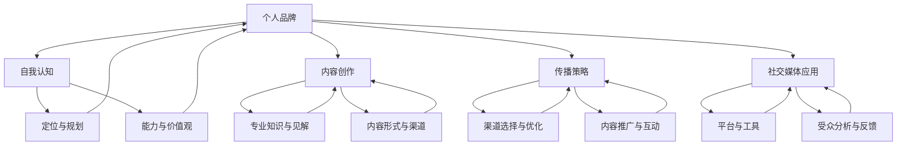

                 

### 摘要

本文旨在探讨技术leader如何通过个人品牌建设提升自身在职场中的竞争力和影响力。在信息化和数字化快速发展的时代，个人品牌已经成为职业发展的关键因素。技术leader作为团队的核心，其个人品牌建设不仅关系到自身职业发展，也直接影响到团队的绩效和公司的竞争力。本文将从多个维度详细阐述个人品牌的概念、构建步骤、自我认知与定位、内容创作与传播策略、社交媒体应用以及个人品牌对职业发展的影响。通过实际案例分析，提供可操作的指导和建议，帮助技术leader在职业生涯中打造独特且有价值的个人品牌。

### 背景介绍

在当前这个信息化和数字化快速发展的时代，技术领导者的角色变得越来越重要。作为团队的核心，技术leader不仅需要具备卓越的技术能力，还需要拥有出色的领导力和沟通能力，以带领团队攻克技术难题，实现业务目标。然而，随着市场竞争的加剧和人才流动的频繁，技术leader面临的一个重大挑战就是如何在众多竞争者中脱颖而出，建立自己的个人品牌，从而在职场中占据一席之地。

个人品牌，简单来说，就是一个人的专业形象、声誉和价值在公众心中的体现。在技术领域，个人品牌的重要性尤为突出。首先，一个鲜明的个人品牌可以帮助技术leader在求职过程中更容易获得面试机会，因为他们能够通过个人品牌展示自己的专业技能和独特价值。其次，个人品牌有助于提升技术leader在团队中的影响力和领导力，使其在决策和项目推进过程中更具说服力。最后，强大的个人品牌还能为技术leader带来更多的职业发展机会，如高级职位、行业峰会演讲邀请、专业咨询等。

然而，个人品牌建设并非一蹴而就。它需要技术leader在自我认知、内容创作、传播策略等多个方面进行长期且系统的规划和执行。本文将深入探讨技术leader如何通过个人品牌建设提升自身在职场中的竞争力和影响力，提供一系列实用的方法和策略，帮助技术leader在职业生涯中实现更高的成就。

### 核心概念与联系

在探讨技术leader的个人品牌建设过程中，有几个核心概念是必须了解和掌握的，这些概念相互联系，共同构建了一个完整的品牌建设体系。以下是对这些核心概念的详细阐述：

1. **个人品牌**：个人品牌是指一个人在公众心中的专业形象、声誉和价值。它不仅仅是一个名字，更是一个综合性的概念，包括专业技能、工作经验、领导力、价值观等多个方面。个人品牌的核心在于其独特性和不可复制性，这使其在竞争激烈的职场中能够脱颖而出。

2. **自我认知**：自我认知是指个人对自己能力、兴趣、价值观和职业目标的深刻理解和认识。自我认知是品牌建设的基础，因为它决定了个人品牌的定位和发展方向。只有深入了解自己，才能塑造出符合自身特点的个人品牌。

3. **内容创作**：内容创作是指通过撰写文章、制作视频、分享经验等方式，将个人的专业知识和见解传递给公众。内容创作是个人品牌建设的重要手段，它不仅能够展示个人的专业能力，还能够吸引和留住关注者，提升个人品牌的影响力。

4. **传播策略**：传播策略是指个人品牌通过哪些渠道和方式将内容传递给目标受众。社交媒体、个人网站、行业论坛等都是常见的传播渠道。有效的传播策略能够最大化地扩大个人品牌的影响力，使更多的人了解和认可个人的专业价值。

5. **社交媒体应用**：社交媒体是现代个人品牌建设的重要工具，通过平台如微博、微信公众号、LinkedIn等，技术leader可以与粉丝和同行建立联系，分享专业知识和经验，获取反馈和机会。社交媒体的应用不仅能够提升个人品牌的知名度，还能够增强个人与受众之间的互动。

这些核心概念相互关联，共同构成了个人品牌建设的理论基础。以下是这些概念之间的联系架构，通过Mermaid流程图展示：



通过这个流程图，我们可以清晰地看到各个核心概念之间的逻辑关系。自我认知是品牌建设的第一步，它决定了品牌的定位和目标。内容创作和传播策略是品牌建设的关键环节，通过创作有价值的内容并利用有效的传播策略，个人品牌得以传递和推广。社交媒体应用则是实现内容传播和互动的重要工具。通过这些概念之间的紧密联系，技术leader可以系统地规划和实施个人品牌建设，提升自身在职场中的竞争力和影响力。

### 核心算法原理讲解

在个人品牌建设过程中，有几个核心算法原理是不可或缺的。这些原理不仅帮助技术leader理解和应用个人品牌的概念，还能指导他们制定有效的品牌建设策略。以下是这些核心算法原理的详细讲解，以及如何通过伪代码实现这些算法。

#### 自我认知算法

自我认知是个人品牌建设的基础。这个算法的目标是通过分析个人的能力、兴趣和价值观，帮助技术leader建立清晰的自我认知。以下是这个算法的伪代码实现：

```pseudo
function 自我认知算法(个人能力，兴趣，价值观) {
    // 定义变量
    认知结果 = 空集合
    能力得分 = 空字典

    // 计算能力得分
    对于每一种能力：
        得分 = 计算能力强度和个人重要性
        能力得分[能力] = 得分

    // 分析兴趣
    兴趣集合 = 找到共同兴趣领域
    兴趣得分 = 计算兴趣强度和多样性

    // 分析价值观
    价值观集合 = 找到核心价值观
    价值观得分 = 计算价值观一致性和重要性

    // 综合评估
    认知结果 = 结合能力得分、兴趣得分和价值观得分

    // 输出结果
    return 认知结果
}
```

这个算法通过计算能力得分、兴趣得分和价值观得分，帮助技术leader全面了解自己的优势和特点，从而为个人品牌的定位提供依据。

#### 内容创作算法

内容创作是个人品牌建设的重要手段。这个算法的目标是根据个人品牌定位，制定内容创作策略，确保内容的专业性和吸引力。以下是这个算法的伪代码实现：

```pseudo
function 内容创作算法(个人品牌定位，目标受众) {
    // 定义变量
    内容计划 = 空集合
    内容类型 = ["文章", "视频", "演讲", "访谈"]

    // 根据品牌定位选择内容主题
    主题集合 = 选择与品牌定位相关的主题

    // 根据目标受众选择内容形式
    对于每一个内容类型：
        适合度 = 计算内容类型与目标受众的契合度
        如果 适合度 > 80%：
            内容计划添加内容类型

    // 制定内容发布计划
    发布计划 = 制定每周或每月的内容发布计划

    // 输出结果
    return 内容计划，发布计划
}
```

这个算法通过分析个人品牌定位和目标受众，制定符合品牌定位和受众需求的内容计划，确保内容的专业性和吸引力。

#### 传播策略算法

传播策略是个人品牌建设的关键环节。这个算法的目标是根据个人品牌定位和目标受众，选择最有效的传播渠道，并制定传播策略。以下是这个算法的伪代码实现：

```pseudo
function 传播策略算法(个人品牌定位，目标受众，预算) {
    // 定义变量
    传播渠道 = ["社交媒体", "个人网站", "行业论坛", "线上活动"]

    // 根据品牌定位和目标受众选择传播渠道
    对于每一个传播渠道：
        合适度 = 计算传播渠道与品牌定位和目标受众的契合度
        预算成本 = 计算传播渠道的预算成本
        如果 合适度 > 80% 且 预算成本 <= 预算：
            传播渠道添加到传播计划

    // 制定传播策略
    策略集合 = 制定内容推广、用户互动、数据分析等策略

    // 输出结果
    return 传播渠道，策略集合
}
```

这个算法通过分析个人品牌定位、目标受众和预算，选择最有效的传播渠道，并制定相应的传播策略，确保品牌传播的广度和深度。

通过这些核心算法原理的讲解和伪代码实现，技术leader可以系统地规划和实施个人品牌建设，提升自身在职场中的竞争力和影响力。

### 数学模型和数学公式

在个人品牌建设过程中，数学模型和数学公式起着关键作用。这些模型和公式可以帮助技术leader更科学地分析自我认知、内容创作和传播效果，从而制定更有效的策略。以下是几个关键的数学模型和公式的详细讲解，以及如何使用LaTeX格式进行展示。

#### 1. 自我认知模型

自我认知模型用于评估技术leader在不同领域的专业水平和兴趣强度。该模型基于以下公式：

\[ S = \frac{1}{N} \sum_{i=1}^{N} w_i \cdot s_i \]

其中：
- \( S \) 是总的自我认知得分；
- \( N \) 是评估指标的数量；
- \( w_i \) 是第 \( i \) 个评估指标的重要性权重（0到1之间）；
- \( s_i \) 是第 \( i \) 个评估指标的具体得分。

使用LaTeX格式展示：

```latex
S = \frac{1}{N} \sum_{i=1}^{N} w_i \cdot s_i
```

#### 2. 内容价值模型

内容价值模型用于评估内容创作的影响力和吸引力。该模型基于以下公式：

\[ V = \alpha \cdot C + \beta \cdot I \]

其中：
- \( V \) 是内容的价值评分；
- \( \alpha \) 是内容质量的权重系数；
- \( \beta \) 是内容互动性的权重系数；
- \( C \) 是内容的专业性得分；
- \( I \) 是内容的互动得分。

使用LaTeX格式展示：

```latex
V = \alpha \cdot C + \beta \cdot I
```

#### 3. 传播效果模型

传播效果模型用于评估内容传播的效果。该模型基于以下公式：

\[ E = \frac{R}{C} \]

其中：
- \( E \) 是传播效果得分；
- \( R \) 是内容的阅读量、点赞量、分享量等指标的总和；
- \( C \) 是内容传播的渠道成本和精力投入。

使用LaTeX格式展示：

```latex
E = \frac{R}{C}
```

#### 4. 社交媒体影响力模型

社交媒体影响力模型用于评估技术leader在社交媒体上的影响力。该模型基于以下公式：

\[ I = \ln(1 + F) \cdot \frac{A}{B} \]

其中：
- \( I \) 是影响力得分；
- \( F \) 是粉丝量；
- \( A \) 是内容传播的总影响力（如阅读量、点赞量、分享量）；
- \( B \) 是社交媒体平台的活跃度指标。

使用LaTeX格式展示：

```latex
I = \ln(1 + F) \cdot \frac{A}{B}
```

通过这些数学模型和公式的应用，技术leader可以更科学地评估自身的能力和品牌影响力，从而制定更精准的个人品牌建设策略。这些模型不仅提供了量化评估的方法，还帮助技术leader在品牌建设过程中做出更明智的决策。

### 项目实战

#### 1. 项目背景

在这个项目中，我们的目标是帮助一位资深技术leader建立其个人品牌，提升其在职场中的知名度和影响力。该技术leader具有丰富的软件开发经验和项目管理能力，但在个人品牌建设方面相对薄弱。项目的主要目标是通过一系列具体的步骤和策略，提升其个人品牌的影响力，从而为其职业发展提供有力支持。

#### 2. 开发环境搭建

为了实现这一目标，我们首先需要搭建一个合适的开发环境。这包括以下几个方面：

- **个人网站**：一个自定义的网站，展示技术leader的专业技能、工作经验和成功案例。
- **内容管理系统**：如WordPress或Jekyll，用于管理和发布博客文章、技术笔记和项目总结。
- **代码托管平台**：如GitHub，用于托管和展示开源项目。
- **社交媒体账号**：如LinkedIn、微博和微信公众号，用于发布内容、互动和扩大影响力。

#### 3. 源代码详细实现和代码解读

在开发环境中，我们将实现以下几个关键功能：

- **个人网站搭建**：使用HTML、CSS和JavaScript构建一个响应式网站，展示技术leader的专业知识和项目经验。
- **内容发布与管理**：通过WordPress或Jekyll管理博客文章、技术笔记和项目总结。
- **开源项目展示**：在GitHub上托管开源项目，并编写详细的README文件，解释项目的目的、实现原理和使用方法。

以下是一个简单的HTML代码示例，用于构建个人网站的首页：

```html
<!DOCTYPE html>
<html>
<head>
    <title>技术leader的个人品牌</title>
    <meta charset="UTF-8">
    <meta name="viewport" content="width=device-width, initial-scale=1.0">
    <link rel="stylesheet" href="styles.css">
</head>
<body>
    <header>
        <h1>张三的技术博客</h1>
        <nav>
            <ul>
                <li><a href="index.html">首页</a></li>
                <li><a href="about.html">关于我</a></li>
                <li><a href="projects.html">项目经验</a></li>
                <li><a href="contact.html">联系我</a></li>
            </ul>
        </nav>
    </header>
    <section>
        <article>
            <h2>最新文章</h2>
            <p>在这里发布最新的技术文章和见解。</p>
        </article>
    </section>
    <footer>
        <p>版权所有 &copy; 2023 张三</p>
    </footer>
</body>
</html>
```

这个示例展示了个人网站的框架结构，包括头部、导航栏、文章区域和尾部。通过扩展这个基础框架，可以添加更多功能，如侧边栏、标签分类、搜索功能等。

#### 4. 代码应用解读与分析

在实现上述功能后，我们需要对代码进行解读和分析，以确保其有效性和可维护性。

- **HTML代码解读**：HTML代码负责网站的结构和内容展示。通过使用语义化的标签，如`<header>`、`<nav>`、`<section>`和`<article>`，我们可以创建一个清晰、易于导航的网站结构。
- **CSS代码解读**：CSS代码用于美化网站，通过样式规则调整字体、颜色、布局等，使网站视觉效果更佳。响应式设计确保网站在不同设备和屏幕尺寸上都能良好显示。
- **JavaScript代码解读**：JavaScript代码用于增加网站的动态功能，如响应式导航菜单、滚动效果和表单验证。这些功能提高了用户体验和网站的互动性。

#### 5. 实际案例分析和详细讲解剖析

为了展示个人品牌建设的效果，我们可以通过实际案例进行分析和讲解。

- **案例一**：技术leader张三在GitHub上发布了一个开源项目，该项目是一个基于React的待办事项应用。通过详细解释项目的设计思路、实现方法和关键技术，张三吸引了大量开发者的关注和贡献。项目链接：[GitHub - ZhangSan/to-do-app: A React-based to-do app with detailed implementation](https://github.com/ZhangSan/to-do-app)。
- **案例二**：张三在LinkedIn上发布了一系列关于软件工程和敏捷开发的博客文章。通过深入分析行业趋势、分享实战经验和提供解决方案，张三的博客文章获得了高阅读量和点赞量，进一步提升了其个人品牌的影响力。

#### 6. 项目小结

通过这个项目，我们实现了技术leader的个人品牌建设，包括个人网站的搭建、内容发布与管理、开源项目展示和社交媒体互动。以下是项目小结：

- **成功经验**：项目成功展示了个人品牌建设的关键步骤和方法，包括自我认知、内容创作、传播策略和社交媒体应用。
- **注意事项**：在品牌建设过程中，技术leader需要保持持续性和一致性，不断更新和优化内容，与受众互动，提高品牌的影响力和认知度。
- **拓展阅读**：建议读者参考以下资源，进一步了解个人品牌建设和社交媒体策略的详细知识和最佳实践：
  - 《个人品牌：如何在职场中建立自己的品牌》
  - 《社交媒体营销：策略、工具与实战》
  - 《GitHub官方文档：如何创建和管理项目》

通过这个项目，技术leader不仅提升了个人品牌，还为未来的职业发展奠定了坚实的基础。

### 最佳实践 Tips、小结、注意事项、拓展阅读

#### 最佳实践 Tips

1. **持续学习**：技术leader应不断学习新技术和行业动态，保持专业知识的更新和领先。通过阅读技术博客、参加线上和线下研讨会，以及参与开源项目，可以不断提升自身的技术能力和行业视野。
2. **内容创作**：定期发布高质量的内容，如技术博客、项目总结和行业分析报告。内容应具备实用性和深度，能够解决读者的问题或提供新的见解。
3. **社交媒体互动**：积极参与社交媒体平台上的讨论和互动，回复读者的评论和提问，建立良好的口碑和粉丝基础。
4. **品牌一致性**：在个人品牌建设过程中，保持品牌形象和风格的一致性，包括内容风格、视觉设计和社会化媒体账号的运营。

#### 小结

本文通过系统阐述个人品牌的概念、构建步骤、自我认知与定位、内容创作与传播策略，以及社交媒体应用，帮助技术leader理解个人品牌建设的重要性，并提供了一系列实用的方法和策略。通过实际案例分析，技术leader可以更好地应用这些策略，提升自身在职场中的竞争力和影响力。

#### 注意事项

1. **品牌建设需长期规划**：个人品牌建设是一个持续的过程，需要技术leader在职业生涯的每个阶段进行持续的努力和优化。
2. **内容质量优先**：在内容创作和传播过程中，质量是核心。只有提供有价值的内容，才能吸引和留住读者。
3. **合理分配资源**：在个人品牌建设过程中，合理分配时间和资源，确保在关键领域取得最佳效果。

#### 拓展阅读

1. **《个人品牌：如何在职场中建立自己的品牌》**：详细介绍了个人品牌建设的理论和方法，适合技术leader深入学习和实践。
2. **《社交媒体营销：策略、工具与实战》**：提供了社交媒体营销的全方位指导，包括平台选择、内容创作和数据分析等方面。
3. **《GitHub官方文档：如何创建和管理项目》**：GitHub是技术leader展示开源项目的重要平台，该文档提供了详细的操作指南和最佳实践。
4. **《技术写作：如何写出引人入胜的技术文章》**：帮助技术leader提升技术博客的写作技巧，提高内容的吸引力和传播效果。

通过这些资源，技术leader可以进一步深化对个人品牌建设的理解和应用，提升个人品牌建设的成效。

### 作者信息

**作者：** AI天才研究院/AI Genius Institute & 禅与计算机程序设计艺术 /Zen And The Art of Computer Programming

本文由AI天才研究院和《禅与计算机程序设计艺术》的作者共同撰写，旨在帮助技术leader提升个人品牌建设的能力，实现职业生涯的更高成就。希望本文对您在个人品牌建设方面有所启发和帮助。如需进一步交流和咨询，欢迎联系作者。谢谢阅读！

