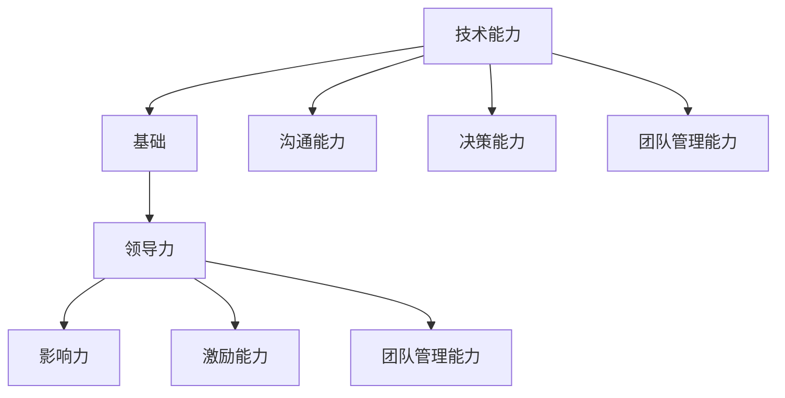

                 

### 1.1 书籍背景与目的

在当今快速发展的信息技术时代，技术领导者的角色日益重要。他们不仅需要具备深厚的专业技术能力，还必须拥有卓越的领导力和个人品牌建设能力。技术leader的个人形象塑造不仅仅是对个人的提升，更是对团队、公司和整个行业的影响。因此，我们编写这本书的目的在于帮助技术leader们从多方面提升自己的个人形象，以更好地应对职场挑战和领导团队。

本书的目标受众主要是那些希望成为技术leader的软件工程师、程序员、CTO、架构师等。同时，对于那些已经在技术领导岗位上的专业人士，本书也提供了一个系统的自我提升方案，帮助他们更有效地管理团队、提升个人品牌，并在职业发展中取得更大成功。

在接下来的章节中，我们将逐步分析技术leader所需具备的各项能力，包括技术能力、领导力、个人品牌建设等。我们将结合实际案例，提供具体的提升策略和实用技巧，帮助读者在职业道路上不断成长。

首先，让我们明确技术leader的角色定位。作为团队的核心人物，技术leader不仅要精通技术，还需要具备战略规划、团队管理、沟通协调等多方面的能力。他们在团队中的角色不仅仅是技术专家，更是团队的灵魂和引领者。这一角色的特殊性要求技术leader需要不断自我提升，以适应快速变化的技术环境和团队需求。

在了解了书籍的背景和目的之后，接下来我们将进一步探讨技术leader的角色定位，以及个人形象塑造的重要性，为后续内容的展开奠定基础。让我们继续深入思考，逐步分析技术leader应具备的各项能力和技能。接下来的章节将为我们提供详细的指导和策略，帮助我们迈向成为优秀技术leader的目标。### 1.2 技术leader的角色定位

技术leader在现代企业中扮演着至关重要的角色，他们是团队的灵魂，也是企业技术创新和业务发展的核心推动力。技术leader不仅仅是一个技术专家，更是一个战略家、沟通者和组织者。他们在团队中的角色和责任非常多样化，主要体现在以下几个方面：

#### 作为技术专家

技术leader首先需要是一个技术过硬的专家。他们必须具备扎实的技术功底，能够熟练掌握并应用各种前沿技术。这不仅包括编程语言、框架和工具，还包括对系统架构、性能优化、安全防护等方面的深刻理解。技术leader需要具备独立解决问题的能力，能够快速定位并解决复杂的技术难题，带领团队攻克技术难关。

#### 作为战略家

技术leader还需要具备战略规划能力。他们需要从全局出发，制定团队的技术战略和目标，确保团队的技术发展方向与企业整体战略保持一致。这要求技术leader具备敏锐的市场洞察力，能够紧跟行业趋势，预见技术变革，并据此调整团队的技术路线。技术leader的战略规划能力直接关系到团队的技术创新能力和发展速度。

#### 作为沟通者

技术leader在团队中还需要扮演沟通者的角色。他们需要与团队成员、上级领导、客户和其他利益相关者进行有效沟通。良好的沟通能力不仅有助于技术leader了解团队和客户的需求，还能提升团队的凝聚力和工作效率。技术leader需要能够清晰表达自己的想法，同时也要善于倾听和协调不同意见，确保团队内部信息流通顺畅。

#### 作为组织者

技术leader需要具备出色的组织和管理能力。他们需要能够合理分配团队资源，制定工作计划和进度，确保项目按时完成。技术leader还需要能够激励团队成员，提升团队士气，营造积极向上的工作氛围。在项目管理过程中，技术leader需要处理各种突发情况，协调资源，解决冲突，确保项目的顺利进行。

#### 作为团队领袖

技术leader还需要具备领袖魅力。他们需要能够带领团队迎接挑战，激励团队成员超越自我，实现共同的目标。技术leader需要具备坚定的信念和远见，能够在团队遇到困难时给予指导和支持，成为团队的依靠和榜样。领袖魅力的培养不仅依赖于个人的品质和魅力，还需要通过不断的学习和锻炼来提升。

通过以上分析，我们可以看到技术leader的角色定位是多维度的，他们需要在技术、战略、沟通、组织和领导等多个方面发挥重要作用。这种角色的复杂性要求技术leader必须具备全面的能力，并不断自我提升。接下来，我们将进一步探讨个人形象塑造的重要性，帮助读者理解为什么技术leader需要关注个人形象的建设。这将为我们理解后续内容提供更为深刻的背景和动力。### 1.3 个人形象塑造的重要性

在技术领域，个人形象塑造对于技术leader的成功至关重要。首先，一个良好的个人形象可以增强技术leader的公信力和权威性。技术leader在团队中不仅是技术的专家，更是团队的引领者和决策者。他们的形象直接影响到团队成员对他们的信任和尊重。一个具有专业素养、正直诚实、具有远见卓识的形象可以帮助技术leader更有效地指导和激励团队，推动项目成功。

其次，个人形象对职业发展有着深远的影响。在当今竞争激烈的职场环境中，技术leader的个人形象可以成为他们的名片，有助于拓展职业网络、获取更多机会和资源。一个优秀的个人形象可以吸引行业内的关注和认可，提升技术leader在行业内的知名度和影响力，从而为职业发展打开更广阔的空间。

此外，个人形象的建设还能够提升团队的整体士气和工作效率。技术leader作为团队的领导者，他们的行为和态度会对团队成员产生潜移默化的影响。一个积极向上的个人形象可以营造良好的团队氛围，激励团队成员共同努力，提升整体的工作效率和创新能力。反之，一个消极的形象则可能导致团队士气低落，影响团队绩效。

在技术leader的形象塑造过程中，技术能力是基础，但绝非唯一。领导力和个人品牌同样至关重要。技术leader需要通过不断提升自身的领导力，包括沟通能力、决策能力、团队管理能力等，来增强自己的领导魅力。同时，个人品牌的建设也是不可或缺的。技术leader需要通过多种渠道，如社交媒体、公开演讲、技术分享等，展示自己的专业能力和成果，打造个人品牌。

总之，个人形象塑造对于技术leader的成功具有重要意义。这不仅关系到他们的职业发展，也对团队和公司产生深远的影响。在接下来的章节中，我们将详细探讨技术能力和领导力这两个核心概念，以及如何通过个人品牌建设来提升技术leader的个人形象。通过这些内容，读者将能够获得系统性的指导，助力他们在技术领导的道路上不断成长和进步。### 核心概念与联系

#### 技术能力与领导力

在探讨技术leader的个人形象塑造时，技术能力和领导力是两个不可忽视的核心概念。技术能力指的是技术leader在编程、系统架构、算法设计等方面的专业知识和实践经验。领导力则涉及领导者在团队管理、沟通协调、决策制定等方面的技能和素养。技术能力和领导力之间存在着紧密的联系和相互作用。

**技术能力与领导力的关系**

1. **技术能力是基础**：技术能力是技术leader发挥领导作用的基础。一个技术leader如果缺乏深厚的技术功底，将难以赢得团队成员的信任和尊重。技术能力能够帮助技术leader更好地理解团队面临的技术挑战，提供有效的解决方案，并在团队中发挥技术指导作用。

2. **领导力是提升**：尽管技术能力是基础，但领导力却是技术leader成功的关键。领导力不仅能够帮助技术leader管理团队、协调资源，还能激励团队成员、提升团队士气。一个具备卓越领导力的技术leader，能够在复杂多变的技术环境中保持团队的稳定和高效。

3. **相互作用**：技术能力和领导力并不是孤立存在的，它们之间存在相互作用。技术leader的技术能力可以提升其在团队中的影响力，而领导力则可以加强技术能力在团队中的应用和推广。例如，一个具有创新思维的技术leader，可能会通过领导力推动团队采用新技术，从而提升整体的技术水平。

**技术能力与领导力的具体联系**

1. **沟通能力**：良好的沟通能力既是技术能力的重要组成部分，也是领导力的重要体现。技术leader需要通过有效的沟通，将复杂的技术问题转化为团队成员能够理解的内容，并激发团队成员的创造力和工作热情。

2. **决策能力**：技术能力和领导力共同决定了技术leader的决策能力。技术leader需要结合自身的技术知识和团队的实际情况，做出明智的决策。同时，领导力可以帮助技术leader在决策过程中考虑团队利益，平衡各方需求，确保决策的可行性和有效性。

3. **团队管理能力**：技术leader的技术能力和领导力共同影响着团队的管理能力。技术能力可以帮助技术leader更好地理解团队的需求，提供专业的技术指导和支持。而领导力则能够帮助技术leader建立有效的团队管理机制，提升团队的协作效率和创新能力。

**Mermaid 流程图**

为了更直观地展示技术能力与领导力的联系，我们可以使用Mermaid流程图来表示：



通过这张流程图，我们可以看到技术能力与领导力之间的紧密联系。技术能力为领导力提供了基础，而领导力则通过提升沟通能力、决策能力和团队管理能力，进一步强化技术能力在团队中的应用和推广。

**核心算法原理讲解**

在具体的技术决策和团队管理中，一些核心算法原理也起到了关键作用。以下是两个常见的算法原理及其应用：

1. **决策树算法**

   ```plaintext
   决策树算法是一种常见的决策支持工具，它通过一系列规则来模拟决策过程，帮助技术leader在复杂的情况下做出明智的决策。

   决策树算法的基本步骤：
   1. 定义决策树节点：每个节点代表一个决策问题。
   2. 收集数据：根据现有数据构建决策树。
   3. 切分数据集：将数据集划分为训练集和测试集。
   4. 建立决策树模型：根据数据集构建决策树。
   5. 测试模型：使用测试集测试决策树的准确性。

   决策树算法的核心是节点切分策略，常用的切分策略包括信息增益、基尼系数和熵等。
   ```

2. **支持向量机（SVM）**

   ```plaintext
   支持向量机（SVM）是一种强大的机器学习模型，广泛用于分类和回归任务。它通过寻找最佳超平面，将不同类别的数据点进行有效分离。

   SVM的核心原理：
   1. 超平面：在多维空间中，将不同类别的数据点分隔开的平面称为超平面。
   2. 支持向量：位于超平面边缘的数据点称为支持向量。
   3. 最优超平面：寻找最佳的超平面，使两类数据点之间的间隔最大。

   SVM的求解方法包括原始问题和对偶问题，常用的求解算法有SMO算法和核函数等。
   ```

通过这些核心算法原理，技术leader可以更科学、更有效地做出技术决策，提升团队的整体技术水平。在后续章节中，我们将进一步探讨如何通过提升技术能力和领导力来塑造技术leader的个人形象。这些核心概念和联系为我们提供了一个系统性的框架，帮助我们理解技术leader应具备的各项能力及其相互作用。### 个人品牌建设

#### 2.2.1 个人品牌的概念

个人品牌是指个人在公众中的形象和认知，包括个人的专业技能、价值观、成就、人格特质等。它不仅体现了个人的专业能力和个人魅力，还代表着个人的信誉和市场价值。在技术领域中，个人品牌的重要性日益凸显，尤其是在信息爆炸和竞争激烈的今天，技术leader需要通过个人品牌来提升自己在行业内的知名度和影响力。

个人品牌的建设是一个系统性工程，涉及多个方面。首先，个人品牌需要具备独特性，即个人在技能、经验、观点等方面与其他人有所不同。这种独特性可以为个人带来竞争优势，使个人在众多技术专家中脱颖而出。其次，个人品牌需要具备可信度，即个人在专业领域内拥有广泛的认可和尊重。可信度的建立通常需要通过持续的专业实践和成果展示来实现。此外，个人品牌还需要具有可持续性，即个人能够在不断变化的技术环境中保持先进性和创新能力。

#### 2.2.2 个人品牌的重要性

对于技术leader而言，个人品牌的重要性体现在以下几个方面：

1. **提升职业竞争力**：一个强大的个人品牌可以显著提升技术leader在职业市场中的竞争力。当个人品牌具备独特性和可信度时，技术leader将更容易获得职业机会，赢得更多的工作和项目。

2. **拓展职业网络**：个人品牌有助于技术leader建立广泛的职业网络。通过积极参与行业活动、发表技术文章、参与开源项目等方式，技术leader可以结识到更多的行业同仁和潜在合作伙伴，从而拓展自己的职业资源。

3. **提升领导力**：个人品牌的建立可以增强技术leader的领导力。一个具有强大个人品牌的技术leader，通常能够更好地影响和激励团队成员，推动团队的创新和进步。

4. **增加市场价值**：强大的个人品牌可以提升技术leader的市场价值。在职业谈判中，具有个人品牌的技术leader往往能够获得更高的薪资和更好的福利待遇。

5. **提高知名度**：个人品牌有助于技术leader在行业内获得更高的知名度。通过持续的品牌建设，技术leader可以成为行业内的意见领袖和专家，从而提升个人影响力。

#### 2.2.3 建设个人品牌的方法与策略

为了建立一个强大的个人品牌，技术leader可以采取以下方法与策略：

1. **明确个人定位**：技术leader需要明确自己的专业方向和优势领域，以便在品牌建设中突出重点。例如，可以选择专注于人工智能、大数据、区块链等某一领域，并在此领域内建立自己的专业声誉。

2. **持续学习与提升**：技术领域不断发展，技术leader需要不断学习新知识、新技能，以保持自身的竞争力。通过参加培训课程、阅读专业书籍、参与开源项目等方式，技术leader可以不断提升自己的专业水平。

3. **展示专业能力**：技术leader需要通过各种方式展示自己的专业能力，例如在技术博客、社交媒体上分享技术心得，参与行业会议和研讨会，发表技术论文等。

4. **建立个人网站或博客**：创建个人网站或博客是展示个人品牌的重要渠道。通过定期更新内容，技术leader可以展示自己的技术知识和观点，并与读者互动，建立良好的网络形象。

5. **参与开源项目**：参与开源项目可以提升技术leader的实战经验和项目经验，同时也能提高个人在技术社区的知名度。开源项目是一个展示个人技术能力和贡献的平台，技术leader可以通过贡献代码、文档、测试用例等方式，提升自己的个人品牌。

6. **网络社交媒体运用**：利用社交媒体平台，如LinkedIn、Twitter、GitHub等，技术leader可以扩大自己的影响力。通过发布专业内容、参与讨论、分享技术见解，技术leader可以与行业同仁和潜在雇主建立联系。

7. **公开演讲与培训**：参加公开演讲和培训活动，可以让技术leader在更广泛的范围内展示自己的专业能力和个人魅力。通过演讲和培训，技术leader不仅可以提升个人知名度，还能获得宝贵的反馈和建议。

通过上述方法与策略，技术leader可以逐步建立一个强大的个人品牌，提升自己的职业竞争力和影响力。在接下来的章节中，我们将进一步探讨如何通过技术能力提升和领导力提升来巩固个人品牌，帮助技术leader在职业道路上取得更大成功。### 技术能力提升

技术能力是技术leader的核心竞争力之一，对于团队和企业的成功至关重要。为了在快速变化的技术环境中保持竞争力，技术leader需要持续提升自己的技术能力。以下是提升技术能力的几个关键策略：

#### 3.2.1 自我评估

自我评估是提升技术能力的第一步。技术leader需要定期对自己的技术能力进行全面的评估，了解自己的优势与不足。以下是一些自我评估的方法：

1. **技能评估工具**：利用在线技能评估工具，如Codeforces、LeetCode、HackerRank等，测试自己的编程能力和算法水平。

2. **代码审查**：参与代码审查，不仅能够提升自己的代码质量，还能学习他人的编程技巧和最佳实践。

3. **技术面试**：通过参加技术面试，了解自己在面试官眼中的技术水平和能力短板。

4. **定期的自我反思**：定期记录自己的技术学习历程和心得，总结经验教训，找出改进方向。

#### 3.2.2 学习与培训

持续学习是提升技术能力的关键。以下是一些有效的学习与培训方法：

1. **在线课程与教程**：参加在线课程和教程，如Coursera、Udemy、edX等，学习最新的技术知识和技能。

2. **专业书籍**：阅读专业书籍，如《算法导论》、《编程珠玑》等，掌握经典算法和编程技巧。

3. **开源项目**：参与开源项目，通过实际编码和实践提升技术能力。开源项目不仅提供了丰富的实战经验，还能扩大技术视野。

4. **技术社区与论坛**：加入技术社区和论坛，如GitHub、Stack Overflow、CSDN等，与同行交流学习，分享经验和心得。

#### 3.2.3 实践与项目

实践是检验技术能力的重要方式。通过实际项目，技术leader可以巩固所学知识，提升解决问题的能力。以下是一些实践与项目的建议：

1. **个人项目**：创建个人项目，通过实际编码和开发，应用所学知识，解决实际问题。

2. **团队项目**：参与团队项目，与团队成员合作，共同完成任务，提升团队协作和项目管理能力。

3. **开源项目**：贡献开源项目，通过代码贡献和文档编写，提升项目质量，同时扩大个人影响力。

4. **比赛与挑战**：参加编程比赛和技术挑战，如Google Code Jam、Facebook Hacker Cup等，提升实战能力和竞赛水平。

#### 3.3 技术能力提升案例

为了更好地理解技术能力提升的过程，我们来看两个实际案例。

##### 案例一：成功案例分享

张华是一名资深软件工程师，他希望通过提升自己的技术能力来成为团队的技术leader。以下是他的提升过程：

1. **自我评估**：张华通过Codeforces等平台测试自己的算法水平，发现自己对图算法的理解不够深入。

2. **学习与培训**：他参加了Coursera上的图算法课程，并阅读了《算法导论》相关章节，深入理解图算法的基本原理。

3. **实践与项目**：他在GitHub上参与了一个开源项目，通过实际编码和调试，巩固了对图算法的应用。

4. **比赛与挑战**：他参加了一个算法竞赛，获得了一定的成绩，进一步提升了自己的技术能力和自信心。

通过以上努力，张华在团队中获得了更多的认可，并成功晋升为技术leader。

##### 案例二：失败案例剖析

李明是一名有多年开发经验的技术人员，但他总觉得自己的技术能力提升缓慢。以下是他的提升过程和问题：

1. **自我评估**：李明通过自我评估发现，他对新兴技术的掌握不够及时，导致在团队中的竞争力下降。

2. **学习与培训**：他参加了多个在线课程，但由于缺乏系统性的学习计划，学习效果不佳。

3. **实践与项目**：李明尝试在团队项目中应用新技术，但由于缺乏实战经验，导致项目失败。

4. **比赛与挑战**：他参加了一些编程比赛，但由于对比赛题型的理解不够深入，成绩不佳。

李明的问题在于缺乏系统性的学习计划和实际操作经验。为了解决这些问题，他需要制定一个详细的学习计划，并积极参与开源项目和实际项目，以提升自己的技术能力。

通过以上案例，我们可以看到，技术能力提升不仅需要正确的策略和方法，还需要持之以恒的努力和实践。在接下来的章节中，我们将进一步探讨如何提升领导力，为技术leader的个人形象塑造提供全面的指导。### 领导力提升

领导力是技术leader不可或缺的核心能力之一，它不仅决定了技术leader在团队中的影响力，还直接影响团队的工作效率和整体绩效。在技术快速发展和变化的时代，提升领导力对于技术leader的成功至关重要。以下是提升领导力的几个关键策略。

#### 4.1 领导力核心要素

1. **沟通能力**：良好的沟通能力是领导力的基础。技术leader需要能够清晰、有效地与团队成员、上级领导和客户沟通，确保信息的准确传达和理解。沟通能力包括倾听能力、表达能力和非语言沟通能力。

2. **决策能力**：技术leader需要具备快速而准确的决策能力。在面对复杂问题和紧急情况时，技术leader需要能够迅速分析问题，制定解决方案，并果断采取行动。有效的决策能力有助于提升团队效率和应对不确定性。

3. **团队管理能力**：技术leader需要具备团队管理能力，包括人员分配、任务分配、团队激励等。良好的团队管理能力可以提升团队的凝聚力和协作效率，促进团队成员的个人成长和职业发展。

4. **战略规划能力**：技术leader需要具备战略规划能力，能够从全局出发，制定团队的技术发展战略和目标。战略规划能力有助于团队在复杂多变的环境中保持清晰的发展方向，实现长远目标。

5. **变革管理能力**：在技术快速变革的今天，技术leader需要具备变革管理能力，能够引导团队适应新的技术、新的工作流程和新的管理方法。变革管理能力有助于团队克服变革过程中的阻力和挑战，实现顺利过渡。

#### 4.2 领导力提升方法

1. **培训与研讨会**：参加专业培训课程和研讨会是提升领导力的有效途径。通过系统性的学习，技术leader可以了解领导力的核心理论和实践方法，提升自身的理论水平和实际应用能力。例如，参加领导力培训课程、领导力研讨会、领导力工作坊等。

2. **反思与总结**：技术leader需要通过定期反思和总结来提升领导力。在每次工作结束后，技术leader可以反思自己的决策过程、沟通方式和团队管理效果，找出不足和改进点。通过总结经验教训，技术leader可以不断提升自己的领导能力。

3. **案例学习**：通过学习成功和失败的领导案例，技术leader可以借鉴他人的经验和教训，提升自己的领导能力。案例学习可以通过阅读相关书籍、参加领导力培训课程、观察其他团队或公司的领导行为等方式进行。

#### 4.3 领导力提升案例

为了更好地理解领导力提升的过程，我们来看两个实际案例。

##### 案例一：成功案例分享

王刚是一名资深软件工程师，他希望通过提升自己的领导力来成为团队的技术leader。以下是他的提升过程：

1. **参加培训**：王刚参加了由公司组织的一系列领导力培训课程，学习了沟通技巧、团队管理、决策能力等方面的内容。

2. **反思与总结**：每次培训结束后，王刚都会反思自己的领导行为，并总结学习心得，将其应用到实际工作中。

3. **案例学习**：王刚阅读了《领导力五要素》等书籍，并分析了其中成功和失败的领导案例，从中吸取经验和教训。

4. **实践与反馈**：王刚在团队中尝试运用学到的领导技巧，并通过团队成员的反馈不断改进。

通过持续的学习和实践，王刚在团队中的领导力得到了显著提升，最终成功晋升为技术leader。

##### 案例二：失败案例剖析

李娜是一名拥有多年开发经验的技术人员，但她发现自己在团队中的领导力提升缓慢。以下是她的提升过程和问题：

1. **参加培训**：李娜参加了领导力培训，但由于缺乏实际应用，学习效果不佳。

2. **反思与总结**：李娜反思自己的领导行为，但未能从中找到有效的改进方法。

3. **案例学习**：李娜阅读了一些领导力书籍，但未能将其成功经验应用到实际工作中。

4. **实践与反馈**：李娜在团队中尝试了一些领导技巧，但由于缺乏系统性的规划和持续实践，效果不明显。

李娜的问题在于缺乏系统性的学习计划和实际应用。为了解决这些问题，她需要制定一个详细的学习计划，并积极参与实践，将所学知识应用到实际工作中。此外，她还需要通过反思和总结来不断改进自己的领导能力。

通过以上案例，我们可以看到，提升领导力需要系统性的学习和持续实践。在接下来的章节中，我们将进一步探讨如何通过个人品牌建设来巩固技术leader的个人形象，帮助读者在职业发展中取得更大成功。### 个人品牌建设实践

个人品牌建设是技术leader职业发展的关键环节，通过有效的社交媒体运用、公开演讲与培训，技术leader可以进一步提升个人影响力，扩大职业网络，从而在竞争激烈的职场中脱颖而出。

#### 5.1 社交媒体运用

在数字化时代，社交媒体已成为个人品牌建设的重要工具。以下是一些社交媒体运用的策略：

**5.1.1 社交媒体的选择**

1. **LinkedIn**：LinkedIn 是职业人士的专业社交平台，技术leader可以在LinkedIn上建立详细的个人档案，展示自己的专业技能、职业经历和成就。此外，通过参与行业群组、发表专业见解和与同行互动，技术leader可以扩大自己的职业网络。

2. **Twitter**：Twitter 是一个信息传播速度极快的平台，技术leader可以通过发布技术文章、参与行业讨论、分享技术见解等方式，快速提升个人知名度。

3. **GitHub**：GitHub 是一个开源平台，技术leader可以通过参与开源项目、贡献代码、撰写技术文档等，展示自己的技术能力和实际项目经验。

4. **微信公众号/博客**：建立个人微信公众号或博客，是技术leader展示专业知识和个人观点的重要途径。通过定期更新内容，技术leader可以建立稳定的读者群体，提升个人影响力。

**5.1.2 内容创作与发布**

1. **技术文章**：撰写高质量的技术文章，分享自己在技术领域的见解和经验，可以帮助技术leader树立专业形象。

2. **技术讲座**：录制技术讲座视频，通过YouTube等平台发布，不仅能够提升个人知名度，还能吸引更多潜在雇主和合作伙伴。

3. **行业趋势分析**：发布对行业趋势的分析文章，展示技术leader的市场洞察力和前瞻性思维。

4. **代码示例**：分享实际代码示例，帮助读者理解和应用新技术。

**5.1.3 社交互动与影响力提升**

1. **积极互动**：回复评论、参与讨论，积极与读者互动，可以提升个人口碑和影响力。

2. **内容分享**：分享其他行业专家的文章和见解，展示自己的学习能力和知识广度。

3. **建立社区**：在社交媒体上建立自己的社区，吸引志同道合的人加入，共同讨论技术话题。

#### 5.2 公开演讲与培训

公开演讲和培训是技术leader展示个人能力和影响力的另一重要途径。以下是一些关键策略：

**5.2.1 演讲技巧**

1. **明确主题**：在演讲前明确自己的主题和目标，确保演讲内容紧扣主题，避免偏离。

2. **准备充分**：提前准备演讲内容，制作PPT，确保演讲过程中流畅自然。

3. **练习演讲**：多次练习演讲，熟悉演讲内容和节奏，提升自信心。

4. **互动与问答**：在演讲过程中，鼓励观众提问，与观众互动，提高演讲的吸引力和参与度。

**5.2.2 培训课程设计与实施**

1. **需求分析**：了解学员的需求，设计针对性强的培训课程。

2. **课程内容**：确保课程内容实用、有趣，结合实际案例和互动环节，提高学员的学习兴趣。

3. **反馈与改进**：在培训结束后收集学员反馈，根据反馈改进课程内容和教学方法。

4. **持续更新**：随着技术不断发展，定期更新课程内容，确保学员能够学习到最新的技术知识。

**5.2.3 反馈与改进**

1. **学员反馈**：通过问卷调查、面对面交流等方式收集学员反馈，了解培训效果。

2. **自我反思**：每次培训结束后，技术leader应反思自己的演讲和培训效果，找出不足之处。

3. **持续改进**：根据反馈和自我反思，不断改进培训方法和内容，提升培训效果。

通过社交媒体运用和公开演讲与培训，技术leader可以显著提升个人品牌，扩大职业影响力。以下是一个成功品牌建设案例：

**5.3.1 成功品牌建设案例**

张三是一位专注于人工智能领域的技术专家，他通过以下方式成功建设了个人品牌：

1. **社交媒体运用**：张三在LinkedIn上分享了多篇关于人工智能的文章，同时在Twitter上积极与同行互动，吸引了大量关注。

2. **公开演讲**：张三参加了一系列人工智能会议，并在这些会议上发表演讲，展示了他在该领域的研究成果和见解。

3. **培训课程**：张三设计并实施了一门关于深度学习的培训课程，吸引了众多学员，课程评价极高。

4. **案例分享**：张三通过GitHub贡献了多个深度学习项目，展示了他的技术实力。

通过这些努力，张三在人工智能领域建立了强大的个人品牌，成为该领域的意见领袖和专家，获得了众多职业机会和合作机会。

总之，个人品牌建设是一个长期而持续的过程，技术leader需要通过多种渠道和方法，不断提升个人影响力。在接下来的章节中，我们将探讨如何通过制定策略和整合资源，进一步巩固个人品牌，帮助技术leader在职业发展中取得更大成功。### 技术leader个人形象塑造策略

技术leader的个人形象塑造是一项复杂的系统性工程，涉及多个方面的策略和行动。以下是一些具体的策略和步骤，帮助技术leader制定和实施个人形象塑造计划：

#### 6.1 定位与目标设定

**6.1.1 个人定位**

个人定位是塑造个人形象的首要步骤。技术leader需要明确自己在技术领域的专业方向和核心优势。以下是一些定位策略：

1. **技能定位**：确定自己在编程语言、开发框架、算法、架构设计等方面的专长，形成独特的技能标签。

2. **经验定位**：根据自己在项目开发、团队管理、技术创新等方面的经验，突出自己的实际应用能力。

3. **兴趣定位**：明确自己在技术领域的兴趣点，例如人工智能、大数据、区块链等，聚焦于某一领域进行深耕。

**6.1.2 塑造目标**

个人定位明确后，技术leader需要设定清晰的目标，以指导个人形象塑造的实践。以下是一些目标设定策略：

1. **短期目标**：设定具体、可衡量的短期目标，例如在一年内发表一篇技术论文、完成一个开源项目等。

2. **长期目标**：设定更具挑战性的长期目标，例如在五年内成为某一领域的专家、获得某一技术认证等。

3. **目标分解**：将长期目标分解为多个短期目标，制定具体的实施计划和里程碑。

#### 6.2 资源整合与利用

**6.2.1 内部资源整合**

技术leader需要充分利用公司内部的资源，提升个人形象。以下是一些内部资源整合策略：

1. **培训资源**：利用公司提供的培训资源，如内部培训课程、技术分享会等，提升自己的专业知识和技能。

2. **项目资源**：积极参与公司的重要项目，通过实际项目经验提升自己的技术能力和项目管理能力。

3. **导师资源**：寻找公司内的资深导师，通过导师指导获得更深入的技术理解和职业指导。

**6.2.2 外部资源利用**

外部资源对于技术leader的个人形象塑造同样重要。以下是一些外部资源利用策略：

1. **行业活动**：参加行业会议、技术沙龙等活动，与行业同仁交流，扩展职业网络。

2. **在线课程与认证**：参加在线课程和技术认证，提升自己的专业水平，并获得认证证书。

3. **开源社区**：参与开源社区，通过贡献代码、撰写文档等提升个人技术影响力。

#### 6.3 个性化形象打造

**6.3.1 个性化风格**

个性化风格是技术leader个人形象的重要组成部分。以下是一些个性化风格打造策略：

1. **技术观点**：形成独特的技术观点和见解，通过博客、社交媒体等渠道分享。

2. **个人品牌标志**：设计个性化的个人品牌标志，如个人LOGO、头像等，提升视觉识别度。

3. **个性特点**：展示自己的个性特点，如幽默感、创新思维等，增加个人魅力。

**6.3.2 个人形象塑造策略**

技术leader需要制定具体的形象塑造策略，以确保个人形象的系统性和持续性。以下是一些具体策略：

1. **内容规划**：制定内容发布计划，包括博客文章、技术文章、演讲视频等，确保内容的持续性和专业性。

2. **品牌故事**：编写自己的品牌故事，讲述个人成长历程、专业成就等，提升个人形象的情感连接。

3. **专业认证**：获得行业内的专业认证，如CSDN认证工程师、微软认证专家等，提升专业权威性。

通过以上策略和步骤，技术leader可以逐步塑造出个性化的形象，提升个人品牌影响力。以下是一个成功形象塑造案例：

**6.3.3 成功形象塑造案例**

李四是一名专注于大数据领域的技术leader。以下是他成功塑造个人形象的过程：

1. **定位与目标设定**：李四明确了自己在大数据处理和分析方面的专长，并设定了在三年内成为大数据领域专家的目标。

2. **资源整合与利用**：李四利用公司内部的培训资源，参加了多个大数据相关的培训课程，并积极参与了公司的大数据项目。

3. **个性化形象打造**：李四通过撰写大数据领域的博客文章，在GitHub上贡献了多个大数据处理的开源项目，同时在社交媒体上积极分享自己的见解。

4. **专业认证**：李四获得了CSDN认证的大数据工程师证书，提升了专业权威性。

通过以上努力，李四在行业内建立了强大的个人品牌，成为大数据领域的知名专家，获得了众多职业机会和合作伙伴。

总之，技术leader的个人形象塑造是一个系统性的过程，需要明确定位、设定目标、整合资源、打造个性化形象。通过持续的努力和策略实施，技术leader可以不断提升个人形象，在职业发展中取得更大成功。### 持续成长与改进

#### 7.1 反思与总结

持续成长与改进的关键在于不断进行反思和总结。技术leader需要定期回顾自己的工作表现，分析成功与失败的原因，从而找出改进的方向。以下是一些反思与总结的策略：

**7.1.1 个人成长反思**

1. **定期自我评估**：技术leader可以设定周期性（如季度或年度）的自我评估，检查自己在技术能力、领导力、沟通能力等方面的进步。

2. **设立反馈机制**：通过收集团队成员、同事和上级的反馈，了解自己的工作表现和改进空间。

3. **反思关键事件**：回顾过去工作中遇到的关键事件，分析自己在事件处理中的决策和行为，评估其效果和影响。

**7.1.2 领导力成长反思**

1. **领导力培训回顾**：参加领导力培训后，技术leader应反思所学内容的应用情况，评估培训效果，并根据反馈进行调整。

2. **领导行为分析**：通过分析领导行为和团队成员的反馈，识别自己在领导力方面的优势和不足。

3. **团队绩效评估**：定期评估团队的整体绩效和成员的满意度，从团队的表现中反思自身的领导力。

#### 7.2 不断学习与适应

在快速发展的技术领域，技术leader需要具备不断学习和适应变化的能力。以下是一些持续学习和适应变化的策略：

**7.2.1 持续学习策略**

1. **知识更新**：定期阅读专业书籍、技术博客、行业报告等，保持对最新技术趋势的了解。

2. **在线课程**：参加在线课程，如Coursera、edX等，学习前沿技术和行业最佳实践。

3. **参加研讨会和会议**：参加行业研讨会、技术会议等，与行业专家和同行交流，拓展视野。

4. **内部培训和分享**：鼓励团队成员进行技术分享和培训，通过内部交流提升整体技术水平。

**7.2.2 应对变化的能力**

1. **敏捷管理**：采用敏捷管理方法，快速响应变化，灵活调整团队计划和目标。

2. **风险评估**：在项目规划和执行过程中，进行风险评估，提前准备应对措施。

3. **持续改进**：建立持续改进机制，鼓励团队成员不断优化工作流程和技术方案。

#### 7.3 领导力与个人形象的持续提升

持续提升领导力和个人形象需要系统性的策略和持续的努力。以下是一些具体的提升策略：

**7.3.1 持续提升策略**

1. **制定长期发展计划**：技术leader应制定长期个人发展计划，包括技术能力提升、领导力发展、个人品牌建设等。

2. **建立反馈循环**：通过定期反馈和评估，持续优化个人发展计划，确保目标实现。

3. **培养团队成员**：通过培训和指导，提升团队成员的能力和积极性，建立强大的团队基础。

**7.3.2 持续改进方法**

1. **实践反思**：将实践与反思相结合，通过实际工作总结经验教训，不断改进自己的领导方式和行为。

2. **寻求导师指导**：寻找资深导师，通过导师的指导和建议，提升领导力和个人形象。

3. **建立学习社区**：加入学习社区，与同行交流学习，共同进步。

通过以上策略和方法，技术leader可以持续提升自己的领导力和个人形象，适应快速变化的技术环境，并在职业发展中取得更大的成功。持续成长与改进不仅是技术leader个人发展的需要，也是团队和公司持续发展的关键。只有不断学习和提升，技术leader才能在技术领导的道路上不断前行，实现更高的成就。### 完整目录大纲

# 《技术leader的个人形象塑造》

## 第一部分：引言

### 1.1 书籍背景与目的

### 1.2 技术leader的角色定位

### 1.3 个人形象塑造的重要性

## 第二部分：核心概念与联系

### 2.1 技术能力与领导力

#### 2.1.1 技术能力概述

#### 2.1.2 领导力概述

#### 2.1.3 技术能力与领导力的关系

#### 核心概念与联系流程图


### 2.2 个人品牌建设

#### 2.2.1 个人品牌的概念

#### 2.2.2 个人品牌的重要性

#### 2.2.3 建设个人品牌的方法与策略

## 第三部分：技术能力提升

### 3.1 技术发展趋势与热点

#### 3.1.1 人工智能

#### 3.1.2 大数据

#### 3.1.3 区块链

### 3.2 技术能力提升策略

#### 3.2.1 自我评估

#### 3.2.2 学习与培训

#### 3.2.3 实践与项目

### 3.3 技术能力提升案例

#### 3.3.1 成功案例分享

#### 3.3.2 失败案例剖析

## 第四部分：领导力提升

### 4.1 领导力核心要素

#### 4.1.1 沟通能力

#### 4.1.2 决策能力

#### 4.1.3 团队管理能力

### 4.2 领导力提升方法

#### 4.2.1 培训与研讨会

#### 4.2.2 反思与总结

#### 4.2.3 案例学习

### 4.3 领导力提升案例

#### 4.3.1 领导力提升成功案例

#### 4.3.2 领导力提升失败案例

## 第五部分：个人品牌建设实践

### 5.1 社交媒体运用

#### 5.1.1 社交媒体的选择

#### 5.1.2 内容创作与发布

#### 5.1.3 社交互动与影响力提升

### 5.2 公开演讲与培训

#### 5.2.1 演讲技巧

#### 5.2.2 培训课程设计与实施

#### 5.2.3 反馈与改进

### 5.3 个人品牌建设案例

#### 5.3.1 成功品牌建设案例

#### 5.3.2 品牌建设失败案例分析

## 第六部分：技术leader个人形象塑造策略

### 6.1 定位与目标设定

#### 6.1.1 个人定位

#### 6.1.2 塑造目标

### 6.2 资源整合与利用

#### 6.2.1 内部资源整合

#### 6.2.2 外部资源利用

### 6.3 个性化形象打造

#### 6.3.1 个性化风格

#### 6.3.2 个人形象塑造策略

## 第七部分：持续成长与改进

### 7.1 反思与总结

#### 7.1.1 个人成长反思

#### 7.1.2 领导力成长反思

### 7.2 不断学习与适应

#### 7.2.1 持续学习策略

#### 7.2.2 应对变化的能力

### 7.3 领导力与个人形象的持续提升

#### 7.3.1 持续提升策略

#### 7.3.2 持续改进方法

### 附录

#### 附录A：参考文献

#### 附录B：技术能力提升资源清单

#### 附录C：领导力提升资源清单

#### 附录D：个人品牌建设实用工具清单

## 参考文献

- 《领导力五要素》
- 《影响力》
- 《成功的心理学》
- 《人工智能：一种现代方法》
- 《大数据分析：概念与技术》
- 《深度学习》

作者：AI天才研究院/AI Genius Institute & 禅与计算机程序设计艺术 /Zen And The Art of Computer Programming

