                 

### 文章标题

《技术leader的个人影响力提升》

### 关键词

技术leader，个人影响力，领导力，沟通能力，个人品牌，社交网络，公开演讲，会议主持

### 摘要

本文旨在探讨技术leader的个人影响力提升，分析其核心要素，提供系统的提升策略。通过对技术能力、领导力、沟通能力、个人品牌、社交网络和公开演讲与会议主持等要素的详细探讨，结合实际案例，旨在帮助技术leader建立强大的个人影响力，提升团队和组织绩效。

---

## 第1章 引言

### 1.1 技术leader的角色定义

技术leader在组织中扮演着至关重要的角色。他们不仅需要具备卓越的技术能力，还要拥有强大的领导力和沟通能力，以引领团队不断向前发展。技术leader的角色通常包括但不限于以下几个方面：

1. **技术指导与决策**：技术leader负责团队的技术方向和决策，确保技术方案的高效性和前瞻性。
2. **团队管理**：技术leader负责团队的组织、协调和管理工作，提升团队协作效率。
3. **资源分配**：技术leader需要合理分配团队资源，确保项目进度和资源的最优配置。
4. **技术培训与传承**：技术leader负责团队的技术培训和知识传承，提升团队的整体技术水平。

### 1.2 个人影响力的重要性

个人影响力是技术leader成功的关键因素之一。它不仅能够帮助技术leader在组织中树立权威，还能提升团队的凝聚力和协作效率。个人影响力的重要性体现在以下几个方面：

1. **领导力体现**：强大的个人影响力是技术leader领导力的外在表现，能够有效推动团队目标的实现。
2. **资源获取**：个人影响力有助于技术leader在组织中获取更多的资源和支持，为项目的成功提供保障。
3. **人才吸引**：技术leader的个人影响力能够吸引更多优秀人才加入团队，提升团队的整体实力。
4. **组织变革**：技术leader通过个人影响力推动组织变革，为组织发展注入新的活力。

### 1.3 本书结构安排

本文将围绕技术leader的个人影响力提升展开，具体包括以下章节：

1. **技术领导力基础**：介绍技术leader所需的技术能力和领导力培养方法。
2. **个人品牌塑造**：探讨个人品牌的价值、定位与塑造策略。
3. **社交网络拓展**：分析社交网络的类型与优势，提供社交网络策略。
4. **公开演讲与会议主持**：讲解公开演讲与会议主持的技巧。
5. **个人影响力提升策略**：总结个人影响力提升的路径和策略。
6. **案例分析**：通过实际案例展示个人影响力提升的过程和效果。
7. **总结与展望**：对全文内容进行总结，并展望未来发展趋势。

通过以上章节的详细探讨，本文旨在帮助技术leader提升个人影响力，为团队和组织的发展贡献力量。

## 第2章 技术领导力基础

### 2.1 技术能力提升

技术leader的技术能力是其个人影响力的重要基础。技术能力不仅包括对现有技术的熟练掌握，还包括对新技术的前沿跟踪和创新应用。以下是从多个维度提升技术能力的策略：

#### 2.1.1 技术趋势与前沿

技术leader需要关注技术发展的趋势和前沿，了解新兴技术的应用场景和潜在价值。例如，人工智能、大数据、区块链等技术的快速发展，为各行各业带来了前所未有的机遇和挑战。通过参加行业会议、阅读专业期刊、关注技术社区等方式，技术leader可以及时获取最新的技术动态。

**Mermaid流程图**：

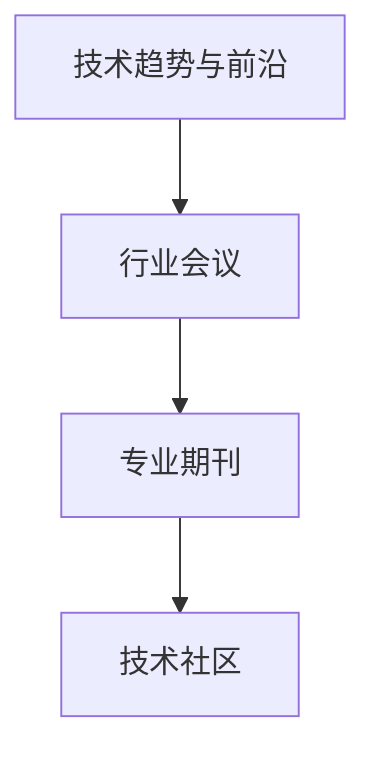

#### 2.1.2 技术深度与广度

技术leader不仅要在某一领域达到深度，还要具备广泛的视野。深度技术能力可以帮助技术leader在具体项目中做出更准确的技术决策，而广泛的技术视野则能够帮助技术leader从全局角度审视项目，发现潜在的优化点和创新方向。

**Mermaid流程图**：

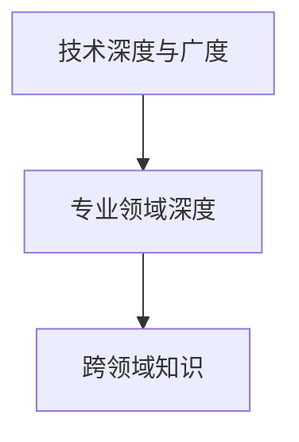

#### 2.1.3 技术创新思维培养

技术创新是技术leader的重要职责之一。培养技术创新思维，可以帮助技术leader在解决实际问题时，找到更高效、更创新的解决方案。以下是一些培养技术创新思维的方法：

1. **问题驱动**：以问题为导向，深入分析问题的本质，从多个角度寻找解决方案。
2. **跨学科学习**：结合不同学科的知识和方法，进行创新性的思维碰撞。
3. **实践探索**：通过实际项目和实践，不断尝试和验证新的技术方案。

**伪代码示例**：

```python
# 技术创新思维培养算法伪代码

def innovative_thinking(problem):
    # 分析问题本质
    problem_analyzer = analyze_problem(problem)
    
    # 跨学科知识融合
    interdisciplinary_integration = merge_knowledge(problem_analyzer)
    
    # 实践探索
    for solution in explore_solutions(problem_analyzer, interdisciplinary_integration):
        validate_solution(solution)
```

通过以上方法，技术leader可以不断提升自身的技术能力，为团队和组织的发展提供强有力的技术支持。

### 2.2 领导力培养

领导力是技术leader个人影响力的关键因素。良好的领导力不仅能够提升团队的凝聚力和执行力，还能为技术leader在组织中的影响力打下坚实的基础。以下是从多个维度培养领导力的策略：

#### 2.2.1 领导力模型分析

领导力模型是培养领导力的基础。通过分析不同的领导力模型，技术leader可以了解不同领导风格的特点和适用场景，从而在具体情境中运用合适的领导策略。以下是一些常见的领导力模型：

1. **情境领导模型**：该模型认为领导风格应根据团队成员的不同成熟度进行调整，分为指令型、支持型、委托型等不同风格。
2. **变革型领导模型**：该模型强调领导者通过激发团队成员的内在动力，推动团队实现变革和创新。
3. **服务型领导模型**：该模型认为领导者应将团队成员的需求放在首位，通过服务他人来实现领导目标。

**Mermaid流程图**：

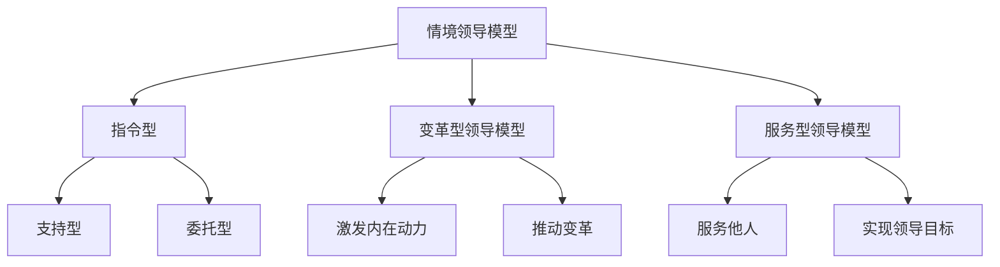

#### 2.2.2 领导风格与团队管理

领导风格直接影响团队的管理效果。技术leader应根据团队的特点和项目需求，灵活调整领导风格。以下是一些常见的领导风格：

1. **民主型领导**：民主型领导注重团队参与，通过集体决策提高团队士气和执行力。
2. **专制型领导**：专制型领导强调个人权威，决策迅速但可能影响团队士气。
3. **放任型领导**：放任型领导给予团队成员充分的自由，但可能导致团队管理混乱。

**Mermaid流程图**：

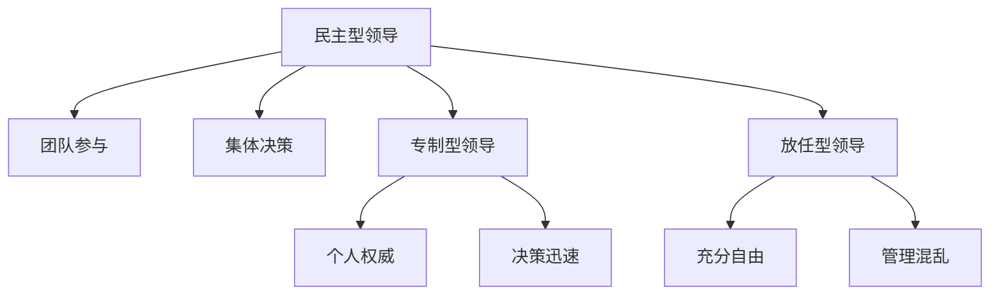

#### 2.2.3 沟通与协作技巧

良好的沟通与协作技巧是领导力的重要组成部分。技术leader需要通过有效的沟通建立团队的信任和合作，以下是一些沟通与协作技巧：

1. **倾听**：倾听是有效沟通的前提，技术leader应学会倾听团队成员的意见和需求。
2. **反馈**：及时、准确的反馈能够帮助团队成员了解自身表现，提升工作效率。
3. **冲突管理**：在团队协作中，冲突是不可避免的。技术leader需要具备处理冲突的能力，以保持团队的和谐与稳定。

**Mermaid流程图**：

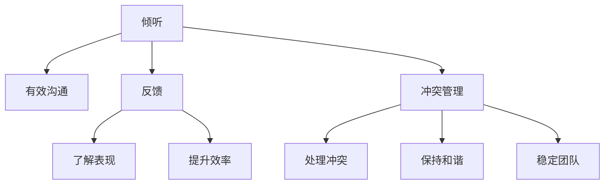

通过以上方法，技术leader可以不断提升自身的领导力，为团队和组织的发展创造更有利的条件。

### 2.3 沟通与协作技巧

沟通与协作技巧是技术leader个人影响力的关键要素之一。有效的沟通能够建立信任，增强团队凝聚力；良好的协作能够提高团队工作效率，实现共同目标。以下是从多个方面提升沟通与协作技巧的策略：

#### 2.3.1 倾听技巧

倾听是有效沟通的基础。技术leader需要学会倾听团队成员的意见和需求，以便更好地理解团队状态和问题。以下是一些倾听技巧：

1. **专注**：在沟通时，技术leader应保持专注，避免分心，确保对方感受到自己的重视。
2. **开放态度**：技术leader应以开放的态度接受不同意见，尊重团队成员的观点。
3. **反馈**：在倾听过程中，技术leader可以通过简单的问题或总结发言来确认对方的意思，确保沟通的准确性。

**Mermaid流程图**：

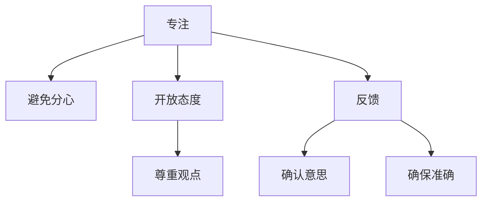

#### 2.3.2 演讲与表达技巧

技术leader需要具备良好的演讲与表达技巧，以清晰、有效地传达信息。以下是一些演讲与表达技巧：

1. **结构清晰**：演讲时，技术leader应确保逻辑清晰，层次分明，使听众容易理解。
2. **语言简洁**：使用简洁明了的语言，避免使用复杂的术语或冗长的句子。
3. **肢体语言**：通过适当的肢体语言，如眼神交流、手势等，增强演讲的感染力。

**Mermaid流程图**：

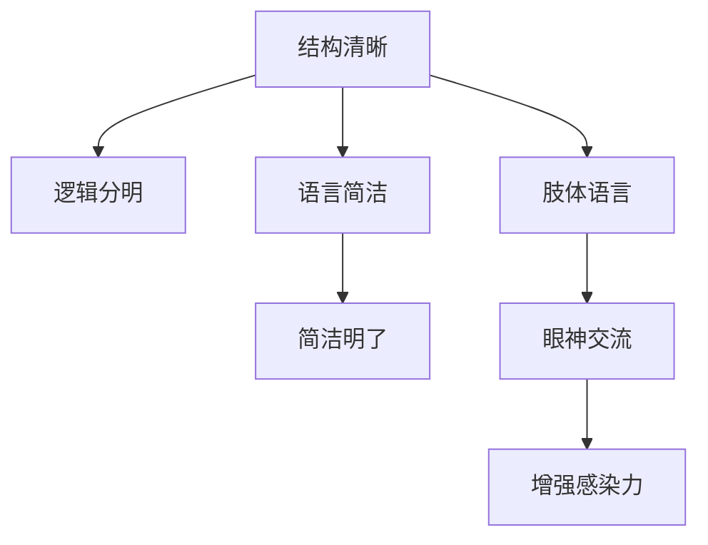

#### 2.3.3 冲突解决技巧

团队协作中难免会出现冲突，技术leader需要具备处理冲突的能力，以保持团队的和谐与稳定。以下是一些冲突解决技巧：

1. **倾听与理解**：在处理冲突时，技术leader应首先倾听双方的意见，理解冲突的本质。
2. **中立立场**：技术leader应保持中立，避免偏袒任何一方，以确保公正处理。
3. **寻求共识**：通过沟通和协商，寻找双方都能接受的解决方案，以达成共识。

**Mermaid流程图**：

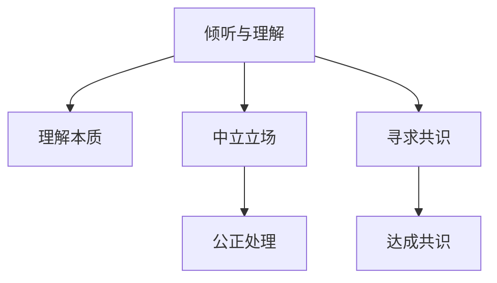

通过以上方法，技术leader可以不断提升自身的沟通与协作技巧，为团队和组织的发展创造更有利的条件。

### 3.1 个人品牌的价值

个人品牌对技术leader的职业发展具有重要价值。首先，个人品牌能够提升技术leader在组织中的知名度和认可度，使其在团队和组织中具有更高的权威和影响力。以下是个人品牌对职业发展的影响：

1. **提升个人权威**：强大的个人品牌能够使技术leader在组织内获得更高的地位和尊重，从而在决策中具有更大的影响力。
2. **增强谈判力**：技术leader的个人品牌能够提高其在项目谈判中的地位，使其在资源分配、人员调配等方面具备更强的谈判力。
3. **吸引优质人才**：个人品牌能够吸引更多优秀的人才加入团队，提升团队的整体实力。
4. **扩大职业机会**：强大的个人品牌能够为技术leader打开更多的职业发展机会，包括晋升、跳槽和合作等。

#### 3.1.2 个人品牌对团队和组织的正面影响

个人品牌不仅对技术leader的职业发展有积极影响，还对团队和组织具有显著的正面作用：

1. **提升团队凝聚力**：技术leader的个人品牌能够增强团队成员对团队的认同感和归属感，提升团队凝聚力。
2. **推动团队创新**：个人品牌能够激发团队成员的创新潜力，鼓励他们在项目中尝试新的技术和方法。
3. **提升组织形象**：技术leader的个人品牌能够提升整个组织的形象和声誉，为组织赢得更多的市场份额和合作伙伴。
4. **促进知识传承**：技术leader通过个人品牌的影响，能够更好地传授知识和经验，促进组织内部的知识传承。

### 3.2 个人品牌定位与塑造

#### 3.2.1 定位策略

个人品牌定位是塑造个人品牌的重要基础。技术leader需要明确自己的品牌定位，以便在市场中树立独特的形象。以下是个人品牌定位的策略：

1. **明确目标受众**：技术leader需要明确自己的目标受众，了解他们的需求和期望，从而设计出符合目标受众的品牌形象。
2. **凸显核心优势**：技术leader应明确自己的核心优势，并将其作为个人品牌的核心理念，突出自己的专业能力和独特价值。
3. **差异化定位**：在市场竞争中，技术leader需要通过差异化定位，使其个人品牌在众多竞争者中脱颖而出。

**Mermaid流程图**：


#### 3.2.2 塑造方法

个人品牌的塑造是一个长期的过程，需要技术leader持续投入时间和精力。以下是个人品牌塑造的方法：

1. **内容创作**：技术leader可以通过撰写技术博客、发表学术论文、制作技术视频等方式，展示自己的专业知识和见解，提升个人品牌影响力。
2. **参与社区**：技术leader可以积极参与技术社区，分享自己的经验和见解，建立与同行的联系，扩大个人品牌的影响力。
3. **演讲与培训**：技术leader可以通过参加行业会议、公开演讲和技术培训，向更广泛的受众展示自己的专业能力和影响力。
4. **媒体曝光**：技术leader可以通过接受媒体采访、发表专栏文章等方式，提升个人品牌的知名度和认可度。

**Mermaid流程图**：

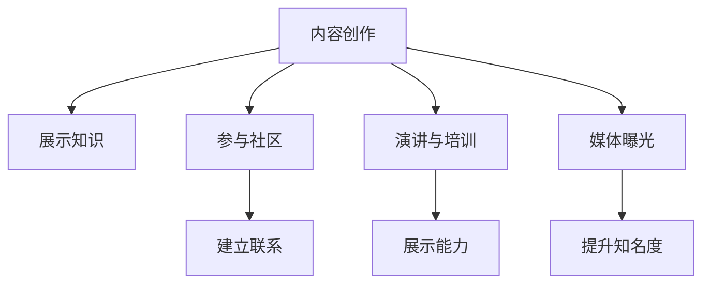

通过以上方法，技术leader可以逐步塑造出强大的个人品牌，为职业发展和团队组织的发展创造有利条件。

### 3.3 个人品牌定位与塑造

#### 3.3.1 定位策略

个人品牌定位是塑造个人品牌的关键步骤，它决定了个人品牌在市场中的独特位置和价值。以下是个人品牌定位的具体策略：

1. **明确目标受众**：技术leader需要明确自己的目标受众，了解他们的需求和期望。这有助于技术leader设计出符合目标受众的品牌形象和内容，从而在市场中找到精准的定位。

2. **凸显核心优势**：技术leader应识别并凸显自己的核心优势，将其作为个人品牌的核心理念。这些优势可能包括技术专长、项目经验、创新思维等，通过明确的定位，技术leader能够在市场中树立起独特的形象。

3. **差异化定位**：在竞争激烈的市场中，差异化定位是技术leader脱颖而出的关键。技术leader应分析自身与竞争对手的差异，并找出独特的卖点，如独特的解决方案、独特的应用场景等，以此打造与众不同的品牌形象。

**Mermaid流程图**：

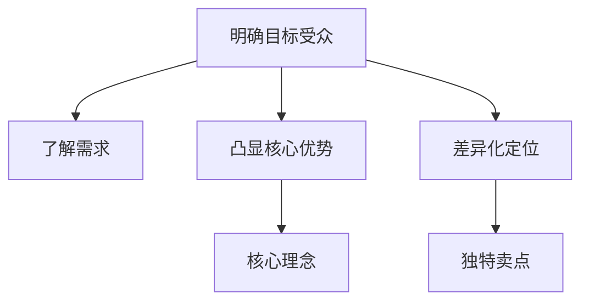

#### 3.3.2 塑造方法

个人品牌的塑造需要技术leader持续的努力和策略性的行动。以下是一些具体的塑造方法：

1. **内容创作**：技术leader可以通过撰写技术博客、发表学术论文、制作技术视频等方式，展示自己的专业知识和见解。这些内容不仅能够提升个人品牌的知名度，还能够建立技术领导者的专业形象。

2. **参与社区**：技术leader可以积极参与技术社区，如GitHub、Stack Overflow、Reddit等，分享自己的经验和见解。通过在社区中的活跃参与，技术leader可以建立与同行的联系，扩大个人品牌的影响力。

3. **演讲与培训**：技术leader可以参加行业会议、技术论坛，进行公开演讲或举办技术培训。这些活动不仅能够提升个人品牌的知名度，还能够展示技术leader的领导力和专业知识。

4. **媒体曝光**：技术leader可以通过接受媒体采访、发表专栏文章等方式，提高个人品牌的曝光度。这有助于在更广泛的受众中树立个人品牌的形象。

5. **社交媒体运营**：技术leader可以利用社交媒体平台，如LinkedIn、Twitter、微信等，进行个人品牌的推广。通过定期发布专业内容、参与讨论、建立专业网络，技术leader可以逐步塑造出强大的个人品牌。

**Mermaid流程图**：

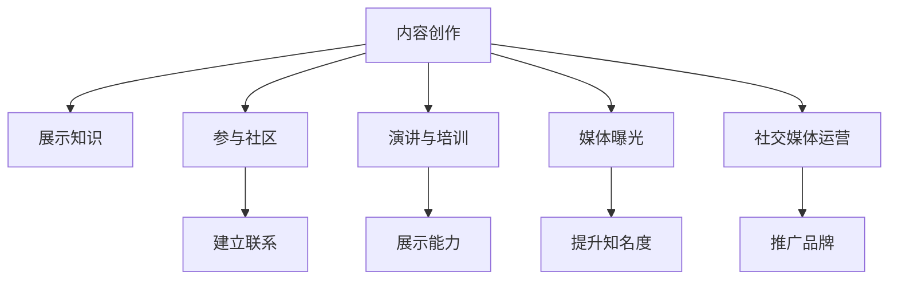

通过以上策略和方法，技术leader可以逐步塑造出强大的个人品牌，提升在组织中的影响力，为职业发展创造更多机会。

### 3.4 持续维护与优化

个人品牌不仅是技术leader在职业生涯中的一个重要资产，也是其在团队和组织中发挥影响力的重要基础。为了确保个人品牌的持续有效，技术leader需要不断进行维护与优化。以下是具体的策略和方法：

#### 3.4.1 定期更新内容

技术leader应定期更新自己的专业内容，以保持品牌的活力和相关性。这包括发布新的技术博客、发表论文、更新技术视频等。通过持续的内容更新，技术leader可以展示自己在技术领域的持续学习和进步，同时也能够吸引更多的关注和粉丝。

**伪代码示例**：

```python
# 定期更新内容策略

def update_content(frequency, content_types):
    for content_type in content_types:
        if content_type == 'blog':
            publish_blog(frequency)
        elif content_type == 'paper':
            submit_paper(frequency)
        elif content_type == 'video':
            create_video(frequency)

# 调用函数
update_content('monthly', ['blog', 'paper', 'video'])
```

#### 3.4.2 与同行互动

技术leader应积极与同行互动，参与技术讨论和合作项目。这不仅有助于拓展自己的专业网络，还能够从他人那里获取新的灵感和见解，进一步丰富个人品牌的内涵。参与技术社区、参加会议、组织研讨会等活动都是有效的互动方式。

**Mermaid流程图**：

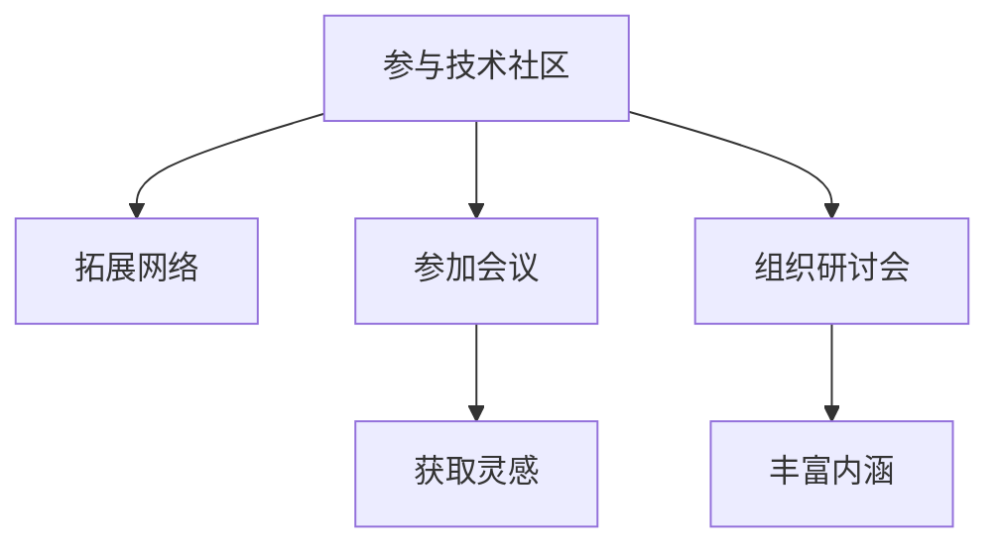

#### 3.4.3 跟踪行业动态

技术leader需要时刻关注行业动态，了解新兴技术和市场趋势。通过跟踪行业动态，技术leader可以及时调整自己的技术方向和个人品牌定位，确保品牌与市场需求的匹配。这可以通过订阅技术博客、关注行业报告、参与技术预测等方式实现。

**伪代码示例**：

```python
# 跟踪行业动态策略

def track_industry_dynamic():
    subscribe_to_blogs()
    read_industry_reports()
    participate_in_technical_predictions()

# 调用函数
track_industry_dynamic()
```

#### 3.4.4 收集反馈与改进

技术leader应积极收集来自同行、团队成员和读者的反馈，并据此进行改进。通过反馈，技术leader可以了解自己在哪些方面做得好，哪些方面需要改进，从而不断提升个人品牌的质量和影响力。

**Mermaid流程图**：

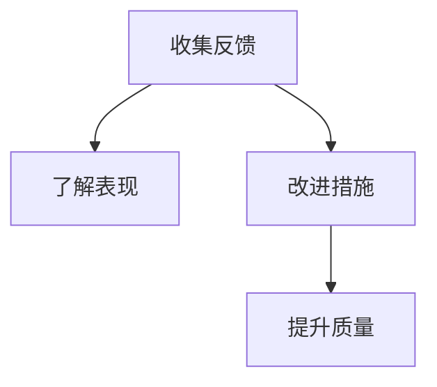

通过以上策略和方法，技术leader可以持续维护和优化自己的个人品牌，确保其在职业生涯中发挥最大的影响力。

### 4.1 社交网络的类型与优势

社交网络在技术leader的个人影响力提升中发挥着重要作用。社交网络可以分为内部社交网络、公共社交网络和专业社交网络三大类型，每种类型都有其独特的优势和适用场景。

#### 4.1.1 内部社交网络

内部社交网络主要指组织内部的沟通平台，如企业内部的社交媒体、邮件列表、即时通讯工具等。内部社交网络的优势在于：

1. **高效沟通**：内部社交网络为团队成员提供了即时、便捷的沟通渠道，有助于提高信息传递效率和协作效率。
2. **知识共享**：内部社交网络鼓励团队成员分享知识和经验，促进组织内部的知识传承和创新。
3. **团队凝聚力**：内部社交网络有助于加强团队成员之间的联系，提升团队凝聚力。

**Mermaid流程图**：


#### 4.1.2 公共社交网络

公共社交网络包括LinkedIn、Facebook、微博、Twitter等，这些平台为技术leader提供了广泛的受众和曝光机会。公共社交网络的优势在于：

1. **品牌推广**：技术leader可以通过公共社交网络发布专业内容，展示自己的技术能力和见解，提升个人品牌知名度。
2. **人才吸引**：强大的个人品牌能够吸引更多优秀人才关注和加入团队。
3. **跨行业合作**：公共社交网络有助于技术leader建立跨行业的联系，拓展合作机会。

**Mermaid流程图**：

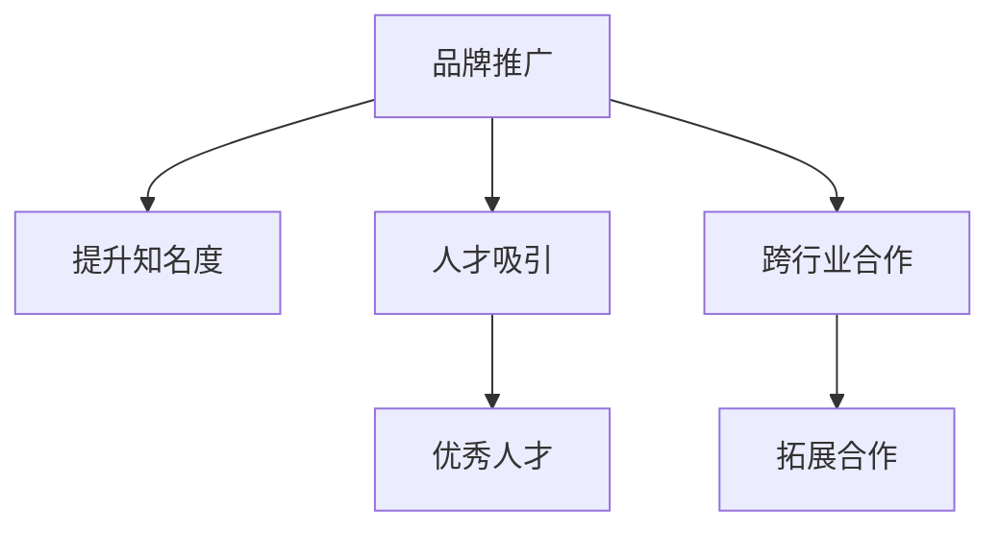

#### 4.1.3 专业社交网络

专业社交网络如GitHub、Stack Overflow、Reddit等，主要面向技术社区，为技术leader提供了展示技术专长和参与技术讨论的平台。专业社交网络的优势在于：

1. **技术交流**：技术leader可以在专业社交网络上分享技术经验和解决方案，与同行交流，提升自己的技术影响力。
2. **项目展示**：技术leader可以通过专业社交网络展示自己的项目成果，吸引潜在雇主或合作伙伴。
3. **技术趋势跟踪**：专业社交网络能够帮助技术leader及时了解技术趋势和前沿，保持技术竞争力。

**Mermaid流程图**：

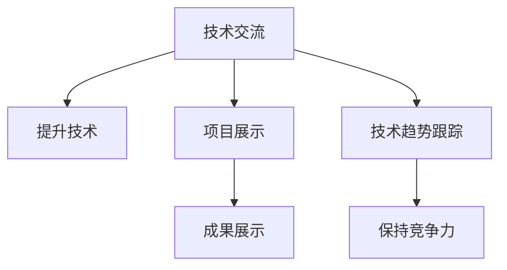

通过了解和利用不同类型的社交网络，技术leader可以为自己的个人影响力提升创造更多机会。

### 4.2 社交网络策略

#### 4.2.1 社交网络的内容策略

在社交网络上发布高质量的内容是提升个人影响力的重要手段。以下是内容策略的几个关键点：

1. **持续更新**：保持内容的持续更新，以维持关注者的兴趣和活跃度。定期发布技术博客、技术视频、项目进展等，展示自己的专业能力和持续进步。

2. **主题明确**：内容应围绕自己的专业领域和品牌定位，确保主题明确、内容专业。通过深入剖析技术原理、分享实战经验和行业洞察，提升内容的权威性和影响力。

3. **互动性**：鼓励读者参与互动，如评论、点赞、分享等。通过互动，不仅能够增加内容的曝光度，还能建立与读者的直接联系，增强个人品牌的影响力。

**Mermaid流程图**：

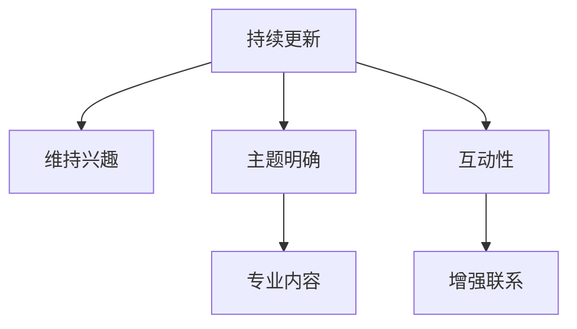

#### 4.2.2 社交网络的时间策略

发布内容的时间策略对内容的曝光和影响力有重要影响。以下是几个时间策略的建议：

1. **分析高峰期**：通过分析社交平台的数据，找出用户活跃度最高的时间段，如工作日的早晨和下午。在这些时间段发布内容，能够提高内容的曝光率。

2. **稳定发布**：保持固定的发布频率，如每周发布一到两次内容，以建立稳定的读者群体。这有助于培养读者的期待感，提高内容的长期影响力。

3. **节假日和特殊事件**：在节假日和特殊事件期间发布相关内容，如技术节、行业会议等，能够吸引更多关注和互动。

**Mermaid流程图**：

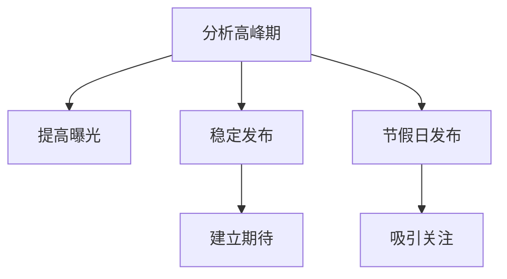

#### 4.2.3 社交网络的互动策略

互动是提升个人影响力的重要环节。以下是一些互动策略：

1. **及时回复**：对读者的评论和私信及时回复，展示自己的专业性和亲和力。这不仅能增加读者的满意度，还能建立更深层次的联系。

2. **参与讨论**：在社交平台上积极参与相关话题的讨论，分享自己的见解和经验。通过深度参与，能够扩大自己的影响力，吸引更多同行的关注。

3. **合作交流**：与其他技术领袖和专家建立合作和交流，通过共同的项目或活动，提升彼此的品牌影响力。

**Mermaid流程图**：


通过以上策略，技术leader可以更有效地利用社交网络，提升个人影响力，为职业发展和团队组织的目标实现创造更多机会。

### 4.3 公开演讲与会议主持

#### 4.3.1 公开演讲技巧

公开演讲是技术leader展示个人影响力的重要途径之一。以下是公开演讲的一些关键技巧：

1. **结构清晰**：演讲应具备明确的开始、中间和结尾，确保听众能够跟随演讲的逻辑和思路。可以通过引言、主体和总结三个部分来构建演讲结构。

2. **内容准备**：演讲内容应准备充分，确保信息的准确性和逻辑性。可以通过撰写演讲稿、制作PPT和进行模拟演练等方式来准备演讲。

3. **语言表达**：使用简洁明了的语言，避免使用复杂的技术术语。同时，注意语言的感染力，通过生动的案例和故事来增强演讲的吸引力。

**Mermaid流程图**：

```mermaid
graph TD
A[结构清晰] --> B[逻辑分明]
A --> C[内容准备] --> D[信息准确]
A --> E[语言表达] --> F[简洁明了]
```

#### 4.3.2 演讲表达技巧

演讲的表达技巧直接影响演讲的效果。以下是一些表达技巧：

1. **语速与音量**：控制好演讲的语速和音量，确保听众能够清晰听到演讲内容。在关键部分可以适当加快语速或提高音量，以吸引听众的注意。

2. **肢体语言**：运用恰当的肢体语言，如眼神交流、手势和表情，增强演讲的感染力和说服力。保持自信的姿态，展示自己的专业形象。

3. **互动与引导**：在演讲过程中，通过提问、互动和引导，与听众建立联系，提高听众的参与度和兴趣。

**Mermaid流程图**：

```mermaid
graph TD
A[语速与音量] --> B[清晰传达]
A --> C[肢体语言] --> D[增强感染力]
A --> E[互动与引导] --> F[提高参与度]
```

#### 4.3.3 会议主持技巧

会议主持是技术leader另一项重要的技能。以下是会议主持的一些关键技巧：

1. **明确目标**：会议开始前，明确会议的目标和议程，确保会议有明确的方向和目标。

2. **开场引导**：会议开始时，主持人应以简洁、有趣的方式开场，吸引听众的注意力，并简要介绍会议议程。

3. **控制时间**：确保会议在预定时间内完成，避免冗长的讨论和无意义的闲聊。可以设置时间提醒，确保每个议题都在规定的时间内讨论。

4. **处理冲突**：在会议过程中，可能会出现意见分歧和冲突。主持人应以中立和客观的态度处理冲突，确保会议的顺利进行。

**Mermaid流程图**：

```mermaid
graph TD
A[明确目标] --> B[方向明确]
A --> C[开场引导] --> D[吸引注意力]
A --> E[控制时间] --> F[确保进度]
A --> G[处理冲突] --> H[客观处理]
```

通过以上技巧，技术leader可以有效地进行公开演讲和会议主持，提升个人影响力和团队协作效果。

### 4.4.1 会议流程管理

有效的会议流程管理是确保会议顺利进行、高效达成目标的关键。以下是会议流程管理的几个关键点：

1. **明确会议目标**：在会议开始前，明确会议的目标和议程，确保所有与会者都清楚会议的目的和要达成的结果。可以通过编写会议议程，列出会议的主要议题和预计时间。

2. **开场致辞**：会议主持人应以简洁、有力的开场致辞，介绍会议的目标和议程，并邀请与会者积极参与讨论。开场致辞还可以包括对与会者的欢迎和对会议的期待。

3. **议题讨论**：在讨论议题时，应确保每个议题都有明确的时间分配，并按照议程顺序进行。主持人应引导与会者围绕议题展开讨论，确保讨论的深度和广度。

4. **时间控制**：会议主持人应严格控制会议时间，确保每个议题在预定的时间内完成。可以通过设定时间提醒或使用计时器来帮助控制时间，避免议题讨论过长或过短。

5. **总结与决策**：在会议结束时，主持人应对会议的讨论内容进行总结，明确决策和行动计划。这有助于确保会议成果的落实和后续工作的推进。

**Mermaid流程图**：

```mermaid
graph TD
A[明确会议目标] --> B[议程制定]
A --> C[开场致辞] --> D[目标介绍]
A --> E[议题讨论] --> F[时间分配]
A --> G[时间控制] --> H[计时提醒]
A --> I[总结与决策] --> J[行动计划]
```

通过有效的会议流程管理，技术leader可以确保会议的高效进行，提升会议成果，为团队和组织的发展创造更多价值。

### 4.4.2 会议沟通技巧

会议沟通技巧在会议主持和效果提升中扮演着关键角色。以下是一些会议沟通技巧：

1. **倾听与理解**：在会议中，主持人应积极倾听与会者的发言，确保理解他们的观点和需求。这可以通过认真听讲、保持目光接触和适当回应等方式实现。

2. **清晰表达**：主持人应以清晰、简洁的语言表达自己的观点和决策，确保与会者能够理解会议的内容和目标。

3. **引导讨论**：主持人应引导与会者围绕议题展开讨论，确保讨论的深度和广度。可以通过提问、归纳和总结等方式来引导讨论。

4. **解决冲突**：在会议过程中，可能会出现意见分歧和冲突。主持人应以中立和客观的态度处理冲突，通过倾听、协商和调解等方式，找到共识和解决方案。

5. **记录与跟进**：会议结束后，主持人应记录会议的关键内容和决策，并跟进行动计划的执行情况，确保会议成果的落实。

**Mermaid流程图**：

```mermaid
graph TD
A[倾听与理解] --> B[认真听讲]
A --> C[清晰表达] --> D[简洁表达]
A --> E[引导讨论] --> F[深入讨论]
A --> G[解决冲突] --> H[中立处理]
A --> I[记录与跟进] --> J[落实决策]
```

通过以上会议沟通技巧，技术leader可以提升会议的质量和效果，为团队和组织的发展创造更多价值。

### 4.4.3 问题解答与互动

在会议中，问题解答与互动是提升会议效果的重要环节。以下是一些问题解答与互动的技巧：

1. **开放性问题**：在会议中，主持人应鼓励与会者提出开放性问题，以便深入讨论和探索。开放性问题通常包含“如何”、“为什么”等引导词。

2. **引导性回答**：对于提出的问题，主持人应给出引导性回答，帮助与会者进一步思考和讨论。引导性回答可以引导与会者从不同角度分析问题，从而激发更多创意和解决方案。

3. **多方互动**：在解答问题的过程中，主持人应鼓励多方互动，确保不同观点和意见的碰撞。这可以通过邀请其他与会者补充发言、展开小组讨论等方式实现。

4. **反馈机制**：在会议结束后，主持人应收集与会者的反馈，了解会议的讨论效果和与会者的满意度。通过反馈，可以不断改进会议的组织和沟通方式。

**Mermaid流程图**：

```mermaid
graph TD
A[开放性问题] --> B[深入讨论]
A --> C[引导性回答] --> D[启发思考]
A --> E[多方互动] --> F[观点碰撞]
A --> G[反馈机制] --> H[持续改进]
```

通过以上技巧，技术leader可以提升会议中的问题解答与互动效果，为团队和组织的发展创造更多价值。

### 6.1 影响力评估与定位

#### 6.1.1 影响力评估模型

为了系统地提升个人影响力，技术leader需要首先对自身的影响力进行评估。以下是一个简单的影响力评估模型，可以帮助技术leader了解自身在各个维度上的影响力表现：

1. **技术能力评估**：评估技术leader在技术领域的专业能力和技术深度，包括掌握的核心技术、解决问题的能力、技术创新等。
2. **领导力评估**：评估技术leader的领导力水平，包括领导风格、团队管理能力、沟通技巧、决策能力等。
3. **个人品牌评估**：评估技术leader的个人品牌影响力，包括品牌知名度、品牌认知度、受众认可度等。
4. **社交网络评估**：评估技术leader在社交网络上的活跃度和影响力，包括社交媒体的关注度、参与度、互动性等。

**Mermaid流程图**：

```mermaid
graph TD
A[技术能力评估] --> B[核心技术]
A --> C[解决问题能力]
A --> D[技术创新]

A --> E[领导力评估] --> F[领导风格]
E --> G[团队管理能力]
E --> H[沟通技巧]
E --> I[决策能力]

A --> J[个人品牌评估] --> K[品牌知名度]
J --> L[品牌认知度]
J --> M[受众认可度]

A --> N[社交网络评估] --> O[社交媒体活跃度]
N --> P[参与度]
N --> Q[互动性]
```

#### 6.1.2 影响力定位分析

在完成影响力评估后，技术leader需要对自己的影响力进行定位分析。以下是几个关键步骤：

1. **目标设定**：根据自身评估结果，设定短期和长期的影响力目标。这些目标应具体、可量化，如提升技术能力、增加品牌知名度、拓展社交网络等。
2. **策略制定**：根据目标，制定相应的提升策略。这些策略应包括具体行动步骤、资源分配、时间安排等。
3. **执行与监控**：执行制定好的策略，并定期监控进展情况。通过数据分析和反馈，及时调整策略，确保目标的实现。

**Mermaid流程图**：

```mermaid
graph TD
A[目标设定] --> B[短期目标]
A --> C[长期目标]

A --> D[策略制定] --> E[行动步骤]
D --> F[资源分配]
D --> G[时间安排]

A --> H[执行与监控] --> I[数据监控]
H --> J[策略调整]
```

通过以上步骤，技术leader可以系统地提升自身的影响力，为职业发展和团队组织的目标实现奠定坚实基础。

### 6.2 影响力提升路径

#### 6.2.1 技术实力提升

技术实力是技术leader个人影响力的核心基础。以下是从多个方面提升技术实力的具体策略：

1. **深入学习新技术**：定期学习并掌握新技术，如人工智能、大数据、云计算等。这可以通过参加在线课程、阅读专业书籍、参加技术研讨会等方式实现。

2. **项目实践**：通过参与实际项目，将所学知识应用于实践中，提高解决问题的能力和技术深度。可以选择具有挑战性的项目，通过项目实践不断提升技术水平。

3. **技术分享**：通过撰写技术博客、发表学术论文、制作技术视频等方式，将技术心得和经验分享给他人。这不仅能够提升个人品牌，还能够巩固和深化自己的技术知识。

4. **参与开源项目**：参与开源项目，与其他开发者合作，了解最新的技术趋势和实践经验。这有助于提升技术视野和团队协作能力。

**Mermaid流程图**：

```mermaid
graph TD
A[深入学习新技术] --> B[掌握新技术]
A --> C[项目实践] --> D[解决问题能力]
C --> E[技术深度]

A --> F[技术分享] --> G[技术博客]
F --> H[学术论文]
F --> I[技术视频]

A --> J[参与开源项目] --> K[合作经验]
J --> L[技术趋势]
```

#### 6.2.2 领导力培养

领导力是技术leader个人影响力的关键要素。以下是从多个方面提升领导力的具体策略：

1. **领导力模型学习**：研究并学习不同的领导力模型，如情境领导模型、变革型领导模型等。通过理解不同领导力模型的特点和应用场景，选择适合自己风格的领导方式。

2. **团队管理实践**：在实际工作中，通过实践团队管理，提升团队管理能力和沟通技巧。可以尝试不同的领导风格，并根据团队和项目的实际情况进行调整。

3. **沟通技巧提升**：通过参加沟通技巧培训、阅读相关书籍等方式，提升沟通技巧。良好的沟通能力有助于建立团队的信任和合作，提升领导效果。

4. **个人发展计划**：制定个人发展计划，包括职业目标、学习计划、实践机会等。通过不断学习和实践，提升自身的领导力。

**Mermaid流程图**：

```mermaid
graph TD
A[领导力模型学习] --> B[理解模型]
A --> C[团队管理实践] --> D[管理能力]
C --> E[沟通技巧]

A --> F[沟通技巧提升] --> G[培训]
F --> H[书籍阅读]

A --> I[个人发展计划] --> J[目标设定]
I --> K[学习计划]
I --> L[实践机会]
```

#### 6.2.3 个人品牌塑造

个人品牌是技术leader在职业发展中的重要资产。以下是从多个方面提升个人品牌的策略：

1. **内容创作**：定期发布高质量的技术博客、技术视频和学术论文，展示自己的专业知识和独特见解。通过内容创作，提升个人品牌的知名度和影响力。

2. **社交媒体运营**：利用社交媒体平台，如LinkedIn、Twitter、微信公众号等，进行个人品牌的推广和宣传。通过发布专业内容、参与讨论和互动，扩大个人品牌的影响力。

3. **参与社区**：积极参与技术社区，如GitHub、Stack Overflow、Reddit等，分享自己的经验和见解，建立与同行的联系。通过在社区中的活跃参与，提升个人品牌的权威性。

4. **演讲与培训**：参加行业会议、技术论坛，进行公开演讲和培训。通过演讲与培训，展示自己的专业能力和领导力，提升个人品牌的影响力。

**Mermaid流程图**：

```mermaid
graph TD
A[内容创作] --> B[专业内容]
A --> C[社交媒体运营] --> D[推广]
C --> E[互动]

A --> F[参与社区] --> G[分享经验]
F --> H[建立联系]

A --> I[演讲与培训] --> J[展示能力]
I --> K[影响力提升]
```

通过以上策略，技术leader可以全面提升个人影响力，为职业发展和团队组织的目标实现奠定坚实基础。

### 7.1 案例介绍

#### 7.1.1 案例背景

本案例以一家知名的互联网公司为例，该公司拥有一支由多名技术leader带领的研发团队。公司业务涵盖了多个领域，包括电子商务、大数据分析、人工智能等。团队的技术leader小王，在公司担任技术总监，负责团队的技术方向和项目管理工作。然而，小王在个人影响力方面存在一些问题，主要体现在以下几个方面：

1. **技术能力不足**：尽管小王在团队管理方面表现出色，但其技术能力相对于行业前沿有所落后，导致在技术决策和项目推进中缺乏足够的权威性。
2. **领导力欠缺**：小王的领导风格较为保守，缺乏变革和创新的精神，这在一定程度上限制了团队的发展和创新能力。
3. **个人品牌不突出**：小王在个人品牌建设方面投入较少，知名度较低，缺乏对团队和组织的显著影响力。
4. **社交网络不活跃**：小王在社交网络上的活跃度较低，缺乏与同行的深入互动和交流，限制了个人影响力的扩展。

#### 7.1.2 案例目标

为了提升个人影响力，小王制定了以下目标：

1. **技术能力提升**：通过学习新技术和参与开源项目，提升自身的技术能力，保持在行业前沿。
2. **领导力培养**：通过参加领导力培训和团队管理实践，提升领导力，增强团队的凝聚力和创新能力。
3. **个人品牌建设**：通过内容创作和社交媒体运营，提升个人品牌知名度，建立专业权威形象。
4. **社交网络拓展**：通过积极参与技术社区和行业活动，扩大社交网络，建立广泛的行业联系。

### 7.2 案例实施过程

#### 7.2.1 技术提升策略

为了提升技术能力，小王采取了以下策略：

1. **学习新技术**：小王通过参加线上和线下课程，学习人工智能、大数据分析等前沿技术，并关注相关技术博客和行业报告，及时掌握技术动态。

2. **参与开源项目**：小王积极参与开源项目，通过贡献代码和解决方案，提升自己的技术视野和团队协作能力。

3. **技术分享**：小王定期撰写技术博客，分享自己的技术心得和项目经验，通过技术社区和公司内部平台发布，提升个人品牌的知名度。

**伪代码示例**：

```python
# 技术提升策略伪代码

def tech_improvement():
    # 学习新技术
    learn_new_tech('AI', 'Big Data')

    # 参与开源项目
    contribute_to_open_source('Project X', 'Project Y')

    # 技术分享
    publish_blog('Tech Blog')

tech_improvement()
```

#### 7.2.2 领导力培养策略

为了提升领导力，小王采取了以下策略：

1. **领导力培训**：小王参加了领导力培训课程，学习不同的领导力模型和管理技巧，如情境领导模型、变革型领导模型等。

2. **团队管理实践**：小王在实际工作中，通过实践团队管理，提升团队管理能力和沟通技巧。他尝试了不同的领导风格，并根据团队和项目的实际情况进行调整。

3. **团队建设活动**：小王定期组织团队建设活动，如技术分享会、团建活动等，增强团队的凝聚力和协作能力。

**伪代码示例**：

```python
# 领导力培养策略伪代码

def leadership_development():
    # 领导力培训
    attend_leadership_training()

    # 团队管理实践
    practice_team_management()

    # 团队建设活动
    organize_team_building_activities()

leadership_development()
```

#### 7.2.3 个人品牌塑造策略

为了提升个人品牌，小王采取了以下策略：

1. **内容创作**：小王定期发布高质量的技术博客，分享自己在技术领域的见解和经验。他的博客内容涵盖了新技术介绍、项目实战解析等，吸引了大量读者的关注。

2. **社交媒体运营**：小王利用LinkedIn、Twitter等社交媒体平台，发布专业内容，参与行业讨论，扩大个人品牌的影响力。

3. **参与社区**：小王积极参与GitHub、Reddit等技术社区，分享自己的项目和经验，与其他开发者互动，建立广泛的行业联系。

**伪代码示例**：

```python
# 个人品牌塑造策略伪代码

def personal_brand_building():
    # 内容创作
    publish_high_quality_blogs()

    # 社交媒体运营
    operate_social_media_platforms()

    # 参与社区
    participate_in_technical_communities()

personal_brand_building()
```

#### 7.2.4 社交网络拓展策略

为了拓展社交网络，小王采取了以下策略：

1. **建立联系**：小王通过参加行业会议、技术论坛等活动，与其他技术专家和行业领袖建立联系。他利用这些机会，扩大自己的社交圈，增强个人影响力。

2. **互动交流**：小王在社交网络上积极参与讨论，分享自己的见解和经验，与其他开发者互动。他定期更新自己的社交媒体状态，保持与同行的紧密联系。

**伪代码示例**：

```python
# 社交网络拓展策略伪代码

def social_network_expansion():
    # 建立联系
    build_connections()

    # 互动交流
    engage_in_interactive_discussions()

social_network_expansion()
```

通过以上策略的实施，小王在技术能力、领导力、个人品牌和社交网络等方面取得了显著提升，个人影响力也得到了大幅增强。

### 7.3 案例效果分析

#### 7.3.1 影响力提升效果

通过实施上述策略，小王在多个方面实现了个人影响力的显著提升：

1. **技术能力**：小王通过学习新技术和参与开源项目，提升了自身的技术能力，保持在行业前沿。他在公司内部的项目决策中，能够提出更具前瞻性和创新性的技术方案，获得了团队和上级的高度认可。

2. **领导力**：小王通过领导力培训和团队管理实践，提升了领导力和团队管理能力。他在团队中的领导风格更加开放和鼓励创新，增强了团队的凝聚力和协作效率，团队的整体绩效得到了显著提升。

3. **个人品牌**：小王通过内容创作和社交媒体运营，建立了强大的个人品牌。他的技术博客在业内获得了广泛关注，不少同行纷纷转载和评论，小王的知名度大幅提升，成为业内知名的技术专家。

4. **社交网络**：小王通过参加行业会议、技术论坛等活动，建立了广泛的行业联系。他在社交网络上的互动和分享，使得他的专业影响力得到了进一步扩展，吸引了更多的潜在合作伙伴和优秀人才。

#### 7.3.2 对团队和组织的贡献

小王的影响力提升不仅对个人职业发展产生了积极影响，还对团队和组织的发展做出了重要贡献：

1. **技术创新**：小王在技术能力提升的基础上，推动了团队在多个项目中的技术创新。他的前瞻性技术方案，为公司带来了显著的竞争优势，推动了业务的快速发展。

2. **团队凝聚力**：小王通过领导力培养和个人品牌建设，增强了团队的凝聚力和归属感。团队成员更加信任和尊重小王，愿意主动参与团队建设和项目工作，团队的协作效率显著提升。

3. **知识传承**：小王在技术博客和社交媒体上的分享，不仅提升了个人品牌，还促进了团队内部的知识传承。团队成员通过学习小王的经验和见解，快速提升了自身的技术能力和业务水平。

4. **组织发展**：小王的影响力提升，为组织带来了更多外部合作机会和优秀人才。他的专业声誉吸引了更多的合作伙伴和投资者，为公司的发展注入了新的动力。

通过以上贡献，小王不仅提升了个人影响力，还为团队和组织的发展做出了重要贡献，成为公司的重要资产和核心竞争力。

### 8.1 成果总结

在本案例中，技术leader小王通过系统的个人影响力提升策略，取得了显著成果。以下是具体成果总结：

1. **技术能力显著提升**：小王通过学习新技术和参与开源项目，掌握了人工智能、大数据分析等前沿技术，保持在行业前沿。他能够在项目决策中提出创新性的技术方案，提升了团队的技术水平和竞争力。

2. **领导力增强**：通过领导力培训和团队管理实践，小王的领导力得到了显著提升。他采用了开放和鼓励创新的领导风格，增强了团队的凝聚力和协作效率，团队的整体绩效大幅提升。

3. **个人品牌影响力扩大**：小王通过内容创作和社交媒体运营，成功塑造了强大的个人品牌。他的技术博客在业内获得了广泛关注，知名度大幅提升，成为业内知名的技术专家。

4. **社交网络拓展成功**：小王积极参与行业会议、技术论坛等活动，建立了广泛的行业联系。他在社交网络上的互动和分享，使得他的影响力得到了进一步扩展，吸引了更多潜在合作伙伴和优秀人才。

通过这些成果，小王不仅提升了个人影响力，还为团队和组织的发展做出了重要贡献，成为公司的重要资产和核心竞争力。

### 8.2 遇到的问题与解决方案

在个人影响力提升的过程中，小王遇到了一些问题和挑战，以下是具体问题和解决方案：

#### 问题1：时间管理困难

**问题描述**：由于工作繁忙，小王在个人影响力提升方面面临时间管理困难，难以平衡工作与个人发展。

**解决方案**：小王通过制定详细的时间管理计划，将个人发展任务分解为小块，合理安排时间。他利用周末和空闲时间进行学习、项目实践和内容创作，确保个人发展不受影响。

#### 问题2：技术领域知识更新迅速

**问题描述**：技术领域知识更新迅速，小王感到难以跟上最新的技术动态。

**解决方案**：小王定期参加技术研讨会和培训课程，关注行业报告和技术博客，确保及时了解最新的技术趋势。他还通过参与开源项目，将所学知识应用于实践中，不断提升自身的技术能力。

#### 问题3：社交网络互动不足

**问题描述**：小王在社交网络上的互动不足，限制了个人影响力的扩展。

**解决方案**：小王通过制定社交媒体运营计划，定期发布高质量内容，积极参与行业讨论和互动。他还利用参加行业活动和会议的机会，与其他技术专家和行业领袖建立联系，扩大社交网络。

通过以上解决方案，小王有效应对了个人影响力提升过程中的问题和挑战，取得了显著成果。

### 8.3 未来展望

未来，个人影响力的提升将继续成为技术leader的重要课题。以下是对未来发展趋势的展望：

1. **技术趋势融合**：随着新兴技术的不断涌现，技术leader需要具备跨领域的综合能力，如人工智能、大数据、物联网等技术的融合应用。

2. **领导力持续发展**：领导力不仅仅是管理能力，更是领导艺术的体现。技术leader需要不断学习新的领导理论和方法，提升自身领导力。

3. **个人品牌专业化**：个人品牌将成为技术leader职业发展的关键因素。未来的个人品牌建设将更加专业化，技术leader需要精准定位个人品牌，打造独特的专业形象。

4. **社交网络多样化**：随着社交媒体和在线社区的不断发展，技术leader的社交网络将更加多样化，涵盖内部社交网络、公共社交网络和专业社交网络等多个层面。

5. **跨行业合作加强**：技术leader将在跨行业合作中发挥更大的作用，通过技术解决方案和创新思维，推动不同行业的发展。

通过以上趋势的把握，技术leader可以更好地提升个人影响力，为团队和组织的发展创造更多价值。

---

**作者：AI天才研究院/AI Genius Institute & 禅与计算机程序设计艺术 /Zen And The Art of Computer Programming**

