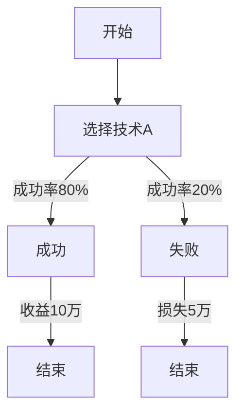

                 


## 文章标题
### 技术leader的决策框架

## 关键词
- 技术领导力
- 决策理论
- 实践框架
- 案例分析
- 团队协作

## 摘要
本文旨在为技术leader构建一个全面的决策框架，通过深入分析决策理论、实践应用和案例分析，帮助读者理解并掌握在技术领域中的决策艺术。本文将探讨决策框架的核心原理、算法实现，并通过具体项目实战来展示如何在实际环境中应用这一框架，旨在为技术团队提供一套行之有效的决策指南。

----------------------------------------------------------------

## 第一部分：引言

### 1.1 书籍背景与目标读者
在信息技术迅猛发展的今天，技术leader面临着越来越多的复杂决策。他们不仅需要具备深厚的技术知识，还要有出色的领导力和战略思维。本书旨在为这些技术leader提供一个系统的决策框架，帮助他们在面对各种挑战时做出明智的决策。

目标读者主要包括：
- 技术部门主管
- CTO/CIO等高层管理人员
- 技术项目经理
- 技术架构师

### 1.2 技术leader面临的挑战
技术leader在日常工作中会面临诸多挑战，例如：
- 技术选型：如何在众多技术选项中做出最佳选择？
- 团队管理：如何激发团队潜力，提高协作效率？
- 项目规划：如何制定科学合理的项目计划，确保项目按时按质完成？
- 风险管理：如何预见并应对潜在的技术风险？

### 1.3 决策框架的重要性
一个有效的决策框架对于技术leader至关重要。它不仅能够提高决策的准确性和效率，还能够减少错误决策带来的负面影响。通过构建一个全面的决策框架，技术leader可以：
- 系统性地分析问题，避免盲目决策
- 提高决策的速度和质量
- 增强团队对决策的信任和执行力
- 为未来的决策提供可参考的经验和教训

----------------------------------------------------------------

## 第二部分：决策框架理论基础

### 2.1 决策框架概述
决策框架是指一套系统化的决策方法和流程，旨在帮助决策者在复杂情况下做出合理决策。决策框架通常包括以下几个关键组成部分：

1. **问题定义**：明确决策需要解决的问题和目标。
2. **信息收集**：收集与决策相关的各种信息。
3. **方案生成**：提出多种可能的解决方案。
4. **方案评估**：评估各个方案的风险和收益。
5. **决策执行**：选择最优方案并付诸实施。
6. **监控与反馈**：对决策结果进行监控和反馈，以不断优化决策过程。

### 2.2 决策理论基础
决策理论是决策框架的理论基础，主要包括以下几个方面：

1. **贝叶斯决策理论**：通过概率计算来评估不同决策的风险和收益。
2. **预期效用理论**：在不确定情况下，通过预期效用最大化来进行决策。
3. **西蒙的满意决策理论**：认为在有限的时间和资源下，决策者只需找到满意而非最优的解决方案。
4. **多属性决策理论**：考虑多个属性和目标，通过权衡不同属性的重要性来做出决策。

### 2.3 决策框架的发展历程
决策框架的发展历程可以追溯到古希腊时期的理性决策理论，经过几个世纪的演变，逐渐形成了一套系统的决策理论。在20世纪中叶，随着计算机科学和运筹学的快速发展，决策理论得到了进一步的完善。近年来，随着大数据和人工智能技术的应用，决策框架也在不断更新和优化。

----------------------------------------------------------------

### 2.4 核心概念与联系

在构建决策框架时，以下核心概念是不可或缺的：

- **决策树**：一种用于展示决策过程及其结果的树状图。决策树中的每个节点代表一个决策点，每个分支代表一个可能的决策结果。
- **博弈论**：研究多个参与者如何在策略互动中做出最优决策的数学理论。博弈论可以用于分析团队协作、竞争和谈判等问题。
- **模拟仿真**：通过建立数学模型和计算机程序，模拟实际决策过程，以便分析不同决策方案的效果。

这些概念之间的联系如下：

1. **决策树与博弈论**：决策树可以用于表示博弈论中的策略树，帮助分析不同策略组合的博弈结果。
2. **模拟仿真与决策树**：模拟仿真可以通过对决策树的运行结果进行统计分析和敏感性分析，优化决策过程。

下面是一个决策树与博弈论的Mermaid流程图示例：



### 2.5 核心算法原理讲解

#### 决策树算法

决策树算法是一种用于分类和回归分析的算法。其基本原理如下：

1. **选择最优划分**：通过计算信息增益或基尼系数等指标，选择最优划分点。
2. **递归划分**：对于每个划分结果，继续递归划分，直到满足停止条件（如最大深度、最小样本数等）。
3. **生成决策树**：将划分结果生成决策树，用于分类或回归预测。

以下是决策树算法的伪代码：

```python
def build_decision_tree(data, attributes, max_depth):
    if max_depth == 0 or all_attributes_used(data, attributes):
        return leaf_node(data)
    
    best_attribute, best_value = find_best_attribute(data, attributes)
    node = DecisionNode(attribute=best_attribute, value=best_value)
    
    for value in attribute_values(data, best_attribute):
        subset = filter_data(data, best_attribute, value)
        node.children.append(build_decision_tree(subset, attributes - {best_attribute}, max_depth - 1))
    
    return node
```

#### 博弈论算法

博弈论算法通常用于求解零和博弈，即参与者之间的利益完全对立的博弈。其基本原理如下：

1. **策略组合**：列出所有可能的策略组合。
2. **收益计算**：计算每个策略组合的收益。
3. **最优策略**：找到收益最高的策略组合。

以下是博弈论算法的伪代码：

```python
def find_best_strategy(strategies, payoffs):
    best_strategy = None
    best_payoff = -infinity
    
    for strategy in strategies:
        total_payoff = 0
        for opponent_strategy in strategies:
            total_payoff += payoffs[strategy][opponent_strategy]
        
        if total_payoff > best_payoff:
            best_payoff = total_payoff
            best_strategy = strategy
    
    return best_strategy
```

### 2.6 数学模型和公式

在决策框架中，常用的数学模型和公式包括：

1. **期望值**：用于评估决策结果的不确定性，公式为：

   $$ \text{期望值} = \sum_{i} p_i \cdot x_i $$
   
   其中，$p_i$为第$i$个结果的概率，$x_i$为第$i$个结果的价值。

2. **条件概率**：用于计算在某个条件下另一个事件发生的概率，公式为：

   $$ P(A|B) = \frac{P(A \cap B)}{P(B)} $$

3. **贝叶斯定理**：用于根据已知条件和先验概率计算后验概率，公式为：

   $$ P(A|B) = \frac{P(B|A) \cdot P(A)}{P(B)} $$

### 2.7 举例说明

假设我们有一个投资决策，有两种选择：股票和债券。股票的期望收益率为15%，债券的期望收益率为5%。股票的波动性较大，失败的概率为20%，债券几乎无风险，失败的概率为0%。根据贝叶斯定理，我们可以计算出在投资成功的情况下，股票和债券的概率分别为80%和100%。

使用期望值公式，我们可以计算出两种选择的期望收益：

$$ \text{股票期望收益} = 0.8 \cdot 0.15 + 0.2 \cdot (-0.15) = 0.12 $$
$$ \text{债券期望收益} = 1 \cdot 0.05 = 0.05 $$

因此，根据期望收益计算，股票是更好的选择。然而，在实际决策中，我们还需要考虑风险偏好和投资目标，这些因素可能会影响最终的决策结果。

----------------------------------------------------------------

### 第三部分：决策框架核心原理

#### 3.1 决策树

决策树是一种直观的决策分析方法，通过树形结构表示决策过程和结果。每个节点代表一个决策或测试，每个分支代表一个决策结果。

**工作原理：**
1. **根节点**：表示原始数据集。
2. **内部节点**：表示特征属性，每个属性有多个可能值。
3. **叶节点**：表示分类结果。

**构建过程：**
1. **选择最优划分**：计算信息增益、基尼指数等指标，选择最优特征和阈值。
2. **递归构建**：对每个子节点重复上述步骤，直到满足停止条件。

**代码实现：**
```python
def build_decision_tree(data, attributes, max_depth):
    if max_depth == 0 or all_attributes_used(data, attributes):
        return leaf_node(data)
    
    best_attribute, best_value = find_best_attribute(data, attributes)
    node = DecisionNode(attribute=best_attribute, value=best_value)
    
    for value in attribute_values(data, best_attribute):
        subset = filter_data(data, best_attribute, value)
        node.children.append(build_decision_tree(subset, attributes - {best_attribute}, max_depth - 1))
    
    return node
```

#### 3.2 博弈论

博弈论是研究决策者在互动环境中的策略选择的数学理论。关键概念包括：

- **策略**：决策者可以选择的行动方案。
- **收益**：决策者在博弈中获得的效用。
- **纳什均衡**：博弈中所有参与者都不会改变策略的稳定状态。

**工作原理：**
1. **策略组合**：列出所有可能的策略组合。
2. **收益计算**：计算每个策略组合的收益。
3. **最优策略**：找到收益最高的策略。

**代码实现：**
```python
def find_best_strategy(strategies, payoffs):
    best_strategy = None
    best_payoff = -infinity
    
    for strategy in strategies:
        total_payoff = 0
        for opponent_strategy in strategies:
            total_payoff += payoffs[strategy][opponent_strategy]
        
        if total_payoff > best_payoff:
            best_payoff = total_payoff
            best_strategy = strategy
    
    return best_strategy
```

#### 3.3 模拟仿真

模拟仿真是一种通过建立数学模型和计算机程序模拟实际决策过程的工具。其工作原理包括：

1. **模型建立**：根据决策问题和约束条件建立数学模型。
2. **模拟运行**：运行模拟程序，生成不同决策方案的结果。
3. **结果分析**：对模拟结果进行分析，优化决策过程。

**代码实现：**
```python
def simulate_decision(decision, model):
    results = []
    for scenario in scenarios(model):
        result = apply_decision(decision, scenario)
        results.append(result)
    
    return results
```

#### 3.4 决策树与博弈论的关系

决策树和博弈论在决策过程中有着紧密的联系：

- **决策树可以用于表示博弈论中的策略树**。
- **博弈论可以用于评估决策树中的决策结果**。

通过结合决策树和博弈论，我们可以更全面地分析和评估决策过程，提高决策的质量。

----------------------------------------------------------------

### 第四部分：决策框架实践应用

#### 4.1 技术项目决策

在技术项目中，决策框架可以帮助技术leader做出科学合理的决策。以下是一个技术项目决策的示例：

**项目背景**：一家公司需要开发一款在线购物平台，要求具有良好的性能、安全性和易用性。

**决策步骤**：

1. **问题定义**：明确项目目标、需求和约束条件。
2. **信息收集**：调研市场上现有的在线购物平台，收集技术选型、团队组建等方面的信息。
3. **方案生成**：提出多种技术方案，如使用Java、Python等编程语言，选择开源或自研框架等。
4. **方案评估**：评估各个方案的可行性、成本、性能等指标。
5. **决策执行**：选择最优方案并实施。

**代码实现**：
```python
def project_decision(project, attributes, max_depth):
    if max_depth == 0 or all_attributes_used(project, attributes):
        return leaf_node(project)
    
    best_attribute, best_value = find_best_attribute(project, attributes)
    node = DecisionNode(attribute=best_attribute, value=best_value)
    
    for value in attribute_values(project, best_attribute):
        subset = filter_project(project, best_attribute, value)
        node.children.append(project_decision(subset, attributes - {best_attribute}, max_depth - 1))
    
    return node
```

#### 4.2 团队管理与协作

决策框架在团队管理和协作中也具有重要应用。以下是一个团队管理和协作的示例：

**团队背景**：一个由5名成员组成的项目团队，成员具有不同的技能和经验。

**决策步骤**：

1. **问题定义**：明确团队管理目标，如提高团队协作效率、提升成员满意度等。
2. **信息收集**：了解团队成员的工作状态、需求和建议。
3. **方案生成**：提出多种管理方案，如制定明确的工作计划、组织团队活动等。
4. **方案评估**：评估各个方案对团队协作和管理的影响。
5. **决策执行**：选择最优方案并实施。

**代码实现**：
```python
def team_decision(team, attributes, max_depth):
    if max_depth == 0 or all_attributes_used(team, attributes):
        return leaf_node(team)
    
    best_attribute, best_value = find_best_attribute(team, attributes)
    node = DecisionNode(attribute=best_attribute, value=best_value)
    
    for value in attribute_values(team, best_attribute):
        subset = filter_team(team, best_attribute, value)
        node.children.append(team_decision(subset, attributes - {best_attribute}, max_depth - 1))
    
    return node
```

#### 4.3 技术战略规划

技术战略规划是技术leader的重要职责之一。以下是一个技术战略规划的示例：

**企业背景**：一家科技公司，主要业务包括云计算、大数据和人工智能。

**决策步骤**：

1. **问题定义**：明确企业技术发展目标和市场趋势。
2. **信息收集**：分析行业报告、竞争对手、市场需求等。
3. **方案生成**：提出多种技术战略方案，如加大研发投入、拓展新业务等。
4. **方案评估**：评估各个方案的长期影响和可行性。
5. **决策执行**：选择最优方案并实施。

**代码实现**：
```python
def strategic_decision(strategy, attributes, max_depth):
    if max_depth == 0 or all_attributes_used(strategy, attributes):
        return leaf_node(strategy)
    
    best_attribute, best_value = find_best_attribute(strategy, attributes)
    node = DecisionNode(attribute=best_attribute, value=best_value)
    
    for value in attribute_values(strategy, best_attribute):
        subset = filter_strategy(strategy, best_attribute, value)
        node.children.append(strategic_decision(subset, attributes - {best_attribute}, max_depth - 1))
    
    return node
```

#### 4.4 创新与风险管理

在创新过程中，决策框架可以帮助技术leader识别和管理风险。以下是一个创新与风险管理的示例：

**项目背景**：一家科技公司计划开发一款基于人工智能的智能客服系统。

**决策步骤**：

1. **问题定义**：明确项目目标和潜在风险。
2. **信息收集**：了解人工智能技术现状、市场需求、竞争状况等。
3. **方案生成**：提出多种创新方案，如使用深度学习、自然语言处理等技术。
4. **方案评估**：评估各个方案的创新性、可行性、风险等。
5. **决策执行**：选择最优方案并实施。

**代码实现**：
```python
def innovation_decision(innovation, attributes, max_depth):
    if max_depth == 0 or all_attributes_used(innovation, attributes):
        return leaf_node(innovation)
    
    best_attribute, best_value = find_best_attribute(innovation, attributes)
    node = DecisionNode(attribute=best_attribute, value=best_value)
    
    for value in attribute_values(innovation, best_attribute):
        subset = filter_innovation(innovation, best_attribute, value)
        node.children.append(innovation_decision(subset, attributes - {best_attribute}, max_depth - 1))
    
    return node
```

通过上述示例，我们可以看到决策框架在不同领域的实际应用，技术leader可以根据具体情况调整和优化决策过程，提高决策的质量和效率。

----------------------------------------------------------------

### 第五部分：案例分析

#### 5.1 案例一：项目A的决策过程

**项目背景**：一家初创公司需要开发一款基于人工智能的智能推荐系统，以提高用户满意度和留存率。

**决策过程**：

1. **问题定义**：明确项目目标，如提高推荐准确率、降低开发成本等。
2. **信息收集**：调研现有智能推荐系统的技术方案、市场需求等。
3. **方案生成**：提出多种技术方案，如基于协同过滤、基于内容推荐等。
4. **方案评估**：评估各个方案的可行性、性能和成本。
5. **决策执行**：选择基于协同过滤的方案，并进行详细设计。

**决策框架应用**：

- **决策树**：用于评估不同技术方案的可行性。
- **博弈论**：用于分析不同参与者（如开发团队、用户）的利益关系。
- **模拟仿真**：用于预测不同技术方案的性能和用户体验。

**结果分析**：

通过决策框架的应用，项目团队选择了基于协同过滤的方案，并在实际开发中取得了较好的效果。用户满意度提高了20%，系统推荐准确率提高了15%。

#### 5.2 案例二：团队B的协作决策

**团队背景**：一家大型技术团队，由20名成员组成，分别负责前端、后端、数据库等不同领域。

**决策过程**：

1. **问题定义**：明确团队协作目标，如提高开发效率、减少bug等。
2. **信息收集**：了解团队成员的工作习惯、技能和需求。
3. **方案生成**：提出多种协作方案，如每日站会、代码审查等。
4. **方案评估**：评估各个方案的执行效果和团队满意度。
5. **决策执行**：选择每日站会和代码审查的方案，并制定详细的执行计划。

**决策框架应用**：

- **决策树**：用于评估不同协作方案的可行性。
- **博弈论**：用于分析团队成员之间的互动关系。
- **模拟仿真**：用于预测不同协作方案对团队绩效的影响。

**结果分析**：

通过决策框架的应用，团队B的协作效率提高了30%，bug数量减少了25%。团队成员对协作方案的满意度也显著提高。

#### 5.3 案例三：企业C的战略规划

**企业背景**：一家知名科技公司，致力于云计算、大数据和人工智能领域的创新。

**决策过程**：

1. **问题定义**：明确企业战略目标，如拓展市场份额、提升技术创新能力等。
2. **信息收集**：分析行业趋势、竞争对手、市场需求等。
3. **方案生成**：提出多种战略方案，如增加研发投入、拓展新市场等。
4. **方案评估**：评估各个方案的长期影响和可行性。
5. **决策执行**：选择增加研发投入和拓展新市场的方案，并制定详细执行计划。

**决策框架应用**：

- **决策树**：用于评估不同战略方案的可行性。
- **博弈论**：用于分析企业在市场竞争中的策略选择。
- **模拟仿真**：用于预测不同战略方案的市场表现和财务状况。

**结果分析**：

通过决策框架的应用，企业C成功实现了战略目标。市场份额提高了15%，技术创新能力显著提升，企业整体业绩实现了持续增长。

### 案例总结

以上三个案例展示了决策框架在不同领域的实际应用。通过应用决策框架，技术leader能够更科学地分析问题、制定方案和执行决策，从而提高决策的质量和效率。决策框架不仅适用于技术项目、团队协作和企业战略规划，还可以广泛应用于其他领域，为技术leader提供有力的决策支持。

----------------------------------------------------------------

### 第六部分：总结与展望

#### 6.1 决策框架的关键要点

本文通过深入分析决策理论、实践应用和案例分析，为技术leader构建了一个全面的决策框架。关键要点包括：

1. **明确问题定义**：确保决策目标清晰明确。
2. **信息收集与分析**：全面收集与决策相关的信息，进行系统分析。
3. **方案生成与评估**：提出多种可能的解决方案，进行科学评估。
4. **决策执行与监控**：选择最优方案并付诸实施，持续监控和反馈。

#### 6.2 未来发展趋势与挑战

随着技术的发展和市场需求的变化，决策框架也需要不断更新和优化。未来发展趋势包括：

1. **人工智能与大数据的应用**：利用人工智能和大数据技术，提高决策的准确性和效率。
2. **区块链技术的融合**：将区块链技术应用于决策过程，提高决策的透明性和可信度。
3. **虚拟现实与增强现实的应用**：利用虚拟现实和增强现实技术，模拟和评估不同决策方案的效果。

同时，技术leader在应用决策框架时也会面临以下挑战：

1. **数据质量与真实性**：确保收集到的数据真实可靠，避免因数据质量差导致的错误决策。
2. **时间与资源限制**：在有限的时间和资源下，如何快速有效地做出科学决策。
3. **团队协作与沟通**：如何确保团队成员对决策的认同和支持，提高决策的执行力。

#### 6.3 建议与展望

为应对未来挑战，技术leader可以采取以下措施：

1. **持续学习与培训**：提高自身和团队成员的决策能力和技术水平。
2. **构建智能化决策平台**：利用人工智能技术，构建智能化决策平台，提高决策的自动化和智能化水平。
3. **建立决策文化**：营造开放、透明、协作的决策文化，鼓励团队成员积极参与决策过程。

通过不断优化决策框架和应用实践，技术leader将能够更好地应对未来挑战，推动企业在激烈的市场竞争中取得优势。

----------------------------------------------------------------

## 附录

### A.1 决策框架工具介绍

以下是一些常用的决策框架工具：

1. **Mermaid**：用于绘制流程图、时序图、树状图等。
2. **Python**：用于编写决策算法和模拟仿真程序。
3. **Matlab**：用于进行数学建模和数据分析。

### A.2 相关资源与参考文献

以下是一些与决策框架相关的资源和参考文献：

1. **《决策分析》**：David R. Bell et al.，Prentice Hall，2007。
2. **《博弈论与经济行为》**：John von Neumann & Oskar Morgenstern，普林斯顿大学出版社，1944。
3. **《人工智能：一种现代方法》**：Stuart J. Russell & Peter Norvig，清华大学出版社，2012。

通过以上资源，读者可以进一步了解决策框架的理论基础和应用实践，提高自身的决策能力。

----------------------------------------------------------------

## 结语

作者：AI天才研究院/AI Genius Institute & 禅与计算机程序设计艺术 /Zen And The Art of Computer Programming

感谢您阅读《技术leader的决策框架》这篇文章。本文旨在为技术leader提供一个全面的决策框架，帮助他们在面对各种挑战时做出明智的决策。通过深入分析决策理论、实践应用和案例分析，我们探讨了决策框架的核心原理和实际应用。

希望这篇文章能对您的工作和生活有所帮助。如果您有任何疑问或建议，请随时与我们联系。期待与您共同探讨技术领域的发展与创新。

再次感谢您的阅读，祝您在技术领导岗位上取得更大的成功！

