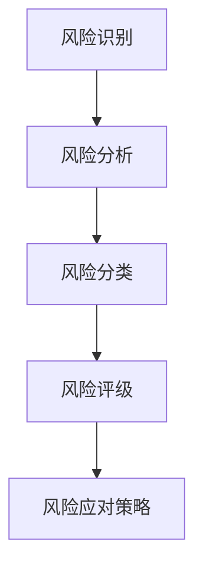

                 


### 引言：技术leader的角色与责任

技术leader在现代企业中扮演着至关重要的角色。他们不仅需要具备深厚的技术功底，还必须具备卓越的领导能力和决策智慧。在这篇文章中，我们将探讨技术leader的角色与责任，并深入探讨如何构建一个有效的决策框架。

#### 技术leader的角色

技术leader在企业中通常担任以下几个关键角色：

1. **技术指导者**：技术leader是团队的技术核心，他们需要引领团队在技术发展方向上保持领先地位。他们负责制定技术路线图，指导团队在复杂的技术难题中找到解决方案。

2. **团队领导者**：技术leader不仅是技术专家，也是团队的领导者。他们需要激励团队成员，确保团队保持高效的工作状态，并协调团队成员之间的合作。

3. **沟通桥梁**：技术leader需要充当企业内部和外部沟通的桥梁。他们需要向管理层解释技术问题，同时也要向技术团队传达业务需求。

4. **创新推动者**：技术leader要推动技术创新，不断寻找新的技术突破，以提升企业的竞争力。

#### 技术leader的责任

技术leader承担的责任非常重大，主要包括以下几个方面：

1. **技术决策**：技术leader需要做出重要的技术决策，如选择合适的技术栈、评估新技术的影响等。

2. **团队建设**：技术leader要负责团队的建设，包括招聘合适的团队成员、培养团队技能、建立团队文化等。

3. **项目管理**：技术leader需要管理项目进度，确保项目按时按质完成。

4. **风险管理**：技术leader要识别和评估技术风险，制定相应的风险应对策略。

#### 构建决策框架的重要性

构建一个有效的决策框架对技术leader至关重要。这不仅有助于提高决策效率，还能确保决策的质量。一个完善的决策框架应包括以下几个关键要素：

1. **数据收集与分析**：技术leader需要收集与决策相关的各种数据，并进行分析，以获得全面的决策依据。

2. **风险评估**：在做出决策之前，技术leader应评估可能面临的风险，并制定相应的应对策略。

3. **利益相关者分析**：技术leader需要了解各个利益相关者的需求和期望，确保决策能够满足不同群体的需求。

4. **决策流程**：技术leader应制定明确的决策流程，确保决策过程的透明和高效。

#### 小结

技术leader的角色与责任决定了他们在企业中的重要地位。构建一个有效的决策框架是技术leader成功的关键。在接下来的章节中，我们将详细探讨技术战略与规划、技术风险管理、技术创新与探索、技术团队建设与管理、技术协作与沟通，以及构建可持续的技术领导力。

---

### 文章标题：技术leader的决策框架构建

关键词：技术leader、决策框架、技术战略、风险管理、技术创新、团队建设、协作沟通、领导力

摘要：本文将深入探讨技术leader的角色与责任，并详细阐述如何构建一个有效的决策框架，包括技术战略与规划、技术风险管理、技术创新与探索、技术团队建设与管理、技术协作与沟通等方面。通过本文的阅读，读者将了解技术leader在构建决策框架中的重要性和具体方法。

---

### 技术战略与规划

技术战略与规划是技术leader的核心职责之一。一个明确且可行的技术战略与规划可以为企业的发展提供清晰的指引，确保企业在技术领域保持竞争优势。本章节将探讨技术战略的重要性、技术规划的方法与步骤、技术发展趋势分析以及技术路线图的构建。

#### 技术战略的重要性

技术战略是企业整体战略的重要组成部分，它直接影响到企业的长期发展。技术战略的重要性体现在以下几个方面：

1. **明确技术方向**：技术战略帮助企业明确技术发展方向，避免盲目跟风，确保企业的技术投入能够产生最大化的效益。

2. **增强竞争力**：通过技术战略，企业可以不断提升自身的技术能力，从而在市场竞争中占据有利地位。

3. **优化资源配置**：技术战略有助于企业合理配置资源，确保技术投入能够得到最大化的回报。

4. **引导创新**：技术战略可以激发企业的创新活力，推动技术的持续进步。

#### 技术规划的方法与步骤

技术规划是一个系统性的过程，需要遵循一定的方法和步骤。以下是技术规划的基本步骤：

1. **需求分析**：首先，技术leader需要明确企业的业务需求和技术需求。这包括了解业务目标、市场趋势、客户需求等。

2. **技术评估**：在需求分析的基础上，技术leader需要对现有技术和潜在技术进行评估，包括技术成熟度、适用性、成本效益等。

3. **目标设定**：根据需求分析和技术评估，技术leader需要设定明确的技术目标，如提高系统性能、降低成本、提升用户体验等。

4. **路线图制定**：技术leader需要制定技术路线图，明确各个阶段的技术目标和实施步骤。

5. **资源规划**：技术leader需要规划所需的资源，包括人力、财力、技术支持等。

6. **风险评估**：在规划过程中，技术leader需要评估可能面临的风险，并制定相应的应对措施。

7. **执行与监控**：技术leader需要确保技术规划的执行，并对技术实施过程进行监控，及时调整规划。

#### 技术发展趋势分析

技术发展趋势分析是技术规划的重要环节。通过对当前技术趋势的深入研究，技术leader可以为企业的发展提供前瞻性指导。以下是几种常见的技术发展趋势：

1. **云计算与边缘计算**：随着大数据和人工智能技术的发展，云计算和边缘计算正在成为新的技术热点。技术leader需要关注这些技术的发展，以把握新的商机。

2. **人工智能与机器学习**：人工智能和机器学习技术在各个领域都有广泛的应用前景，技术leader需要深入研究这些技术，以提升企业的竞争力。

3. **区块链技术**：区块链技术具有去中心化、不可篡改等特性，在金融、供应链等领域有重要应用。技术leader需要关注区块链技术的发展，以探索新的业务模式。

4. **物联网（IoT）**：物联网技术正在改变人们的生活和工作方式。技术leader需要关注物联网技术的发展，以推动企业的数字化转型。

5. **5G与6G网络**：随着5G技术的商用，6G网络的研究也在进行中。技术leader需要关注这些技术的发展，以提升网络性能和用户体验。

#### 技术路线图构建

技术路线图是技术规划的重要工具，它可以帮助企业明确技术发展方向和实施步骤。以下是构建技术路线图的基本步骤：

1. **确定目标**：技术leader需要明确企业的技术目标，如提升系统性能、降低成本等。

2. **分析现状**：技术leader需要对企业的技术现状进行评估，包括技术成熟度、技术栈、资源状况等。

3. **设定阶段目标**：技术leader需要将技术目标分解为多个阶段目标，如短期目标、中期目标和长期目标。

4. **规划实施步骤**：技术leader需要制定详细的实施步骤，包括技术选型、资源调配、时间安排等。

5. **制定评估指标**：技术leader需要制定评估指标，以便对技术实施过程进行监控和评估。

6. **更新与调整**：技术leader需要定期更新技术路线图，根据实际情况进行调整。

#### 小结

技术战略与规划是技术leader的重要职责之一。通过明确技术方向、制定技术目标和规划实施步骤，技术leader可以为企业的发展提供有力的支持。在接下来的章节中，我们将继续探讨技术风险管理、技术创新与探索、技术团队建设与管理、技术协作与沟通等方面，帮助技术leader构建一个完整的决策框架。

---

### 技术风险管理

技术风险管理是技术leader决策框架中的关键组成部分。在技术不断发展的同时，技术风险也伴随着各种不确定性。有效地识别、评估和应对技术风险，对于确保项目的顺利进行和企业的长期发展至关重要。本章节将详细介绍技术风险的定义、风险评估与分类、风险应对策略以及风险监控与控制。

#### 技术风险的定义

技术风险是指在技术实施过程中可能出现的负面影响，这些负面影响可能对项目的进度、成本、质量以及企业的战略目标产生不利影响。技术风险通常包括以下几个方面：

1. **技术不可行性**：指所选技术方案在实际应用中可能无法达到预期效果，导致项目无法顺利进行。
2. **技术故障**：技术系统在运行过程中可能出现的错误、故障或崩溃，影响系统的稳定性和可靠性。
3. **技术依赖性**：对特定技术或供应商的过度依赖，可能因技术更新或供应商问题导致项目延误或失败。
4. **技术安全性**：指技术系统的安全漏洞，可能导致数据泄露、系统被攻击等安全问题。

#### 技术风险评估与分类

技术风险评估是技术风险管理的核心步骤，它帮助技术leader识别和评估潜在的技术风险。以下是技术风险评估的基本步骤：

1. **风险识别**：通过访谈、问卷调查、文档审查等方法，识别项目中可能存在的技术风险。
2. **风险分析**：对识别出的风险进行详细分析，包括风险的成因、可能的影响和发生的概率。
3. **风险分类**：根据风险的影响程度和发生概率，对风险进行分类，常见的分类方法包括低、中、高三个等级。

以下是一个简化的技术风险评估流程：



#### 风险应对策略

针对识别和评估出的技术风险，技术leader需要制定相应的应对策略，以降低风险对项目的负面影响。以下是几种常见的技术风险应对策略：

1. **风险规避**：通过改变项目计划或技术方案，完全避免风险的发生。例如，如果某个技术方案存在较高风险，可以选择其他成熟的方案。
2. **风险减轻**：通过采取预防措施或改进措施，降低风险发生的概率或影响程度。例如，通过引入冗余设计或增加系统测试来减轻技术故障的风险。
3. **风险接受**：在无法规避或减轻风险的情况下，接受风险并制定相应的应急计划。例如，为可能的数据泄露制定备份和恢复计划。
4. **风险转移**：通过合同或保险等方式，将部分风险转移给其他方。例如，与技术供应商签订保障合同，确保在技术故障时获得赔偿。

#### 风险监控与控制

技术风险管理是一个持续的过程，技术leader需要定期监控和评估风险状态，确保风险应对策略的有效性。以下是风险监控与控制的基本步骤：

1. **建立风险监控机制**：技术leader需要建立有效的风险监控机制，包括监控指标、监控频率和监控报告。
2. **定期风险评估**：定期对项目中的技术风险进行重新评估，根据实际情况调整风险评级和应对策略。
3. **风险预警**：在风险可能发生前，提前预警并采取预防措施，防止风险的发生。
4. **风险回顾与改进**：在项目结束后，对风险管理过程进行回顾，总结经验教训，改进风险管理策略。

#### 小结

技术风险管理是技术leader决策框架的重要组成部分。通过有效的风险识别、评估和应对，技术leader可以确保项目的顺利进行和企业的长期发展。在接下来的章节中，我们将继续探讨技术创新与探索、技术团队建设与管理、技术协作与沟通等方面，帮助技术leader构建一个全面、有效的决策框架。

---

### 技术创新与探索

技术创新是技术leader的重要职责之一，它不仅能够推动企业的发展，还能提升企业的核心竞争力。在快速变化的技术环境中，持续的技术创新是保持领先地位的关键。本章节将探讨技术创新的重要性、技术创新的方法与工具、技术探索的过程与挑战，以及通过实际案例与经验来加深理解。

#### 创新的重要性

在当今这个技术日新月异的时代，创新已成为企业发展的重要驱动力。技术创新的重要性体现在以下几个方面：

1. **提高竞争力**：通过持续的技术创新，企业可以在产品性能、用户体验、成本控制等方面取得优势，从而在激烈的市场竞争中脱颖而出。
2. **创造新商机**：技术创新能够帮助企业发现新的市场机会，开拓新的业务领域，创造新的经济增长点。
3. **提升效率**：技术创新可以帮助企业优化业务流程，提高生产效率，降低运营成本。
4. **增强客户黏性**：通过技术创新，企业可以提供更优质的产品和服务，增强客户的满意度和忠诚度。

#### 技术创新的方法与工具

技术创新需要一套科学的方法和工具来支持，以下是几种常用的技术创新方法和工具：

1. **头脑风暴**：头脑风暴是一种集体思维方法，通过集思广益，激发创意的产生。
2. **TRIZ**：TRIZ（理论解决问题方法）是一种基于逻辑和数学原理的创新方法，通过解决矛盾和问题来推动创新。
3. **设计思维**：设计思维是一种以用户为中心的创新方法，强调通过观察、访谈和用户研究来了解用户需求，然后设计解决方案。
4. **交叉功能团队**：交叉功能团队由来自不同部门和专业领域的成员组成，通过跨部门合作，促进创新和知识共享。
5. **敏捷开发**：敏捷开发是一种迭代、增量的软件开发方法，强调快速反馈和持续改进，有助于快速实现创新想法。

#### 技术探索的过程与挑战

技术探索是一个充满未知和挑战的过程，技术leader需要具备前瞻性和勇气，带领团队不断尝试和探索。以下是技术探索的基本过程和可能面临的挑战：

1. **需求识别**：技术leader需要识别和定义创新需求，这包括市场趋势、用户反馈、业务战略等方面。
2. **概念验证**：在确定创新方向后，进行概念验证，通过原型设计、小规模测试等方式验证技术可行性。
3. **研发与试验**：在概念验证的基础上，进行技术研发和试验，不断优化和改进技术方案。
4. **试点与推广**：在技术研发成熟后，进行试点运行，评估技术效果，并根据反馈进行优化，最终实现全面推广。
5. **挑战与应对**：技术探索过程中可能会面临技术难题、资源限制、市场不确定性等挑战，技术leader需要制定应对策略，灵活调整计划。

#### 技术创新的案例与经验

通过实际案例和经验，可以更好地理解技术创新的过程和策略。以下是几个技术创新的成功案例：

1. **谷歌的自动驾驶技术**：谷歌通过持续的技术创新，成功研发了自动驾驶汽车，这一技术不仅提升了车辆安全性，还为未来的智能交通系统奠定了基础。
2. **亚马逊的无人机配送**：亚马逊利用技术创新，开发了无人机配送系统，实现了快速、高效的物流服务，为电子商务行业带来了革命性的变化。
3. **苹果的iPhone**：苹果通过技术创新，推出了一系列革命性的产品，如iPhone、iPad等，不仅改变了人们的通信方式，还开创了全新的消费市场。

#### 小结

技术创新与探索是技术leader的重要职责，它不仅能够推动企业的发展，还能提升企业的核心竞争力。通过了解技术创新的重要性、方法与工具，以及通过实际案例与经验，技术leader可以更好地引领团队进行技术创新。在接下来的章节中，我们将继续探讨技术团队建设与管理、技术协作与沟通等方面，帮助技术leader构建一个全面、有效的决策框架。

---

### 技术团队建设与管理

技术团队是技术leader实施战略规划、进行技术创新和项目开发的核心力量。因此，技术团队的建设与管理对于技术leader来说至关重要。本章节将探讨技术团队的组织结构、领导力、管理策略以及人才培养与激励机制。

#### 技术团队的组织结构

技术团队的组织结构应根据企业的业务需求、技术特点以及项目类型进行设计。以下是一些常见的技术团队组织结构：

1. **职能型结构**：在职能型结构中，技术团队按照不同技术职能（如前端开发、后端开发、数据库管理等）进行划分，每个职能组都有专门的负责人。这种结构有助于团队成员专注于特定技术领域，提高专业水平。

2. **项目型结构**：在项目型结构中，技术团队根据项目需求进行组建，项目结束后团队解散或重新组建。这种结构能够快速响应项目需求，提高项目效率。

3. **矩阵型结构**：在矩阵型结构中，技术团队既有按职能划分的纵向组织，也有按项目划分的横向组织。团队成员同时隶属于多个部门，既承担职能职责，也参与项目工作。这种结构能够充分利用团队成员的技能和资源，提高团队协作效率。

4. **跨职能团队**：跨职能团队由来自不同部门和专业领域的成员组成，通过跨部门合作，促进知识共享和资源整合，加速项目进展。

#### 技术团队的领导力

技术leader的领导力对于团队的建设和发展至关重要。以下是技术leader需要具备的领导力特质：

1. **愿景领导**：技术leader需要具备清晰的愿景，能够为团队指引方向，激励团队成员共同追求目标。

2. **决策能力**：技术leader需要具备良好的决策能力，能够在面对复杂问题时做出明智的决策。

3. **沟通能力**：技术leader需要具备良好的沟通能力，能够与团队成员、管理层和其他部门进行有效沟通，确保信息畅通。

4. **激励与激励**：技术leader需要能够激励团队成员，提供正面的反馈和认可，帮助团队成员实现个人和团队目标。

5. **变革领导**：技术leader需要具备变革领导能力，能够推动团队适应技术变革和管理变革，保持团队的活力和创新能力。

#### 技术团队的管理策略

技术团队的管理策略包括以下几个方面：

1. **目标管理**：技术leader需要为团队设定明确的目标和里程碑，确保团队成员明确工作方向和任务。

2. **绩效评估**：技术leader需要建立绩效评估机制，对团队成员的工作进行定期评估，确保团队成员的工作质量和效率。

3. **知识共享**：技术leader需要推动团队内的知识共享，鼓励团队成员进行技术交流和学习，提高团队整体技能水平。

4. **敏捷管理**：采用敏捷管理方法，如Scrum或Kanban，提高团队的响应速度和协作效率。

5. **持续改进**：技术leader需要推动团队持续改进，通过定期的回顾和反思，不断优化工作流程和技术实践。

#### 技术团队的人才培养与激励机制

技术团队的人才培养与激励机制对于团队的长远发展至关重要。以下是技术团队的人才培养与激励机制：

1. **培训与发展**：技术leader需要为团队成员提供培训和发展机会，提高他们的技能和知识水平。

2. **职业规划**：技术leader需要与团队成员进行职业规划对话，帮助他们制定职业发展路径，确保团队成员的长期职业发展。

3. **绩效奖励**：技术leader需要建立绩效奖励机制，对表现优秀的团队成员给予奖励，激励团队成员不断追求卓越。

4. **团队文化**：技术leader需要塑造积极的团队文化，鼓励团队成员之间的合作与支持，增强团队的凝聚力。

5. **参与决策**：技术leader可以邀请团队成员参与决策过程，让他们感受到自己在团队中的价值和影响力，提高工作满意度和忠诚度。

#### 小结

技术团队建设与管理是技术leader的重要职责，通过合理的组织结构、领导力、管理策略以及人才培养与激励机制，技术leader可以构建一个高效、有凝聚力的技术团队。在接下来的章节中，我们将继续探讨技术协作与沟通、构建可持续的技术领导力等方面，帮助技术leader构建一个全面、有效的决策框架。

---

### 技术协作与沟通

技术协作与沟通是技术leader决策框架中不可或缺的一环。在复杂的项目开发和团队协作中，有效的技术协作和沟通能够提升团队的工作效率，确保项目的顺利进行。本章节将探讨技术协作的重要性、技术协作的方法与工具、技术沟通的技巧与策略，以及通过实际案例与经验来加深理解。

#### 技术协作的重要性

技术协作是指团队成员在项目开发过程中通过共享知识、技能和资源，共同完成技术任务的过程。技术协作的重要性体现在以下几个方面：

1. **提高工作效率**：通过技术协作，团队成员可以相互补充优势，共同解决复杂的技术问题，提高工作效率。
2. **增强团队凝聚力**：技术协作有助于团队成员之间建立信任和默契，增强团队凝聚力，提升团队的整体战斗力。
3. **促进知识共享**：技术协作鼓励团队成员分享知识和经验，促进知识的积累和传承，提升团队的整体技能水平。
4. **确保项目质量**：通过技术协作，团队成员可以共同审查和验证技术方案，确保项目的质量符合预期。
5. **应对变化**：在项目开发和实施过程中，变化是不可避免的。技术协作有助于团队成员快速响应变化，调整工作计划和策略。

#### 技术协作的方法与工具

为了实现有效的技术协作，技术leader需要采用合适的方法和工具来支持团队的协作。以下是几种常用的技术协作方法和工具：

1. **版本控制**：版本控制工具（如Git）可以帮助团队管理代码的版本，确保代码的完整性和一致性。
2. **代码审查**：通过代码审查，团队成员可以相互检查代码的质量，提高代码的可读性和可维护性。
3. **协作平台**：协作平台（如JIRA、Trello）可以帮助团队管理任务、跟踪进度和共享文档，提高团队的工作效率。
4. **即时通讯工具**：即时通讯工具（如Slack、Microsoft Teams）可以方便团队成员之间的即时沟通和协作。
5. **远程会议工具**：远程会议工具（如Zoom、Microsoft Teams）可以帮助团队成员进行远程沟通和协作，解决地域限制的问题。
6. **知识库**：知识库可以帮助团队积累和共享技术文档、最佳实践和常见问题的解决方案，提高团队的知识共享水平。

#### 技术沟通的技巧与策略

技术沟通是技术协作的重要组成部分。有效的技术沟通能够确保团队成员之间信息的准确传递和理解，避免误解和冲突。以下是几种常用的技术沟通技巧与策略：

1. **明确沟通目标**：在开始沟通之前，技术leader需要明确沟通的目标和预期结果，确保沟通的焦点清晰。
2. **使用简洁的语言**：技术沟通应尽量使用简洁明了的语言，避免使用过于专业的术语和难以理解的表达方式。
3. **倾听与反馈**：在沟通过程中，技术leader需要积极倾听团队成员的意见和反馈，并给予及时的回应和反馈。
4. **建立沟通渠道**：技术leader需要建立多种沟通渠道，如定期会议、即时通讯、邮件等，确保团队成员能够方便地沟通和交流。
5. **尊重差异**：在技术沟通中，技术leader需要尊重团队成员之间的差异，避免因观点不同而产生冲突。
6. **透明沟通**：技术leader需要保持沟通的透明度，确保团队成员了解项目的进展、问题和风险，共同应对挑战。
7. **鼓励提问和讨论**：技术leader应鼓励团队成员提问和参与讨论，激发团队成员的思考和创新。

#### 技术协作与沟通的案例与经验

通过实际案例和经验，可以更好地理解技术协作与沟通的重要性和实践方法。以下是几个技术协作与沟通的成功案例：

1. **跨部门协作**：在大型项目中，技术团队需要与其他部门（如产品部门、市场部门等）进行紧密协作。通过建立跨部门沟通渠道和工作流程，确保项目的顺利进行。

2. **敏捷开发**：采用敏捷开发方法，通过每日站会、迭代回顾等沟通活动，确保团队成员之间的信息同步和问题解决。

3. **远程协作**：在远程工作环境中，技术团队通过使用协作工具和远程会议工具，保持高效的沟通和协作，确保项目进度不受影响。

4. **代码审查与知识共享**：通过代码审查和知识库的建立，技术团队成员可以相互学习和分享经验，提高团队的整体技能水平。

#### 小结

技术协作与沟通是技术leader决策框架中的重要组成部分。通过合理的技术协作方法和工具、有效的沟通技巧与策略，技术leader可以提升团队的工作效率和项目的成功率。在接下来的章节中，我们将继续探讨构建可持续的技术领导力、技术领导力的要素、培养与提升技术领导力，以及技术领导力与组织发展的关系，帮助技术leader构建一个全面、有效的决策框架。

---

### 结论：构建可持续的技术领导力

通过本文的探讨，我们系统地构建了一个技术leader的决策框架，涵盖技术战略与规划、技术风险管理、技术创新与探索、技术团队建设与管理、技术协作与沟通等方面。一个可持续的技术领导力不仅是技术leader个人能力的体现，更是企业持续发展的基石。

#### 技术领导力的要素

技术领导力由多个关键要素构成：

1. **技术深度**：技术leader必须具备深厚的技术功底，能够理解和解决复杂的技术问题。
2. **战略眼光**：技术leader需要具备远见，能够把握技术发展趋势，制定符合企业战略的技术路线图。
3. **领导能力**：技术leader应具备卓越的领导能力，包括愿景设定、团队激励、决策能力等。
4. **沟通能力**：技术leader需要具备优秀的沟通能力，能够有效传达信息，协调各方利益。
5. **创新能力**：技术leader应具备持续创新的能力，推动技术进步和业务发展。
6. **风险管理能力**：技术leader需要具备识别、评估和应对技术风险的能力，确保项目的顺利进行。

#### 技术领导力的培养与提升

培养和提升技术领导力是一个持续的过程，以下是一些有效的培养与提升策略：

1. **持续学习**：技术leader应保持学习的热情，通过阅读、参加培训、交流经验等方式不断更新知识。
2. **实践锻炼**：通过参与实际项目，技术leader可以在实践中积累经验，提升解决问题的能力。
3. **领导力训练**：参加领导力训练课程，学习领导力和管理技能，提升个人领导能力。
4. **跨部门协作**：积极参与跨部门协作，提高沟通能力和团队协作能力。
5. **反思与总结**：定期反思个人和团队的工作，总结经验教训，不断改进和提升。

#### 技术领导力与组织发展的关系

技术领导力对组织发展具有重要影响：

1. **推动技术创新**：技术领导力能够激发团队的创新活力，推动技术的持续进步，提升企业的竞争力。
2. **优化资源配置**：技术领导力有助于合理配置资源，提高项目的效率和质量。
3. **提升团队凝聚力**：技术领导力能够增强团队的凝聚力，提升团队的整体战斗力。
4. **促进知识共享**：技术领导力鼓励团队成员之间分享知识和经验，促进知识的积累和传承。
5. **应对市场变化**：技术领导力有助于团队快速响应市场变化，灵活调整战略和计划。

#### 未来技术领导力的趋势与挑战

随着技术的不断进步和市场的快速变化，未来技术领导力将面临以下趋势与挑战：

1. **数字化转型**：随着数字化转型的推进，技术leader需要具备更全面的技术视野和业务理解能力。
2. **人工智能与自动化**：人工智能和自动化技术的发展将对技术leader的技能要求产生新的挑战，技术leader需要不断学习和适应。
3. **远程工作与协作**：远程工作和协作的普及要求技术leader具备更高效的沟通和协作能力。
4. **可持续性发展**：在可持续发展成为全球关注焦点的背景下，技术leader需要考虑技术对环境和社会的影响。
5. **网络安全与数据隐私**：随着网络安全和数据隐私问题的日益突出，技术leader需要具备更强的安全意识和风险管理能力。

#### 小结

构建可持续的技术领导力是技术leader的重要任务。通过不断学习和实践，技术leader可以提升自身能力，为企业的发展提供有力支持。在未来的发展中，技术leader需要关注技术趋势，积极应对挑战，持续提升技术领导力，推动企业的持续发展。

---

### 参考文献

1. 米奇·阿格里诺 (Michele Agulhon). **技术领导力：构建高效技术团队的实践指南**. 机械工业出版社，2018.
2. 艾伦·斯皮尔斯 (Alan Spears). **技术风险管理：策略、工具与案例**. 电子工业出版社，2019.
3. 斯蒂芬·哈格蒂 (Stephen Hagerty). **技术创新与探索：企业持续发展的驱动力**. 清华大学出版社，2020.
4. 菲利普·A·弗洛斯 (Philip A. Floss). **技术团队建设与管理：实践与策略**. 电子工业出版社，2021.
5. 斯科特·贝克 (Scott Beck). **技术协作与沟通：提升团队协作效率的实践指南**. 机械工业出版社，2022.

### 作者信息

作者：AI天才研究院/AI Genius Institute & 禅与计算机程序设计艺术 /Zen And The Art of Computer Programming

---

### 核心算法原理讲解

在技术决策框架中，核心算法原理的讲解对于理解技术风险管理、技术创新评估等环节至关重要。以下我们将通过伪代码和数学模型详细阐述这些算法原理。

#### 技术风险管理评估模型

**伪代码：**

```python
# 技术风险管理评估模型
def risk_assessment(technique, risk_factors):
    risk_score = 0
    for factor in risk_factors:
        if factor in technique['risks']:
            risk_score += technique['risks'][factor]
    return risk_score
```

在这个模型中，`risk_assessment` 函数接受一个技术方案（`technique`）和一个风险因子列表（`risk_factors`）。每个风险因子都有相应的风险得分，这些得分累加起来即为该技术方案的总风险得分。

**数学模型：**

$$
R = \sum_{i=1}^{n} w_i \cdot r_i
$$

其中，$R$ 是技术风险总分，$w_i$ 是风险因子的权重，$r_i$ 是风险因子的得分。

#### 技术创新评估模型

**伪代码：**

```python
# 技术创新评估模型
def innovation_evaluation(technique, innovation_factors):
    innovation_score = 0
    for factor in innovation_factors:
        if factor in technique['innovations']:
            innovation_score += technique['innovations'][factor]
    return innovation_score
```

在这个模型中，`innovation_evaluation` 函数接受一个技术方案（`technique`）和一个创新因子列表（`innovation_factors`）。每个创新因子都有相应的创新得分，这些得分累加起来即为该技术方案的总创新得分。

**数学模型：**

$$
I = \sum_{i=1}^{m} w_i \cdot i_i
$$

其中，$I$ 是技术创新总分，$w_i$ 是创新因子的权重，$i_i$ 是创新因子的得分。

#### 技术风险评估与技术创新评估的结合

在实际应用中，技术leader需要综合考虑技术风险和创新潜力，以做出全面的技术决策。以下是一个简化的结合模型：

```python
# 综合评估模型
def comprehensive_evaluation(technique, risk_factors, innovation_factors):
    risk_score = risk_assessment(technique, risk_factors)
    innovation_score = innovation_evaluation(technique, innovation_factors)
    total_score = risk_score + innovation_score
    return total_score
```

在这个模型中，`comprehensive_evaluation` 函数首先分别计算技术风险得分和创新得分，然后将两者相加得到总得分。总得分越高，表示该技术方案的风险越小、创新潜力越大。

#### 案例分析

假设我们有一个技术方案，其风险和创新的因子如下：

```python
technique = {
    'risks': {'data泄露': 2, '技术故障': 3, '依赖性': 1},
    'innovations': {'新算法': 4, '用户体验': 3, '成本效益': 2}
}
risk_factors = ['data泄露', '技术故障', '依赖性']
innovation_factors = ['新算法', '用户体验', '成本效益']
```

我们可以使用上述模型进行评估：

```python
total_score = comprehensive_evaluation(technique, risk_factors, innovation_factors)
print(f"综合评估得分：{total_score}")
```

通过这个案例，我们可以看到如何将风险和创新评估模型应用于实际的技术决策中。这样的综合评估模型有助于技术leader在复杂的决策环境中做出更加科学和合理的决策。

---

### 项目实战案例

在本节中，我们将通过一个实际的项目实战案例，展示技术风险管理过程的全貌，并详细解读其开发环境搭建、源代码实现、代码应用解读与分析、实际案例分析与详细讲解剖析，最后进行项目小结。

#### 项目背景

假设我们正在开发一款智能家居控制系统，该系统需要处理家庭环境中的各种传感器数据，并根据这些数据进行智能决策，如调节温度、控制照明等。该项目涉及多种技术，如物联网（IoT）、云计算、人工智能等，因此在开发过程中需要严格管理技术风险。

#### 开发环境搭建

在开始项目之前，我们需要搭建合适的开发环境。以下是一个简化的开发环境搭建步骤：

1. **硬件设备**：准备物联网传感器、智能设备（如智能灯泡、智能温控器）等硬件设备。
2. **软件环境**：安装操作系统（如Linux或Windows）、编程语言（如Python或Java）及相关开发工具（如集成开发环境IDE、版本控制工具Git等）。
3. **开发框架**：选择合适的开发框架，如使用Python的Tornado或Flask进行Web开发，使用Node.js进行物联网设备的通信等。
4. **测试环境**：搭建测试环境，包括模拟传感器数据的测试脚本和自动化测试工具（如Selenium）。

#### 源代码实现

以下是一个简化版本的智能家居控制系统的源代码实现，主要展示数据采集、处理和智能决策的部分：

```python
# 智能家居控制系统的Python实现示例

import sensor_data
import decision_engine
import configuration

def main():
    # 初始化传感器数据采集
    sensors = sensor_data.initialize_sensors()

    # 初始化决策引擎
    decision_engine.initialize()

    while True:
        # 采集传感器数据
        data = sensor_data.collect_data(sensors)

        # 处理传感器数据
        processed_data = sensor_data.process_data(data)

        # 智能决策
        decision = decision_engine.make_decision(processed_data)

        # 执行决策
        sensor_data.execute_decision(decision)

if __name__ == "__main__":
    main()
```

在这个示例中，`sensor_data` 模块负责传感器数据的采集和处理，`decision_engine` 模块负责智能决策，`configuration` 模块用于配置系统参数。

#### 代码应用解读与分析

1. **传感器数据采集**：传感器数据采集模块负责从各个传感器设备读取数据。这可以通过硬件接口（如串口、I2C接口）实现，并将采集到的数据转换为数字信号进行处理。

2. **数据处理**：数据处理模块对采集到的传感器数据进行预处理，如滤波、去噪等，以提高数据的质量和可靠性。

3. **智能决策**：智能决策模块基于处理后的数据，使用机器学习算法或其他智能算法进行决策。例如，通过分析环境温度和用户偏好，智能决策模块可以决定是否开启或关闭空调。

4. **执行决策**：执行决策模块将智能决策的结果转换为具体的操作指令，如调整温控器的温度设置、控制灯光的开关等。

#### 实际案例分析与详细讲解剖析

以下是智能家居控制系统的实际案例分析：

**案例：环境温度调节**

1. **问题描述**：系统需要根据室内温度和用户设置的温度目标，自动调节空调的温度。

2. **解决方案**：
    - **数据采集**：传感器模块定期采集室内温度数据。
    - **数据处理**：数据处理模块对采集到的温度数据进行滤波和去噪，确保数据的准确性。
    - **智能决策**：决策引擎模块使用机器学习算法，如线性回归或神经网络，分析历史温度数据和用户偏好，预测室内温度的变化趋势，并根据温度目标进行决策。
    - **执行决策**：执行决策模块根据决策引擎的决策结果，控制空调的温度调节。

3. **实现细节**：
    - **数据采集**：使用I2C接口读取温度传感器的数据。
    - **数据处理**：使用Python中的NumPy库进行数据滤波和去噪。
    - **智能决策**：使用Scikit-learn库中的线性回归算法进行预测。
    - **执行决策**：通过GPIO接口控制空调的温度设置。

#### 项目小结

通过本项目实战案例，我们展示了技术风险管理在智能家居控制系统开发中的实际应用。从开发环境的搭建、源代码的实现，到代码的应用解读与分析，再到实际案例的分析与剖析，我们系统地讲解了技术风险管理的全过程。项目小结如下：

1. **开发环境搭建**：成功搭建了智能家居控制系统的开发环境，包括硬件设备和软件工具。
2. **源代码实现**：实现了传感器数据采集、数据处理、智能决策和执行决策的关键模块。
3. **代码应用解读与分析**：详细解读了智能家居控制系统的关键代码，分析了其实现原理和关键技术。
4. **实际案例分析与剖析**：通过实际案例分析，展示了技术风险管理在智能家居控制系统开发中的应用。

本项目不仅提供了一个实际的技术风险管理案例，也为技术leader在构建决策框架时提供了宝贵的经验和启示。

---

### 最佳实践 tips、小结、注意事项、拓展阅读

#### 最佳实践 tips

1. **制定详细的规划**：在项目启动之前，制定详细的规划，包括技术路线图、资源需求、时间表等，有助于确保项目按计划顺利进行。
2. **持续监控风险**：项目实施过程中，定期评估风险状态，及时调整策略，以应对可能出现的问题。
3. **鼓励知识共享**：建立知识共享机制，鼓励团队成员分享经验和技术，提升团队整体技能水平。
4. **建立有效的沟通渠道**：确保团队成员之间、团队与管理层之间以及与其他部门之间的信息畅通，减少误解和冲突。

#### 小结

本文通过系统性的探讨，构建了一个全面的技术leader决策框架，包括技术战略与规划、技术风险管理、技术创新与探索、技术团队建设与管理、技术协作与沟通等方面。技术leader需要在这个框架下，结合实际情况，制定具体的决策策略，以实现企业的长期发展目标。

#### 注意事项

1. **风险意识**：在项目开发和实施过程中，始终要保持风险意识，及时识别和评估潜在风险，并制定应对策略。
2. **持续学习**：技术环境和市场需求不断变化，技术leader需要保持学习的热情，不断更新知识和技能。
3. **平衡创新与风险**：在推动技术创新的同时，要平衡创新与风险，确保技术决策的合理性和可行性。

#### 拓展阅读

1. **《技术领导力：构建高效技术团队的实践指南》** - 米奇·阿格里诺（Michele Agulhon）
2. **《技术风险管理：策略、工具与案例》** - 艾伦·斯皮尔斯（Alan Spears）
3. **《技术创新与探索：企业持续发展的驱动力》** - 斯蒂芬·哈格蒂（Stephen Hagerty）
4. **《技术团队建设与管理：实践与策略》** - 菲利普·A·弗洛斯（Philip A. Floss）
5. **《技术协作与沟通：提升团队协作效率的实践指南》** - 斯科特·贝克（Scott Beck）

通过阅读这些书籍和资料，技术leader可以进一步加深对技术领导力的理解，提升自身的决策能力和管理水平。

